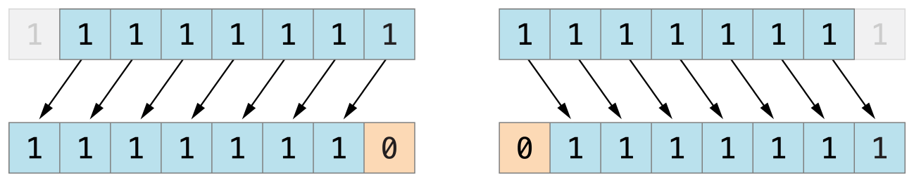
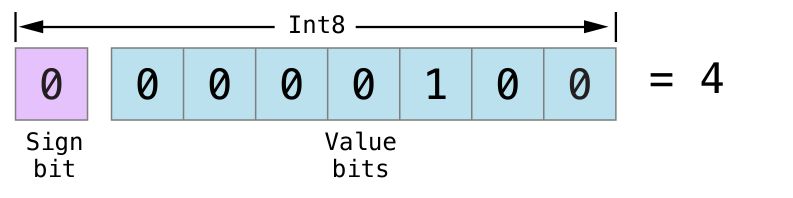

<!--
.. title: Swift CHS
.. slug: swift-chs
.. date: 2014-08-18 14:20:46 UTC+08:00
.. tags: Swift
.. link:
.. description:
.. type: text
-->

Try highlight.js in [Swift CHS](http://numbbbbb.gitbooks.io/-the-swift-programming-language-/)

<!--TEASER_END-->

  * [ **1.** 欢迎使用 swift ](#chapter1)
    * [ **1.1.** 关于 swift ](#swift)
    * [ **1.2.** swift 初见 ](#a_swift_tour)
    * [ **1.3.** swift 版本历史记录 ](#revision_history)
  * [ **2.** swift 教程 ](#chapter2)
    * [ **2.1.** 基础部分 ](#the_basics)
    * [ **2.2.** 基本运算符 ](#basic_operators)
    * [ **2.3.** 字符串和字符 ](#strings_and_characters)
    * [ **2.4.** 集合类型 ](#collection_types)
    * [ **2.5.** 控制流 ](#control_flow)
    * [ **2.6.** 函数 ](#functions)
    * [ **2.7.** 闭包 ](#closures)
    * [ **2.8.** 枚举 ](#enumerations)
    * [ **2.9.** 类和结构体 ](#classes_and_structures)
    * [ **2.10.** 属性 ](#properties)
    * [ **2.11.** 方法 ](#methods)
    * [ **2.12.** 下标脚本 ](#subscripts)
    * [ **2.13.** 继承 ](#inheritance)
    * [ **2.14.** 构造过程 ](#initialization)
    * [ **2.15.** 析构过程 ](#deinitialization)
    * [ **2.16.** 自动引用计数 ](#automatic_reference_counting)
    * [ **2.17.** 可选链 ](#optional_chaining)
    * [ **2.18.** 类型转换 ](#type_casting)
    * [ **2.19.** 嵌套类型 ](#nested_types)
    * [ **2.20.** 扩展 ](#extensions)
    * [ **2.21.** 协议 ](#protocols)
    * [ **2.22.** 泛型 ](#generics)
    * [ **2.23.** 权限控制 ](#access control)
    * [ **2.24.** 高级操作符 ](#advanced_operators)
  * [ **3.** 语言参考 ](#chapter3)
    * [ **3.1.** 关于语言参考 ](#about_the_language_reference)
    * [ **3.2.** 词法结构 ](#lexical_structure)
    * [ **3.3.** 类型 ](#types)
    * [ **3.4.** 表达式 ](#expressions)
    * [ **3.5.** 语句 ](#statements)
    * [ **3.6.** 声明 ](#declarations)
    * [ **3.7.** 特性 ](#attributes)
    * [ **3.8.** 模式 ](#patterns)
    * [ **3.9.** 泛型参数 ](#generic_parameters_and_arguments)
    * [ **3.10.** 语法总结 ](#summary_of_the_grammar)
  * [ **4.** 苹果官方blog官方翻译 ](#chapter4)
    * [ **4.1.** access control 权限控制的黑与白 ](#access_control)
    * [ **4.2.** 造个类型不是梦-白话swift类型创建 ](#type_custom)
    * [ **4.3.** WWDC里面的那个“大炮打气球” ](#ballons)

<a name="chapter1"></a>
# 欢迎使用 Swift

在本章中您将了解 Swift 的特性和开发历史，并对 Swift 有一个初步的了解。


<a name="swift"></a>
# 关于 Swift
-----------------

Swift 是一种新的编程语言，用于编写 iOS 和 OS X 应用。Swift 结合了 C 和 Objective-C 的优点并且不受 C 兼容性的限制。Swift 采用安全的编程模式并添加了很多新特性，这将使编程更简单，更灵活，也更有趣。Swift 是基于成熟而且倍受喜爱的 Cocoa 和 Cocoa Touch 框架，它的降临将重新定义软件开发。

Swift 的开发从很久之前就开始了。为了给 Swift 打好基础，苹果公司改进了编译器，调试器和框架结构。我们使用自动引用计数（Automatic Reference Counting, ARC）来简化内存管理。我们在 Foundation 和 Cocoa 的基础上构建框架栈并将其标准化。Objective-C 本身支持块、集合语法和模块，所以框架可以轻松支持现代编程语言技术。正是得益于这些基础工作，我们现在才能发布这样一个用于未来苹果软件开发的新语言。

Objective-C 开发者对 Swift 并不会感到陌生。它采用了 Objective-C 的命名参数以及动态对象模型，可以无缝对接到现有的 Cocoa 框架，并且可以兼容 Objective-C 代码。在此基础之上，Swift 还有许多新特性并且支持过程式编程和面向对象编程。

Swift 对于初学者来说也很友好。它是第一个既满足工业标准又像脚本语言一样充满表现力和趣味的编程语言。它支持代码预览，这个革命性的特性可以允许程序员在不编译和运行应用程序的前提下运行 Swift 代码并实时查看结果。

Swift 将现代编程语言的精华和苹果工程师文化的智慧结合了起来。编译器对性能进行了优化，编程语言对开发进行了优化，两者互不干扰，鱼与熊掌兼得。Swift 既可以用于开发 “hello, world” 这样的小程序，也可以用于开发一套完整的操作系统。所有的这些特性让 Swift 对于开发者和苹果来说都是一项值得的投资。

Swift 是编写 iOS 和 OS X 应用的极佳手段，并将伴随着新的特性和功能持续演进。我们对 Swift 充满信心，你还在等什么！


<a name="a_swift_tour"></a>
# Swift 初见

---

本页内容包括：

-   [简单值（Simple Values）](#simple_values)
-   [控制流（Control Flow）](#control_flow)
-   [函数和闭包（Functions and Closures）](#functions_and_closures)
-   [对象和类（Objects and Classes）](#objects_and_classes)
-   [枚举和结构体（Enumerations and Structures）](#enumerations_and_structures)
-   [协议和扩展（Protocols and Extensions）](#protocols_and_extensions)
-   [泛型（Generics）](#generics)

通常来说，编程语言教程中的第一个程序应该在屏幕上打印“Hello, world”。在 Swift 中，可以用一行代码实现：

```swift
println("Hello, world")
```

如果你写过 C 或者 Objective-C 代码，那你应该很熟悉这种形式——在 Swift 中，这行代码就是一个完整的程序。你不需要为了输入输出或者字符串处理导入一个单独的库。全局作用域中的代码会被自动当做程序的入口点，所以你也不需要`main`函数。你同样不需要在每个语句结尾写上分号。

这个教程会通过一系列编程例子来让你对 Swift 有初步了解，如果你有什么不理解的地方也不用担心——任何本章介绍的内容都会在后面的章节中详细讲解。

> 注意：
> 为了获得最好的体验，在 Xcode 当中使用代码预览功能。代码预览功能可以让你编辑代码并实时看到运行结果。
> <a href="https://github.com/numbbbbb/the-swift-programming-language-in-chinese/raw/gh-pages/source/chapter1/GuidedTour.playground.zip">打开Playground</a>

<a name="simple_values"></a>
## 简单值

使用`let`来声明常量，使用`var`来声明变量。一个常量的值，在编译的时候，并不需要有明确的值，但是你只能为它赋值一次。也就是说你可以用常量来表示这样一个值：你只需要决定一次，但是需要使用很多次。

```swift
var myVariable = 42
myVariable = 50
let myConstant = 42
```

常量或者变量的类型必须和你赋给它们的值一样。然而，声明时类型是可选的，声明的同时赋值的话，编译器会自动推断类型。在上面的例子中，编译器推断出`myVariable`是一个整数（integer）因为它的初始值是整数。

如果初始值没有提供足够的信息（或者没有初始值），那你需要在变量后面声明类型，用冒号分割。

```swift
let implicitInteger = 70
let implicitDouble = 70.0
let explicitDouble: Double = 70
```

> 练习：
> 创建一个常量，显式指定类型为`Float`并指定初始值为4。

值永远不会被隐式转换为其他类型。如果你需要把一个值转换成其他类型，请显式转换。

```swift
let label = "The width is"
let width = 94
let widthLabel = label + String(width)
```
> 练习：
> 删除最后一行中的`String`，错误提示是什么？

有一种更简单的把值转换成字符串的方法：把值写到括号中，并且在括号之前写一个反斜杠。例如：

```swift
let apples = 3
let oranges = 5
let appleSummary = "I have \(apples) apples."
let fruitSummary = "I have \(apples + oranges) pieces of fruit."
```

> 练习：
> 使用`\()`来把一个浮点计算转换成字符串，并加上某人的名字，和他打个招呼。

使用方括号`[]`来创建数组和字典，并使用下标或者键（key）来访问元素。

```swift
var shoppingList = ["catfish", "water", "tulips", "blue paint"]
shoppingList[1] = "bottle of water"
```

```swift
var occupations = [
    "Malcolm": "Captain",
    "Kaylee": "Mechanic",
]
occupations["Jayne"] = "Public Relations"
```

要创建一个空数组或者字典，使用初始化语法。

```swift
let emptyArray = String[]()
let emptyDictionary = Dictionary<String, Float>()
```

如果类型信息可以被推断出来，你可以用`[]`和`[:]`来创建空数组和空字典——就像你声明变量或者给函数传参数的时候一样。

```swift
shoppingList = []   // 去逛街并买点东西
```

<a name="control_flow"></a>
## 控制流

使用`if`和`switch`来进行条件操作，使用`for-in`、`for`、`while`和`do-while`来进行循环。包裹条件和循环变量括号可以省略，但是语句体的大括号是必须的。

```swift
let individualScores = [75, 43, 103, 87, 12]
var teamScore = 0
for score in individualScores {
    if score > 50 {
        teamScore += 3
    } else {
        teamScore += 1
    }
}
teamScore
```

在`if`语句中，条件必须是一个布尔表达式——这意味着像`if score { ... }`这样的代码将报错，而不会隐形地与 0 做对比。

你可以一起使用`if`和`let`来处理值缺失的情况。有些变量的值是可选的。一个可选的值可能是一个具体的值或者是`nil`，表示值缺失。在类型后面加一个问号来标记这个变量的值是可选的。

```swift
var optionalString: String? = "Hello"
optionalString == nil

var optionalName: String? = "John Appleseed"
var greeting = "Hello!"
if let name = optionalName {
    greeting = "Hello, \(name)"
}
```

> 练习：
> 把`optionalName`改成`nil`，greeting会是什么？添加一个`else`语句，当`optionalName`是`nil`时给greeting赋一个不同的值。

如果变量的可选值是`nil`，条件会判断为`false`，大括号中的代码会被跳过。如果不是`nil`，会将值赋给`let`后面的常量，这样代码块中就可以使用这个值了。

`switch`支持任意类型的数据以及各种比较操作——不仅仅是整数以及测试相等。

```swift
let vegetable = "red pepper"
switch vegetable {
case "celery":
    let vegetableComment = "Add some raisins and make ants on a log."
case "cucumber", "watercress":
    let vegetableComment = "That would make a good tea sandwich."
case let x where x.hasSuffix("pepper"):
    let vegetableComment = "Is it a spicy \(x)?"
default:
    let vegetableComment = "Everything tastes good in soup."
}
```

> 练习：
> 删除`default`语句，看看会有什么错误？

运行`switch`中匹配到的子句之后，程序会退出`switch`语句，并不会继续向下运行，所以不需要在每个子句结尾写`break`。

你可以使用`for-in`来遍历字典，需要两个变量来表示每个键值对。

```swift
let interestingNumbers = [
    "Prime": [2, 3, 5, 7, 11, 13],
    "Fibonacci": [1, 1, 2, 3, 5, 8],
    "Square": [1, 4, 9, 16, 25],
]
var largest = 0
for (kind, numbers) in interestingNumbers {
    for number in numbers {
        if number > largest {
            largest = number
        }
    }
}
largest
```

> 练习：
> 添加另一个变量来记录哪种类型的数字是最大的。

使用`while`来重复运行一段代码直到不满足条件。循环条件可以在开头也可以在结尾。

```swift
var n = 2
while n < 100 {
    n = n * 2
}
n

var m = 2
do {
    m = m * 2
} while m < 100
m
```

你可以在循环中使用`..`来表示范围，也可以使用传统的写法，两者是等价的：

```swift
var firstForLoop = 0
for i in 0..3 {
    firstForLoop += i
}
firstForLoop

var secondForLoop = 0
for var i = 0; i < 3; ++i {
    secondForLoop += 1
}
secondForLoop
```

使用`..`创建的范围不包含上界，如果想包含的话需要使用`...`。

<a name="functions_and_closures"></a>
## 函数和闭包

使用`func`来声明一个函数，使用名字和参数来调用函数。使用`->`来指定函数返回值。

```swift
func greet(name: String, day: String) -> String {
    return "Hello \(name), today is \(day)."
}
greet("Bob", "Tuesday")
```

> 练习：
> 删除`day`参数，添加一个参数来表示今天吃了什么午饭。

使用一个元组来返回多个值。

```swift
func getGasPrices() -> (Double, Double, Double) {
    return (3.59, 3.69, 3.79)
}
getGasPrices()
```

函数可以带有可变个数的参数，这些参数在函数内表现为数组的形式：

```swift
func sumOf(numbers: Int...) -> Int {
    var sum = 0
    for number in numbers {
        sum += number
    }
    return sum
}
sumOf()
sumOf(42, 597, 12)
```

> 练习：
> 写一个计算参数平均值的函数。

函数可以嵌套。被嵌套的函数可以访问外侧函数的变量，你可以使用嵌套函数来重构一个太长或者太复杂的函数。

```swift
func returnFifteen() -> Int {
    var y = 10
    func add() {
        y += 5
    }
    add()
    return y
}
returnFifteen()
```

函数是第一等类型，这意味着函数可以作为另一个函数的返回值。

```swift
func makeIncrementer() -> (Int -> Int) {
    func addOne(number: Int) -> Int {
        return 1 + number
    }
    return addOne
}
var increment = makeIncrementer()
increment(7)
```

函数也可以当做参数传入另一个函数。

```swift
func hasAnyMatches(list: Int[], condition: Int -> Bool) -> Bool {
    for item in list {
        if condition(item) {
            return true
        }
    }
    return false
}
func lessThanTen(number: Int) -> Bool {
    return number < 10
}
var numbers = [20, 19, 7, 12]
hasAnyMatches(numbers, lessThanTen)
```

函数实际上是一种特殊的闭包，你可以使用`{}`来创建一个匿名闭包。使用`in`将参数和返回值类型声明与闭包函数体进行分离。

```swift
numbers.map({
    (number: Int) -> Int in
    let result = 3 * number
    return result
})
```

> 练习：
> 重写闭包，对所有奇数返回0。

有很多种创建闭包的方法。如果一个闭包的类型已知，比如作为一个回调函数，你可以忽略参数的类型和返回值。单个语句闭包会把它语句的值当做结果返回。

```swift
numbers.map({ number in 3 * number })
```

你可以通过参数位置而不是参数名字来引用参数——这个方法在非常短的闭包中非常有用。当一个闭包作为最后一个参数传给一个函数的时候，它可以直接跟在括号后面。

```swift
sort([1, 5, 3, 12, 2]) { $0 > $1 }
```

<a name="objects_and_classes"></a>
## 对象和类

使用`class`和类名来创建一个类。类中属性的声明和常量、变量声明一样，唯一的区别就是它们的上下文是类。同样，方法和函数声明也一样。

```swift
class Shape {
    var numberOfSides = 0
    func simpleDescription() -> String {
        return "A shape with \(numberOfSides) sides."
    }
}
```

> 练习：
> 使用`let`添加一个常量属性，再添加一个接收一个参数的方法。

要创建一个类的实例，在类名后面加上括号。使用点语法来访问实例的属性和方法。

```swift
var shape = Shape()
shape.numberOfSides = 7
var shapeDescription = shape.simpleDescription()
```

这个版本的`Shape`类缺少了一些重要的东西：一个构造函数来初始化类实例。使用`init`来创建一个构造器。

```swift
class NamedShape {
    var numberOfSides: Int = 0
    var name: String

    init(name: String) {
        self.name = name
    }

    func simpleDescription() -> String {
        return "A shape with \(numberOfSides) sides."
    }
}
```

注意`self`被用来区别实例变量。当你创建实例的时候，像传入函数参数一样给类传入构造器的参数。每个属性都需要赋值——无论是通过声明（就像`numberOfSides`）还是通过构造器（就像`name`）。

如果你需要在删除对象之前进行一些清理工作，使用`deinit`创建一个析构函数。

子类的定义方法是在它们的类名后面加上父类的名字，用冒号分割。创建类的时候并不需要一个标准的根类，所以你可以忽略父类。

子类如果要重写父类的方法的话，需要用`override`标记——如果没有添加`override`就重写父类方法的话编译器会报错。编译器同样会检测`override`标记的方法是否确实在父类中。

```swift
class Square: NamedShape {
    var sideLength: Double

    init(sideLength: Double, name: String) {
        self.sideLength = sideLength
        super.init(name: name)
        numberOfSides = 4
    }

    func area() ->  Double {
        return sideLength * sideLength
    }

    override func simpleDescription() -> String {
        return "A square with sides of length \(sideLength)."
    }
}
let test = Square(sideLength: 5.2, name: "my test square")
test.area()
test.simpleDescription()
```

> 练习：
> 创建`NamedShape`的另一个子类`Circle`，构造器接收两个参数，一个是半径一个是名称，实现`area`和`describe`方法。

属性可以有 getter 和 setter 。

```swift
class EquilateralTriangle: NamedShape {
    var sideLength: Double = 0.0

    init(sideLength: Double, name: String) {
        self.sideLength = sideLength
        super.init(name: name)
        numberOfSides = 3
    }

    var perimeter: Double {
    get {
        return 3.0 * sideLength
    }
    set {
        sideLength = newValue / 3.0
    }
    }

    override func simpleDescription() -> String {
        return "An equilateral triagle with sides of length \(sideLength)."
    }
}
var triangle = EquilateralTriangle(sideLength: 3.1, name: "a triangle")
triangle.perimeter
triangle.perimeter = 9.9
triangle.sideLength
```

在`perimeter`的 setter 中，新值的名字是`newValue`。你可以在`set`之后显式的设置一个名字。

注意`EquilateralTriangle`类的构造器执行了三步：

1. 设置子类声明的属性值
2. 调用父类的构造器
3. 改变父类定义的属性值。其他的工作比如调用方法、getters和setters也可以在这个阶段完成。

如果你不需要计算属性，但是仍然需要在设置一个新值之前或者之后运行代码，使用`willSet`和`didSet`。

比如，下面的类确保三角形的边长总是和正方形的边长相同。

```swift
class TriangleAndSquare {
    var triangle: EquilateralTriangle {
    willSet {
        square.sideLength = newValue.sideLength
    }
    }
    var square: Square {
    willSet {
        triangle.sideLength = newValue.sideLength
    }
    }
    init(size: Double, name: String) {
        square = Square(sideLength: size, name: name)
        triangle = EquilateralTriangle(sideLength: size, name: name)
    }
}
var triangleAndSquare = TriangleAndSquare(size: 10, name: "another test shape")
triangleAndSquare.square.sideLength
triangleAndSquare.triangle.sideLength
triangleAndSquare.square = Square(sideLength: 50, name: "larger square")
triangleAndSquare.triangle.sideLength
```

类中的方法和一般的函数有一个重要的区别，函数的参数名只在函数内部使用，但是方法的参数名需要在调用的时候显式说明（除了第一个参数）。默认情况下，方法的参数名和它在方法内部的名字一样，不过你也可以定义第二个名字，这个名字被用在方法内部。

```swift
class Counter {
    var count: Int = 0
    func incrementBy(amount: Int, numberOfTimes times: Int) {
        count += amount * times
    }
}
var counter = Counter()
counter.incrementBy(2, numberOfTimes: 7)
```

处理变量的可选值时，你可以在操作（比如方法、属性和子脚本）之前加`?`。如果`?`之前的值是`nil`，`?`后面的东西都会被忽略，并且整个表达式返回`nil`。否则，`?`之后的东西都会被运行。在这两种情况下，整个表达式的值也是一个可选值。

```swift
let optionalSquare: Square? = Square(sideLength: 2.5, name: "optional square")
let sideLength = optionalSquare?.sideLength
```

<a name="enumerations_and_structure"></a>
## 枚举和结构体

使用`enum`来创建一个枚举。就像类和其他所有命名类型一样，枚举可以包含方法。

```swift
enum Rank: Int {
    case Ace = 1
    case Two, Three, Four, Five, Six, Seven, Eight, Nine, Ten
    case Jack, Queen, King
    func simpleDescription() -> String {
        switch self {
        case .Ace:
            return "ace"
        case .Jack:
            return "jack"
        case .Queen:
            return "queen"
        case .King:
            return "king"
        default:
            return String(self.toRaw())
        }
    }
}
let ace = Rank.Ace
let aceRawValue = ace.toRaw()
```

> 练习：
> 写一个函数，通过比较它们的原始值来比较两个`Rank`值。

在上面的例子中，枚举原始值的类型是`Int`，所以你只需要设置第一个原始值。剩下的原始值会按照顺序赋值。你也可以使用字符串或者浮点数作为枚举的原始值。

使用`toRaw`和`fromRaw`函数来在原始值和枚举值之间进行转换。

```swift
if let convertedRank = Rank.fromRaw(3) {
    let threeDescription = convertedRank.simpleDescription()
}
```

枚举的成员值是实际值，并不是原始值的另一种表达方法。实际上，如果原始值没有意义，你不需要设置。

```swift
enum Suit {
    case Spades, Hearts, Diamonds, Clubs
    func simpleDescription() -> String {
        switch self {
        case .Spades:
            return "spades"
        case .Hearts:
            return "hearts"
        case .Diamonds:
            return "diamonds"
        case .Clubs:
            return "clubs"
        }
    }

}
let hearts = Suit.Hearts
let heartsDescription = hearts.simpleDescription()
```

> 练习：
> 给`Suit`添加一个`color`方法，对`spades`和`clubs`返回“black”，对`hearts`和`diamonds`返回“red”。

注意，有两种方式可以引用`Hearts`成员：给`hearts`常量赋值时，枚举成员`Suit.Hearts`需要用全名来引用，因为常量没有显式指定类型。在`switch`里，枚举成员使用缩写`.Hearts`来引用，因为`self`的值已经知道是一个`suit`。已知变量类型的情况下你可以使用缩写。

使用`struct`来创建一个结构体。结构体和类有很多相同的地方，比如方法和构造器。它们之间最大的一个区别就是
结构体是传值，类是传引用。

```swift
struct Card {
    var rank: Rank
    var suit: Suit
    func simpleDescription() -> String {
        return "The \(rank.simpleDescription()) of \
        (suit.simpleDescription())"
    }
}
let threeOfSpades = Card(rank: .Three, suit: .Spades)
let threeOfSpadesDescription = threeOfSpades.simpleDescription()
```

> 练习：
> 给`Card`添加一个方法，创建一副完整的扑克牌并把每张牌的 rank 和 suit 对应起来。

一个枚举成员的实例可以有实例值。相同枚举成员的实例可以有不同的值。创建实例的时候传入值即可。实例值和原始值是不同的：枚举成员的原始值对于所有实例都是相同的，而且你是在定义枚举的时候设置原始值。

例如，考虑从服务器获取日出和日落的时间。服务器会返回正常结果或者错误信息。

```swift
enum ServerResponse {
    case Result(String, String)
    case Error(String)
}

let success = ServerResponse.Result("6:00 am", "8:09 pm")
let failure = ServerResponse.Error("Out of cheese.")

switch success {
case let .Result(sunrise, sunset):
    let serverResponse = "Sunrise is at \(sunrise) and sunset is at \(sunset)."
case let .Error(error):
    let serverResponse = "Failure...  \(error)"
}
```

> 练习：
> 给`ServerResponse`和`switch`添加第三种情况。

注意如何从`ServerResponse`中提取日升和日落时间。

<a name="protocols_and_extensions"></a>
## 协议和扩展

使用`protocol`来声明一个协议。

```swift
protocol ExampleProtocol {
    var simpleDescription: String { get }
    mutating func adjust()
}
```

类、枚举和结构体都可以实现协议。

```swift
class SimpleClass: ExampleProtocol {
    var simpleDescription: String = "A very simple class."
    var anotherProperty: Int = 69105
    func adjust() {
        simpleDescription += "  Now 100% adjusted."
    }
}
var a = SimpleClass()
a.adjust()
let aDescription = a.simpleDescription

struct SimpleStructure: ExampleProtocol {
    var simpleDescription: String = "A simple structure"
    mutating func adjust() {
        simpleDescription += " (adjusted)"
    }
}
var b = SimpleStructure()
b.adjust()
let bDescription = b.simpleDescription
```

> 练习：
> 写一个实现这个协议的枚举。

注意声明`SimpleStructure`时候`mutating`关键字用来标记一个会修改结构体的方法。`SimpleClass`的声明不需要标记任何方法因为类中的方法经常会修改类。

使用`extension`来为现有的类型添加功能，比如新的方法和参数。你可以使用扩展来改造定义在别处，甚至是从外部库或者框架引入的一个类型，使得这个类型遵循某个协议。

```swift
extension Int: ExampleProtocol {
    var simpleDescription: String {
    return "The number \(self)"
    }
    mutating func adjust() {
        self += 42
    }
}
7.simpleDescription
```

> 练习：
> 给`Double`类型写一个扩展，添加`absoluteValue`功能。

你可以像使用其他命名类型一样使用协议名——例如，创建一个有不同类型但是都实现一个协议的对象集合。当你处理类型是协议的值时，协议外定义的方法不可用。

```swift
let protocolValue: ExampleProtocol = a
protocolValue.simpleDescription
// protocolValue.anotherProperty  // Uncomment to see the error
```

即使`protocolValue`变量运行时的类型是`simpleClass`，编译器会把它的类型当做`ExampleProtocol`。这表示你不能调用类在它实现的协议之外实现的方法或者属性。

<a name="generics"></a>
## 泛型

在尖括号里写一个名字来创建一个泛型函数或者类型。

```swift
func repeat<ItemType>(item: ItemType, times: Int) -> ItemType[] {
    var result = ItemType[]()
    for i in 0..times {
        result += item
    }
    return result
}
repeat("knock", 4)
```

你也可以创建泛型类、枚举和结构体。

```swift
// Reimplement the Swift standard library's optional type
enum OptionalValue<T> {
    case None
    case Some(T)
}
var possibleInteger: OptionalValue<Int> = .None
possibleInteger = .Some(100)
```

在类型名后面使用`where`来指定对类型的需求，比如，限定类型实现某一个协议，限定两个类型是相同的，或者限定某个类必须有一个特定的父类

```swift
func anyCommonElements <T, U where T: Sequence, U: Sequence, T.GeneratorType.Element: Equatable, T.GeneratorType.Element == U.GeneratorType.Element> (lhs: T, rhs: U) -> Bool {
    for lhsItem in lhs {
        for rhsItem in rhs {
            if lhsItem == rhsItem {
                return true
            }
        }
    }
    return false
}
anyCommonElements([1, 2, 3], [3])
```

> 练习：
> 修改`anyCommonElements`函数来创建一个函数，返回一个数组，内容是两个序列的共有元素。

简单起见，你可以忽略`where`，只在冒号后面写协议或者类名。` <T: Equatable>`和`<T where T: Equatable>`是等价的。


<a name="revision_history"></a>
# Swift 版本历史记录

---

本页内容包括：

-   [XCode6 Beta5 Swift语法文档更新](#xcode6_beta5)
-   [XCode6 Beta4 Swift语法文档更新](#xcode6_beta4)
-   [XCode6 Beta3 Swift语法文档更新](#xcode6_beta3)
-   [XCode6 Beta2 Swift语法文档更新](#xcode6_beta2)
-   [XCode6 Beta1 Swift语法文档更新](#xcode6_beta1)
-   XCode6下载: [老码云盘下载](http://pan.baidu.com/disk/home#from=share_pan_logo&path=%252F%25E8%2580%2581%25E7%25A0%2581%25E4%25BA%2591%25E7%259B%2598-XCode6%252FXCode6-Beta5)

以下部分是针对XCode6每一次Beta版本直至正式版发布，Swift语法部分的更新归类


<a name="xcode6_beta5"></a>
### XCode6 Beta5中Swift语法更新

<table class="graybox" border="0" cellspacing="0" cellpadding="5">
<thead>
	<tr>
		<th scope="col" width="100">发布日期</th>
        <th scope="col">语法变更记录</th>
    </tr>
</thead>
<tbody>
	<tr>
	<td scope="row">2014-08-04</td>
    <td><ul class="list-bullet">
		<li><p>
  			<a href="https://developer.apple.com/library/prerelease/ios/documentation/Swift/Conceptual/Swift_Programming_Language/TheBasics.html#//apple_ref/doc/uid/TP40014097-CH5-XID_478">可选类型（Optionals）</a> 若有值时，不再隐式的转换为 <code>true</code>，同样，若无值时，也不再隐式的转换为 <code>false</code>, 这是为了避免在判别 optional <code>Bool</code> 的值时产生困惑。 替代的方案是，用<code>==</code> 或 <code>!=</code> 运算符显式地去判断Optinal是否是 <code>nil</code>，以确认其是否包含值。
		</li>
		<li><p>
  			Swift新增了一个 <a href="https://developer.apple.com/library/prerelease/ios/documentation/Swift/Conceptual/Swift_Programming_Language/BasicOperators.html#//apple_ref/doc/uid/TP40014097-CH6-XID_124" data-id="//apple_ref/doc/uid/TP40014097-CH6-XID_124">Nil合并运算符（Nil Coalescing Operator）</a> (<code>a ?? b</code>), 该表达式中，如果Optional <code>a</code>的值存在，则取得它并返回，若Optional <code>a</code>为<code>nil</code>，则返回默认值 <code>b</code>
		</li>
		<li><p>
			更新和扩展 <a href="https://developer.apple.com/library/prerelease/ios/documentation/Swift/Conceptual/Swift_Programming_Language/StringsAndCharacters.html#//apple_ref/doc/uid/TP40014097-CH7-XID_434">字符串的比较（Comparing Strings）</a> 章节，用以反映和展示'字符串和字符的比较'，以及'前缀（prefix）/后缀(postfix)比较'都开始基于扩展字符集(extended grapheme clusters)规范的等价比较.
		</li>
		<li><p>
			现在，你可以通过 <a href="https://developer.apple.com/library/prerelease/ios/documentation/Swift/Conceptual/Swift_Programming_Language/OptionalChaining.html#//apple_ref/doc/uid/TP40014097-CH21-XID_356">可选链（Optional Chaining）</a>来：给属性设值，将其赋给一个下标脚注（subscript）; 或调用一个变异（mutating）方法或运算符。对此，章节——<a href="https://developer.apple.com/library/prerelease/ios/documentation/Swift/Conceptual/Swift_Programming_Language/OptionalChaining.html#//apple_ref/doc/uid/TP40014097-CH21-XID_364">通过可选链访问属性（Accessing Properties Through Optional Chaining）</a>的内容已经被相应的更新。而章节——<a href="https://developer.apple.com/library/prerelease/ios/documentation/Swift/Conceptual/Swift_Programming_Language/OptionalChaining.html#//apple_ref/doc/uid/TP40014097-CH21-XID_361">通过可选链调用方法（Calling Methods Through Optional Chaining</a>中，关于检查方法调用是否成功的例子，已被扩展为展示如何检查一个属性是否被设值成功。

		</li>
		<li><p>
  			在章节可选链中，增加一个新的小节 <a href="https://developer.apple.com/library/prerelease/ios/documentation/Swift/Conceptual/Swift_Programming_Language/OptionalChaining.html#//apple_ref/doc/uid/TP40014097-CH21-XID_364">访问可选类型的下标脚注（Accessing Subscripts of Optional Type）</a>
		</li>
		<li><p>
  			更新章节 <a href="CollectionTypes.html#//apple_ref/doc/uid/TP40014097-CH8-XID_176" data-id="//apple_ref/doc/uid/TP40014097-CH8-XID_176">访问和修改数组(Accessing and Modifying an Array)</a> 以标示：从该版本起，不能再通过<code>+=</code> 运算符给一个数组添加一个新的项。. 对应的替代方案是, 使<code>append</code> 方法, 或者通过<code>+=</code>运算符来添加一个<b>只有一个项的数组</b>（single-item Array）.</li>
		<li><p>
  			添加了一个提示：在 <a href="https://developer.apple.com/library/prerelease/ios/documentation/Swift/Conceptual/Swift_Programming_Language/BasicOperators.html#//apple_ref/doc/uid/TP40014097-CH6-XID_126">范围运算符（Range Operators）</a>中，比如， <code>a...b</code> 和 <code>a..&lt;b</code> ，起始值<code>a</code>不能大于结束值<code>b</code>.
		</li>
		<li><p>
  			重写了<a href="https://developer.apple.com/library/prerelease/ios/documentation/Swift/Conceptual/Swift_Programming_Language/Inheritance.html#//apple_ref/doc/uid/TP40014097-CH17-XID_293">继承（Inheritance）</a> 这一章：删除了本章中关于构造器重写的介绍性报道；转而将更多的注意力放到新增的部分——子类的新功能，以及如何通过重写（overrides）修改已有的功能。另外，小节 <a href="https://developer.apple.com/library/prerelease/ios/documentation/Swift/Conceptual/Swift_Programming_Language/Inheritance.html#//apple_ref/doc/uid/TP40014097-CH17-XID_301">重写属性的Getters和Setters（Overriding Property Getters and Setters）</a> 中的例子已经被替换为展示如何重写一个 <code>description</code> 属性. (而关于如何在子类的构造器中修改继承属性的默认值的例子，已经被移到 <a href="https://developer.apple.com/library/prerelease/ios/documentation/Swift/Conceptual/Swift_Programming_Language/Inheritance.html#//apple_ref/doc/uid/TP40014097-CH17-XID_293">构造过程（Initialization）</a> 这一章.)
		</li>
		<li><p>
  			更新了 <a href="https://developer.apple.com/library/prerelease/ios/documentation/Swift/Conceptual/Swift_Programming_Language/Initialization.html#//apple_ref/doc/uid/TP40014097-CH18-XID_331">构造器的继承与重写（Initializer Inheritance and Overriding）</a> 小节以标示： 重写一个特定的构造器必须使用 <code>override</code> 修改器.
		</li>
		<li><p>
  			更新 <a href="https://developer.apple.com/library/prerelease/ios/documentation/Swift/Conceptual/Swift_Programming_Language/Initialization.html#//apple_ref/doc/uid/TP40014097-CH18-XID_339"> Required构造器（Required Initializers）</a> 小节以标示：<code>required</code> 修改器现在需要出现在所有子类的required构造器的声明中, 而required构造器的实现，现在可以仅从父类自动继承。
		</li>
		<li><p>
  			中置（Infix）的 <a href="https://developer.apple.com/library/prerelease/ios/documentation/Swift/Conceptual/Swift_Programming_Language/AdvancedOperators.html#//apple_ref/doc/uid/TP40014097-CH27-XID_80">运算符函数（Operator Functions）</a> 不再需要<code>@infix</code> 属性.
		</li>
		<li><p>
  			<a href="https://developer.apple.com/library/prerelease/ios/documentation/Swift/Conceptual/Swift_Programming_Language/RevisionHistory.html#//apple_ref/doc/uid/TP40014097-CH40-XID_1631">前置和后置运算符(Prefix and Postfix Operators)</a>的<code>@prefix</code> 和 <code>@postfix</code> 属性，已变更为 <code>prefix</code> 和 <code>postfix</code> 声明修改器（declaration modifiers）.
		</li>
			<li><p>
  			增加一条注解：当Prefix和postfix运算符被作用于同一个操作数时，关于<a href="AdvancedOperators.html#//apple_ref/doc/uid/TP40014097-CH27-XID_81" data-id="//apple_ref/doc/uid/TP40014097-CH27-XID_81">前置和后置运算符(Prefix and Postfix Operators)</a>的顺序(postfix运算符会先被执行)
		</li>
		<li><p>
  			在运算符函数（Operator functions）中， <a href="https://developer.apple.com/library/prerelease/ios/documentation/Swift/Conceptual/Swift_Programming_Language/AdvancedOperators.html#//apple_ref/doc/uid/TP40014097-CH27-XID_82" data-id="//apple_ref/doc/uid/TP40014097-CH27-XID_82">组合赋值运算符（Compound Assignment Operators）</a> 不再使用 <code>@assignment</code> 属性来定义函数.
		</li>
		<li><p>
			在这个版本中，在定义<a href="https://developer.apple.com/library/prerelease/ios/documentation/Swift/Conceptual/Swift_Programming_Language/AdvancedOperators.html#//apple_ref/doc/uid/TP40014097-CH27-XID_85">自定义操作符（Custom Operators）</a> 时，<b>修改器（Modifiers）的出现顺序发生变化</b>。比如， 现在，你该编写 <code>prefix operator</code>， 而不是 <code>operator prefix</code>.
		</li>
		<li><p>
  			增加信息：关于<code>dynamic</code> 声明修改器（declaration modifier），于章节 <a href="Declarations.html#//apple_ref/doc/uid/TP40014097-CH34-XID_705" data-id="//apple_ref/doc/uid/TP40014097-CH34-XID_705">声明修改器（Declaration Modifiers）</a>.
		</li>
		<li><p>
  			增加信息：<a href="https://developer.apple.com/library/prerelease/ios/documentation/Swift/Conceptual/Swift_Programming_Language/#//apple_ref/doc/uid/TP40014097-CH30-XID_886">字面量Literals</a> 的类型推导（type inference）
		</li>
		<li><p>
  			为章节<a href="https://developer.apple.com/library/prerelease/ios/documentation/Swift/Conceptual/Swift_Programming_Language/Declarations.html#//apple_ref/doc/uid/TP40014097-CH34-XID_597">Curried Functions</a>添加了更多的信息.
		</li>
		</ul>
	</td>
  </tr>
</tbody>
</table>
<a name="xcode6_beta4"></a>
#### XCode6 Beta4中Swift语法更新
<table class="graybox" border="0" cellspacing="0" cellpadding="5">
<thead>
	<tr>
		<th scope="col" width="100">发布日期</th>
        <th scope="col">语法变更记录</th>
    </tr>
</thead>
<tbody>
	<tr>
	<td scope="row">2014-07-21</td>
    <td><ul class="list-bullet">
		<li><p>
  			加入新的章节  <a href=https://developer.apple.com/library/prerelease/ios/documentation/Swift/Conceptual/Swift_Programming_Language/AccessControl.html#//apple_ref/doc/uid/TP40014097-CH41-XID_29">权限控制（Access Control）</a>.
		</li>
		<li><p>
  			更新了章节 <a href="https://developer.apple.com/library/prerelease/ios/documentation/Swift/Conceptual/Swift_Programming_Language/StringsAndCharacters.html#//apple_ref/doc/uid/TP40014097-CH7-XID_413">字符串和字符（Strings and Characters）</a> 用以表明，在Swift中，<code>Character</code> 类型现在代表的是扩展字符集(extended grapheme cluster)中的一个Unicode，为此，新增了小节 <a href="https://developer.apple.com/library/prerelease/ios/documentation/Swift/Conceptual/Swift_Programming_Language/StringsAndCharacters.html#//apple_ref/doc/uid/TP40014097-CH7-XID_431">Extended Grapheme Clusters</a> 。同时，为小节 <a href="https://developer.apple.com/library/prerelease/ios/documentation/Swift/Conceptual/Swift_Programming_Language/StringsAndCharacters.html#//apple_ref/doc/uid/TP40014097-CH7-XID_428">Unicode标量（Unicode Scalars）</a> 和 <a href="https://developer.apple.com/library/prerelease/ios/documentation/Swift/Conceptual/Swift_Programming_Language/StringsAndCharacters.html#//apple_ref/doc/uid/TP40014097-CH7-XID_434">字符串比较（Comparing Strings）</a>增加了更多内容.
		</li>
		<li><p>
			更新章节<a href="https://developer.apple.com/library/prerelease/ios/documentation/Swift/Conceptual/Swift_Programming_Language/#//apple_ref/doc/uid/TP40014097-CH30-XID_856">字符串字面量（String Literals）</a>：在一个字符串中，Unicode标量（Unicode scalars） 以 <code>\u{n}</code>的形式来表示, <code>n</code> 是一个最大可以有8位的16进制数（hexadecimal digits）
		</li>
		<li><p>
  			<code>NSString</code> <code>length</code> 属性已被映射到Swift的内建 <code>String</code>类型。（注意，这两属性的类型是<code>utf16<color="red">C</color>ount</code>,而非 <code>utf16count</code>）.
		</li>
		<li><p>
  			Swift的内建 <code>String</code> 类型不再拥有 <code>uppercaseString</code> 和 <code>lowercaseString</code> 属性.其对应部分在章节 <a href="https://developer.apple.com/library/prerelease/ios/documentation/Swift/Conceptual/Swift_Programming_Language/StringsAndCharacters.html#//apple_ref/doc/uid/TP40014097-CH7-XID_413">字符串和字符（Strings and Characters）</a>已经被删除, 并且各种对应的代码用例也已被更新.
		</li>
		<li><p>
  			加入新的章节  <a href="https://developer.apple.com/library/prerelease/ios/documentation/Swift/Conceptual/Swift_Programming_Language/Initialization.html#//apple_ref/doc/uid/TP40014097-CH18-XID_315">没有外部名的构造器参数（Initializer Parameters Without External Names）</a>.
		</li>
		<li><p>
  			加入新的章节  <a href="https://developer.apple.com/library/prerelease/ios/documentation/Swift/Conceptual/Swift_Programming_Language/Initialization.html#//apple_ref/doc/uid/TP40014097-CH18-XID_339"> Required构造器（Required Initializers）</a>.
		</li>
		<li><p>
  			加入新的章节 <a href="https://developer.apple.com/library/prerelease/ios/documentation/Swift/Conceptual/Swift_Programming_Language/Functions.html#//apple_ref/doc/uid/TP40014097-CH10-XID_252">可选元祖（函数）返回类型 （Optional Tuple Return Types）</a>.
		</li>
		<li><p>
  			更新章节 <a href="https://developer.apple.com/library/prerelease/ios/documentation/Swift/Conceptual/Swift_Programming_Language/TheBasics.html#//apple_ref/doc/uid/TP40014097-CH5-XID_453">类型标注（Type Annotations）</a> ：多个相关变量可以用“类型标注”（type annotaion）在同一行中声明为同一类型。
		</li>
		<li><p>
  			 <code>@optional</code>, <code>@lazy</code>, <code>@final</code>,  <code>@required</code> 等关键字被更新为 <code>optional</code>, <code>lazy</code>, <code>final</code>, <code>required</code> <a href="https://developer.apple.com/library/prerelease/ios/documentation/Swift/Conceptual/Swift_Programming_Language/Declarations.html#//apple_ref/doc/uid/TP40014097-CH34-XID_705">参见声明修改器（Declaration Modifiers）</a>.
		</li>
		<li><p>
  			更新整本书 —— 引用 <code>..&lt;</code> 作为<a href="BasicOperators.html#//apple_ref/doc/uid/TP40014097-CH6-XID_128" data-id="//apple_ref/doc/uid/TP40014097-CH6-XID_128">区间运算符（Half-Open Range Operator）</a> (取代原先的<code>..</code> ).
		</li>
		<li><p>
  			更新了小节 <a href="https://developer.apple.com/library/prerelease/ios/documentation/Swift/Conceptual/Swift_Programming_Language/CollectionTypes.html#//apple_ref/doc/uid/TP40014097-CH8-XID_185">读取和修改字典（Accessing and Modifying a Dictionary）</a>：  <code>Dictionary</code> 现在早呢更加了一个 Boolean型的属性： <code>isEmpty</code>
		</li>
		<li><p>
  			解释了哪些字符（集）可被用来定义<a href="https://developer.apple.com/library/prerelease/ios/documentation/Swift/Conceptual/Swift_Programming_Language/AdvancedOperators.html#//apple_ref/doc/uid/TP40014097-CH27-XID_85">自定义操作符 （Custom Operators）</a>
		</li>
		<li><p>
  			<code>nil</code> 和布尔运算中的 <code>true</code> 和 <code>false</code> 现在被定义为字面量<a href="https://developer.apple.com/library/prerelease/ios/documentation/Swift/Conceptual/Swift_Programming_Language/#//apple_ref/doc/uid/TP40014097-CH30-XID_886">Literals</a>.
		</li>
	</ul></td>
	</td>
  </tr>
</tbody>
</table>

<a name="xcode6_beta3"></a>
#### XCode6 Beta3中Swift语法更新
<table class="graybox" border="0" cellspacing="0" cellpadding="5">
<thead>
	<tr>
		<th scope="col" width="100">发布日期</th>
        <th scope="col">语法变更记录</th>
    </tr>
</thead>
<tbody>
	<tr>
	<td scope="row">2014-07-7</td>
    <td><ul class="list-bullet">
		<li><p>
  			Swift 中的数组 （<code>Array</code>） 类型从现在起具备了完整的值语义。具体信息被更新到 <a href="https://developer.apple.com/library/prerelease/ios/documentation/Swift/Conceptual/Swift_Programming_Language/CollectionTypes.html#//apple_ref/doc/uid/TP40014097-CH8-XID_170">集合的可变性（Mutability of Collections）</a> 和 <a href="https://developer.apple.com/library/prerelease/ios/documentation/Swift/Conceptual/Swift_Programming_Language/CollectionTypes.html#//apple_ref/doc/uid/TP40014097-CH8-XID_172">数组（Arrays）</a> 两小节，以反映这个新的变化. 此外，还解释了如何 <a href="https://developer.apple.com/library/prerelease/ios/documentation/Swift/Conceptual/Swift_Programming_Language/ClassesAndStructures.html#//apple_ref/doc/uid/TP40014097-CH13-XID_150">给Strings, Arrays和Dictionaries进行赋值和拷贝 （Assignment and Copy Behavior for Strings, Arrays, and Dictionaries）</a>.
		</li>
		<li><p>
			<a href="https://developer.apple.com/library/prerelease/ios/documentation/Swift/Conceptual/Swift_Programming_Language/CollectionTypes.html#//apple_ref/doc/uid/TP40014097-CH8-XID_173">数组类型速记语法（Array Type Shorthand Syntax）</a> 从 <code>SomeType[]</code>.更新为<code>[SomeType]</code>
		</li>
		<li><p>
  			加入新的小节：<a href="https://developer.apple.com/library/prerelease/ios/documentation/Swift/Conceptual/Swift_Programming_Language/CollectionTypes.html#//apple_ref/doc/uid/TP40014097-CH8-XID_182">字典类型的速记语法（Dictionary Type Shorthand Syntax)</a>.： <code>[KeyType: ValueType]</code>.
		</li>
		<li><p>
  			加入新的小节：<a href="https://developer.apple.com/library/prerelease/ios/documentation/Swift/Conceptual/Swift_Programming_Language/CollectionTypes.html#//apple_ref/doc/uid/TP40014097-CH8-XID_189">字典键类型的哈希值（Hash Values for Dictionary Key Types)</a>.
		</li>
		<li><p>
 			例子 <a href="https://developer.apple.com/library/prerelease/ios/documentation/Swift/Conceptual/Swift_Programming_Language/Closures.html#//apple_ref/doc/uid/TP40014097-CH11-XID_154">闭包表达式 (Closure Expressions)</a> 中使用新的全局函数 <code>sorted</code> 取代原先的全局函数 <code>sort</code> 去展示如何返回一个全新的数组.
		</li>
		<li><p>
			更新关于 <a href="https://developer.apple.com/library/prerelease/ios/documentation/Swift/Conceptual/Swift_Programming_Language/Initialization.html#//apple_ref/doc/uid/TP40014097-CH18-XID_320">结构体逐一成员构造器 （Memberwise Initializers for Structure Types）</a> 的描述：即使结构体的成员<b>没有默认值</b>，逐一成员构造器也可以自动获得。
		</li>
		<li><p>
			<a href="https://developer.apple.com/library/prerelease/ios/documentation/Swift/Conceptual/Swift_Programming_Language/BasicOperators.html#//apple_ref/doc/uid/TP40014097-CH6-XID_128">区间运算符（Half-Open Range Operator）</a>由<code>..</code>更新到<code>..<</code><p>
		<li><p>
			添加一个例子 <a href="https://developer.apple.com/library/prerelease/ios/documentation/Swift/Conceptual/Swift_Programming_Language/Generics.html#//apple_ref/doc/uid/TP40014097-CH26-XID_285">扩展一个泛型（Extending a Generic Type）</a>
		</li>
	</ul></td>
	</td>
  </tr>
</tbody>
</table>
<a name="xcode6_beta2"></a>
#### XCode6 Beta2中Swift语法更新
<table class="graybox" border="0" cellspacing="0" cellpadding="5">
<thead>
	<tr>
		<th scope="col" width="100">发布日期</th>
        <th scope="col">语法变更记录</th>
    </tr>
</thead>
<tbody>
	<tr>
	<td scope="row">2014-07-7</td>
    <td><ul class="list-bullet">
		<li><p>
			发布新的文档用以详述Swift - 苹果公司针对iOS和OS X应用的全新开发语言
		</li>
	</td>
	</tr>
</tbody>
</table>
<a name="xcode6_beta1"></a>
#### XCode6 Beta1中Swift语法更新
<table class="graybox" border="0" cellspacing="0" cellpadding="5">
<thead>
	<tr>
		<th scope="col" width="100">发布日期</th>
        <th scope="col">语法变更记录</th>
    </tr>
</thead>
<tbody>
	<tr>
	<td scope="row">2014-06-3</td>
    <td><ul class="list-bullet">
		<li><p>
			苹果全球开发者大会WWDC2014召开，发布了苹果最新的开发语言Swift，并释放出XCode6 Beta1版本
		</li>
	</td>
	</tr>
</tbody>
</table>

<a name="chapter2"></a>
# Swift 教程

本章介绍了 Swift 的各种特性及其使用方法，是全书的核心部分。


<a name="the_basics"></a>
# 基础部分
-----------------

本页包含内容：

- [常量和变量](#constants_and_variables)
- [注释](#comments)
- [分号](#semicolons)
- [整数](#integers)
- [浮点数](#floating-point_numbers)
- [类型安全和类型推断](#type_safety_and_type_inference)
- [数值型字面量](#numeric_literals)
- [数值型类型转换](#numeric_type_conversion)
- [类型别名](#type_aliases)
- [布尔值](#booleans)
- [元组](#tuples)
- [可选](#optionals)
- [断言](#assertions)

Swift 是一门进行 iOS 和 OS X 应用开发的新语言。然而，如果你有 C 或者 Objective-C 开发经验的话，你会发现 Swift 的很多内容都是你熟悉的。

Swift 包含了 C 和 Objective-C 上所有基础数据类型，`Int`表示整型值；`Double`和`Float`表示浮点型值；`Bool`是布尔型值；`String`是文本型数据。Swift 还提供了两个基本的集合类型，`Array`和`Dictionary`，详见[集合类型](#04_Collection_Types)。

就像 C 语言一样，Swift 使用变量来进行存储并通过变量名来关联值。在 Swift 中，广泛的使用着值不可变的变量，它们就是常量，而且比 C 语言的常量更强大。在 Swift 中，如果你要处理的值不需要改变，那使用常量可以让你的代码更加安全并且更清晰地表达你的意图。

除了我们熟悉的类型，Swift 还增加了 Objective-C 中没有的高阶数据类型比如元组（Tuple）。元组可以让你创建或者传递一组数据，比如作为函数的返回值时，你可以用一个元组可以返回多个值。

Swift 还增加了可选（Optional）类型，用于处理值缺失的情况。可选表示“那儿有一个值，并且它等于 x ”或者“那儿没有值”。可选有点像在 Objective-C 中使用`nil`，但是它可以用在任何类型上，不仅仅是类。可选类型比 Objective-C 中的`nil`指针更加安全也更具表现力，它是 Swift 许多强大特性的重要组成部分。

Swift 是一门类型安全的语言，可选类型就是一个很好的例子。Swift 可以让你清楚地知道值的类型。如果你的代码期望得到一个`String`，类型安全会阻止你不小心传入一个`Int`。你可以在开发阶段尽早发现并修正错误。

<a name="constants_and_variables"></a>
## 常量和变量

常量和变量把一个名字（比如`maximumNumberOfLoginAttempts`或者`welcomeMessage`）和一个指定类型的值（比如数字`10`或者字符串`"Hello"`）关联起来。常量的值一旦设定就不能改变，而变量的值可以随意更改。

### 声明常量和变量

常量和变量必须在使用前声明，用`let`来声明常量，用`var`来声明变量。下面的例子展示了如何用常量和变量来记录用户尝试登录的次数：

```swift
let maximumNumberOfLoginAttempts = 10
var currentLoginAttempt = 0
```

这两行代码可以被理解为：

“声明一个名字是`maximumNumberOfLoginAttempts`的新常量，并给它一个值`10`。然后，声明一个名字是`currentLoginAttempt`的变量并将它的值初始化为`0`.”

在这个例子中，允许的最大尝试登录次数被声明为一个常量，因为这个值不会改变。当前尝试登录次数被声明为一个变量，因为每次尝试登录失败的时候都需要增加这个值。

你可以在一行中声明多个常量或者多个变量，用逗号隔开：

```swift
var x = 0.0, y = 0.0, z = 0.0
```

>注意：
如果你的代码中有不需要改变的值，请使用`let`关键字将它声明为常量。只将需要改变的值声明为变量。

### 类型标注

当你声明常量或者变量的时候可以加上_类型标注（type annotation）_，说明常量或者变量中要存储的值的类型。如果要添加类型标注，需要在常量或者变量名后面加上一个冒号和空格，然后加上类型名称。

这个例子给`welcomeMessage`变量添加了类型标注，表示这个变量可以存储`String`类型的值：

```swift
var welcomeMessage: String
```

声明中的冒号代表着“是...类型”，所以这行代码可以被理解为：

“声明一个类型为`String`，名字为`welcomeMessage`的变量。”

“类型为`String`”的意思是“可以存储任意`String`类型的值。”

`welcomeMessage`变量现在可以被设置成任意字符串：

```swift
welcomeMessage = "Hello"
```

> 注意：
一般来说你很少需要写类型标注。如果你在声明常量或者变量的时候赋了一个初始值，Swift可以推断出这个常量或者变量的类型，请参考[类型安全和类型推断](#type_safety_and_type_inference)。在上面的例子中，没有给`welcomeMessage`赋初始值，所以变量`welcomeMessage`的类型是通过一个类型标注指定的，而不是通过初始值推断的。

### 常量和变量的命名

你可以用任何你喜欢的字符作为常量和变量名，包括 Unicode 字符：

```swift
let π = 3.14159
let 你好 = "你好世界"
let 🐶🐮 = "dogcow"
```

常量与变量名不能包含数学符号，箭头，保留的（或者非法的）Unicode 码位，连线与制表符。也不能以数字开头，但是可以在常量与变量名的其他地方包含数字。

一旦你将常量或者变量声明为确定的类型，你就不能使用相同的名字再次进行声明，或者改变其存储的值的类型。同时，你也不能将常量与变量进行互转。

> 注意：
如果你需要使用与Swift保留关键字相同的名称作为常量或者变量名，你可以使用反引号（`）将关键字包围的方式将其作为名字使用。无论如何，你应当避免使用关键字作为常量或变量名，除非你别无选择。

你可以更改现有的变量值为其他同类型的值，在下面的例子中，`friendlyWelcome`的值从`"Hello!"`改为了`"Bonjour!"`:

```swift
var friendlyWelcome = "Hello!"
friendlyWelcome = "Bonjour!"
// friendlyWelcome 现在是 "Bonjour!"
```

与变量不同，常量的值一旦被确定就不能更改了。尝试这样做会导致编译时报错：

```swift
let languageName = "Swift"
languageName = "Swift++"
// 这会报编译时错误 - languageName 不可改变
```

### 输出常量和变量

你可以用`println`函数来输出当前常量或变量的值:

```swift
println(friendlyWelcome)
// 输出 "Bonjour!"
```

`println`是一个用来输出的全局函数，输出的内容会在最后换行。如果你用 Xcode，`println`将会输出内容到“console”面板上。(另一种函数叫`print`，唯一区别是在输出内容最后不会换行。)

`println`函数输出传入的`String`值：

```swift
println("This is a string")
// 输出 "This is a string"
```

与 Cocoa 里的`NSLog`函数类似的是，`println`函数可以输出更复杂的信息。这些信息可以包含当前常量和变量的值。

Swift 用_字符串插值（string interpolation）_的方式把常量名或者变量名当做占位符加入到长字符串中，Swift 会用当前常量或变量的值替换这些占位符。将常量或变量名放入圆括号中，并在开括号前使用反斜杠将其转义：

```swift
println("The current value of friendlyWelcome is \(friendlyWelcome)")
// 输出 "The current value of friendlyWelcome is Bonjour!
```

> 注意：
字符串插值所有可用的选项，请参考[字符串插值](#string_interpolation)。

<a name="comments"></a>
## 注释
请将你的代码中的非执行文本注释成提示或者笔记以方便你将来阅读。Swift 的编译器将会在编译代码时自动忽略掉注释部分。

Swift 中的注释与C 语言的注释非常相似。单行注释以双正斜杠（`//`）作为起始标记:

```swift
// 这是一个注释
```

你也可以进行多行注释，其起始标记为单个正斜杠后跟随一个星号（`/*`），终止标记为一个星号后跟随单个正斜杠（`*/`）:

```swift
/* 这是一个,
多行注释 */
```

与 C 语言多行注释不同，Swift 的多行注释可以嵌套在其它的多行注释之中。你可以先生成一个多行注释块，然后在这个注释块之中再嵌套成第二个多行注释。终止注释时先插入第二个注释块的终止标记，然后再插入第一个注释块的终止标记：

```swift
/* 这是第一个多行注释的开头
/* 这是第二个被嵌套的多行注释 */
这是第一个多行注释的结尾 */
```

通过运用嵌套多行注释，你可以快速方便的注释掉一大段代码，即使这段代码之中已经含有了多行注释块。

<a name="semicolons"></a>
## 分号
与其他大部分编程语言不同，Swift 并不强制要求你在每条语句的结尾处使用分号（`;`），当然，你也可以按照你自己的习惯添加分号。有一种情况下必须要用分号，即你打算在同一行内写多条独立的语句：

```swift
let cat = "🐱"; println(cat)
// 输出 "🐱"
```

<a name="integers"></a>
## 整数

整数就是没有小数部分的数字，比如`42`和`-23`。整数可以是`有符号`（正、负、零）或者`无符号`（正、零）。

Swift 提供了8，16，32和64位的有符号和无符号整数类型。这些整数类型和 C 语言的命名方式很像，比如8位无符号整数类型是`UInt8`，32位有符号整数类型是`Int32`。就像 Swift 的其他类型一样，整数类型采用大写命名法。

### 整数范围

你可以访问不同整数类型的`min`和`max`属性来获取对应类型的最大值和最小值：

```swift
let minValue = UInt8.min  // minValue 为 0，是 UInt8 类型的最小值
let maxValue = UInt8.max  // maxValue 为 255，是 UInt8 类型的最大值
```

### Int

一般来说，你不需要专门指定整数的长度。Swift 提供了一个特殊的整数类型`Int`，长度与当前平台的原生字长相同：

* 在32位平台上，`Int`和`Int32`长度相同。
* 在64位平台上，`Int`和`Int64`长度相同。

除非你需要特定长度的整数，一般来说使用`Int`就够了。这可以提高代码一致性和可复用性。即使是在32位平台上，`Int`可以存储的整数范围也可以达到`-2147483648`~`2147483647`，大多数时候这已经足够大了。

### UInt

Swift 也提供了一个特殊的无符号类型`UInt`，长度与当前平台的原生字长相同：

* 在32位平台上，`UInt`和`UInt32`长度相同。
* 在64位平台上，`UInt`和`UInt64`长度相同。

> 注意：
尽量不要使用`UInt`，除非你真的需要存储一个和当前平台原生字长相同的无符号整数。除了这种情况，最好使用`Int`，即使你要存储的值已知是非负的。统一使用`Int`可以提高代码的可复用性，避免不同类型数字之间的转换，并且匹配数字的类型推断，请参考[类型安全和类型推断](#type_safety_and_type_inference)。

<a name="floating-point_numbers"></a>
## 浮点数

浮点数是有小数部分的数字，比如`3.14159`，`0.1`和`-273.15`。

浮点类型比整数类型表示的范围更大，可以存储比`Int`类型更大或者更小的数字。Swift 提供了两种有符号浮点数类型：

* `Double`表示64位浮点数。当你需要存储很大或者很高精度的浮点数时请使用此类型。
* `Float`表示32位浮点数。精度要求不高的话可以使用此类型。

> 注意：
`Double`精确度很高，至少有15位数字，而`Float`最少只有6位数字。选择哪个类型取决于你的代码需要处理的值的范围。

<a name="type_safety_and_type_inference"></a>
## 类型安全和类型推断

Swift 是一个_类型安全（type safe）_的语言。类型安全的语言可以让你清楚地知道代码要处理的值的类型。如果你的代码需要一个`String`，你绝对不可能不小心传进去一个`Int`。

由于 Swift 是类型安全的，所以它会在编译你的代码时进行_类型检查（type checks）_，并把不匹配的类型标记为错误。这可以让你在开发的时候尽早发现并修复错误。

当你要处理不同类型的值时，类型检查可以帮你避免错误。然而，这并不是说你每次声明常量和变量的时候都需要显式指定类型。如果你没有显式指定类型，Swift 会使用_类型推断（type inference）_来选择合适的类型。有了类型推断，编译器可以在编译代码的时候自动推断出表达式的类型。原理很简单，只要检查你赋的值即可。

因为有类型推断，和 C 或者 Objective-C 比起来 Swift 很少需要声明类型。常量和变量虽然需要明确类型，但是大部分工作并不需要你自己来完成。

当你声明常量或者变量并赋初值的时候类型推断非常有用。当你在声明常量或者变量的时候赋给它们一个_字面量（literal value 或 literal）_即可触发类型推断。（字面量就是会直接出现在你代码中的值，比如`42`和`3.14159`。）

例如，如果你给一个新常量赋值`42`并且没有标明类型，Swift 可以推断出常量类型是`Int`，因为你给它赋的初始值看起来像一个整数：

```swift
let meaningOfLife = 42
// meaningOfLife 会被推测为 Int 类型
```

同理，如果你没有给浮点字面量标明类型，Swift 会推断你想要的是`Double`：

```swift
let pi = 3.14159
// pi 会被推测为 Double 类型
```

当推断浮点数的类型时，Swift 总是会选择`Double`而不是`Float`。

如果表达式中同时出现了整数和浮点数，会被推断为`Double`类型：

```swift
let anotherPi = 3 + 0.14159
// anotherPi 会被推测为 Double 类型
```

原始值`3`没有显式声明类型，而表达式中出现了一个浮点字面量，所以表达式会被推断为`Double`类型。

<a name="numeric_literals"></a>
## 数值型字面量

整数字面量可以被写作：

* 一个十进制数，没有前缀
* 一个二进制数，前缀是`0b`
* 一个八进制数，前缀是`0o`
* 一个十六进制数，前缀是`0x`

下面的所有整数字面量的十进制值都是`17`:

```swift
let decimalInteger = 17
let binaryInteger = 0b10001       // 二进制的17
let octalInteger = 0o21           // 八进制的17
let hexadecimalInteger = 0x11     // 十六进制的17
```

浮点字面量可以是十进制（没有前缀）或者是十六进制（前缀是`0x`）。小数点两边必须有至少一个十进制数字（或者是十六进制的数字）。浮点字面量还有一个可选的_指数（exponent）_，在十进制浮点数中通过大写或者小写的`e`来指定，在十六进制浮点数中通过大写或者小写的`p`来指定。

如果一个十进制数的指数为`exp`，那这个数相当于基数和10^exp的乘积：
* `1.25e2` 表示 1.25 × 10^2，等于 `125.0`。
* `1.25e-2` 表示 1.25 × 10^-2，等于 `0.0125`。

如果一个十六进制数的指数为`exp`，那这个数相当于基数和2^exp的乘积：
* `0xFp2` 表示 15 × 2^2，等于 `60.0`。
* `0xFp-2` 表示 15 × 2^-2，等于 `3.75`。

下面的这些浮点字面量都等于十进制的`12.1875`：

```swift
let decimalDouble = 12.1875
let exponentDouble = 1.21875e1
let hexadecimalDouble = 0xC.3p0
```

数值类字面量可以包括额外的格式来增强可读性。整数和浮点数都可以添加额外的零并且包含下划线，并不会影响字面量：

```swift
let paddedDouble = 000123.456
let oneMillion = 1_000_000
let justOverOneMillion = 1_000_000.000_000_1
```

<a name="numeric_type_conversion"></a>
## 数值型类型转换

通常来讲，即使代码中的整数常量和变量已知非负，也请使用`Int`类型。总是使用默认的整数类型可以保证你的整数常量和变量可以直接被复用并且可以匹配整数类字面量的类型推断。
只有在必要的时候才使用其他整数类型，比如要处理外部的长度明确的数据或者为了优化性能、内存占用等等。使用显式指定长度的类型可以及时发现值溢出并且可以暗示正在处理特殊数据。

### 整数转换

不同整数类型的变量和常量可以存储不同范围的数字。`Int8`类型的常量或者变量可以存储的数字范围是`-128`~`127`，而`UInt8`类型的常量或者变量能存储的数字范围是`0`~`255`。如果数字超出了常量或者变量可存储的范围，编译的时候会报错：

```swift
let cannotBeNegative: UInt8 = -1
// UInt8 类型不能存储负数，所以会报错
let tooBig: Int8 = Int8.max + 1
// Int8 类型不能存储超过最大值的数，所以会报错
```

由于每种整数类型都可以存储不同范围的值，所以你必须根据不同情况选择性使用数值型类型转换。这种选择性使用的方式，可以预防隐式转换的错误并让你的代码中的类型转换意图变得清晰。

要将一种数字类型转换成另一种，你要用当前值来初始化一个期望类型的新数字，这个数字的类型就是你的目标类型。在下面的例子中，常量`twoThousand`是`UInt16`类型，然而常量`one`是`UInt8`类型。它们不能直接相加，因为它们类型不同。所以要调用`UInt16(one)`来创建一个新的`UInt16`数字并用`one`的值来初始化，然后使用这个新数字来计算：

```swift
let twoThousand: UInt16 = 2_000
let one: UInt8 = 1
let twoThousandAndOne = twoThousand + UInt16(one)
```

现在两个数字的类型都是`UInt16`，可以进行相加。目标常量`twoThousandAndOne`的类型被推断为`UInt16`，因为它是两个`UInt16`值的和。

`SomeType(ofInitialValue)`是调用 Swift 构造器并传入一个初始值的默认方法。在语言内部，`UInt16`有一个构造器，可以接受一个`UInt8`类型的值，所以这个构造器可以用现有的`UInt8`来创建一个新的`UInt16`。注意，你并不能传入任意类型的值，只能传入`UInt16`内部有对应构造器的值。不过你可以扩展现有的类型来让它可以接收其他类型的值（包括自定义类型），请参考[扩展](#20_Extensions)。

### 整数和浮点数转换

整数和浮点数的转换必须显式指定类型：

```swift
let three = 3
let pointOneFourOneFiveNine = 0.14159
let pi = Double(three) + pointOneFourOneFiveNine
// pi 等于 3.14159，所以被推测为 Double 类型
```

这个例子中，常量`three`的值被用来创建一个`Double`类型的值，所以加号两边的数类型须相同。如果不进行转换，两者无法相加。

浮点数到整数的反向转换同样行，整数类型可以用`Double`或者`Float`类型来初始化：

```swift
let integerPi = Int(pi)
// integerPi 等于 3，所以被推测为 Int 类型
```

当用这种方式来初始化一个新的整数值时，浮点值会被截断。也就是说`4.75`会变成`4`，`-3.9`会变成`-3`。

> 注意：
结合数字类常量和变量不同于结合数字类字面量。字面量`3`可以直接和字面量`0.14159`相加，因为数字字面量本身没有明确的类型。它们的类型只在编译器需要求值的时候被推测。

<a name="type_aliases"></a>
## 类型别名

_类型别名（type aliases）_就是给现有类型定义另一个名字。你可以使用`typealias`关键字来定义类型别名。

当你想要给现有类型起一个更有意义的名字时，类型别名非常有用。假设你正在处理特定长度的外部资源的数据：

```swift
typealias AudioSample = UInt16
```

定义了一个类型别名之后，你可以在任何使用原始名的地方使用别名：

```swift
var maxAmplitudeFound = AudioSample.min
// maxAmplitudeFound 现在是 0
```

本例中，`AudioSample`被定义为`UInt16`的一个别名。因为它是别名，`AudioSample.min`实际上是`UInt16.min`，所以会给`maxAmplitudeFound`赋一个初值`0`。

<a name="booleans"></a>
## 布尔值

Swift 有一个基本的_布尔（Boolean）_类型，叫做`Bool`。布尔值指_逻辑上的（logical）_，因为它们只能是真或者假。Swift 有两个布尔常量，`true`和`false`：

```swift
let orangesAreOrange = true
let turnipsAreDelicious = false
```

`orangesAreOrange`和`turnipsAreDelicious`的类型会被推断为`Bool`，因为它们的初值是布尔字面量。就像之前提到的`Int`和`Double`一样，如果你创建变量的时候给它们赋值`true`或者`false`，那你不需要将常量或者变量声明为`Bool`类型。初始化常量或者变量的时候如果所赋的值类型已知，就可以触发类型推断，这让 Swift 代码更加简洁并且可读性更高。

当你编写条件语句比如`if`语句的时候，布尔值非常有用：

```swift
if turnipsAreDelicious {
    println("Mmm, tasty turnips!")
} else {
    println("Eww, turnips are horrible.")
}
// 输出 "Eww, turnips are horrible."
```

条件语句，例如`if`，请参考[控制流](#05_Control_Flow)。

如果你在需要使用`Bool`类型的地方使用了非布尔值，Swift 的类型安全机制会报错。下面的例子会报告一个编译时错误：

```swift
let i = 1
if i {
    // 这个例子不会通过编译，会报错
}
```

然而，下面的例子是合法的：

```swift
let i = 1
if i == 1 {
    // 这个例子会编译成功
}
```

`i == 1`的比较结果是`Bool`类型，所以第二个例子可以通过类型检查。类似`i == 1`这样的比较，请参考[基本操作符](#05_Control_Flow)。

和 Swift 中的其他类型安全的例子一样，这个方法可以避免错误并保证这块代码的意图总是清晰的。

<a name="tuples"></a>
## 元组

_元组（tuples）_把多个值组合成一个复合值。元组内的值可以是任意类型，并不要求是相同类型。

下面这个例子中，`(404, "Not Found")`是一个描述 _HTTP 状态码（HTTP status code）_的元组。HTTP 状态码是当你请求网页的时候 web 服务器返回的一个特殊值。如果你请求的网页不存在就会返回一个`404 Not Found`状态码。

```swift
let http404Error = (404, "Not Found")
// http404Error 的类型是 (Int, String)，值是 (404, "Not Found")
```

`(404, "Not Found")`元组把一个`Int`值和一个`String`值组合起来表示 HTTP 状态码的两个部分：一个数字和一个人类可读的描述。这个元组可以被描述为“一个类型为`(Int, String)`的元组”。

你可以把任意顺序的类型组合成一个元组，这个元组可以包含所有类型。只要你想，你可以创建一个类型为`(Int, Int, Int)`或者`(String, Bool)`或者其他任何你想要的组合的元组。

你可以将一个元组的内容_分解（decompose）_成单独的常量和变量，然后你就可以正常使用它们了：

```swift
let (statusCode, statusMessage) = http404Error
println("The status code is \(statusCode)")
// 输出 "The status code is 404"
println("The status message is \(statusMessage)")
// 输出 "The status message is Not Found"
```

如果你只需要一部分元组值，分解的时候可以把要忽略的部分用下划线（`_`）标记：

```swift
let (justTheStatusCode, _) = http404Error
println("The status code is \(justTheStatusCode)")
// 输出 "The status code is 404"
```

此外，你还可以通过下标来访问元组中的单个元素，下标从零开始：

```swift
println("The status code is \(http404Error.0)")
// 输出 "The status code is 404"
println("The status message is \(http404Error.1)")
// 输出 "The status message is Not Found"
```

你可以在定义元组的时候给单个元素命名：

```swift
let http200Status = (statusCode: 200, description: "OK")
```

给元组中的元素命名后，你可以通过名字来获取这些元素的值：

```swift
println("The status code is \(http200Status.statusCode)")
// 输出 "The status code is 200"
println("The status message is \(http200Status.description)")
// 输出 "The status message is OK"
```

作为函数返回值时，元组非常有用。一个用来获取网页的函数可能会返回一个`(Int, String)`元组来描述是否获取成功。和只能返回一个类型的值比较起来，一个包含两个不同类型值的元组可以让函数的返回信息更有用。请参考[函数参数与返回值](#Function_Parameters_and_Return_Values)。

> 注意：
元组在临时组织值的时候很有用，但是并不适合创建复杂的数据结构。如果你的数据结构并不是临时使用，请使用类或者结构体而不是元组。请参考[类和结构体](#09_Classes_and_Structures)。

<a name="optionals"></a>
## 可选类型

使用_可选类型（optionals）_来处理值可能缺失的情况。可选类型表示：

* _有_值，等于 x

或者

* _没有_值

> 注意：
C 和 Objective-C 中并没有可选类型这个概念。最接近的是 Objective-C 中的一个特性，一个方法要不返回一个对象要不返回`nil`，`nil`表示“缺少一个合法的对象”。然而，这只对对象起作用——对于结构体，基本的 C 类型或者枚举类型不起作用。对于这些类型，Objective-C 方法一般会返回一个特殊值（比如`NSNotFound`）来暗示值缺失。这种方法假设方法的调用者知道并记得对特殊值进行判断。然而，Swift 的可选类型可以让你暗示_任意类型_的值缺失，并不需要一个特殊值。

来看一个例子。Swift 的`String`类型有一个叫做`toInt`的方法，作用是将一个`String`值转换成一个`Int`值。然而，并不是所有的字符串都可以转换成一个整数。字符串`"123"`可以被转换成数字`123`，但是字符串`"hello, world"`不行。

下面的例子使用`toInt`方法来尝试将一个`String`转换成`Int`：

```swift
let possibleNumber = "123"
let convertedNumber = possibleNumber.toInt()
// convertedNumber 被推测为类型 "Int?"， 或者类型 "optional Int"
```

因为`toInt`方法可能会失败，所以它返回一个_可选类型（optional）_`Int`，而不是一个`Int`。一个可选的`Int`被写作`Int?`而不是`Int`。问号暗示包含的值是可选类型，也就是说可能包含`Int`值也可能不包含值。（不能包含其他任何值比如`Bool`值或者`String`值。只能是`Int`或者什么都没有。）

### if 语句以及强制解析

你可以使用`if`语句来判断一个可选是否包含值。如果可选类型有值，结果是`true`；如果没有值，结果是`false`。

当你确定可选类型_确实_包含值之后，你可以在可选的名字后面加一个感叹号（`!`）来获取值。这个惊叹号表示“我知道这个可选有值，请使用它。”这被称为可选值的_强制解析（forced unwrapping）_：

```swift
if convertedNumber {
    println("\(possibleNumber) has an integer value of \(convertedNumber!)")
} else {
    println("\(possibleNumber) could not be converted to an integer")
}
// 输出 "123 has an integer value of 123"
```

更多关于`if`语句的内容，请参考[控制流](#05_Control_Flow)。

> 注意：
使用`!`来获取一个不存在的可选值会导致运行时错误。使用`!`来强制解析值之前，一定要确定可选包含一个非`nil`的值。

<a name="optional_binding"></a>
### 可选绑定

使用_可选绑定（optional binding）_来判断可选类型是否包含值，如果包含就把值赋给一个临时常量或者变量。可选绑定可以用在`if`和`while`语句中来对可选类型的值进行判断并把值赋给一个常量或者变量。`if`和`while`语句，请参考[控制流](#05_Control_Flow)。

像下面这样在`if`语句中写一个可选绑定：

```swift
if let constantName = someOptional {
    statements
}
```

你可以像上面这样使用可选绑定来重写`possibleNumber`这个例子：

```swift
if let actualNumber = possibleNumber.toInt() {
    println("\(possibleNumber) has an integer value of \(actualNumber)")
} else {
    println("\(possibleNumber) could not be converted to an integer")
}
// 输出 "123 has an integer value of 123"
```

这段代码可以被理解为：

“如果`possibleNumber.toInt`返回的可选`Int`包含一个值，创建一个叫做`actualNumber`的新常量并将可选包含的值赋给它。”

如果转换成功，`actualNumber`常量可以在`if`语句的第一个分支中使用。它已经被可选类型_包含的_值初始化过，所以不需要再使用`!`后缀来获取它的值。在这个例子中，`actualNumber`只被用来输出转换结果。

你可以在可选绑定中使用常量和变量。如果你想在`if`语句的第一个分支中操作`actualNumber`的值，你可以改成`if var actualNumber`，这样可选类型包含的值就会被赋给一个变量而非常量。

### nil

你可以给可选变量赋值为`nil`来表示它没有值：

```swift
var serverResponseCode: Int? = 404
// serverResponseCode 包含一个可选的 Int 值 404
serverResponseCode = nil
// serverResponseCode 现在不包含值
```

> 注意：
`nil`不能用于非可选的常量和变量。如果你的代码中有常量或者变量需要处理值缺失的情况，请把它们声明成对应的可选类型。

如果你声明一个可选常量或者变量但是没有赋值，它们会自动被设置为`nil`：

```swift
var surveyAnswer: String?
// surveyAnswer 被自动设置为 nil
```

> 注意：
Swift 的`nil`和 Objective-C 中的`nil`并不一样。在 Objective-C 中，`nil`是一个指向不存在对象的指针。在 Swift 中，`nil`不是指针——它是一个确定的值，用来表示值缺失。_任何_类型的可选状态都可以被设置为`nil`，不只是对象类型。

### 隐式解析可选类型

如上所述，可选类型暗示了常量或者变量可以“没有值”。可选可以通过`if`语句来判断是否有值，如果有值的话可以通过可选绑定来解析值。

有时候在程序架构中，第一次被赋值之后，可以确定一个可选类型_总会_有值。在这种情况下，每次都要判断和解析可选值是非常低效的，因为可以确定它总会有值。

这种类型的可选状态被定义为_隐式解析可选类型（implicitly unwrapped optionals）_。把想要用作可选的类型的后面的问号（`String?`）改成感叹号（`String!`）来声明一个隐式解析可选类型。

当可选类型被第一次赋值之后就可以确定之后一直有值的时候，隐式解析可选类型非常有用。隐式解析可选类型主要被用在 Swift 中类的构造过程中，请参考[类实例之间的循环强引用](#strong_reference_cycles_between_class_instances)。

一个隐式解析可选类型其实就是一个普通的可选类型，但是可以被当做非可选类型来使用，并不需要每次都使用解析来获取可选值。下面的例子展示了可选类型`String`和隐式解析可选类型`String`之间的区别：

```swift
let possibleString: String? = "An optional string."
println(possibleString!) // 需要惊叹号来获取值
// 输出 "An optional string."
```

```swift
let assumedString: String! = "An implicitly unwrapped optional string."
println(assumedString)  // 不需要感叹号
// 输出 "An implicitly unwrapped optional string."
```

你可以把隐式解析可选类型当做一个可以自动解析的可选类型。你要做的只是声明的时候把感叹号放到类型的结尾，而不是每次取值的可选名字的结尾。

> 注意：
如果你在隐式解析可选类型没有值的时候尝试取值，会触发运行时错误。和你在没有值的普通可选类型后面加一个惊叹号一样。

你仍然可以把隐式解析可选类型当做普通可选类型来判断它是否包含值：

```swift
if assumedString {
    println(assumedString)
}
// 输出 "An implicitly unwrapped optional string."
```

你也可以在可选绑定中使用隐式解析可选类型来检查并解析它的值：

```swift
if let definiteString = assumedString {
    println(definiteString)
}
// 输出 "An implicitly unwrapped optional string."
```

> 注意：
如果一个变量之后可能变成`nil`的话请不要使用隐式解析可选类型。如果你需要在变量的生命周期中判断是否是`nil`的话，请使用普通可选类型。

<a name="assertions"></a>
## 断言

可选类型可以让你判断值是否存在，你可以在代码中优雅地处理值缺失的情况。然而，在某些情况下，如果值缺失或者值并不满足特定的条件，你的代码可能并不需要继续执行。这时，你可以在你的代码中触发一个_断言（assertion）_来结束代码运行并通过调试来找到值缺失的原因。

### 使用断言进行调试

断言会在运行时判断一个逻辑条件是否为`true`。从字面意思来说，断言“断言”一个条件是否为真。你可以使用断言来保证在运行其他代码之前，某些重要的条件已经被满足。如果条件判断为`true`，代码运行会继续进行；如果条件判断为`false`，代码运行停止，你的应用被终止。

如果你的代码在调试环境下触发了一个断言，比如你在 Xcode 中构建并运行一个应用，你可以清楚地看到不合法的状态发生在哪里并检查断言被触发时你的应用的状态。此外，断言允许你附加一条调试信息。

你可以使用全局`assert`函数来写一个断言。向`assert`函数传入一个结果为`true`或者`false`的表达式以及一条信息，当表达式为`false`的时候这条信息会被显示：

```swift
let age = -3
assert(age >= 0, "A person's age cannot be less than zero")
// 因为 age < 0，所以断言会触发
```

在这个例子中，只有`age >= 0`为`true`的时候代码运行才会继续，也就是说，当`age`的值非负的时候。如果`age`的值是负数，就像代码中那样，`age >= 0`为`false`，断言被触发，结束应用。

断言信息不能使用字符串插值。断言信息可以省略，就像这样：

```swift
assert(age >= 0)
```

### 何时使用断言

当条件可能为假时使用断言，但是最终一定要_保证_条件为真，这样你的代码才能继续运行。断言的适用情景：

* 整数类型的下标索引被传入一个自定义下标脚本实现，但是下标索引值可能太小或者太大。
* 需要给函数传入一个值，但是非法的值可能导致函数不能正常执行。
* 一个可选值现在是`nil`，但是后面的代码运行需要一个非`nil`值。

请参考[下标脚本](#12_Subscripts)和[函数](#06_Functions)。

> 注意：
断言可能导致你的应用终止运行，所以你应当仔细设计你的代码来让非法条件不会出现。然而，在你的应用发布之前，有时候非法条件可能出现，这时使用断言可以快速发现问题。


<a name="basic_operators"></a>
# 基本运算符
-----------------

本页包含内容：

- [术语](#terminology)
- [赋值运算符](#assignment_operator)
- [数值运算符](#arithmetic_operators)
- [组合赋值运算符（Compound Assignment Operators）](#compound_assignment_operators)
- [比较运算符](#comparison_operators)
- [三元条件运算符（Ternary Conditional Operator）](#ternary_conditional_operator)
- [区间运算符](#range_operators)
- [逻辑运算符](#logical_operators)

运算符是检查、改变、合并值的特殊符号或短语。例如，加号`+`将两个数相加（如`let i = 1 + 2`）。复杂些的运算例如逻辑与运算符`&&`（如`if enteredDoorCode && passedRetinaScan`），或让 i 值加1的便捷自增运算符`++i`等。

Swift 支持大部分标准 C 语言的运算符，且改进许多特性来减少常规编码错误。如：赋值符（`=`）不返回值，以防止把想要判断相等运算符（`==`）的地方写成赋值符导致的错误。数值运算符（`+`，`-`，`*`，`/`，`%`等）会检测并不允许值溢出，以此来避免保存变量时由于变量大于或小于其类型所能承载的范围时导致的异常结果。当然允许你使用 Swift 的溢出运算符来实现溢出。详情参见[溢出运算符](#overflow_operators)。

区别于 C 语言，在 Swift 中你可以对浮点数进行取余运算（`%`），Swift 还提供了 C 语言没有的表达两数之间的值的区间运算符，（`a..b`和`a...b`），这方便我们表达一个区间内的数值。

本章节只描述了 Swift 中的基本运算符，[高级运算符](#23_Advanced_Operators)包含了高级运算符，及如何自定义运算符，及如何进行自定义类型的运算符重载。

<a name="terminology"></a>
## 术语

运算符有一元、二元和三元运算符。

- 一元运算符对单一操作对象操作（如`-a`）。一元运算符分前置符和后置运算符，前置运算符需紧排操作对象之前（如`!b`），后置运算符需紧跟操作对象之后（如`i++`）。
- 二元运算符操作两个操作对象（如`2 + 3`），是中置的，因为它们出现在两个操作对象之间。
- 三元运算符操作三个操作对象，和 C 语言一样，Swift 只有一个三元运算符，就是三元条件运算符（`a ? b : c`）。

受运算符影响的值叫操作数，在表达式`1 + 2`中，加号`+`是二元运算符，它的两个操作数是值`1`和`2`。

<a name="assignment_operator"></a>
## 赋值运算符

赋值运算（`a = b`），表示用`b`的值来初始化或更新`a`的值：

```swift
let b = 10
var a = 5
a = b
// a 现在等于 10
```

如果赋值的右边是一个多元组，它的元素可以马上被分解多个常量或变量：

```swiflt
let (x, y) = (1, 2)
// 现在 x 等于 1, y 等于 2
```

与 C 语言和 Objective-C 不同，Swift 的赋值操作并不返回任何值。所以以下代码是错误的：

```swift
if x = y {
    // 此句错误, 因为 x = y 并不返回任何值
}
```

这个特性使你无法把（`==`）错写成（`=`），由于`if x = y`是错误代码，Swift 从底层帮你避免了这些错误代码。

<a name="arithmetic_operators"></a>
## 数值运算

Swift 中所有数值类型都支持了基本的四则运算：

- 加法（`+`）
- 减法（`-`）
- 乘法（`*`）
- 除法（`/`）

```swift
1 + 2       // 等于 3
5 - 3       // 等于 2
2 * 3       // 等于 6
10.0 / 2.5  // 等于 4.0
```

与 C 语言和 Objective-C 不同的是，Swift 默认不允许在数值运算中出现溢出情况。但你可以使用 Swift 的溢出运算符来达到你有目的的溢出（如`a &+ b`）。详情参见[溢出运算符](#overflow_operators)。

加法运算符也可用于`String`的拼接：

```swift
"hello, " + "world"  // 等于 "hello, world"
```

两个`Character`值或一个`String`和一个`Character`值，相加会生成一个新的`String`值：

```swift
let dog: Character = "d"
let cow: Character = "c"
let dogCow = dog + cow
// 译者注: 原来的引号内是很可爱的小狗和小牛, 但win os下不支持表情字符, 所以改成了普通字符
// dogCow 现在是 "dc"
```

详情参见[字符，字符串的拼接](#concatenating_strings_and_characters)。

### 求余运算

求余运算（`a % b`）是计算`b`的多少倍刚刚好可以容入`a`，返回多出来的那部分（余数）。

>注意：
求余运算（`%`）在其他语言也叫取模运算。然而严格说来，我们看该运算符对负数的操作结果，"求余"比"取模"更合适些。

我们来谈谈取余是怎么回事，计算`9 % 4`，你先计算出`4`的多少倍会刚好可以容入`9`中：


2倍，非常好，那余数是1（用橙色标出）

在 Swift 中这么来表达：

```swift
9 % 4    // 等于 1
```

为了得到`a % b`的结果，`%`计算了以下等式，并输出`余数`作为结果：

*a = (b × 倍数) + 余数*

当`倍数`取最大值的时候，就会刚好可以容入`a`中。

把`9`和`4`代入等式中，我们得`1`：

```swift
9 = (4 × 2) + 1
```

同样的方法，我来们计算 `-9 % 4`：

```swift
-9 % 4   // 等于 -1
```

把`-9`和`4`代入等式，`-2`是取到的最大整数：

```swift
-9 = (4 × -2) + -1
```

余数是`-1`。

在对负数`b`求余时，`b`的符号会被忽略。这意味着 `a % b` 和 `a % -b`的结果是相同的。

### 浮点数求余计算

不同于 C 语言和 Objective-C，Swift 中是可以对浮点数进行求余的。

```swift
8 % 2.5 // 等于 0.5
```

这个例子中，`8`除于`2.5`等于`3`余`0.5`，所以结果是一个`Double`值`0.5`。


### 自增和自增运算

和 C 语言一样，Swift 也提供了方便对变量本身加1或减1的自增（`++`）和自减（`--`）的运算符。其操作对象可以是整形和浮点型。
‌
```swift
var i = 0
++i      // 现在 i = 1
```

每调用一次`++i`，`i`的值就会加1。实际上，`++i`是`i = i + 1`的简写，而`--i`是`i = i - 1`的简写。

`++`和`--`既是前置又是后置运算。`++i`，`i++`，`--i`和`i--`都是有效的写法。

我们需要注意的是这些运算符修改了`i`后有一个返回值。如果你只想修改`i`的值，那你就可以忽略这个返回值。但如果你想使用返回值，你就需要留意前置和后置操作的返回值是不同的。

- 当`++`前置的时候，先自増再返回。

- 当`++`后置的时候，先返回再自增。

例如：

```swift
var a = 0
let b = ++a // a 和 b 现在都是 1
let c = a++ // a 现在 2, 但 c 是 a 自增前的值 1
```

上述例子，`let b = ++a`先把`a`加1了再返回`a`的值。所以`a`和`b`都是新值`1`。

而`let c = a++`，是先返回了`a`的值，然后`a`才加1。所以`c`得到了`a`的旧值1，而`a`加1后变成2。

除非你需要使用`i++`的特性，不然推荐你使用`++i`和`--i`，因为先修改后返回这样的行为更符合我们的逻辑。


### 一元负号

数值的正负号可以使用前缀`-`（即一元负号）来切换：

```swift
let three = 3
let minusThree = -three       // minusThree 等于 -3
let plusThree = -minusThree   // plusThree 等于 3, 或 "负负3"
```

一元负号（`-`）写在操作数之前，中间没有空格。

### 一元正号

一元正号（`+`）不做任何改变地返回操作数的值。

```swift
let minusSix = -6
let alsoMinusSix = +minusSix  // alsoMinusSix 等于 -6
```
虽然一元`+`做无用功，但当你在使用一元负号来表达负数时，你可以使用一元正号来表达正数，如此你的代码会具有对称美。


<a name="compound_assignment_operators"></a>
## 复合赋值（Compound Assignment Operators）

如同强大的 C 语言，Swift 也提供把其他运算符和赋值运算（`=`）组合的复合赋值运算符，加赋运算（`+=`）是其中一个例子：

```swift
var a = 1
a += 2 // a 现在是 3
```

表达式`a += 2`是`a = a + 2`的简写，一个加赋运算就把加法和赋值两件事完成了。

>注意：
复合赋值运算没有返回值，`let b = a += 2`这类代码是错误。这不同于上面提到的自增和自减运算符。

在[表达式](#04_Expressions)章节里有复合运算符的完整列表。
‌
<a name="comparison_operators"></a>
## 比较运算

所有标准 C 语言中的比较运算都可以在 Swift 中使用。

- 等于（`a == b`）
- 不等于（`a != b`）
- 大于（`a > b`）
- 小于（`a < b`）
- 大于等于（`a >= b`）
- 小于等于（`a <= b`）

> 注意：
Swift 也提供恒等`===`和不恒等`!==`这两个比较符来判断两个对象是否引用同一个对象实例。更多细节在[类与结构](#09_Classes_and_Structures)。

每个比较运算都返回了一个标识表达式是否成立的布尔值：

```swift
1 == 1   // true, 因为 1 等于 1
2 != 1   // true, 因为 2 不等于 1
2 > 1    // true, 因为 2 大于 1
1 < 2    // true, 因为 1 小于2
1 >= 1   // true, 因为 1 大于等于 1
2 <= 1   // false, 因为 2 并不小于等于 1
```

比较运算多用于条件语句，如`if`条件：

```swift
let name = "world"
if name == "world" {
    println("hello, world")
} else {
    println("I'm sorry \(name), but I don't recognize you")
}
// 输出 "hello, world", 因为 `name` 就是等于 "world"
```

关于`if`语句，请看[控制流](#05_Control_Flow)。

<a name="ternary_conditional_operator"></a>
## 三元条件运算(Ternary Conditional Operator)

三元条件运算的特殊在于它是有三个操作数的运算符，它的原型是 `问题 ? 答案1 : 答案2`。它简洁地表达根据`问题`成立与否作出二选一的操作。如果`问题`成立，返回`答案1`的结果; 如果不成立，返回`答案2`的结果。

使用三元条件运算简化了以下代码：

```swift
if question: {
  answer1
} else {
  answer2
}
```

这里有个计算表格行高的例子。如果有表头，那行高应比内容高度要高出50像素; 如果没有表头，只需高出20像素。

```swift
let contentHeight = 40
let hasHeader = true
let rowHeight = contentHeight + (hasHeader ? 50 : 20)
// rowHeight 现在是 90
```

这样写会比下面的代码简洁：

```swift
let contentHeight = 40
let hasHeader = true
var rowHeight = contentHeight
if hasHeader {
    rowHeight = rowHeight + 50
} else {
    rowHeight = rowHeight + 20
}
// rowHeight 现在是 90
```

第一段代码例子使用了三元条件运算，所以一行代码就能让我们得到正确答案。这比第二段代码简洁得多，无需将`rowHeight`定义成变量，因为它的值无需在`if`语句中改变。

三元条件运算提供有效率且便捷的方式来表达二选一的选择。需要注意的事，过度使用三元条件运算就会由简洁的代码变成难懂的代码。我们应避免在一个组合语句使用多个三元条件运算符。

<a name="range_operators"></a>
## 区间运算符

Swift 提供了两个方便表达一个区间的值的运算符。

### 闭区间运算符
闭区间运算符（`a...b`）定义一个包含从`a`到`b`(包括`a`和`b`)的所有值的区间。
‌
闭区间运算符在迭代一个区间的所有值时是非常有用的，如在`for-in`循环中：

```swift
for index in 1...5 {
    println("\(index) * 5 = \(index * 5)")
}
// 1 * 5 = 5
// 2 * 5 = 10
// 3 * 5 = 15
// 4 * 5 = 20
// 5 * 5 = 25
```

关于`for-in`，请看[控制流](#05_Control_Flow)。

### 半闭区间

半闭区间（`a..b`）定义一个从`a`到`b`但不包括`b`的区间。
之所以称为半闭区间，是因为该区间包含第一个值而不包括最后的值。

半闭区间的实用性在于当你使用一个0始的列表(如数组)时，非常方便地从0数到列表的长度。

```swift
let names = ["Anna", "Alex", "Brian", "Jack"]
let count = names.count
for i in 0..count {
    println("第 \(i + 1) 个人叫 \(names[i])")
}
// 第 1 个人叫 Anna
// 第 2 个人叫 Alex
// 第 3 个人叫 Brian
// 第 4 个人叫 Jack
```

数组有4个元素，但`0..count`只数到3(最后一个元素的下标)，因为它是半闭区间。关于数组，请查阅[数组](#arrays)。

<a name="logical_operators"></a>
## 逻辑运算

逻辑运算的操作对象是逻辑布尔值。Swift 支持基于 C 语言的三个标准逻辑运算。

- 逻辑非（`!a`）
- 逻辑与（`a && b`）
- 逻辑或（`a || b`）

### 逻辑非

逻辑非运算（`!a`）对一个布尔值取反，使得`true`变`false`，`false`变`true`。

它是一个前置运算符，需出现在操作数之前，且不加空格。读作`非 a`，然后我们看以下例子：

```swift
let allowedEntry = false
if !allowedEntry {
    println("ACCESS DENIED")
}
// 输出 "ACCESS DENIED"
```

`if !allowedEntry`语句可以读作 "如果 非 alowed entry。"，接下一行代码只有在如果 "非 allow entry" 为`true`，即`allowEntry`为`false`时被执行。

在示例代码中，小心地选择布尔常量或变量有助于代码的可读性，并且避免使用双重逻辑非运算，或混乱的逻辑语句。

### 逻辑与
逻辑与（`a && b`）表达了只有`a`和`b`的值都为`true`时，整个表达式的值才会是`true`。

只要任意一个值为`false`，整个表达式的值就为`false`。事实上，如果第一个值为`false`，那么是不去计算第二个值的，因为它已经不可能影响整个表达式的结果了。这被称做 "短路计算（short-circuit evaluation）"。

以下例子，只有两个`Bool`值都为`true`的时候才允许进入：

```swift
let enteredDoorCode = true
let passedRetinaScan = false
if enteredDoorCode && passedRetinaScan {
    println("Welcome!")
} else {
    println("ACCESS DENIED")
}
// 输出 "ACCESS DENIED"
```

### 逻辑或
逻辑或（`a || b`）是一个由两个连续的`|`组成的中置运算符。它表示了两个逻辑表达式的其中一个为`true`，整个表达式就为`true`。

同逻辑与运算类似，逻辑或也是"短路计算"的，当左端的表达式为`true`时，将不计算右边的表达式了，因为它不可能改变整个表达式的值了。

以下示例代码中，第一个布尔值（`hasDoorKey`）为`false`，但第二个值（`knowsOverridePassword`）为`true`，所以整个表达是`true`，于是允许进入：

```swift
let hasDoorKey = false
let knowsOverridePassword = true
if hasDoorKey || knowsOverridePassword {
    println("Welcome!")
} else {
    println("ACCESS DENIED")
}
// 输出 "Welcome!"
```

### 组合逻辑

我们可以组合多个逻辑运算来表达一个复合逻辑：

```swift
if enteredDoorCode && passedRetinaScan || hasDoorKey || knowsOverridePassword {
    println("Welcome!")
} else {
    println("ACCESS DENIED")
}
// 输出 "Welcome!"
```

这个例子使用了含多个`&&`和`||`的复合逻辑。但无论怎样，`&&`和`||`始终只能操作两个值。所以这实际是三个简单逻辑连续操作的结果。我们来解读一下：

如果我们输入了正确的密码并通过了视网膜扫描; 或者我们有一把有效的钥匙; 又或者我们知道紧急情况下重置的密码，我们就能把门打开进入。

前两种情况，我们都不满足，所以前两个简单逻辑的结果是`false`，但是我们是知道紧急情况下重置的密码的，所以整个复杂表达式的值还是`true`。

### 使用括号来明确优先级

为了一个复杂表达式更容易读懂，在合适的地方使用括号来明确优先级是很有效的，虽然它并非必要的。在上个关于门的权限的例子中，我们给第一个部分加个括号，使用它看起来逻辑更明确：

```swift
if (enteredDoorCode && passedRetinaScan) || hasDoorKey || knowsOverridePassword {
    println("Welcome!")
} else {
    println("ACCESS DENIED")
}
// 输出 "Welcome!"
```

这括号使得前两个值被看成整个逻辑表达中独立的一个部分。虽然有括号和没括号的输出结果是一样的，但对于读代码的人来说有括号的代码更清晰。可读性比简洁性更重要，请在可以让你代码变清晰地地方加个括号吧！


<a name="strings_and_characters"></a>
# 字符串和字符（Strings and Characters）
-----------------

本页包含内容：

- [字符串字面量](#string_literals)
- [初始化空字符串](#initializing_an_empty_string)
- [字符串可变性](#string_mutability)
- [字符串是值类型](#strings_are_value_types)
- [使用字符](#working_with_characters)
- [计算字符数量](#counting_characters)
- [连接字符串和字符](#concatenating_strings_and_characters)
- [字符串插值](#string_interpolation)
- [比较字符串](#comparing_strings)
- [字符串大小写](#uppercase_and_lowercase_strings)
- [Unicode](#unicode)

`String`是例如“hello, world”，“海贼王” 这样的有序的`Character`（字符）类型的值的集合，通过`String`类型来表示。

Swift 的`String`和`Character`类型提供了一个快速的，兼容 Unicode 的方式来处理代码中的文本信息。
创建和操作字符串的语法与 C 语言中字符串操作相似，轻量并且易读。
字符串连接操作只需要简单地通过`+`号将两个字符串相连即可。
与 Swift 中其他值一样，能否更改字符串的值，取决于其被定义为常量还是变量。

尽管语法简易，但`String`类型是一种快速、现代化的字符串实现。
每一个字符串都是由独立编码的 Unicode 字符组成，并提供了以不同 Unicode 表示（representations）来访问这些字符的支持。

Swift 可以在常量、变量、字面量和表达式中进行字符串插值操作，可以轻松创建用于展示、存储和打印的自定义字符串。

> 注意：
Swift 的`String`类型与 Foundation `NSString`类进行了无缝桥接。如果您利用 Cocoa 或 Cocoa Touch 中的 Foundation 框架进行工作。所有`NSString` API 都可以调用您创建的任意`String`类型的值。除此之外，还可以使用本章介绍的`String`特性。您也可以在任意要求传入`NSString`实例作为参数的 API 中使用`String`类型的值作为替代。
>更多关于在 Foundation 和 Cocoa 中使用`String`的信息请查看 [Using Swift with Cocoa and Objective-C](https://developer.apple.com/library/prerelease/ios/documentation/Swift/Conceptual/BuildingCocoaApps/index.html#//apple_ref/doc/uid/TP40014216)。

<a name="string_literals"></a>
## 字符串字面量（String Literals）

您可以在您的代码中包含一段预定义的字符串值作为字符串字面量。
字符串字面量是由双引号 ("") 包裹着的具有固定顺序的文本字符集。

字符串字面量可以用于为常量和变量提供初始值。

```swift
let someString = "Some string literal value"
```

> 注意：
`someString`常量通过字符串字面量进行初始化，Swift 因此推断该常量为`String`类型。

字符串字面量可以包含以下特殊字符：

* 转义字符`\0`(空字符)、`\\`(反斜线)、`\t`(水平制表符)、`\n`(换行符)、`\r`(回车符)、`\"`(双引号)、`\'`(单引号)。
* 单字节 Unicode 标量，写成`\xnn`，其中`nn`为两位十六进制数。
* 双字节 Unicode 标量，写成`\unnnn`，其中`nnnn`为四位十六进制数。
* 四字节 Unicode 标量，写成`\Unnnnnnnn`，其中`nnnnnnnn`为八位十六进制数。

下面的代码为各种特殊字符的使用示例。
`wiseWords`常量包含了两个转移特殊字符 (双括号)；
`dollarSign`、`blackHeart`和`sparklingHeart`常量演示了三种不同格式的 Unicode 标量：

```swift
let wiseWords = "\"我是要成为海贼王的男人\" - 路飞"
// "我是要成为海贼王的男人" - 路飞
let dollarSign = "\x24"             // $,  Unicode 标量 U+0024
let blackHeart = "\u2665"           // ♥,  Unicode 标量 U+2665
let sparklingHeart = "\U0001F496"  // 💖, Unicode 标量 U+1F496
```

<a name="initializing_an_empty_string"></a>
## 初始化空字符串 (Initializing an Empty String)

为了构造一个很长的字符串，可以创建一个空字符串作为初始值。
可以将空的字符串字面量赋值给变量，也可以初始化一个新的`String`实例：

```swift
var emptyString = ""               // 空字符串字面量
var anotherEmptyString = String()  // 初始化 String 实例
// 两个字符串均为空并等价。
```

您可以通过检查其`Boolean`类型的`isEmpty`属性来判断该字符串是否为空：

```swift
if emptyString.isEmpty {
    println("什么都没有")
}
// 打印输出："什么都没有"
```

<a name="string_mutability"></a>
## 字符串可变性 (String Mutability)

您可以通过将一个特定字符串分配给一个变量来对其进行修改，或者分配给一个常量来保证其不会被修改：

```swift
var variableString = "Horse"
variableString += " and carriage"
// variableString 现在为 "Horse and carriage"
let constantString = "Highlander"
constantString += " and another Highlander"
// 这会报告一个编译错误 (compile-time error) - 常量不可以被修改。
```

> 注意：
在 Objective-C 和 Cocoa 中，您通过选择两个不同的类(`NSString`和`NSMutableString`)来指定该字符串是否可以被修改，Swift 中的字符串是否可以修改仅通过定义的是变量还是常量来决定，实现了多种类型可变性操作的统一。

<a name="strings_are_value_types"></a>
## 字符串是值类型（Strings Are Value Types）

Swift 的`String`类型是值类型。
如果您创建了一个新的字符串，那么当其进行常量、变量赋值操作或在函数/方法中传递时，会进行值拷贝。
任何情况下，都会对已有字符串值创建新副本，并对该新副本进行传递或赋值操作。
值类型在 [结构体和枚举是值类型](#structures_and_enumerations_are_value_types) 中进行了说明。

> 注意：
与 Cocoa 中的`NSString`不同，当您在 Cocoa 中创建了一个`NSString`实例，并将其传递给一个函数/方法，或者赋值给一个变量，您传递或赋值的是该`NSString`实例的一个引用，除非您特别要求进行值拷贝，否则字符串不会生成新的副本来进行赋值操作。

Swift 默认字符串拷贝的方式保证了在函数/方法中传递的是字符串的值。
很明显无论该值来自于哪里，都是您独自拥有的。
您可以放心您传递的字符串本身不会被更改。

在实际编译时，Swift 编译器会优化字符串的使用，使实际的复制只发生在绝对必要的情况下，这意味着您将字符串作为值类型的同时可以获得极高的性能。

<a name="working_with_characters"></a>
## 使用字符（Working with Characters）

Swift 的`String`类型表示特定序列的`Character`（字符） 类型值的集合。
每一个字符值代表一个 Unicode 字符。
您可利用`for-in`循环来遍历字符串中的每一个字符：

```swift
for character in "Dog!🐶" {
    println(character)
}
// D
// o
// g
// !
// 🐶
```

for-in 循环在 [For Loops](#for_loops) 中进行了详细描述。

另外，通过标明一个`Character`类型注解并通过字符字面量进行赋值，可以建立一个独立的字符常量或变量：

```swift
let yenSign: Character = "¥"
```

<a name="counting_characters"></a>
## 计算字符数量 (Counting Characters)

通过调用全局`countElements`函数，并将字符串作为参数进行传递，可以获取该字符串的字符数量。

```swift
let unusualMenagerie = "Koala 🐨, Snail 🐌, Penguin 🐧, Dromedary 🐪"
println("unusualMenagerie has \(countElements(unusualMenagerie)) characters")
// 打印输出："unusualMenagerie has 40 characters"
```

> 注意：
不同的 Unicode 字符以及相同 Unicode 字符的不同表示方式可能需要不同数量的内存空间来存储。所以 Swift 中的字符在一个字符串中并不一定占用相同的内存空间。因此字符串的长度不得不通过迭代字符串中每一个字符的长度来进行计算。如果您正在处理一个长字符串，需要注意`countElements`函数必须遍历字符串中的字符以精准计算字符串的长度。
> 另外需要注意的是通过`countElements`返回的字符数量并不总是与包含相同字符的`NSString`的`length`属性相同。`NSString`的`length`属性是基于利用 UTF-16 表示的十六位代码单元数字，而不是基于 Unicode 字符。为了解决这个问题，`NSString`的`length`属性在被 Swift 的`String`访问时会成为`utf16count`。

<a name="concatenating_strings_and_characters"></a>
## 连接字符串和字符 (Concatenating Strings and Characters)

字符串和字符的值可以通过加法运算符（`+`）相加在一起并创建一个新的字符串值：

```swift
let string1 = "hello"
let string2 = " there"
let character1: Character = "!"
let character2: Character = "?"

let stringPlusCharacter = string1 + character1        // 等于 "hello!"
let stringPlusString = string1 + string2              // 等于 "hello there"
let characterPlusString = character1 + string1        // 等于 "!hello"
let characterPlusCharacter = character1 + character2  // 等于 "!?"
```

您也可以通过加法赋值运算符 (`+=`) 将一个字符串或者字符添加到一个已经存在字符串变量上：

```swift
var instruction = "look over"
instruction += string2
// instruction 现在等于 "look over there"

var welcome = "good morning"
welcome += character1
// welcome 现在等于 "good morning!"
```

> 注意：
您不能将一个字符串或者字符添加到一个已经存在的字符变量上，因为字符变量只能包含一个字符。

<a name="string_interpolation"></a>
## 字符串插值 (String Interpolation)

字符串插值是一种构建新字符串的方式，可以在其中包含常量、变量、字面量和表达式。
您插入的字符串字面量的每一项都被包裹在以反斜线为前缀的圆括号中：

```swift
let multiplier = 3
let message = "\(multiplier) 乘以 2.5 是 \(Double(multiplier) * 2.5)"
// message 是 "3 乘以 2.5 是 7.5"
```

在上面的例子中，`multiplier`作为`\(multiplier)`被插入到一个字符串字面量中。
当创建字符串执行插值计算时此占位符会被替换为`multiplier`实际的值。

`multiplier`的值也作为字符串中后面表达式的一部分。
该表达式计算`Double(multiplier) * 2.5`的值并将结果 (7.5) 插入到字符串中。
在这个例子中，表达式写为`\(Double(multiplier) * 2.5)`并包含在字符串字面量中。

> 注意：
插值字符串中写在括号中的表达式不能包含非转义双引号 (`"`) 和反斜杠 (`\`)，并且不能包含回车或换行符。

<a name="comparing_strings"></a>
## 比较字符串 (Comparing Strings)

Swift 提供了三种方式来比较字符串的值：字符串相等、前缀相等和后缀相等。

<a name="string_equality"></a>
### 字符串相等 (String Equality)

如果两个字符串以同一顺序包含完全相同的字符，则认为两者字符串相等：

```swift
let quotation = "我们是一样一样滴."
let sameQuotation = "我们是一样一样滴."
if quotation == sameQuotation {
    println("这两个字符串被认为是相同的")
}
// 打印输出："这两个字符串被认为是相同的"
```

<a name="prefix_and_suffix_equality"></a>
### 前缀/后缀相等 (Prefix and Suffix Equality)

通过调用字符串的`hasPrefix`/`hasSuffix`方法来检查字符串是否拥有特定前缀/后缀。
两个方法均需要以字符串作为参数传入并传出`Boolean`值。
两个方法均执行基本字符串和前缀/后缀字符串之间逐个字符的比较操作。

下面的例子以一个字符串数组表示莎士比亚话剧《罗密欧与朱丽叶》中前两场的场景位置：

```swift
let romeoAndJuliet = [
    "Act 1 Scene 1: Verona, A public place",
    "Act 1 Scene 2: Capulet's mansion",
    "Act 1 Scene 3: A room in Capulet's mansion",
    "Act 1 Scene 4: A street outside Capulet's mansion",
    "Act 1 Scene 5: The Great Hall in Capulet's mansion",
    "Act 2 Scene 1: Outside Capulet's mansion",
    "Act 2 Scene 2: Capulet's orchard",
    "Act 2 Scene 3: Outside Friar Lawrence's cell",
    "Act 2 Scene 4: A street in Verona",
    "Act 2 Scene 5: Capulet's mansion",
    "Act 2 Scene 6: Friar Lawrence's cell"
]
```

您可以利用`hasPrefix`方法来计算话剧中第一幕的场景数：

```swift
var act1SceneCount = 0
for scene in romeoAndJuliet {
    if scene.hasPrefix("Act 1 ") {
        ++act1SceneCount
    }
}
println("There are \(act1SceneCount) scenes in Act 1")
// 打印输出："There are 5 scenes in Act 1"
```

相似地，您可以用`hasSuffix`方法来计算发生在不同地方的场景数：

```swift
var mansionCount = 0
var cellCount = 0
for scene in romeoAndJuliet {
    if scene.hasSuffix("Capulet's mansion") {
        ++mansionCount
    } else if scene.hasSuffix("Friar Lawrence's cell") {
        ++cellCount
    }
}
println("\(mansionCount) mansion scenes; \(cellCount) cell scenes")
// 打印输出："6 mansion scenes; 2 cell scenes”
```

<a name="uppercase_and_lowercase_strings"></a>
### 大写和小写字符串（Uppercase and Lowercase Strings）

您可以通过字符串的`uppercaseString`和`lowercaseString`属性来访问大写/小写版本的字符串。

```swift
let normal = "Could you help me, please?"
let shouty = normal.uppercaseString
// shouty 值为 "COULD YOU HELP ME, PLEASE?"
let whispered = normal.lowercaseString
// whispered 值为 "could you help me, please?"
```

<a name="unicode"></a>
## Unicode

Unicode 是一个国际标准，用于文本的编码和表示。
它使您可以用标准格式表示来自任意语言几乎所有的字符，并能够对文本文件或网页这样的外部资源中的字符进行读写操作。

Swift 的字符串和字符类型是完全兼容 Unicode 标准的，它支持如下所述的一系列不同的 Unicode 编码。

<a name="unicode_terminology"></a>
### Unicode 术语（Unicode Terminology）

Unicode 中每一个字符都可以被解释为一个或多个 unicode 标量。
字符的 unicode 标量是一个唯一的21位数字(和名称)，例如`U+0061`表示小写的拉丁字母A ("a")，`U+1F425`表示小鸡表情 ("🐥")

当 Unicode 字符串被写进文本文件或其他存储结构当中，这些 unicode 标量将会按照 Unicode 定义的集中格式之一进行编码。其包括`UTF-8`（以8位代码单元进行编码） 和`UTF-16`（以16位代码单元进行编码）。

<a name="unicode_representations_of_strings"></a>
### 字符串的 Unicode 表示（Unicode Representations of Strings）

Swift 提供了几种不同的方式来访问字符串的 Unicode 表示。

您可以利用`for-in`来对字符串进行遍历，从而以 Unicode 字符的方式访问每一个字符值。
该过程在 [使用字符](#working_with_characters) 中进行了描述。

另外，能够以其他三种 Unicode 兼容的方式访问字符串的值：

* UTF-8 代码单元集合 (利用字符串的`utf8`属性进行访问)
* UTF-16 代码单元集合 (利用字符串的`utf16`属性进行访问)
* 21位的 Unicode 标量值集合 (利用字符串的`unicodeScalars`属性进行访问)

下面由`D``o``g``!`和`🐶`(`DOG FACE`，Unicode 标量为`U+1F436`)组成的字符串中的每一个字符代表着一种不同的表示：

```swift
let dogString = "Dog!🐶"
```

<a name="UTF-8"></a>
### UTF-8

您可以通过遍历字符串的`utf8`属性来访问它的`UTF-8`表示。
其为`UTF8View`类型的属性，`UTF8View`是无符号8位 (`UInt8`) 值的集合，每一个`UInt8`值都是一个字符的 UTF-8 表示：

```swift
for codeUnit in dogString.utf8 {
    print("\(codeUnit) ")
}
print("\n")
// 68 111 103 33 240 159 144 182
```

上面的例子中，前四个10进制代码单元值 (68, 111, 103, 33) 代表了字符`D` `o` `g`和`!`，它们的 UTF-8 表示与 ASCII 表示相同。
后四个代码单元值 (240, 159, 144, 182) 是`DOG FACE`的4字节 UTF-8 表示。

<a name="UTF-16"></a>
### UTF-16

您可以通过遍历字符串的`utf16`属性来访问它的`UTF-16`表示。
其为`UTF16View`类型的属性，`UTF16View`是无符号16位 (`UInt16`) 值的集合，每一个`UInt16`都是一个字符的 UTF-16 表示：

```swift
for codeUnit in dogString.utf16 {
    print("\(codeUnit) ")
}
print("\n")
// 68 111 103 33 55357 56374
```

同样，前四个代码单元值 (68, 111, 103, 33) 代表了字符`D` `o` `g`和`!`，它们的 UTF-16 代码单元和 UTF-8 完全相同。

第五和第六个代码单元值 (55357 和 56374) 是`DOG FACE`字符的UTF-16 表示。
第一个值为`U+D83D`(十进制值为 55357)，第二个值为`U+DC36`(十进制值为 56374)。

<a name="unicode_scalars"></a>
### Unicode 标量 (Unicode Scalars)

您可以通过遍历字符串的`unicodeScalars`属性来访问它的 Unicode 标量表示。
其为`UnicodeScalarView`类型的属性， `UnicodeScalarView`是`UnicodeScalar`的集合。
`UnicodeScalar`是21位的 Unicode 代码点。

每一个`UnicodeScalar`拥有一个值属性，可以返回对应的21位数值，用`UInt32`来表示。

```swift
for scalar in dogString.unicodeScalars {
    print("\(scalar.value) ")
}
print("\n")
// 68 111 103 33 128054
```

同样，前四个代码单元值 (68, 111, 103, 33) 代表了字符`D` `o` `g`和`!`。
第五位数值，128054，是一个十六进制1F436的十进制表示。
其等同于`DOG FACE`的Unicode 标量 U+1F436。

作为查询字符值属性的一种替代方法，每个`UnicodeScalar`值也可以用来构建一个新的字符串值，比如在字符串插值中使用：

```swift
for scalar in dogString.unicodeScalars {
    println("\(scalar) ")
}
// D
// o
// g
// !
// 🐶
```


<a name="collection_types"></a>
# 集合类型 (Collection Types)
-----------------

本页包含内容：

- [数组（Arrays）](#arrays)
- [字典（Dictionaries）](#dictionaries)
- [集合的可变性（Mutability of Collections）](#mutability_of_collections)

Swift 语言提供经典的数组和字典两种集合类型来存储集合数据。数组用来按顺序存储相同类型的数据。字典虽然无序存储相同类型数据值但是需要由独有的标识符引用和寻址（就是键值对）。

Swift 语言里的数组和字典中存储的数据值类型必须明确。 这意味着我们不能把不正确的数据类型插入其中。 同时这也说明我们完全可以对获取出的值类型非常自信。 Swift 对显式类型集合的使用确保了我们的代码对工作所需要的类型非常清楚，也让我们在开发中可以早早地找到任何的类型不匹配错误。

> 注意：
Swift 的数组结构在被声明成常量和变量或者被传入函数与方法中时会相对于其他类型展现出不同的特性。 获取更多信息请参见[集合的可变性](#mutability_of_collections)与[集合在赋值和复制中的行为](#assignment_and_copy_behavior_for_collection_types)章节。

<a name="arrays"></a>
## 数组

数组使用有序列表存储同一类型的多个值。相同的值可以多次出现在一个数组的不同位置中。

Swift 数组特定于它所存储元素的类型。这与 Objective-C 的 NSArray 和 NSMutableArray 不同，这两个类可以存储任意类型的对象，并且不提供所返回对象的任何特别信息。在 Swift 中，数据值在被存储进入某个数组之前类型必须明确，方法是通过显式的类型标注或类型推断，而且不是必须是`class`类型。例如： 如果我们创建了一个`Int`值类型的数组，我们不能往其中插入任何不是`Int`类型的数据。 Swift 中的数组是类型安全的，并且它们中包含的类型必须明确。

<a name="array_type_shorthand_syntax"></a>
### 数组的简单语法

写 Swift 数组应该遵循像`Array<SomeType>`这样的形式，其中`SomeType`是这个数组中唯一允许存在的数据类型。 我们也可以使用像`SomeType[]`这样的简单语法。 尽管两种形式在功能上是一样的，但是推荐较短的那种，而且在本文中都会使用这种形式来使用数组。

<a name="array_literals"></a>
### 数组构造语句

我们可以使用字面量来进行数组构造，这是一种用一个或者多个数值构造数组的简单方法。字面量是一系列由逗号分割并由方括号包含的数值。
`[value 1, value 2, value 3]`。

下面这个例子创建了一个叫做`shoppingList`并且存储字符串的数组：

```swift
var shoppingList: String[] = ["Eggs", "Milk"]
// shoppingList 已经被构造并且拥有两个初始项。
```

`shoppingList`变量被声明为“字符串值类型的数组“，记作`String[]`。 因为这个数组被规定只有`String`一种数据结构，所以只有`String`类型可以在其中被存取。 在这里，`shoppinglist`数组由两个`String`值（`"Eggs"` 和`"Milk"`）构造，并且由字面量定义。

> 注意：
> `Shoppinglist`数组被声明为变量（`var`关键字创建）而不是常量（`let`创建）是因为以后可能会有更多的数据项被插入其中。

在这个例子中，字面量仅仅包含两个`String`值。匹配了该数组的变量声明（只能包含`String`的数组），所以这个字面量的分配过程就是允许用两个初始项来构造`shoppinglist`。

由于 Swift 的类型推断机制，当我们用字面量构造只拥有相同类型值数组的时候，我们不必把数组的类型定义清楚。 `shoppinglist`的构造也可以这样写：

```swift
var shoppingList = ["Eggs", "Milk"]
```

因为所有字面量中的值都是相同的类型，Swift 可以推断出`String[]`是`shoppinglist`中变量的正确类型。

<a name="accessing_and_modifying_an_array"></a>
### 访问和修改数组

我们可以通过数组的方法和属性来访问和修改数组，或者下标语法。
还可以使用数组的只读属性`count`来获取数组中的数据项数量。

```swift
println("The shopping list contains \(shoppingList.count) items.")
// 输出"The shopping list contains 2 items."（这个数组有2个项）
```

使用布尔项`isEmpty`来作为检查`count`属性的值是否为 0 的捷径。

```swift
if shoppingList.isEmpty {
    println("The shopping list is empty.")
} else {
    println("The shopping list is not empty.")
}
// 打印 "The shopping list is not empty."（shoppinglist不是空的）
```

也可以使用`append`方法在数组后面添加新的数据项：

```swift
shoppingList.append("Flour")
// shoppingList 现在有3个数据项，有人在摊煎饼
```

除此之外，使用加法赋值运算符（`+=`）也可以直接在数组后面添加一个或多个拥有相同类型的数据项：

```swift
shoppingList += ["Baking Powder"]
// shoppingList 现在有四项了
shoppingList += ["Chocolate Spread","Cheese","Butter"]
// shoppingList 现在有七项了
```

可以直接使用下标语法来获取数组中的数据项，把我们需要的数据项的索引值放在直接放在数组名称的方括号中：

```swift
var firstItem = shoppingList[0]
// 第一项是 "Eggs"
```

注意第一项在数组中的索引值是`0`而不是`1`。 Swift 中的数组索引总是从零开始。

我们也可以用下标来改变某个已有索引值对应的数据值：

```swift
shoppingList[0] = "Six eggs"
// 其中的第一项现在是 "Six eggs" 而不是 "Eggs"
```

还可以利用下标来一次改变一系列数据值，即使新数据和原有数据的数量是不一样的。下面的例子把`"Chocolate Spread"`，`"Cheese"`，和`"Butter"`替换为`"Bananas"`和 `"Apples"`：

```swift
shoppingList[4...6] = ["Bananas", "Apples"]
// shoppingList 现在有六项
```

> 注意：
>我们不能使用下标语法在数组尾部添加新项。如果我们试着用这种方法对索引越界的数据进行检索或者设置新值的操作，我们会引发一个运行期错误。我们可以使用索引值和数组的`count`属性进行比较来在使用某个索引之前先检验是否有效。除了当`count`等于 0 时（说明这是个空数组），最大索引值一直是`count - 1`，因为数组都是零起索引。

调用数组的`insert(atIndex:)`方法来在某个具体索引值之前添加数据项：

```swift
shoppingList.insert("Maple Syrup", atIndex: 0)
// shoppingList 现在有7项
// "Maple Syrup" 现在是这个列表中的第一项
```

这次`insert`函数调用把值为`"Maple Syrup"`的新数据项插入列表的最开始位置，并且使用`0`作为索引值。

类似的我们可以使用`removeAtIndex`方法来移除数组中的某一项。这个方法把数组在特定索引值中存储的数据项移除并且返回这个被移除的数据项（我们不需要的时候就可以无视它）:

```swift
let mapleSyrup = shoppingList.removeAtIndex(0)
// 索引值为0的数据项被移除
// shoppingList 现在只有6项，而且不包括Maple Syrup
// mapleSyrup常量的值等于被移除数据项的值 "Maple Syrup"
```

数据项被移除后数组中的空出项会被自动填补，所以现在索引值为`0`的数据项的值再次等于`"Six eggs"`:

```swift
firstItem = shoppingList[0]
// firstItem 现在等于 "Six eggs"
```

如果我们只想把数组中的最后一项移除，可以使用`removeLast`方法而不是`removeAtIndex`方法来避免我们需要获取数组的`count`属性。就像后者一样，前者也会返回被移除的数据项：

```swift
let apples = shoppingList.removeLast()
// 数组的最后一项被移除了
// shoppingList现在只有5项，不包括cheese
// apples 常量的值现在等于"Apples" 字符串
```

<a name="iterating_over_an_array"></a>
### 数组的遍历

我们可以使用`for-in`循环来遍历所有数组中的数据项：

```swift
for item in shoppingList {
    println(item)
}
// Six eggs
// Milk
// Flour
// Baking Powder
// Bananas
```

如果我们同时需要每个数据项的值和索引值，可以使用全局`enumerate`函数来进行数组遍历。`enumerate`返回一个由每一个数据项索引值和数据值组成的元组。我们可以把这个元组分解成临时常量或者变量来进行遍历：

```swift
for (index, value) in enumerate(shoppingList) {
    println("Item \(index + 1): \(value)")
}
// Item 1: Six eggs
// Item 2: Milk
// Item 3: Flour
// Item 4: Baking Powder
// Item 5: Bananas
```

更多关于`for-in`循环的介绍请参见[for 循环](#for_loops)。

<a name="creating_and_initializing_an_array"></a>
### 创建并且构造一个数组

我们可以使用构造语法来创建一个由特定数据类型构成的空数组：

```swift
var someInts = Int[]()
println("someInts is of type Int[] with \(someInts.count) items。")
// 打印 "someInts is of type Int[] with 0 items。"（someInts是0数据项的Int[]数组）
```

注意`someInts`被设置为一个`Int[]`构造函数的输出所以它的变量类型被定义为`Int[]`。

除此之外，如果代码上下文中提供了类型信息， 例如一个函数参数或者一个已经定义好类型的常量或者变量，我们可以使用空数组语句创建一个空数组，它的写法很简单：`[]`（一对空方括号）：

```swift
someInts.append(3)
// someInts 现在包含一个INT值
someInts = []
// someInts 现在是空数组，但是仍然是Int[]类型的。
```

Swift 中的`Array`类型还提供一个可以创建特定大小并且所有数据都被默认的构造方法。我们可以把准备加入新数组的数据项数量（`count`）和适当类型的初始值（`repeatedValue`）传入数组构造函数：

```swift
var threeDoubles = Double[](count: 3, repeatedValue:0.0)
// threeDoubles 是一种 Double[]数组, 等于 [0.0, 0.0, 0.0]
```

因为类型推断的存在，我们使用这种构造方法的时候不需要特别指定数组中存储的数据类型，因为类型可以从默认值推断出来：

```swift
var anotherThreeDoubles = Array(count: 3, repeatedValue: 2.5)
// anotherThreeDoubles is inferred as Double[], and equals [2.5, 2.5, 2.5]
```

最后，我们可以使用加法操作符（`+`）来组合两种已存在的相同类型数组。新数组的数据类型会被从两个数组的数据类型中推断出来：

```swift
var sixDoubles = threeDoubles + anotherThreeDoubles
// sixDoubles 被推断为 Double[], 等于 [0.0, 0.0, 0.0, 2.5, 2.5, 2.5]
```

<a name="dictionaries"></a>
## 字典

字典是一种存储多个相同类型的值的容器。每个值（value）都关联唯一的键（key），键作为字典中的这个值数据的标识符。和数组中的数据项不同，字典中的数据项并没有具体顺序。我们在需要通过标识符（键）访问数据的时候使用字典，这种方法很大程度上和我们在现实世界中使用字典查字义的方法一样。

Swift 的字典使用时需要具体规定可以存储键和值类型。不同于 Objective-C 的`NSDictionary`和`NSMutableDictionary` 类可以使用任何类型的对象来作键和值并且不提供任何关于这些对象的本质信息。在 Swift 中，在某个特定字典中可以存储的键和值必须提前定义清楚，方法是通过显性类型标注或者类型推断。

Swift 的字典使用`Dictionary<KeyType, ValueType>`定义,其中`KeyType`是字典中键的数据类型，`ValueType`是字典中对应于这些键所存储值的数据类型。

`KeyType`的唯一限制就是可哈希的，这样可以保证它是独一无二的，所有的 Swift 基本类型（例如`String`，`Int`， `Double`和`Bool`）都是默认可哈希的，并且所有这些类型都可以在字典中当做键使用。未关联值的枚举成员（参见[枚举](#08_Enumerations)）也是默认可哈希的。

<a name="dictionary_literals"></a>
## 字典字面量

我们可以使用字典字面量来构造字典，它们和我们刚才介绍过的数组字面量拥有相似语法。一个字典字面量是一个定义拥有一个或者多个键值对的字典集合的简单语句。

一个键值对是一个`key`和一个`value`的结合体。在字典字面量中，每一个键值对的键和值都由冒号分割。这些键值对构成一个列表，其中这些键值对由方括号包含并且由逗号分割：

```swift
[key 1: value 1, key 2: value 2, key 3: value 3]
```

下面的例子创建了一个存储国际机场名称的字典。在这个字典中键是三个字母的国际航空运输相关代码，值是机场名称：

```swift
var airports: Dictionary<String, String> = ["TYO": "Tokyo", "DUB": "Dublin"]
```

`airports`字典被定义为一种`Dictionary<String, String>`,它意味着这个字典的键和值都是`String`类型。

> 注意：
> `airports`字典被声明为变量（用`var`关键字）而不是常量（`let`关键字）因为后来更多的机场信息会被添加到这个示例字典中。

`airports`字典使用字典字面量初始化，包含两个键值对。第一对的键是`TYO`，值是`Tokyo`。第二对的键是`DUB`，值是`Dublin`。

这个字典语句包含了两个`String: String`类型的键值对。它们对应`airports`变量声明的类型（一个只有`String`键和`String`值的字典）所以这个字典字面量是构造两个初始数据项的`airport`字典。

和数组一样，如果我们使用字面量构造字典就不用把类型定义清楚。`airports`的也可以用这种方法简短定义：

```swift
var airports = ["TYO": "Tokyo", "DUB": "Dublin"]
```

因为这个语句中所有的键和值都分别是相同的数据类型，Swift 可以推断出`Dictionary<String, String>`是`airports`字典的正确类型。

<a name="accessing_and_modifying_a_dictionary"></a>
### 读取和修改字典

我们可以通过字典的方法和属性来读取和修改字典，或者使用下标语法。和数组一样，我们可以通过字典的只读属性`count`来获取某个字典的数据项数量：

```swift
println("The dictionary of airports contains \(airports.count) items.")
// 打印 "The dictionary of airports contains 2 items."（这个字典有两个数据项）
```

我们也可以在字典中使用下标语法来添加新的数据项。可以使用一个合适类型的 key 作为下标索引，并且分配新的合适类型的值：

```swift
airports["LHR"] = "London"
// airports 字典现在有三个数据项
```

我们也可以使用下标语法来改变特定键对应的值：

```swift
airports["LHR"] = "London Heathrow"
// "LHR"对应的值 被改为 "London Heathrow
```

作为另一种下标方法，字典的`updateValue(forKey:)`方法可以设置或者更新特定键对应的值。就像上面所示的示例，`updateValue(forKey:)`方法在这个键不存在对应值的时候设置值或者在存在时更新已存在的值。和上面的下标方法不一样，这个方法返回更新值之前的原值。这样方便我们检查更新是否成功。

`updateValue(forKey:)`函数会返回包含一个字典值类型的可选值。举例来说：对于存储`String`值的字典，这个函数会返回一个`String?`或者“可选 `String`”类型的值。如果值存在，则这个可选值值等于被替换的值，否则将会是`nil`。

```swift
if let oldValue = airports.updateValue("Dublin Internation", forKey: "DUB") {
    println("The old value for DUB was \(oldValue).")
}
// 输出 "The old value for DUB was Dublin."（DUB原值是dublin）
```

我们也可以使用下标语法来在字典中检索特定键对应的值。由于使用一个没有值的键这种情况是有可能发生的，可选类型返回这个键存在的相关值，否则就返回`nil`：

```swift
if let airportName = airports["DUB"] {
    println("The name of the airport is \(airportName).")
} else {
    println("That airport is not in the airports dictionary.")
}
// 打印 "The name of the airport is Dublin Internation."（机场的名字是都柏林国际）
```

我们还可以使用下标语法来通过给某个键的对应值赋值为`nil`来从字典里移除一个键值对：

```swift
airports["APL"] = "Apple Internation"
// "Apple Internation"不是真的 APL机场, 删除它
airports["APL"] = nil
// APL现在被移除了
```

另外，`removeValueForKey`方法也可以用来在字典中移除键值对。这个方法在键值对存在的情况下会移除该键值对并且返回被移除的value或者在没有值的情况下返回`nil`：

```swift
if let removedValue = airports.removeValueForKey("DUB") {
    println("The removed airport's name is \(removedValue).")
} else {
    println("The airports dictionary does not contain a value for DUB.")
}
// prints "The removed airport's name is Dublin International."
```

<a name="iterating_over_a_dictionary"></a>
### 字典遍历

我们可以使用`for-in`循环来遍历某个字典中的键值对。每一个字典中的数据项都由`(key, value)`元组形式返回，并且我们可以使用临时常量或者变量来分解这些元组：

```swift
for (airportCode, airportName) in airports {
    println("\(airportCode): \(airportName)")
}
// TYO: Tokyo
// LHR: London Heathrow
```

`for-in`循环请参见[For 循环](#for_loops)。

我们也可以通过访问它的`keys`或者`values`属性（都是可遍历集合）检索一个字典的键或者值：

```swift
for airportCode in airports.keys {
    println("Airport code: \(airportCode)")
}
// Airport code: TYO
// Airport code: LHR

for airportName in airports.values {
    println("Airport name: \(airportName)")
}
// Airport name: Tokyo
// Airport name: London Heathrow
```

如果我们只是需要使用某个字典的键集合或者值集合来作为某个接受`Array`实例 API 的参数，可以直接使用`keys`或者`values`属性直接构造一个新数组：

```swift
let airportCodes = Array(airports.keys)
// airportCodes is ["TYO", "LHR"]

let airportNames = Array(airports.values)
// airportNames is ["Tokyo", "London Heathrow"]
```

> 注意：
> Swift 的字典类型是无序集合类型。其中字典键，值，键值对在遍历的时候会重新排列，而且其中顺序是不固定的。

<a name="creating_an_empty_dictionary"></a>
### 创建一个空字典

我们可以像数组一样使用构造语法创建一个空字典：

```swift
var namesOfIntegers = Dictionary<Int, String>()
// namesOfIntegers 是一个空的 Dictionary<Int, String>
```

这个例子创建了一个`Int, String`类型的空字典来储存英语对整数的命名。它的键是`Int`型，值是`String`型。

如果上下文已经提供了信息类型，我们可以使用空字典字面量来创建一个空字典，记作`[:]`（中括号中放一个冒号）：

```swift
namesOfIntegers[16] = "sixteen"
// namesOfIntegers 现在包含一个键值对
namesOfIntegers = [:]
// namesOfIntegers 又成为了一个 Int, String类型的空字典
```

> 注意：
> 在后台，Swift 的数组和字典都是由泛型集合来实现的，想了解更多泛型和集合信息请参见[泛型](#22_Generics)。

<a name="mutability_of_collections"></a>
## 集合的可变性

数组和字典都是在单个集合中存储可变值。如果我们创建一个数组或者字典并且把它分配成一个变量，这个集合将会是可变的。这意味着我们可以在创建之后添加更多或移除已存在的数据项来改变这个集合的大小。与此相反，如果我们把数组或字典分配成常量，那么它就是不可变的，它的大小不能被改变。

对字典来说，不可变性也意味着我们不能替换其中任何现有键所对应的值。不可变字典的内容在被首次设定之后不能更改。
不可变性对数组来说有一点不同，当然我们不能试着改变任何不可变数组的大小，但是我们可以重新设定相对现存索引所对应的值。这使得 Swift 数组在大小被固定的时候依然可以做的很棒。

Swift 数组的可变性行为同时影响了数组实例如何被分配和修改，想获取更多信息，请参见[集合在赋值和复制中的行为](#assignment_and_copy_behavior_for_collection_types)。

> 注意：
> 在我们不需要改变数组大小的时候创建不可变数组是很好的习惯。如此 Swift 编译器可以优化我们创建的集合。

<a name="control_flow"></a>
# 控制流
-----------------

本页包含内容：

- [For 循环](#for_loops)
- [While 循环](#while_loops)
- [条件语句](#conditional_statement)
- [控制转移语句（Control Transfer Statements）](#control_transfer_statements)

Swift提供了类似 C 语言的流程控制结构，包括可以多次执行任务的`for`和`while`循环，基于特定条件选择执行不同代码分支的`if`和`switch`语句，还有控制流程跳转到其他代码的`break`和`continue`语句。

除了 C 语言里面传统的 for 条件递增（`for-condition-increment`）循环，Swift 还增加了`for-in`循环，用来更简单地遍历数组（array），字典（dictionary），区间（range），字符串（string）和其他序列类型。

Swift 的`switch`语句比 C 语言中更加强大。在 C 语言中，如果某个 case 不小心漏写了`break`，这个 case 就会贯穿（fallthrough）至下一个 case，Swift 无需写`break`，所以不会发生这种贯穿（fallthrough）的情况。case 还可以匹配更多的类型模式，包括区间匹配（range matching），元组（tuple）和特定类型的描述。`switch`的 case 语句中匹配的值可以是由 case 体内部临时的常量或者变量决定，也可以由`where`分句描述更复杂的匹配条件。

<a name="for_loops"></a>
## For 循环

`for`循环用来按照指定的次数多次执行一系列语句。Swift 提供两种`for`循环形式：

* `for-in`用来遍历一个区间（range），序列（sequence），集合（collection），系列（progression）里面所有的元素执行一系列语句。
* for条件递增（`for-condition-increment`）语句，用来重复执行一系列语句直到达成特定条件达成，一般通过在每次循环完成后增加计数器的值来实现。

<a name="for_in"></a>
### For-In

你可以使用`for-in`循环来遍历一个集合里面的所有元素，例如由数字表示的区间、数组中的元素、字符串中的字符。

下面的例子用来输出乘 5 乘法表前面一部分内容：

```swift
for index in 1...5 {
    println("\(index) times 5 is \(index * 5)")
}
// 1 times 5 is 5
// 2 times 5 is 10
// 3 times 5 is 15
// 4 times 5 is 20
// 5 times 5 is 25
```

例子中用来进行遍历的元素是一组使用闭区间操作符（`...`）表示的从`1`到`5`的数字。`index`被赋值为闭区间中的第一个数字（`1`），然后循环中的语句被执行一次。在本例中，这个循环只包含一个语句，用来输出当前`index`值所对应的乘 5 乘法表结果。该语句执行后，`index`的值被更新为闭区间中的第二个数字（`2`），之后`println`方法会再执行一次。整个过程会进行到闭区间结尾为止。

上面的例子中，`index`是一个每次循环遍历开始时被自动赋值的常量。这种情况下，`index`在使用前不需要声明，只需要将它包含在循环的声明中，就可以对其进行隐式声明，而无需使用`let`关键字声明。

>注意：
`index`常量只存在于循环的生命周期里。如果你想在循环完成后访问`index`的值，又或者想让`index`成为一个变量而不是常量，你必须在循环之前自己进行声明。

如果你不需要知道区间内每一项的值，你可以使用下划线（`_`）替代变量名来忽略对值的访问：

```swift
let base = 3
let power = 10
var answer = 1
for _ in 1...power {
    answer *= base
}
println("\(base) to the power of \(power) is \(answer)")
// 输出 "3 to the power of 10 is 59049"
```

这个例子计算 base 这个数的 power 次幂（本例中，是`3`的`10`次幂），从`1`（`3`的`0`次幂）开始做`3`的乘法， 进行`10`次，使用`1`到`10`的闭区间循环。这个计算并不需要知道每一次循环中计数器具体的值，只需要执行了正确的循环次数即可。下划线符号`_`（替代循环中的变量）能够忽略具体的值，并且不提供循环遍历时对值的访问。

使用`for-in`遍历一个数组所有元素：

```swift
let names = ["Anna", "Alex", "Brian", "Jack"]
for name in names {
    println("Hello, \(name)!")
}
// Hello, Anna!
// Hello, Alex!
// Hello, Brian!
// Hello, Jack!
```

你也可以通过遍历一个字典来访问它的键值对（key-value pairs）。遍历字典时，字典的每项元素会以`(key, value)`元组的形式返回，你可以在`for-in`循环中使用显式的常量名称来解读`(key, value)`元组。下面的例子中，字典的键（key）解读为常量`animalName`，字典的值会被解读为常量`legCount`：

```swift
let numberOfLegs = ["spider": 8, "ant": 6, "cat": 4]
for (animalName, legCount) in numberOfLegs {
    println("\(animalName)s have \(legCount) legs")
}
// spiders have 8 legs
// ants have 6 legs
// cats have 4 legs
```

字典元素的遍历顺序和插入顺序可能不同，字典的内容在内部是无序的，所以遍历元素时不能保证顺序。关于数组和字典，详情参见[集合类型](#04_Collection_Types)。

除了数组和字典，你也可以使用`for-in`循环来遍历字符串中的字符（`Character`）：

```swift
for character in "Hello" {
    println(character)
}
// H
// e
// l
// l
// o
```

<a name="for_condition_increment"></a>
### For条件递增（for-condition-increment）

除了`for-in`循环，Swift 提供使用条件判断和递增方法的标准 C 样式`for`循环:

```swift
for var index = 0; index < 3; ++index {
    println("index is \(index)")
}
// index is 0
// index is 1
// index is 2
```

下面是一般情况下这种循环方式的格式：

> for `initialization`; `condition`; `increment` {
>     `statements`
> }

和 C 语言中一样，分号将循环的定义分为 3 个部分，不同的是，Swift 不需要使用圆括号将“initialization; condition; increment”包括起来。

这个循环执行流程如下：

1. 循环首次启动时，初始化表达式（_initialization expression_）被调用一次，用来初始化循环所需的所有常量和变量。
2. 条件表达式（_condition expression_）被调用，如果表达式调用结果为`false`，循环结束，继续执行`for`循环关闭大括号
（`}`）之后的代码。如果表达式调用结果为`true`，则会执行大括号内部的代码（_statements_）。
3. 执行所有语句（_statements_）之后，执行递增表达式（_increment expression_）。通常会增加或减少计数器的值，或者根据语句（_statements_）输出来修改某一个初始化的变量。当递增表达式运行完成后，重复执行第 2 步，条件表达式会再次执行。

上述描述和循环格式等同于：

> `initialization`
> while `condition` {
>     `statements`
>     `increment`
> }

在初始化表达式中声明的常量和变量（比如`var index = 0`）只在`for`循环的生命周期里有效。如果想在循环结束后访问`index`的值，你必须要在循环生命周期开始前声明`index`。

```swift
var index: Int
for index = 0; index < 3; ++index {
    println("index is \(index)")
}
// index is 0
// index is 1
// index is 2
println("The loop statements were executed \(index) times")
// 输出 "The loop statements were executed 3 times
```

注意`index`在循环结束后最终的值是`3`而不是`2`。最后一次调用递增表达式`++index`会将`index`设置为`3`，从而导致`index < 3`条件为`false`，并终止循环。

<a name="while_loops"></a>
## While 循环

`while`循环运行一系列语句直到条件变成`false`。这类循环适合使用在第一次迭代前迭代次数未知的情况下。Swift 提供两种`while`循环形式：

* `while`循环，每次在循环开始时计算条件是否符合；
* `do-while`循环，每次在循环结束时计算条件是否符合。

<a name="while"></a>
###While

`while`循环从计算单一条件开始。如果条件为`true`，会重复运行一系列语句，直到条件变为`false`。

下面是一般情况下 `while` 循环格式：

> while `condition` {
>     `statements`
> }

下面的例子来玩一个叫做_蛇和梯子（Snakes and Ladders）_的小游戏，也叫做_滑道和梯子（Chutes and Ladders）_：


游戏的规则如下：

* 游戏盘面包括 25 个方格，游戏目标是达到或者超过第 25 个方格；
* 每一轮，你通过掷一个 6 边的骰子来确定你移动方块的步数，移动的路线由上图中横向的虚线所示；
* 如果在某轮结束，你移动到了梯子的底部，可以顺着梯子爬上去；
* 如果在某轮结束，你移动到了蛇的头部，你会顺着蛇的身体滑下去。

游戏盘面可以使用一个`Int`数组来表达。数组的长度由一个`finalSquare`常量储存，用来初始化数组和检测最终胜利条件。游戏盘面由 26 个 `Int` 0 值初始化，而不是 25 个（由`0`到`25`，一共 26 个）：

```swift
let finalSquare = 25
var board = Int[](count: finalSquare + 1, repeatedValue: 0)
```

一些方块被设置成有蛇或者梯子的指定值。梯子底部的方块是一个正值，使你可以向上移动，蛇头处的方块是一个负值，会让你向下移动：

```swift
board[03] = +08; board[06] = +11; board[09] = +09; board[10] = +02
board[14] = -10; board[19] = -11; board[22] = -02; board[24] = -08
```

3 号方块是梯子的底部，会让你向上移动到 11 号方格，我们使用`board[03]`等于`+08`（来表示`11`和`3`之间的差值）。使用一元加运算符（`+i`）是为了和一元减运算符（`-i`）对称，为了让盘面代码整齐，小于 10 的数字都使用 0 补齐（这些风格上的调整都不是必须的，只是为了让代码看起来更加整洁）。

玩家由左下角编号为 0 的方格开始游戏。一般来说玩家第一次掷骰子后才会进入游戏盘面：

```swift
var square = 0
var diceRoll = 0
while square < finalSquare {
    // 掷骰子
    if ++diceRoll == 7 { diceRoll = 1 }
    // 根据点数移动
    square += diceRoll
    if square < board.count {
        // 如果玩家还在棋盘上，顺着梯子爬上去或者顺着蛇滑下去
        square += board[square]
    }
}
println("Game over!")
```

本例中使用了最简单的方法来模拟掷骰子。 `diceRoll`的值并不是一个随机数，而是以`0`为初始值，之后每一次`while`循环，`diceRoll`的值使用前置自增操作符(`++i`)来自增 1 ，然后检测是否超出了最大值。`++diceRoll`调用完成_后_，返回值等于`diceRoll`自增后的值。任何时候如果`diceRoll`的值等于7时，就超过了骰子的最大值，会被重置为`1`。所以`diceRoll`的取值顺序会一直是`1`，`2`，`3`，`4`，`5`，`6`，`1`，`2`。

掷完骰子后，玩家向前移动`diceRoll`个方格，如果玩家移动超过了第 25 个方格，这个时候游戏结束，相应地，代码会在`square`增加`board[square]`的值向前或向后移动（遇到了梯子或者蛇）之前，检测`square`的值是否小于`board`的`count`属性。

如果没有这个检测（`square < board.count`），`board[square]`可能会越界访问`board`数组，导致错误。例如如果`square`等于`26`， 代码会去尝试访问`board[26]`，超过数组的长度。

当本轮`while`循环运行完毕，会再检测循环条件是否需要再运行一次循环。如果玩家移动到或者超过第 25 个方格，循环条件结果为`false`，此时游戏结束。

`while` 循环比较适合本例中的这种情况，因为在 `while` 循环开始时，我们并不知道游戏的长度或者循环的次数，只有在达成指定条件时循环才会结束。


<a name="do_while"></a>
###Do-While

`while`循环的另外一种形式是`do-while`，它和`while`的区别是在判断循环条件之前，先执行一次循环的代码块，然后重复循环直到条件为`false`。

下面是一般情况下 `do-while`循环的格式：

> do {
>     `statements`
> } while `condition`

还是蛇和梯子的游戏，使用`do-while`循环来替代`while`循环。`finalSquare`、`board`、`square`和`diceRoll`的值初始化同`while`循环一样：

``` swift
let finalSquare = 25
var board = Int[](count: finalSquare + 1, repeatedValue: 0)
board[03] = +08; board[06] = +11; board[09] = +09; board[10] = +02
board[14] = -10; board[19] = -11; board[22] = -02; board[24] = -08
var square = 0
var diceRoll = 0
```

`do-while`的循环版本，循环中_第一步_就需要去检测是否在梯子或者蛇的方块上。没有梯子会让玩家直接上到第 25 个方格，所以玩家不会通过梯子直接赢得游戏。这样在循环开始时先检测是否踩在梯子或者蛇上是安全的。

游戏开始时，玩家在第 0 个方格上，`board[0]`一直等于 0， 不会有什么影响：

```swift
do {
    // 顺着梯子爬上去或者顺着蛇滑下去
    square += board[square]
    // 掷骰子
    if ++diceRoll == 7 { diceRoll = 1 }
    // 根据点数移动
    square += diceRoll
} while square < finalSquare
println("Game over!")
```

检测完玩家是否踩在梯子或者蛇上之后，开始掷骰子，然后玩家向前移动`diceRoll`个方格，本轮循环结束。

循环条件（`while square < finalSquare`）和`while`方式相同，但是只会在循环结束后进行计算。在这个游戏中，`do-while`表现得比`while`循环更好。`do-while`方式会在条件判断`square`没有超出后直接运行`square += board[square]`，这种方式可以去掉`while`版本中的数组越界判断。

<a name="conditional_statement"></a>
## 条件语句

根据特定的条件执行特定的代码通常是十分有用的，例如：当错误发生时，你可能想运行额外的代码；或者，当输入的值太大或太小时，向用户显示一条消息等。要实现这些功能，你就需要使用*条件语句*。

Swift 提供两种类型的条件语句：`if`语句和`switch`语句。通常，当条件较为简单且可能的情况很少时，使用`if`语句。而`switch`语句更适用于条件较复杂、可能情况较多且需要用到模式匹配（pattern-matching）的情境。

<a name="if"></a>
### If

`if`语句最简单的形式就是只包含一个条件，当且仅当该条件为`true`时，才执行相关代码：

```swift
var temperatureInFahrenheit = 30
if temperatureInFahrenheit <= 32 {
    println("It's very cold. Consider wearing a scarf.")
}
// 输出 "It's very cold. Consider wearing a scarf."
```

上面的例子会判断温度是否小于等于 32 华氏度（水的冰点）。如果是，则打印一条消息；否则，不打印任何消息，继续执行`if`块后面的代码。

当然，`if`语句允许二选一，也就是当条件为`false`时，执行 *else 语句*：

```swift
temperatureInFahrenheit = 40
if temperatureInFahrenheit <= 32 {
    println("It's very cold. Consider wearing a scarf.")
} else {
    println("It's not that cold. Wear a t-shirt.")
}
// 输出 "It's not that cold. Wear a t-shirt."
```

显然，这两条分支中总有一条会被执行。由于温度已升至 40 华氏度，不算太冷，没必要再围围巾——因此，`else`分支就被触发了。

你可以把多个`if`语句链接在一起，像下面这样：

```swift
temperatureInFahrenheit = 90
if temperatureInFahrenheit <= 32 {
    println("It's very cold. Consider wearing a scarf.")
} else if temperatureInFahrenheit >= 86 {
    println("It's really warm. Don't forget to wear sunscreen.")
} else {
    println("It's not that cold. Wear a t-shirt.")
}
// 输出 "It's really warm. Don't forget to wear sunscreen."
```

在上面的例子中，额外的`if`语句用于判断是不是特别热。而最后的`else`语句被保留了下来，用于打印既不冷也不热时的消息。

实际上，最后的`else`语句是可选的：

```swift
temperatureInFahrenheit = 72
if temperatureInFahrenheit <= 32 {
    println("It's very cold. Consider wearing a scarf.")
} else if temperatureInFahrenheit >= 86 {
    println("It's really warm. Don't forget to wear sunscreen.")
}
```

在这个例子中，由于既不冷也不热，所以不会触发`if`或`else if`分支，也就不会打印任何消息。

<a name="switch"></a>
### Switch

`switch`语句会尝试把某个值与若干个模式（pattern）进行匹配。根据第一个匹配成功的模式，`switch`语句会执行对应的代码。当有可能的情况较多时，通常用`switch`语句替换`if`语句。

`switch`语句最简单的形式就是把某个值与一个或若干个相同类型的值作比较：

> switch `some value to consider` {
> case `value 1`:
>     `respond to value 1`
> case `value 2`,
> `value 3`:
>     `respond to value 2 or 3`
> default:
>     `otherwise, do something else`
> }

`switch`语句都由*多个 case* 构成。为了匹配某些更特定的值，Swift 提供了几种更复杂的匹配模式，这些模式将在本节的稍后部分提到。

每一个 case 都是代码执行的一条分支，这与`if`语句类似。与之不同的是，`switch`语句会决定哪一条分支应该被执行。

`switch`语句必须是_完备的_。这就是说，每一个可能的值都必须至少有一个 case 分支与之对应。在某些不可能涵盖所有值的情况下，你可以使用默认（`default`）分支满足该要求，这个默认分支必须在`switch`语句的最后面。

下面的例子使用`switch`语句来匹配一个名为`someCharacter`的小写字符：

```swift
let someCharacter: Character = "e"
switch someCharacter {
case "a", "e", "i", "o", "u":
    println("\(someCharacter) is a vowel")
case "b", "c", "d", "f", "g", "h", "j", "k", "l", "m",
"n", "p", "q", "r", "s", "t", "v", "w", "x", "y", "z":
    println("\(someCharacter) is a consonant")
default:
    println("\(someCharacter) is not a vowel or a consonant")
}
// 输出 "e is a vowel"
```

在这个例子中，第一个 case 分支用于匹配五个元音，第二个 case 分支用于匹配所有的辅音。

由于为其它可能的字符写 case 分支没有实际的意义，因此在这个例子中使用了默认分支来处理剩下的既不是元音也不是辅音的字符——这就保证了`switch`语句的完备性。

<a name="no_implicit_fallthrough"></a>
#### 不存在隐式的贯穿（No Implicit Fallthrough）

与 C 语言和 Objective-C 中的`switch`语句不同，在 Swift 中，当匹配的 case 分支中的代码执行完毕后，程序会终止`switch`语句，而不会继续执行下一个 case 分支。这也就是说，不需要在 case 分支中显式地使用`break`语句。这使得`switch`语句更安全、更易用，也避免了因忘记写`break`语句而产生的错误。

> 注意：
你依然可以在 case 分支中的代码执行完毕前跳出，详情请参考[Switch 语句中的 break](#break_in_a_switch_statement)。

每一个 case 分支都*必须*包含至少一条语句。像下面这样书写代码是无效的，因为第一个 case 分支是空的：

```swift
let anotherCharacter: Character = "a"
switch anotherCharacter {
case "a":
case "A":
    println("The letter A")
default:
    println("Not the letter A")
}
// this will report a compile-time error
```

不像 C 语言里的`switch`语句，在 Swift 中，`switch`语句不会同时匹配`"a"`和`"A"`。相反的，上面的代码会引起编译期错误：`case "a": does not contain any executable statements`——这就避免了意外地从一个 case 分支贯穿到另外一个，使得代码更安全、也更直观。

一个 case 也可以包含多个模式，用逗号把它们分开（如果太长了也可以分行写）：

> switch `some value to consider` {
> case `value 1`,
> `value 2`:
>     `statements`
> }

> 注意：
如果想要贯穿至特定的 case 分支中，请使用`fallthrough`语句，详情请参考[贯穿（Fallthrough）](#fallthrough)。

<a name="range_matching"></a>
#### 区间匹配（Range Matching）

case 分支的模式也可以是一个值的区间。下面的例子展示了如何使用区间匹配来输出任意数字对应的自然语言格式：

```swift
let count = 3_000_000_000_000
let countedThings = "stars in the Milky Way"
var naturalCount: String
switch count {
case 0:
    naturalCount = "no"
case 1...3:
    naturalCount = "a few"
case 4...9:
    naturalCount = "several"
case 10...99:
    naturalCount = "tens of"
case 100...999:
    naturalCount = "hundreds of"
case 1000...999_999:
    naturalCount = "thousands of"
default:
    naturalCount = "millions and millions of"
}
println("There are \(naturalCount) \(countedThings).")
// 输出 "There are millions and millions of stars in the Milky Way."
```

<a name="tuples"></a>
#### 元组（Tuple）

你可以使用元组在同一个`switch`语句中测试多个值。元组中的元素可以是值，也可以是区间。另外，使用下划线（`_`）来匹配所有可能的值。

下面的例子展示了如何使用一个`(Int, Int)`类型的元组来分类下图中的点(x, y)：

```swift
let somePoint = (1, 1)
switch somePoint {
case (0, 0):
    println("(0, 0) is at the origin")
case (_, 0):
    println("(\(somePoint.0), 0) is on the x-axis")
case (0, _):
    println("(0, \(somePoint.1)) is on the y-axis")
case (-2...2, -2...2):
    println("(\(somePoint.0), \(somePoint.1)) is inside the box")
default:
    println("(\(somePoint.0), \(somePoint.1)) is outside of the box")
}
// 输出 "(1, 1) is inside the box"
```


在上面的例子中，`switch`语句会判断某个点是否是原点(0, 0)，是否在红色的x轴上，是否在黄色y轴上，是否在一个以原点为中心的4x4的矩形里，或者在这个矩形外面。

不像 C 语言，Swift 允许多个 case 匹配同一个值。实际上，在这个例子中，点(0, 0)可以匹配所有_四个 case_。但是，如果存在多个匹配，那么只会执行第一个被匹配到的 case 分支。考虑点(0, 0)会首先匹配`case (0, 0)`，因此剩下的能够匹配(0, 0)的 case 分支都会被忽视掉。


<a name="value_bindings"></a>
#### 值绑定（Value Bindings）

case 分支的模式允许将匹配的值绑定到一个临时的常量或变量，这些常量或变量在该 case 分支里就可以被引用了——这种行为被称为*值绑定*（value binding）。

下面的例子展示了如何在一个`(Int, Int)`类型的元组中使用值绑定来分类下图中的点(x, y)：

```swift
let anotherPoint = (2, 0)
switch anotherPoint {
case (let x, 0):
    println("on the x-axis with an x value of \(x)")
case (0, let y):
    println("on the y-axis with a y value of \(y)")
case let (x, y):
    println("somewhere else at (\(x), \(y))")
}
// 输出 "on the x-axis with an x value of 2"
```


在上面的例子中，`switch`语句会判断某个点是否在红色的x轴上，是否在黄色y轴上，或者不在坐标轴上。

这三个 case 都声明了常量`x`和`y`的占位符，用于临时获取元组`anotherPoint`的一个或两个值。第一个 case ——`case (let x, 0)`将匹配一个纵坐标为`0`的点，并把这个点的横坐标赋给临时的常量`x`。类似的，第二个 case ——`case (0, let y)`将匹配一个横坐标为`0`的点，并把这个点的纵坐标赋给临时的常量`y`。

一旦声明了这些临时的常量，它们就可以在其对应的 case 分支里引用。在这个例子中，它们用于简化`println`的书写。

请注意，这个`switch`语句不包含默认分支。这是因为最后一个 case ——`case let(x, y)`声明了一个可以匹配余下所有值的元组。这使得`switch`语句已经完备了，因此不需要再书写默认分支。

在上面的例子中，`x`和`y`是常量，这是因为没有必要在其对应的 case 分支中修改它们的值。然而，它们也可以是变量——程序将会创建临时变量，并用相应的值初始化它。修改这些变量只会影响其对应的 case 分支。

<a name="where"></a>
#### Where

case 分支的模式可以使用`where`语句来判断额外的条件。

下面的例子把下图中的点(x, y)进行了分类：

```swift
let yetAnotherPoint = (1, -1)
switch yetAnotherPoint {
case let (x, y) where x == y:
    println("(\(x), \(y)) is on the line x == y")
case let (x, y) where x == -y:
    println("(\(x), \(y)) is on the line x == -y")
case let (x, y):
    println("(\(x), \(y)) is just some arbitrary point")
}
// 输出 "(1, -1) is on the line x == -y"
```


在上面的例子中，`switch`语句会判断某个点是否在绿色的对角线`x == y`上，是否在紫色的对角线`x == -y`上，或者不在对角线上。

这三个 case 都声明了常量`x`和`y`的占位符，用于临时获取元组`yetAnotherPoint`的两个值。这些常量被用作`where`语句的一部分，从而创建一个动态的过滤器(filter)。当且仅当`where`语句的条件为`true`时，匹配到的 case 分支才会被执行。

就像是值绑定中的例子，由于最后一个 case 分支匹配了余下所有可能的值，`switch`语句就已经完备了，因此不需要再书写默认分支。

<a name="control_transfer_statements"></a>
## 控制转移语句（Control Transfer Statements）

控制转移语句改变你代码的执行顺序，通过它你可以实现代码的跳转。Swift有四种控制转移语句。

- continue
- break
- fallthrough
- return

我们将会在下面讨论`continue`、`break`和`fallthrough`语句。`return`语句将会在[函数](#06_Functions)章节讨论。

<a name="continue"></a>
### Continue

`continue`语句告诉一个循环体立刻停止本次循环迭代，重新开始下次循环迭代。就好像在说“本次循环迭代我已经执行完了”，但是并不会离开整个循环体。

>注意：
在一个for条件递增（`for-condition-increment`）循环体中，在调用`continue`语句后，迭代增量仍然会被计算求值。循环体继续像往常一样工作，仅仅只是循环体中的执行代码会被跳过。

下面的例子把一个小写字符串中的元音字母和空格字符移除，生成了一个含义模糊的短句：

```swift
let puzzleInput = "great minds think alike"
var puzzleOutput = ""
for character in puzzleInput {
    switch character {
    case "a", "e", "i", "o", "u", " ":
        continue
    default:
        puzzleOutput += character
    }
}
println(puzzleOutput)
    // 输出 "grtmndsthnklk"
```

在上面的代码中，只要匹配到元音字母或者空格字符，就调用`continue`语句，使本次循环迭代结束，从新开始下次循环迭代。这种行为使`switch`匹配到元音字母和空格字符时不做处理，而不是让每一个匹配到的字符都被打印。

<a name="break"></a>
### Break

`break`语句会立刻结束整个控制流的执行。当你想要更早的结束一个`switch`代码块或者一个循环体时，你都可以使用`break`语句。

<a name="break_in_a_loop_statement"></a>
#### 循环语句中的 break

当在一个循环体中使用`break`时，会立刻中断该循环体的执行，然后跳转到表示循环体结束的大括号(`}`)后的第一行代码。不会再有本次循环迭代的代码被执行，也不会再有下次的循环迭代产生。

<a name="break_in_a_switch_statement"></a>
#### Switch 语句中的 break

当在一个`switch`代码块中使用`break`时，会立即中断该`switch`代码块的执行，并且跳转到表示`switch`代码块结束的大括号(`}`)后的第一行代码。

这种特性可以被用来匹配或者忽略一个或多个分支。因为 Swift 的`switch`需要包含所有的分支而且不允许有为空的分支，有时为了使你的意图更明显，需要特意匹配或者忽略某个分支。那么当你想忽略某个分支时，可以在该分支内写上`break`语句。当那个分支被匹配到时，分支内的`break`语句立即结束`switch`代码块。

>注意：
当一个`switch`分支仅仅包含注释时，会被报编译时错误。注释不是代码语句而且也不能让`switch`分支达到被忽略的效果。你总是可以使用`break`来忽略某个分支。

下面的例子通过`switch`来判断一个`Character`值是否代表下面四种语言之一。为了简洁，多个值被包含在了同一个分支情况中。

```swift
let numberSymbol: Character = "三"  // 简体中文里的数字 3
var possibleIntegerValue: Int?
switch numberSymbol {
case "1", "١", "一", "๑":
    possibleIntegerValue = 1
case "2", "٢", "二", "๒":
    possibleIntegerValue = 2
case "3", "٣", "三", "๓":
    possibleIntegerValue = 3
case "4", "٤", "四", "๔":
    possibleIntegerValue = 4
default:
    break
}
if let integerValue = possibleIntegerValue {
    println("The integer value of \(numberSymbol) is \(integerValue).")
} else {
    println("An integer value could not be found for \(numberSymbol).")
}
// 输出 "The integer value of 三 is 3."
```

这个例子检查`numberSymbol`是否是拉丁，阿拉伯，中文或者泰语中的`1`到`4`之一。如果被匹配到，该`switch`分支语句给`Int?`类型变量`possibleIntegerValue`设置一个整数值。

当`switch`代码块执行完后，接下来的代码通过使用可选绑定来判断`possibleIntegerValue`是否曾经被设置过值。因为是可选类型的缘故，`possibleIntegerValue`有一个隐式的初始值`nil`，所以仅仅当`possibleIntegerValue`曾被`switch`代码块的前四个分支中的某个设置过一个值时，可选的绑定将会被判定为成功。

在上面的例子中，想要把`Character`所有的的可能性都枚举出来是不现实的，所以使用`default`分支来包含所有上面没有匹配到字符的情况。由于这个`default`分支不需要执行任何动作，所以它只写了一条`break`语句。一旦落入到`default`分支中后，`break`语句就完成了该分支的所有代码操作，代码继续向下，开始执行`if let`语句。

<a name="fallthrough"></a>
### 贯穿（Fallthrough）

Swift 中的`switch`不会从上一个 case 分支落入到下一个 case 分支中。相反，只要第一个匹配到的 case 分支完成了它需要执行的语句，整个`switch`代码块完成了它的执行。相比之下，C 语言要求你显示的插入`break`语句到每个`switch`分支的末尾来阻止自动落入到下一个 case 分支中。Swift 的这种避免默认落入到下一个分支中的特性意味着它的`switch` 功能要比 C 语言的更加清晰和可预测，可以避免无意识地执行多个 case 分支从而引发的错误。

如果你确实需要 C 风格的贯穿（fallthrough）的特性，你可以在每个需要该特性的 case 分支中使用`fallthrough`关键字。下面的例子使用`fallthrough`来创建一个数字的描述语句。

```swift
let integerToDescribe = 5
var description = "The number \(integerToDescribe) is"
switch integerToDescribe {
case 2, 3, 5, 7, 11, 13, 17, 19:
    description += " a prime number, and also"
    fallthrough
default:
    description += " an integer."
}
println(description)
// 输出 "The number 5 is a prime number, and also an integer."
```

这个例子定义了一个`String`类型的变量`description`并且给它设置了一个初始值。函数使用`switch`逻辑来判断`integerToDescribe`变量的值。当`integerToDescribe`的值属于列表中的质数之一时，该函数添加一段文字在`description`后，来表明这个是数字是一个质数。然后它使用`fallthrough`关键字来“贯穿”到`default`分支中。`default`分支添加一段额外的文字在`description`的最后，至此`switch`代码块执行完了。

如果`integerToDescribe`的值不属于列表中的任何质数，那么它不会匹配到第一个`switch`分支。而这里没有其他特别的分支情况，所以`integerToDescribe`匹配到包含所有的`default`分支中。

当`switch`代码块执行完后，使用`println`函数打印该数字的描述。在这个例子中，数字`5`被准确的识别为了一个质数。

>注意：
`fallthrough`关键字不会检查它下一个将会落入执行的 case 中的匹配条件。`fallthrough`简单地使代码执行继续连接到下一个 case 中的执行代码，这和 C 语言标准中的`switch`语句特性是一样的。

<a name="labeled_statements"></a>
### 带标签的语句（Labeled Statements）

在 Swift 中，你可以在循环体和`switch`代码块中嵌套循环体和`switch`代码块来创造复杂的控制流结构。然而，循环体和`switch`代码块两者都可以使用`break`语句来提前结束整个方法体。因此，显示地指明`break`语句想要终止的是哪个循环体或者`switch`代码块，会很有用。类似地，如果你有许多嵌套的循环体，显示指明`continue`语句想要影响哪一个循环体也会非常有用。

为了实现这个目的，你可以使用标签来标记一个循环体或者`switch`代码块，当使用`break`或者`continue`时，带上这个标签，可以控制该标签代表对象的中断或者执行。

产生一个带标签的语句是通过在该语句的关键词的同一行前面放置一个标签，并且该标签后面还需带着一个冒号。下面是一个`while`循环体的语法，同样的规则适用于所有的循环体和`switch`代码块。

> `label name`: while `condition` {
>     `statements`
> }

下面的例子是在一个带有标签的`while`循环体中调用`break`和`continue`语句，该循环体是前面章节中_蛇和梯子_的改编版本。这次，游戏增加了一条额外的规则：

- 为了获胜，你必须_刚好_落在第 25 个方块中。

如果某次掷骰子使你的移动超出第 25 个方块，你必须重新掷骰子，直到你掷出的骰子数刚好使你能落在第 25 个方块中。

游戏的棋盘和之前一样：


值`finalSquare`、`board`、`square`和`diceRoll`的初始化也和之前一样：

```swift
let finalSquare = 25
var board = Int[](count: finalSquare + 1, repeatedValue: 0)
board[03] = +08; board[06] = +11; board[09] = +09; board[10] = +02
board[14] = -10; board[19] = -11; board[22] = -02; board[24] = -08
var square = 0
var diceRoll = 0
```

这个版本的游戏使用`while`循环体和`switch`方法块来实现游戏的逻辑。`while`循环体有一个标签名`gameLoop`，来表明它是蛇与梯子的主循环。

该`while`循环体的条件判断语句是`while square !=finalSquare`，这表明你必须刚好落在方格25中。

```swift
gameLoop: while square != finalSquare {
    if ++diceRoll == 7 { diceRoll = 1 }
    switch square + diceRoll {
    case finalSquare:
        // 到达最后一个方块，游戏结束
        break gameLoop
    case let newSquare where newSquare > finalSquare:
        // 超出最后一个方块，再掷一次骰子
        continue gameLoop
    default:
        // 本次移动有效
        square += diceRoll
        square += board[square]
    }
}
println("Game over!")
```

每次循环迭代开始时掷骰子。与之前玩家掷完骰子就立即移动不同，这里使用了`switch`来考虑每次移动可能产生的结果，从而决定玩家本次是否能够移动。

- 如果骰子数刚好使玩家移动到最终的方格里，游戏结束。`break gameLoop`语句跳转控制去执行`while`循环体后的第一行代码，游戏结束。
- 如果骰子数将会使玩家的移动超出最后的方格，那么这种移动是不合法的，玩家需要重新掷骰子。`continue gameLoop`语句结束本次`while`循环的迭代，开始下一次循环迭代。
- 在剩余的所有情况中，骰子数产生的都是合法的移动。玩家向前移动骰子数个方格，然后游戏逻辑再处理玩家当前是否处于蛇头或者梯子的底部。本次循环迭代结束，控制跳转到`while`循环体的条件判断语句处，再决定是否能够继续执行下次循环迭代。

>注意：
如果上述的`break`语句没有使用`gameLoop`标签，那么它将会中断`switch`代码块而不是`while`循环体。使用`gameLoop`标签清晰的表明了`break`想要中断的是哪个代码块。
同时请注意，当调用`continue gameLoop`去跳转到下一次循环迭代时，这里使用`gameLoop`标签并不是严格必须的。因为在这个游戏中，只有一个循环体，所以`continue`语句会影响到哪个循环体是没有歧义的。然而，`continue`语句使用`gameLoop`标签也是没有危害的。这样做符合标签的使用规则，同时参照旁边的`break gameLoop`，能够使游戏的逻辑更加清晰和易于理解。


<a name="functions"></a>
# 函数（Functions）
-----------------

本页包含内容：

- [函数定义与调用（Defining and Calling Functions）](#Defining_and_Calling_Functions)
- [函数参数与返回值（Function Parameters and Return Values）](#Function_Parameters_and_Return_Values)
- [函数参数名称（Function Parameter Names）](#Function_Parameter_Names)
- [函数类型（Function Types）](#Function_Types)
- [函数嵌套（Nested Functions）](#Nested_Functions)

函数是用来完成特定任务的独立的代码块。你给一个函数起一个合适的名字，用来标识函数做什么，并且当函数需要执行的时候，这个名字会被“调用”。

Swift 统一的函数语法足够灵活，可以用来表示任何函数，包括从最简单的没有参数名字的 C 风格函数，到复杂的带局部和外部参数名的 Objective-C 风格函数。参数可以提供默认值，以简化函数调用。参数也可以既当做传入参数，也当做传出参数，也就是说，一旦函数执行结束，传入的参数值可以被修改。

在 Swift 中，每个函数都有一种类型，包括函数的参数值类型和返回值类型。你可以把函数类型当做任何其他普通变量类型一样处理，这样就可以更简单地把函数当做别的函数的参数，也可以从其他函数中返回函数。函数的定义可以写在在其他函数定义中，这样可以在嵌套函数范围内实现功能封装。

<a name="Defining_and_Calling_Functions"></a>
## 函数的定义与调用（Defining and Calling Functions）

当你定义一个函数时，你可以定义一个或多个有名字和类型的值，作为函数的输入（称为参数，parameters），也可以定义某种类型的值作为函数执行结束的输出（称为返回类型）。

每个函数有个函数名，用来描述函数执行的任务。要使用一个函数时，你用函数名“调用”，并传给它匹配的输入值（称作实参，arguments）。一个函数的实参必须与函数参数表里参数的顺序一致。

在下面例子中的函数叫做`"greetingForPerson"`，之所以叫这个名字是因为这个函数用一个人的名字当做输入，并返回给这个人的问候语。为了完成这个任务，你定义一个输入参数-一个叫做 `personName` 的 `String` 值，和一个包含给这个人问候语的 `String` 类型的返回值：

```swift
func sayHello(personName: String) -> String {
    let greeting = "Hello, " + personName + "!"
    return greeting
}
```

所有的这些信息汇总起来成为函数的定义，并以 `func` 作为前缀。指定函数返回类型时，用返回箭头 `->`（一个连字符后跟一个右尖括号）后跟返回类型的名称的方式来表示。

该定义描述了函数做什么，它期望接收什么和执行结束时它返回的结果是什么。这样的定义使的函数可以在别的地方以一种清晰的方式被调用：

```swift
println(sayHello("Anna"))
// prints "Hello, Anna!"
println(sayHello("Brian"))
// prints "Hello, Brian!"
```

调用 `sayHello` 函数时，在圆括号中传给它一个 `String` 类型的实参。因为这个函数返回一个 `String` 类型的值，`sayHello` 可以被包含在 `println` 的调用中，用来输出这个函数的返回值，正如上面所示。

在 `sayHello` 的函数体中，先定义了一个新的名为 `greeting` 的 `String` 常量，同时赋值了给 `personName` 的一个简单问候消息。然后用 `return` 关键字把这个问候返回出去。一旦 `return greeting` 被调用，该函数结束它的执行并返回 `greeting` 的当前值。

你可以用不同的输入值多次调用 `sayHello`。上面的例子展示的是用`"Anna"`和`"Brian"`调用的结果，该函数分别返回了不同的结果。

为了简化这个函数的定义，可以将问候消息的创建和返回写成一句：

```swift
func sayHelloAgain(personName: String) -> String {
    return "Hello again, " + personName + "!"
}
println(sayHelloAgain("Anna"))
// prints "Hello again, Anna!"
```

<a name="Function_Parameters_and_Return_Values"></a>
## 函数参数与返回值（Function Parameters and Return Values）

函数参数与返回值在Swift中极为灵活。你可以定义任何类型的函数，包括从只带一个未名参数的简单函数到复杂的带有表达性参数名和不同参数选项的复杂函数。

### 多重输入参数（Multiple Input Parameters）

函数可以有多个输入参数，写在圆括号中，用逗号分隔。

下面这个函数用一个半开区间的开始点和结束点，计算出这个范围内包含多少数字：

```swift
func halfOpenRangeLength(start: Int, end: Int) -> Int {
    return end - start
}
println(halfOpenRangeLength(1, 10))
// prints "9"
```

### 无参函数（Functions Without Parameters）

函数可以没有参数。下面这个函数就是一个无参函数，当被调用时，它返回固定的 `String` 消息：

```swift
func sayHelloWorld() -> String {
    return "hello, world"
}
println(sayHelloWorld())
// prints "hello, world"
```

尽管这个函数没有参数，但是定义中在函数名后还是需要一对圆括号。当被调用时，也需要在函数名后写一对圆括号。

### 无返回值函数（Functions Without Return Values）

函数可以没有返回值。下面是 `sayHello` 函数的另一个版本，叫 `waveGoodbye`，这个函数直接输出 `String` 值，而不是返回它：

```swift
func sayGoodbye(personName: String) {
    println("Goodbye, \(personName)!")
}
sayGoodbye("Dave")
// prints "Goodbye, Dave!"
```

因为这个函数不需要返回值，所以这个函数的定义中没有返回箭头（->）和返回类型。

> 注意：
> 严格上来说，虽然没有返回值被定义，`sayGoodbye` 函数依然返回了值。没有定义返回类型的函数会返回特殊的值，叫 `Void`。它其实是一个空的元组（tuple），没有任何元素，可以写成`()`。

被调用时，一个函数的返回值可以被忽略：

```swift
func printAndCount(stringToPrint: String) -> Int {
    println(stringToPrint)
    return countElements(stringToPrint)
}
func printWithoutCounting(stringToPrint: String) {
    printAndCount(stringToPrint)
}
printAndCount("hello, world")
// prints "hello, world" and returns a value of 12
printWithoutCounting("hello, world")
// prints "hello, world" but does not return a value

```

第一个函数 `printAndCount`，输出一个字符串并返回 `Int` 类型的字符数。第二个函数 `printWithoutCounting`调用了第一个函数，但是忽略了它的返回值。当第二个函数被调用时，消息依然会由第一个函数输出，但是返回值不会被用到。

> 注意：
> 返回值可以被忽略，但定义了有返回值的函数必须返回一个值，如果在函数定义底部没有返回任何值，这将导致编译错误（compile-time error）。

### 多重返回值函数（Functions with Multiple Return Values）

你可以用元组（tuple）类型让多个值作为一个复合值从函数中返回。

下面的这个例子中，`count` 函数用来计算一个字符串中元音，辅音和其他字母的个数（基于美式英语的标准）。

```swift
func count(string: String) -> (vowels: Int, consonants: Int, others: Int) {
    var vowels = 0, consonants = 0, others = 0
    for character in string {
        switch String(character).lowercaseString {
        case "a", "e", "i", "o", "u":
            ++vowels
        case "b", "c", "d", "f", "g", "h", "j", "k", "l", "m",
          "n", "p", "q", "r", "s", "t", "v", "w", "x", "y", "z":
            ++consonants
        default:
            ++others
        }
    }
    return (vowels, consonants, others)
}
```

你可以用 `count` 函数来处理任何一个字符串，返回的值将是一个包含三个 `Int` 型值的元组（tuple）：

```swift
let total = count("some arbitrary string!")
println("\(total.vowels) vowels and \(total.consonants) consonants")
// prints "6 vowels and 13 consonants"
```

需要注意的是，元组的成员不需要在函数中返回时命名，因为它们的名字已经在函数返回类型中有了定义。

<a name="Function_Parameter_Names"></a>
## 函数参数名称（Function Parameter Names）

以上所有的函数都给它们的参数定义了`参数名（parameter name）`：

```swift
func someFunction(parameterName: Int) {
    // function body goes here, and can use parameterName
    // to refer to the argument value for that parameter
}
```

但是，这些参数名仅在函数体中使用，不能在函数调用时使用。这种类型的参数名被称作`局部参数名（local parameter name）`，因为它们只能在函数体中使用。

### 外部参数名（External Parameter Names）

有时候，调用函数时，给每个参数命名是非常有用的，因为这些参数名可以指出各个实参的用途是什么。

如果你希望函数的使用者在调用函数时提供参数名字，那就需要给每个参数除了局部参数名外再定义一个`外部参数名`。外部参数名写在局部参数名之前，用空格分隔。

```swift
func someFunction(externalParameterName localParameterName: Int) {
    // function body goes here, and can use localParameterName
    // to refer to the argument value for that parameter
}
```

> 注意：
> 如果你提供了外部参数名，那么函数在被调用时，必须使用外部参数名。

以下是个例子，这个函数使用一个`结合者（joiner）`把两个字符串联在一起：

```swift
func join(s1: String, s2: String, joiner: String) -> String {
    return s1 + joiner + s2
}
```

当你调用这个函数时，这三个字符串的用途是不清楚的：

```swift
join("hello", "world", ", ")
// returns "hello, world"
```

为了让这些字符串的用途更为明显，我们为 `join` 函数添加外部参数名：

```swift
func join(string s1: String, toString s2: String, withJoiner joiner: String) -> String {
    return s1 + joiner + s2
}
```

在这个版本的 `join` 函数中，第一个参数有一个叫 `string` 的外部参数名和 `s1` 的局部参数名，第二个参数有一个叫 `toString` 的外部参数名和 `s2` 的局部参数名，第三个参数有一个叫 `withJoiner` 的外部参数名和 `joiner` 的局部参数名。

现在，你可以使用这些外部参数名以一种清晰地方式来调用函数了：

```swift
join(string: "hello", toString: "world", withJoiner: ", ")
// returns "hello, world"
```

使用外部参数名让第二个版本的 `join` 函数的调用更为有表现力，更为通顺，同时还保持了函数体是可读的和有明确意图的。

> 注意：
> 当其他人在第一次读你的代码，函数参数的意图显得不明显时，考虑使用外部参数名。如果函数参数名的意图是很明显的，那就不需要定义外部参数名了。

### 简写外部参数名（Shorthand External Parameter Names）

如果你需要提供外部参数名，但是局部参数名已经定义好了，那么你不需要写两次参数名。相反，只写一次参数名，并用`井号（#）`作为前缀就可以了。这告诉 Swift 使用这个参数名作为局部和外部参数名。

下面这个例子定义了一个叫 `containsCharacter` 的函数，使用`井号（#）`的方式定义了外部参数名：

```swift
func containsCharacter(#string: String, #characterToFind: Character) -> Bool {
    for character in string {
        if character == characterToFind {
            return true
        }
    }
    return false
}
```

这样定义参数名，使得函数体更为可读，清晰，同时也可以以一个不含糊的方式被调用：

```swift
let containsAVee = containsCharacter(string: "aardvark", characterToFind: "v")
// containsAVee equals true, because "aardvark" contains a "v”
```

### 默认参数值（Default Parameter Values）

你可以在函数体中为每个参数定义`默认值`。当默认值被定义后，调用这个函数时可以忽略这个参数。

> 注意：
> 将带有默认值的参数放在函数参数列表的最后。这样可以保证在函数调用时，非默认参数的顺序是一致的，同时使得相同的函数在不同情况下调用时显得更为清晰。

以下是另一个版本的`join`函数，其中`joiner`有了默认参数值：

```swift
func join(string s1: String, toString s2: String, withJoiner joiner: String = " ") -> String {
    return s1 + joiner + s2
}
```

像第一个版本的 `join` 函数一样，如果 `joiner` 被赋值时，函数将使用这个字符串值来连接两个字符串：

```swift
join(string: "hello", toString: "world", withJoiner: "-")
// returns "hello-world"
```

当这个函数被调用时，如果 `joiner` 的值没有被指定，函数会使用默认值（" "）：

```swift
join(string: "hello", toString:"world")
// returns "hello world"
```

### 默认值参数的外部参数名（External Names for Parameters with Default Values）

在大多数情况下，给带默认值的参数起一个外部参数名是很有用的。这样可以保证当函数被调用且带默认值的参数被提供值时，实参的意图是明显的。

为了使定义外部参数名更加简单，当你未给带默认值的参数提供外部参数名时，Swift 会自动提供外部名字。此时外部参数名与局部名字是一样的，就像你已经在局部参数名前写了`井号（#）`一样。

下面是 `join` 函数的另一个版本，这个版本中并没有为它的参数提供外部参数名，但是 `joiner` 参数依然有外部参数名：

```swift
func join(s1: String, s2: String, joiner: String = " ") -> String {
    return s1 + joiner + s2
}
```

在这个例子中，Swift 自动为 `joiner` 提供了外部参数名。因此，当函数调用时，外部参数名必须使用，这样使得参数的用途变得清晰。

```swift
join("hello", "world", joiner: "-")
// returns "hello-world"
```

> 注意：
> 你可以使用`下划线（_）`作为默认值参数的外部参数名，这样可以在调用时不用提供外部参数名。但是给带默认值的参数命名总是更加合适的。

### 可变参数（Variadic Parameters）

一个`可变参数（variadic parameter）`可以接受一个或多个值。函数调用时，你可以用可变参数来传入不确定数量的输入参数。通过在变量类型名后面加入`（...）`的方式来定义可变参数。

传入可变参数的值在函数体内当做这个类型的一个数组。例如，一个叫做 `numbers` 的 `Double...` 型可变参数，在函数体内可以当做一个叫 `numbers` 的 `Double[]` 型的数组常量。

下面的这个函数用来计算一组任意长度数字的算术平均数：

```swift
func arithmeticMean(numbers: Double...) -> Double {
    var total: Double = 0
    for number in numbers {
        total += number
    }
    return total / Double(numbers.count)
}
arithmeticMean(1, 2, 3, 4, 5)
// returns 3.0, which is the arithmetic mean of these five numbers
arithmeticMean(3, 8, 19)
// returns 10.0, which is the arithmetic mean of these three numbers
```

> 注意：
> 一个函数至多能有一个可变参数，而且它必须是参数表中最后的一个。这样做是为了避免函数调用时出现歧义。

如果函数有一个或多个带默认值的参数，而且还有一个可变参数，那么把可变参数放在参数表的最后。

### 常量参数和变量参数（Constant and Variable Parameters）

函数参数默认是常量。试图在函数体中更改参数值将会导致编译错误。这意味着你不能错误地更改参数值。

但是，有时候，如果函数中有传入参数的变量值副本将是很有用的。你可以通过指定一个或多个参数为变量参数，从而避免自己在函数中定义新的变量。变量参数不是常量，你可以在函数中把它当做新的可修改副本来使用。

通过在参数名前加关键字 `var` 来定义变量参数：

```swift
func alignRight(var string: String, count: Int, pad: Character) -> String {
    let amountToPad = count - countElements(string)
    for _ in 1...amountToPad {
        string = pad + string
    }
    return string
}
let originalString = "hello"
let paddedString = alignRight(originalString, 10, "-")
// paddedString is equal to "-----hello"
// originalString is still equal to "hello"
```

这个例子中定义了一个新的叫做 `alignRight` 的函数，用来右对齐输入的字符串到一个长的输出字符串中。左侧空余的地方用指定的填充字符填充。这个例子中，字符串`"hello"`被转换成了`"-----hello"`。

`alignRight` 函数将参数 `string` 定义为变量参数。这意味着 `string` 现在可以作为一个局部变量，用传入的字符串值初始化，并且可以在函数体中进行操作。

该函数首先计算出多少个字符需要被添加到 `string` 的左边，以右对齐到总的字符串中。这个值存在局部常量 `amountToPad` 中。这个函数然后将 `amountToPad` 多的填充（pad）字符填充到 `string` 左边，并返回结果。它使用了 `string` 这个变量参数来进行所有字符串操作。

> 注意：
> 对变量参数所进行的修改在函数调用结束后便消失了，并且对于函数体外是不可见的。变量参数仅仅存在于函数调用的生命周期中。

### 输入输出参数（In-Out Parameters）

变量参数，正如上面所述，仅仅能在函数体内被更改。如果你想要一个函数可以修改参数的值，并且想要在这些修改在函数调用结束后仍然存在，那么就应该把这个参数定义为输入输出参数（In-Out Parameters）。

定义一个输入输出参数时，在参数定义前加 `inout` 关键字。一个输入输出参数有传入函数的值，这个值被函数修改，然后被传出函数，替换原来的值。

你只能传入一个变量作为输入输出参数。你不能传入常量或者字面量（literal value），因为这些量是不能被修改的。当传入的参数作为输入输出参数时，需要在参数前加`&`符，表示这个值可以被函数修改。

> 注意：
> 输入输出参数不能有默认值，而且可变参数不能用 `inout` 标记。如果你用 `inout` 标记一个参数，这个参数不能被 `var` 或者 `let` 标记。

下面是例子，`swapTwoInts` 函数，有两个分别叫做 `a` 和 `b` 的输入输出参数：

```swift
func swapTwoInts(inout a: Int, inout b: Int) {
    let temporaryA = a
    a = b
    b = temporaryA
}
```

这个 `swapTwoInts` 函数仅仅交换 `a` 与 `b` 的值。该函数先将 `a` 的值存到一个暂时常量 `temporaryA` 中，然后将 `b` 的值赋给 `a`，最后将 `temporaryA` 幅值给 `b`。

你可以用两个 `Int` 型的变量来调用 `swapTwoInts`。需要注意的是，`someInt` 和 `anotherInt` 在传入 `swapTwoInts` 函数前，都加了 `&` 的前缀：

```swift
var someInt = 3
var anotherInt = 107
swapTwoInts(&someInt, &anotherInt)
println("someInt is now \(someInt), and anotherInt is now \(anotherInt)")
// prints "someInt is now 107, and anotherInt is now 3”
```

从上面这个例子中，我们可以看到 `someInt` 和 `anotherInt` 的原始值在 `swapTwoInts` 函数中被修改，尽管它们的定义在函数体外。

> 注意：
> 输出输出参数和返回值是不一样的。上面的 `swapTwoInts` 函数并没有定义任何返回值，但仍然修改了 `someInt` 和 `anotherInt` 的值。输入输出参数是函数对函数体外产生影响的另一种方式。

<a name="Function_Types"></a>
## 函数类型（Function Types）

每个函数都有种特定的函数类型，由函数的参数类型和返回类型组成。

例如：

```swift
func addTwoInts(a: Int, b: Int) -> Int {
    return a + b
}
func multiplyTwoInts(a: Int, b: Int) -> Int {
    return a * b
}
```

这个例子中定义了两个简单的数学函数：`addTwoInts` 和 `multiplyTwoInts`。这两个函数都传入两个 `Int` 类型， 返回一个合适的`Int`值。

这两个函数的类型是 `(Int, Int) -> Int`，可以读作“这个函数类型，它有两个 `Int` 型的参数并返回一个 `Int` 型的值。”。

下面是另一个例子，一个没有参数，也没有返回值的函数：

```swift
func printHelloWorld() {
    println("hello, world")
}
```

这个函数的类型是：`() -> ()`，或者叫“没有参数，并返回 `Void` 类型的函数”。没有指定返回类型的函数总返回 `Void`。在Swift中，`Void` 与空的元组是一样的。

### 使用函数类型（Using Function Types）

在 Swift 中，使用函数类型就像使用其他类型一样。例如，你可以定义一个类型为函数的常量或变量，并将函数赋值给它：

```swift
var mathFunction: (Int, Int) -> Int = addTwoInts
```

这个可以读作：

“定义一个叫做 `mathFunction` 的变量，类型是‘一个有两个 `Int` 型的参数并返回一个 `Int` 型的值的函数’，并让这个新变量指向 `addTwoInts` 函数”。

`addTwoInts` 和 `mathFunction` 有同样的类型，所以这个赋值过程在 Swift 类型检查中是允许的。

现在，你可以用 `mathFunction` 来调用被赋值的函数了：

```swift
println("Result: \(mathFunction(2, 3))")
// prints "Result: 5"
```

有相同匹配类型的不同函数可以被赋值给同一个变量，就像非函数类型的变量一样：

```swift
mathFunction = multiplyTwoInts
println("Result: \(mathFunction(2, 3))")
// prints "Result: 6"
```

就像其他类型一样，当赋值一个函数给常量或变量时，你可以让 Swift 来推断其函数类型：

```swift
let anotherMathFunction = addTwoInts
// anotherMathFunction is inferred to be of type (Int, Int) -> Int
```

### 函数类型作为参数类型（Function Types as Parameter Types）

你可以用`(Int, Int) -> Int`这样的函数类型作为另一个函数的参数类型。这样你可以将函数的一部分实现交由给函数的调用者。

下面是另一个例子，正如上面的函数一样，同样是输出某种数学运算结果：

```swift
func printMathResult(mathFunction: (Int, Int) -> Int, a: Int, b: Int) {
    println("Result: \(mathFunction(a, b))")
}
printMathResult(addTwoInts, 3, 5)
// prints "Result: 8”
```

这个例子定义了 `printMathResult` 函数，它有三个参数：第一个参数叫 `mathFunction`，类型是`(Int, Int) -> Int`，你可以传入任何这种类型的函数；第二个和第三个参数叫 `a` 和 `b`，它们的类型都是 `Int`，这两个值作为已给的函数的输入值。

当 `printMathResult` 被调用时，它被传入 `addTwoInts` 函数和整数`3`和`5`。它用传入`3`和`5`调用 `addTwoInts`，并输出结果：`8`。

`printMathResult` 函数的作用就是输出另一个合适类型的数学函数的调用结果。它不关心传入函数是如何实现的，它只关心这个传入的函数类型是正确的。这使得 `printMathResult` 可以以一种类型安全（type-safe）的方式来保证传入函数的调用是正确的。

### 函数类型作为返回类型（Function Type as Return Types）

你可以用函数类型作为另一个函数的返回类型。你需要做的是在返回箭头（`->`）后写一个完整的函数类型。

下面的这个例子中定义了两个简单函数，分别是 `stepForward` 和`stepBackward`。`stepForward` 函数返回一个比输入值大一的值。`stepBackward` 函数返回一个比输入值小一的值。这两个函数的类型都是 `(Int) -> Int`：

```swift
func stepForward(input: Int) -> Int {
    return input + 1
}
func stepBackward(input: Int) -> Int {
    return input - 1
}
```

下面这个叫做 `chooseStepFunction` 的函数，它的返回类型是 `(Int) -> Int` 的函数。`chooseStepFunction` 根据布尔值 `backwards` 来返回 `stepForward` 函数或 `stepBackward` 函数：

```swift
func chooseStepFunction(backwards: Bool) -> (Int) -> Int {
    return backwards ? stepBackward : stepForward
}
```

你现在可以用 `chooseStepFunction` 来获得一个函数，不管是那个方向：

```swift
var currentValue = 3
let moveNearerToZero = chooseStepFunction(currentValue > 0)
// moveNearerToZero now refers to the stepBackward() function
```

上面这个例子中计算出从 `currentValue` 逐渐接近到`0`是需要向正数走还是向负数走。`currentValue` 的初始值是`3`，这意味着 `currentValue > 0` 是真的（`true`），这将使得 `chooseStepFunction` 返回 `stepBackward` 函数。一个指向返回的函数的引用保存在了 `moveNearerToZero` 常量中。

现在，`moveNearerToZero` 指向了正确的函数，它可以被用来数到`0`：

```swift
println("Counting to zero:")
// Counting to zero:
while currentValue != 0 {
    println("\(currentValue)... ")
    currentValue = moveNearerToZero(currentValue)
}
println("zero!")
// 3...
// 2...
// 1...
// zero!
```

<a name="Nested_Functions"></a>
## 嵌套函数（Nested Functions）

这章中你所见到的所有函数都叫全局函数（global functions），它们定义在全局域中。你也可以把函数定义在别的函数体中，称作嵌套函数（nested functions）。

默认情况下，嵌套函数是对外界不可见的，但是可以被他们封闭函数（enclosing function）来调用。一个封闭函数也可以返回它的某一个嵌套函数，使得这个函数可以在其他域中被使用。

你可以用返回嵌套函数的方式重写 `chooseStepFunction` 函数：

```swift
func chooseStepFunction(backwards: Bool) -> (Int) -> Int {
    func stepForward(input: Int) -> Int { return input + 1 }
    func stepBackward(input: Int) -> Int { return input - 1 }
    return backwards ? stepBackward : stepForward
}
var currentValue = -4
let moveNearerToZero = chooseStepFunction(currentValue < 0)
// moveNearerToZero now refers to the nested stepForward() function
while currentValue != 0 {
    println("\(currentValue)... ")
    currentValue = moveNearerToZero(currentValue)
}
println("zero!")
// -4...
// -3...
// -2...
// -1...
// zero!
```


<a name="closures"></a>
# 闭包（Closures）
-----------------

本页包含内容：

- [闭包表达式（Closure Expressions）](#closure_expressions)
- [尾随闭包（Trailing Closures）](#trailing_closures)
- [值捕获（Capturing Values）](#capturing_values)
- [闭包是引用类型（Closures Are Reference Types）](#closures_are_reference_types)

闭包是自包含的函数代码块，可以在代码中被传递和使用。
Swift 中的闭包与 C 和 Objective-C 中的代码块（blocks）以及其他一些编程语言中的 lambdas 函数比较相似。

闭包可以捕获和存储其所在上下文中任意常量和变量的引用。
这就是所谓的闭合并包裹着这些常量和变量，俗称闭包。Swift 会为您管理在捕获过程中涉及到的所有内存操作。

> 注意：
> 如果您不熟悉捕获（capturing）这个概念也不用担心，您可以在 [值捕获](#capturing_values) 章节对其进行详细了解。

在[函数](#06_Functions) 章节中介绍的全局和嵌套函数实际上也是特殊的闭包，闭包采取如下三种形式之一：

* 全局函数是一个有名字但不会捕获任何值的闭包
* 嵌套函数是一个有名字并可以捕获其封闭函数域内值的闭包
* 闭包表达式是一个利用轻量级语法所写的可以捕获其上下文中变量或常量值的匿名闭包

Swift 的闭包表达式拥有简洁的风格，并鼓励在常见场景中进行语法优化，主要优化如下：

* 利用上下文推断参数和返回值类型
* 隐式返回单表达式闭包，即单表达式闭包可以省略`return`关键字
* 参数名称缩写
* 尾随（Trailing）闭包语法

<a name="closure_expressions"></a>
## 闭包表达式（Closure Expressions）


[嵌套函数](#nested_function) 是一个在较复杂函数中方便进行命名和定义自包含代码模块的方式。当然，有时候撰写小巧的没有完整定义和命名的类函数结构也是很有用处的，尤其是在您处理一些函数并需要将另外一些函数作为该函数的参数时。

闭包表达式是一种利用简洁语法构建内联闭包的方式。
闭包表达式提供了一些语法优化，使得撰写闭包变得简单明了。
下面闭包表达式的例子通过使用几次迭代展示了`sorted`函数定义和语法优化的方式。
每一次迭代都用更简洁的方式描述了相同的功能。

<a name="the_sorted_function"></a>
### sorted 函数（The Sorted Function）

Swift 标准库提供了`sorted`函数，会根据您提供的基于输出类型排序的闭包函数将已知类型数组中的值进行排序。
一旦排序完成，函数会返回一个与原数组大小相同的新数组，该数组中包含已经正确排序的同类型元素。

下面的闭包表达式示例使用`sorted`函数对一个`String`类型的数组进行字母逆序排序，以下是初始数组值：

```swift
let names = ["Chris", "Alex", "Ewa", "Barry", "Daniella"]
```

`sorted`函数需要传入两个参数：

* 已知类型的数组
* 闭包函数，该闭包函数需要传入与数组类型相同的两个值，并返回一个布尔类型值来告诉`sorted`函数当排序结束后传入的第一个参数排在第二个参数前面还是后面。如果第一个参数值出现在第二个参数值前面，排序闭包函数需要返回`true`，反之返回`false`。

该例子对一个`String`类型的数组进行排序，因此排序闭包函数类型需为`(String, String) -> Bool`。

提供排序闭包函数的一种方式是撰写一个符合其类型要求的普通函数，并将其作为`sort`函数的第二个参数传入：

```swift
func backwards(s1: String, s2: String) -> Bool {
    return s1 > s2
}
var reversed = sorted(names, backwards)
// reversed 为 ["Ewa", "Daniella", "Chris", "Barry", "Alex"]
```

如果第一个字符串 (`s1`) 大于第二个字符串 (`s2`)，`backwards`函数返回`true`，表示在新的数组中`s1`应该出现在`s2`前。
对于字符串中的字符来说，“大于” 表示 “按照字母顺序较晚出现”。
这意味着字母`"B"`大于字母`"A"`，字符串`"Tom"`大于字符串`"Tim"`。
其将进行字母逆序排序，`"Barry"`将会排在`"Alex"`之后。

然而，这是一个相当冗长的方式，本质上只是写了一个单表达式函数 (a > b)。
在下面的例子中，利用闭合表达式语法可以更好的构造一个内联排序闭包。

<a name="closure_expression_syntax"></a>
### 闭包表达式语法（Closure Expression Syntax）

闭包表达式语法有如下一般形式：

```swift
{ (parameters) -> returnType in
    statements
}
```

闭包表达式语法可以使用常量、变量和`inout`类型作为参数，不提供默认值。
也可以在参数列表的最后使用可变参数。
元组也可以作为参数和返回值。

下面的例子展示了之前`backwards`函数对应的闭包表达式版本的代码：

```swift
reversed = sorted(names, { (s1: String, s2: String) -> Bool in
    return s1 > s2
})
```

需要注意的是内联闭包参数和返回值类型声明与`backwards`函数类型声明相同。
在这两种方式中，都写成了`(s1: String, s2: String) -> Bool`。
然而在内联闭包表达式中，函数和返回值类型都写在大括号内，而不是大括号外。

闭包的函数体部分由关键字`in`引入。
该关键字表示闭包的参数和返回值类型定义已经完成，闭包函数体即将开始。

因为这个闭包的函数体部分如此短以至于可以将其改写成一行代码：

```swift
reversed = sorted(names, { (s1: String, s2: String) -> Bool in return s1 > s2 } )
```

这说明`sorted`函数的整体调用保持不变，一对圆括号仍然包裹住了函数中整个参数集合。而其中一个参数现在变成了内联闭包（相比于`backwards`版本的代码）。

<a name="inferring_type_from_context"></a>
### 根据上下文推断类型（Inferring Type From Context）

因为排序闭包函数是作为`sorted`函数的参数进行传入的，Swift可以推断其参数和返回值的类型。
`sorted`期望第二个参数是类型为`(String, String) -> Bool`的函数，因此实际上`String`,`String`和`Bool`类型并不需要作为闭包表达式定义中的一部分。
因为所有的类型都可以被正确推断，返回箭头 (`->`) 和围绕在参数周围的括号也可以被省略：

```swift
reversed = sorted(names, { s1, s2 in return s1 > s2 } )
```

实际上任何情况下，通过内联闭包表达式构造的闭包作为参数传递给函数时，都可以推断出闭包的参数和返回值类型，这意味着您几乎不需要利用完整格式构造任何内联闭包。

<a name="implicit_returns_from_single_expression_closures"></a>
### 单表达式闭包隐式返回（Implicit Return From Single-Expression Clossures）

单行表达式闭包可以通过隐藏`return`关键字来隐式返回单行表达式的结果，如上版本的例子可以改写为：

```swift
reversed = sorted(names, { s1, s2 in s1 > s2 } )
```

在这个例子中，`sorted`函数的第二个参数函数类型明确了闭包必须返回一个`Bool`类型值。
因为闭包函数体只包含了一个单一表达式 (`s1 > s2`)，该表达式返回`Bool`类型值，因此这里没有歧义，`return`关键字可以省略。

<a name="shorthand_argument_names"></a>
### 参数名称缩写（Shorthand Argument Names）

Swift 自动为内联函数提供了参数名称缩写功能，您可以直接通过`$0`,`$1`,`$2`来顺序调用闭包的参数。

如果您在闭包表达式中使用参数名称缩写，您可以在闭包参数列表中省略对其的定义，并且对应参数名称缩写的类型会通过函数类型进行推断。
`in`关键字也同样可以被省略，因为此时闭包表达式完全由闭包函数体构成：

```swift
reversed = sorted(names, { $0 > $1 } )
```

在这个例子中，`$0`和`$1`表示闭包中第一个和第二个`String`类型的参数。

<a name="operator_functions"></a>
### 运算符函数（Operator Functions）

实际上还有一种更简短的方式来撰写上面例子中的闭包表达式。
Swift 的`String`类型定义了关于大于号 (`>`) 的字符串实现，其作为一个函数接受两个`String`类型的参数并返回`Bool`类型的值。
而这正好与`sorted`函数的第二个参数需要的函数类型相符合。
因此，您可以简单地传递一个大于号，Swift可以自动推断出您想使用大于号的字符串函数实现：

```swift
reversed = sorted(names, >)
```

更多关于运算符表达式的内容请查看 [运算符函数](#operator_functions)。

<a name="trailing_closures"></a>
## 尾随闭包（Trailing Closures）


如果您需要将一个很长的闭包表达式作为最后一个参数传递给函数，可以使用尾随闭包来增强函数的可读性。
尾随闭包是一个书写在函数括号之后的闭包表达式，函数支持将其作为最后一个参数调用。

```swift
func someFunctionThatTakesAClosure(closure: () -> ()) {
    // 函数体部分
}

// 以下是不使用尾随闭包进行函数调用
someFunctionThatTakesAClosure({
    // 闭包主体部分
})

// 以下是使用尾随闭包进行函数调用
someFunctionThatTakesAClosure() {
  // 闭包主体部分
}
```

> 注意：
> 如果函数只需要闭包表达式一个参数，当您使用尾随闭包时，您甚至可以把`()`省略掉。

在上例中作为`sorted`函数参数的字符串排序闭包可以改写为：

```swift
reversed = sorted(names) { $0 > $1 }
```

当闭包非常长以至于不能在一行中进行书写时，尾随闭包变得非常有用。
举例来说，Swift 的`Array`类型有一个`map`方法，其获取一个闭包表达式作为其唯一参数。
数组中的每一个元素调用一次该闭包函数，并返回该元素所映射的值(也可以是不同类型的值)。
具体的映射方式和返回值类型由闭包来指定。

当提供给数组闭包函数后，`map`方法将返回一个新的数组，数组中包含了与原数组一一对应的映射后的值。

下例介绍了如何在`map`方法中使用尾随闭包将`Int`类型数组`[16,58,510]`转换为包含对应`String`类型的数组`["OneSix", "FiveEight", "FiveOneZero"]`:

```swift
let digitNames = [
    0: "Zero", 1: "One", 2: "Two",   3: "Three", 4: "Four",
    5: "Five", 6: "Six", 7: "Seven", 8: "Eight", 9: "Nine"
]
let numbers = [16, 58, 510]
```

如上代码创建了一个数字位和它们名字映射的英文版本字典。
同时定义了一个准备转换为字符串的整型数组。

您现在可以通过传递一个尾随闭包给`numbers`的`map`方法来创建对应的字符串版本数组。
需要注意的时调用`numbers.map`不需要在`map`后面包含任何括号，因为其只需要传递闭包表达式这一个参数，并且该闭包表达式参数通过尾随方式进行撰写：

```swift
let strings = numbers.map {
    (var number) -> String in
    var output = ""
    while number > 0 {
        output = digitNames[number % 10]! + output
        number /= 10
    }
    return output
}
// strings 常量被推断为字符串类型数组，即 String[]
// 其值为 ["OneSix", "FiveEight", "FiveOneZero"]
```

`map`在数组中为每一个元素调用了闭包表达式。
您不需要指定闭包的输入参数`number`的类型，因为可以通过要映射的数组类型进行推断。

闭包`number`参数被声明为一个变量参数（变量的具体描述请参看[常量参数和变量参数](#constant_and_variable_parameters)），因此可以在闭包函数体内对其进行修改。闭包表达式制定了返回类型为`String`，以表明存储映射值的新数组类型为`String`。

闭包表达式在每次被调用的时候创建了一个字符串并返回。
其使用求余运算符 (number % 10) 计算最后一位数字并利用`digitNames`字典获取所映射的字符串。

> 注意：
> 字典`digitNames`下标后跟着一个叹号 (!)，因为字典下标返回一个可选值 (optional value)，表明即使该 key 不存在也不会查找失败。
> 在上例中，它保证了`number % 10`可以总是作为一个`digitNames`字典的有效下标 key。
> 因此叹号可以用于强制解析 (force-unwrap) 存储在可选下标项中的`String`类型值。

从`digitNames`字典中获取的字符串被添加到输出的前部，逆序建立了一个字符串版本的数字。
（在表达式`number % 10`中，如果number为16，则返回6，58返回8，510返回0）。

`number`变量之后除以10。
因为其是整数，在计算过程中未除尽部分被忽略。
因此 16变成了1，58变成了5，510变成了51。

整个过程重复进行，直到`number /= 10`为0，这时闭包会将字符串输出，而`map`函数则会将字符串添加到所映射的数组中。

上例中尾随闭包语法在函数后整洁封装了具体的闭包功能，而不再需要将整个闭包包裹在`map`函数的括号内。

<a name="capturing_values"></a>
## 捕获值（Capturing Values）


闭包可以在其定义的上下文中捕获常量或变量。
即使定义这些常量和变量的原域已经不存在，闭包仍然可以在闭包函数体内引用和修改这些值。

Swift最简单的闭包形式是嵌套函数，也就是定义在其他函数的函数体内的函数。
嵌套函数可以捕获其外部函数所有的参数以及定义的常量和变量。

下例为一个叫做`makeIncrementor`的函数，其包含了一个叫做`incrementor`嵌套函数。
嵌套函数`incrementor`从上下文中捕获了两个值，`runningTotal`和`amount`。
之后`makeIncrementor`将`incrementor`作为闭包返回。
每次调用`incrementor`时，其会以`amount`作为增量增加`runningTotal`的值。

```swift
func makeIncrementor(forIncrement amount: Int) -> () -> Int {
    var runningTotal = 0
    func incrementor() -> Int {
        runningTotal += amount
        return runningTotal
    }
    return incrementor
}
```

`makeIncrementor`返回类型为`() -> Int`。
这意味着其返回的是一个函数，而不是一个简单类型值。
该函数在每次调用时不接受参数只返回一个`Int`类型的值。
关于函数返回其他函数的内容，请查看[函数类型作为返回类型](#function_types_as_return_types)。

`makeIncrementor`函数定义了一个整型变量`runningTotal`(初始为0) 用来存储当前跑步总数。
该值通过`incrementor`返回。

`makeIncrementor`有一个`Int`类型的参数，其外部命名为`forIncrement`， 内部命名为`amount`，表示每次`incrementor`被调用时`runningTotal`将要增加的量。

`incrementor`函数用来执行实际的增加操作。
该函数简单地使`runningTotal`增加`amount`，并将其返回。

如果我们单独看这个函数，会发现看上去不同寻常：

```swift
func incrementor() -> Int {
    runningTotal += amount
    return runningTotal
}
```

`incrementor`函数并没有获取任何参数，但是在函数体内访问了`runningTotal`和`amount`变量。这是因为其通过捕获在包含它的函数体内已经存在的`runningTotal`和`amount`变量而实现。

由于没有修改`amount`变量，`incrementor`实际上捕获并存储了该变量的一个副本，而该副本随着`incrementor`一同被存储。

然而，因为每次调用该函数的时候都会修改`runningTotal`的值，`incrementor`捕获了当前`runningTotal`变量的引用，而不是仅仅复制该变量的初始值。捕获一个引用保证了当`makeIncrementor`结束时候并不会消失，也保证了当下一次执行`incrementor`函数时，`runningTotal`可以继续增加。

> 注意：
> Swift 会决定捕获引用还是拷贝值。
> 您不需要标注`amount`或者`runningTotal`来声明在嵌入的`incrementor`函数中的使用方式。
> Swift 同时也处理`runingTotal`变量的内存管理操作，如果不再被`incrementor`函数使用，则会被清除。

下面代码为一个使用`makeIncrementor`的例子：

```swift
let incrementByTen = makeIncrementor(forIncrement: 10)
```

该例子定义了一个叫做`incrementByTen`的常量，该常量指向一个每次调用会加10的`incrementor`函数。
调用这个函数多次可以得到以下结果：

```swift
incrementByTen()
// 返回的值为10
incrementByTen()
// 返回的值为20
incrementByTen()
// 返回的值为30
```

如果您创建了另一个`incrementor`，其会有一个属于自己的独立的`runningTotal`变量的引用。
下面的例子中，`incrementBySevne`捕获了一个新的`runningTotal`变量，该变量和`incrementByTen`中捕获的变量没有任何联系：

```swift
let incrementBySeven = makeIncrementor(forIncrement: 7)
incrementBySeven()
// 返回的值为7
incrementByTen()
// 返回的值为40
```

> 注意：
> 如果您将闭包赋值给一个类实例的属性，并且该闭包通过指向该实例或其成员来捕获了该实例，您将创建一个在闭包和实例间的强引用环。
> Swift 使用捕获列表来打破这种强引用环。更多信息，请参考 [闭包引起的循环强引用](#strong_reference_cycles_for_closures)。

<a name="closures_are_reference_types"></a>
## 闭包是引用类型（Closures Are Reference Types）

上面的例子中，`incrementBySeven`和`incrementByTen`是常量，但是这些常量指向的闭包仍然可以增加其捕获的变量值。
这是因为函数和闭包都是引用类型。

无论您将函数/闭包赋值给一个常量还是变量，您实际上都是将常量/变量的值设置为对应函数/闭包的引用。
上面的例子中，`incrementByTen`指向闭包的引用是一个常量，而并非闭包内容本身。

这也意味着如果您将闭包赋值给了两个不同的常量/变量，两个值都会指向同一个闭包：

```swift
let alsoIncrementByTen = incrementByTen
alsoIncrementByTen()
// 返回的值为50
```


<a name="enumerations"></a>
# 枚举（Enumerations）
---

本页内容包含：

- [枚举语法（Enumeration Syntax）](#enumeration_syntax)
- [匹配枚举值与`Swith`语句（Matching Enumeration Values with a Switch Statement）](#matching_enumeration_values_with_a_switch_statement)
- [相关值（Associated Values）](#associated_values)
- [原始值（Raw Values）](#raw_values)

枚举定义了一个通用类型的一组相关的值，使你可以在你的代码中以一个安全的方式来使用这些值。

如果你熟悉 C 语言，你就会知道，在 C 语言中枚举指定相关名称为一组整型值。Swift 中的枚举更加灵活，不必给每一个枚举成员提供一个值。如果一个值（被认为是“原始”值）被提供给每个枚举成员，则该值可以是一个字符串，一个字符，或是一个整型值或浮点值。

此外，枚举成员可以指定任何类型的相关值存储到枚举成员值中，就像其他语言中的联合体（unions）和变体（variants）。你可以定义一组通用的相关成员作为枚举的一部分，每一组都有不同的一组与它相关的适当类型的数值。

在 Swift 中，枚举类型是一等（first-class）类型。它们采用了很多传统上只被类（class）所支持的特征，例如计算型属性（computed properties），用于提供关于枚举当前值的附加信息， 实例方法（instance methods），用于提供和枚举所代表的值相关联的功能。枚举也可以定义构造函数（initializers）来提供一个初始成员值；可以在原始的实现基础上扩展它们的功能；可以遵守协议（protocols）来提供标准的功能。

欲了解更多相关功能，请参见[属性（Properties）](#10_Properties)，[方法（Methods）](#11_Methods)，[构造过程（Initialization）](#14_Initialization)，[扩展（Extensions）](#20_Extensions)和[协议（Protocols）](#21_Protocols)。

<a name="enumeration_syntax"></a>
## 枚举语法

使用`enum`关键词并且把它们的整个定义放在一对大括号内：

```swift
enum SomeEnumeration {
  // enumeration definition goes here
}
```

以下是指南针四个方向的一个例子：

```swift
enum CompassPoint {
  case North
  case South
  case East
  case West
}
```

一个枚举中被定义的值（例如 `North`，`South`，`East`和`West`）是枚举的***成员值***（或者***成员***）。`case`关键词表明新的一行成员值将被定义。

> 注意：
> 不像 C 和 Objective-C 一样，Swift 的枚举成员在被创建时不会被赋予一个默认的整数值。在上面的`CompassPoints`例子中，`North`，`South`，`East`和`West`不是隐式的等于`0`，`1`，`2`和`3`。相反的，这些不同的枚举成员在`CompassPoint`的一种显示定义中拥有各自不同的值。

多个成员值可以出现在同一行上，用逗号隔开：

```swift
enum Planet {
  case Mercury, Venus, Earth, Mars, Jupiter, Saturn, Uranus, Neptune
}
```

每个枚举定义了一个全新的类型。像 Swift 中其他类型一样，它们的名字（例如`CompassPoint`和`Planet`）必须以一个大写字母开头。给枚举类型起一个单数名字而不是复数名字，以便于读起来更加容易理解：

```swift
var directionToHead = CompassPoint.West
```

`directionToHead`的类型被推断当它被`CompassPoint`的一个可能值初始化。一旦`directionToHead`被声明为一个`CompassPoint`，你可以使用更短的点（.）语法将其设置为另一个`CompassPoint`的值：

```swift
directionToHead = .East
```

`directionToHead`的类型已知时，当设定它的值时，你可以不再写类型名。使用显式类型的枚举值可以让代码具有更好的可读性。

<a name="matching_enumeration_values_with_a_switch_statement"></a>
## 匹配枚举值和`Switch`语句

你可以匹配单个枚举值和`switch`语句：

```swift
directionToHead = .South
switch directionToHead {
case .North:
    println("Lots of planets have a north")
case .South:
    println("Watch out for penguins")
case .East:
    println("Where the sun rises")
case .West:
    println("Where the skies are blue")
}
// 输出 "Watch out for penguins”
```

你可以如此理解这段代码：

“考虑`directionToHead`的值。当它等于`.North`，打印`“Lots of planets have a north”`。当它等于`.South`，打印`“Watch out for penguins”`。”

等等依次类推。

正如在[控制流（Control Flow）](#05_Control_Flow)中介绍，当考虑一个枚举的成员们时，一个`switch`语句必须全面。如果忽略了`.West`这种情况，上面那段代码将无法通过编译，因为它没有考虑到`CompassPoint`的全部成员。全面性的要求确保了枚举成员不会被意外遗漏。

当不需要匹配每个枚举成员的时候，你可以提供一个默认`default`分支来涵盖所有未明确被提出的任何成员：

```swift
let somePlanet = Planet.Earth
switch somePlanet {
case .Earth:
    println("Mostly harmless")
default:
    println("Not a safe place for humans")
}
// 输出 "Mostly harmless”
```

<a name="associated_values"></a>
## 相关值（Associated Values）

上一小节的例子演示了一个枚举的成员是如何被定义（分类）的。你可以为`Planet.Earth`设置一个常量或则变量，并且在之后查看这个值。不管怎样，如果有时候能够把其他类型的相关值和成员值一起存储起来会很有用。这能让你存储成员值之外的自定义信息，并且当你每次在代码中使用该成员时允许这个信息产生变化。

你可以定义 Swift 的枚举存储任何类型的相关值，如果需要的话，每个成员的数据类型可以是各不相同的。枚举的这种特性跟其他语言中的可辨识联合（discriminated unions），标签联合（tagged unions），或者变体（variants）相似。

例如，假设一个库存跟踪系统需要利用两种不同类型的条形码来跟踪商品。有些商品上标有 UPC-A 格式的一维码，它使用数字 0 到 9。每一个条形码都有一个代表“数字系统”的数字，该数字后接 10 个代表“标识符”的数字。最后一个数字是“检查”位，用来验证代码是否被正确扫描：


其他商品上标有 QR 码格式的二维码，它可以使用任何 ISO8859-1 字符，并且可以编码一个最多拥有 2,953 字符的字符串:


对于库存跟踪系统来说，能够把 UPC-A 码作为三个整型值的元组，和把 QR 码作为一个任何长度的字符串存储起来是方便的。

在 Swift 中，用来定义两种商品条码的枚举是这样子的：

```swift
enum Barcode {
  case UPCA(Int, Int, Int)
  case QRCode(String)
}
```

以上代码可以这么理解：

“定义一个名为`Barcode`的枚举类型，它可以是`UPCA`的一个相关值（`Int`，`Int`，`Int`），或者`QRCode`的一个字符串类型（`String`）相关值。”

这个定义不提供任何`Int`或`String`的实际值，它只是定义了，当`Barcode`常量和变量等于`Barcode.UPCA`或`Barcode.QRCode`时，相关值的类型。

然后可以使用任何一种条码类型创建新的条码，如：

```swift
var productBarcode = Barcode.UPCA(8, 85909_51226, 3)
```

以上例子创建了一个名为`productBarcode`的新变量，并且赋给它一个`Barcode.UPCA`的相关元组值`(8, 8590951226, 3)`。提供的“标识符”值在整数字中有一个下划线，使其便于阅读条形码。

同一个商品可以被分配给一个不同类型的条形码，如：

```swift
productBarcode = .QRCode("ABCDEFGHIJKLMNOP")
```

这时，原始的`Barcode.UPCA`和其整数值被新的`Barcode.QRCode`和其字符串值所替代。条形码的常量和变量可以存储一个`.UPCA`或者一个`.QRCode`（连同它的相关值），但是在任何指定时间只能存储其中之一。

像以前那样，不同的条形码类型可以使用一个 switch 语句来检查，然而这次相关值可以被提取作为 switch 语句的一部分。你可以在`switch`的 case 分支代码中提取每个相关值作为一个常量（用`let`前缀）或者作为一个变量（用`var`前缀）来使用：

```swift
switch productBarcode {
case .UPCA(let numberSystem, let identifier, let check):
    println("UPC-A with value of \(numberSystem), \(identifier), \(check).")
case .QRCode(let productCode):
    println("QR code with value of \(productCode).")
}
// 输出 "QR code with value of ABCDEFGHIJKLMNOP.”
```

如果一个枚举成员的所有相关值被提取为常量，或者它们全部被提取为变量，为了简洁，你可以只放置一个`var`或者`let`标注在成员名称前：

```swift
switch productBarcode {
case let .UPCA(numberSystem, identifier, check):
    println("UPC-A with value of \(numberSystem), \(identifier), \(check).")
case let .QRCode(productCode):
    println("QR code with value of \(productCode).")
}
// 输出 "QR code with value of ABCDEFGHIJKLMNOP."
```

<a name="raw_values"></a>
## 原始值（Raw Values）

在[Associated Values](#raw_values)小节的条形码例子中演示了一个枚举的成员如何声明它们存储不同类型的相关值。作为相关值的替代，枚举成员可以被默认值（称为原始值）预先填充，其中这些原始值具有相同的类型。

这里是一个枚举成员存储原始 ASCII 值的例子：

```swift
enum ASCIIControlCharacter: Character {
    case Tab = "\t"
    case LineFeed = "\n"
    case CarriageReturn = "\r"
}
```

在这里，称为`ASCIIControlCharacter`的枚举的原始值类型被定义为字符型`Character`，并被设置了一些比较常见的 ASCII 控制字符。字符值的描述请详见字符串和字符[`Strings and Characters`](#03_Strings_and_Characters)部分。

注意，原始值和相关值是不相同的。当你开始在你的代码中定义枚举的时候原始值是被预先填充的值，像上述三个 ASCII 码。对于一个特定的枚举成员，它的原始值始终是相同的。相关值是当你在创建一个基于枚举成员的新常量或变量时才会被设置，并且每次当你这么做得时候，它的值可以是不同的。

原始值可以是字符串，字符，或者任何整型值或浮点型值。每个原始值在它的枚举声明中必须是唯一的。当整型值被用于原始值，如果其他枚举成员没有值时，它们会自动递增。

下面的枚举是对之前`Planet`这个枚举的一个细化，利用原始整型值来表示每个 planet 在太阳系中的顺序：

```swift
enum Planet: Int {
    case Mercury = 1, Venus, Earth, Mars, Jupiter, Saturn, Uranus, Neptune
}
```

自动递增意味着`Planet.Venus`的原始值是`2`，依次类推。

使用枚举成员的`toRaw`方法可以访问该枚举成员的原始值：

```swift
let earthsOrder = Planet.Earth.toRaw()
// earthsOrder is 3
```

使用枚举的`fromRaw`方法来试图找到具有特定原始值的枚举成员。这个例子通过原始值`7`识别`Uranus`：

```swift
let possiblePlanet = Planet.fromRaw(7)
// possiblePlanet is of type Planet? and equals Planet.Uranus
```

然而，并非所有可能的`Int`值都可以找到一个匹配的行星。正因为如此，`fromRaw`方法可以返回一个***可选***的枚举成员。在上面的例子中，`possiblePlanet`是`Planet?`类型，或“可选的`Planet`”。

如果你试图寻找一个位置为9的行星，通过`fromRaw`返回的可选`Planet`值将是`nil`：

```swift
let positionToFind = 9
if let somePlanet = Planet.fromRaw(positionToFind) {
    switch somePlanet {
    case .Earth:
        println("Mostly harmless")
    default:
        println("Not a safe place for humans")
    }
} else {
    println("There isn't a planet at position \(positionToFind)")
}
// 输出 "There isn't a planet at position 9
```

这个范例使用可选绑定（optional binding），通过原始值`9`试图访问一个行星。`if let somePlanet = Planet.fromRaw(9)`语句获得一个可选`Planet`，如果可选`Planet`可以被获得，把`somePlanet`设置成该可选`Planet`的内容。在这个范例中，无法检索到位置为`9`的行星，所以`else`分支被执行。


<a name="classes_and_structures"></a>
# 类和结构体

本页包含内容：

- [类和结构体对比](#comparing_classes_and_structures)
- [结构体和枚举是值类型](#structures_and_enumerations_are_value_types)
- [类是引用类型](#classes_are_reference_types)
- [类和结构体的选择](#choosing_between_classes_and_structures)
- [集合（collection）类型的赋值与复制行为](#assignment_and_copy_behavior_for_collection_types)

类和结构体是人们构建代码所用的一种通用且灵活的构造体。为了在类和结构体中实现各种功能，我们必须要严格按照常量、变量以及函数所规定的语法规则来定义属性和添加方法。

与其他编程语言所不同的是，Swift 并不要求你为自定义类和结构去创建独立的接口和实现文件。你所要做的是在一个单一文件中定义一个类或者结构体，系统将会自动生成面向其它代码的外部接口。

>  注意：
通常一个`类`的实例被称为`对象`。然而在Swift 中，类和结构体的关系要比在其他语言中更加的密切，本章中所讨论的大部分功能都可以用在类和结构体上。因此，我们会主要使用`实例`而不是`对象`。

<a name="comparing_classes_and_structures"></a>
###类和结构体对比

Swift 中类和结构体有很多共同点。共同处在于：

* 定义属性用于存储值
* 定义方法用于提供功能
* 定义附属脚本用于访问值
* 定义构造器用于生成初始化值
* 通过扩展以增加默认实现的功能
* 符合协议以对某类提供标准功能

更多信息请参见 [属性](#10_Properties)，[方法](#11_Methods)，[下标脚本](#12_Subscripts)，[初始过程](#14_Initialization)，[扩展](#20_Extensions)，和[协议](#21_Protocols)。

与结构体相比，类还有如下的附加功能：

* 继承允许一个类继承另一个类的特征
* 类型转换允许在运行时检查和解释一个类实例的类型
* 解构器允许一个类实例释放任何其所被分配的资源
* 引用计数允许对一个类的多次引用

更多信息请参见[继承](http://)，[类型转换](http://)，[初始化](http://)，和[自动引用计数](http://)。

> 注意：
结构体总是通过被复制的方式在代码中传递，因此请不要使用引用计数。

### 定义

类和结构体有着类似的定义方式。我们通过关键字`class`和`struct`来分别表示类和结构体，并在一对大括号中定义它们的具体内容：

```swift
class SomeClass {
	// class definition goes here
}
struct SomeStructure {
	// structure definition goes here
}
```

>  注意：
在你每次定义一个新类或者结构体的时候，实际上你是有效地定义了一个新的 Swift 类型。因此请使用 `UpperCamelCase` 这种方式来命名（如 `SomeClass` 和`SomeStructure`等），以便符合标准Swift 类型的大写命名风格（如`String`，`Int`和`Bool`）。相反的，请使用`lowerCamelCase`这种方式为属性和方法命名（如`framerate`和`incrementCount`），以便和类区分。

以下是定义结构体和定义类的示例：

```swift
struct Resolution {
	var width = 0
	var heigth = 0
}
class VideoMode {
	var resolution = Resolution()
	var interlaced = false
	var frameRate = 0.0
	var name: String?
}
```

在上面的示例中我们定义了一个名为`Resolution`的结构体，用来描述一个显示器的像素分辨率。这个结构体包含了两个名为`width`和`height`的存储属性。存储属性是捆绑和存储在类或结构体中的常量或变量。当这两个属性被初始化为整数`0`的时候，它们会被推断为`Int`类型。

在上面的示例中我们还定义了一个名为`VideoMode`的类，用来描述一个视频显示器的特定模式。这个类包含了四个储存属性变量。第一个是`分辨率`，它被初始化为一个新的`Resolution`结构体的实例，具有`Resolution`的属性类型。新`VideoMode`实例同时还会初始化其它三个属性，它们分别是，初始值为`false`(意为“non-interlaced video”)的`interlaced`，回放帧率初始值为`0.0`的`frameRate`和值为可选`String`的`name`。`name`属性会被自动赋予一个默认值`nil`，意为“没有`name`值”，因为它是一个可选类型。

### 类和结构体实例

`Resolution`结构体和`VideoMode`类的定义仅描述了什么是`Resolution`和`VideoMode`。它们并没有描述一个特定的分辨率（resolution）或者视频模式（video mode）。为了描述一个特定的分辨率或者视频模式，我们需要生成一个它们的实例。

生成结构体和类实例的语法非常相似：

```swift
let someResolution = Resolution()
let someVideoMode = VideoMode()
```

结构体和类都使用构造器语法来生成新的实例。构造器语法的最简单形式是在结构体或者类的类型名称后跟随一个空括弧，如`Resolution()`或`VideoMode()`。通过这种方式所创建的类或者结构体实例，其属性均会被初始化为默认值。[构造过程](#14_Initialization)章节会对类和结构体的初始化进行更详细的讨论。

### 属性访问

通过使用*点语法*（*dot syntax*），你可以访问实例中所含有的属性。其语法规则是，实例名后面紧跟属性名，两者通过点号(.)连接：

```swift
println("The width of someResolution is \(someResolution.width)")
// 输出 "The width of someResolution is 0"
```

在上面的例子中，`someResolution.width`引用`someResolution`的`width`属性，返回`width`的初始值`0`。

你也可以访问子属性，如何`VideoMode`中`Resolution`属性的`width`属性：

```swift
println("The width of someVideoMode is \(someVideoMode.resolution.width)")
// 输出 "The width of someVideoMode is 0"
```

你也可以使用点语法为属性变量赋值：

```swift
someVideoMode.resolution.width = 1280
println("The width of someVideoMode is now \(someVideoMode.resolution.width)")
// 输出 "The width of someVideoMode is now 1280"
```

>  注意：
与 Objective-C 语言不同的是，Swift 允许直接设置结构体属性的子属性。上面的最后一个例子，就是直接设置了`someVideoMode`中`resolution`属性的`width`这个子属性，以上操作并不需要重新设置`resolution`属性。

### 结构体类型的成员逐一构造器(Memberwise Initializers for structure Types)

所有结构体都有一个自动生成的成员逐一构造器，用于初始化新结构体实例中成员的属性。新实例中各个属性的初始值可以通过属性的名称传递到成员逐一构造器之中：

```swift
let vga = resolution(width:640, heigth: 480)
```

与结构体不同，类实例没有默认的成员逐一构造器。[构造过程](#14_Initialization)章节会对构造器进行更详细的讨论。

<a name="structures_and_enumerations_are_value_types"></a>
## 结构体和枚举是值类型

值类型被赋予给一个变量，常数或者本身被传递给一个函数的时候，实际上操作的是其的拷贝。

在之前的章节中，我们已经大量使用了值类型。实际上，在 Swift 中，所有的基本类型：整数（Integer）、浮点数（floating-point）、布尔值（Booleans）、字符串（string)、数组（array）和字典（dictionaries），都是值类型，并且都是以结构体的形式在后台所实现。

在 Swift 中，所有的结构体和枚举都是值类型。这意味着它们的实例，以及实例中所包含的任何值类型属性，在代码中传递的时候都会被复制。

请看下面这个示例，其使用了前一个示例中`Resolution`结构体：

```swift
let hd = Resolution(width: 1920, height: 1080)
var cinema = hd
```

在以上示例中，声明了一个名为`hd`的常量，其值为一个初始化为全高清视频分辨率（1920 像素宽，1080 像素高）的`Resolution`实例。

然后示例中又声明了一个名为`cinema`的变量，其值为之前声明的`hd`。因为`Resolution`是一个结构体，所以`cinema`的值其实是`hd`的一个拷贝副本，而不是`hd`本身。尽管`hd`和`cinema`有着相同的宽（width）和高（height）属性，但是在后台中，它们是两个完全不同的实例。

下面，为了符合数码影院放映的需求（2048 像素宽，1080 像素高），`cinema`的`width`属性需要作如下修改：

```swift
cinema.width = 2048
```

这里，将会显示`cinema`的`width`属性确已改为了`2048`：

```swift
println("cinema is now  \(cinema.width) pixels wide")
// 输出 "cinema is now 2048 pixels wide"
```

然而，初始的`hd`实例中`width`属性还是`1920`：

```swift
println("hd is still \(hd.width	) pixels wide")
// 输出 "hd is still 1920 pixels wide"
```

在将`hd`赋予给`cinema`的时候，实际上是将`hd`中所存储的`值（values）`进行拷贝，然后将拷贝的数据存储到新的`cinema`实例中。结果就是两个完全独立的实例碰巧包含有相同的数值。由于两者相互独立，因此将`cinema`的`width`修改为`2048`并不会影响`hd`中的宽（width）。

枚举也遵循相同的行为准则：

```swift
enum CompassPoint {
	case North, South, East, West
}
var currentDirection = CompassPoint.West
let rememberedDirection = currentDirection
currentDirection = .East
if rememberDirection == .West {
	println("The remembered direction is still .West")
}
// 输出 "The remembered direction is still .West"
```

上例中`rememberedDirection`被赋予了`currentDirection`的值（value），实际上它被赋予的是值（value）的一个拷贝。赋值过程结束后再修改`currentDirection`的值并不影响`rememberedDirection`所储存的原始值（value）的拷贝。

<a name="classes_are_reference_types"></a>
## 类是引用类型

与值类型不同，引用类型在被赋予到一个变量、常量或者被传递到一个函数时，操作的是引用，其并不是拷贝。因此，引用的是已存在的实例本身而不是其拷贝。

请看下面这个示例，其使用了之前定义的`VideoMode`类：

```swift
let tenEighty = VideoMode()
tenEighty.resolution = hd
tenEighty.interlaced = true
tenEighty.name = "1080i"
tenEighty.frameRate = 25.0
```

以上示例中，声明了一个名为`tenEighty`的常量，其引用了一个`VideoMode`类的新实例。在之前的示例中，这个视频模式（video mode）被赋予了HD分辨率（1920*1080）的一个拷贝（`hd`）。同时设置为交错（interlaced）,命名为`“1080i”`。最后，其帧率是`25.0`帧每秒。

然后，`tenEighty` 被赋予名为`alsoTenEighty`的新常量，同时对`alsoTenEighty`的帧率进行修改：

```swift
let alsoTenEighty = tenEighty
alsoTenEighty.frameRate = 30.0
```

因为类是引用类型，所以`tenEight`和`alsoTenEight`实际上引用的是相同的`VideoMode`实例。换句话说，它们是同一个实例的两种叫法。

下面，通过查看`tenEighty`的`frameRate`属性，我们会发现它正确的显示了基本`VideoMode`实例的新帧率，其值为`30.0`：

```swift
println("The frameRate property of tenEighty is now \(tenEighty.frameRate)")
// 输出 "The frameRate property of theEighty is now 30.0"
```

需要注意的是`tenEighty`和`alsoTenEighty`被声明为*常量（（constants）*而不是变量。然而你依然可以改变`tenEighty.frameRate`和`alsoTenEighty.frameRate`,因为这两个常量本身不会改变。它们并不`存储`这个`VideoMode`实例，在后台仅仅是对`VideoMode`实例的引用。所以，改变的是被引用的基础`VideoMode`的`frameRate`参数，而不改变常量的值。

### 恒等运算符

因为类是引用类型，有可能有多个常量和变量在后台同时引用某一个类实例。（对于结构体和枚举来说，这并不成立。因为它们作为值类型，在被赋予到常量、变量或者传递到函数时，其值总是会被拷贝。）

如果能够判定两个常量或者变量是否引用同一个类实例将会很有帮助。为了达到这个目的，Swift 内建了两个恒等运算符：

* 等价于 （ === ）
* 不等价于 （ !== ）

以下是运用这两个运算符检测两个常量或者变量是否引用同一个实例：

```swift
if tenEighty === alsoTenTighty {
	println("tenTighty and alsoTenEighty refer to the same Resolution instance.")
}
//输出 "tenEighty and alsoTenEighty refer to the same Resolution instance."
```

请注意```“等价于"```（用三个等号表示，===） 与```“等于"```（用两个等号表示，==）的不同：

* “等价于”表示两个类类型（class type）的常量或者变量引用同一个类实例。
* “等于”表示两个实例的值“相等”或“相同”，判定时要遵照类设计者定义定义的评判标准，因此相比于“相等”，这是一种更加合适的叫法。

当你在定义你的自定义类和结构体的时候，你有义务来决定判定两个实例“相等”的标准。在章节[运算符函数(Operator Functions)](#operator_functions)中将会详细介绍实现自定义“等于”和“不等于”运算符的流程。

### 指针

如果你有 C，C++ 或者 Objective-C 语言的经验，那么你也许会知道这些语言使用指针来引用内存中的地址。一个 Swift 常量或者变量引用一个引用类型的实例与 C 语言中的指针类似，不同的是并不直接指向内存中的某个地址，而且也不要求你使用星号（*）来表明你在创建一个引用。Swift 中这些引用与其它的常量或变量的定义方式相同。

<a name="choosing_between_classes_and_structures"></a>
## 类和结构体的选择

在你的代码中，你可以使用类和结构体来定义你的自定义数据类型。

然而，结构体实例总是通过值传递，类实例总是通过引用传递。这意味两者适用不同的任务。当你在考虑一个工程项目的数据构造和功能的时候，你需要决定每个数据构造是定义成类还是结构体。

按照通用的准则，当符合一条或多条以下条件时，请考虑构建结构体：

* 结构体的主要目的是用来封装少量相关简单数据值。
* 有理由预计一个结构体实例在赋值或传递时，封装的数据将会被拷贝而不是被引用。
* 任何在结构体中储存的值类型属性，也将会被拷贝，而不是被引用。
* 结构体不需要去继承另一个已存在类型的属性或者行为。

合适的结构体候选者包括：

* 几何形状的大小，封装一个`width`属性和`height`属性，两者均为`Double`类型。
* 一定范围内的路径，封装一个`start`属性和`length`属性，两者均为`Int`类型。
* 三维坐标系内一点，封装`x`，`y`和`z`属性，三者均为`Double`类型。

在所有其它案例中，定义一个类，生成一个它的实例，并通过引用来管理和传递。实际中，这意味着绝大部分的自定义数据构造都应该是类，而非结构体。

<a name="assignment_and_copy_behavior_for_collection_types"></a>
## 集合（Collection）类型的赋值和拷贝行为

Swift 中`数组（Array）`和`字典（Dictionary）`类型均以结构体的形式实现。然而当数组被赋予一个常量或变量，或被传递给一个函数或方法时，其拷贝行为与字典和其它结构体有些许不同。

以下对`数组`和`结构体`的行为描述与对`NSArray`和`NSDictionary`的行为描述在本质上不同，后者是以类的形式实现，前者是以结构体的形式实现。`NSArray`和`NSDictionary`实例总是以对已有实例引用,而不是拷贝的方式被赋值和传递。

> 注意：
以下是对于数组，字典，字符串和其它值的`拷贝`的描述。
在你的代码中，拷贝好像是确实是在有拷贝行为的地方产生过。然而，在 Swift 的后台中，只有确有必要，`实际（actual）`拷贝才会被执行。Swift 管理所有的值拷贝以确保性能最优化的性能，所以你也没有必要去避免赋值以保证最优性能。（实际赋值由系统管理优化）


<a name="properties"></a>
# 属性 (Properties)
---

本页包含内容：

- [存储属性（Stored Properties）](#stored_properties)
- [计算属性（Computed Properties）](#computed_properties)
- [属性观察器（Property Observers）](#property_observers)
- [全局变量和局部变量（Global and Local Variables）](global_and_local_variables)
- [类型属性（Type Properties）](#type_properties)

**属性**将值跟特定的类、结构或枚举关联。存储属性存储常量或变量作为实例的一部分，计算属性计算（而不是存储）一个值。计算属性可以用于类、结构体和枚举里，存储属性只能用于类和结构体。

存储属性和计算属性通常用于特定类型的实例，但是，属性也可以直接用于类型本身，这种属性称为类型属性。

另外，还可以定义属性观察器来监控属性值的变化，以此来触发一个自定义的操作。属性观察器可以添加到自己写的存储属性上，也可以添加到从父类继承的属性上。

<a name="stored_properties"></a>
## 存储属性

简单来说，一个存储属性就是存储在特定类或结构体的实例里的一个常量或变量，存储属性可以是*变量存储属性*（用关键字`var`定义），也可以是*常量存储属性*（用关键字`let`定义）。

可以在定义存储属性的时候指定默认值，请参考[构造过程](#14_Initialization)一章的[默认属性值](#default_property_values)一节。也可以在构造过程中设置或修改存储属性的值，甚至修改常量存储属性的值，请参考[构造过程](#14_Initialization)一章的[在初始化阶段修改常量存储属性](#modifying_constant_properties_during_initialization)一节。

下面的例子定义了一个名为`FixedLengthRange`的结构体，它描述了一个在创建后无法修改值域宽度的区间：

```swift
struct FixedLengthRange {
    var firstValue: Int
    let length: Int
}
var rangeOfThreeItems = FixedLengthRange(firstValue: 0, length: 3)
// 该区间表示整数0，1，2
rangeOfThreeItems.firstValue = 6
// 该区间现在表示整数6，7，8
```

`FixedLengthRange`的实例包含一个名为`firstValue`的变量存储属性和一个名为`length`的常量存储属性。在上面的例子中，`length`在创建实例的时候被赋值，因为它是一个常量存储属性，所以之后无法修改它的值。

<a name="stored_properties_of_constant_structure_instances"></a>
### 常量和存储属性

如果创建了一个结构体的实例并赋值给一个常量，则无法修改实例的任何属性，即使定义了变量存储属性：

```swift
let rangeOfFourItems = FixedLengthRange(firstValue: 0, length: 4)
// 该区间表示整数0，1，2，3
rangeOfFourItems.firstValue = 6
// 尽管 firstValue 是个变量属性，这里还是会报错
```

因为`rangeOfFourItems`声明成了常量（用`let`关键字），即使`firstValue`是一个变量属性，也无法再修改它了。

这种行为是由于结构体（struct）属于*值类型*。当值类型的实例被声明为常量的时候，它的所有属性也就成了常量。

属于*引用类型*的类（class）则不一样，把一个引用类型的实例赋给一个常量后，仍然可以修改实例的变量属性。

<a name="lazy_stored_properties"></a>
### 延迟存储属性

延迟存储属性是指当第一次被调用的时候才会计算其初始值的属性。在属性声明前使用`@lazy`来标示一个延迟存储属性。

> 注意：
> 必须将延迟存储属性声明成变量（使用`var`关键字），因为属性的值在实例构造完成之前可能无法得到。而常量属性在构造过程完成之前必须要有初始值，因此无法声明成延迟属性。

延迟属性很有用，当属性的值依赖于在实例的构造过程结束前无法知道具体值的外部因素时，或者当属性的值需要复杂或大量计算时，可以只在需要的时候来计算它。

下面的例子使用了延迟存储属性来避免复杂类的不必要的初始化。例子中定义了`DataImporter`和`DataManager`两个类，下面是部分代码：

```swift
class DataImporter {
    /*
    DataImporter 是一个将外部文件中的数据导入的类。
    这个类的初始化会消耗不少时间。
    */
    var fileName = "data.txt"
    // 这是提供数据导入功能
}

class DataManager {
    @lazy var importer = DataImporter()
    var data = String[]()
    // 这是提供数据管理功能
}

let manager = DataManager()
manager.data += "Some data"
manager.data += "Some more data"
// DataImporter 实例的 importer 属性还没有被创建
```

`DataManager`类包含一个名为`data`的存储属性，初始值是一个空的字符串（`String`）数组。虽然没有写出全部代码，`DataManager`类的目的是管理和提供对这个字符串数组的访问。

`DataManager`的一个功能是从文件导入数据，该功能由`DataImporter`类提供，`DataImporter`需要消耗不少时间完成初始化：因为它的实例在初始化时可能要打开文件，还要读取文件内容到内存。

`DataManager`也可能不从文件中导入数据。所以当`DataManager`的实例被创建时，没必要创建一个`DataImporter`的实例，更明智的是当用到`DataImporter`的时候才去创建它。

由于使用了`@lazy`，`importer`属性只有在第一次被访问的时候才被创建。比如访问它的属性`fileName`时：

```swift
println(manager.importer.fileName)
// DataImporter 实例的 importer 属性现在被创建了
// 输出 "data.txt”
```

<a name="stored_properties_and_instance_variables"></a>
### 存储属性和实例变量

如果您有过 Objective-C 经验，应该知道Objective-C为类实例存储值和引提供两种方法。对于属性来说，也可以使用实例变量作为属性值的后端存储。

Swift 编程语言中把这些理论统一用属性来实现。Swift 中的属性没有对应的实例变量，属性的后端存储也无法直接访问。这就避免了不同场景下访问方式的困扰，同时也将属性的定义简化成一个语句。
一个类型中属性的全部信息——包括命名、类型和内存管理特征——都在唯一一个地方（类型定义中）定义。

<a name="computed_properties"></a>
## 计算属性

除存储属性外，类、结构体和枚举可以定义*计算属性*，计算属性不直接存储值，而是提供一个 getter 来获取值，一个可选的 setter 来间接设置其他属性或变量的值。

```swift
struct Point {
    var x = 0.0, y = 0.0
}
struct Size {
    var width = 0.0, height = 0.0
}
struct Rect {
    var origin = Point()
    var size = Size()
    var center: Point {
    get {
        let centerX = origin.x + (size.width / 2)
        let centerY = origin.y + (size.height / 2)
        return Point(x: centerX, y: centerY)
    }
    set(newCenter) {
        origin.x = newCenter.x - (size.width / 2)
        origin.y = newCenter.y - (size.height / 2)
    }
    }
}
var square = Rect(origin: Point(x: 0.0, y: 0.0),
    size: Size(width: 10.0, height: 10.0))
let initialSquareCenter = square.center
square.center = Point(x: 15.0, y: 15.0)
println("square.origin is now at (\(square.origin.x), \(square.origin.y))")
// 输出 "square.origin is now at (10.0, 10.0)”
```

这个例子定义了 3 个几何形状的结构体：

- `Point`封装了一个`(x, y)`的坐标
- `Size`封装了一个`width`和`height`
- `Rect`表示一个有原点和尺寸的矩形

`Rect`也提供了一个名为`center`的计算属性。一个矩形的中心点可以从原点和尺寸来算出，所以不需要将它以显式声明的`Point`来保存。`Rect`的计算属性`center`提供了自定义的 getter 和 setter 来获取和设置矩形的中心点，就像它有一个存储属性一样。

例子中接下来创建了一个名为`square`的`Rect`实例，初始值原点是`(0, 0)`，宽度高度都是`10`。如图所示蓝色正方形。

`square`的`center`属性可以通过点运算符（`square.center`）来访问，这会调用 getter 来获取属性的值。跟直接返回已经存在的值不同，getter 实际上通过计算然后返回一个新的`Point`来表示`square`的中心点。如代码所示，它正确返回了中心点`(5, 5)`。

`center`属性之后被设置了一个新的值`(15, 15)`，表示向右上方移动正方形到如图所示橙色正方形的位置。设置属性`center`的值会调用 setter 来修改属性`origin`的`x`和`y`的值，从而实现移动正方形到新的位置。


<a name="shorthand_setter_declaration"></a>
### 便捷 setter 声明

如果计算属性的 setter 没有定义表示新值的参数名，则可以使用默认名称`newValue`。下面是使用了便捷 setter 声明的`Rect`结构体代码：

```swift
struct AlternativeRect {
    var origin = Point()
    var size = Size()
    var center: Point {
    get {
        let centerX = origin.x + (size.width / 2)
        let centerY = origin.y + (size.height / 2)
        return Point(x: centerX, y: centerY)
    }
    set {
        origin.x = newValue.x - (size.width / 2)
        origin.y = newValue.y - (size.height / 2)
    }
    }
}
```

<a name="readonly_computed_properties"></a>
### 只读计算属性

只有 getter 没有 setter 的计算属性就是*只读计算属性*。只读计算属性总是返回一个值，可以通过点运算符访问，但不能设置新的值。

> 注意：
>
> 必须使用`var`关键字定义计算属性，包括只读计算属性，因为它们的值不是固定的。`let`关键字只用来声明常量属性，表示初始化后再也无法修改的值。


只读计算属性的声明可以去掉`get`关键字和花括号：

```swift
struct Cuboid {
    var width = 0.0, height = 0.0, depth = 0.0
    var volume: Double {
    return width * height * depth
    }
}
let fourByFiveByTwo = Cuboid(width: 4.0, height: 5.0, depth: 2.0)
println("the volume of fourByFiveByTwo is \(fourByFiveByTwo.volume)")
// 输出 "the volume of fourByFiveByTwo is 40.0"
```

这个例子定义了一个名为`Cuboid`的结构体，表示三维空间的立方体，包含`width`、`height`和`depth`属性，还有一个名为`volume`的只读计算属性用来返回立方体的体积。设置`volume`的值毫无意义，因为通过`width`、`height`和`depth`就能算出`volume`。然而，`Cuboid`提供一个只读计算属性来让外部用户直接获取体积是很有用的。

<a name="property_observers"></a>
## 属性观察器

*属性观察器*监控和响应属性值的变化，每次属性被设置值的时候都会调用属性观察器，甚至新的值和现在的值相同的时候也不例外。

可以为除了延迟存储属性之外的其他存储属性添加属性观察器，也可以通过重载属性的方式为继承的属性（包括存储属性和计算属性）添加属性观察器。属性重载请参考[继承](chapter/#13_Inheritance)一章的[重载](chapter/#13_Inheritance#overriding)。

> 注意：
> 不需要为无法重载的计算属性添加属性观察器，因为可以通过 setter 直接监控和响应值的变化。

可以为属性添加如下的一个或全部观察器：

- `willSet`在设置新的值之前调用
- `didSet`在新的值被设置之后立即调用

`willSet`观察器会将新的属性值作为固定参数传入，在`willSet`的实现代码中可以为这个参数指定一个名称，如果不指定则参数仍然可用，这时使用默认名称`newValue`表示。

类似地，`didSet`观察器会将旧的属性值作为参数传入，可以为该参数命名或者使用默认参数名`oldValue`。

> 注意：
>
> `willSet`和`didSet`观察器在属性初始化过程中不会被调用，它们只会当属性的值在初始化之外的地方被设置时被调用。

这里是一个`willSet`和`didSet`的实际例子，其中定义了一个名为`StepCounter`的类，用来统计当人步行时的总步数，可以跟计步器或其他日常锻炼的统计装置的输入数据配合使用。

```swift
class StepCounter {
    var totalSteps: Int = 0 {
    willSet(newTotalSteps) {
        println("About to set totalSteps to \(newTotalSteps)")
    }
    didSet {
        if totalSteps > oldValue  {
            println("Added \(totalSteps - oldValue) steps")
        }
    }
    }
}
let stepCounter = StepCounter()
stepCounter.totalSteps = 200
// About to set totalSteps to 200
// Added 200 steps
stepCounter.totalSteps = 360
// About to set totalSteps to 360
// Added 160 steps
stepCounter.totalSteps = 896
// About to set totalSteps to 896
// Added 536 steps
```

`StepCounter`类定义了一个`Int`类型的属性`totalSteps`，它是一个存储属性，包含`willSet`和`didSet`观察器。

当`totalSteps`设置新值的时候，它的`willSet`和`didSet`观察器都会被调用，甚至当新的值和现在的值完全相同也会调用。

例子中的`willSet`观察器将表示新值的参数自定义为`newTotalSteps`，这个观察器只是简单的将新的值输出。

`didSet`观察器在`totalSteps`的值改变后被调用，它把新的值和旧的值进行对比，如果总的步数增加了，就输出一个消息表示增加了多少步。`didSet`没有提供自定义名称，所以默认值`oldValue`表示旧值的参数名。

> 注意：
> 如果在`didSet`观察器里为属性赋值，这个值会替换观察器之前设置的值。

<a name="global_and_local_variables"></a>
##全局变量和局部变量

计算属性和属性观察器所描述的模式也可以用于*全局变量*和*局部变量*，全局变量是在函数、方法、闭包或任何类型之外定义的变量，局部变量是在函数、方法或闭包内部定义的变量。

前面章节提到的全局或局部变量都属于存储型变量，跟存储属性类似，它提供特定类型的存储空间，并允许读取和写入。

另外，在全局或局部范围都可以定义计算型变量和为存储型变量定义观察器，计算型变量跟计算属性一样，返回一个计算的值而不是存储值，声明格式也完全一样。

> 注意：
> 全局的常量或变量都是延迟计算的，跟[延迟存储属性](#lazy_stored_properties)相似，不同的地方在于，全局的常量或变量不需要标记`@lazy`特性。
> 局部范围的常量或变量不会延迟计算。

<a name="type_properties"></a>
##类型属性

实例的属性属于一个特定类型实例，每次类型实例化后都拥有自己的一套属性值，实例之间的属性相互独立。

也可以为类型本身定义属性，不管类型有多少个实例，这些属性都只有唯一一份。这种属性就是*类型属性*。

类型属性用于定义特定类型所有实例共享的数据，比如所有实例都能用的一个常量（就像 C 语言中的静态常量），或者所有实例都能访问的一个变量（就像 C 语言中的静态变量）。

对于值类型（指结构体和枚举）可以定义存储型和计算型类型属性，对于类（class）则只能定义计算型类型属性。

值类型的存储型类型属性可以是变量或常量，计算型类型属性跟实例的计算属性一样定义成变量属性。

> 注意：
> 跟实例的存储属性不同，必须给存储型类型属性指定默认值，因为类型本身无法在初始化过程中使用构造器给类型属性赋值。

<a name="type_property_syntax"></a>
###类型属性语法

在 C 或 Objective-C 中，静态常量和静态变量的定义是通过特定类型加上`global`关键字。在 Swift 编程语言中，类型属性是作为类型定义的一部分写在类型最外层的花括号内，因此它的作用范围也就在类型支持的范围内。

使用关键字`static`来定义值类型的类型属性，关键字`class`来为类（class）定义类型属性。下面的例子演示了存储型和计算型类型属性的语法：

```swift
struct SomeStructure {
    static var storedTypeProperty = "Some value."
    static var computedTypeProperty: Int {
    // 这里返回一个 Int 值
    }
}
enum SomeEnumeration {
    static var storedTypeProperty = "Some value."
    static var computedTypeProperty: Int {
    // 这里返回一个 Int 值
    }
}
class SomeClass {
    class var computedTypeProperty: Int {
    // 这里返回一个 Int 值
    }
}
```

> 注意：
> 例子中的计算型类型属性是只读的，但也可以定义可读可写的计算型类型属性，跟实例计算属性的语法类似。

<a name="querying_and_setting_type_properties"></a>
###获取和设置类型属性的值

跟实例的属性一样，类型属性的访问也是通过点运算符来进行，但是，类型属性是通过类型本身来获取和设置，而不是通过实例。比如：

```swift
println(SomeClass.computedTypeProperty)
// 输出 "42"

println(SomeStructure.storedTypeProperty)
// 输出 "Some value."
SomeStructure.storedTypeProperty = "Another value."
println(SomeStructure.storedTypeProperty)
// 输出 "Another value.”
```

下面的例子定义了一个结构体，使用两个存储型类型属性来表示多个声道的声音电平值，每个声道有一个 0 到 10 之间的整数表示声音电平值。

后面的图表展示了如何联合使用两个声道来表示一个立体声的声音电平值。当声道的电平值是 0，没有一个灯会亮；当声道的电平值是 10，所有灯点亮。本图中，左声道的电平是 9，右声道的电平是 7。


上面所描述的声道模型使用`AudioChannel`结构体来表示：

```swift
struct AudioChannel {
    static let thresholdLevel = 10
    static var maxInputLevelForAllChannels = 0
    var currentLevel: Int = 0 {
    didSet {
        if currentLevel > AudioChannel.thresholdLevel {
            // 将新电平值设置为阀值
            currentLevel = AudioChannel.thresholdLevel
        }
        if currentLevel > AudioChannel.maxInputLevelForAllChannels {
            // 存储当前电平值作为新的最大输入电平
            AudioChannel.maxInputLevelForAllChannels = currentLevel
        }
    }
    }
}
```

结构`AudioChannel`定义了 2 个存储型类型属性来实现上述功能。第一个是`thresholdLevel`，表示声音电平的最大上限阈值，它是一个取值为 10 的常量，对所有实例都可见，如果声音电平高于 10，则取最大上限值 10（见后面描述）。

第二个类型属性是变量存储型属性`maxInputLevelForAllChannels`，它用来表示所有`AudioChannel`实例的电平值的最大值，初始值是 0。

`AudioChannel`也定义了一个名为`currentLevel`的实例存储属性，表示当前声道现在的电平值，取值为 0 到 10。

属性`currentLevel`包含`didSet`属性观察器来检查每次新设置后的属性值，有如下两个检查：

- 如果`currentLevel`的新值大于允许的阈值`thresholdLevel`，属性观察器将`currentLevel`的值限定为阈值`thresholdLevel`。
- 如果修正后的`currentLevel`值大于任何之前任意`AudioChannel`实例中的值，属性观察器将新值保存在静态属性`maxInputLevelForAllChannels`中。

> 注意：
> 在第一个检查过程中，`didSet`属性观察器将`currentLevel`设置成了不同的值，但这时不会再次调用属性观察器。

可以使用结构体`AudioChannel`来创建表示立体声系统的两个声道`leftChannel`和`rightChannel`：

```swift
var leftChannel = AudioChannel()
var rightChannel = AudioChannel()
```

如果将左声道的电平设置成 7，类型属性`maxInputLevelForAllChannels`也会更新成 7：

```swift
leftChannel.currentLevel = 7
println(leftChannel.currentLevel)
// 输出 "7"
println(AudioChannel.maxInputLevelForAllChannels)
// 输出 "7"
```

如果试图将右声道的电平设置成 11，则会将右声道的`currentLevel`修正到最大值 10，同时`maxInputLevelForAllChannels`的值也会更新到 10：

```swift
rightChannel.currentLevel = 11
println(rightChannel.currentLevel)
// 输出 "10"
println(AudioChannel.maxInputLevelForAllChannels)
// 输出 "10"
```


<a name="methods"></a>
# 方法（Methods）
-----------------

本页包含内容：

- [实例方法(Instance Methods)](#instance_methods)
- [类型方法(Type Methods)](#type_methods)

**方法**是与某些特定类型相关联的函数。类、结构体、枚举都可以定义实例方法；实例方法为给定类型的实例封装了具体的任务与功能。类、结构体、枚举也可以定义类型方法；类型方法与类型本身相关联。类型方法与 Objective-C 中的类方法（class methods）相似。

结构体和枚举能够定义方法是 Swift 与 C/Objective-C 的主要区别之一。在 Objective-C 中，类是唯一能定义方法的类型。但在 Swift 中，你不仅能选择是否要定义一个类/结构体/枚举，还能灵活的在你创建的类型（类/结构体/枚举）上定义方法。

<a name="instance_methods"></a>
## 实例方法(Instance Methods)

**实例方法**是属于某个特定类、结构体或者枚举类型实例的方法。实例方法提供访问和修改实例属性的方法或提供与实例目的相关的功能，并以此来支撑实例的功能。实例方法的语法与函数完全一致，详情参见[函数](../charpter2/06_Functions.md)。

实例方法要写在它所属的类型的前后大括号之间。实例方法能够隐式访问它所属类型的所有的其他实例方法和属性。实例方法只能被它所属的类的某个特定实例调用。实例方法不能脱离于现存的实例而被调用。

下面的例子，定义一个很简单的类`Counter`，`Counter`能被用来对一个动作发生的次数进行计数：

```swift
class Counter {
  var count = 0
  func increment() {
    count++
  }
  func incrementBy(amount: Int) {
    count += amount
  }
  func reset() {
    count = 0
  }
}
```

`Counter`类定义了三个实例方法：
- `increment`让计数器按一递增；
- `incrementBy(amount: Int)`让计数器按一个指定的整数值递增；
- `reset`将计数器重置为0。

`Counter`这个类还声明了一个可变属性`count`，用它来保持对当前计数器值的追踪。

和调用属性一样，用点语法（dot syntax）调用实例方法：

```swift
 let counter = Counter()
 // 初始计数值是0
 counter.increment()
 // 计数值现在是1
 counter.incrementBy(5)
 // 计数值现在是6
 counter.reset()
 // 计数值现在是0
```

<a name="local_and_external_parameter"></a>
### 方法的局部参数名称和外部参数名称(Local and External Parameter Names for Methods)

函数参数可以同时有一个局部名称（在函数体内部使用）和一个外部名称（在调用函数时使用），详情参见[函数的外部参数名](#06_Functions)。方法参数也一样（因为方法就是函数，只是这个函数与某个类型相关联了）。但是，方法和函数的局部名称和外部名称的默认行为是不一样的。

Swift 中的方法和 Objective-C 中的方法极其相似。像在 Objective-C 中一样，Swift 中方法的名称通常用一个介词指向方法的第一个参数，比如：`with`，`for`，`by`等等。前面的`Counter`类的例子中`incrementBy`方法就是这样的。介词的使用让方法在被调用时能像一个句子一样被解读。和函数参数不同，对于方法的参数，Swift 使用不同的默认处理方式，这可以让方法命名规范更容易写。

具体来说，Swift  默认仅给方法的第一个参数名称一个局部参数名称;默认同时给第二个和后续的参数名称局部参数名称和外部参数名称。这个约定与典型的命名和调用约定相适应，与你在写 Objective-C 的方法时很相似。这个约定还让表达式方法在调用时不需要再限定参数名称。

看看下面这个`Counter`的另一个版本（它定义了一个更复杂的`incrementBy`方法）：

```swift
class Counter {
  var count: Int = 0
  func incrementBy(amount: Int, numberOfTimes: Int) {
    count += amount * numberOfTimes
  }
}
```

`incrementBy`方法有两个参数： `amount`和`numberOfTimes`。默认情况下，Swift 只把`amount`当作一个局部名称，但是把`numberOfTimes`即看作局部名称又看作外部名称。下面调用这个方法：

```swift
let counter = Counter()
counter.incrementBy(5, numberOfTimes: 3)
// counter value is now 15
```

你不必为第一个参数值再定义一个外部变量名：因为从函数名`incrementBy`已经能很清楚地看出它的作用。但是第二个参数，就要被一个外部参数名称所限定，以便在方法被调用时明确它的作用。

这种默认的行为能够有效的处理方法（method）,类似于在参数`numberOfTimes`前写一个井号（`#`）：

```swift
func incrementBy(amount: Int, #numberOfTimes: Int) {
  count += amount * numberOfTimes
}
```

这种默认行为使上面代码意味着：在 Swift 中定义方法使用了与 Objective-C 同样的语法风格，并且方法将以自然表达式的方式被调用。

<a name="modifying_external_parameter"></a>
### 修改方法的外部参数名称(Modifying External Parameter Name Behavior for Methods)

有时为方法的第一个参数提供一个外部参数名称是非常有用的，尽管这不是默认的行为。你可以自己添加一个显式的外部名称或者用一个井号（`#`）作为第一个参数的前缀来把这个局部名称当作外部名称使用。

相反，如果你不想为方法的第二个及后续的参数提供一个外部名称，可以通过使用下划线（`_`）作为该参数的显式外部名称，这样做将覆盖默认行为。

<a name="self_property"></a>
## `self`属性(The self Property)

类型的每一个实例都有一个隐含属性叫做`self`，`self`完全等同于该实例本身。你可以在一个实例的实例方法中使用这个隐含的`self`属性来引用当前实例。

上面例子中的`increment`方法还可以这样写：

```swift
func increment() {
  self.count++
}
```

实际上，你不必在你的代码里面经常写`self`。不论何时，只要在一个方法中使用一个已知的属性或者方法名称，如果你没有明确的写`self`，Swift 假定你是指当前实例的属性或者方法。这种假定在上面的`Counter`中已经示范了：`Counter`中的三个实例方法中都使用的是`count`（而不是`self.count`）。

使用这条规则的主要场景是实例方法的某个参数名称与实例的某个属性名称相同的时候。在这种情况下，参数名称享有优先权，并且在引用属性时必须使用一种更严格的方式。这时你可以使用`self`属性来区分参数名称和属性名称。

下面的例子中，`self`消除方法参数`x`和实例属性`x`之间的歧义：

```swift
struct Point {
  var x = 0.0, y = 0.0
  func isToTheRightOfX(x: Double) -> Bool {
    return self.x > x
  }
}
let somePoint = Point(x: 4.0, y: 5.0)
if somePoint.isToTheRightOfX(1.0) {
  println("This point is to the right of the line where x == 1.0")
}
// 输出 "This point is to the right of the line where x == 1.0"（这个点在x等于1.0这条线的右边）
```

如果不使用`self`前缀，Swift 就认为两次使用的`x`都指的是名称为`x`的函数参数。

<a name="modifying_value_types"></a>
### 在实例方法中修改值类型(Modifying Value Types from Within Instance Methods)

结构体和枚举是**值类型**。一般情况下，值类型的属性不能在它的实例方法中被修改。

但是，如果你确实需要在某个具体的方法中修改结构体或者枚举的属性，你可以选择`变异(mutating)`这个方法，然后方法就可以从方法内部改变它的属性；并且它做的任何改变在方法结束时还会保留在原始结构中。方法还可以给它隐含的`self`属性赋值一个全新的实例，这个新实例在方法结束后将替换原来的实例。

要使用`变异`方法， 将关键字`mutating` 放到方法的`func`关键字之前就可以了：

```swift
struct Point {
  var x = 0.0, y = 0.0
  mutating func moveByX(deltaX: Double, y deltaY: Double) {
    x += deltaX
    y += deltaY
  }
}
var somePoint = Point(x: 1.0, y: 1.0)
somePoint.moveByX(2.0, y: 3.0)
println("The point is now at (\(somePoint.x), \(somePoint.y))")
// 输出 "The point is now at (3.0, 4.0)"
```

上面的`Point`结构体定义了一个变异方法（mutating method）`moveByX`，`moveByX`用来移动点。`moveByX`方法在被调用时修改了这个点，而不是返回一个新的点。方法定义时加上`mutating`关键字,这才让方法可以修改值类型的属性。

注意：不能在结构体类型常量上调用变异方法，因为常量的属性不能被改变，即使想改变的是常量的变量属性也不行，详情参见[存储属性和实例变量]("#10_Properties")

```swift
let fixedPoint = Point(x: 3.0, y: 3.0)
fixedPoint.moveByX(2.0, y: 3.0)
// this will report an error
```

<a name="mutating_method_self"></a>
### 在变异方法中给self赋值(Assigning to self Within a Mutating Method)

变异方法能够赋给隐含属性`self`一个全新的实例。上面`Point`的例子可以用下面的方式改写：

```swift
struct Point {
  var x = 0.0, y = 0.0
  mutating func moveByX(deltaX: Double, y deltaY: Double) {
    self = Point(x: x + deltaX, y: y + deltaY)
  }
}
```

新版的变异方法`moveByX`创建了一个新的结构（它的 x 和 y 的值都被设定为目标值）。调用这个版本的方法和调用上个版本的最终结果是一样的。

枚举的变异方法可以把`self`设置为相同的枚举类型中不同的成员：

```swift
enum TriStateSwitch {
  case Off, Low, High
  mutating func next() {
    switch self {
    case Off:
      self = Low
    case Low:
      self = High
    case High:
      self = Off
    }
  }
}
var ovenLight = TriStateSwitch.Low
ovenLight.next()
// ovenLight 现在等于 .High
ovenLight.next()
// ovenLight 现在等于 .Off
```

上面的例子中定义了一个三态开关的枚举。每次调用`next`方法时，开关在不同的电源状态（`Off`，`Low`，`High`）之前循环切换。

<a name="type_methods"></a>
## 类型方法(Type Methods)

实例方法是被类型的某个实例调用的方法。你也可以定义类型本身调用的方法，这种方法就叫做**类型方法**。声明类的类型方法，在方法的`func`关键字之前加上关键字`class`；声明结构体和枚举的类型方法，在方法的`func`关键字之前加上关键字`static`。

> 注意：
> 在 Objective-C 里面，你只能为 Objective-C 的类定义类型方法（type-level methods）。在 Swift 中，你可以为所有的类、结构体和枚举定义类型方法：每一个类型方法都被它所支持的类型显式包含。

类型方法和实例方法一样用点语法调用。但是，你是在类型层面上调用这个方法，而不是在实例层面上调用。下面是如何在`SomeClass`类上调用类型方法的例子：

```swift
class SomeClass {
  class func someTypeMethod() {
    // type method implementation goes here
  }
}
SomeClass.someTypeMethod()
```

在类型方法的方法体（body）中，`self`指向这个类型本身，而不是类型的某个实例。对于结构体和枚举来说，这意味着你可以用`self`来消除静态属性和静态方法参数之间的歧义（类似于我们在前面处理实例属性和实例方法参数时做的那样）。

一般来说，任何未限定的方法和属性名称，将会来自于本类中另外的类型级别的方法和属性。一个类型方法可以调用本类中另一个类型方法的名称，而无需在方法名称前面加上类型名称的前缀。同样，结构体和枚举的类型方法也能够直接通过静态属性的名称访问静态属性，而不需要类型名称前缀。

下面的例子定义了一个名为`LevelTracker`结构体。它监测玩家的游戏发展情况（游戏的不同层次或阶段）。这是一个单人游戏，但也可以存储多个玩家在同一设备上的游戏信息。

游戏初始时，所有的游戏等级（除了等级 1）都被锁定。每次有玩家完成一个等级，这个等级就对这个设备上的所有玩家解锁。`LevelTracker`结构体用静态属性和方法监测游戏的哪个等级已经被解锁。它还监测每个玩家的当前等级。

```swift
struct LevelTracker {
  static var highestUnlockedLevel = 1
  static func unlockLevel(level: Int) {
    if level > highestUnlockedLevel { highestUnlockedLevel = level }
  }
  static func levelIsUnlocked(level: Int) -> Bool {
    return level <= highestUnlockedLevel
  }
  var currentLevel = 1
  mutating func advanceToLevel(level: Int) -> Bool {
    if LevelTracker.levelIsUnlocked(level) {
      currentLevel = level
      return true
    } else {
      return false
    }
  }
}
```

`LevelTracker`监测玩家的已解锁的最高等级。这个值被存储在静态属性`highestUnlockedLevel`中。

`LevelTracker`还定义了两个类型方法与`highestUnlockedLevel`配合工作。第一个类型方法是`unlockLevel`：一旦新等级被解锁，它会更新`highestUnlockedLevel`的值。第二个类型方法是`levelIsUnlocked`：如果某个给定的等级已经被解锁，它将返回`true`。（注意：尽管我们没有使用类似`LevelTracker.highestUnlockedLevel`的写法，这个类型方法还是能够访问静态属性`highestUnlockedLevel`）

除了静态属性和类型方法，`LevelTracker`还监测每个玩家的进度。它用实例属性`currentLevel`来监测玩家当前的等级。

为了便于管理`currentLevel`属性，`LevelTracker`定义了实例方法`advanceToLevel`。这个方法会在更新`currentLevel`之前检查所请求的新等级是否已经解锁。`advanceToLevel`方法返回布尔值以指示是否能够设置`currentLevel`。

下面，`Player`类使用`LevelTracker`来监测和更新每个玩家的发展进度：

```swift
class Player {
  var tracker = LevelTracker()
  let playerName: String
  func completedLevel(level: Int) {
    LevelTracker.unlockLevel(level + 1)
    tracker.advanceToLevel(level + 1)
  }
  init(name: String) {
    playerName = name
  }
}
```

`Player`类创建一个新的`LevelTracker`实例来监测这个用户的发展进度。它提供了`completedLevel`方法：一旦玩家完成某个指定等级就调用它。这个方法为所有玩家解锁下一等级，并且将当前玩家的进度更新为下一等级。（我们忽略了`advanceToLevel`返回的布尔值，因为之前调用`LevelTracker.unlockLevel`时就知道了这个等级已经被解锁了）。

你还可以为一个新的玩家创建一个`Player`的实例，然后看这个玩家完成等级一时发生了什么：

```swift
var player = Player(name: "Argyrios")
player.completedLevel(1)
println("highest unlocked level is now \(LevelTracker.highestUnlockedLevel)")
// 输出 "highest unlocked level is now 2"（最高等级现在是2）
```

如果你创建了第二个玩家，并尝试让它开始一个没有被任何玩家解锁的等级，那么这次设置玩家当前等级的尝试将会失败：

```swift
player = Player(name: "Beto")
if player.tracker.advanceToLevel(6) {
  println("player is now on level 6")
} else {
  println("level 6 has not yet been unlocked")
}
// 输出 "level 6 has not yet been unlocked"（等级6还没被解锁）
```


<a name="subscripts"></a>
# 下标脚本（Subscripts）
-----------------

本页包含内容：

- [下标脚本语法](#subscript_syntax)
- [下标脚本用法](#subscript_usage)
- [下标脚本选项](#subscript_options)

*下标脚本* 可以定义在类（Class）、结构体（structure）和枚举（enumeration）这些目标中，可以认为是访问对象、集合或序列的快捷方式，不需要再调用实例的特定的赋值和访问方法。举例来说，用下标脚本访问一个数组(Array)实例中的元素可以这样写 `someArray[index]` ，访问字典(Dictionary)实例中的元素可以这样写 `someDictionary[key]`。

对于同一个目标可以定义多个下标脚本，通过索引值类型的不同来进行重载，而且索引值的个数可以是多个。

> 译者：这里附属脚本重载在本小节中原文并没有任何演示

<a name="subscript_syntax"></a>
## 下标脚本语法

下标脚本允许你通过在实例后面的方括号中传入一个或者多个的索引值来对实例进行访问和赋值。语法类似于实例方法和计算型属性的混合。与定义实例方法类似，定义下标脚本使用`subscript`关键字，显式声明入参（一个或多个）和返回类型。与实例方法不同的是下标脚本可以设定为读写或只读。这种方式又有点像计算型属性的getter和setter：

```swift
subscript(index: Int) -> Int {
    get {
      // 返回与入参匹配的Int类型的值
    }

    set(newValue) {
      // 执行赋值操作
    }
}
```

`newValue`的类型必须和下标脚本定义的返回类型相同。与计算型属性相同的是set的入参声明`newValue`就算不写，在set代码块中依然可以使用默认的`newValue`这个变量来访问新赋的值。

与只读计算型属性一样，可以直接将原本应该写在`get`代码块中的代码写在`subscript`中：

```swift
subscript(index: Int) -> Int {
    // 返回与入参匹配的Int类型的值
}
```

下面代码演示了一个在`TimesTable`结构体中使用只读下标脚本的用法，该结构体用来展示传入整数的*n*倍。

```swift
struct TimesTable {
    let multiplier: Int
    subscript(index: Int) -> Int {
      return multiplier * index
    }
}
let threeTimesTable = TimesTable(multiplier: 3)
println("3的6倍是\(threeTimesTable[6])")
// 输出 "3的6倍是18"
```

在上例中，通过`TimesTable`结构体创建了一个用来表示索引值三倍的实例。数值`3`作为结构体`构造函数`入参初始化实例成员`multiplier`。

你可以通过下标脚本来得到结果，比如`threeTimesTable[6]`。这条语句访问了`threeTimesTable`的第六个元素，返回`6`的`3`倍即`18`。

>注意：
> `TimesTable`例子是基于一个固定的数学公式。它并不适合开放写权限来对`threeTimesTable[someIndex]`进行赋值操作，这也是为什么附属脚本只定义为只读的原因。

<a name="subscript_usage"></a>
## 下标脚本用法

根据使用场景不同下标脚本也具有不同的含义。通常下标脚本是用来访问集合（collection），列表（list）或序列（sequence）中元素的快捷方式。你可以在你自己特定的类或结构体中自由的实现下标脚本来提供合适的功能。

例如，Swift 的字典（Dictionary）实现了通过下标脚本来对其实例中存放的值进行存取操作。在下标脚本中使用和字典索引相同类型的值，并且把一个字典值类型的值赋值给这个下标脚本来为字典设值：

```swift
var numberOfLegs = ["spider": 8, "ant": 6, "cat": 4]
numberOfLegs["bird"] = 2
```

上例定义一个名为`numberOfLegs`的变量并用一个字典字面量初始化出了包含三对键值的字典实例。`numberOfLegs`的字典存放值类型推断为`Dictionary<String, Int>`。字典实例创建完成之后通过下标脚本的方式将整型值`2`赋值到字典实例的索引为`bird`的位置中。

更多关于字典（Dictionary）下标脚本的信息请参考[读取和修改字典](#04_Collection_Types)

> 注意：
> Swift 中字典的附属脚本实现中，在`get`部分返回值是`Int?`，上例中的`numberOfLegs`字典通过附属脚本返回的是一个`Int?`或者说“可选的int”，不是每个字典的索引都能得到一个整型值，对于没有设过值的索引的访问返回的结果就是`nil`；同样想要从字典实例中删除某个索引下的值也只需要给这个索引赋值为`nil`即可。

<a name="subscript_options"></a>
## 下标脚本选项

下标脚本允许任意数量的入参索引，并且每个入参类型也没有限制。下标脚本的返回值也可以是任何类型。下标脚本可以使用变量参数和可变参数，但使用写入读出（in-out）参数或给参数设置默认值都是不允许的。

一个类或结构体可以根据自身需要提供多个下标脚本实现，在定义下标脚本时通过入参个类型进行区分，使用下标脚本时会自动匹配合适的下标脚本实现运行，这就是*下标脚本的重载*。

一个下标脚本入参是最常见的情况，但只要有合适的场景也可以定义多个下标脚本入参。如下例定义了一个`Matrix`结构体，将呈现一个`Double`类型的二维矩阵。`Matrix`结构体的下标脚本需要两个整型参数：

```swift
struct Matrix {
    let rows: Int, columns: Int
    var grid: Double[]
    init(rows: Int, columns: Int) {
      self.rows = rows
      self.columns = columns
      grid = Array(count: rows * columns, repeatedValue: 0.0)
    }
    func indexIsValidForRow(row: Int, column: Int) -> Bool {
        return row >= 0 && row < rows && column >= 0 && column < columns
    }
    subscript(row: Int, column: Int) -> Double {
        get {
            assert(indexIsValidForRow(row, column: column), "Index out of range")
            return grid[(row * columns) + column]
        }
        set {
            assert(indexIsValidForRow(row, column: column), "Index out of range")
            grid[(row * columns) + column] = newValue
        }
    }
}
```

`Matrix`提供了一个两个入参的构造方法，入参分别是`rows`和`columns`，创建了一个足够容纳`rows * columns`个数的`Double`类型数组。为了存储，将数组的大小和数组每个元素初始值0.0，都传入数组的构造方法中来创建一个正确大小的新数组。关于数组的构造方法和析构方法请参考[创建并且构造一个数组](#04_Collection_Types)。

你可以通过传入合适的`row`和`column`的数量来构造一个新的`Matrix`实例：

```swift
var matrix = Matrix(rows: 2, columns: 2)
```

上例中创建了一个新的两行两列的`Matrix`实例。在阅读顺序从左上到右下的`Matrix`实例中的数组实例`grid`是矩阵二维数组的扁平化存储：

```swift
// 示意图
grid = [0.0, 0.0, 0.0, 0.0]

      col0  col1
row0   [0.0,     0.0,
row1    0.0,  0.0]
```

将值赋给带有`row`和`column`下标脚本的`matrix`实例表达式可以完成赋值操作，下标脚本入参使用逗号分割

```swift
matrix[0, 1] = 1.5
matrix[1, 0] = 3.2
```

上面两条语句分别`让matrix`的右上值为 1.5，坐下值为 3.2：

```swift
[0.0, 1.5,
 3.2, 0.0]
```

`Matrix`下标脚本的`getter`和`setter`中同时调用了下标脚本入参的`row`和`column`是否有效的判断。为了方便进行断言，`Matrix`包含了一个名为`indexIsValid`的成员方法，用来确认入参的`row`或`column`值是否会造成数组越界：

```swift
func indexIsValidForRow(row: Int, column: Int) -> Bool {
    return row >= 0 && row < rows && column >= 0 && column < columns
}
```

断言在下标脚本越界时触发：

```swift
let someValue = matrix[2, 2]
// 断言将会触发，因为 [2, 2] 已经超过了matrix的最大长度
```


<a name="inheritance"></a>
# 继承（Inheritance）
-------------------

本页包含内容：

- [定义一个基类（Base class）](#defining_a_base_class)
- [子类生成（Subclassing）](#subclassing)
- [重写（Overriding）](#overriding)
- [防止重写](#preventing_overrides)

一个类可以*继承（inherit）*另一个类的方法（methods），属性（property）和其它特性。当一个类继承其它类时，继承类叫*子类（subclass）*，被继承类叫*超类（或父类，superclass）*。在 Swift 中，继承是区分「类」与其它类型的一个基本特征。

在 Swift 中，类可以调用和访问超类的方法，属性和下标脚本（subscripts），并且可以重写（override）这些方法，属性和下标脚本来优化或修改它们的行为。Swift 会检查你的重写定义在超类中是否有匹配的定义，以此确保你的重写行为是正确的。

可以为类中继承来的属性添加属性观察器（property observer），这样一来，当属性值改变时，类就会被通知到。可以为任何属性添加属性观察器，无论它原本被定义为存储型属性（stored property）还是计算型属性（computed property）。

<a name="defining_a_base_class"></a>
## 定义一个基类（Base class）

不继承于其它类的类，称之为*基类（base calss）*。

> 注意：
Swift 中的类并不是从一个通用的基类继承而来。如果你不为你定义的类指定一个超类的话，这个类就自动成为基类。

下面的例子定义了一个叫`Vehicle`的基类。这个基类声明了两个对所有车辆都通用的属性（`numberOfWheels`和`maxPassengers`）。这些属性在`description`方法中使用，这个方法返回一个`String`类型的，对车辆特征的描述：

```swift
class Vehicle {
    var numberOfWheels: Int
    var maxPassengers: Int
    func description() -> String {
        return "\(numberOfWheels) wheels; up to \(maxPassengers) passengers"
    }
    init() {
        numberOfWheels = 0
        maxPassengers = 1
    }
}
```

`Vehicle`类定义了*构造器（initializer）*来设置属性的值。构造器会在[构造过程](#_14Initialization)一节中详细介绍，这里我们做一下简单介绍，以便于讲解子类中继承来的属性如何被修改。

构造器用于创建某个类型的一个新实例。尽管构造器并不是方法，但在语法上，两者很相似。构造器的工作是准备新实例以供使用，并确保实例中的所有属性都拥有有效的初始化值。

构造器的最简单形式就像一个没有参数的实例方法，使用`init`关键字：

```swift
init() {
    // 执行构造过程
}
```

如果要创建一个`Vehicle`类的新实例，使用*构造器*语法调用上面的初始化器，即类名后面跟一个空的小括号：

```swift
let someVehicle = Vehicle()
```

这个`Vehicle`类的构造器为任意的一辆车设置一些初始化属性值（`numberOfWheels = 0 `和`maxPassengers = 1`）。

`Vehicle`类定义了车辆的共同特性，但这个类本身并没太大用处。为了使它更为实用，你需要进一步细化它来描述更具体的车辆。

<a name="subclassing"></a>
## 子类生成（Subclassing）

*子类生成（Subclassing）*指的是在一个已有类的基础上创建一个新的类。子类继承超类的特性，并且可以优化或改变它。你还可以为子类添加新的特性。

为了指明某个类的超类，将超类名写在子类名的后面，用冒号分隔：

```swift
class SomeClass: SomeSuperclass {
    // 类的定义
}
```

下一个例子，定义一个更具体的车辆类叫`Bicycle`。这个新类是在 `Vehicle`类的基础上创建起来。因此你需要将`Vehicle`类放在 `Bicycle`类后面，用冒号分隔。

我们可以将这读作：

“定义一个新的类叫`Bicycle `，它继承了`Vehicle`的特性”；

```swift
class Bicycle: Vehicle {
    init() {
        super.init()
        numberOfWheels = 2
    }
}
```
preview
 `Bicycle`是`Vehicle`的子类，`Vehicle`是`Bicycle`的超类。新的`Bicycle`类自动获得`Vehicle`类的特性，比如 `maxPassengers`和`numberOfWheels`属性。你可以在子类中定制这些特性，或添加新的特性来更好地描述`Bicycle`类。

`Bicycle`类定义了一个构造器来设置它定制的特性（自行车只有2个轮子）。`Bicycle`的构造器调用了它父类`Vehicle`的构造器 `super.init()`，以此确保在`Bicycle`类试图修改那些继承来的属性前`Vehicle`类已经初始化过它们了。

> 注意：
不像 Objective-C，在 Swift 中，初始化器默认是不继承的，见[初始化器的继承与重写](#initializer_inheritance_and_ overriding)

`Vehicle`类中`maxPassengers`的默认值对自行车来说已经是正确的，因此在`Bicycle`的构造器中并没有改变它。而`numberOfWheels`原来的值对自行车来说是不正确的，因此在初始化器中将它更改为 2。

`Bicycle`不仅可以继承`Vehicle`的属性，还可以继承它的方法。如果你创建了一个`Bicycle`类的实例，你就可以调用它继承来的`description`方法，并且可以看到，它输出的属性值已经发生了变化：

```swift
let bicycle = Bicycle()
println("Bicycle: \(bicycle.description())")
// Bicycle: 2 wheels; up to 1 passengers
```

子类还可以继续被其它类继承：

```swift
class Tandem: Bicycle {
    init() {
        super.init()
        maxPassengers = 2
    }
}
```

上面的例子创建了`Bicycle`的一个子类：双人自行车（tandem）。`Tandem`从`Bicycle`继承了两个属性，而这两个属性是`Bicycle`从`Vehicle`继承而来的。`Tandem`并不修改轮子的数量，因为它仍是一辆自行车，有 2 个轮子。但它需要修改`maxPassengers`的值，因为双人自行车可以坐两个人。

> 注意：
子类只允许修改从超类继承来的变量属性，而不能修改继承来的常量属性。

创建一个`Tandem`类的实例，打印它的描述，即可看到它的属性已被更新：

```swift
let tandem = Tandem()
println("Tandem: \(tandem.description())")
// Tandem: 2 wheels; up to 2 passengers
```

注意，`Tandem`类也继承了`description`方法。一个类的实例方法会被这个类的所有子类继承。

<a name="overriding"></a>
## 重写（Overriding）

子类可以为继承来的实例方法（instance method），类方法（class method），实例属性（instance property），或下标脚本（subscript）提供自己定制的实现（implementation）。我们把这种行为叫*重写（overriding）*。

如果要重写某个特性，你需要在重写定义的前面加上`override`关键字。这么做，你就表明了你是想提供一个重写版本，而非错误地提供了一个相同的定义。意外的重写行为可能会导致不可预知的错误，任何缺少`override`关键字的重写都会在编译时被诊断为错误。

`override`关键字会提醒 Swift 编译器去检查该类的超类（或其中一个父类）是否有匹配重写版本的声明。这个检查可以确保你的重写定义是正确的。

### 访问超类的方法，属性及下标脚本

当你在子类中重写超类的方法，属性或下标脚本时，有时在你的重写版本中使用已经存在的超类实现会大有裨益。比如，你可以优化已有实现的行为，或在一个继承来的变量中存储一个修改过的值。

在合适的地方，你可以通过使用`super`前缀来访问超类版本的方法，属性或下标脚本：

* 在方法`someMethod`的重写实现中，可以通过`super.someMethod()`来调用超类版本的`someMethod`方法。
* 在属性`someProperty`的 getter 或 setter 的重写实现中，可以通过`super.someProperty`来访问超类版本的`someProperty`属性。
* 在下标脚本的重写实现中，可以通过`super[someIndex]`来访问超类版本中的相同下标脚本。

### 重写方法

在子类中，你可以重写继承来的实例方法或类方法，提供一个定制或替代的方法实现。

下面的例子定义了`Vehicle`的一个新的子类，叫`Car`，它重写了从`Vehicle`类继承来的`description`方法：

```swift
class Car: Vehicle {
    var speed: Double = 0.0
    init() {
        super.init()
        maxPassengers = 5
        numberOfWheels = 4
    }
    override func description() -> String {
        return super.description() + "; "
            + "traveling at \(speed) mph"
    }
}
```

`Car`声明了一个新的存储型属性`speed`，它是`Double`类型的，默认值是`0.0`，表示“时速是0英里”。`Car`有自己的初始化器，它将乘客的最大数量设为5，轮子数量设为4。

`Car`重写了继承来的`description`方法，它的声明与`Vehicle`中的`description`方法一致，声明前面加上了`override`关键字。

`Car`中的`description`方法并非完全自定义，而是通过`super.description`使用了超类`Vehicle`中的`description`方法，然后再追加一些额外的信息，比如汽车的当前速度。

如果你创建一个`Car`的新实例，并打印`description`方法的输出，你就会发现描述信息已经发生了改变：

```swift
let car = Car()
println("Car: \(car.description())")
// Car: 4 wheels; up to 5 passengers; traveling at 0.0 mph
```

### 重写属性

你可以重写继承来的实例属性或类属性，提供自己定制的getter和setter，或添加属性观察器使重写的属性观察属性值什么时候发生改变。

#### 重写属性的Getters和Setters

你可以提供定制的 getter（或 setter）来重写任意继承来的属性，无论继承来的属性是存储型的还是计算型的属性。子类并不知道继承来的属性是存储型的还是计算型的，它只知道继承来的属性会有一个名字和类型。你在重写一个属性时，必需将它的名字和类型都写出来。这样才能使编译器去检查你重写的属性是与超类中同名同类型的属性相匹配的。

你可以将一个继承来的只读属性重写为一个读写属性，只需要你在重写版本的属性里提供 getter 和 setter 即可。但是，你不可以将一个继承来的读写属性重写为一个只读属性。

> 注意：
如果你在重写属性中提供了 setter，那么你也一定要提供 getter。如果你不想在重写版本中的 getter 里修改继承来的属性值，你可以直接返回`super.someProperty`来返回继承来的值。正如下面的`SpeedLimitedCar`的例子所示。

以下的例子定义了一个新类，叫`SpeedLimitedCar`，它是`Car`的子类。类`SpeedLimitedCar`表示安装了限速装置的车，它的最高速度只能达到40mph。你可以通过重写继承来的`speed`属性来实现这个速度限制：

```swift
class SpeedLimitedCar: Car {
    override var speed: Double  {
    get {
        return super.speed
    }
    set {
        super.speed = min(newValue, 40.0)
    }
    }
}
```

当你设置一个`SpeedLimitedCar`实例的`speed`属性时，属性setter的实现会去检查新值与限制值40mph的大小，它会将超类的`speed`设置为`newValue`和`40.0`中较小的那个。这两个值哪个较小由`min`函数决定，它是Swift标准库中的一个全局函数。`min`函数接收两个或更多的数，返回其中最小的那个。

如果你尝试将`SpeedLimitedCar`实例的`speed`属性设置为一个大于40mph的数，然后打印`description`函数的输出，你会发现速度被限制在40mph：

```swift
let limitedCar = SpeedLimitedCar()
limitedCar.speed = 60.0
println("SpeedLimitedCar: \(limitedCar.description())")
// SpeedLimitedCar: 4 wheels; up to 5 passengers; traveling at 40.0 mph
```

#### 重写属性观察器（Property Observer）

你可以在属性重写中为一个继承来的属性添加属性观察器。这样一来，当继承来的属性值发生改变时，你就会被通知到，无论那个属性原本是如何实现的。关于属性观察器的更多内容，请看[属性观察器](#property_observer)。

> 注意：
你不可以为继承来的常量存储型属性或继承来的只读计算型属性添加属性观察器。这些属性的值是不可以被设置的，所以，为它们提供`willSet`或`didSet`实现是不恰当。此外还要注意，你不可以同时提供重写的 setter 和重写的属性观察器。如果你想观察属性值的变化，并且你已经为那个属性提供了定制的 setter，那么你在 setter 中就可以观察到任何值变化了。

下面的例子定义了一个新类叫`AutomaticCar`，它是`Car`的子类。`AutomaticCar`表示自动挡汽车，它可以根据当前的速度自动选择合适的挡位。`AutomaticCar`也提供了定制的`description`方法，可以输出当前挡位。

```swift
class AutomaticCar: Car {
    var gear = 1
    override var speed: Double {
    didSet {
        gear = Int(speed / 10.0) + 1
    }
    }
    override func description() -> String {
        return super.description() + " in gear \(gear)"
    }
}
```

当你设置`AutomaticCar`的`speed`属性，属性的`didSet`观察器就会自动地设置`gear`属性，为新的速度选择一个合适的挡位。具体来说就是，属性观察器将新的速度值除以10，然后向下取得最接近的整数值，最后加1来得到档位`gear`的值。例如，速度为10.0时，挡位为1；速度为35.0时，挡位为4：

```swift
let automatic = AutomaticCar()
automatic.speed = 35.0
println("AutomaticCar: \(automatic.description())")
// AutomaticCar: 4 wheels; up to 5 passengers; traveling at 35.0 mph in gear 4
```

<a name="preventing_overrides"></a>
## 防止重写

你可以通过把方法，属性或下标脚本标记为*`final`*来防止它们被重写，只需要在声明关键字前加上`@final`特性即可。（例如：`@final var`, `@final func`, `@final class func`, 以及 `@final subscript`）

如果你重写了`final`方法，属性或下标脚本，在编译时会报错。在扩展中，你添加到类里的方法，属性或下标脚本也可以在扩展的定义里标记为 final。

你可以通过在关键字`class`前添加`@final`特性（`@final class`）来将整个类标记为 final 的，这样的类是不可被继承的，否则会报编译错误。


<a name="initialization"></a>
# 构造过程（Initialization）

-----------------

本页包含内容：

- [存储型属性的初始赋值](#setting_initial_values_for_stored_properties)
- [定制化构造过程](#customizing_initialization)
- [默认构造器](#default_initializers)
- [值类型的构造器代理](#initializer_delegation_for_value_types)
- [类的继承和构造过程](#class_inheritance_and_initialization)
- [通过闭包和函数来设置属性的默认值](#setting_a_default_property_value_with_a_closure_or_function)


构造过程是为了使用某个类、结构体或枚举类型的实例而进行的准备过程。这个过程包含了为实例中的每个属性设置初始值和为其执行必要的准备和初始化任务。

构造过程是通过定义构造器（`Initializers`）来实现的，这些构造器可以看做是用来创建特定类型实例的特殊方法。与 Objective-C 中的构造器不同，Swift 的构造器无需返回值，它们的主要任务是保证新实例在第一次使用前完成正确的初始化。

类实例也可以通过定义析构器（`deinitializer`）在类实例释放之前执行特定的清除工作。想了解更多关于析构器的内容，请参考[析构过程](#15_Deinitialization)。

<a name="setting_initial_values_for_stored_properties"></a>
## 存储型属性的初始赋值

类和结构体在实例创建时，必须为所有存储型属性设置合适的初始值。存储型属性的值不能处于一个未知的状态。

你可以在构造器中为存储型属性赋初值，也可以在定义属性时为其设置默认值。以下章节将详细介绍这两种方法。

>注意：
当你为存储型属性设置默认值或者在构造器中为其赋值时，它们的值是被直接设置的，不会触发任何属性观测器（`property observers`）。

### 构造器

构造器在创建某特定类型的新实例时调用。它的最简形式类似于一个不带任何参数的实例方法，以关键字`init`命名。

下面例子中定义了一个用来保存华氏温度的结构体`Fahrenheit`，它拥有一个`Double`类型的存储型属性`temperature`：

```swift
struct Fahrenheit {
    var temperature: Double
    init() {
        temperature = 32.0
    }
}
```

```swift
var f = Fahrenheit()
println("The default temperature is \(f.temperature)° Fahrenheit")
// 输出 "The default temperature is 32.0° Fahrenheit”
```

这个结构体定义了一个不带参数的构造器`init`，并在里面将存储型属性`temperature`的值初始化为`32.0`（华摄氏度下水的冰点）。

### 默认属性值

如前所述，你可以在构造器中为存储型属性设置初始值；同样，你也可以在属性声明时为其设置默认值。

>注意：
如果一个属性总是使用同一个初始值，可以为其设置一个默认值。无论定义默认值还是在构造器中赋值，最终它们实现的效果是一样的，只不过默认值将属性的初始化和属性的声明结合的更紧密。使用默认值能让你的构造器更简洁、更清晰，且能通过默认值自动推导出属性的类型；同时，它也能让你充分利用默认构造器、构造器继承（后续章节将讲到）等特性。

你可以使用更简单的方式在定义结构体`Fahrenheit`时为属性`temperature`设置默认值：

```swift
struct Fahrenheit {
    var temperature = 32.0
}
```

<a name="customizing_initialization"></a>
## 定制化构造过程

你可以通过输入参数和可选属性类型来定制构造过程，也可以在构造过程中修改常量属性。这些都将在后面章节中提到。

### 构造参数

你可以在定义构造器时提供构造参数，为其提供定制化构造所需值的类型和名字。构造器参数的功能和语法跟函数和方法参数相同。

下面例子中定义了一个包含摄氏度温度的结构体`Celsius`。它定义了两个不同的构造器：`init(fromFahrenheit:)`和`init(fromKelvin:)`，二者分别通过接受不同刻度表示的温度值来创建新的实例：

```swift
struct Celsius {
    var temperatureInCelsius: Double = 0.0
    init(fromFahrenheit fahrenheit: Double) {
        temperatureInCelsius = (fahrenheit - 32.0) / 1.8
    }
    init(fromKelvin kelvin: Double) {
        temperatureInCelsius = kelvin - 273.15
    }
}
```

```swift
let boilingPointOfWater = Celsius(fromFahrenheit: 212.0)
// boilingPointOfWater.temperatureInCelsius 是 100.0
let freezingPointOfWater = Celsius(fromKelvin: 273.15)
// freezingPointOfWater.temperatureInCelsius 是 0.0”
```

第一个构造器拥有一个构造参数，其外部名字为`fromFahrenheit`，内部名字为`fahrenheit`；第二个构造器也拥有一个构造参数，其外部名字为`fromKelvin`，内部名字为`kelvin`。这两个构造器都将唯一的参数值转换成摄氏温度值，并保存在属性`temperatureInCelsius`中。

### 内部和外部参数名

跟函数和方法参数相同，构造参数也存在一个在构造器内部使用的参数名字和一个在调用构造器时使用的外部参数名字。

然而，构造器并不像函数和方法那样在括号前有一个可辨别的名字。所以在调用构造器时，主要通过构造器中的参数名和类型来确定需要调用的构造器。正因为参数如此重要，如果你在定义构造器时没有提供参数的外部名字，Swift 会为每个构造器的参数自动生成一个跟内部名字相同的外部名，就相当于在每个构造参数之前加了一个哈希符号。

> 注意：
如果你不希望为构造器的某个参数提供外部名字，你可以使用下划线`_`来显示描述它的外部名，以此覆盖上面所说的默认行为。

以下例子中定义了一个结构体`Color`，它包含了三个常量：`red`、`green`和`blue`。这些属性可以存储0.0到1.0之间的值，用来指示颜色中红、绿、蓝成分的含量。

`Color`提供了一个构造器，其中包含三个`Double`类型的构造参数：

```swift
struct Color {
    let red = 0.0, green = 0.0, blue = 0.0
    init(red: Double, green: Double, blue: Double) {
        self.red   = red
        self.green = green
        self.blue  = blue
    }
}
```

每当你创建一个新的`Color`实例，你都需要通过三种颜色的外部参数名来传值，并调用构造器。

```swift
let magenta = Color(red: 1.0, green: 0.0, blue: 1.0)
```

注意，如果不通过外部参数名字传值，你是没法调用这个构造器的。只要构造器定义了某个外部参数名，你就必须使用它，忽略它将导致编译错误：

```swift
let veryGreen = Color(0.0, 1.0, 0.0)
// 报编译时错误，需要外部名称
```

### 可选属性类型

如果你定制的类型包含一个逻辑上允许取值为空的存储型属性--不管是因为它无法在初始化时赋值，还是因为它可以在之后某个时间点可以赋值为空--你都需要将它定义为可选类型`optional type`。可选类型的属性将自动初始化为空`nil`，表示这个属性是故意在初始化时设置为空的。

下面例子中定义了类`SurveyQuestion`，它包含一个可选字符串属性`response`：

```swift
class SurveyQuestion {
    var text: String
    var response: String?
    init(text: String) {
        self.text = text
    }
    func ask() {
        println(text)
    }
}
let cheeseQuestion = SurveyQuestion(text: "Do you like cheese?")
cheeseQuestion.ask()
// 输出 "Do you like cheese?"
cheeseQuestion.response = "Yes, I do like cheese."
```

调查问题在问题提出之后，我们才能得到回答。所以我们将属性回答`response`声明为`String?`类型，或者说是可选字符串类型`optional String`。当`SurveyQuestion`实例化时，它将自动赋值为空`nil`，表明暂时还不存在此字符串。

### 构造过程中常量属性的修改

只要在构造过程结束前常量的值能确定，你可以在构造过程中的任意时间点修改常量属性的值。

>注意：
对某个类实例来说，它的常量属性只能在定义它的类的构造过程中修改；不能在子类中修改。

你可以修改上面的`SurveyQuestion`示例，用常量属性替代变量属性`text`，指明问题内容`text`在其创建之后不会再被修改。尽管`text`属性现在是常量，我们仍然可以在其类的构造器中设置它的值：

```swift
class SurveyQuestion {
    let text: String
    var response: String?
    init(text: String) {
        self.text = text
    }
    func ask() {
        println(text)
    }
}
let beetsQuestion = SurveyQuestion(text: "How about beets?")
beetsQuestion.ask()
// 输出 "How about beets?"
beetsQuestion.response = "I also like beets. (But not with cheese.)"
```

<a name="default_initializers"></a>
## 默认构造器

Swift 将为所有属性已提供默认值的且自身没有定义任何构造器的结构体或基类，提供一个默认的构造器。这个默认构造器将简单的创建一个所有属性值都设置为默认值的实例。

下面例子中创建了一个类`ShoppingListItem`，它封装了购物清单中的某一项的属性：名字（`name`）、数量（`quantity`）和购买状态 `purchase state`。

```swift
class ShoppingListItem {
    var name: String?
    var quantity = 1
    var purchased = false
}
var item = ShoppingListItem()
```

由于`ShoppingListItem`类中的所有属性都有默认值，且它是没有父类的基类，它将自动获得一个可以为所有属性设置默认值的默认构造器（尽管代码中没有显式为`name`属性设置默认值，但由于`name`是可选字符串类型，它将默认设置为`nil`）。上面例子中使用默认构造器创造了一个`ShoppingListItem`类的实例（使用`ShoppingListItem()`形式的构造器语法），并将其赋值给变量`item`。

### 结构体的逐一成员构造器

除上面提到的默认构造器，如果结构体对所有存储型属性提供了默认值且自身没有提供定制的构造器，它们能自动获得一个逐一成员构造器。

逐一成员构造器是用来初始化结构体新实例里成员属性的快捷方法。我们在调用逐一成员构造器时，通过与成员属性名相同的参数名进行传值来完成对成员属性的初始赋值。

下面例子中定义了一个结构体`Size`，它包含两个属性`width`和`height`。Swift 可以根据这两个属性的初始赋值`0.0`自动推导出它们的类型`Double`。

由于这两个存储型属性都有默认值，结构体`Size`自动获得了一个逐一成员构造器 `init(width:height:)`。 你可以用它来为`Size`创建新的实例：

```swift
struct Size {
    var width = 0.0, height = 0.0
}
let twoByTwo = Size(width: 2.0, height: 2.0)
```

<a name="initializer_delegation_for_value_types"></a>
## 值类型的构造器代理

构造器可以通过调用其它构造器来完成实例的部分构造过程。这一过程称为构造器代理，它能减少多个构造器间的代码重复。

构造器代理的实现规则和形式在值类型和类类型中有所不同。值类型（结构体和枚举类型）不支持继承，所以构造器代理的过程相对简单，因为它们只能代理给本身提供的其它构造器。类则不同，它可以继承自其它类（请参考[继承](#13_Inheritance)），这意味着类有责任保证其所有继承的存储型属性在构造时也能正确的初始化。这些责任将在后续章节[类的继承和构造过程](#class_inheritance_and_initialization)中介绍。

对于值类型，你可以使用`self.init`在自定义的构造器中引用其它的属于相同值类型的构造器。并且你只能在构造器内部调用`self.init`。

注意，如果你为某个值类型定义了一个定制的构造器，你将无法访问到默认构造器（如果是结构体，则无法访问逐一对象构造器）。这个限制可以防止你在为值类型定义了一个更复杂的，完成了重要准备构造器之后，别人还是错误的使用了那个自动生成的构造器。

>注意：
假如你想通过默认构造器、逐一对象构造器以及你自己定制的构造器为值类型创建实例，我们建议你将自己定制的构造器写到扩展（`extension`）中，而不是跟值类型定义混在一起。想查看更多内容，请查看[扩展](#20_Extensions)章节。

下面例子将定义一个结构体`Rect`，用来代表几何矩形。这个例子需要两个辅助的结构体`Size`和`Point`，它们各自为其所有的属性提供了初始值`0.0`。

```swift
struct Size {
    var width = 0.0, height = 0.0
}
struct Point {
    var x = 0.0, y = 0.0
}
```

你可以通过以下三种方式为`Rect`创建实例--使用默认的0值来初始化`origin`和`size`属性；使用特定的`origin`和`size`实例来初始化；使用特定的`center`和`size`来初始化。在下面`Rect`结构体定义中，我们为这三种方式提供了三个自定义的构造器：

```swift
struct Rect {
    var origin = Point()
    var size = Size()
    init() {}
    init(origin: Point, size: Size) {
        self.origin = origin
        self.size = size
    }
    init(center: Point, size: Size) {
        let originX = center.x - (size.width / 2)
        let originY = center.y - (size.height / 2)
        self.init(origin: Point(x: originX, y: originY), size: size)
    }
}
```

第一个`Rect`构造器`init()`，在功能上跟没有自定义构造器时自动获得的默认构造器是一样的。这个构造器是一个空函数，使用一对大括号`{}`来描述，它没有执行任何定制的构造过程。调用这个构造器将返回一个`Rect`实例，它的`origin`和`size`属性都使用定义时的默认值`Point(x: 0.0, y: 0.0)`和`Size(width: 0.0, height: 0.0)`：

```swift
let basicRect = Rect()
// basicRect 的原点是 (0.0, 0.0)，尺寸是 (0.0, 0.0)
```

第二个`Rect`构造器`init(origin:size:)`，在功能上跟结构体在没有自定义构造器时获得的逐一成员构造器是一样的。这个构造器只是简单地将`origin`和`size`的参数值赋给对应的存储型属性：

```swift
let originRect = Rect(origin: Point(x: 2.0, y: 2.0),
    size: Size(width: 5.0, height: 5.0))
// originRect 的原点是 (2.0, 2.0)，尺寸是 (5.0, 5.0)
```

第三个`Rect`构造器`init(center:size:)`稍微复杂一点。它先通过`center`和`size`的值计算出`origin`的坐标。然后再调用（或代理给）`init(origin:size:)`构造器来将新的`origin`和`size`值赋值到对应的属性中：

```swift
let centerRect = Rect(center: Point(x: 4.0, y: 4.0),
    size: Size(width: 3.0, height: 3.0))
// centerRect 的原点是 (2.5, 2.5)，尺寸是 (3.0, 3.0)
```

构造器`init(center:size:)`可以自己将`origin`和`size`的新值赋值到对应的属性中。然而尽量利用现有的构造器和它所提供的功能来实现`init(center:size:)`的功能，是更方便、更清晰和更直观的方法。

>注意：
如果你想用另外一种不需要自己定义`init()`和`init(origin:size:)`的方式来实现这个例子，请参考[扩展](#20_Extensions)。

<a name="class_inheritance_and_initialization"></a>
## 类的继承和构造过程

类里面的所有存储型属性--包括所有继承自父类的属性--都必须在构造过程中设置初始值。

Swift 提供了两种类型的类构造器来确保所有类实例中存储型属性都能获得初始值，它们分别是指定构造器和便利构造器。

### 指定构造器和便利构造器

指定构造器是类中最主要的构造器。一个指定构造器将初始化类中提供的所有属性，并根据父类链往上调用父类的构造器来实现父类的初始化。

每一个类都必须拥有至少一个指定构造器。在某些情况下，许多类通过继承了父类中的指定构造器而满足了这个条件。具体内容请参考后续章节[自动构造器的继承](#automatic_initializer_inheritance)。

便利构造器是类中比较次要的、辅助型的构造器。你可以定义便利构造器来调用同一个类中的指定构造器，并为其参数提供默认值。你也可以定义便利构造器来创建一个特殊用途或特定输入的实例。

你应当只在必要的时候为类提供便利构造器，比方说某种情况下通过使用便利构造器来快捷调用某个指定构造器，能够节省更多开发时间并让类的构造过程更清晰明了。

<a name="initialization_chain"></a>
### 构造器链

为了简化指定构造器和便利构造器之间的调用关系，Swift 采用以下三条规则来限制构造器之间的代理调用：

#### 规则 1
指定构造器必须调用其直接父类的的指定构造器。

#### 规则 2
便利构造器必须调用同一类中定义的其它构造器。

#### 规则 3
便利构造器必须最终以调用一个指定构造器结束。

一个更方便记忆的方法是：

- 指定构造器必须总是向上代理
- 便利构造器必须总是横向代理

这些规则可以通过下面图例来说明：


如图所示，父类中包含一个指定构造器和两个便利构造器。其中一个便利构造器调用了另外一个便利构造器，而后者又调用了唯一的指定构造器。这满足了上面提到的规则2和3。这个父类没有自己的父类，所以规则1没有用到。

子类中包含两个指定构造器和一个便利构造器。便利构造器必须调用两个指定构造器中的任意一个，因为它只能调用同一个类里的其他构造器。这满足了上面提到的规则2和3。而两个指定构造器必须调用父类中唯一的指定构造器，这满足了规则1。

> 注意：
这些规则不会影响使用时，如何用类去创建实例。任何上图中展示的构造器都可以用来完整创建对应类的实例。这些规则只在实现类的定义时有影响。

下面图例中展示了一种针对四个类的更复杂的类层级结构。它演示了指定构造器是如何在类层级中充当“管道”的作用，在类的构造器链上简化了类之间的相互关系。


<a name="two_phase_initialization"></a>
### 两段式构造过程

Swift 中类的构造过程包含两个阶段。第一个阶段，每个存储型属性通过引入它们的类的构造器来设置初始值。当每一个存储型属性值被确定后，第二阶段开始，它给每个类一次机会在新实例准备使用之前进一步定制它们的存储型属性。

两段式构造过程的使用让构造过程更安全，同时在整个类层级结构中给予了每个类完全的灵活性。两段式构造过程可以防止属性值在初始化之前被访问；也可以防止属性被另外一个构造器意外地赋予不同的值。

> 注意：
Swift的两段式构造过程跟 Objective-C 中的构造过程类似。最主要的区别在于阶段 1，Objective-C 给每一个属性赋值`0`或空值（比如说`0`或`nil`）。Swift  的构造流程则更加灵活，它允许你设置定制的初始值，并自如应对某些属性不能以`0`或`nil`作为合法默认值的情况。

Swift 编译器将执行 4 种有效的安全检查，以确保两段式构造过程能顺利完成：

#### 安全检查 1

指定构造器必须保证它所在类引入的所有属性都必须先初始化完成，之后才能将其它构造任务向上代理给父类中的构造器。

如上所述，一个对象的内存只有在其所有存储型属性确定之后才能完全初始化。为了满足这一规则，指定构造器必须保证它所在类引入的属性在它往上代理之前先完成初始化。

#### 安全检查 2

指定构造器必须先向上代理调用父类构造器，然后再为继承的属性设置新值。如果没这么做，指定构造器赋予的新值将被父类中的构造器所覆盖。

#### 安全检查 3

便利构造器必须先代理调用同一类中的其它构造器，然后再为任意属性赋新值。如果没这么做，便利构造器赋予的新值将被同一类中其它指定构造器所覆盖。

#### 安全检查 4

构造器在第一阶段构造完成之前，不能调用任何实例方法、不能读取任何实例属性的值，也不能引用`self`的值。

以下是两段式构造过程中基于上述安全检查的构造流程展示：

#### 阶段 1

- 某个指定构造器或便利构造器被调用；
- 完成新实例内存的分配，但此时内存还没有被初始化；
- 指定构造器确保其所在类引入的所有存储型属性都已赋初值。存储型属性所属的内存完成初始化；
- 指定构造器将调用父类的构造器，完成父类属性的初始化；
- 这个调用父类构造器的过程沿着构造器链一直往上执行，直到到达构造器链的最顶部；
- 当到达了构造器链最顶部，且已确保所有实例包含的存储型属性都已经赋值，这个实例的内存被认为已经完全初始化。此时阶段1完成。

#### 阶段 2

- 从顶部构造器链一直往下，每个构造器链中类的指定构造器都有机会进一步定制实例。构造器此时可以访问`self`、修改它的属性并调用实例方法等等。
- 最终，任意构造器链中的便利构造器可以有机会定制实例和使用`self`。

下图展示了在假定的子类和父类之间构造的阶段1：
·


在这个例子中，构造过程从对子类中一个便利构造器的调用开始。这个便利构造器此时没法修改任何属性，它把构造任务代理给同一类中的指定构造器。

如安全检查1所示，指定构造器将确保所有子类的属性都有值。然后它将调用父类的指定构造器，并沿着造器链一直往上完成父类的构建过程。

父类中的指定构造器确保所有父类的属性都有值。由于没有更多的父类需要构建，也就无需继续向上做构建代理。

一旦父类中所有属性都有了初始值，实例的内存被认为是完全初始化，而阶段1也已完成。

以下展示了相同构造过程的阶段2：


父类中的指定构造器现在有机会进一步来定制实例（尽管它没有这种必要）。

一旦父类中的指定构造器完成调用，子类的构指定构造器可以执行更多的定制操作（同样，它也没有这种必要）。

最终，一旦子类的指定构造器完成调用，最开始被调用的便利构造器可以执行更多的定制操作。

### 构造器的继承和重载

跟 Objective-C 中的子类不同，Swift 中的子类不会默认继承父类的构造器。Swift 的这种机制可以防止一个父类的简单构造器被一个更专业的子类继承，并被错误的用来创建子类的实例。

假如你希望自定义的子类中能实现一个或多个跟父类相同的构造器--也许是为了完成一些定制的构造过程--你可以在你定制的子类中提供和重载与父类相同的构造器。

如果你重载的构造器是一个指定构造器，你可以在子类里重载它的实现，并在自定义版本的构造器中调用父类版本的构造器。

如果你重载的构造器是一个便利构造器，你的重载过程必须通过调用同一类中提供的其它指定构造器来实现。这一规则的详细内容请参考[构造器链](#initialization_chain)。

>注意：
与方法、属性和下标不同，在重载构造器时你没有必要使用关键字`override`。

<a name="automatic_initializer_inheritance"></a>
### 自动构造器的继承

如上所述，子类不会默认继承父类的构造器。但是如果特定条件可以满足，父类构造器是可以被自动继承的。在实践中，这意味着对于许多常见场景你不必重载父类的构造器，并且在尽可能安全的情况下以最小的代价来继承父类的构造器。

假设要为子类中引入的任意新属性提供默认值，请遵守以下2个规则：

#### 规则 1

如果子类没有定义任何指定构造器，它将自动继承所有父类的指定构造器。

#### 规则 2

如果子类提供了所有父类指定构造器的实现--不管是通过规则1继承过来的，还是通过自定义实现的--它将自动继承所有父类的便利构造器。

即使你在子类中添加了更多的便利构造器，这两条规则仍然适用。

>注意：
子类可以通过部分满足规则2的方式，使用子类便利构造器来实现父类的指定构造器。

### 指定构造器和便利构造器的语法

类的指定构造器的写法跟值类型简单构造器一样：

```swift
init(parameters) {
    statements
}
```

便利构造器也采用相同样式的写法，但需要在`init`关键字之前放置`convenience`关键字，并使用空格将它们俩分开：

```swift
convenience init(parameters) {
    statements
}
```

### 指定构造器和便利构造器实战

接下来的例子将在实战中展示指定构造器、便利构造器和自动构造器的继承。它定义了包含三个类`Food`、`RecipeIngredient`以及`ShoppingListItem`的类层次结构，并将演示它们的构造器是如何相互作用的。

类层次中的基类是`Food`，它是一个简单的用来封装食物名字的类。`Food`类引入了一个叫做`name`的`String`类型属性，并且提供了两个构造器来创建`Food`实例：

```swift
class Food {
    var name: String
    init(name: String) {
        self.name = name
    }
    convenience init() {
        self.init(name: "[Unnamed]")
    }
}
```

下图中展示了`Food`的构造器链：


类没有提供一个默认的逐一成员构造器，所以`Food`类提供了一个接受单一参数`name`的指定构造器。这个构造器可以使用一个特定的名字来创建新的`Food`实例：

```swift
let namedMeat = Food(name: "Bacon")
// namedMeat 的名字是 "Bacon”
```

`Food`类中的构造器`init(name: String)`被定义为一个指定构造器，因为它能确保所有新`Food`实例的中存储型属性都被初始化。`Food`类没有父类，所以`init(name: String)`构造器不需要调用`super.init()`来完成构造。

`Food`类同样提供了一个没有参数的便利构造器 `init()`。这个`init()`构造器为新食物提供了一个默认的占位名字，通过代理调用同一类中定义的指定构造器`init(name: String)`并给参数`name`传值`[Unnamed]`来实现：

```swift
let mysteryMeat = Food()
// mysteryMeat 的名字是 [Unnamed]
```

类层级中的第二个类是`Food`的子类`RecipeIngredient`。`RecipeIngredient`类构建了食谱中的一味调味剂。它引入了`Int`类型的数量属性`quantity`（以及从`Food`继承过来的`name`属性），并且定义了两个构造器来创建`RecipeIngredient`实例：

```swift
class RecipeIngredient: Food {
    var quantity: Int
    init(name: String, quantity: Int) {
        self.quantity = quantity
        super.init(name: name)
    }
    convenience init(name: String) {
        self.init(name: name, quantity: 1)
    }
}
```

下图中展示了`RecipeIngredient`类的构造器链：


`RecipeIngredient`类拥有一个指定构造器`init(name: String, quantity: Int)`，它可以用来产生新`RecipeIngredient`实例的所有属性值。这个构造器一开始先将传入的`quantity`参数赋值给`quantity`属性，这个属性也是唯一在`RecipeIngredient`中新引入的属性。随后，构造器将任务向上代理给父类`Food`的`init(name: String)`。这个过程满足[两段式构造过程](#two_phase_initialization)中的安全检查1。

`RecipeIngredient`也定义了一个便利构造器`init(name: String)`，它只通过`name`来创建`RecipeIngredient`的实例。这个便利构造器假设任意`RecipeIngredient`实例的`quantity`为1，所以不需要显示指明数量即可创建出实例。这个便利构造器的定义可以让创建实例更加方便和快捷，并且避免了使用重复的代码来创建多个`quantity`为 1 的`RecipeIngredient`实例。这个便利构造器只是简单的将任务代理给了同一类里提供的指定构造器。

注意，`RecipeIngredient`的便利构造器`init(name: String)`使用了跟`Food`中指定构造器`init(name: String)`相同的参数。尽管`RecipeIngredient`这个构造器是便利构造器，`RecipeIngredient`依然提供了对所有父类指定构造器的实现。因此，`RecipeIngredient`也能自动继承了所有父类的便利构造器。

在这个例子中，`RecipeIngredient`的父类是`Food`，它有一个便利构造器`init()`。这个构造器因此也被`RecipeIngredient`继承。这个继承的`init()`函数版本跟`Food`提供的版本是一样的，除了它是将任务代理给`RecipeIngredient`版本的`init(name: String)`而不是`Food`提供的版本。

所有的这三种构造器都可以用来创建新的`RecipeIngredient`实例：

```swift
let oneMysteryItem = RecipeIngredient()
let oneBacon = RecipeIngredient(name: "Bacon")
let sixEggs = RecipeIngredient(name: "Eggs", quantity: 6)
```

类层级中第三个也是最后一个类是`RecipeIngredient`的子类，叫做`ShoppingListItem`。这个类构建了购物单中出现的某一种调味料。

购物单中的每一项总是从`unpurchased`未购买状态开始的。为了展现这一事实，`ShoppingListItem`引入了一个布尔类型的属性`purchased`，它的默认值是`false`。`ShoppingListItem`还添加了一个计算型属性`description`，它提供了关于`ShoppingListItem`实例的一些文字描述：

```swift
class ShoppingListItem: RecipeIngredient {
    var purchased = false
    var description: String {
    var output = "\(quantity) x \(name.lowercaseString)"
        output += purchased ? " ✔" : " ✘"
        return output
    }
}
```

> 注意：
`ShoppingListItem`没有定义构造器来为`purchased`提供初始化值，这是因为任何添加到购物单的项的初始状态总是未购买。

由于它为自己引入的所有属性都提供了默认值，并且自己没有定义任何构造器，`ShoppingListItem`将自动继承所有父类中的指定构造器和便利构造器。

下图种展示了所有三个类的构造器链：


你可以使用全部三个继承来的构造器来创建`ShoppingListItem`的新实例：

```swift
var breakfastList = [
    ShoppingListItem(),
    ShoppingListItem(name: "Bacon"),
    ShoppingListItem(name: "Eggs", quantity: 6),
]
breakfastList[0].name = "Orange juice"
breakfastList[0].purchased = true
for item in breakfastList {
    println(item.description)
}
// 1 x orange juice ✔
// 1 x bacon ✘
// 6 x eggs ✘
```

如上所述，例子中通过字面量方式创建了一个新数组`breakfastList`，它包含了三个新的`ShoppingListItem`实例，因此数组的类型也能自动推导为`ShoppingListItem[]`。在数组创建完之后，数组中第一个`ShoppingListItem`实例的名字从`[Unnamed]`修改为`Orange juice`，并标记为已购买。接下来通过遍历数组每个元素并打印它们的描述值，展示了所有项当前的默认状态都已按照预期完成了赋值。

<a name="setting_a_default_property_value_with_a_closure_or_function"></a>
## 通过闭包和函数来设置属性的默认值

如果某个存储型属性的默认值需要特别的定制或准备，你就可以使用闭包或全局函数来为其属性提供定制的默认值。每当某个属性所属的新类型实例创建时，对应的闭包或函数会被调用，而它们的返回值会当做默认值赋值给这个属性。

这种类型的闭包或函数一般会创建一个跟属性类型相同的临时变量，然后修改它的值以满足预期的初始状态，最后将这个临时变量的值作为属性的默认值进行返回。

下面列举了闭包如何提供默认值的代码概要：

```swift
class SomeClass {
    let someProperty: SomeType = {
        // 在这个闭包中给 someProperty 创建一个默认值
        // someValue 必须和 SomeType 类型相同
        return someValue
        }()
}
```

注意闭包结尾的大括号后面接了一对空的小括号。这是用来告诉 Swift 需要立刻执行此闭包。如果你忽略了这对括号，相当于是将闭包本身作为值赋值给了属性，而不是将闭包的返回值赋值给属性。

>注意：
如果你使用闭包来初始化属性的值，请记住在闭包执行时，实例的其它部分都还没有初始化。这意味着你不能够在闭包里访问其它的属性，就算这个属性有默认值也不允许。同样，你也不能使用隐式的`self`属性，或者调用其它的实例方法。

下面例子中定义了一个结构体`Checkerboard`，它构建了西洋跳棋游戏的棋盘：


西洋跳棋游戏在一副黑白格交替的 10x10 的棋盘中进行。为了呈现这副游戏棋盘，`Checkerboard`结构体定义了一个属性`boardColors`，它是一个包含 100 个布尔值的数组。数组中的某元素布尔值为`true`表示对应的是一个黑格，布尔值为`false`表示对应的是一个白格。数组中第一个元素代表棋盘上左上角的格子，最后一个元素代表棋盘上右下角的格子。

`boardColor`数组是通过一个闭包来初始化和组装颜色值的：

```swift
struct Checkerboard {
    let boardColors: Bool[] = {
        var temporaryBoard = Bool[]()
        var isBlack = false
        for i in 1...10 {
            for j in 1...10 {
                temporaryBoard.append(isBlack)
                isBlack = !isBlack
            }
            isBlack = !isBlack
        }
        return temporaryBoard
        }()
    func squareIsBlackAtRow(row: Int, column: Int) -> Bool {
        return boardColors[(row * 10) + column]
    }
}
```

每当一个新的`Checkerboard`实例创建时，对应的赋值闭包会执行，一系列颜色值会被计算出来作为默认值赋值给`boardColors`。上面例子中描述的闭包将计算出棋盘中每个格子合适的颜色，将这些颜色值保存到一个临时数组`temporaryBoard`中，并在构建完成时将此数组作为闭包返回值返回。这个返回的值将保存到`boardColors`中，并可以通`squareIsBlackAtRow`这个工具函数来查询。

```swift
let board = Checkerboard()
println(board.squareIsBlackAtRow(0, column: 1))
// 输出 "true"
println(board.squareIsBlackAtRow(9, column: 9))
// 输出 "false"
```


<a name="deinitialization"></a>
# 析构过程（Deinitialization）
---------------------------

本页包含内容：

- [析构过程原理](#how_deinitialization_works)
- [析构函数操作](#deinitializers_in_action)

在一个类的实例被释放之前，析构函数被立即调用。用关键字`deinit`来标示析构函数，类似于初始化函数用`init`来标示。析构函数只适用于类类型。

<a name="how_deinitialization_works"></a>
##析构过程原理

Swift 会自动释放不再需要的实例以释放资源。如[自动引用计数](#16_Automatic_Reference_Counting)那一章描述，Swift 通过_自动引用计数_（ARC）处理实例的内存管理。通常当你的实例被释放时不需要手动地去清理。但是，当使用自己的资源时，你可能需要进行一些额外的清理。例如，如果创建了一个自定义的类来打开一个文件，并写入一些数据，你可能需要在类实例被释放之前关闭该文件。

在类的定义中，每个类最多只能有一个析构函数。析构函数不带任何参数，在写法上不带括号：

```swift
deinit {
    // 执行析构过程
}
```

析构函数是在实例释放发生前一步被自动调用。不允许主动调用自己的析构函数。子类继承了父类的析构函数，并且在子类析构函数实现的最后，父类的析构函数被自动调用。即使子类没有提供自己的析构函数，父类的析构函数也总是被调用。

因为直到实例的析构函数被调用时，实例才会被释放，所以析构函数可以访问所有请求实例的属性，并且根据那些属性可以修改它的行为（比如查找一个需要被关闭的文件的名称）。

<a name="deinitializers_in_action"></a>
##析构函数操作

这里是一个析构函数操作的例子。这个例子是一个简单的游戏，定义了两种新类型，`Bank`和`Player`。`Bank`结构体管理一个虚拟货币的流通，在这个流通中`Bank`永远不可能拥有超过 10,000 的硬币。在这个游戏中有且只能有一个`Bank`存在，因此`Bank`由带有静态属性和静态方法的结构体实现，从而存储和管理其当前的状态。

```swift
struct Bank {
    static var coinsInBank = 10_000
    static func vendCoins(var numberOfCoinsToVend: Int) -> Int {
          numberOfCoinsToVend = min(numberOfCoinsToVend, coinsInBank)
          coinsInBank -= numberOfCoinsToVend
         return numberOfCoinsToVend
    }
    static func receiveCoins(coins: Int) {
        coinsInBank += coins
    }
}
```

`Bank`根据它的`coinsInBank`属性来跟踪当前它拥有的硬币数量。银行还提供两个方法——`vendCoins`和`receiveCoins`——用来处理硬币的分发和收集。

`vendCoins`方法在 bank 分发硬币之前检查是否有足够的硬币。如果没有足够多的硬币，`Bank`返回一个比请求时小的数字(如果没有硬币留在 bank 中就返回 0)。`vendCoins`方法声明`numberOfCoinsToVend`为一个变量参数，这样就可以在方法体的内部修改数字，而不需要定义一个新的变量。`vendCoins`方法返回一个整型值，表明了提供的硬币的实际数目。

`receiveCoins`方法只是将 bank 的硬币存储和接收到的硬币数目相加，再保存回 bank。

`Player`类描述了游戏中的一个玩家。每一个 player 在任何时刻都有一定数量的硬币存储在他们的钱包中。这通过 player 的`coinsInPurse`属性来体现：

```swift
class Player {
    var coinsInPurse: Int
    init(coins: Int) {
        coinsInPurse = Bank.vendCoins(coins)
    }
    func winCoins(coins: Int) {
        coinsInPurse += Bank.vendCoins(coins)
    }
    deinit {
        Bank.receiveCoins(coinsInPurse)
    }
}
```


每个`Player`实例都由一个指定数目硬币组成的启动额度初始化，这些硬币在 bank 初始化的过程中得到。如果没有足够的硬币可用，`Player`实例可能收到比指定数目少的硬币。

`Player`类定义了一个`winCoins`方法，该方法从银行获取一定数量的硬币，并把它们添加到玩家的钱包。`Player`类还实现了一个析构函数，这个析构函数在`Player`实例释放前一步被调用。这里析构函数只是将玩家的所有硬币都返回给银行：

```swift
var playerOne: Player? = Player(coins: 100)
println("A new player has joined the game with \(playerOne!.coinsInPurse) coins")
// 输出 "A new player has joined the game with 100  coins"
println("There are now \(Bank.coinsInBank) coins left   in the bank")
// 输出 "There are now 9900 coins left in the bank"
```

一个新的`Player`实例随着一个 100 个硬币（如果有）的请求而被创建。这`个Player`实例存储在一个名为`playerOne`的可选`Player`变量中。这里使用一个可选变量，是因为玩家可以随时离开游戏。设置为可选使得你可以跟踪当前是否有玩家在游戏中。

因为`playerOne`是可选的，所以由一个感叹号（`!`）来修饰，每当其`winCoins`方法被调用时，`coinsInPurse`属性被访问并打印出它的默认硬币数目。

```swift
playerOne!.winCoins(2_000)
println("PlayerOne won 2000 coins & now has \(playerOne!.coinsInPurse) coins")
// 输出 "PlayerOne won 2000 coins & now has 2100 coins"
println("The bank now only has \(Bank.coinsInBank) coins left")
// 输出 "The bank now only has 7900 coins left"
```

这里，player 已经赢得了 2,000 硬币。player 的钱包现在有 2,100 硬币，bank 只剩余 7,900 硬币。

```swift
playerOne = nil
println("PlayerOne has left the game")
// 输出 "PlayerOne has left the game"
println("The bank now has \(Bank.coinsInBank) coins")
// 输出 "The bank now has 10000 coins"
```

玩家现在已经离开了游戏。这表明是要将可选的`playerOne`变量设置为`nil`，意思是“没有`Player`实例”。当这种情况发生的时候，`playerOne`变量对`Player`实例的引用被破坏了。没有其它属性或者变量引用`Player`实例，因此为了清空它占用的内存从而释放它。在这发生前一步，其析构函数被自动调用，其硬币被返回到银行。


<a name="automatic_reference_counting"></a>
# 自动引用计数
-----------------

本页包含内容：

- [自动引用计数的工作机制](#how_arc_works)
- [自动引用计数实践](#arc_in_action)
- [类实例之间的循环强引用](#strong_reference_cycles_between_class_instances)
- [解决实例之间的循环强引用](#resolving_strong_reference_cycles_between_class_instances)
- [闭包引起的循环强引用](#strong_reference_cycles_for_closures)
- [解决闭包引起的循环强引用](#resolving_strong_reference_cycles_for_closures)

Swift 使用自动引用计数（ARC）这一机制来跟踪和管理你的应用程序的内存。通常情况下，Swift 的内存管理机制会一直起着作用，你无须自己来考虑内存的管理。ARC 会在类的实例不再被使用时，自动释放其占用的内存。

然而，在少数情况下，ARC 为了能帮助你管理内存，需要更多的关于你的代码之间关系的信息。本章描述了这些情况，并且为你示范怎样启用 ARC 来管理你的应用程序的内存。

> 注意:
引用计数仅仅应用于类的实例。结构体和枚举类型是值类型，不是引用类型，也不是通过引用的方式存储和传递。

<a name="how_arc_works"></a>
## 自动引用计数的工作机制

当你每次创建一个类的新的实例的时候，ARC 会分配一大块内存用来储存实例的信息。内存中会包含实例的类型信息，以及这个实例所有相关属性的值。此外，当实例不再被使用时，ARC 释放实例所占用的内存，并让释放的内存能挪作他用。这确保了不再被使用的实例，不会一直占用内存空间。

然而，当 ARC 收回和释放了正在被使用中的实例，该实例的属性和方法将不能再被访问和调用。实际上，如果你试图访问这个实例，你的应用程序很可能会崩溃。

为了确保使用中的实例不会被销毁，ARC 会跟踪和计算每一个实例正在被多少属性，常量和变量所引用。哪怕实例的引用数为一，ARC都不会销毁这个实例。

为了使之成为可能，无论你将实例赋值给属性，常量或者是变量，属性，常量或者变量，都会对此实例创建强引用。之所以称之为强引用，是因为它会将实例牢牢的保持住，只要强引用还在，实例是不允许被销毁的。

<a name="arc_in_action"></a>
## 自动引用计数实践

下面的例子展示了自动引用计数的工作机制。例子以一个简单的`Person`类开始，并定义了一个叫`name`的常量属性：

```swift
class Person {
    let name: String
    init(name: String) {
        self.name = name
        println("\(name) is being initialized")
    }
    deinit {
        println("\(name) is being deinitialized")
    }
}
```

`Person`类有一个构造函数，此构造函数为实例的`name`属性赋值并打印出信息，以表明初始化过程生效。`Person`类同时也拥有析构函数，同样会在实例被销毁的时候打印出信息。

接下来的代码片段定义了三个类型为`Person?`的变量，用来按照代码片段中的顺序，为新的`Person`实例建立多个引用。由于这些变量是被定义为可选类型（Person?，而不是Person），它们的值会被自动初始化为`nil`，目前还不会引用到`Person`类的实例。

```swift
var reference1: Person?
var reference2: Person?
var reference3: Person?
```

现在你可以创建`Person`类的新实例，并且将它赋值给三个变量其中的一个：

```swift
reference1 = Person(name: "John Appleseed")
// prints "John Appleseed is being initialized”
```

应当注意到当你调用`Person`类的构造函数的时候，"John Appleseed is being initialized”会被打印出来。由此可以确定构造函数被执行。

由于`Person`类的新实例被赋值给了`reference1`变量，所以`reference1`到`Person`类的新实例之间建立了一个强引用。正是因为这个强引用，ARC 会保证`Person`实例被保持在内存中不被销毁。

如果你将同样的`Person`实例也赋值给其他两个变量，该实例又会多出两个强引用：

```swift
reference2 = reference1
reference3 = reference1
```

现在这个`Person`实例已经有三个强引用了。

如果你通过给两个变量赋值`nil`的方式断开两个强引用（）包括最先的那个强引用），只留下一个强引用，`Person`实例不会被销毁：

```swift
reference1 = nil
reference2 = nil
```

ARC 会在第三个，也即最后一个强引用被断开的时候，销毁`Person`实例，这也意味着你不再使用这个`Person`实例：

```swift
reference3 = nil
// prints "John Appleseed is being deinitialized"
```

<a name="strong_reference_cycles_between_class_instances"></a>
## 类实例之间的循环强引用

在上面的例子中，ARC 会跟踪你所新创建的`Person`实例的引用数量，并且会在`Person`实例不再被需要时销毁它。

然而，我们可能会写出这样的代码，一个类永远不会有0个强引用。这种情况发生在两个类实例互相保持对方的强引用，并让对方不被销毁。这就是所谓的循环强引用。

你可以通过定义类之间的关系为弱引用或者无主引用，以此替代强引用，从而解决循环强引用的问题。具体的过程在[解决类实例之间的循环强引用](#resolving_strong_reference_cycles_between_class_instances)中有描述。不管怎样，在你学习怎样解决循环强引用之前，很有必要了解一下它是怎样产生的。

下面展示了一个不经意产生循环强引用的例子。例子定义了两个类：`Person`和`Apartment`，用来建模公寓和它其中的居民:

```swift
class Person {
    let name: String
    init(name: String) { self.name = name }
    var apartment: Apartment?
    deinit { println("\(name) is being deinitialized") }
}
```

```swift
class Apartment {
    let number: Int
    init(number: Int) { self.number = number }
    var tenant: Person?
    deinit { println("Apartment #\(number) is being deinitialized") }
}
```

每一个`Person`实例有一个类型为`String`，名字为`name`的属性，并有一个可选的初始化为`nil`的`apartment`属性。`apartment`属性是可选的，因为一个人并不总是拥有公寓。

类似的，每个`Apartment`实例有一个叫`number`，类型为`Int`的属性，并有一个可选的初始化为`nil`的`tenant`属性。`tenant`属性是可选的，因为一栋公寓并不总是有居民。

这两个类都定义了析构函数，用以在类实例被析构的时候输出信息。这让你能够知晓`Person`和`Apartment`的实例是否像预期的那样被销毁。

接下来的代码片段定义了两个可选类型的变量`john`和`number73`,并分别被设定为下面的`Apartment`和`Person`的实例。这两个变量都被初始化为`nil`，并为可选的：

```swift
var john: Person?
var number73: Apartment?
```

现在你可以创建特定的`Person`和`Apartment`实例并将类实例赋值给`john`和`number73`变量：

```swift
john = Person(name: "John Appleseed")
number73 = Apartment(number: 73)
```

在两个实例被创建和赋值后，下图表现了强引用的关系。变量`john`现在有一个指向`Person`实例的强引用，而变量`number73`有一个指向`Apartment`实例的强引用：


现在你能够将这两个实例关联在一起，这样人就能有公寓住了，而公寓也有了房客。注意感叹号是用来展开和访问可选变量`john`和`number73`中的实例，这样实例的属性才能被赋值：

```swift
john!.apartment = number73
number73!.tenant = john
```

在将两个实例联系在一起之后，强引用的关系如图所示：


不幸的是，将这两个实例关联在一起之后，一个循环强引用被创建了。`Person`实例现在有了一个指向`Apartment`实例的强引用，而`Apartment`实例也有了一个指向`Person`实例的强引用。因此，当你断开`john`和`number73`变量所持有的强引用时，引用计数并不会降为 0，实例也不会被 ARC 销毁：

```swift
john = nil
number73 = nil
```

注意，当你把这两个变量设为`nil`时，没有任何一个析构函数被调用。强引用循环阻止了`Person`和`Apartment`类实例的销毁，并在你的应用程序中造成了内存泄漏。

在你将`john`和`number73`赋值为`nil`后，强引用关系如下图：


`Person`和`Apartment`实例之间的强引用关系保留了下来并且不会被断开。

<a name="resolving_strong_reference_cycles_between_class_instances"></a>
## 解决实例之间的循环强引用

Swift 提供了两种办法用来解决你在使用类的属性时所遇到的循环强引用问题：弱引用（weak reference）和无主引用（unowned reference）。

弱引用和无主引用允许循环引用中的一个实例引用另外一个实例而不保持强引用。这样实例能够互相引用而不产生循环强引用。

对于生命周期中会变为`nil`的实例使用弱引用。相反的，对于初始化赋值后再也不会被赋值为`nil`的实例，使用无主引用。

### 弱引用

弱引用不会牢牢保持住引用的实例，并且不会阻止 ARC 销毁被引用的实例。这种行为阻止了引用变为循环强引用。声明属性或者变量时，在前面加上`weak`关键字表明这是一个弱引用。

在实例的生命周期中，如果某些时候引用没有值，那么弱引用可以阻止循环强引用。如果引用总是有值，则可以使用无主引用，在[无主引用](#2)中有描述。在上面`Apartment`的例子中，一个公寓的生命周期中，有时是没有“居民”的，因此适合使用弱引用来解决循环强引用。

> 注意:
> 弱引用必须被声明为变量，表明其值能在运行时被修改。弱引用不能被声明为常量。

因为弱引用可以没有值，你必须将每一个弱引用声明为可选类型。可选类型是在 Swift 语言中推荐的用来表示可能没有值的类型。

因为弱引用不会保持所引用的实例，即使引用存在，实例也有可能被销毁。因此，ARC 会在引用的实例被销毁后自动将其赋值为`nil`。你可以像其他可选值一样，检查弱引用的值是否存在，你永远也不会遇到被销毁了而不存在的实例。

下面的例子跟上面`Person`和`Apartment`的例子一致，但是有一个重要的区别。这一次，`Apartment`的`tenant`属性被声明为弱引用：

```swift
class Person {
    let name: String
    init(name: String) { self.name = name }
    var apartment: Apartment?
    deinit { println("\(name) is being deinitialized") }
}
```

```swift
class Apartment {
    let number: Int
    init(number: Int) { self.number = number }
    weak var tenant: Person?
    deinit { println("Apartment #\(number) is being deinitialized") }
}
```

然后跟之前一样，建立两个变量（john和number73）之间的强引用，并关联两个实例：

```swift
var john: Person?
var number73: Apartment?

john = Person(name: "John Appleseed")
number73 = Apartment(number: 73)

john!.apartment = number73
number73!.tenant = john
```

现在，两个关联在一起的实例的引用关系如下图所示：


`Person`实例依然保持对`Apartment`实例的强引用，但是`Apartment`实例只是对`Person`实例的弱引用。这意味着当你断开`john`变量所保持的强引用时，再也没有指向`Person`实例的强引用了：


由于再也没有指向`Person`实例的强引用，该实例会被销毁：

```swift
john = nil
// prints "John Appleseed is being deinitialized"
```

唯一剩下的指向`Apartment`实例的强引用来自于变量`number73`。如果你断开这个强引用，再也没有指向`Apartment`实例的强引用了：


由于再也没有指向`Apartment`实例的强引用，该实例也会被销毁：

```swift
number73 = nil
// prints "Apartment #73 is being deinitialized"
```

上面的两段代码展示了变量`john`和`number73`在被赋值为`nil`后，`Person`实例和`Apartment`实例的析构函数都打印出“销毁”的信息。这证明了引用循环被打破了。

<a name="2"></a>
### 无主引用

和弱引用类似，无主引用不会牢牢保持住引用的实例。和弱引用不同的是，无主引用是永远有值的。因此，无主引用总是被定义为非可选类型（non-optional type）。你可以在声明属性或者变量时，在前面加上关键字`unowned`表示这是一个无主引用。

由于无主引用是非可选类型，你不需要在使用它的时候将它展开。无主引用总是可以被直接访问。不过 ARC 无法在实例被销毁后将无主引用设为`nil`，因为非可选类型的变量不允许被赋值为`nil`。

> 注意:
>如果你试图在实例被销毁后，访问该实例的无主引用，会触发运行时错误。使用无主引用，你必须确保引用始终指向一个未销毁的实例。
> 还需要注意的是如果你试图访问实例已经被销毁的无主引用，程序会直接崩溃，而不会发生无法预期的行为。所以你应当避免这样的事情发生。

下面的例子定义了两个类，`Customer`和`CreditCard`，模拟了银行客户和客户的信用卡。这两个类中，每一个都将另外一个类的实例作为自身的属性。这种关系会潜在的创造循环强引用。

`Customer`和`CreditCard`之间的关系与前面弱引用例子中`Apartment`和`Person`的关系截然不同。在这个数据模型中，一个客户可能有或者没有信用卡，但是一张信用卡总是关联着一个客户。为了表示这种关系，`Customer`类有一个可选类型的`card`属性，但是`CreditCard`类有一个非可选类型的`customer`属性。

此外，只能通过将一个`number`值和`customer`实例传递给`CreditCard`构造函数的方式来创建`CreditCard`实例。这样可以确保当创建`CreditCard`实例时总是有一个`customer`实例与之关联。

由于信用卡总是关联着一个客户，因此将`customer`属性定义为无主引用，用以避免循环强引用：

```swift
class Customer {
    let name: String
    var card: CreditCard?
    init(name: String) {
        self.name = name
    }
    deinit { println("\(name) is being deinitialized") }
}
```

```swift
class CreditCard {
    let number: Int
    unowned let customer: Customer
    init(number: Int, customer: Customer) {
        self.number = number
        self.customer = customer
    }
    deinit { println("Card #\(number) is being deinitialized") }
}
```

下面的代码片段定义了一个叫`john`的可选类型`Customer`变量，用来保存某个特定客户的引用。由于是可选类型，所以变量被初始化为`nil`。

```swift
var john: Customer?
```

现在你可以创建`Customer`类的实例，用它初始化`CreditCard`实例，并将新创建的`CreditCard`实例赋值为客户的`card`属性。

```swift
john = Customer(name: "John Appleseed")
john!.card = CreditCard(number: 1234_5678_9012_3456, customer: john!)
```

在你关联两个实例后，它们的引用关系如下图所示：


`Customer`实例持有对`CreditCard`实例的强引用，而`CreditCard`实例持有对`Customer`实例的无主引用。

由于`customer`的无主引用，当你断开`john`变量持有的强引用时，再也没有指向`Customer`实例的强引用了：


由于再也没有指向`Customer`实例的强引用，该实例被销毁了。其后，再也没有指向`CreditCard`实例的强引用，该实例也随之被销毁了：

```swift
john = nil
// prints "John Appleseed is being deinitialized"
// prints "Card #1234567890123456 is being deinitialized"
```

最后的代码展示了在`john`变量被设为`nil`后`Customer`实例和`CreditCard`实例的构造函数都打印出了“销毁”的信息。

###无主引用以及隐式解析可选属性

上面弱引用和无主引用的例子涵盖了两种常用的需要打破循环强引用的场景。

`Person`和`Apartment`的例子展示了两个属性的值都允许为`nil`，并会潜在的产生循环强引用。这种场景最适合用弱引用来解决。

`Customer`和`CreditCard`的例子展示了一个属性的值允许为`nil`，而另一个属性的值不允许为`nil`，并会潜在的产生循环强引用。这种场景最适合通过无主引用来解决。

然而，存在着第三种场景，在这种场景中，两个属性都必须有值，并且初始化完成后不能为`nil`。在这种场景中，需要一个类使用无主属性，而另外一个类使用隐式解析可选属性。

这使两个属性在初始化完成后能被直接访问（不需要可选展开），同时避免了循环引用。这一节将为你展示如何建立这种关系。

下面的例子定义了两个类，`Country`和`City`，每个类将另外一个类的实例保存为属性。在这个模型中，每个国家必须有首都，而每一个城市必须属于一个国家。为了实现这种关系，`Country`类拥有一个`capitalCity`属性，而`City`类有一个`country`属性：

```swift
class Country {
    let name: String
    let capitalCity: City!
    init(name: String, capitalName: String) {
        self.name = name
        self.capitalCity = City(name: capitalName, country: self)
    }
}
```

```swift
class City {
    let name: String
    unowned let country: Country
    init(name: String, country: Country) {
        self.name = name
        self.country = country
    }
}
```

为了建立两个类的依赖关系，`City`的构造函数有一个`Country`实例的参数，并且将实例保存为`country`属性。

`Country`的构造函数调用了`City`的构造函数。然而，只有`Country`的实例完全初始化完后，`Country`的构造函数才能把`self`传给`City`的构造函数。（[在两段式构造过程中有具体描述](#14_Initialization)）

为了满足这种需求，通过在类型结尾处加上感叹号（City!）的方式，将`Country`的`capitalCity`属性声明为隐式解析可选类型的属性。这表示像其他可选类型一样，`capitalCity`属性的默认值为`nil`，但是不需要展开它的值就能访问它。（[在隐式解析可选类型中有描述](#01_The_Basics)）

由于`capitalCity`默认值为`nil`，一旦`Country`的实例在构造函数中给`name`属性赋值后，整个初始化过程就完成了。这代表一旦`name`属性被赋值后，`Country`的构造函数就能引用并传递隐式的`self`。`Country`的构造函数在赋值`capitalCity`时，就能将`self`作为参数传递给`City`的构造函数。

以上的意义在于你可以通过一条语句同时创建`Country`和`City`的实例，而不产生循环强引用，并且`capitalCity`的属性能被直接访问，而不需要通过感叹号来展开它的可选值：

```swift
var country = Country(name: "Canada", capitalName: "Ottawa")
println("\(country.name)'s capital city is called \(country.capitalCity.name)")
// prints "Canada's capital city is called Ottawa"
```

在上面的例子中，使用隐式解析可选值的意义在于满足了两个类构造函数的需求。`capitalCity`属性在初始化完成后，能像非可选值一样使用和存取同时还避免了循环强引用。

<a name="strong_reference_cycles_for_closures"></a>
##闭包引起的循环强引用

前面我们看到了循环强引用环是在两个类实例属性互相保持对方的强引用时产生的，还知道了如何用弱引用和无主引用来打破循环强引用。

循环强引用还会发生在当你将一个闭包赋值给类实例的某个属性，并且这个闭包体中又使用了实例。这个闭包体中可能访问了实例的某个属性，例如`self.someProperty`，或者闭包中调用了实例的某个方法，例如`self.someMethod`。这两种情况都导致了闭包 “捕获" `self`，从而产生了循环强引用。

循环强引用的产生，是因为闭包和类相似，都是引用类型。当你把一个闭包赋值给某个属性时，你也把一个引用赋值给了这个闭包。实质上，这跟之前的问题是一样的－两个强引用让彼此一直有效。但是，和两个类实例不同，这次一个是类实例，另一个是闭包。

Swift 提供了一种优雅的方法来解决这个问题，称之为闭包占用列表（closuer capture list）。同样的，在学习如何用闭包占用列表破坏循环强引用之前，先来了解一下循环强引用是如何产生的，这对我们是很有帮助的。

下面的例子为你展示了当一个闭包引用了`self`后是如何产生一个循环强引用的。例子中定义了一个叫`HTMLElement`的类，用一种简单的模型表示 HTML 中的一个单独的元素：

```swift
class HTMLElement {

    let name: String
    let text: String?

    @lazy var asHTML: () -> String = {
        if let text = self.text {
            return "<\(self.name)>\(text)</\(self.name)>"
        } else {
            return "<\(self.name) />"
        }
    }

    init(name: String, text: String? = nil) {
        self.name = name
        self.text = text
    }

    deinit {
        println("\(name) is being deinitialized")
    }

}
```

`HTMLElement`类定义了一个`name`属性来表示这个元素的名称，例如代表段落的"p"，或者代表换行的"br"。`HTMLElement`还定义了一个可选属性`text`，用来设置和展现 HTML 元素的文本。

除了上面的两个属性，`HTMLElement`还定义了一个`lazy`属性`asHTML`。这个属性引用了一个闭包，将`name`和`text`组合成 HTML 字符串片段。该属性是`() -> String`类型，或者可以理解为“一个没有参数，返回`String`的函数”。

默认情况下，闭包赋值给了`asHTML`属性，这个闭包返回一个代表 HTML 标签的字符串。如果`text`值存在，该标签就包含可选值`text`；如果`text`不存在，该标签就不包含文本。对于段落元素，根据`text`是"some text"还是`nil`，闭包会返回"`<p>some text</p>`"或者"`<p />`"。

可以像实例方法那样去命名、使用`asHTML`属性。然而，由于`asHTML`是闭包而不是实例方法，如果你想改变特定元素的 HTML 处理的话，可以用自定义的闭包来取代默认值。

> 注意:
`asHTML`声明为`lazy`属性，因为只有当元素确实需要处理为HTML输出的字符串时，才需要使用`asHTML`。也就是说，在默认的闭包中可以使用`self`，因为只有当初始化完成以及`self`确实存在后，才能访问`lazy`属性。

`HTMLElement`类只提供一个构造函数，通过`name`和`text`（如果有的话）参数来初始化一个元素。该类也定义了一个析构函数，当`HTMLElement`实例被销毁时，打印一条消息。

下面的代码展示了如何用`HTMLElement`类创建实例并打印消息。

```swift
var paragraph: HTMLElement? = HTMLElement(name: "p", text: "hello, world")
println(paragraph!.asHTML())
// prints"hello, world"
```

>注意:
上面的`paragraph`变量定义为`可选HTMLElement`，因此我们可以赋值`nil`给它来演示循环强引用。

不幸的是，上面写的`HTMLElement`类产生了类实例和`asHTML`默认值的闭包之间的循环强引用。循环强引用如下图所示：


实例的`asHTML`属性持有闭包的强引用。但是，闭包在其闭包体内使用了`self`（引用了`self.name`和`self.text`），因此闭包捕获了`self`，这意味着闭包又反过来持有了`HTMLElement`实例的强引用。这样两个对象就产生了循环强引用。（更多关于闭包捕获值的信息，请参考[值捕获](#07_Closures)）。

>注意:
虽然闭包多次使用了`self`，它只捕获`HTMLElement`实例的一个强引用。

如果设置`paragraph`变量为`nil`，打破它持有的`HTMLElement`实例的强引用，`HTMLElement`实例和它的闭包都不会被销毁，也是因为循环强引用：

```swift
paragraph = nil
```

注意`HTMLElementdeinitializer`中的消息并没有别打印，证明了`HTMLElement`实例并没有被销毁。

<a name="resolving_strong_reference_cycles_for_closures"></a>
##解决闭包引起的循环强引用

在定义闭包时同时定义捕获列表作为闭包的一部分，通过这种方式可以解决闭包和类实例之间的循环强引用。捕获列表定义了闭包体内捕获一个或者多个引用类型的规则。跟解决两个类实例间的循环强引用一样，声明每个捕获的引用为弱引用或无主引用，而不是强引用。应当根据代码关系来决定使用弱引用还是无主引用。

>注意:
Swift 有如下要求：只要在闭包内使用`self`的成员，就要用`self.someProperty`或者`self.someMethod`（而不只是`someProperty`或`someMethod`）。这提醒你可能会不小心就捕获了`self`。

###定义捕获列表

捕获列表中的每个元素都是由`weak`或者`unowned`关键字和实例的引用（如`self`或`someInstance`）成对组成。每一对都在方括号中，通过逗号分开。

捕获列表放置在闭包参数列表和返回类型之前：

```swift
@lazy var someClosure: (Int, String) -> String = {
    [unowned self] (index: Int, stringToProcess: String) -> String in
    // closure body goes here
}
```

如果闭包没有指定参数列表或者返回类型，则可以通过上下文推断，那么可以捕获列表放在闭包开始的地方，跟着是关键字`in`：

```swift
@lazy var someClosure: () -> String = {
    [unowned self] in
    // closure body goes here
}
```

###弱引用和无主引用

当闭包和捕获的实例总是互相引用时并且总是同时销毁时，将闭包内的捕获定义为无主引用。

相反的，当捕获引用有时可能会是`nil`时，将闭包内的捕获定义为弱引用。弱引用总是可选类型，并且当引用的实例被销毁后，弱引用的值会自动置为`nil`。这使我们可以在闭包内检查它们是否存在。

>注意:
如果捕获的引用绝对不会置为`nil`，应该用无主引用，而不是弱引用。

前面的`HTMLElement`例子中，无主引用是正确的解决循环强引用的方法。这样编写`HTMLElement`类来避免循环强引用：

```swift
class HTMLElement {

    let name: String
    let text: String?

    @lazy var asHTML: () -> String = {
        [unowned self] in
        if let text = self.text {
            return "<\(self.name)>\(text)</\(self.name)>"
        } else {
            return "<\(self.name) />"
        }
    }

    init(name: String, text: String? = nil) {
        self.name = name
        self.text = text
    }

    deinit {
        println("\(name) is being deinitialized")
    }

}
```

上面的`HTMLElement`实现和之前的实现一致，只是在`asHTML`闭包中多了一个捕获列表。这里，捕获列表是`[unowned self]`，表示“用无主引用而不是强引用来捕获`self`”。

和之前一样，我们可以创建并打印`HTMLElement`实例：

```swift
var paragraph: HTMLElement? = HTMLElement(name: "p", text: "hello, world")
println(paragraph!.asHTML())
// prints "<p>hello, world</p>"
```

使用捕获列表后引用关系如下图所示：


这一次，闭包以无主引用的形式捕获`self`，并不会持有`HTMLElement`实例的强引用。如果将`paragraph`赋值为`nil`，`HTMLElement`实例将会被销毁，并能看到它的析构函数打印出的消息。

```swift
paragraph = nil
// prints "p is being deinitialized"
```


<a name="optional_chaining"></a>
# Optional Chaining
-----------------

本页包含内容：

- [可选链可替代强制解析](#optional_chaining_as_an_alternative_to_forced_unwrapping)
- [为可选链定义模型类](#defining_model_classes_for_optional_chaining)
- [通过可选链调用属性](#calling_properties_through_optional_chaining)
- [通过可选链调用方法](#calling_methods_through_optional_chaining)
- [使用可选链调用下标脚本](#calling_subscripts_through_optional_chaining)
- [连接多层链接](#linking_multiple_levels_of_chaining)
- [链接可选返回值的方法](#chaining_on_methods_with_optional_return_values)

可选链（Optional Chaining）是一种可以请求和调用属性、方法及下标脚本的过程，它的可选性体现于请求或调用的目标当前可能为空（`nil`）。如果可选的目标有值，那么调用就会成功；相反，如果选择的目标为空（`nil`），则这种调用将返回空（`nil`）。多次请求或调用可以被链接在一起形成一个链，如果任何一个节点为空（`nil`）将导致整个链失效。

> 注意：
Swift 的可选链和 Objective-C 中的消息为空有些相像，但是 Swift 可以使用在任意类型中，并且失败与否可以被检测到。

<a name="optional_chaining_as_an_alternative_to_forced_unwrapping"></a>
## 可选链可替代强制解析

通过在想调用的属性、方法、或下标脚本的可选值（`optional value`）（非空）后面放一个问号，可以定义一个可选链。这一点很像在可选值后面放一个叹号来强制拆得其封包内的值。它们的主要的区别在于当可选值为空时可选链即刻失败，然而一般的强制解析将会引发运行时错误。

为了反映可选链可以调用空（`nil`），不论你调用的属性、方法、下标脚本等返回的值是不是可选值，它的返回结果都是一个可选值。你可以利用这个返回值来检测你的可选链是否调用成功，有返回值即成功，返回nil则失败。

调用可选链的返回结果与原本的返回结果具有相同的类型，但是原本的返回结果被包装成了一个可选值，当可选链调用成功时，一个应该返回`Int`的属性将会返回`Int?`。

下面几段代码将解释可选链和强制解析的不同。

首先定义两个类`Person`和`Residence`。

```swift
class Person {
    var residence: Residence?
}

class Residence {
    var numberOfRooms = 1
}
```

`Residence`具有一个`Int`类型的`numberOfRooms`，其值为 1。`Person`具有一个可选`residence`属性，它的类型是`Residence？`。

如果你创建一个新的`Person`实例，它的`residence`属性由于是被定义为可选型的，此属性将默认初始化为空：

```swift
let john = Person()
```

如果你想使用感叹号（`!`）强制解析获得这个人`residence`属性`numberOfRooms`属性值，将会引发运行时错误，因为这时没有可以供解析的`residence`值。

```swift
let roomCount = john.residence!.numberOfRooms
//将导致运行时错误
```
当`john.residence`不是`nil`时，会运行通过，且会将`roomCount` 设置为一个`int`类型的合理值。然而，如上所述，当`residence`为空时，这个代码将会导致运行时错误。

可选链提供了一种另一种获得`numberOfRooms`的方法。利用可选链，使用问号来代替原来`!`的位置：

```swift
if let roomCount = john.residence?.numberOfRooms {
    println("John's residence has \(roomCount) room(s).")
} else {
	println("Unable to retrieve the number of rooms.")
}
// 打印 "Unable to retrieve the number of rooms.
```

这告诉 Swift 来链接可选`residence?`属性，如果`residence`存在则取回`numberOfRooms`的值。

因为这种尝试获得`numberOfRooms`的操作有可能失败，可选链会返回`Int?`类型值，或者称作“可选`Int`”。当`residence`是空的时候（上例），选择`Int`将会为空，因此会出先无法访问`numberOfRooms`的情况。

要注意的是，即使numberOfRooms是非可选`Int`（`Int?`）时这一点也成立。只要是通过可选链的请求就意味着最后`numberOfRooms`总是返回一个`Int?`而不是`Int`。

你可以自己定义一个`Residence`实例给`john.residence`，这样它就不再为空了：

```swift
john.residence = Residence()
```

`john.residence` 现在有了实际存在的实例而不是nil了。如果你想使用和前面一样的可选链来获得`numberOfRoooms`，它将返回一个包含默认值 1 的`Int?`：

```swift
if let roomCount = john.residence?.numberOfRooms {
    println("John's residence has \(roomCount) room(s).")
} else {
    println("Unable to retrieve the number of rooms.")
}
// 打印 "John's residence has 1 room(s)"。
```

<a name="defining_model_classes_for_optional_chaining"></a>
##为可选链定义模型类

你可以使用可选链来多层调用属性，方法，和下标脚本。这让你可以利用它们之间的复杂模型来获取更底层的属性，并检查是否可以成功获取此类底层属性。

后面的代码定义了四个将在后面使用的模型类，其中包括多层可选链。这些类是由上面的`Person`和`Residence`模型通过添加一个`Room`和一个`Address`类拓展来。

`Person`类定义与之前相同。

```swift
class Person {
    var residence: Residence?
}
```

`Residence`类比之前复杂些。这次，它定义了一个变量 `rooms`，它被初始化为一个`Room[]`类型的空数组：

```swift
class Residence {
    var rooms = Room[]()
    var numberOfRooms: Int {
    return rooms.count
    }
    subscript(i: Int) -> Room {
        return rooms[i]
    }
    func printNumberOfRooms() {
        println("The number of rooms is \(numberOfRooms)")
    }
    var address: Address?
}
```

因为`Residence`存储了一个`Room`实例的数组，它的`numberOfRooms`属性值不是一个固定的存储值，而是通过计算而来的。`numberOfRooms`属性值是由返回`rooms`数组的`count`属性值得到的。

为了能快速访问`rooms`数组，`Residence`定义了一个只读的下标脚本，通过插入数组的元素角标就可以成功调用。如果该角标存在，下标脚本则将该元素返回。

`Residence`中也提供了一个`printNumberOfRooms`的方法，即简单的打印房间个数。

最后，`Residence`定义了一个可选属性叫`address`（`address?`）。`Address`类的属性将在后面定义。
用于`rooms`数组的`Room`类是一个很简单的类，它只有一个`name`属性和一个设定`room`名的初始化器。

```swift
class Room {
    let name: String
    init(name: String) { self.name = name }
}
```


这个模型中的最终类叫做`Address`。它有三个类型是`String?`的可选属性。前面两个可选属性`buildingName`和 `buildingNumber`作为地址的一部分，是定义某个建筑物的两种方式。第三个属性`street`，用于命名地址的街道名：

```swift
class Address {
    var buildingName: String?
    var buildingNumber: String?
    var street: String?
    func buildingIdentifier() -> String? {
        if buildingName {
            return buildingName
        } else if buildingNumber {
            return buildingNumber
        } else {
            return nil
        }
    }
}
```

`Address`类还提供了一个`buildingIdentifier`的方法，它的返回值类型为`String?`。这个方法检查`buildingName`和`buildingNumber`的属性，如果`buildingName`有值则将其返回，或者如果`buildingNumber`有值则将其返回，再或如果没有一个属性有值，返回空。

<a name="calling_properties_through_optional_chaining"></a>
##通过可选链调用属性

正如上面“ [可选链可替代强制解析](#optional_chaining_as_an_alternative_to_forced_unwrapping)”中所述，你可以利用可选链的可选值获取属性，并且检查属性是否获取成功。然而，你不能使用可选链为属性赋值。

使用上述定义的类来创建一个人实例，并再次尝试后去它的`numberOfRooms`属性：

```swift
let john = Person()
if let roomCount = john.residence?.numberOfRooms {
    println("John's residence has \(roomCount) room(s).")
} else {
    println("Unable to retrieve the number of rooms.")
}
// 打印 "Unable to retrieve the number of rooms。
```

由于`john.residence`是空，所以这个可选链和之前一样失败了，但是没有运行时错误。

<a name="calling_methods_through_optional_chaining"></a>
##通过可选链调用方法

你可以使用可选链的来调用可选值的方法并检查方法调用是否成功。即使这个方法没有返回值，你依然可以使用可选链来达成这一目的。

`Residence`的`printNumberOfRooms`方法会打印`numberOfRooms`的当前值。方法如下：

```swift
func printNumberOfRooms(){
	println(“The number of rooms is \(numberOfRooms)”)
}
```

这个方法没有返回值。但是，没有返回值类型的函数和方法有一个隐式的返回值类型`Void`（参见Function Without Return Values）。

如果你利用可选链调用此方法，这个方法的返回值类型将是`Void?`，而不是`Void`，因为当通过可选链调用方法时返回值总是可选类型（optional type）。即使这个方法本身没有定义返回值，你也可以使用`if`语句来检查是否能成功调用`printNumberOfRooms`方法：如果方法通过可选链调用成功，`printNumberOfRooms`的隐式返回值将会是`Void`，如果没有成功，将返回`nil`：

```swift
if john.residence?.printNumberOfRooms() {
    println("It was possible to print the number of rooms.")
} else {
    println("It was not possible to print the number of rooms.")
}
// 打印 "It was not possible to print the number of rooms."。
```

<a name="calling_subscripts_through_optional_chaining"></a>
##使用可选链调用下标脚本

你可以使用可选链来尝试从下标脚本获取值并检查下标脚本的调用是否成功，然而，你不能通过可选链来设置下标脚本。

> 注意：
当你使用可选链来获取下标脚本的时候，你应该将问号放在下标脚本括号的前面而不是后面。可选链的问号一般直接跟在表达语句的后面。

下面这个例子用在`Residence`类中定义的下标脚本来获取`john.residence`数组中第一个房间的名字。因为`john.residence`现在是`nil`，下标脚本的调用失败了。

```swift
if let firstRoomName = john.residence?[0].name {
    println("The first room name is \(firstRoomName).")
} else {
    println("Unable to retrieve the first room name.")
}
// 打印 "Unable to retrieve the first room name."。
```

在下标脚本调用中可选链的问号直接跟在`john.residence`的后面，在下标脚本括号的前面，因为`john.residence`是可选链试图获得的可选值。

如果你创建一个`Residence`实例给`john.residence`，且在他的`rooms`数组中有一个或多个`Room`实例，那么你可以使用可选链通过`Residence`下标脚本来获取在`rooms`数组中的实例了：

```swift
let johnsHouse = Residence()
johnsHouse.rooms += Room(name: "Living Room")
johnsHouse.rooms += Room(name: "Kitchen")
john.residence = johnsHouse

if let firstRoomName = john.residence?[0].name {
    println("The first room name is \(firstRoomName).")
} else {
    println("Unable to retrieve the first room name.")
}
// 打印 "The first room name is Living Room."。
```

<a name="linking_multiple_levels_of_chaining"></a>
##连接多层链接

你可以将多层可选链连接在一起，可以掘取模型内更下层的属性方法和下标脚本。然而多层可选链不能再添加比已经返回的可选值更多的层。
也就是说：

如果你试图获得的类型不是可选类型，由于使用了可选链它将变成可选类型。
如果你试图获得的类型已经是可选类型，由于可选链它也不会提高可选性。

因此：

如果你试图通过可选链获得`Int`值，不论使用了多少层链接返回的总是`Int?`。
相似的，如果你试图通过可选链获得`Int?`值，不论使用了多少层链接返回的总是`Int?`。

下面的例子试图获取`john`的`residence`属性里的`address`的`street`属性。这里使用了两层可选链来联系`residence`和`address`属性，它们两者都是可选类型：

```swift
if let johnsStreet = john.residence?.address?.street {
    println("John's street name is \(johnsStreet).")
} else {
    println("Unable to retrieve the address.")
}
// 打印 "Unable to retrieve the address.”。
```

`john.residence`的值现在包含一个`Residence`实例，然而`john.residence.address`现在是`nil`，因此`john.residence?.address?.street`调用失败。

从上面的例子发现，你试图获得`street`属性值。这个属性的类型是`String?`。因此尽管在可选类型属性前使用了两层可选链，`john.residence?.address?.street`的返回值类型也是`String?`。

如果你为`Address`设定一个实例来作为`john.residence.address`的值，并为`address`的`street`属性设定一个实际值，你可以通过多层可选链来得到这个属性值。

```swift
let johnsAddress = Address()
johnsAddress.buildingName = "The Larches"
johnsAddress.street = "Laurel Street"
john.residence!.address = johnsAddress
```

```swift
if let johnsStreet = john.residence?.address?.street {
    println("John's street name is \(johnsStreet).")
} else {
    println("Unable to retrieve the address.")
}
// 打印 "John's street name is Laurel Street."。
```

值得注意的是，“`!`”符号在给`john.residence.address`分配`address`实例时的使用。`john.residence`属性是一个可选类型，因此你需要在它获取`address`属性之前使用`!`解析以获得它的实际值。

<a name="chaining_on_methods_with_optional_return_values"></a>
##链接可选返回值的方法

前面的例子解释了如何通过可选链来获得可选类型属性值。你也可以通过可选链调用一个返回可选类型值的方法并按需链接该方法的返回值。

下面的例子通过可选链调用了`Address`类中的`buildingIdentifier` 方法。这个方法的返回值类型是`String?`。如上所述，这个方法在可选链调用后最终的返回值类型依然是`String?`：

```swift
if let buildingIdentifier = john.residence?.address?.buildingIdentifier() {
    println("John's building identifier is \(buildingIdentifier).")
}
// 打印 "John's building identifier is The Larches."。
```

如果你还想进一步对方法返回值执行可选链，将可选链问号符放在方法括号的后面：

```swift
if let upper = john.residence?.address?.buildingIdentifier()?.uppercaseString {
    println("John's uppercase building identifier is \(upper).")
}
// 打印 "John's uppercase building identifier is THE LARCHES."。
```

> 注意：
在上面的例子中，你将可选链问号符放在括号后面是因为你想要链接的可选值是`buildingIdentifier`方法的返回值，不是`buildingIdentifier`方法本身。


<a name="type_casting"></a>
# 类型转换（Type Casting）
-----------------

本页包含内容：

- [定义一个类层次作为例子](#defining_a_class_hierarchy_for_type_casting)
- [检查类型](#checking_type)
- [向下转型（Downcasting）](#downcasting)
- [`Any`和`AnyObject`的类型转换](#type_casting_for_any_and_anyobject)


_类型转换_可以判断实例的类型，也可以将实例看做是其父类或者子类的实例。

类型转换在 Swift 中使用`is` 和 `as`操作符实现。这两个操作符提供了一种简单达意的方式去检查值的类型或者转换它的类型。

你也可以用来检查一个类是否实现了某个协议，就像在 [Checking for Protocol Conformance](Protocols.html#//apple_ref/doc/uid/TP40014097-CH25-XID_363)部分讲述的一样。

<a name="defining_a_class_hierarchy_for_type_casting"></a>
## 定义一个类层次作为例子

你可以将它用在类和子类的层次结构上，检查特定类实例的类型并且转换这个类实例的类型成为这个层次结构中的其他类型。这下面的三个代码段定义了一个类层次和一个包含了几个这些类实例的数组，作为类型转换的例子。

第一个代码片段定义了一个新的基础类`MediaItem`。这个类为任何出现在数字媒体库的媒体项提供基础功能。特别的，它声明了一个 `String` 类型的 `name` 属性，和一个`init name`初始化器。（它假定所有的媒体项都有个名称。）

```swift
class MediaItem {
    var name: String
    init(name: String) {
        self.name = name
    }
}
```

下一个代码段定义了 `MediaItem` 的两个子类。第一个子类`Movie`，在父类（或者说基类）的基础上增加了一个 `director`（导演） 属性，和相应的初始化器。第二个类在父类的基础上增加了一个 `artist`（艺术家） 属性，和相应的初始化器：

```swift
class Movie: MediaItem {
    var director: String
    init(name: String, director: String) {
        self.director = director
        super.init(name: name)
    }
}

class Song: MediaItem {
    var artist: String
    init(name: String, artist: String) {
        self.artist = artist
        super.init(name: name)
    }
}
```

最后一个代码段创建了一个数组常量 `library`，包含两个`Movie`实例和三个`Song`实例。`library`的类型是在它被初始化时根据它数组中所包含的内容推断来的。Swift 的类型检测器能够演绎出`Movie` 和 `Song` 有共同的父类 `MediaItem` ，所以它推断出 `MediaItem[]` 类作为 `library` 的类型。

```swift
let library = [
    Movie(name: "Casablanca", director: "Michael Curtiz"),
    Song(name: "Blue Suede Shoes", artist: "Elvis Presley"),
    Movie(name: "Citizen Kane", director: "Orson Welles"),
    Song(name: "The One And Only", artist: "Chesney Hawkes"),
    Song(name: "Never Gonna Give You Up", artist: "Rick Astley")
]
// the type of "library" is inferred to be MediaItem[]
```

在幕后`library` 里存储的媒体项依然是 `Movie` 和 `Song` 类型的，但是，若你迭代它，取出的实例会是 `MediaItem` 类型的，而不是 `Movie` 和 `Song` 类型的。为了让它们作为它们本来的类型工作，你需要检查它们的类型或者向下转换它们的类型到其它类型，就像下面描述的一样。

<a name="checking_type"></a>
## 检查类型（Checking Type）

用类型检查操作符(`is`)来检查一个实例是否属于特定子类型。若实例属于那个子类型，类型检查操作符返回 `true` ，否则返回 `false` 。

下面的例子定义了两个变量，`movieCount` 和 `songCount`，用来计算数组`library` 中 `Movie` 和 `Song` 类型的实例数量。

```swift
var movieCount = 0
var songCount = 0

for item in library {
    if item is Movie {
        ++movieCount
    } else if item is Song {
        ++songCount
    }
}

println("Media library contains \(movieCount) movies and \(songCount) songs")
// prints "Media library contains 2 movies and 3 songs"
```

示例迭代了数组 `library` 中的所有项。每一次， `for`-`in` 循环设置
`item` 为数组中的下一个 `MediaItem`。

若当前 `MediaItem` 是一个 `Movie` 类型的实例， `item is Movie` 返回
`true`，相反返回 `false`。同样的，`item is
Song`检查item是否为`Song`类型的实例。在循环结束后，`movieCount` 和 `songCount`的值就是被找到属于各自的类型的实例数量。

<a name="downcasting"></a>
## 向下转型（Downcasting）

某类型的一个常量或变量可能在幕后实际上属于一个子类。你可以相信，上面就是这种情况。你可以尝试向下转到它的子类型，用类型转换操作符(`as`)

因为向下转型可能会失败，类型转型操作符带有两种不同形式。可选形式（ optional form） `as?` 返回一个你试图下转成的类型的可选值（optional value）。强制形式 `as` 把试图向下转型和强制解包（force-unwraps）结果作为一个混合动作。

当你不确定向下转型可以成功时，用类型转换的可选形式(`as?`)。可选形式的类型转换总是返回一个可选值（optional value），并且若下转是不可能的，可选值将是 `nil` 。这使你能够检查向下转型是否成功。

只有你可以确定向下转型一定会成功时，才使用强制形式。当你试图向下转型为一个不正确的类型时，强制形式的类型转换会触发一个运行时错误。

下面的例子，迭代了`library`里的每一个 `MediaItem` ，并打印出适当的描述。要这样做，`item`需要真正作为`Movie` 或 `Song`的类型来使用。不仅仅是作为 `MediaItem`。为了能够使用`Movie` 或 `Song`的 `director` 或 `artist`属性，这是必要的。

在这个示例中，数组中的每一个`item`可能是 `Movie` 或 `Song`。   事前你不知道每个`item`的真实类型，所以这里使用可选形式的类型转换 （`as?`）去检查循环里的每次下转。

```swift
for item in library {
    if let movie = item as? Movie {
        println("Movie: '\(movie.name)', dir. \(movie.director)")
    } else if let song = item as? Song {
        println("Song: '\(song.name)', by \(song.artist)")
    }
}

// Movie: 'Casablanca', dir. Michael Curtiz
// Song: 'Blue Suede Shoes', by Elvis Presley
// Movie: 'Citizen Kane', dir. Orson Welles
// Song: 'The One And Only', by Chesney Hawkes
// Song: 'Never Gonna Give You Up', by Rick Astley
```

示例首先试图将 `item` 下转为 `Movie`。因为 `item` 是一个 `MediaItem`
类型的实例，它可能是一个`Movie`；同样，它可能是一个 `Song`，或者仅仅是基类
`MediaItem`。因为不确定，`as?`形式在试图下转时将返还一个可选值。 `item as Movie` 的返回值是`Movie?`类型或 “optional `Movie`”。

当向下转型为 `Movie` 应用在两个 `Song`
实例时将会失败。为了处理这种情况，上面的例子使用了可选绑定（optional binding）来检查可选 `Movie`真的包含一个值（这个是为了判断下转是否成功。）可选绑定是这样写的“`if let movie = item as? Movie`”，可以这样解读：

“尝试将 `item` 转为 `Movie`类型。若成功，设置一个新的临时常量 `movie`  来存储返回的可选`Movie`”

若向下转型成功，然后`movie`的属性将用于打印一个`Movie`实例的描述，包括它的导演的名字`director`。当`Song`被找到时，一个相近的原理被用来检测 `Song` 实例和打印它的描述。

> 注意：
转换没有真的改变实例或它的值。潜在的根本的实例保持不变；只是简单地把它作为它被转换成的类来使用。

<a name="type_casting_for_any_and_anyobject"></a>
## `Any`和`AnyObject`的类型转换

Swift为不确定类型提供了两种特殊类型别名：

* `AnyObject`可以代表任何class类型的实例。
* `Any`可以表示任何类型，除了方法类型（function types）。

> 注意：
只有当你明确的需要它的行为和功能时才使用`Any`和`AnyObject`。在你的代码里使用你期望的明确的类型总是更好的。

### `AnyObject`类型

当需要在工作中使用 Cocoa APIs，它一般接收一个`AnyObject[]`类型的数组，或者说“一个任何对象类型的数组”。这是因为 Objective-C 没有明确的类型化数组。但是，你常常可以确定包含在仅从你知道的 API 信息提供的这样一个数组中的对象的类型。

在这些情况下，你可以使用强制形式的类型转换(`as`)来下转在数组中的每一项到比 `AnyObject` 更明确的类型，不需要可选解析（optional unwrapping）。

下面的示例定义了一个 `AnyObject[]` 类型的数组并填入三个`Movie`类型的实例：

```swift
let someObjects: AnyObject[] = [
    Movie(name: "2001: A Space Odyssey", director: "Stanley Kubrick"),
    Movie(name: "Moon", director: "Duncan Jones"),
    Movie(name: "Alien", director: "Ridley Scott")
]
```

因为知道这个数组只包含 `Movie` 实例，你可以直接用(`as`)下转并解包到不可选的`Movie`类型（ps：其实就是我们常用的正常类型，这里是为了和可选类型相对比）。

```swift
for object in someObjects {
    let movie = object as Movie
    println("Movie: '\(movie.name)', dir. \(movie.director)")
}
// Movie: '2001: A Space Odyssey', dir. Stanley Kubrick
// Movie: 'Moon', dir. Duncan Jones
// Movie: 'Alien', dir. Ridley Scott
```

为了变为一个更短的形式，下转`someObjects`数组为`Movie[]`类型来代替下转每一项方式。

```swift
for movie in someObjects as Movie[] {
    println("Movie: '\(movie.name)', dir. \(movie.director)")
}
// Movie: '2001: A Space Odyssey', dir. Stanley Kubrick
// Movie: 'Moon', dir. Duncan Jones
// Movie: 'Alien', dir. Ridley Scott
```

### `Any`类型

这里有个示例，使用 `Any` 类型来和混合的不同类型一起工作，包括非`class`类型。它创建了一个可以存储`Any`类型的数组 `things`。

```swift
var things = Any[]()

things.append(0)
things.append(0.0)
things.append(42)
things.append(3.14159)
things.append("hello")
things.append((3.0, 5.0))
things.append(Movie(name: "Ghostbusters", director: "Ivan Reitman"))
```

`things` 数组包含两个 `Int` 值，2个 `Double` 值，1个 `String` 值，一个元组 `(Double, Double)` ，Ivan Reitman 导演的电影“Ghostbusters”。

你可以在 `switch` `cases`里用`is` 和 `as` 操作符来发觉只知道是 `Any` 或 `AnyObject`的常量或变量的类型。 下面的示例迭代 `things`数组中的每一项的并用`switch`语句查找每一项的类型。这几种`switch`语句的情形绑定它们匹配的值到一个规定类型的常量，让它们可以打印它们的值：

```swift
for thing in things {
    switch thing {
    case 0 as Int:
        println("zero as an Int")
    case 0 as Double:
        println("zero as a Double")
    case let someInt as Int:
        println("an integer value of \(someInt)")
    case let someDouble as Double where someDouble > 0:
        println("a positive double value of \(someDouble)")
    case is Double:
        println("some other double value that I don't want to print")
    case let someString as String:
        println("a string value of \"\(someString)\"")
    case let (x, y) as (Double, Double):
        println("an (x, y) point at \(x), \(y)")
    case let movie as Movie:
        println("a movie called '\(movie.name)', dir. \(movie.director)")
    default:
        println("something else")
    }
}

// zero as an Int
// zero as a Double
// an integer value of 42
// a positive double value of 3.14159
// a string value of "hello"
// an (x, y) point at 3.0, 5.0
// a movie called 'Ghostbusters', dir. Ivan Reitman
```


> 注意：
在一个switch语句的case中使用强制形式的类型转换操作符（as, 而不是 as?）来检查和转换到一个明确的类型。在 switch case 语句的内容中这种检查总是安全的。


<a name="nested_types"></a>
# 嵌套类型(Nested Types)
-----------------

本页包含内容：

- [嵌套类型实例](#nested_types_in_action)
- [嵌套类型的引用](#referring_to_nested_types)

枚举类型常被用于实现特定类或结构体的功能。也能够在有多种变量类型的环境中，方便地定义通用类或结构体来使用，为了实现这种功能，Swift允许你定义嵌套类型，可以在枚举类型、类和结构体中定义支持嵌套的类型。

要在一个类型中嵌套另一个类型，将需要嵌套的类型的定义写在被嵌套类型的区域{}内，而且可以根据需要定义多级嵌套。

<a name="nested_types_in_action"></a>
##嵌套类型实例

下面这个例子定义了一个结构体`BlackjackCard`(二十一点)，用来模拟`BlackjackCard`中的扑克牌点数。`BlackjackCard`结构体包含2个嵌套定义的枚举类型`Suit` 和 `Rank`。

在`BlackjackCard`规则中，`Ace`牌可以表示1或者11，`Ace`牌的这一特征用一个嵌套在枚举型`Rank`的结构体`Values`来表示。

```swift
struct BlackjackCard {
    // 嵌套定义枚举型Suit
    enum Suit: Character {
       case Spades = "♠", Hearts = "♡", Diamonds = "♢", Clubs = "♣"
    }

    // 嵌套定义枚举型Rank
    enum Rank: Int {
       case Two = 2, Three, Four, Five, Six, Seven, Eight, Nine, Ten
       case Jack, Queen, King, Ace
       struct Values {
           let first: Int, second: Int?
       }
       var values: Values {
        switch self {
        case .Ace:
            return Values(first: 1, second: 11)
        case .Jack, .Queen, .King:
            return Values(first: 10, second: nil)
        default:
            return Values(first: self.toRaw(), second: nil)
            }
       }
    }

    // BlackjackCard 的属性和方法
    let rank: Rank, suit: Suit
    var description: String {
    var output = "suit is \(suit.toRaw()),"
        output += " value is \(rank.values.first)"
        if let second = rank.values.second {
            output += " or \(second)"
        }
        return output
    }
}
```

枚举型的`Suit`用来描述扑克牌的四种花色，并分别用一个`Character`类型的值代表花色符号。

枚举型的`Rank`用来描述扑克牌从`Ace`~10,`J`,`Q`,`K`,13张牌，并分别用一个`Int`类型的值表示牌的面值。(这个`Int`类型的值不适用于`Ace`,`J`,`Q`,`K`的牌)。

如上文所提到的，枚举型`Rank`在自己内部定义了一个嵌套结构体`Values`。这个结构体包含两个变量，只有`Ace`有两个数值，其余牌都只有一个数值。结构体`Values`中定义的两个属性：

`first`, 为` Int`
`second`, 为 `Int?`, 或 “optional `Int`”

`Rank`定义了一个计算属性`values`，这个计算属性会根据牌的面值，用适当的数值去初始化`Values`实例，并赋值给`values`。对于`J`,`Q`,`K`,`Ace`会使用特殊数值，对于数字面值的牌使用`Int`类型的值。

`BlackjackCard`结构体自身有两个属性—`rank`与`suit`，也同样定义了一个计算属性`description`，`description`属性用`rank`和`suit`的中内容来构建对这张扑克牌名字和数值的描述，并用可选类型`second`来检查是否存在第二个值，若存在，则在原有的描述中增加对第二数值的描述。

因为`BlackjackCard`是一个没有自定义构造函数的结构体，在[Memberwise Initializers for Structure Types](https://github.com/CocoaChina-editors/Welcome-to-Swift/blob/master/The%20Swift%20Programming%20Language/02Language%20Guide/14Initialization.md)中知道结构体有默认的成员构造函数，所以你可以用默认的`initializer`去初始化新的常量`theAceOfSpades`:

```swift
let theAceOfSpades = BlackjackCard(rank: .Ace, suit: .Spades)
println("theAceOfSpades: \(theAceOfSpades.description)")
// 打印出 "theAceOfSpades: suit is ♠, value is 1 or 11"
```

尽管`Rank`和`Suit`嵌套在`BlackjackCard`中，但仍可被引用，所以在初始化实例时能够通过枚举类型中的成员名称单独引用。在上面的例子中`description`属性能正确得输出对`Ace`牌有1和11两个值。

<a name="referring_to_nested_types"></a>
##嵌套类型的引用

在外部对嵌套类型的引用，以被嵌套类型的名字为前缀，加上所要引用的属性名：

```swift
let heartsSymbol = BlackjackCard.Suit.Hearts.toRaw()
// 红心的符号 为 "♡"
```

对于上面这个例子，这样可以使`Suit`, `Rank`, 和 `Values`的名字尽可能的短，因为它们的名字会自然的由被定义的上下文来限定。


<a name="extensions"></a>
# 扩展（Extensions）
----

本页包含内容：

- [扩展语法](#extension_syntax)
- [计算型属性](#computed_properties)
- [构造器](#initializers)
- [方法](#methods)
- [下标](#subscripts)
- [嵌套类型](#nested_types)

*扩展*就是向一个已有的类、结构体或枚举类型添加新功能（functionality）。这包括在没有权限获取原始源代码的情况下扩展类型的能力（即*逆向建模*）。扩展和 Objective-C 中的分类（categories）类似。（不过与Objective-C不同的是，Swift 的扩展没有名字。）

Swift 中的扩展可以：

- 添加计算型属性和计算静态属性
- 定义实例方法和类型方法
- 提供新的构造器
- 定义下标
- 定义和使用新的嵌套类型
- 使一个已有类型符合某个协议


>注意：
如果你定义了一个扩展向一个已有类型添加新功能，那么这个新功能对该类型的所有已有实例中都是可用的，即使它们是在你的这个扩展的前面定义的。

<a name="extension_syntax"></a>
## 扩展语法（Extension Syntax）

声明一个扩展使用关键字`extension`：

```swift
extension SomeType {
    // 加到SomeType的新功能写到这里
}
```

一个扩展可以扩展一个已有类型，使其能够适配一个或多个协议（protocol）。当这种情况发生时，协议的名字应该完全按照类或结构体的名字的方式进行书写：

```swift
extension SomeType: SomeProtocol, AnotherProctocol {
    // 协议实现写到这里
}
```

按照这种方式添加的协议遵循者（protocol conformance）被称之为[在扩展中添加协议遵循者](#adding_protocol_conformance_with_an_extension)

<a name="computed_properties"></a>
## 计算型属性（Computed Properties）

扩展可以向已有类型添加计算型实例属性和计算型类型属性。下面的例子向 Swift 的内建`Double`类型添加了5个计算型实例属性，从而提供与距离单位协作的基本支持。

```swift
extension Double {
    var km: Double { return self * 1_000.0 }
    var m : Double { return self }
    var cm: Double { return self / 100.0 }
    var mm: Double { return self / 1_000.0 }
    var ft: Double { return self / 3.28084 }
}
let oneInch = 25.4.mm
println("One inch is \(oneInch) meters")
// 打印输出："One inch is 0.0254 meters"
let threeFeet = 3.ft
println("Three feet is \(threeFeet) meters")
// 打印输出："Three feet is 0.914399970739201 meters"
```

这些计算属性表达的含义是把一个`Double`型的值看作是某单位下的长度值。即使它们被实现为计算型属性，但这些属性仍可以接一个带有dot语法的浮点型字面值，而这恰恰是使用这些浮点型字面量实现距离转换的方式。

在上述例子中，一个`Double`型的值`1.0`被用来表示“1米”。这就是为什么`m`计算型属性返回`self`——表达式`1.m`被认为是计算`1.0`的`Double`值。

其它单位则需要一些转换来表示在米下测量的值。1千米等于1,000米，所以`km`计算型属性要把值乘以`1_000.00`来转化成单位米下的数值。类似地，1米有3.28024英尺，所以`ft`计算型属性要把对应的`Double`值除以`3.28024`来实现英尺到米的单位换算。

这些属性是只读的计算型属性，所有从简考虑它们不用`get`关键字表示。它们的返回值是`Double`型，而且可以用于所有接受`Double`的数学计算中：

```swift
let aMarathon = 42.km + 195.m
println("A marathon is \(aMarathon) meters long")
// 打印输出："A marathon is 42195.0 meters long"
```


>注意：
扩展可以添加新的计算属性，但是不可以添加存储属性，也不可以向已有属性添加属性观测器(property observers)。

<a name="initializers"></a>
## 构造器（Initializers）

扩展可以向已有类型添加新的构造器。这可以让你扩展其它类型，将你自己的定制类型作为构造器参数，或者提供该类型的原始实现中没有包含的额外初始化选项。

扩展能向类中添加新的便利构造器，但是它们不能向类中添加新的指定构造器或析构函数。指定构造器和析构函数必须总是由原始的类实现来提供。

> 注意：
如果你使用扩展向一个值类型添加一个构造器，在该值类型已经向所有的存储属性提供默认值，而且没有定义任何定制构造器（custom initializers）时，你可以在值类型的扩展构造器中调用默认构造器(default initializers)和逐一成员构造器(memberwise initializers)。
>
正如在[值类型的构造器代理](#initializer_delegation_for_value_types)中描述的，如果你已经把构造器写成值类型原始实现的一部分，上述规则不再适用。


下面的例子定义了一个用于描述几何矩形的定制结构体`Rect`。这个例子同时定义了两个辅助结构体`Size`和`Point`，它们都把`0.0`作为所有属性的默认值：

```swift
struct Size {
    var width = 0.0, height = 0.0
}
struct Point {
    var x = 0.0, y = 0.0
}
struct Rect {
    var origin = Point()
    var size = Size()
}
```

因为结构体`Rect`提供了其所有属性的默认值，所以正如默认构造器中描述的，它可以自动接受一个默认的构造器和一个成员级构造器。这些构造器可以用于构造新的`Rect`实例：

```swift
let defaultRect = Rect()
let memberwiseRect = Rect(origin: Point(x: 2.0, y: 2.0),
    size: Size(width: 5.0, height: 5.0))
```

你可以提供一个额外的使用特殊中心点和大小的构造器来扩展`Rect`结构体：

```swift
extension Rect {
    init(center: Point, size: Size) {
        let originX = center.x - (size.width / 2)
        let originY = center.y - (size.height / 2)
        self.init(origin: Point(x: originX, y: originY), size: size)
    }
}
```

这个新的构造器首先根据提供的`center`和`size`值计算一个合适的原点。然后调用该结构体自动的成员构造器`init(origin:size:)`，该构造器将新的原点和大小存到了合适的属性中：

```swift
let centerRect = Rect(center: Point(x: 4.0, y: 4.0),
    size: Size(width: 3.0, height: 3.0))
// centerRect的原点是 (2.5, 2.5)，大小是 (3.0, 3.0)
```


>注意：
如果你使用扩展提供了一个新的构造器，你依旧有责任保证构造过程能够让所有实例完全初始化。

<a name="methods"></a>
## 方法（Methods）

扩展可以向已有类型添加新的实例方法和类型方法。下面的例子向`Int`类型添加一个名为`repetitions`的新实例方法：

```swift
extension Int {
    func repetitions(task: () -> ()) {
        for i in 0..self {
            task()
        }
    }
}
```

这个`repetitions`方法使用了一个`() -> ()`类型的单参数（single argument），表明函数没有参数而且没有返回值。

定义该扩展之后，你就可以对任意整数调用`repetitions`方法,实现的功能则是多次执行某任务：

```swift
3.repetitions({
    println("Hello!")
    })
// Hello!
// Hello!
// Hello!
```

可以使用 trailing 闭包使调用更加简洁：

```swift
3.repetitions{
    println("Goodbye!")
}
// Goodbye!
// Goodbye!
// Goodbye!
```

<a name="mutating_instance_methods"></a>
### 修改实例方法（Mutating Instance Methods）

通过扩展添加的实例方法也可以修改该实例本身。结构体和枚举类型中修改`self`或其属性的方法必须将该实例方法标注为`mutating`，正如来自原始实现的修改方法一样。

下面的例子向Swift的`Int`类型添加了一个新的名为`square`的修改方法，来实现一个原始值的平方计算：

```swift
extension Int {
    mutating func square() {
        self = self * self
    }
}
var someInt = 3
someInt.square()
// someInt 现在值是 9
```

<a name="subscripts"></a>
## 下标（Subscripts）

扩展可以向一个已有类型添加新下标。这个例子向Swift内建类型`Int`添加了一个整型下标。该下标`[n]`返回十进制数字从右向左数的第n个数字

- 123456789[0]返回9
- 123456789[1]返回8

...等等

```swift
extension Int {
    subscript(digitIndex: Int) -> Int {
        var decimalBase = 1
            for _ in 1...digitIndex {
                decimalBase *= 10
            }
        return (self / decimalBase) % 10
    }
}
746381295[0]
// returns 5
746381295[1]
// returns 9
746381295[2]
// returns 2
746381295[8]
// returns 7
```

如果该`Int`值没有足够的位数，即下标越界，那么上述实现的下标会返回0，因为它会在数字左边自动补0：

```swift
746381295[9]
//returns 0, 即等同于：
0746381295[9]
```

<a name="nested_types"></a>
## 嵌套类型（Nested Types）

扩展可以向已有的类、结构体和枚举添加新的嵌套类型：

```swift
extension Character {
    enum Kind {
        case Vowel, Consonant, Other
    }
    var kind: Kind {
        switch String(self).lowercaseString {
        case "a", "e", "i", "o", "u":
            return .Vowel
        case "b", "c", "d", "f", "g", "h", "j", "k", "l", "m",
             "n", "p", "q", "r", "s", "t", "v", "w", "x", "y", "z":
            return .Consonant
        default:
            return .Other
        }
    }
}
```

该例子向`Character`添加了新的嵌套枚举。这个名为`Kind`的枚举表示特定字符的类型。具体来说，就是表示一个标准的拉丁脚本中的字符是元音还是辅音（不考虑口语和地方变种），或者是其它类型。

这个例子还向`Character`添加了一个新的计算实例属性，即`kind`，用来返回合适的`Kind`枚举成员。

现在，这个嵌套枚举可以和一个`Character`值联合使用了：

```swift
func printLetterKinds(word: String) {
    println("'\(word)' is made up of the following kinds of letters:")
    for character in word {
        switch character.kind {
        case .Vowel:
            print("vowel ")
        case .Consonant:
            print("consonant ")
        case .Other:
            print("other ")
        }
    }
    print("\n")
}
printLetterKinds("Hello")
// 'Hello' is made up of the following kinds of letters:
// consonant vowel consonant consonant vowel
```

函数`printLetterKinds`的输入是一个`String`值并对其字符进行迭代。在每次迭代过程中，考虑当前字符的`kind`计算属性，并打印出合适的类别描述。所以`printLetterKinds`就可以用来打印一个完整单词中所有字母的类型，正如上述单词`"hello"`所展示的。

>注意：
由于已知`character.kind`是`Character.Kind`型，所以`Character.Kind`中的所有成员值都可以使用`switch`语句里的形式简写，比如使用 `.Vowel`代替`Character.Kind.Vowel`


<a name="protocols"></a>
# 协议(Protocols)
-----------------

本页包含内容：

- [协议的语法（Protocol Syntax）](#protocol_syntax)
- [对属性的规定（Property Requirements）](#property_requirements)
- [对方法的规定（Method Requirements）](#method_requirements)
- [对突变方法的的规定（Mutating Method Requirements）](#mutating_method_requirements)
- [协议类型（Protocols as Types）](#protocols_as_types)
- [委托(代理)模式（Delegation）](#delegation)
- [在扩展中添加协议成员（Adding Protocol Conformance with an Extension）](#adding_protocol_conformance_with_an_extension)
- [通过扩展补充协议声明（Declaring Protocol Adoption with an Extension）](#declaring_protocol_adoption_with_an_extension)
- [集合中的协议类型（Collections of Protocol Types）](#collections_of_protocol_types)
- [协议的继承（Protocol Inheritance）](#protocol_inheritance)
- [协议合成（Protocol Composition）](#protocol_composition)
- [检验协议的一致性（Checking for Protocol Conformance）](#checking_for_protocol_conformance)
- [对可选协议的规定（Optional Protocol Requirements）](#optional_protocol_requirements)

`协议(Protocol)`用于定义完成某项任务或功能所必须的方法和属性，协议实际上并不提供这些功能或任务的具体`实现(Implementation)`--而只用来描述这些实现应该是什么样的。类，结构体，枚举通过提供协议所要求的方法，属性的具体实现来`采用(adopt)`协议。任意能够满足协议要求的类型被称为协议的`遵循者`。

`协议`可以要求其`遵循者`提供特定的实例属性，实例方法，类方法，操作符或下标脚本等。

<a name="protocol_syntax"></a>
## 协议的语法

`协议`的定义方式与`类，结构体，枚举`的定义都非常相似，如下所示:

```swift
protocol SomeProtocol {
	// 协议内容
}
```

在类型名称后加上`协议名称`，中间以冒号`:`分隔即可实现协议；实现多个协议时，各协议之间用逗号`,`分隔，如下所示:

```swift
struct SomeStructure: FirstProtocol, AnotherProtocol {
	// 结构体内容
}
```

如果一个类在含有`父类`的同时也采用了协议，应当把`父类`放在所有的`协议`之前，如下所示:

```swift
class SomeClass: SomeSuperClass, FirstProtocol, AnotherProtocol {
	// 类的内容
}
```

<a name="property_requirements"></a>
## 对属性的规定

协议可以规定其`遵循者`提供特定名称与类型的`实例属性(instance property)`或`类属性(type property)`，而不管其是`存储型属性(stored property)`还是`计算型属性(calculate property)`。此外也可以指定属性是只读的还是可读写的。

如果协议要求属性是可读写的，那么这个属性不能是常量`存储型属性`或只读`计算型属性`；如果协议要求属性是只读的(gettable)，那么`计算型属性`或`存储型属性`都能满足协议对属性的规定，在你的代码中，即使为只读属性实现了写方法(settable)也依然有效。

协议中的属性经常被加以`var`前缀声明其为变量属性，在声明后加上`{ set get }`来表示属性是可读写的，只读的属性则写作`{ get }`，如下所示:

```swift
protocol SomeProtocol {
	var mustBeSettable : Int { get set }
	var doesNotNeedToBeSettable: Int { get }
}
```

如下所示，通常在协议的定义中使用`class`前缀表示该属性为类成员；在枚举和结构体实现协议时中，需要使用`static`关键字作为前缀。

```swift
protocol AnotherProtocol {
	class var someTypeProperty: Int { get set }
}
```

如下所示，这是一个含有一个实例属性要求的协议:

```swift
protocol FullyNamed {
	var fullName: String { get }
}
```

`FullyNamed`协议定义了任何拥有`fullName`的类型。它并不指定具体类型，而只是要求类型必须提供一个`fullName`。任何`FullyNamed`类型都得有一个只读的`fullName`属性，类型为`String`。

如下所示，这是一个实现了`FullyNamed`协议的简单结构体:

```swift
struct Person: FullyNamed{
	var fullName: String
}
let john = Person(fullName: "John Appleseed")
//john.fullName 为 "John Appleseed"
```

这个例子中定义了一个叫做`Person`的结构体，用来表示具有指定名字的人。从第一行代码中可以看出，它采用了`FullyNamed`协议。

`Person`结构体的每一个实例都有一个叫做`fullName`，`String`类型的存储型属性，这正好匹配了`FullyNamed`协议的要求，也就意味着，`Person`结构体完整的`遵循`了协议。(如果协议要求未被完全满足,在编译时会报错)

这有一个更为复杂的类，它采用并实现了`FullyNamed`协议，如下所示:

```swift
class Starship: FullyNamed {
	var prefix: String?
	var name: String
	init(name: String, prefix: String? = nil ) {
		self.name = name
		self.prefix = prefix
	}
	var fullName: String {
	return (prefix ? prefix! + " " : " ") + name
	}
}
var ncc1701 = Starship(name: "Enterprise", prefix: "USS")
// ncc1701.fullName == "USS Enterprise"
```

`Starship`类把`fullName`属性实现为只读的`计算型属性`。每一个`Starship`类的实例都有一个名为`name`的必备属性和一个名为`prefix`的可选属性。 当`prefix`存在时，将`prefix`插入到`name`之前来为`Starship`构建`fullName`，`prefix`不存在时，则将直接用`name`构建`fullName`

<a name="method_requirements"></a>
## 对方法的规定

`协议`可以要求其`遵循者`实现某些指定的`实例方法`或`类方法`。这些方法作为协议的一部分，像普通的方法一样清晰的放在协议的定义中，而不需要大括号和方法体。

>注意：
>协议中的方法支持`变长参数(variadic parameter)`，不支持`参数默认值(default value)`。

如下所示，协议中类方法的定义与类属性的定义相似，在协议定义的方法前置`class`关键字来表示。当在`枚举`或`结构体`实现类方法时，需要使用`static`关键字来代替。

```swift
protocol SomeProtocol {
	class func someTypeMethod()
}
```

如下所示，定义了含有一个实例方法的的协议。

```swift
protocol RandomNumberGenerator {
	func random() -> Double
}
```

`RandomNumberGenerator`协议要求其`遵循者`必须拥有一个名为`random`， 返回值类型为`Double`的实例方法。 (尽管这里并未指明，但是我们假设返回值在[0，1]区间内)。

`RandomNumberGenerator`协议并不在意每一个随机数是怎样生成的，它只强调这里有一个随机数生成器。

如下所示，下边的是一个遵循了`RandomNumberGenerator`协议的类。该类实现了一个叫做*线性同余生成器(linear congruential generator)*的伪随机数算法。


```swift
class LinearCongruentialGenerator: RandomNumberGenerator {
	var lastRandom = 42.0
	let m = 139968.0
	let a = 3877.0
	let c = 29573.0
	func random() -> Double {
		lastRandom = ((lastRandom * a + c) % m)
		return lastRandom / m
	}
}
let generator = LinearCongruentialGenerator()
println("Here's a random number: \(generator.random())")
// 输出 : "Here's a random number: 0.37464991998171"
println("And another one: \(generator.random())")
// 输出 : "And another one: 0.729023776863283"
```

<a name="mutating_method_requirements"></a>
## 对突变方法的规定

有时不得不在方法中更改实例的所属类型。在基于`值类型(value types)`(结构体，枚举)的实例方法中，将`mutating`关键字作为函数的前缀，写在`func`之前，表示可以在该方法中修改实例及其属性的所属类型。这一过程在[Modifyting Value Types from Within Instance Methods](1)章节中有详细描述。

如果协议中的实例方法打算改变其`遵循者`实例的类型，那么在协议定义时需要在方法前加`mutating`关键字，才能使`结构体，枚举`来采用并满足协议中对方法的规定。


>注意:
>用`类`实现协议中的`mutating`方法时，不用写`mutating`关键字;用`结构体`，`枚举`实现协议中的`mutating`方法时，必须写`mutating`关键字。

如下所示，`Togglable`协议含有名为`toggle`的突变实例方法。根据名称推测，`toggle`方法应该是用于切换或恢复其`遵循者`实例或其属性的类型。

```swift
protocol Togglable {
	mutating func toggle()
}
```

当使用`枚举`或`结构体`来实现`Togglabl`协议时，需要提供一个带有`mutating`前缀的`toggle`方法。

如下所示，`OnOffSwitch`枚举`遵循`了`Togglable`协议，`On`，`Off`两个成员用于表示当前状态。枚举的`toggle`方法被标记为`mutating`，用以匹配`Togglabel`协议的规定。

```swift
enum OnOffSwitch: Togglable {
	case Off, On
	mutating func toggle() {
		switch self {
		case Off:
			self = On
		case On:
			self = Off
		}
	}
}
var lightSwitch = OnOffSwitch.Off
lightSwitch.toggle()
//lightSwitch 现在的值为 .On
```

<a name="protocols_as_types"></a>
## 协议类型

尽管`协议`本身并不实现任何功能，但是`协议`可以被当做类型来使用。

使用场景:

* `协议类型`作为函数、方法或构造器中的参数类型或返回值类型
* `协议类型`作为常量、变量或属性的类型
* `协议类型`作为数组、字典或其他容器中的元素类型

> 注意: 协议是一种类型，因此协议类型的名称应与其他类型(Int，Double，String)的写法相同，使用驼峰式写法

如下所示，这个示例中将协议当做类型来使用

```swift
class Dice {
	let sides: Int
	let generator: RandomNumberGenerator
	init(sides: Int, generator: RandomNumberGenerator) {
		self.sides = sides
		self.generator = generator
	}
	func roll() -> Int {
		return Int(generator.random() * Double(sides)) + 1
	}
}
```

例子中又一个`Dice`类，用来代表桌游中的拥有N个面的骰子。`Dice`的实例含有`sides`和`generator`两个属性，前者是整型，用来表示骰子有几个面，后者为骰子提供一个随机数生成器。

 `generator`属性的类型为`RandomNumberGenerator`，因此任何遵循了`RandomNumberGenerator`协议的类型的实例都可以赋值给`generator`，除此之外，无其他要求。

`Dice`类中也有一个`构造器(initializer)`，用来进行初始化操作。构造器中含有一个名为`generator`，类型为`RandomNumberGenerator`的形参。在调用构造方法时创建`Dice`的实例时，可以传入任何遵循`RandomNumberGenerator`协议的实例给generator。

`Dice`类也提供了一个名为`roll`的实例方法用来模拟骰子的面值。它先使用`generator`的`random`方法来创建一个[0-1]区间内的随机数种子，然后加工这个随机数种子生成骰子的面值。generator被认为是遵循了`RandomNumberGenerator`的类型，因而保证了`random`方法可以被调用。

如下所示，这里展示了如何使用`LinearCongruentialGenerator`的实例作为随机数生成器创建一个六面骰子:

```swift
var d6 = Dice(sides: 6,generator: LinearCongruentialGenerator())
for _ in 1...5 {
	println("Random dice roll is \(d6.roll())")
}
//输出结果
//Random dice roll is 3
//Random dice roll is 5
//Random dice roll is 4
//Random dice roll is 5
//Random dice roll is 4
```

<a name="delegation"></a>
## 委托(代理)模式

委托是一种设计模式(*译者注: 想起了那年 UITableViewDelegate 中的奔跑，那是我逝去的Objective-C。。。*)，它允许`类`或`结构体`将一些需要它们负责的功能`交由(委托)`给其他的类型的实例。

委托模式的实现很简单: 定义`协议`来`封装`那些需要被委托的`函数和方法`， 使其`遵循者`拥有这些被委托的`函数和方法`。

委托模式可以用来响应特定的动作或接收外部数据源提供的数据，而无需要知道外部数据源的所属类型(*译者注:只要求外部数据源`遵循`某协议*)。

下文是两个基于骰子游戏的协议:

```swift
protocol DiceGame {
	var dice: Dice { get }
	func play()
}

protocol DiceGameDelegate {
	func gameDidStart(game: DiceGame)
	func game(game: DiceGame, didStartNewTurnWithDiceRoll diceRoll:Int)
	func gameDidEnd(game: DiceGame)
}
```

`DiceGame`协议可以在任意含有骰子的游戏中实现，`DiceGameDelegate`协议可以用来追踪`DiceGame`的游戏过程

如下所示，`SnakesAndLadders`是`Snakes and Ladders`(译者注:[Control Flow](2)章节有该游戏的详细介绍)游戏的新版本。新版本使用`Dice`作为骰子，并且实现了`DiceGame`和`DiceGameDelegate`协议，后者用来记录游戏的过程:

```swift
class SnakesAndLadders: DiceGame {
	let finalSquare = 25
	let dice = Dice(sides: 6, generator: LinearCongruentialGenerator())
	var square = 0
	var board: Int[]
	init() {
		board = Int[](count: finalSquare + 1, repeatedValue: 0)
		board[03] = +08; board[06] = +11; board[09] = +09; board[10] = +02
		board[14] = -10; board[19] = -11; board[22] = -02; board[24] = -08
	}
 	var delegate: DiceGameDelegate?
 	func play() {
 		square = 0
 		delegate?.gameDidStart(self)
 		gameLoop: while square != finalSquare {
 			let diceRoll = dice.roll()
 			delegate?.game(self,didStartNewTurnWithDiceRoll: diceRoll)
 			switch square + diceRoll {
 			case finalSquare:
 				break gameLoop
 			case let newSquare where newSquare > finalSquare:
 				continue gameLoop
 			default:
 			square += diceRoll
 			square += board[square]
 			}
 		}
 		delegate?.gameDidEnd(self)
 	}
}
```

这个版本的游戏封装到了`SnakesAndLadders`类中，该类采用了`DiceGame`协议，并且提供了`dice`属性和`play`实例方法用来`遵循`协议。(`dice`属性在构造之后就不在改变，且协议只要求`dice`为只读的，因此将`dice`声明为常量属性。)

在`SnakesAndLadders`类的`构造器(initializer)`初始化游戏。所有的游戏逻辑被转移到了`play`方法中，`play`方法使用协议规定的`dice`属性提供骰子摇出的值。

> 注意:`delegate`并不是游戏的必备条件，因此`delegate`被定义为遵循`DiceGameDelegate`协议的可选属性，`delegate`使用`nil`作为初始值。

`DicegameDelegate`协议提供了三个方法用来追踪游戏过程。被放置于游戏的逻辑中，即`play()`方法内。分别在游戏开始时，新一轮开始时，游戏结束时被调用。

因为`delegate`是一个遵循`DiceGameDelegate`的可选属性，因此在`play()`方法中使用了`可选链`来调用委托方法。 若`delegate`属性为`nil`， 则delegate所调用的方法失效。若`delegate`不为`nil`，则方法能够被调用

如下所示，`DiceGameTracker`遵循了`DiceGameDelegate`协议

```swift
class DiceGameTracker: DiceGameDelegate {
    var numberOfTurns = 0
    func gameDidStart(game: DiceGame) {
        numberOfTurns = 0
        if game is SnakesAndLadders {
            println("Started a new game of Snakes and Ladders")
        }
        println("The game is using a \(game.dice.sides)-sided dice")
    }
    func game(game: DiceGame, didStartNewTurnWithDiceRoll diceRoll: Int) {
        ++numberOfTurns
        println("Rolled a \(diceRoll)")
    }
    func gameDidEnd(game: DiceGame) {
        println("The game lasted for \(numberOfTurns) turns")
    }
}
```

`DiceGameTracker`实现了`DiceGameDelegate`协议规定的三个方法，用来记录游戏已经进行的轮数。 当游戏开始时，`numberOfTurns`属性被赋值为0; 在每新一轮中递加; 游戏结束后，输出打印游戏的总轮数。

`gameDidStart`方法从`game`参数获取游戏信息并输出。`game`在方法中被当做`DiceGame`类型而不是`SnakeAndLadders`类型，所以方法中只能访问`DiceGame`协议中的成员。当然了，这些方法也可以在类型转换之后调用。在上例代码中，通过`is`操作符检查`game`是否为 `SnakesAndLadders`类型的实例，如果是，则打印出相应的内容。

无论当前进行的是何种游戏，`game`都遵循`DiceGame`协议以确保`game`含有`dice`属性，因此在`gameDidStart`方法中可以通过传入的`game`参数来访问`dice`属性，进而打印出`dice`的`sides`属性的值。

`DiceGameTracker`的运行情况，如下所示:

```swift
let tracker = DiceGameTracker()
let game = SnakesAndLadders()
game.delegate = tracker
game.play()
// Started a new game of Snakes and Ladders
// The game is using a 6-sided dice
// Rolled a 3
// Rolled a 5
// Rolled a 4
// Rolled a 5
// The game lasted for 4 turns
```

<a name="adding_protocol_conformance_with_an_extension"></a>
## 在扩展中添加协议成员

即便无法修改源代码，依然可以通过`扩展(Extension)`来扩充已存在类型(*译者注: 类，结构体，枚举等*)。`扩展`可以为已存在的类型添加`属性`，`方法`，`下标脚本`，`协议`等成员。详情请在[扩展](4)章节中查看。

> 注意: 通过`扩展`为已存在的类型`遵循`协议时，该类型的所有实例也会随之添加协议中的方法

`TextRepresentable`协议含有一个`asText`，如下所示：

```swift
protocol TextRepresentable {
	func asText() -> String
}
```

通过`扩展`为上一节中提到的`Dice`类遵循`TextRepresentable`协议

```swift
extension Dice: TextRepresentable {
	func asText() -> String {
		return "A \(sides)-sided dice"
	}
}
```

从现在起，`Dice`类型的实例可被当作`TextRepresentable`类型：

```swift
let d12 = Dice(sides: 12,generator: LinearCongruentialGenerator())
println(d12.asText())
// 输出 "A 12-sided dice"
```

`SnakesAndLadders`类也可以通过`扩展`的方式来遵循协议：

```swift
extension SnakesAndLadders: TextRepresentable {
	func asText() -> String {
		return "A game of Snakes and Ladders with \(finalSquare) squares"
	}
}
println(game.asText())
// 输出 "A game of Snakes and Ladders with 25 squares"
```

<a name="declaring_protocol_adoption_with_an_extension"></a>
## 通过扩展补充协议声明

当一个类型已经实现了协议中的所有要求，却没有声明时，可以通过`扩展`来补充协议声明:

```swift
struct Hamster {
	var name: String
	func asText() -> String {
		return "A hamster named \(name)"
	}
}
extension Hamster: TextRepresentable {}
```

从现在起，`Hamster`的实例可以作为`TextRepresentable`类型使用

```swift
let simonTheHamster = Hamster(name: "Simon")
let somethingTextRepresentable: TextRepresentable = simonTheHamster
println(somethingTextRepresentable.asText())
// 输出 "A hamster named Simon"
```

> 注意: 即时满足了协议的所有要求，类型也不会自动转变，因此你必须为它做出明显的协议声明

<a name="collections_of_protocol_types"></a>
## 集合中的协议类型

协议类型可以被集合使用，表示集合中的元素均为协议类型:

```swift
let things: TextRepresentable[] = [game,d12,simonTheHamster]
```

如下所示，`things`数组可以被直接遍历，并调用其中元素的`asText()`函数:

```swift
for thing in things {
	println(thing.asText())
}
// A game of Snakes and Ladders with 25 squares
// A 12-sided dice
// A hamster named Simon
```

`thing`被当做是`TextRepresentable`类型而不是`Dice`，`DiceGame`，`Hamster`等类型。因此能且仅能调用`asText`方法

<a name="protocol_inheritance"></a>
## 协议的继承

协议能够继承一到多个其他协议。语法与类的继承相似，多个协议间用逗号`，`分隔

```swift
protocol InheritingProtocol: SomeProtocol, AnotherProtocol {
	// 协议定义
}
```

如下所示，`PrettyTextRepresentable`协议继承了`TextRepresentable`协议

```swift
protocol PrettyTextRepresentable: TextRepresentable {
	func asPrettyText() -> String
}
```

遵循`PrettyTextRepresentable`协议的同时，也需要遵循`TextRepresentable`协议。

如下所示，用`扩展`为`SnakesAndLadders`遵循`PrettyTextRepresentable`协议:

```swift
extension SnakesAndLadders: PrettyTextRepresentable {
    func asPrettyText() -> String {
        var output = asText() + ":\n"
        for index in 1...finalSquare {
            switch board[index] {
            	case let ladder where ladder > 0:
                output += "▲ "
            case let snake where snake < 0:
                output += "▼ "
            default:
                output += "○ "
            }
        }
        return output
    }
}
```

在`for in`中迭代出了`board`数组中的每一个元素:

* 当从数组中迭代出的元素的值大于0时，用`▲`表示
* 当从数组中迭代出的元素的值小于0时，用`▼`表示
* 当从数组中迭代出的元素的值等于0时，用`○`表示

任意`SankesAndLadders`的实例都可以使用`asPrettyText()`方法。

```swift
println(game.asPrettyText())
// A game of Snakes and Ladders with 25 squares:
// ○ ○ ▲ ○ ○ ▲ ○ ○ ▲ ▲ ○ ○ ○ ▼ ○ ○ ○ ○ ▼ ○ ○ ▼ ○ ▼ ○
```

<a name="protocol_composition"></a>
## 协议合成

一个协议可由多个协议采用`protocol<SomeProtocol， AnotherProtocol>`这样的格式进行组合，称为`协议合成(protocol composition)`。

举个例子：

```swift
protocol Named {
    var name: String { get }
}
protocol Aged {
    var age: Int { get }
}
struct Person: Named, Aged {
    var name: String
    var age: Int
}
func wishHappyBirthday(celebrator: protocol<Named, Aged>) {
    println("Happy birthday \(celebrator.name) - you're \(celebrator.age)!")
}
let birthdayPerson = Person(name: "Malcolm", age: 21)
wishHappyBirthday(birthdayPerson)
// 输出 "Happy birthday Malcolm - you're 21!
```

`Named`协议包含`String`类型的`name`属性;`Aged`协议包含`Int`类型的`age`属性。`Person`结构体`遵循`了这两个协议。

`wishHappyBirthday`函数的形参`celebrator`的类型为`protocol<Named，Aged>`。可以传入任意`遵循`这两个协议的类型的实例

> 注意: `协议合成`并不会生成一个新协议类型，而是将多个协议合成为一个临时的协议，超出范围后立即失效。

<a name="checking_for_protocol_conformance"></a>
## 检验协议的一致性

使用`is`和`as`操作符来检查协议的一致性或转化协议类型。检查和转化的语法和之前相同(*详情查看[Typy Casting章节](5)*):

* `is`操作符用来检查实例是否`遵循`了某个`协议`。
* `as?`返回一个可选值，当实例`遵循`协议时，返回该协议类型;否则返回`nil`
* `as`用以强制向下转型。

```swift
@objc protocol HasArea {
    var area: Double { get }
}
```

> 注意: `@objc`用来表示协议是可选的，也可以用来表示暴露给`Objective-C`的代码，此外，`@objc`型协议只对`类`有效，因此只能在`类`中检查协议的一致性。详情查看*[Using Siwft with Cocoa and Objectivei-c](https://developer.apple.com/library/prerelease/ios/documentation/Swift/Conceptual/BuildingCocoaApps/index.html#//apple_ref/doc/uid/TP40014216)*。

如下所示，定义了`Circle`和`Country`类，它们都遵循了`HasArea`协议

```swift
class Circle: HasArea {
    let pi = 3.1415927
    var radius: Double
    var area: Double { return pi * radius * radius }
    init(radius: Double) { self.radius = radius }
}
class Country: HasArea {
    var area: Double
    init(area: Double) { self.area = area }
}
```

`Circle`类把`area`实现为基于`存储型属性`radius的`计算型属性`，`Country`类则把`area`实现为`存储型属性`。这两个类都`遵循`了`HasArea`协议。

如下所示，Animal是一个没有实现`HasArea`协议的类

```swift
class Animal {
	var legs: Int
	init(legs: Int) { self.legs = legs }
}
```

`Circle，Country，Animal`并没有一个相同的基类，因而采用`AnyObject`类型的数组来装载在他们的实例，如下所示:

```swift
let objects: AnyObject[] = [
	Circle(radius: 2.0),
	Country(area: 243_610),
	Animal(legs: 4)
]
```

`objects`数组使用字面量初始化，数组包含一个`radius`为2。0的`Circle`的实例，一个保存了英国面积的`Country`实例和一个`legs`为4的`Animal`实例。

如下所示，`objects`数组可以被迭代，对迭代出的每一个元素进行检查，看它是否遵循了`HasArea`协议:

```swift
for object in objects {
    if let objectWithArea = object as? HasArea {
        println("Area is \(objectWithArea.area)")
    } else {
        println("Something that doesn't have an area")
    }
}
// Area is 12.5663708
// Area is 243610.0
// Something that doesn't have an area
```

当迭代出的元素遵循`HasArea`协议时，通过`as?`操作符将其`可选绑定(optional binding)`到`objectWithArea`常量上。`objectWithArea`是`HasArea`协议类型的实例，因此`area`属性是可以被访问和打印的。

`objects`数组中元素的类型并不会因为`向下转型`而改变，它们仍然是`Circle`，`Country`，`Animal`类型。然而，当它们被赋值给`objectWithArea`常量时，则只被视为`HasArea`类型，因此只有`area`属性能够被访问。

<a name="optional_protocol_requirements"></a>
## 对可选协议的规定

可选协议含有可选成员，其`遵循者`可以选择是否实现这些成员。在协议中使用`@optional`关键字作为前缀来定义可选成员。

可选协议在调用时使用`可选链`，详细内容在[Optional Chaning](7)章节中查看。

像`someOptionalMethod?(someArgument)`这样，你可以在可选方法名称后加上`?`来检查该方法是否被实现。`可选方法`和`可选属性`都会返回一个`可选值(optional value)`，当其不可访问时，`?`之后语句不会执行，并整体返回`nil`

> 注意: 可选协议只能在含有`@objc`前缀的协议中生效。且`@objc`的协议只能被`类`遵循

如下所示，`Counter`类使用含有两个可选成员的`CounterDataSource`协议类型的外部数据源来提供`增量值(increment amount)`

```swift
@objc protocol CounterDataSource {
    @optional func incrementForCount(count: Int) -> Int
    @optional var fixedIncrement: Int { get }
}
```

`CounterDataSource`含有`incrementForCount`的`可选方法`和`fiexdIncrement`的`可选属性`，它们使用了不同的方法来从数据源中获取合适的增量值。

> 注意: `CounterDataSource`中的属性和方法都是可选的，因此可以在类中声明但不实现这些成员，尽管技术上允许这样做，不过最好不要这样写。

`Counter`类含有`CounterDataSource?`类型的可选属性`dataSource`，如下所示:

```swift
@objc class Counter {
    var count = 0
    var dataSource: CounterDataSource?
    func increment() {
        if let amount = dataSource?.incrementForCount?(count) {
            count += amount
        } else if let amount = dataSource?.fixedIncrement? {
            count += amount
        }
    }
}
```

`count`属性用于存储当前的值，`increment`方法用来为`count`赋值。

`increment`方法通过`可选链`，尝试从两种`可选成员`中获取`count`。

1. 由于`dataSource`可能为`nil`，因此在`dataSource`后边加上了`?`标记来表明只在`dataSource`非空时才去调用`incrementForCount`方法。

2. 即使`dataSource`存在，但是也无法保证其是否实现了`incrementForCount`方法，因此在`incrementForCount`方法后边也加有`?`标记

在调用`incrementForCount`方法后，`Int`型`可选值`通过`可选绑定(optional binding)`自动拆包并赋值给常量`amount`。

当`incrementForCount`不能被调用时，尝试使用可选属性`fixedIncrement`来代替。

`ThreeSource`实现了`CounterDataSource`协议，如下所示:

	class ThreeSource: CounterDataSource {
		let fixedIncrement = 3
	}

使用`ThreeSource`作为数据源开实例化一个`Counter`:

```swift
var counter = Counter()
counter.dataSource = ThreeSource()
for _ in 1...4 {
    counter.increment()
    println(counter.count)
}
// 3
// 6
// 9
// 12
```

`TowardsZeroSource`实现了`CounterDataSource`协议中的`incrementForCount`方法，如下所示:

```swift
class TowardsZeroSource: CounterDataSource {
func incrementForCount(count: Int) -> Int {
        if count == 0 {
            return 0
        } else if count < 0 {
            return 1
        } else {
            return -1
        }
    }
}
```

下边是执行的代码：

```swift
counter.count = -4
counter.dataSource = TowardsZeroSource()
for _ in 1...5 {
    counter.increment()
    println(counter.count)
}
// -3
// -2
// -1
// 0
// 0
```


<a name="generics"></a>
# 泛型(Generics)

------

本页包含内容：

- [泛型所解决的问题](#the_problem_that_generics_solve)
- [泛型函数](#generic_functions)
- [类型参数](#type_parameters)
- [命名类型参数](#naming_type_parameters)
- [泛型类型](#generic_types)
- [类型约束](#type_constraints)
- [关联类型](#associated_types)
- [`Where`语句](#where_clauses)

*泛型代码*可以让你写出根据自我需求定义、适用于任何类型的，灵活且可重用的函数和类型。它的可以让你避免重复的代码，用一种清晰和抽象的方式来表达代码的意图。

泛型是 Swift 强大特征中的其中一个，许多 Swift 标准库是通过泛型代码构建出来的。事实上，泛型的使用贯穿了整本语言手册，只是你没有发现而已。例如，Swift 的数组和字典类型都是泛型集。你可以创建一个`Int`数组，也可创建一个`String`数组，或者甚至于可以是任何其他 Swift 的类型数据数组。同样的，你也可以创建存储任何指定类型的字典（dictionary），而且这些类型可以是没有限制的。

<a name="the_problem_that_generics_solve"></a>
## 泛型所解决的问题

这里是一个标准的，非泛型函数`swapTwoInts`,用来交换两个Int值：

```swift
func swapTwoInts(inout a: Int, inout b: Int) {
  let temporaryA = a
  a = b
  b = temporaryA
}
```

这个函数使用写入读出（in-out）参数来交换`a`和`b`的值，请参考[写入读出参数](#06_Functions)。

`swapTwoInts`函数可以交换`b`的原始值到`a`，也可以交换a的原始值到`b`，你可以调用这个函数交换两个`Int`变量值：

```swift
var someInt = 3
var anotherInt = 107
swapTwoInts(&someInt, &anotherInt)
println("someInt is now \(someInt), and anotherInt is now \(anotherInt)")
// 输出 "someInt is now 107, and anotherInt is now 3"
```


`swapTwoInts`函数是非常有用的，但是它只能交换`Int`值，如果你想要交换两个`String`或者`Double`，就不得不写更多的函数，如 `swapTwoStrings`和`swapTwoDoublesfunctions `，如同如下所示：

```swift
func swapTwoStrings(inout a: String, inout b: String) {
    let temporaryA = a
    a = b
    b = temporaryA
}

func swapTwoDoubles(inout a: Double, inout b: Double) {
    let temporaryA = a
    a = b
    b = temporaryA
}
```

你可能注意到 `swapTwoInts`、 `swapTwoStrings`和`swapTwoDoubles`函数功能都是相同的，唯一不同之处就在于传入的变量类型不同，分别是`Int`、`String`和`Double`。

但实际应用中通常需要一个用处更强大并且尽可能的考虑到更多的灵活性单个函数，可以用来交换两个任何类型值，很幸运的是，泛型代码帮你解决了这种问题。（一个这种泛型函数后面已经定义好了。）

>注意：
在所有三个函数中，`a`和`b`的类型是一样的。如果`a`和`b`不是相同的类型，那它们俩就不能互换值。Swift 是类型安全的语言，所以它不允许一个`String`类型的变量和一个`Double`类型的变量互相交换值。如果一定要做，Swift 将报编译错误。

<a name="generic_functions"></a>
## 泛型函数

`泛型函数`可以工作于任何类型，这里是一个上面`swapTwoInts`函数的泛型版本，用于交换两个值：

```swift
func swapTwoValues<T>(inout a: T, inout b: T) {
    let temporaryA = a
    a = b
    b = temporaryA
}
```

`swapTwoValues`函数主体和`swapTwoInts`函数是一样的，它只在第一行稍微有那么一点点不同于`swapTwoInts`，如下所示：

```swift
func swapTwoInts(inout a: Int, inout b: Int)
func swapTwoValues<T>(inout a: T, inout b: T)
```


这个函数的泛型版本使用了占位类型名字（通常此情况下用字母`T`来表示）来代替实际类型名（如`Int`、`String`或`Double`）。占位类型名没有提示`T`必须是什么类型，但是它提示了`a`和`b`必须是同一类型`T`，而不管`T`表示什么类型。只有`swapTwoValues`函数在每次调用时所传入的实际类型才能决定`T`所代表的类型。

另外一个不同之处在于这个泛型函数名后面跟着的占位类型名字（T）是用尖括号括起来的（`<T>`）。这个尖括号告诉 Swift 那个`T`是`swapTwoValues`函数所定义的一个类型。因为`T`是一个占位命名类型，Swift 不会去查找命名为T的实际类型。

`swapTwoValues`函数除了要求传入的两个任何类型值是同一类型外，也可以作为`swapTwoInts`函数被调用。每次`swapTwoValues`被调用，T所代表的类型值都会传给函数。

在下面的两个例子中,`T`分别代表`Int`和`String`：

```swift
var someInt = 3
var anotherInt = 107
swapTwoValues(&someInt, &anotherInt)
// someInt is now 107, and anotherInt is now 3
```

```swift
var someString = "hello"
var anotherString = "world"
swapTwoValues(&someString, &anotherString)
// someString is now "world", and anotherString is now "hello"
```


>注意
上面定义的函数`swapTwoValues`是受`swap`函数启发而实现的。`swap`函数存在于 Swift 标准库，并可以在其它类中任意使用。如果你在自己代码中需要类似`swapTwoValues`函数的功能，你可以使用已存在的交换函数`swap`函数。

<a name="type_parameters"></a>
## 类型参数

在上面的`swapTwoValues`例子中，占位类型`T`是一种类型参数的示例。类型参数指定并命名为一个占位类型，并且紧随在函数名后面，使用一对尖括号括起来（如`<T>`）。

一旦一个类型参数被指定，那么其可以被使用来定义一个函数的参数类型（如`swapTwoValues`函数中的参数`a`和`b`），或作为一个函数返回类型，或用作函数主体中的注释类型。在这种情况下，被类型参数所代表的占位类型不管函数任何时候被调用，都会被实际类型所替换（在上面`swapTwoValues`例子中，当函数第一次被调用时，`T`被`Int`替换，第二次调用时，被`String`替换。）。

你可支持多个类型参数，命名在尖括号中，用逗号分开。

<a name="naming_type_parameters"></a>
## 命名类型参数

在简单的情况下，泛型函数或泛型类型需要指定一个占位类型（如上面的`swapTwoValues`泛型函数，或一个存储单一类型的泛型集，如数组），通常用一单个字母`T`来命名类型参数。不过，你可以使用任何有效的标识符来作为类型参数名。

如果你使用多个参数定义更复杂的泛型函数或泛型类型，那么使用更多的描述类型参数是非常有用的。例如，Swift 字典（Dictionary）类型有两个类型参数，一个是键，另外一个是值。如果你自己写字典，你或许会定义这两个类型参数为`KeyType`和`ValueType`，用来记住它们在你的泛型代码中的作用。

>注意
请始终使用大写字母开头的驼峰式命名法（例如`T`和`KeyType`）来给类型参数命名，以表明它们是类型的占位符，而非类型值。

<a name="generic_types"></a>
## 泛型类型


通常在泛型函数中，Swift 允许你定义你自己的泛型类型。这些自定义类、结构体和枚举作用于任何类型，如同`Array`和`Dictionary`的用法。

这部分向你展示如何写一个泛型集类型--`Stack`（栈）。一个栈是一系列值域的集合，和`Array`（数组）类似，但其是一个比 Swift 的`Array`类型更多限制的集合。一个数组可以允许其里面任何位置的插入/删除操作，而栈，只允许在集合的末端添加新的项（如同*push*一个新值进栈）。同样的一个栈也只能从末端移除项（如同*pop*一个值出栈）。

>注意
栈的概念已被`UINavigationController`类使用来模拟试图控制器的导航结构。你通过调用`UINavigationController`的`pushViewController:animated:`方法来为导航栈添加（add）新的试图控制器；而通过`popViewControllerAnimated:`的方法来从导航栈中移除（pop）某个试图控制器。每当你需要一个严格的`后进先出`方式来管理集合，堆栈都是最实用的模型。

下图展示了一个栈的压栈(push)/出栈(pop)的行为：


1. 现在有三个值在栈中；
2. 第四个值“pushed”到栈的顶部；
3. 现在有四个值在栈中，最近的那个在顶部；
4. 栈中最顶部的那个项被移除，或称之为“popped”；
5. 移除掉一个值后，现在栈又重新只有三个值。

这里展示了如何写一个非泛型版本的栈，`Int`值型的栈：

```swift
struct IntStack {
    var items = Int[]()
    mutating func push(item: Int) {
        items.append(item)
    }
    mutating func pop() -> Int {
        return items.removeLast()
    }
}
```

这个结构体在栈中使用一个`Array`性质的`items`存储值。`Stack`提供两个方法：`push`和`pop`，从栈中压进一个值和移除一个值。这些方法标记为可变的，因为它们需要修改（或*转换*）结构体的`items`数组。

上面所展现的`IntStack`类型只能用于`Int`值，不过，其对于定义一个泛型`Stack`类（可以处理*任何*类型值的栈）是非常有用的。

这里是一个相同代码的泛型版本：


```swift
struct Stack<T> {
    var items = T[]()
    mutating func push(item: T) {
        items.append(item)
    }
    mutating func pop() -> T {
        return items.removeLast()
    }
}
```


注意到`Stack`的泛型版本基本上和非泛型版本相同，但是泛型版本的占位类型参数为T代替了实际`Int`类型。这种类型参数包含在一对尖括号里（`<T>`），紧随在结构体名字后面。

`T`定义了一个名为“某种类型T”的节点提供给后来用。这种将来类型可以在结构体的定义里任何地方表示为“T”。在这种情况下，`T`在如下三个地方被用作节点：

- 创建一个名为`items`的属性，使用空的T类型值数组对其进行初始化；
- 指定一个包含一个参数名为`item`的`push`方法，该参数必须是T类型；
- 指定一个`pop`方法的返回值，该返回值将是一个T类型值。

当创建一个新单例并初始化时， 通过用一对紧随在类型名后的尖括号里写出实际指定栈用到类型，创建一个`Stack`实例，同创建`Array`和`Dictionary`一样：

```swift
var stackOfStrings = Stack<String>()
stackOfStrings.push("uno")
stackOfStrings.push("dos")
stackOfStrings.push("tres")
stackOfStrings.push("cuatro")
// 现在栈已经有4个string了
```

下图将展示`stackOfStrings`如何`push`这四个值进栈的过程：


从栈中`pop`并移除值"cuatro"：

```swift
let fromTheTop = stackOfStrings.pop()
// fromTheTop is equal to "cuatro", and the stack now contains 3 strings
```

下图展示了如何从栈中pop一个值的过程：


由于`Stack`是泛型类型，所以在 Swift 中其可以用来创建任何有效类型的栈，这种方式如同`Array`和`Dictionary`。

<a name="type_constraints"></a>
##类型约束

`swapTwoValues`函数和`Stack`类型可以作用于任何类型，不过，有的时候对使用在泛型函数和泛型类型上的类型强制约束为某种特定类型是非常有用的。类型约束指定了一个必须继承自指定类的类型参数，或者遵循一个特定的协议或协议构成。

例如，Swift 的`Dictionary`类型对作用于其键的类型做了些限制。在[字典](#04_Collection_Types)的描述中，字典的键类型必须是*可哈希*，也就是说，必须有一种方法可以使其被唯一的表示。`Dictionary`之所以需要其键是可哈希是为了以便于其检查其是否已经包含某个特定键的值。如无此需求，`Dictionary`既不会告诉是否插入或者替换了某个特定键的值，也不能查找到已经存储在字典里面的给定键值。

这个需求强制加上一个类型约束作用于`Dictionary`的键上，当然其键类型必须遵循`Hashable`协议（Swift 标准库中定义的一个特定协议）。所有的 Swift 基本类型（如`String`，`Int`， `Double`和 `Bool`）默认都是可哈希。

当你创建自定义泛型类型时，你可以定义你自己的类型约束，当然，这些约束要支持泛型编程的强力特征中的多数。抽象概念如`可哈希`具有的类型特征是根据它们概念特征来界定的，而不是它们的直接类型特征。

### 类型约束语法

你可以写一个在一个类型参数名后面的类型约束，通过冒号分割，来作为类型参数链的一部分。这种作用于泛型函数的类型约束的基础语法如下所示（和泛型类型的语法相同）：

```swift
func someFunction<T: SomeClass, U: SomeProtocol>(someT: T, someU: U) {
    // function body goes here
}
```

上面这个假定函数有两个类型参数。第一个类型参数`T`，有一个需要`T`必须是`SomeClass`子类的类型约束；第二个类型参数`U`，有一个需要`U`必须遵循`SomeProtocol`协议的类型约束。

### 类型约束行为

这里有个名为`findStringIndex`的非泛型函数，该函数功能是去查找包含一给定`String`值的数组。若查找到匹配的字符串，`findStringIndex`函数返回该字符串在数组中的索引值（`Int`），反之则返回`nil`：

```swift
func findStringIndex(array: String[], valueToFind: String) -> Int? {
    for (index, value) in enumerate(array) {
        if value == valueToFind {
            return index
        }
    }
    return nil
}
```


`findStringIndex`函数可以作用于查找一字符串数组中的某个字符串:

```swift
let strings = ["cat", "dog", "llama", "parakeet", "terrapin"]
if let foundIndex = findStringIndex(strings, "llama") {
    println("The index of llama is \(foundIndex)")
}
// 输出 "The index of llama is 2"
```

如果只是针对字符串而言查找在数组中的某个值的索引，用处不是很大，不过，你可以写出相同功能的泛型函数`findIndex`，用某个类型`T`值替换掉提到的字符串。

这里展示如何写一个你或许期望的`findStringIndex`的泛型版本`findIndex`。请注意这个函数仍然返回`Int`，是不是有点迷惑呢，而不是泛型类型?那是因为函数返回的是一个可选的索引数，而不是从数组中得到的一个可选值。需要提醒的是，这个函数不会编译，原因在例子后面会说明：

```swift
func findIndex<T>(array: T[], valueToFind: T) -> Int? {
    for (index, value) in enumerate(array) {
        if value == valueToFind {
            return index
        }
    }
    return nil
}
```

上面所写的函数不会编译。这个问题的位置在等式的检查上，`“if value == valueToFind”`。不是所有的 Swift 中的类型都可以用等式符（==）进行比较。例如，如果你创建一个你自己的类或结构体来表示一个复杂的数据模型，那么 Swift 没法猜到对于这个类或结构体而言“等于”的意思。正因如此，这部分代码不能可能保证工作于每个可能的类型`T`，当你试图编译这部分代码时估计会出现相应的错误。

不过，所有的这些并不会让我们无从下手。Swift 标准库中定义了一个`Equatable`协议，该协议要求任何遵循的类型实现等式符（==）和不等符（!=）对任何两个该类型进行比较。所有的 Swift 标准类型自动支持`Equatable`协议。

任何`Equatable`类型都可以安全的使用在`findIndex`函数中，因为其保证支持等式操作。为了说明这个事实，当你定义一个函数时，你可以写一个`Equatable`类型约束作为类型参数定义的一部分：

```swift
func findIndex<T: Equatable>(array: T[], valueToFind: T) -> Int? {
    for (index, value) in enumerate(array) {
        if value == valueToFind {
            return index
        }
    }
    return nil
}
```


`findIndex`中这个单个类型参数写做：`T: Equatable`，也就意味着“任何T类型都遵循`Equatable`协议”。

`findIndex`函数现在则可以成功的编译过，并且作用于任何遵循`Equatable`的类型，如`Double`或`String`:

```swift
let doubleIndex = findIndex([3.14159, 0.1, 0.25], 9.3)
// doubleIndex is an optional Int with no value, because 9.3 is not in the array
let stringIndex = findIndex(["Mike", "Malcolm", "Andrea"], "Andrea")
// stringIndex is an optional Int containing a value of 2
```

<a name="associated_types"></a>
##关联类型(Associated Types)

当定义一个协议时，有的时候声明一个或多个关联类型作为协议定义的一部分是非常有用的。一个关联类型作为协议的一部分，给定了类型的一个占位名（或别名）。作用于关联类型上实际类型在协议被实现前是不需要指定的。关联类型被指定为`typealias`关键字。

### 关联类型行为

这里是一个`Container`协议的例子，定义了一个ItemType关联类型：

```swift
protocol Container {
    typealias ItemType
    mutating func append(item: ItemType)
    var count: Int { get }
    subscript(i: Int) -> ItemType { get }
}
```

`Container`协议定义了三个任何容器必须支持的兼容要求：

- 必须可能通过`append`方法添加一个新item到容器里；
- 必须可能通过使用`count`属性获取容器里items的数量，并返回一个`Int`值；
- 必须可能通过容器的`Int`索引值下标可以检索到每一个item。

这个协议没有指定容器里item是如何存储的或何种类型是允许的。这个协议只指定三个任何遵循`Container`类型所必须支持的功能点。一个遵循的类型在满足这三个条件的情况下也可以提供其他额外的功能。

任何遵循`Container`协议的类型必须指定存储在其里面的值类型，必须保证只有正确类型的items可以加进容器里，必须明确可以通过其下标返回item类型。

为了定义这三个条件，`Container`协议需要一个方法指定容器里的元素将会保留，而不需要知道特定容器的类型。`Container`协议需要指定任何通过`append`方法添加到容器里的值和容器里元素是相同类型，并且通过容器下标返回的容器元素类型的值的类型是相同类型。

为了达到此目的，`Container`协议声明了一个ItemType的关联类型，写作`typealias ItemType`。这个协议不会定义`ItemType`是什么的别名，这个信息将由任何遵循协议的类型来提供。尽管如此，`ItemType`别名提供了一种识别Container中Items类型的方法，并且用于`append`方法和`subscript`方法的类型定义，以便保证任何`Container`期望的行为能够被执行。

这里是一个早前IntStack类型的非泛型版本，遵循Container协议：

```swift
struct IntStack: Container {
    // IntStack的原始实现
    var items = Int[]()
    mutating func push(item: Int) {
        items.append(item)
    }
    mutating func pop() -> Int {
        return items.removeLast()
    }
    // 遵循Container协议的实现
    typealias ItemType = Int
    mutating func append(item: Int) {
        self.push(item)
    }
    var count: Int {
    return items.count
    }
    subscript(i: Int) -> Int {
        return items[i]
    }
}
```


`IntStack`类型实现了`Container`协议的所有三个要求，在`IntStack`类型的每个包含部分的功能都满足这些要求。

此外，`IntStack`指定了`Container`的实现，适用的ItemType被用作`Int`类型。对于这个`Container`协议实现而言，定义 `typealias ItemType = Int`，将抽象的`ItemType`类型转换为具体的`Int`类型。

感谢Swift类型参考，你不用在`IntStack`定义部分声明一个具体的`Int`的`ItemType`。由于`IntStack`遵循`Container`协议的所有要求，只要通过简单的查找`append`方法的item参数类型和下标返回的类型，Swift就可以推断出合适的`ItemType`来使用。确实，如果上面的代码中你删除了 `typealias ItemType = Int`这一行，一切仍旧可以工作，因为它清楚的知道ItemType使用的是何种类型。

你也可以生成遵循`Container`协议的泛型`Stack`类型：

```swift
struct Stack<T>: Container {
    // original Stack<T> implementation
    var items = T[]()
    mutating func push(item: T) {
        items.append(item)
    }
    mutating func pop() -> T {
        return items.removeLast()
    }
    // conformance to the Container protocol
    mutating func append(item: T) {
        self.push(item)
    }
    var count: Int {
    return items.count
    }
    subscript(i: Int) -> T {
        return items[i]
    }
}
```

这个时候，占位类型参数`T`被用作`append`方法的item参数和下标的返回类型。Swift 因此可以推断出被用作这个特定容器的`ItemType`的`T`的合适类型。


### 扩展一个存在的类型为一指定关联类型

在[使用扩展来添加协议兼容性](#21_Protocols)中有描述扩展一个存在的类型添加遵循一个协议。这个类型包含一个关联类型的协议。

Swift的`Array`已经提供`append`方法，一个`count`属性和通过下标来查找一个自己的元素。这三个功能都达到`Container`协议的要求。也就意味着你可以扩展`Array`去遵循`Container`协议，只要通过简单声明`Array`适用于该协议而已。如何实践这样一个空扩展，在[使用扩展来声明协议的采纳](#21_Protocols)中有描述这样一个实现一个空扩展的行为：

```swift
extension Array: Container {}
```

如同上面的泛型`Stack`类型一样，`Array的append`方法和下标保证`Swift`可以推断出`ItemType`所使用的适用的类型。定义了这个扩展后，你可以将任何`Array`当作`Container`来使用。

<a name="where_clauses"></a>
## Where 语句

[类型约束](#type_constraints)能够确保类型符合泛型函数或类的定义约束。

对关联类型定义约束是非常有用的。你可以在参数列表中通过*where*语句定义参数的约束。一个`where`语句能够使一个关联类型遵循一个特定的协议，以及（或）那个特定的类型参数和关联类型可以是相同的。你可以写一个`where`语句，紧跟在在类型参数列表后面，where语句后跟一个或者多个针对关联类型的约束，以及（或）一个或多个类型和关联类型间的等价(equality)关系。

下面的例子定义了一个名为`allItemsMatch`的泛型函数，用来检查两个`Container`实例是否包含相同顺序的相同元素。如果所有的元素能够匹配，那么返回一个为`true`的`Boolean`值，反之则为`false`。

被检查的两个`Container`可以不是相同类型的容器（虽然它们可以是），但它们确实拥有相同类型的元素。这个需求通过一个类型约束和`where`语句结合来表示：

```swift
func allItemsMatch<
    C1: Container, C2: Container
    where C1.ItemType == C2.ItemType, C1.ItemType: Equatable>
    (someContainer: C1, anotherContainer: C2) -> Bool {

        // 检查两个Container的元素个数是否相同
        if someContainer.count != anotherContainer.count {
            return false
        }

        // 检查两个Container相应位置的元素彼此是否相等
        for i in 0..someContainer.count {
            if someContainer[i] != anotherContainer[i] {
                return false
            }
        }

        // 如果所有元素检查都相同则返回true
        return true

}
```


这个函数用了两个参数：`someContainer`和`anotherContainer`。`someContainer`参数是类型`C1`，`anotherContainer`参数是类型`C2`。`C1`和`C2`是容器的两个占位类型参数，决定了这个函数何时被调用。

这个函数的类型参数列紧随在两个类型参数需求的后面：

- `C1`必须遵循`Container`协议 (写作 `C1: Container`)。
- `C2`必须遵循`Container`协议 (写作 `C2: Container`)。
- `C1`的`ItemType`同样是C2的`ItemType`（写作 `C1.ItemType == C2.ItemType`）。
- `C1`的`ItemType`必须遵循`Equatable`协议 (写作 `C1.ItemType: Equatable`)。

第三个和第四个要求被定义为一个`where`语句的一部分，写在关键字`where`后面，作为函数类型参数链的一部分。

这些要求意思是：

`someContainer`是一个`C1`类型的容器。
`anotherContainer`是一个`C2`类型的容器。
`someContainer`和`anotherContainer`包含相同的元素类型。
`someContainer`中的元素可以通过不等于操作(`!=`)来检查它们是否彼此不同。

第三个和第四个要求结合起来的意思是`anotherContainer`中的元素也可以通过 `!=` 操作来检查，因为它们在`someContainer`中元素确实是相同的类型。

这些要求能够使`allItemsMatch`函数比较两个容器，即便它们是不同的容器类型。

`allItemsMatch`首先检查两个容器是否拥有同样数目的items，如果它们的元素数目不同，没有办法进行匹配，函数就会`false`。

检查完之后，函数通过`for-in`循环和半闭区间操作（..）来迭代`someContainer`中的所有元素。对于每个元素，函数检查是否`someContainer`中的元素不等于对应的`anotherContainer`中的元素，如果这两个元素不等，则这两个容器不匹配，返回`false`。

如果循环体结束后未发现没有任何的不匹配，那表明两个容器匹配，函数返回`true`。

这里演示了allItemsMatch函数运算的过程：

```swift
var stackOfStrings = Stack<String>()
stackOfStrings.push("uno")
stackOfStrings.push("dos")
stackOfStrings.push("tres")

var arrayOfStrings = ["uno", "dos", "tres"]

if allItemsMatch(stackOfStrings, arrayOfStrings) {
    println("All items match.")
} else {
    println("Not all items match.")
}
// 输出 "All items match."
```

 上面的例子创建一个`Stack`单例来存储`String`，然后压了三个字符串进栈。这个例子也创建了一个`Array`单例，并初始化包含三个同栈里一样的原始字符串。即便栈和数组是不同的类型，但它们都遵循`Container`协议，而且它们都包含同样的类型值。因此你可以调用`allItemsMatch`函数，用这两个容器作为它的参数。在上面的例子中，`allItemsMatch`函数正确的显示了所有的这两个容器的`items`匹配。

  [1]: #06_Functions
  [2]: ./Art/stackPushPop_2x.png
  [3]: ./Art/stackPushedFourStrings_2x.png
  [4]: ./Art/stackPoppedOneString_2x.png
  [5]: #04_Collection_Types
  [6]: #21_Protocols
  [7]: #21_Protocols
  [8]: #type_constraints


<a name="access"></a>
# 访问控制(Access)
------------------

本页内容包括：

- [模块和源文件](#modules_and_source_files)
- [访问级别](#access_levels)
  -  [访问级别的使用原则](#guiding_principle_of_access_levels)
  -  [默认访问级别](#default_access_levels)
  -  [单目标应用程序的访问级别](#access_levels_for_single-target_apps)
  -  [Framework的访问级别](#access_levels_for_frameworks)
- [访问控制语法](#access_control_syntax)
- [自定义类型](#custom_types)
  -  [元组类型](#tuple_types)
  -  [函数类型](#function_types)
  -  [枚举类型](#enumeration_types)
  -  [原始值和关联值](#raw_values_and_associated_values)
  -  [嵌套类型](#nested_types)
- [子类](#subclassing)
- [常量、变量、属性、下标](#constants_variables_properties_subscripts)
  -  [Getter和Setter](#getters_and_setters)
- [初始化](#initializers)
  -  [默认初始化方法](#default_initializers)
  -  [结构体的默认成员初始化方法](#default_memberwise_initializers_for_structure_types)
- [协议](#protocols)
  -  [协议继承](#protocol_inheritance)
  -  [协议一致性](#protocol_conformance)
- [扩展](#extensions)
  -  [协议的扩展](#adding_protocol_conformance_with_an_extension)
- [泛型](#generics)
- [类型别名](#type_aliases)

访问控制可以限定你在源文件或模块中访问代码的级别，也就是说可以控制哪些代码你可以访问，哪些代码你不能访问。这个特性可以让我们隐藏功能实现的一些细节，并且可以明确的指定我们提供给其他人的接口中哪些部分是他们可以使用的，哪些是他们看不到的。

你可以明确的给类、结构体、枚举、设置访问级别，也可以给属性、函数、初始化方法、基本类型、下标索引等设置访问级别。协议也可以被限定在一定的范围内使用，包括协议里的全局常量、变量和函数。

在提供了不同访问级别的同时，Swift 并没有规定我们要在任何时候都要在代码中明确指定访问级别。其实，如果我们作为独立开发者在开发我们自己的 app，而不是在开发一些`Framework`的时候，我们完全可以不用明确的指定代码的访问级别。

> 注意：为方便起见，在代码中可以设置访问级别的它们（属性、基本类型、函数等）在下面的章节中我们称之为“实体”。

<a name="modules_and_source_files"></a>
## 模块和源文件
Swift 中的访问控制模型基于模块和源文件这两个概念。

模块指的是`Framework`或`App bundle`。在 Swift 中，可以用`import`关键字引入自己的工程。

在 Swift 中，`Framewordk`或`App bundle`被作为模块处理。如果你是为了实现某个通用的功能，或者是为了封装一些常用方法而将代码打包成`Framework`，这个`Framework`在 Swift 中就被称为模块。不论它被引入到某个 App 工程或者其他的`Framework`，它里面的一切（属性、函数等）都属于这个模块。

源文件指的是 Swift 中的`Swift File`，就是编写 Swift 代码的文件，它通常属于一个模块。通常一个源文件包含一个`类`，在`类`中又包含`函数`、`属性`等类型。

<a name="access_levels"></a>
## 访问级别
Swift 提供了三种不同的访问级别。这些访问级别相对于源文件中定义的实体，同时也相对于这些源文件所属的模块。

- `Public`：可以访问自己模块或应用中源文件里的任何实体，别人也可以访问引入该模块中源文件里的所有实体。通常情况下，某个接口或`Framework`是可以被任何人使用时，你可以将其设置为`public`级别。
- `Internal`：可以访问自己模块或应用中源文件里的任何实体，但是别人不能访问该模块中源文件里的实体。通常情况下，某个接口或`Framework`作为内部结构使用时，你可以将其设置为`internal`级别。
- `Private`：只能在当前源文件中使用的实体，称为私有实体。使用`private`级别，可以用作隐藏某些功能的实现细节。

`Public`为最高级访问级别，`Private`为最低级访问级别。

<a name="guiding_principle_of_access_levels"></a>
### 访问级别的使用原则
在 Swift 中，访问级别有如下使用原则：访问级别统一性。
比如说：

- 一个`public`访问级别的变量，不能将它的类型定义为`internal`和`private`的类型。因为变量可以被任何人访问，但是定义它的类型不可以，所以这样就会出现错误。
- 函数的访问级别不能高于它的参数、返回类型的访问级别。因为如果函数定义为`public`而参数或者返回类型定义为`internal`或`private`，就会出现函数可以被任何人访问，但是它的参数和返回类型不可以，同样会出现错误。

<a name="default_access_levels"></a>
### 默认访问级别
代码中的所有实体，如果你不明确的定义其访问级别，那么它们默认为`internal`级别。在大多数情况下，我们不需要明确的设置实体的访问级别，因为我们大多数时候都是在开发一个 App bundle。

<a name="access_levels_for_single-target_apps"></a>
### 单目标应用程序的访问级别
当你编写一个单目标应用程序时，该应用的所有功能都是为该应用服务，不需要提供给其他应用或者模块使用，所以我们不需要明确设置访问级别，使用默认的访问级别`internal`即可。但是如果你愿意，你也可以使用`private`级别，用于隐藏一些功能的实现细节。

<a name="access_levels_for_frameworks"></a>
### Framework的访问级别
当你开发`Framework`时，就需要把一些实体定义为`public`级别，以便其他人导入该`Framework`后可以正常使用其功能。这些被你定义为`public`的实体，就是这个`Framework`的API。

> 注意：`Framework`的内部实现细节依然可以使用默认的`internal`级别，或者也可以定义为`private`级别。只有你想将它作为 API 的实体，才将其定义为`public`级别。

<a name="access_control_syntax"></a>
## 访问控制语法
通过修饰符`public`、`internal`、`private`来声明实体的访问级别：

```swift
public class SomePublicClass {}
internal class SomeInternalClass {}
private class SomePrivateClass {}

public var somePublicVariable = 0
internal let someInternalConstant = 0
private func somePrivateFunction() {}
```

除非有特殊的说明，否则实体都使用默认的访问级别`internal`，可以查阅**默认访问级别**这一节。这意味着`SomeInternalClass`和`someInternalConstant`不用明确的使用修饰符声明访问级别，但是他们任然拥有隐式的访问级别`internal`：

```swift
class SomeInternalClass {}              // 隐式访问级别 internal
var someInternalConstant = 0            // 隐式访问级别 internal
```
<a name="custom_types"></a>
## 自定义类型
如果你想为一个自定义类型指定一个明确的访问级别，那么你要明确一点。那就是你要确保新类型的访问级别和它实际的作用域相匹配。比如说，如果某个类里的属性、函数、返回值它们的作用域仅在当前的源文件中，那么你就可以将这个类申明为`private`类，而不需要申明为`public`或者`internal`类。

类的访问级别也可以影响到类成员（属性、函数、初始化方法等）的默认访问级别。如果你将类申明为`private`类，那么该类的所有成员的默认访问级别也会成为`private`。如果你将类申明为`public`或者`internal`类（或者不明确的指定访问级别，而使用默认的`internal`访问级别），那么该类的所有成员的访问级别是`internal`。

> 注意：上面提到，一个`public`类的所有成员的访问级别默认为`internal`级别，而不是`public`级别。如果你想将某个成员申明为`public`级别，那么你必须使用修饰符明确的申明该成员。这样做的好处是，在你定义公共接口API的时候，可以明确的选择哪些属性或方法是需要公开的，哪些是内部使用的，可以避免将内部使用的属性方法公开成公共API的错误。

```swift
public class SomePublicClass {          // 显示的 public 类
   	public var somePublicProperty = 0    // 显示的 public 类成员
   	var someInternalProperty = 0         // 隐式的 internal 类成员
   	private func somePrivateMethod() {}  // 显示的 private 类成员
}

class SomeInternalClass {               // 隐式的 internal 类
   	var someInternalProperty = 0         // 隐式的 internal 类成员
   	private func somePrivateMethod() {}  // 显示的 private 类成员
}

private class SomePrivateClass {        // 显示的 private 类
   	var somePrivateProperty = 0          // 隐式的 private 类成员
   	func somePrivateMethod() {}          // 隐式的 private 类成员
}
```
<a name="tuple_types"></a>
### 元组类型
元组的访问级别使用是所有类型的访问级别使用中最为严谨的。比如说，如果你构建一个包含两种不同类型元素的元组，其中一个元素类型的访问级别为`internal`，另一个为`private`级别，那么这个元组的访问级别为`private`。也就是说元组的访问级别遵循它里面元组中最低级的访问级别。

> 注意：元组不同于类、结构体、枚举、函数那样有单独的定义。元组的访问级别是在它被使用时自动推导出的，而不是明确的申明。

<a name="function_types"></a>
### 函数类型
函数的访问级别需要根据该函数的参数类型访问级别、返回类型访问级别得出。如果根据参数类型和返回类型得出的函数访问级别不符合上下文，那么就需要明确的申明该函数的访问级别。

下面的例子中定义了一个全局函数名为`someFunction`，并且没有明确的申明其访问级别。你也许会认为该函数应该拥有默认的访问级别`internal`，但事实并非如此。事实上，如果按下面这种写法，编译器是无法编译通过的：

```swift
func someFunction() -> (SomeInternalClass, SomePrivateClass) {
   	// function implementation goes here
}
```

我们可以看到，这个函数的返回类型是一个元组，该元组中包含两个自定义的类（可查阅**自定义类型**）。其中一个类的访问级别是`internal`，另一个的访问级别是`private`，所以根据元组访问级别的原则，该元组的访问级别是`private`（元组的访问级别遵循它里面元组中最低级的访问级别）。

因为该函数返回类型的访问级别是`private`，所以你必须使用`private`修饰符，明确的申请该函数：

```swift
private func someFunction() -> (SomeInternalClass, SomePrivateClass) {
   	// function implementation goes here
}
```

将该函数申明为`public`或`internal`，或者使用默认的访问级别`internal`都是错误的，因为如果把该函数当做`public`或`internal`级别来使用的话，是无法得到`private`级别的返回值的。

<a name="enumeration_types"></a>
### 枚举类型
枚举中成员的访问级别继承自该枚举，你不能为枚举中的成员指定访问级别。

比如下面的例子，枚举`CompassPoint`被明确的申明为`public`级别，那么它的成员`North`，`South`，`East`，`West`的访问级别同样也是`public`：

```swift
public enum CompassPoint {
   	case North
   	case South
   	case East
   	case West
}
```

<a name="raw_values_and_associated_values"></a>
### 原始值和关联值
用于枚举定义中的任何原始值，或关联的值类型必须有一个访问级别，至少要高于枚举的访问级别。比如说，你不能在一个`internal`访问级别的枚举中定义`private`级别的原始值类型。

<a name="nested_types"></a>
### 嵌套类型
如果在`private`级别的类型中定义嵌套类型，那么该嵌套类型就自动拥有`private`访问级别。如果在`public`或者`internal`级别的类型中定义嵌套类型，那么该嵌套类型自动拥有`internal`访问级别。如果想让嵌套类型拥有`public`访问级别，那么需要对该嵌套类型进行明确的访问级别申明。

<a name="subclassing"></a>
## 子类
子类的访问级别不得高于父类的访问级别。比如说，父类的访问级别是`internal`，子类的访问级别就不能申明为`public`。

此外，在满足子类不高于父类访问级别以及遵循各访问级别作用域（即模块或源文件）的前提下，你可以重写任意类成员（方法、属性、初始化方法、下标索引等）。

如果我们无法直接访问某个类中的属性或函数等，那么可以继承该类，从而可以更容易的访问到该类的类成员。下面的例子中，类`A`的访问级别是`public`，它包含一个函数`someMethod`，访问级别为`private`。类`B`继承类`A`，并且访问级别申明为`internal`，但是在类`B`中重写了类`A`中访问级别为`private`的方法`someMethod`，并重新申明为`internal`级别。通过这种方式，我们就可以访问到某类中`private`级别的类成员，并且可以重新申明其访问级别，以便其他人使用：

```swift
public class A {
   	private func someMethod() {}
}

internal class B: A {
   	override internal func someMethod() {}
}
```

只要满足子类不高于父类访问级别以及遵循各访问级别作用域的前提下（即`private`的作用域在同一个源文件中，`internal`的作用域在同一个模块下），我们甚至可以在子类中，用子类成员访问父类成员，哪怕父类成员的访问级别比子类成员的要低：

```swift
public class A {
    private func someMethod() {}
}

internal class B: A {
   	override internal func someMethod() {
       	super.someMethod()
   	}
}
```

因为父类`A`和子类`B`定义在同一个源文件中，所以在类`B`中可以在重写的`someMethod`方法中调用`super.someMethod()`。

<a name="constants_variables_properties_subscripts"></a>
## 常量、变量、属性、下标
常量、变量、属性不能拥有比它们的类型更高的访问级别。比如说，你定义一个`public`级别的属性，但是它的类型是`private`级别的，这是编译器不允许的。同样，下标也不能拥有比索引类型或返回类型更高的访问级别。

如果常量、变量、属性、下标索引的定义类型是`private`级别的，那么它们必须要明确的申明访问级别为`private`：

```swift
private var privateInstance = SomePrivateClass()
```

<a name="getters_and_setters"></a>
### Getter和Setter
常量、变量、属性、下标索引的`Getters`和`Setters`的访问级别继承自它们所属成员的访问级别。

`Setter`的访问级别可以低于对应的`Getter`的访问级别，这样就可以控制变量、属性或下标索引的读写权限。在`var`或`subscript`定义作用域之前，你可以通过`private(set)`或`internal(set)`先为它门的写权限申明一个较低的访问级别。

> 注意：这个规定适用于用作存储的属性或用作计算的属性。即使你不明确的申明存储属性的`Getter`、`Setter`，Swift也会隐式的为其创建`Getter`和`Setter`，用于对该属性进行读取操作。使用`private(set)`和`internal(set)`可以改变Swift隐式创建的`Setter`的访问级别。在计算属性中也是同样的。

下面的例子中定义了一个结构体名为`TrackedString`，它记录了`value`属性被修改的次数：

```swift
struct TrackedString {
   	private(set) var numberOfEdits = 0
   	var value: String = "" {
   	didSet {
       	numberOfEdits++
   	}
   	}
}
```


`TrackedString`结构体定义了一个用于存储的属性名为`value`，类型为`String`，并将初始化值设为`""`（即一个空字符串）。该结构体同时也定义了另一个用于存储的属性名为`numberOfEdits`，类型为`Int`，它用于记录属性`value`被修改的次数。这个功能的实现通过属性`value`的`didSet`方法实现，每当给`value`赋新值时就会调用`didSet`方法，给`numberOfEdits`加一。

结构体`TrackedString`和它的属性`value`均没有明确的申明访问级别，所以它们都拥有默认的访问级别`internal`。但是该结构体的`numberOfEdits`属性使用`private(set)`修饰符进行申明，这意味着`numberOfEdits`属性只能在定义该结构体的源文件中赋值。`numberOfEdits`属性的`Getter`依然是默认的访问级别`internal`，但是`Setter`的访问级别是`private`，这表示该属性只有在当前的源文件中是可读可写的，在当前源文件所属的模块中它只是一个可读的属性。

如果你实例化`TrackedString`结构体，并且多次对`value`属性的值进行修改，你就会看到`numberOfEdits`的值会随着修改次数更改：

```swift
var stringToEdit = TrackedString()
stringToEdit.value = "This string will be tracked."
stringToEdit.value += " This edit will increment numberOfEdits."
stringToEdit.value += " So will this one."
println("The number of edits is \(stringToEdit.numberOfEdits)")
// prints "The number of edits is 3"
```

虽然你可以在其他的源文件中实例化该结构体并且获取到`numberOfEdits`属性的值，但是你不能对其进行赋值。这样就能很好的告诉使用者，你只管使用，而不需要知道其实现细节。

<a name="initializers"></a>
## 初始化
我们可以给自定义的初始化方法指定访问级别，但是必须要低于或等于它所属类的访问级别。但如果该初始化方法是必须要使用的话，那它的访问级别就必须和所属类的访问级别相同。

如同函数或方法参数，初始化方法参数的访问级别也不能低于初始化方法的访问级别。

<a name="default_initializers"></a>
### 默认初始化方法
Swift为结构体、类都提供了一个默认的无参初始化方法，用于给它们的所有属性提供赋值操作，但不会给出具体值。默认初始化方法可以参阅[Default Initializers](https://developer.apple.com/library/prerelease/ios/documentation/Swift/Conceptual/Swift_Programming_Language/Initialization.html#//apple_ref/doc/uid/TP40014097-CH18-XID_336)。默认初始化方法的访问级别与所属类型的访问级别相同。

> 注意：如果一个类型被申明为`public`级别，那么默认的初始化方法的访问级别为`internal`。如果你想让无参的初始化方法在其他模块中可以被使用，那么你必须提供一个具有`public`访问级别的无参初始化方法。

<a name="default_memberwise_initializers_for_structure_types"></a>
### 结构体的默认成员初始化方法
如果结构体中的任一存储属性的访问级别为`private`，那么它的默认成员初始化方法访问级别就是`private`。尽管如此，结构体的初始化方法的访问级别依然是`internal`。

如果你想在其他模块中使用该结构体的默认成员初始化方法，那么你需要提供一个访问级别为`public`的默认成员初始化方法。

<a name="protocols"></a>
## 协议
如果你想为一个协议明确的申明访问级别，那么有一点需要注意，就是你要确保该协议只在你申明的访问级别作用域中使用。

协议中的每一个必须要实现的函数都具有和该协议相同的访问级别。这样才能确保该协议的使用者可以实现它所提供的函数。

> 注意：如果你定义了一个`public`访问级别的协议，那么实现该协议提供的必要函数也会是`public`的访问级别。这一点不同于其他类型，比如，`public`访问级别的其他类型，他们成员的访问级别为`internal`。

<a name="protocol_inheritance"></a>
### 协议继承
如果定义了一个新的协议，并且该协议继承了一个已知的协议，那么新协议拥有的访问级别最高也只和被继承协议的访问级别相同。比如说，你不能定义一个`public`的协议而去继承一个`internal`的协议。

<a name="protocol_conformance"></a>
### 协议一致性
类可以采用比自身访问级别低的协议。比如说，你可以定义一个`public`级别的类，可以让它在其他模块中使用，同时它也可以采用一个`internal`级别的协议，并且只能在定义了该协议的模块中使用。

采用了协议的类的访问级别遵循它本身和采用协议中最低的访问级别。也就是说如果一个类是`public`级别，采用的协议是`internal`级别，那个采用了这个协议后，该类的访问级别也是`internal`。

如果你采用了协议，那么实现了协议必须的方法后，该方法的访问级别遵循协议的访问级别。比如说，一个`public`级别的类，采用了`internal`级别的协议，那么该类实现协议的方法至少也得是`internal`。

> 注意：在Swift中和Objective-C中一样，协议的一致性保证了一个类不可能在同一个程序中用不同的方法采用同一个协议。

<a name="extensions"></a>
## 扩展
你可以在条件允许的情况下对类、结构体、枚举进行扩展。扩展成员应该具有和原始类成员一致的访问级别。比如你扩展了一个公共类型，那么你新加的成员应该具有和原始成员一样的默认的`internal`访问级别。

或者，你可以明确申明扩展的访问级别（比如使用`private extension`）给该扩展内所有成员指定一个新的默认访问级别。这个新的默认访问级别仍然可以被单独成员所指定的访问级别所覆盖。

<a name="adding_protocol_conformance_with_an_extension"></a>
### 协议的扩展
如果一个扩展采用了某个协议，那么你就不能对该扩展使用访问级别修饰符来申明了。该扩展中实现协议的方法都会遵循该协议的访问级别。

<a name="generics"></a>
## 泛型
泛型类型或泛型函数的访问级别遵循泛型类型、函数本身、泛型类型参数三者中访问级别最低的级别。

<a name="type_aliases"></a>
## 类型别名
任何被你定义的类型别名都会被视作为不同的类型，这些类型用于访问控制。一个类型别名的访问级别可以低于或等于这个类型的访问级别。比如说，一个`private`级别的类型别名可以设定给一个`public`、`internal`、`private`的类型，但是一个`public`级别的类型别名只能设定给一个`public`级别的类型，不能设定给`internal`或`private`的类类型。

> 注意：这条规则也适用于为满足协议一致性而给相关类型命名别名。


<a name="advanced_operators"></a>
# 高级运算符(Advanced Operators)
-----------------

本页内容包括：

- [位运算符](#bitwise_operators)
- [溢出运算符](#overflow_operators)
- [优先级和结合性(Precedence and Associativity)](#precedence_and_associativity)
- [运算符函数(Operator Functions)](#operator_functions)
- [自定义运算符](#custom_operators)

除了[基本操作符](#02_Basic_Operators)中所讲的运算符，Swift还有许多复杂的高级运算符，包括了C语言和Objective-C中的位运算符和移位运算。

不同于C语言中的数值计算，Swift的数值计算默认是不可溢出的。溢出行为会被捕获并报告为错误。你是故意的？好吧，你可以使用Swift为你准备的另一套默认允许溢出的数值运算符，如可溢出的加号为`&+`。所有允许溢出的运算符都是以`&`开始的。

自定义的结构，类和枚举，是否可以使用标准的运算符来定义操作？当然可以！在Swift中，你可以为你创建的所有类型定制运算符的操作。

可定制的运算符并不限于那些预设的运算符，你可以自定义中置，前置，后置及赋值运算符，当然还有优先级和结合性。这些运算符在代码中可以像预设的运算符一样使用，你也可以扩展已有的类型以支持你自定义的运算符。

<a name="bitwise_operators"></a>
## 位运算符

位操作符可以操作数据结构中原始数据的每个比特位。位操作符通常在诸如图像处理和创建设备驱动等底层开发中使用，位操作符在同外部资源的数据进行交互的时候也很有用，比如在使用用户协议进行通信的时候，运用位运算符来对原始数据进行编码和解码。

Swift支持如下所有C语言的位运算符：

### 按位取反运算符

按位取反运算符`~`对一个操作数的每一位都取反。


这个运算符是前置的，所以请不加任何空格地写在操作数之前。

```swift
let initialBits: UInt8 = 0b00001111
let invertedBits = ~initialBits  // 等于 0b11110000
```

`UInt8`是8位无符整型，可以存储0~255之间的任意数。这个例子初始化一个整型为二进制值`00001111`(前4位为`0`，后4位为`1`)，它的十进制值为`15`。

使用按位取反运算`~`对`initialBits`操作，然后赋值给`invertedBits`这个新常量。这个新常量的值等于所有位都取反的`initialBits`，即`1`变成`0`，`0`变成`1`，变成了`11110000`，十进制值为`240`。

### 按位与运算符

按位与运算符对两个数进行操作，然后返回一个新的数，这个数的每个位都需要两个输入数的同一位都为1时才为1。


以下代码，`firstSixBits`和`lastSixBits`中间4个位都为1。对它俩进行按位与运算后，就得到了`00111100`，即十进制的`60`。

```swift
let firstSixBits: UInt8 = 0b11111100
let lastSixBits: UInt8  = 0b00111111
let middleFourBits = firstSixBits & lastSixBits  // 等于 00111100
```

### 按位或运算

按位或运算符`|`比较两个数，然后返回一个新的数，这个数的每一位设置1的条件是两个输入数的同一位都不为0(即任意一个为1，或都为1)。


如下代码，`someBits`和`moreBits`在不同位上有`1`。按位或运行的结果是`11111110`，即十进制的`254`。

```swift
let someBits: UInt8 = 0b10110010
let moreBits: UInt8 = 0b01011110
let combinedbits = someBits | moreBits  // 等于 11111110
```

### 按位异或运算符

按位异或运算符`^`比较两个数，然后返回一个数，这个数的每个位设为`1`的条件是两个输入数的同一位不同，如果相同就设为`0`。


以下代码，`firstBits`和`otherBits`都有一个`1`跟另一个数不同的。所以按位异或的结果是把它这些位置为`1`，其他都置为`0`。

```swift
let firstBits: UInt8 = 0b00010100
let otherBits: UInt8 = 0b00000101
let outputBits = firstBits ^ otherBits  // 等于 00010001
```

### 按位左移/右移运算符

左移运算符`<<`和右移运算符`>>`会把一个数的所有比特位按以下定义的规则向左或向右移动指定位数。

按位左移和按位右移的效果相当把一个整数乘于或除于一个因子为`2`的整数。向左移动一个整型的比特位相当于把这个数乘于`2`，向右移一位就是除于`2`。

#### 无符整型的移位操作

对无符整型的移位的效果如下：

已经存在的比特位向左或向右移动指定的位数。被移出整型存储边界的的位数直接抛弃，移动留下的空白位用零`0`来填充。这种方法称为逻辑移位。

以下这张把展示了 `11111111 << 1`(`11111111`向左移1位)，和 `11111111 >> 1`(`11111111`向右移1位)。蓝色的是被移位的，灰色是被抛弃的，橙色的`0`是被填充进来的。



```swift
let shiftBits: UInt8 = 4   // 即二进制的00000100
shiftBits << 1             // 00001000
shiftBits << 2             // 00010000
shiftBits << 5             // 10000000
shiftBits << 6             // 00000000
shiftBits >> 2             // 00000001
```

你可以使用移位操作进行其他数据类型的编码和解码。

```swift
let pink: UInt32 = 0xCC6699
let redComponent = (pink & 0xFF0000) >> 16    // redComponent 是 0xCC, 即 204
let greenComponent = (pink & 0x00FF00) >> 8   // greenComponent 是 0x66, 即 102
let blueComponent = pink & 0x0000FF           // blueComponent 是 0x99, 即 153
```

这个例子使用了一个`UInt32`的命名为`pink`的常量来存储层叠样式表`CSS`中粉色的颜色值，`CSS`颜色`#CC6699`在Swift用十六进制`0xCC6699`来表示。然后使用按位与(&)和按位右移就可以从这个颜色值中解析出红(CC)，绿(66)，蓝(99)三个部分。

对`0xCC6699`和`0xFF0000`进行按位与`&`操作就可以得到红色部分。`0xFF0000`中的`0`了遮盖了`OxCC6699`的第二和第三个字节，这样`6699`被忽略了，只留下`0xCC0000`。

然后，按向右移动16位，即 `>> 16`。十六进制中每两个字符是8比特位，所以移动16位的结果是把`0xCC0000`变成`0x0000CC`。这和`0xCC`是相等的，就是十进制的`204`。

同样的，绿色部分来自于`0xCC6699`和`0x00FF00`的按位操作得到`0x006600`。然后向右移动8位，得到`0x66`，即十进制的`102`。

最后，蓝色部分对`0xCC6699`和`0x0000FF`进行按位与运算，得到`0x000099`，无需向右移位了，所以结果就是`0x99`，即十进制的`153`。

#### 有符整型的移位操作

有符整型的移位操作相对复杂得多，因为正负号也是用二进制位表示的。(这里举的例子虽然都是8位的，但它的原理是通用的。)

有符整型通过第1个比特位(称为符号位)来表达这个整数是正数还是负数。`0`代表正数，`1`代表负数。

其余的比特位(称为数值位)存储其实值。有符正整数和无符正整数在计算机里的存储结果是一样的，下来我们来看`+4`内部的二进制结构。



符号位为`0`，代表正数，另外7比特位二进制表示的实际值就刚好是`4`。

负数呢，跟正数不同。负数存储的是2的n次方减去它的绝对值，n为数值位的位数。一个8比特的数有7个数值位，所以是2的7次方，即128。

我们来看`-4`存储的二进制结构。


现在符号位为`1`，代表负数，7个数值位要表达的二进制值是124，即128 - 4。


负数的编码方式称为二进制补码表示。这种表示方式看起来很奇怪，但它有几个优点。

首先，只需要对全部8个比特位(包括符号)做标准的二进制加法就可以完成 `-1 + -4` 的操作，忽略加法过程产生的超过8个比特位表达的任何信息。


第二，由于使用二进制补码表示，我们可以和正数一样对负数进行按位左移右移的，同样也是左移1位时乘于`2`，右移1位时除于`2`。要达到此目的，对有符整型的右移有一个特别的要求：

对有符整型按位右移时，不使用0填充空白位，而是根据符号位(正数为`0`，负数为`1`)填充空白位。


这就确保了在右移的过程中，有符整型的符号不会发生变化。这称为算术移位。

正因为正数和负数特殊的存储方式，向右移位使它接近于`0`。移位过程中保持符号会不变，负数在接近`0`的过程中一直是负数。

<a name="overflow_operators"></a>
## 溢出运算符

默认情况下，当你往一个整型常量或变量赋于一个它不能承载的大数时，Swift不会让你这么干的，它会报错。这样，在操作过大或过小的数的时候就很安全了。

例如，`Int16`整型能承载的整数范围是`-32768`到`32767`，如果给它赋上超过这个范围的数，就会报错：

```swift
var potentialOverflow = Int16.max
// potentialOverflow 等于 32767, 这是 Int16 能承载的最大整数
potentialOverflow += 1
// 噢, 出错了
```

对过大或过小的数值进行错误处理让你的数值边界条件更灵活。

当然，你有意在溢出时对有效位进行截断，你可采用溢出运算，而非错误处理。Swfit为整型计算提供了5个`&`符号开头的溢出运算符。

- 溢出加法 `&+`
- 溢出减法 `&-`
- 溢出乘法 `&*`
- 溢出除法 `&/`
- 溢出求余 `&%`

### 值的上溢出

下面例子使用了溢出加法`&+`来解剖的无符整数的上溢出

```swift
var willOverflow = UInt8.max
// willOverflow 等于UInt8的最大整数 255
willOverflow = willOverflow &+ 1
// 此时 willOverflow 等于 0
```

`willOverflow`用`Int8`所能承载的最大值`255`(二进制`11111111`)，然后用`&+`加1。然后`UInt8`就无法表达这个新值的二进制了，也就导致了这个新值上溢出了，大家可以看下图。溢出后，新值在`UInt8`的承载范围内的那部分是`00000000`，也就是`0`。


### 值的下溢出

数值也有可能因为太小而越界。举个例子：

`UInt8`的最小值是`0`(二进制为`00000000`)。使用`&-`进行溢出减1，就会得到二进制的`11111111`即十进制的`255`。


Swift代码是这样的:

```swift
var willUnderflow = UInt8.min
// willUnderflow 等于UInt8的最小值0
willUnderflow = willUnderflow &- 1
// 此时 willUnderflow 等于 255
```

有符整型也有类似的下溢出，有符整型所有的减法也都是对包括在符号位在内的二进制数进行二进制减法的，这在 "按位左移/右移运算符" 一节提到过。最小的有符整数是`-128`，即二进制的`10000000`。用溢出减法减去去1后，变成了`01111111`，即UInt8所能承载的最大整数`127`。


来看看Swift代码：

```swift
var signedUnderflow = Int8.min
// signedUnderflow 等于最小的有符整数 -128
signedUnderflow = signedUnderflow &- 1
// 此时 signedUnderflow 等于 127
```

### 除零溢出

一个数除以0 `i / 0`，或者对0求余数 `i % 0`，就会产生一个错误。

```swift
let x = 1
let y = x / 0
```

使用它们对应的可溢出的版本的运算符`&/`和`&%`进行除0操作时就会得到`0`值。

```swift
let x = 1
let y = x &/ 0
// y 等于 0
```

<a name="precedence_and_associativity"></a>
## 优先级和结合性

运算符的优先级使得一些运算符优先于其他运算符，高优先级的运算符会先被计算。

结合性定义相同优先级的运算符在一起时是怎么组合或关联的，是和左边的一组呢，还是和右边的一组。意思就是，到底是和左边的表达式结合呢，还是和右边的表达式结合？

在混合表达式中，运算符的优先级和结合性是非常重要的。举个例子，为什么下列表达式的结果为`4`？

```swift
2 + 3 * 4 % 5
// 结果是 4
```

如果严格地从左计算到右，计算过程会是这样：


- 2 + 3 = 5
- 5 * 4 = 20
- 20 / 5 = 4 余 0

但是正确答案是`4`而不是`0`。优先级高的运算符要先计算，在Swift和C语言中，都是先乘除后加减的。所以，执行完乘法和求余运算才能执行加减运算。

乘法和求余拥有相同的优先级，在运算过程中，我们还需要结合性，乘法和求余运算都是左结合的。这相当于在表达式中有隐藏的括号让运算从左开始。

```swift
2 + ((3 * 4) % 5)
```

3 * 4 = 12，所以这相当于：


```swift
2 + (12 % 5)
```

12 % 5 = 2，所这又相当于

```swift
2 + 2
```

计算结果为 4。

查阅Swift运算符的优先级和结合性的完整列表，请看[表达式](#04_Expressions)。

> 注意：
Swift的运算符较C语言和Objective-C来得更简单和保守，这意味着跟基于C的语言可能不一样。所以，在移植已有代码到Swift时，注意去确保代码按你想的那样去执行。

<a name="operator_functions"></a>
## 运算符函数

让已有的运算符也可以对自定义的类和结构进行运算，这称为运算符重载。

这个例子展示了如何用`+`让一个自定义的结构做加法。算术运算符`+`是一个两目运算符，因为它有两个操作数，而且它必须出现在两个操作数之间。

例子中定义了一个名为`Vector2D`的二维坐标向量 `(x，y)` 的结构，然后定义了让两个`Vector2D`的对象相加的运算符函数。

```swift
struct Vector2D {
    var x = 0.0, y = 0.0
}
@infix func + (left: Vector2D, right: Vector2D) -> Vector2D {
    return Vector2D(x: left.x + right.x, y: left.y + right.y)
}
```

该运算符函数定义了一个全局的`+`函数，这个函数需要两个`Vector2D`类型的参数，返回值也是`Vector2D`类型。需要定义和实现一个中置运算的时候，在关键字`func`之前写上属性 `@infix` 就可以了。

在这个代码实现中，参数被命名为了`left`和`right`，代表`+`左边和右边的两个`Vector2D`对象。函数返回了一个新的`Vector2D`的对象，这个对象的`x`和`y`分别等于两个参数对象的`x`和`y`的和。

这个函数是全局的，而不是`Vector2D`结构的成员方法，所以任意两个`Vector2D`对象都可以使用这个中置运算符。

```swift
let vector = Vector2D(x: 3.0, y: 1.0)
let anotherVector = Vector2D(x: 2.0, y: 4.0)
let combinedVector = vector + anotherVector
// combinedVector 是一个新的Vector2D, 值为 (5.0, 5.0)
```

这个例子实现两个向量 `(3.0，1.0)` 和 `(2.0，4.0)` 相加，得到向量 `(5.0，5.0)` 的过程。如下图示：


### 前置和后置运算符

上个例子演示了一个双目中置运算符的自定义实现，同样我们也可以玩标准单目运算符的实现。单目运算符只有一个操作数，在操作数之前就是前置的，如`-a`; 在操作数之后就是后置的，如`i++`。

实现一个前置或后置运算符时，在定义该运算符的时候于关键字`func`之前标注 `@prefix` 或 `@postfix` 属性。

```swift
@prefix func - (vector: Vector2D) -> Vector2D {
    return Vector2D(x: -vector.x, y: -vector.y)
}
```

这段代码为`Vector2D`类型提供了单目减运算`-a`，`@prefix`属性表明这是个前置运算符。

对于数值，单目减运算符可以把正数变负数，把负数变正数。对于`Vector2D`，单目减运算将其`x`和`y`都进进行单目减运算。

```swift
let positive = Vector2D(x: 3.0, y: 4.0)
let negative = -positive
// negative 为 (-3.0, -4.0)
let alsoPositive = -negative
// alsoPositive 为 (3.0, 4.0)
```

### 组合赋值运算符

组合赋值是其他运算符和赋值运算符一起执行的运算。如`+=`把加运算和赋值运算组合成一个操作。实现一个组合赋值符号需要使用`@assignment`属性，还需要把运算符的左参数设置成`inout`，因为这个参数会在运算符函数内直接修改它的值。

```swift
@assignment func += (inout left: Vector2D, right: Vector2D) {
    left = left + right
}
```

因为加法运算在之前定义过了，这里无需重新定义。所以，加赋运算符函数使用已经存在的高级加法运算符函数来执行左值加右值的运算。

```swift
var original = Vector2D(x: 1.0, y: 2.0)
let vectorToAdd = Vector2D(x: 3.0, y: 4.0)
original += vectorToAdd
// original 现在为 (4.0, 6.0)
```

你可以将 `@assignment` 属性和 `@prefix` 或 `@postfix` 属性起来组合，实现一个`Vector2D`的前置运算符。

```swift
@prefix @assignment func ++ (inout vector: Vector2D) -> Vector2D {
    vector += Vector2D(x: 1.0, y: 1.0)
    return vector
}
```

这个前置使用了已经定义好的高级加赋运算，将自己加上一个值为 `(1.0，1.0)` 的对象然后赋给自己，然后再将自己返回。

```swift
var toIncrement = Vector2D(x: 3.0, y: 4.0)
let afterIncrement = ++toIncrement
// toIncrement 现在是 (4.0, 5.0)
// afterIncrement 现在也是 (4.0, 5.0)
```

>注意：
默认的赋值符(=)是不可重载的。只有组合赋值符可以重载。三目条件运算符 `a？b：c` 也是不可重载。

### 比较运算符

Swift无所知道自定义类型是否相等或不等，因为等于或者不等于由你的代码说了算了。所以自定义的类和结构要使用比较符`==`或`!=`就需要重载。

定义相等运算符函数跟定义其他中置运算符雷同：

```swift
@infix func == (left: Vector2D, right: Vector2D) -> Bool {
    return (left.x == right.x) && (left.y == right.y)
}

@infix func != (left: Vector2D, right: Vector2D) -> Bool {
    return !(left == right)
}
```

上述代码实现了相等运算符`==`来判断两个`Vector2D`对象是否有相等的值，相等的概念就是它们有相同的`x`值和相同的`y`值，我们就用这个逻辑来实现。接着使用`==`的结果实现了不相等运算符`!=`。

现在我们可以使用这两个运算符来判断两个`Vector2D`对象是否相等。

```swift
let twoThree = Vector2D(x: 2.0, y: 3.0)
let anotherTwoThree = Vector2D(x: 2.0, y: 3.0)
if twoThree == anotherTwoThree {
    println("这两个向量是相等的.")
}
// prints "这两个向量是相等的."
```

### 自定义运算符

标准的运算符不够玩，那你可以声明一些个性的运算符，但个性的运算符只能使用这些字符 `/ = - + * % < > ! & | ^ . ~`。

新的运算符声明需在全局域使用`operator`关键字声明，可以声明为前置，中置或后置的。

```swift
operator prefix +++ {}
```


这段代码定义了一个新的前置运算符叫`+++`，此前Swift并不存在这个运算符。此处为了演示，我们让`+++`对`Vector2D`对象的操作定义为 `双自增` 这样一个独有的操作，这个操作使用了之前定义的加赋运算实现了自已加上自己然后返回的运算。

```swift
@prefix @assignment func +++ (inout vector: Vector2D) -> Vector2D {
    vector += vector
    return vector
}
```

`Vector2D` 的 `+++` 的实现和 `++` 的实现很接近, 唯一不同的是前者是加自己, 后者是加值为 `(1.0, 1.0)` 的向量.

```swift
var toBeDoubled = Vector2D(x: 1.0, y: 4.0)
let afterDoubling = +++toBeDoubled
// toBeDoubled 现在是 (2.0, 8.0)
// afterDoubling 现在也是 (2.0, 8.0)
```

### 自定义中置运算符的优先级和结合性

可以为自定义的中置运算符指定优先级和结合性。可以回头看看[优先级和结合性](#PrecedenceandAssociativity)解释这两个因素是如何影响多种中置运算符混合的表达式的计算的。

结合性(associativity)的值可取的值有`left`，`right`和`none`。左结合运算符跟其他优先级相同的左结合运算符写在一起时，会跟左边的操作数结合。同理，右结合运算符会跟右边的操作数结合。而非结合运算符不能跟其他相同优先级的运算符写在一起。

结合性(associativity)的值默认为`none`，优先级(precedence)默认为`100`。

以下例子定义了一个新的中置符`+-`，是左结合的`left`，优先级为`140`。

```swift
operator infix +- { associativity left precedence 140 }
func +- (left: Vector2D, right: Vector2D) -> Vector2D {
    return Vector2D(x: left.x + right.x, y: left.y - right.y)
}
let firstVector = Vector2D(x: 1.0, y: 2.0)
let secondVector = Vector2D(x: 3.0, y: 4.0)
let plusMinusVector = firstVector +- secondVector
// plusMinusVector 此时的值为 (4.0, -2.0)
```

这个运算符把两个向量的`x`相加，把向量的`y`相减。因为他实际是属于加减运算，所以让它保持了和加法一样的结合性和优先级(`left`和`140`)。查阅完整的Swift默认结合性和优先级的设置，请移步[表达式](#04_Expressions);


<a name="about_the_language_reference"></a>
# 关于语言附注(About The Language Reference)
-----------------

本页内容包括：

- [如何阅读语法](#how_to_read_the_grammar)

本书的这一节描述了Swift编程语言的形式语法。这里描述的语法是为了帮助您更详细的了解该语言，而不是让您直接实现一个解析器或编译器。


Swift语言相对小点，这是由于在Swift代码中几乎无处不在的许多常见的的类型，函数以及运算符都由Swift标准库来定义。虽然这些类型，函数和运算符不是Swift语言本身的一部分，但是它们被广泛用于这本书的讨论和代码范例。

<a name="how_to_read_the_grammar"></a>
## 如何阅读语法

用来描述Swift编程语言形式语法的记法遵循下面几个约定：

-  箭头（→）用来标记语法产式，可以被理解为“可以包含”。
-  句法范畴由*斜体*文字表示，并出现在一个语法产式规则两侧。
-  义词和标点符号由粗体固定宽度的文本显示和只出现在一个语法产式规则的右边。
-  选择性的语法产式由竖线（|）分隔。当可选用的语法产式太多时，为了阅读方便，它们将被拆分为多行语法产式规则。
-  在少数情况下，常规字体文字用来描述语法产式规则的右边。
-  可选的句法范畴和文字用尾标`opt`来标记。

举个例子，getter-setter的语法块的定义如下：

> GRAMMAR OF A GETTER-SETTER BLOCK
> *getter-setter-block* → {­ [*getter-clause*](https://developer.apple.com/library/prerelease/ios/documentation/Swift/Conceptual/Swift_Programming_Language/Declarations.html#//apple_ref/swift/grammar/getter-clause) [­*setter-clause*­](https://developer.apple.com/library/prerelease/ios/documentation/Swift/Conceptual/Swift_Programming_Language/Declarations.html#//apple_ref/swift/grammar/setter-clause)*opt* ­}­ | {­ [*setter-clause*](https://developer.apple.com/library/prerelease/ios/documentation/Swift/Conceptual/Swift_Programming_Language/Declarations.html#//apple_ref/swift/grammar/setter-clause) [­*getter-clause*](https://developer.apple.com/library/prerelease/ios/documentation/Swift/Conceptual/Swift_Programming_Language/Declarations.html#//apple_ref/swift/grammar/getter-clause)­}­

这个定义表明，一个getter-setter方法​​块可以由一个getter子句后跟一个可选的setter子句构成，用大括号括起来，或者由一个setter子句后跟一个getter子句构成，用大括号括起来。上述的文法产生等价于下面的两个产生，明确阐明如何二中择一：

> GRAMMAR OF A GETTER-SETTER BLOCK
> getter-setter-block → {­ [*getter-clause*](https://developer.apple.com/library/prerelease/ios/documentation/Swift/Conceptual/Swift_Programming_Language/Declarations.html#//apple_ref/swift/grammar/getter-clause) [*­setter-clause*­](https://developer.apple.com/library/prerelease/ios/documentation/Swift/Conceptual/Swift_Programming_Language/Declarations.html#//apple_ref/swift/grammar/setter-clause)*opt* ­}­­
> getter-setter-block → {­ [*setter-clause*](https://developer.apple.com/library/prerelease/ios/documentation/Swift/Conceptual/Swift_Programming_Language/Declarations.html#//apple_ref/swift/grammar/setter-clause) [*­getter-clause*](https://developer.apple.com/library/prerelease/ios/documentation/Swift/Conceptual/Swift_Programming_Language/Declarations.html#//apple_ref/swift/grammar/getter-clause)­}­


<a name="lexical_structure"></a>
# 词法结构(Lexical Structure)
-----------------

本页包含内容：

- [空白与注释（*Whitespace and Comments*）](#whitespace_and_comments)
- [标识符（*Identifiers*）](#identifiers)
- [关键字（*Keywords*）](#keywords)
- [字面量（*Literals*）](#literals)
- [运算符（*Operators*）](#operators)

Swift 的“词法结构（*lexical structure*）”描述了如何在该语言中用字符序列构建合法标记，组成该语言中最底层的代码块，并在之后的章节中用于描述语言的其他部分。

通常，标记在随后介绍的语法约束下，由 Swift 源文件的输入文本中提取可能的最长子串生成。这种方法称为“最长匹配项（*longest match*）”，或者“最大适合”（*maximal munch*）。

<a name="whitespace_and_comments"></a>
## 空白与注释

空白（*whitespace*）有两个用途：分隔源文件中的标记和区分运算符属于前缀还是后缀，（参见 [运算符](https://developer.apple.com/library/prerelease/ios/documentation/Swift/Conceptual/Swift_Programming_Language/#//apple_ref/doc/uid/TP40014097-CH30-XID_871)）在其他情况下则会被忽略。以下的字符会被当作空白：空格（*space*）（U+0020）、换行符（*line feed*）（U+000A）、回车符（*carriage return*）（U+000D）、水平 tab（*horizontal tab*）（U+0009）、垂直 tab（*vertical tab*）（U+000B）、换页符（*form feed*）（U+000C）以及空（*null*）（U+0000）。

注释（*comments*）被编译器当作空白处理。单行注释由 `//` 开始直到该行结束。多行注释由 `/*` 开始，以 `*/` 结束。可以嵌套注释，但注意注释标记必须匹配。

<a name="identifiers"></a>
## 标识符

标识符（*identifiers*）可以由以下的字符开始：大写或小写的字母 `A` 到 `Z`、下划线 `_`、基本多语言面（*Basic Multilingual Plane*）中的 Unicode 非组合字符以及基本多语言面以外的非专用区（*Private Use Area*）字符。首字符之后，标识符允许使用数字和 Unicode 字符组合。

使用保留字（*reserved word*）作为标识符，需要在其前后增加反引号 <code>\`</code>。例如，<code>class</code> 不是合法的标识符，但可以使用 <code>\`class\`</code>。反引号不属于标识符的一部分，<code>\`x\`</code> 和 `x` 表示同一标识符。

闭包（*closure*）中如果没有明确指定参数名称，参数将被隐式命名为 <code>$0</code>、<code>$1</code>、<code>$2</code>... 这些命名在闭包作用域内是合法的标识符。

> 标识符语法
> *标识符* → [*标识符头(Head)*](#identifier_head) [*标识符字符列表*](#identifier_characters) _可选_
> *标识符* → [*隐式参数名*](#implicit_parameter_name)
> *标识符列表* → [*标识符*](#identifier) | [*标识符*](#identifier) **,** [*标识符列表*](#identifier_list)
> *标识符头(Head)* → Upper- or lowercase letter A through Z
> *标识符头(Head)* → U+00A8, U+00AA, U+00AD, U+00AF, U+00B2–U+00B5, or U+00B7–U+00BA
> *标识符头(Head)* → U+00BC–U+00BE, U+00C0–U+00D6, U+00D8–U+00F6, or U+00F8–U+00FF
> *标识符头(Head)* → U+0100–U+02FF, U+0370–U+167F, U+1681–U+180D, or U+180F–U+1DBF
> *标识符头(Head)* → U+1E00–U+1FFF
> *标识符头(Head)* → U+200B–U+200D, U+202A–U+202E, U+203F–U+2040, U+2054, or U+2060–U+206F
> *标识符头(Head)* → U+2070–U+20CF, U+2100–U+218F, U+2460–U+24FF, or U+2776–U+2793
> *标识符头(Head)* → U+2C00–U+2DFF or U+2E80–U+2FFF
> *标识符头(Head)* → U+3004–U+3007, U+3021–U+302F, U+3031–U+303F, or U+3040–U+D7FF
> *标识符头(Head)* → U+F900–U+FD3D, U+FD40–U+FDCF, U+FDF0–U+FE1F, or U+FE30–U+FE44
> *标识符头(Head)* → U+FE47–U+FFFD
> *标识符头(Head)* → U+10000–U+1FFFD, U+20000–U+2FFFD, U+30000–U+3FFFD, or U+40000–U+4FFFD
> *标识符头(Head)* → U+50000–U+5FFFD, U+60000–U+6FFFD, U+70000–U+7FFFD, or U+80000–U+8FFFD
> *标识符头(Head)* → U+90000–U+9FFFD, U+A0000–U+AFFFD, U+B0000–U+BFFFD, or U+C0000–U+CFFFD
> *标识符头(Head)* → U+D0000–U+DFFFD or U+E0000–U+EFFFD
> *标识符字符* → 数值 0 到 9
> *标识符字符* → U+0300–U+036F, U+1DC0–U+1DFF, U+20D0–U+20FF, or U+FE20–U+FE2F
> *标识符字符* → [*标识符头(Head)*](#identifier_head)
> *标识符字符列表* → [*标识符字符*](#identifier_character) [*标识符字符列表*](#identifier_characters) _可选_
> *隐式参数名* → **$** [*十进制数字列表*](#decimal_digits)

<a name="keywords"></a>
## 关键字

被保留的关键字（*keywords*）不允许用作标识符，除非被反引号转义，参见 [标识符](https://developer.apple.com/library/prerelease/ios/documentation/Swift/Conceptual/Swift_Programming_Language/#//apple_ref/doc/uid/TP40014097-CH30-XID_796)。

* **用作声明的关键字：** *class*、*deinit*、*enum*、*extension*、*func*、*import*、*init*、*let*、*protocol*、*static*、*struct*、*subscript*、*typealias*、*var*
* **用作语句的关键字：** *break*、*case*、*continue*、*default*、*do*、*else*、*fallthrough*、*if*、*in*、*for*、*return*、*switch*、*where*、*while*
* **用作表达和类型的关键字：** *as*、*dynamicType*、*is*、*new*、*super*、*self*、*Self*、*Type*、*\_\_COLUMN\_\_*、*\_\_FILE\_\_*、*\_\_FUNCTION\_\_*、*\_\_LINE\_\_*
* **特定上下文中被保留的关键字：** *associativity*、*didSet*、*get*、*infix*、*inout*、*left*、*mutating*、*none*、*nonmutating*、*operator*、*override*、*postfix*、
  *precedence*、*prefix*、*right*、*set*、*unowned*、*unowned(safe)*、*unowned(unsafe)*、*weak*、*willSet*，这些关键字在特定上下文之外可以被用于标识符。

<a name="literals"></a>
## 字面量

字面值表示整型、浮点型数字或文本类型的值，举例如下：

```swift
42                 // 整型字面量
3.14159            // 浮点型字面量
"Hello, world!"    // 文本型字面量
```

> 字面量语法
> *字面量* → [*整型字面量*](#integer_literal) | [*浮点数字面量*](#floating_point_literal) | [*字符串字面量*](#string_literal)

### 整型字面量

整型字面量（*integer literals*）表示未指定精度整型数的值。整型字面量默认用十进制表示，可以加前缀来指定其他的进制，二进制字面量加 `0b`，八进制字面量加 `0o`，十六进制字面量加 `0x`。

十进制字面量包含数字 `0` 至 `9`。二进制字面量只包含 `0` 或 `1`，八进制字面量包含数字 `0` 至 `7`，十六进制字面量包含数字 `0` 至 `9` 以及字母 `A` 至 `F` （大小写均可）。

负整数的字面量在数字前加减号 `-`，比如 `-42`。

允许使用下划线 `_` 来增加数字的可读性，下划线不会影响字面量的值。整型字面量也可以在数字前加 `0`，同样不会影响字面量的值。

```swift
1000_000     // 等于 1000000
005          // 等于 5
```

除非特殊指定，整型字面量的默认类型为 Swift 标准库类型中的 `Int`。Swift 标准库还定义了其他不同长度以及是否带符号的整数类型，请参考 [整数类型](https://developer.apple.com/library/prerelease/ios/documentation/Swift/Conceptual/Swift_Programming_Language/TheBasics.html#//apple_ref/doc/uid/TP40014097-CH5-XID_411)。

> 整型字面量语法
> *整型字面量* → [*二进制字面量*](#binary_literal)
> *整型字面量* → [*八进制字面量*](#octal_literal)
> *整型字面量* → [*十进制字面量*](#decimal_literal)
> *整型字面量* → [*十六进制字面量*](#hexadecimal_literal)
> *二进制字面量* → **0b** [*二进制数字*](#binary_digit) [*二进制字面量字符列表*](#binary_literal_characters) _可选_
> *二进制数字* → 数值 0 到 1
> *二进制字面量字符* → [*二进制数字*](#binary_digit) | **_**
> *二进制字面量字符列表* → [*二进制字面量字符*](#binary_literal_character) [*二进制字面量字符列表*](#binary_literal_characters) _可选_
> *八进制字面量* → **0o** [*八进字数字*](#octal_digit) [*八进制字符列表*](#octal_literal_characters) _可选_
> *八进字数字* → 数值 0 到 7
> *八进制字符* → [*八进字数字*](#octal_digit) | **_**
> *八进制字符列表* → [*八进制字符*](#octal_literal_character) [*八进制字符列表*](#octal_literal_characters) _可选_
> *十进制字面量* → [*十进制数字*](#decimal_digit) [*十进制字符列表*](#decimal_literal_characters) _可选_
> *十进制数字* → 数值 0 到 9
> *十进制数字列表* → [*十进制数字*](#decimal_digit) [*十进制数字列表*](#decimal_digits) _可选_
> *十进制字符* → [*十进制数字*](#decimal_digit) | **_**
> *十进制字符列表* → [*十进制字符*](#decimal_literal_character) [*十进制字符列表*](#decimal_literal_characters) _可选_
> *十六进制字面量* → **0x** [*十六进制数字*](#hexadecimal_digit) [*十六进制字面量字符列表*](#hexadecimal_literal_characters) _可选_
> *十六进制数字* → 数值 0 到 9, a through f, or A through F
> *十六进制字符* → [*十六进制数字*](#hexadecimal_digit) | **_**
> *十六进制字面量字符列表* → [*十六进制字符*](#hexadecimal_literal_character) [*十六进制字面量字符列表*](#hexadecimal_literal_characters) _可选_

### 浮点型字面量

浮点型字面量（*floating-point literals*）表示未指定精度浮点数的值。

浮点型字面量默认用十进制表示（无前缀），也可以用十六进制表示（加前缀 `0x`）。

十进制浮点型字面量（*decimal floating-point literals*）由十进制数字串后跟小数部分或指数部分（或两者皆有）组成。十进制小数部分由小数点 `.` 后跟十进制数字串组成。指数部分由大写或小写字母 `e` 后跟十进制数字串组成，这串数字表示 `e` 之前的数量乘以 10 的几次方。例如：`1.25e2` 表示 `1.25 ⨉ 10^2`，也就是 `125.0`；同样，`1.25e－2` 表示 `1.25 ⨉ 10^－2`，也就是 `0.0125`。

十六进制浮点型字面量（*hexadecimal floating-point literals*）由前缀 `0x` 后跟可选的十六进制小数部分以及十六进制指数部分组成。十六进制小数部分由小数点后跟十六进制数字串组成。指数部分由大写或小写字母 `p` 后跟十进制数字串组成，这串数字表示 `p` 之前的数量乘以 2 的几次方。例如：`0xFp2` 表示 `15 ⨉ 2^2`，也就是 `60`；同样，`0xFp-2` 表示 `15 ⨉ 2^-2`，也就是 `3.75`。

与整型字面量不同，负的浮点型字面量由一元运算符减号 `-` 和浮点型字面量组成，例如 `-42.0`。这代表一个表达式，而不是一个浮点整型字面量。

允许使用下划线 `_` 来增强可读性，下划线不会影响字面量的值。浮点型字面量也可以在数字前加 `0`，同样不会影响字面量的值。

```swift
10_000.56     // 等于 10000.56
005000.76     // 等于 5000.76
```

除非特殊指定，浮点型字面量的默认类型为 Swift 标准库类型中的 `Double`，表示64位浮点数。Swift 标准库也定义 `Float` 类型，表示32位浮点数。

> 浮点型字面量语法
> *浮点数字面量* → [*十进制字面量*](#decimal_literal) [*十进制分数*](#decimal_fraction) _可选_ [*十进制指数*](#decimal_exponent) _可选_
> *浮点数字面量* → [*十六进制字面量*](#hexadecimal_literal) [*十六进制分数*](#hexadecimal_fraction) _可选_ [*十六进制指数*](#hexadecimal_exponent)
> *十进制分数* → **.** [*十进制字面量*](#decimal_literal)
> *十进制指数* → [*浮点数e*](#floating_point_e) [*正负号*](#sign) _可选_ [*十进制字面量*](#decimal_literal)
> *十六进制分数* → **.** [*十六进制字面量*](#hexadecimal_literal) _可选_
> *十六进制指数* → [*浮点数p*](#floating_point_p) [*正负号*](#sign) _可选_ [*十六进制字面量*](#hexadecimal_literal)
> *浮点数e* → **e** | **E**
> *浮点数p* → **p** | **P**
> *正负号* → **+** | **-**

### 文本型字面量

文本型字面量（*string literal*）由双引号中的字符串组成，形式如下：

```swift
"characters"
```

文本型字面量中不能包含未转义的双引号 `"`、未转义的反斜线`\`、回车符（*carriage return*）或换行符（*line feed*）。

可以在文本型字面量中使用的转义特殊符号如下：

* 空字符（Null Character）`\0`
* 反斜线（Backslash）`\\`
* 水平 Tab （Horizontal Tab）`\t`
* 换行符（Line Feed）`\n`
* 回车符（Carriage Return）`\r`
* 双引号（Double Quote）`\"`
* 单引号（Single Quote）`\'`

字符也可以用以下方式表示：

* `\x` 后跟两位十六进制数字
* `\u` 后跟四位十六进制数字
* `\U` 后跟八位十六进制数字

后跟的数字表示一个 Unicode 码点。

文本型字面量允许在反斜线小括号 `\()` 中插入表达式的值。插入表达式（*interpolated expression*）不能包含未转义的双引号 `"`、反斜线 `\`、回车符或者换行符。表达式值的类型必须在 *String* 类中有对应的初始化方法。

例如，以下所有文本型字面量的值相同：

```swift
"1 2 3"
"1 2 \(3)"
"1 2 \(1 + 2)"
var x = 3; "1 2 \(x)"
```

文本型字面量的默认类型为 `String`。组成字符串的字符类型为 `Character`。更多有关 `String` 和 `Character` 的信息请参照 [字符串和字符](https://developer.apple.com/library/prerelease/ios/documentation/Swift/Conceptual/Swift_Programming_Language/StringsAndCharacters.html#//apple_ref/doc/uid/TP40014097-CH7-XID_368)。

> 字符型字面量语法
> *字符串字面量* → **"** [*引用文本*](#quoted_text) **"**
> *引用文本* → [*引用文本条目*](#quoted_text_item) [*引用文本*](#quoted_text) _可选_
> *引用文本条目* → [*转义字符*](#escaped_character)
> *引用文本条目* → **\(** [*表达式*](#expression) **)**
> *引用文本条目* → 除了"­, \­, U+000A, or U+000D的所有Unicode的字符
> *转义字符* → **\0** | **\\** | **\t** | **\n** | **\r** | **\"** | **\'**
> *转义字符* → **\x** [*十六进制数字*](#hexadecimal_digit) [*十六进制数字*](#hexadecimal_digit)
> *转义字符* → **\u** [*十六进制数字*](#hexadecimal_digit) [*十六进制数字*](#hexadecimal_digit) [*十六进制数字*](#hexadecimal_digit) [*十六进制数字*](#hexadecimal_digit)
> *转义字符* → **\U** [*十六进制数字*](#hexadecimal_digit) [*十六进制数字*](#hexadecimal_digit) [*十六进制数字*](#hexadecimal_digit) [*十六进制数字*](#hexadecimal_digit) [*十六进制数字*](#hexadecimal_digit) [*十六进制数字*](#hexadecimal_digit) [*十六进制数字*](#hexadecimal_digit) [*十六进制数字*](#hexadecimal_digit)

<a name="operators"></a>
## 运算符

Swift 标准库定义了许多可供使用的运算符，其中大部分在 [基础运算符](https://developer.apple.com/library/prerelease/ios/documentation/Swift/Conceptual/Swift_Programming_Language/BasicOperators.html#//apple_ref/doc/uid/TP40014097-CH6-XID_70) 和 [高级运算符](https://developer.apple.com/library/prerelease/ios/documentation/Swift/Conceptual/Swift_Programming_Language/AdvancedOperators.html#//apple_ref/doc/uid/TP40014097-CH27-XID_28) 中进行了阐述。这里将描述哪些字符能用作运算符。

运算符由一个或多个以下字符组成：
`/`、`=`、`-`、`+`、`!`、`*`、`%`、`<`、`>`、`&`、`|`、`^`、`~`、`.`。也就是说，标记 `=`, `->`、`//`、`/*`、`*/`、`.` 以及一元前缀运算符 `&` 属于保留字，这些标记不能被重写或用于自定义运算符。

运算符两侧的空白被用来区分该运算符是否为前缀运算符（*prefix operator*）、后缀运算符（*postfix operator*）或二元运算符（*binary operator*）。规则总结如下：

* 如果运算符两侧都有空白或两侧都无空白，将被看作二元运算符。例如：`a+b` 和 `a + b` 中的运算符 `+` 被看作二元运算符。
* 如果运算符只有左侧空白，将被看作前缀一元运算符。例如 `a ++b` 中的 `++` 被看作前缀一元运算符。
* 如果运算符只有右侧空白，将被看作后缀一元运算符。例如 `a++ b` 中的 `++` 被看作后缀一元运算符。
* 如果运算符左侧没有空白并紧跟 `.`，将被看作后缀一元运算符。例如 `a++.b` 中的 `++` 被看作后缀一元运算符（同理， `a++ . b` 中的 `++` 是后缀一元运算符而 `a ++ .b` 中的 `++` 不是）.

鉴于这些规则，运算符前的字符 `(`、`[` 和 `{` ；运算符后的字符 `)`、`]` 和 `}` 以及字符 `,`、`;` 和 `:` 都将用于空白检测。

以上规则需注意一点，如果运算符 `!` 或 `?` 左侧没有空白，则不管右侧是否有空白都将被看作后缀运算符。如果将 `?` 用作可选类型（*optional type*）修饰，左侧必须无空白。如果用于条件运算符 `? :`，必须两侧都有空白。

在特定构成中 ，以 `<` 或 `>` 开头的运算符会被分离成两个或多个标记，剩余部分以同样的方式会被再次分离。因此，在 `Dictionary<String, Array<Int>>` 中没有必要添加空白来消除闭合字符 `>` 的歧义。在这个例子中， 闭合字符 `>` 被看作单字符标记，而不会被误解为移位运算符 `>>`。

要学习如何自定义新的运算符，请参考 [自定义操作符](https://developer.apple.com/library/prerelease/ios/documentation/Swift/Conceptual/Swift_Programming_Language/AdvancedOperators.html#//apple_ref/doc/uid/TP40014097-CH27-XID_48) 和 [运算符声明](https://developer.apple.com/library/prerelease/ios/documentation/Swift/Conceptual/Swift_Programming_Language/Declarations.html#//apple_ref/doc/uid/TP40014097-CH34-XID_644)。学习如何重写现有运算符，请参考 [运算符方法](https://developer.apple.com/library/prerelease/ios/documentation/Swift/Conceptual/Swift_Programming_Language/AdvancedOperators.html#//apple_ref/doc/uid/TP40014097-CH27-XID_43)。

> 运算符语法语法
> *运算符* → [*运算符字符*](#operator_character) [*运算符*](#operator) _可选_
> *运算符字符* → **/** | **=** | **-** | **+** | **!** | **&#42;** | **%** | **<** | **>** | **&** | **|** | **^** | **~** | **.**
> *二元运算符* → [*运算符*](#operator)
> *前置运算符* → [*运算符*](#operator)
> *后置运算符* → [*运算符*](#operator)


<a name="types"></a>
# 类型（Types）
-----------------

本页包含内容：

- [类型注解（Type Annotation）](#type_annotation)
- [类型标识符（Type Identifier）](#type_identifier)
- [元组类型（Tuple Type）](#tuple_type)
- [函数类型（Function Type）](#function_type)
- [数组类型（Array Type）](#array_type)
- [可选类型（Optional Type）](#optional_type)
- [隐式解析可选类型（Implicitly Unwrapped Optional Type）](#implicitly_unwrapped_optional_type)
- [协议合成类型（Protocol Composition Type）](#protocol_composition_type)
- [元类型（Metatype Type）](#metatype_type)
- [类型继承子句（Type Inheritance Clause）](#type_inheritance_clause)
- [类型推断（Type Inference）](#type_inference)

Swift 语言存在两种类型：命名型类型和复合型类型。*命名型类型*是指定义时可以给定名字的类型。命名型类型包括类、结构体、枚举和协议。比如，一个用户定义的类`MyClass`的实例拥有类型`MyClass`。除了用户定义的命名型类型，Swift 标准库也定义了很多常用的命名型类型，包括那些表示数组、字典和可选值的类型。

那些通常被其它语言认为是基本或初级的数据型类型（Data types）——比如表示数字、字符和字符串——实际上就是命名型类型，Swift 标准库是使用结构体定义和实现它们的。因为它们是命名型类型，因此你可以按照“扩展和扩展声明”章节里讨论的那样，声明一个扩展来增加它们的行为以适应你程序的需求。

*复合型类型*是没有名字的类型，它由 Swift 本身定义。Swift 存在两种复合型类型：函数类型和元组类型。一个复合型类型可以包含命名型类型和其它复合型类型。例如，元组类型`(Int, (Int, Int))`包含两个元素：第一个是命名型类型`Int`，第二个是另一个复合型类型`(Int, Int)`.

本节讨论 Swift 语言本身定义的类型，并描述 Swift 中的类型推断行为。

> 类型语法
> *类型* → [*数组类型*](#array_type) | [*函数类型*](#function_type) | [*类型标识*](#type_identifier) | [*元组类型*](#tuple_type) | [*可选类型*](#optional_type) | [*隐式解析可选类型*](#implicitly_unwrapped_optional_type) | [*协议合成类型*](#protocol_composition_type) | [*元型类型*](#metatype_type)

<a name="type_annotation"></a>
##类型注解

类型注解显式地指定一个变量或表达式的值。类型注解始于冒号`:`终于类型，比如下面两个例子：

```swift
let someTuple: (Double, Double) = (3.14159, 2.71828)
func someFunction(a: Int){ /* ... */ }
```
在第一个例子中，表达式`someTuple`的类型被指定为`(Double, Double)`。在第二个例子中，函数`someFunction`的参数`a`的类型被指定为`Int`。

类型注解可以在类型之前包含一个类型特性（type attributes）的可选列表。

> 类型注解语法
> *类型注解* → **:** [*特性(Attributes)列表*](#attributes) _可选_ [*类型*](#type)

<a name="type_identifier"></a>
##类型标识符

类型标识符引用命名型类型或者是命名型/复合型类型的别名。

大多数情况下，类型标识符引用的是同名的命名型类型。例如类型标识符`Int`引用命名型类型`Int`，同样，类型标识符`Dictionary<String, Int>`引用命名型类型`Dictionary<String, Int>`。

在两种情况下类型标识符引用的不是同名的类型。情况一，类型标识符引用的是命名型/复合型类型的类型别名。比如，在下面的例子中，类型标识符使用`Point`来引用元组`(Int, Int)`：

```swift
typealias Point = (Int, Int)
let origin: Point = (0, 0)
```

情况二，类型标识符使用dot(`.`)语法来表示在其它模块（modules）或其它类型嵌套内声明的命名型类型。例如，下面例子中的类型标识符引用在`ExampleModule`模块中声明的命名型类型`MyType`：

```swift
var someValue: ExampleModule.MyType
```

> 类型标识语法
> *类型标识* → [*类型名称*](#type_name) [*泛型参数子句*](GenericParametersAndArguments.html#generic_argument_clause) _可选_ | [*类型名称*](#type_name) [*泛型参数子句*](GenericParametersAndArguments.html#generic_argument_clause) _可选_ **.** [*类型标识*](#type_identifier)
> *类名* → [*标识符*](#identifier)

<a name="tuple_type"></a>
##元组类型

元组类型使用逗号隔开并使用括号括起来的0个或多个类型组成的列表。

你可以使用元组类型作为一个函数的返回类型，这样就可以使函数返回多个值。你也可以命名元组类型中的元素，然后用这些名字来引用每个元素的值。元素的名字由一个标识符和`:`组成。“函数和多返回值”章节里有一个展示上述特性的例子。

`void`是空元组类型`()`的别名。如果括号内只有一个元素，那么该类型就是括号内元素的类型。比如，`(Int)`的类型是`Int`而不是`(Int)`。所以，只有当元组类型包含两个元素以上时才可以标记元组元素。

> 元组类型语法
> *元组类型* → **(** [*元组类型主体*](#tuple_type_body) _可选_ **)**
> *元组类型主体* → [*元组类型的元素列表*](#tuple_type_element_list) **...** _可选_
> *元组类型的元素列表* → [*元组类型的元素*](#tuple_type_element) | [*元组类型的元素*](#tuple_type_element) **,** [*元组类型的元素列表*](#tuple_type_element_list)
> *元组类型的元素* → [*特性(Attributes)列表*](#attributes) _可选_ **inout** _可选_ [*类型*](#type) | **inout** _可选_ [*元素名*](#element_name) [*类型注解*](#type_annotation)
> *元素名* → [*标识符*](#identifier)

<a name="function_type"></a>
##函数类型

函数类型表示一个函数、方法或闭包的类型，它由一个参数类型和返回值类型组成，中间用箭头`->`隔开：

- `parameter type` -> `return type`

由于 *参数类型* 和 *返回值类型* 可以是元组类型，所以函数类型可以让函数与方法支持多参数与多返回值。

你可以对函数类型应用带有参数类型`()`并返回表达式类型的`auto_closure`属性（见类型属性章节）。一个自动闭包函数捕获特定表达式上的隐式闭包而非表达式本身。下面的例子使用`auto_closure`属性来定义一个很简单的assert函数：

```swift
func simpleAssert(condition: @auto_closure () -> Bool, message: String){
    if !condition(){
        println(message)
    }
}
let testNumber = 5
simpleAssert(testNumber % 2 == 0, "testNumber isn't an even number.")
// prints "testNumber isn't an even number."
```
函数类型可以拥有一个可变长参数作为参数类型中的最后一个参数。从语法角度上讲，可变长参数由一个基础类型名字和`...`组成，如`Int...`。可变长参数被认为是一个包含了基础类型元素的数组。即`Int...`就是`Int[]`。关于使用可变长参数的例子，见章节“可变长参数”。

为了指定一个`in-out`参数，可以在参数类型前加`inout`前缀。但是你不可以对可变长参数或返回值类型使用`inout`。关于In-Out参数的讨论见章节In-Out参数部分。

柯里化函数（curried function）的类型相当于一个嵌套函数类型。例如，下面的柯里化函数`addTwoNumber()()`的类型是`Int -> Int -> Int`：

```swift
func addTwoNumbers(a: Int)(b: Int) -> Int{
    return a + b
}
addTwoNumbers(4)(5)      // returns 9
```

柯里化函数的函数类型从右向左组成一组。例如，函数类型`Int -> Int -> Int`可以被理解为`Int -> (Int -> Int)`——也就是说，一个函数传入一个`Int`然后输出作为另一个函数的输入，然后又返回一个`Int`。例如，你可以使用如下嵌套函数来重写柯里化函数`addTwoNumbers()()`：

```swift
func addTwoNumbers(a: Int) -> (Int -> Int){
    func addTheSecondNumber(b: Int) -> Int{
        return a + b
    }
    return addTheSecondNumber
}
addTwoNumbers(4)(5)     // Returns 9
```

> 函数类型语法
> *函数类型* → [*类型*](#type) **->** [*类型*](#type)

<a name="array_type"></a>
##数组类型

Swift语言使用类型名紧接中括号`[]`来简化标准库中定义的命名型类型`Array<T>`。换句话说，下面两个声明是等价的：

```swift
let someArray: String[] = ["Alex", "Brian", "Dave"]
let someArray: Array<String> = ["Alex", "Brian", "Dave"]
```
上面两种情况下，常量`someArray`都被声明为字符串数组。数组的元素也可以通过`[]`获取访问：`someArray[0]`是指第0个元素`“Alex”`。

上面的例子同时显示，你可以使用`[]`作为初始值构造数组，空的`[]`则用来来构造指定类型的空数组。

```swift
var emptyArray: Double[] = []
```
你也可以使用链接起来的多个`[]`集合来构造多维数组。例如，下例使用三个`[]`集合来构造三维整型数组：

```swift
var array3D: Int[][][] = [[[1, 2], [3, 4]], [[5, 6], [7, 8]]]
```
访问一个多维数组的元素时，最左边的下标指向最外层数组的相应位置元素。接下来往右的下标指向第一层嵌入的相应位置元素，依次类推。这就意味着，在上面的例子中，`array3D[0]`是指`[[1, 2], [3, 4]]`，`array3D[0][1]`是指`[3, 4]`，`array3D[0][1][1]`则是指值`4`。

关于Swift标准库中`Array`类型的细节讨论，见章节Arrays。

> 数组类型语法
> *数组类型* → [*类型*](#type) **[** **]** | [*数组类型*](#array_type) **[** **]**

<a name="optional_type"></a>
##可选类型

Swift定义后缀`?`来作为标准库中的定义的命名型类型`Optional<T>`的简写。换句话说，下面两个声明是等价的：

```swift
var optionalInteger: Int?
var optionalInteger: Optional<Int>
```
在上述两种情况下，变量`optionalInteger`都被声明为可选整型类型。注意在类型和`?`之间没有空格。

类型`Optional<T>`是一个枚举，有两种形式，`None`和`Some(T)`，又来代表可能出现或可能不出现的值。任意类型都可以被显式的声明（或隐式的转换）为可选类型。当声明一个可选类型时，确保使用括号给`?`提供合适的作用范围。比如说，声明一个整型的可选数组，应写作`(Int[])?`，写成`Int[]?`的话则会出错。

如果你在声明或定义可选变量或特性的时候没有提供初始值，它的值则会自动赋成缺省值`nil`。

可选符合`LogicValue`协议，因此可以出现在布尔值环境下。此时，如果一个可选类型`T?`实例包含有类型为`T`的值（也就是说值为`Optional.Some(T)`），那么此可选类型就为`true`，否则为`false`。

如果一个可选类型的实例包含一个值，那么你就可以使用后缀操作符`!`来获取该值，正如下面描述的：

```swift
optionalInteger = 42
optionalInteger!      // 42
```
使用`!`操作符获取值为`nil`的可选项会导致运行错误（runtime error）。

你也可以使用可选链和可选绑定来选择性的执行可选表达式上的操作。如果值为`nil`，不会执行任何操作因此也就没有运行错误产生。

更多细节以及更多如何使用可选类型的例子，见章节“可选”。

> 可选类型语法
> *可选类型* → [*类型*](#type) **?**

<a name="implicitly_unwrapped_optional_type"></a>
##隐式解析可选类型

Swift语言定义后缀`!`作为标准库中命名类型`ImplicitlyUnwrappedOptional<T>`的简写。换句话说，下面两个声明等价：

```swift
var implicitlyUnwrappedString: String!
var implicitlyUnwrappedString: ImplicitlyUnwrappedOptional<String>
```
上述两种情况下，变量`implicitlyUnwrappedString`被声明为一个隐式解析可选类型的字符串。注意类型与`!`之间没有空格。

你可以在使用可选的地方同样使用隐式解析可选。比如，你可以将隐式解析可选的值赋给变量、常量和可选特性，反之亦然。

有了可选，你在声明隐式解析可选变量或特性的时候就不用指定初始值，因为它有缺省值`nil`。

由于隐式解析可选的值会在使用时自动解析，所以没必要使用操作符`!`来解析它。也就是说，如果你使用值为`nil`的隐式解析可选，就会导致运行错误。

使用可选链会选择性的执行隐式解析可选表达式上的某一个操作。如果值为`nil`，就不会执行任何操作，因此也不会产生运行错误。

关于隐式解析可选的更多细节，见章节“隐式解析可选”。

> 隐式解析可选类型(Implicitly Unwrapped Optional Type)语法
> *隐式解析可选类型* → [*类型*](#type) **!**

<a name="protocol_composition_type"></a>
##协议合成类型

协议合成类型是一种符合每个协议的指定协议列表类型。协议合成类型可能会用在类型注解和泛型参数中。

协议合成类型的形式如下：

```swift
protocol<Protocol 1, Procotol 2>
```

协议合成类型允许你指定一个值，其类型可以适配多个协议的条件，而且不需要定义一个新的命名型协议来继承其它想要适配的各个协议。比如，协议合成类型`protocol<Protocol A, Protocol B, Protocol C>`等效于一个从`Protocol A`，`Protocol B`， `Protocol C`继承而来的新协议`Protocol D`，很显然这样做有效率的多，甚至不需引入一个新名字。

协议合成列表中的每项必须是协议名或协议合成类型的类型别名。如果列表为空，它就会指定一个空协议合成列表，这样每个类型都能适配。

> 协议合成类型语法
> *协议合成类型* → **protocol** **<** [*协议标识符列表*](#protocol_identifier_list) _可选_ **>**
> *协议标识符列表* → [*协议标识符*](#protocol_identifier) | [*协议标识符*](#protocol_identifier) **,** [*协议标识符列表*](#protocol_identifier_list)
> *协议标识符* → [*类型标识*](#type_identifier)

<a name="metatype_type"></a>
##元类型

元类型是指所有类型的类型，包括类、结构体、枚举和协议。

类、结构体或枚举类型的元类型是相应的类型名紧跟`.Type`。协议类型的元类型——并不是运行时适配该协议的具体类型——是该协议名字紧跟`.Protocol`。比如，类`SomeClass`的元类型就是`SomeClass.Type`，协议`SomeProtocol`的元类型就是`SomeProtocal.Protocol`。

你可以使用后缀`self`表达式来获取类型。比如，`SomeClass.self`返回`SomeClass`本身，而不是`SomeClass`的一个实例。同样，`SomeProtocol.self`返回`SomeProtocol`本身，而不是运行时适配`SomeProtocol`的某个类型的实例。还可以对类型的实例使用`dynamicType`表达式来获取该实例在运行阶段的类型，如下所示：

```swift
class SomeBaseClass {
    class func printClassName() {
        println("SomeBaseClass")
    }
}
class SomeSubClass: SomeBaseClass {
    override class func printClassName() {
        println("SomeSubClass")
    }
}
let someInstance: SomeBaseClass = SomeSubClass()
// someInstance is of type SomeBaseClass at compile time, but
// someInstance is of type SomeSubClass at runtime
someInstance.dynamicType.printClassName()
// prints "SomeSubClass
```

> 元(Metatype)类型语法
> *元类型* → [*类型*](#type) **.** **Type** | [*类型*](#type) **.** **Protocol**  x

<a name="type_inheritance_clause"></a>
##类型继承子句

类型继承子句被用来指定一个命名型类型继承哪个类且适配哪些协议。类型继承子句开始于冒号`:`，紧跟由`,`隔开的类型标识符列表。

类可以继承单个超类，适配任意数量的协议。当定义一个类时，超类的名字必须出现在类型标识符列表首位，然后跟上该类需要适配的任意数量的协议。如果一个类不是从其它类继承而来，那么列表可以以协议开头。关于类继承更多的讨论和例子，见章节“继承”。

其它命名型类型可能只继承或适配一个协议列表。协议类型可能继承于其它任意数量的协议。当一个协议类型继承于其它协议时，其它协议的条件集合会被集成在一起，然后其它从当前协议继承的任意类型必须适配所有这些条件。

枚举定义中的类型继承子句可以是一个协议列表，或是指定原始值的枚举，一个单独的指定原始值类型的命名型类型。使用类型继承子句来指定原始值类型的枚举定义的例子，见章节“原始值”。

> 类型继承子句语法
> *类型继承子句* → **:** [*类型继承列表*](#type_inheritance_list)
> *类型继承列表* → [*类型标识*](#type_identifier) | [*类型标识*](#type_identifier) **,** [*类型继承列表*](#type_inheritance_list)

<a name="type_inference"></a>
##类型推断

Swift广泛的使用类型推断，从而允许你可以忽略很多变量和表达式的类型或部分类型。比如，对于`var x: Int = 0`，你可以完全忽略类型而简写成`var x = 0`——编译器会正确的推断出`x`的类型`Int`。类似的，当完整的类型可以从上下文推断出来时，你也可以忽略类型的一部分。比如，如果你写了`let dict: Dictionary = ["A": 1]`，编译提也能推断出`dict`的类型是`Dictionary<String, Int>`。

在上面的两个例子中，类型信息从表达式树（expression tree）的叶子节点传向根节点。也就是说，`var x: Int = 0`中`x`的类型首先根据`0`的类型进行推断，然后将该类型信息传递到根节点（变量`x`）。

在Swift中，类型信息也可以反方向流动——从根节点传向叶子节点。在下面的例子中，常量`eFloat`上的显式类型注解（`:Float`）导致数字字面量`2.71828`的类型是`Float`而非`Double`。

```swift
let e = 2.71828 // The type of e is inferred to be Double.
let eFloat: Float = 2.71828 // The type of eFloat is Float.
```

Swift中的类型推断在单独的表达式或语句水平上进行。这意味着所有用于推断类型的信息必须可以从表达式或其某个子表达式的类型检查中获取。


<a name="expressions"></a>
# 表达式（Expressions）
-----------------

本页包含内容：

- [前缀表达式（Prefix Expressions）](#prefix_expressions)
- [二元表达式（Binary Expressions）](#binary_expressions)
- [赋值表达式（Assignment Operator）](#assignment_operator)
- [三元条件运算符（Ternary Conditional Operator）](#ternary_conditional_operator)
- [类型转换运算符（Type-Casting Operators）](#type-casting_operators)
- [主要表达式（Primary Expressions）](#primary_expressions)
- [后缀表达式（Postfix Expressions）](#postfix_expressions)

Swift 中存在四种表达式： 前缀（prefix）表达式，二元（binary）表达式，主要（primary）表达式和后缀（postfix）表达式。表达式可以返回一个值，以及运行某些逻辑（causes a side effect）。

前缀表达式和二元表达式就是对某些表达式使用各种运算符（operators）。 主要表达式是最短小的表达式，它提供了获取（变量的）值的一种途径。 后缀表达式则允许你建立复杂的表达式，例如配合函数调用和成员访问。 每种表达式都在下面有详细论述～

> 表达式语法
> *表达式* → [*前置表达式*](#prefix_expression) [*二元表达式列表*](#binary_expressions) _可选_
> *表达式列表* → [*表达式*](#expression) | [*表达式*](#expression) **,** [*表达式列表*](#expression_list)

<a name="prefix_expressions"></a>
## 前缀表达式（Prefix Expressions）

前缀表达式由 前缀符号和表达式组成。（这个前缀符号只能接收一个参数）

Swift 标准库支持如下的前缀操作符：

- ++ 自增1 （increment）
- -- 自减1 （decrement）
- ! 逻辑否 （Logical NOT ）
- ~ 按位否 （Bitwise NOT ）
- \+ 加（Unary plus）
- \- 减（Unary minus）

对于这些操作符的使用，请参见： Basic Operators and Advanced Operators

作为对上面标准库运算符的补充，你也可以对 某个函数的参数使用 '&'运算符。 更多信息，请参见： "In-Out parameters".

> 前置表达式语法
> *前置表达式* → [*前置运算符*](#prefix_operator) _可选_ [*后置表达式*](#postfix_expression)
> *前置表达式* → [*写入写出(in-out)表达式*](#in_out_expression)
> *写入写出(in-out)表达式* → **&** [*标识符*](#identifier)

<a name="binary_expressions"></a>
## 二元表达式（Binary Expressions）

二元表达式由 "左边参数" + "二元运算符" + "右边参数" 组成, 它有如下的形式：

> `left-hand argument` `operator` `right-hand argument`

Swift 标准库提供了如下的二元运算符：

- 求幂相关（无结合，优先级160）
  - << 按位左移（Bitwise left shift）
  - \>\> 按位右移（Bitwise right shift）
- 乘除法相关（左结合，优先级150）
  - \* 乘
  - / 除
  - % 求余
  - &* 乘法，忽略溢出（ Multiply, ignoring overflow）
  - &/ 除法，忽略溢出（Divide, ignoring overflow）
  - &% 求余, 忽略溢出（ Remainder, ignoring overflow）
  - & 位与（ Bitwise AND）
- 加减法相关（左结合, 优先级140）
  - \+ 加
  - \- 减
  - &+ Add with overflow
  - &- Subtract with overflow
  - | 按位或（Bitwise OR ）
  - ^ 按位异或（Bitwise XOR）
- Range （无结合,优先级 135）
  - .. 半闭值域 Half-closed range
  - ... 全闭值域 Closed range
- 类型转换 （无结合,优先级 132）
  - is 类型检查（ type check）
  - as 类型转换（ type cast）
- Comparative （无结合,优先级 130）
  - < 小于
  - <= 小于等于
  - &gt; 大于
  - &gt;= 大于等于
  - == 等于
  - != 不等
  - === 恒等于
  - !== 不恒等
  - ~= 模式匹配（ Pattern match）
- 合取（ Conjunctive） （左结合,优先级 120）
  - && 逻辑与（Logical AND）
- 析取（Disjunctive） （左结合,优先级 110）
  - || 逻辑或（ Logical OR）
- 三元条件（Ternary Conditional ）（右结合,优先级 100）
  - ?: 三元条件 Ternary conditional
- 赋值 （Assignment） （右结合, 优先级 90）
  - = 赋值（Assign）
  - *=  Multiply and assign
  - /= Divide and assign
  - %= Remainder and assign
  - += Add and assign
  - -= Subtract and assign
  - <<= Left bit shift and assign
  - &gt;&gt;= Right bit shift and assign
  - &= Bitwise AND and assign
  - ^= Bitwise XOR and assign
  - |= Bitwise OR and assign
  - &&= Logical AND and assign
  - ||= Logical OR and assign

关于这些运算符（operators）的更多信息，请参见：Basic Operators and Advanced Operators.

> 注意
> 在解析时,  一个二元表达式表示为一个一级数组（a flat list）, 这个数组（List）根据运算符的先后顺序，被转换成了一个tree. 例如： 2 + 3 * 5 首先被认为是：  2, + , `` 3``, *, 5. 随后它被转换成 tree （2 + （3 * 5））

<p></p>

> 二元表达式语法
> *二元表达式* → [*二元运算符*](#binary_operator) [*前置表达式*](#prefix_expression)
> *二元表达式* → [*赋值运算符*](#assignment_operator) [*前置表达式*](#prefix_expression)
> *二元表达式* → [*条件运算符*](#conditional_operator) [*前置表达式*](#prefix_expression)
> *二元表达式* → [*类型转换运算符*](#type_casting_operator)
> *二元表达式列表* → [*二元表达式*](#binary_expression) [*二元表达式列表*](#binary_expressions) _可选_


<a name="assignment_operator"></a>
## 赋值表达式（Assignment Operator）

赋值表达式会对某个给定的表达式赋值。 它有如下的形式；

> `expression` = `value`

就是把右边的 *value* 赋值给左边的 *expression*. 如果左边的*expression* 需要接收多个参数（是一个tuple ），那么右边必须也是一个具有同样数量参数的tuple. （允许嵌套的tuple）

```swift
(a, _, (b, c)) = ("test", 9.45, (12, 3))
// a is "test", b is 12, c is 3, and 9.45 is ignored
```

赋值运算符不返回任何值。

> 赋值运算符语法
> *赋值运算符* → **=**

<a name="ternary_conditional_operator"></a>
## 三元条件运算符（Ternary Conditional Operator）

三元条件运算符 是根据条件来获取值。 形式如下：

> `condition` ? `expression used if true` : `expression used if false`

如果 `condition` 是true, 那么返回 第一个表达式的值（此时不会调用第二个表达式）， 否则返回第二个表达式的值（此时不会调用第一个表达式）。

想看三元条件运算符的例子，请参见： Ternary Conditional Operator.

> 三元条件运算符语法
> *三元条件运算符* → **?** [*表达式*](#expression) **:**

<a name="type-casting_operators"></a>
## 类型转换运算符（Type-Casting Operators）

有两种类型转换操作符： as 和 is.  它们有如下的形式：

> `expression` as `type`
> `expression` as? `type`
> `expression` is `type`

as 运算符会把`目标表达式`转换成指定的`类型`（specified type），过程如下：

- 如果类型转换成功， 那么目标表达式就会返回指定类型的实例（instance）. 例如：把子类（subclass）变成父类（superclass）时.
- 如果转换失败，则会抛出编译错误（ compile-time error）。
- 如果上述两个情况都不是（也就是说，编译器在编译时期无法确定转换能否成功，） 那么目标表达式就会变成指定的类型的optional. （is an optional of the specified type ） 然后在运行时，如果转换成功， 目标表达式就会作为 optional的一部分来返回， 否则，目标表达式返回nil. 对应的例子是： 把一个 superclass 转换成一个 subclass.

```swift
class SomeSuperType {}
class SomeType: SomeSuperType {}
class SomeChildType: SomeType {}
let s = SomeType()

let x = s as SomeSuperType  // known to succeed; type is SomeSuperType
let y = s as Int            // known to fail; compile-time error
let z = s as SomeChildType  // might fail at runtime; type is SomeChildType?
```

使用'as'做类型转换跟正常的类型声明，对于编译器来说是一样的。例如：

```swift
let y1 = x as SomeType  // Type information from 'as'
let y2: SomeType = x    // Type information from an annotation
```

'is' 运算符在“运行时（runtime）”会做检查。 成功会返回true, 否则 false

上述检查在“编译时（compile time）”不能使用。 例如下面的使用是错误的：

```swift
"hello" is String
"hello" is Int
```

关于类型转换的更多内容和例子，请参见： Type Casting.

> 类型转换运算符(type-casting-operator)语法
> *类型转换运算符* → **is** [*类型*](#type) | **as** **?** _可选_ [*类型*](#type)

<a name="primary_expressions"></a>
## 主表达式（Primary Expressions）

`主表达式`是最基本的表达式。 它们可以跟 前缀表达式，二元表达式，后缀表达式以及其他主要表达式组合使用。

> 主表达式语法
> *主表达式* → [*标识符*](#identifier) [*泛型参数子句*](GenericParametersAndArguments.html#generic_argument_clause) _可选_
> *主表达式* → [*字面量表达式*](#literal_expression)
> *主表达式* → [*self表达式*](#self_expression)
> *主表达式* → [*超类表达式*](#superclass_expression)
> *主表达式* → [*闭包表达式*](#closure_expression)
> *主表达式* → [*圆括号表达式*](#parenthesized_expression)
> *主表达式* → [*隐式成员表达式*](#implicit_member_expression)
> *主表达式* → [*通配符表达式*](#wildcard_expression)

### 字符型表达式（Literal Expression）

由这些内容组成：普通的字符（string, number） , 一个字符的字典或者数组，或者下面列表中的特殊字符。

字符（Literal） | 类型（Type） | 值（Value）
------------- | ---------- | ----------
\__FILE__ | String | 所在的文件名
\__LINE__ | Int | 所在的行数
\__COLUMN__ | Int | 所在的列数
\__FUNCTION__ | String | 所在的function 的名字

在某个函数（function）中，`__FUNCTION__` 会返回当前函数的名字。 在某个方法（method）中，它会返回当前方法的名字。 在某个property 的getter/setter中会返回这个属性的名字。 在特殊的成员如init/subscript中 会返回这个关键字的名字，在某个文件的顶端（the top level of a file），它返回的是当前module的名字。

一个array literal，是一个有序的值的集合。 它的形式是：

> [`value 1`, `value 2`, `...`]

数组中的最后一个表达式可以紧跟一个逗号（','）. []表示空数组 。 array literal的type是 T[], 这个T就是数组中元素的type. 如果该数组中有多种type, T则是跟这些type的公共supertype最接近的type.（closest common supertype）

一个`dictionary literal` 是一个包含无序的键值对（key-value pairs）的集合，它的形式是:

> [`key 1`: `value 1`, `key 2`: `value 2`, `...`]

dictionary 的最后一个表达式可以是一个逗号（','）. [:] 表示一个空的dictionary. 它的type是 Dictionary<KeyType, ValueType> （这里KeyType表示 key的type, ValueType表示 value的type） 如果这个dictionary 中包含多种 types, 那么KeyType, Value 则对应着它们的公共supertype最接近的type（ closest common supertype）.

> 字面量表达式语法
> *字面量表达式* → [*字面量*](#literal)
> *字面量表达式* → [*数组字面量*](#array_literal) | [*字典字面量*](#dictionary_literal)
> *字面量表达式* → **&#95;&#95;FILE&#95;&#95;** | **&#95;&#95;LINE&#95;&#95;** | **&#95;&#95;COLUMN&#95;&#95;** | **&#95;&#95;FUNCTION&#95;&#95;**
> *数组字面量* → **[** [*数组字面量项列表*](#array_literal_items) _可选_ **]**
> *数组字面量项列表* → [*数组字面量项*](#array_literal_item) **,** _可选_ | [*数组字面量项*](#array_literal_item) **,** [*数组字面量项列表*](#array_literal_items)
> *数组字面量项* → [*表达式*](#expression)
> *字典字面量* → **[** [*字典字面量项列表*](#dictionary_literal_items) **]** | **[** **:** **]**
> *字典字面量项列表* → [*字典字面量项*](#dictionary_literal_item) **,** _可选_ | [*字典字面量项*](#dictionary_literal_item) **,** [*字典字面量项列表*](#dictionary_literal_items)
> *字典字面量项* → [*表达式*](#expression) **:** [*表达式*](#expression)

### self表达式（Self Expression）

self表达式是对 当前type 或者当前instance的引用。它的形式如下：

> self
> self.`member name`
> self[`subscript index`]
> self（`initializer arguments`）
> self.init（`initializer arguments`）

如果在 initializer, subscript, instance method中，self等同于当前type的instance. 在一个静态方法（static method）, 类方法（class method）中， self等同于当前的type.

当访问 member（成员变量时）， self 用来区分重名变量（例如函数的参数）.  例如，
（下面的 self.greeting 指的是 var greeting: String, 而不是 init（greeting: String） ）

```swift
class SomeClass {
    var greeting: String
    init（greeting: String） {
        self.greeting = greeting
    }
}
```

在mutating 方法中， 你可以使用self 对 该instance进行赋值。

```swift
struct Point {
    var x = 0.0, y = 0.0
    mutating func moveByX（deltaX: Double, y deltaY: Double） {
        self = Point（x: x + deltaX, y: y + deltaY）
    }
}
```

> Self 表达式语法
> *self表达式* → **self**
> *self表达式* → **self** **.** [*标识符*](#identifier)
> *self表达式* → **self** **[** [*表达式*](#expression) **]**
> *self表达式* → **self** **.** **init**

### 超类表达式（Superclass Expression）

超类表达式可以使我们在某个class中访问它的超类. 它有如下形式：

> super.`member name`
> super[`subscript index`]
> super.init（`initializer arguments`）

形式1 用来访问超类的某个成员（member）. 形式2 用来访问该超类的 subscript 实现。 形式3 用来访问该超类的 initializer.

子类（subclass）可以通过超类（superclass）表达式在它们的 member, subscripting 和 initializers 中来利用它们超类中的某些实现（既有的方法或者逻辑）。

> 超类(superclass)表达式语法
> *超类表达式* → [*超类方法表达式*](#superclass_method_expression) | [*超类下标表达式*](#超类下标表达式) | [*超类构造器表达式*](#superclass_initializer_expression)
> *超类方法表达式* → **super** **.** [*标识符*](#identifier)
> *超类下标表达式* → **super** **[** [*表达式*](#expression) **]**
> *超类构造器表达式* → **super** **.** **init**

### 闭包表达式（Closure Expression）

闭包（closure） 表达式可以建立一个闭包（在其他语言中也叫 lambda, 或者 匿名函数（anonymous function））. 跟函数（function）的声明一样， 闭包（closure）包含了可执行的代码（跟方法主体（statement）类似） 以及接收（capture）的参数。 它的形式如下：

```swift
{ （parameters） -> return type in
    statements
}
```

闭包的参数声明形式跟方法中的声明一样, 请参见：Function Declaration.

闭包还有几种特殊的形式, 让使用更加简洁：

- 闭包可以省略 它的参数的type 和返回值的type. 如果省略了参数和参数类型，就也要省略 'in'关键字。 如果被省略的type 无法被编译器获知（inferred） ，那么就会抛出编译错误。
- 闭包可以省略参数，转而在方法体（statement）中使用 $0, $1, $2 来引用出现的第一个，第二个，第三个参数。
- 如果闭包中只包含了一个表达式，那么该表达式就会自动成为该闭包的返回值。 在执行 'type inference '时，该表达式也会返回。

下面几个 闭包表达式是 等价的：

```swift
myFunction {
    （x: Int, y: Int） -> Int in
    return x + y
}

myFunction {
    （x, y） in
    return x + y
}

myFunction { return $0 + $1 }

myFunction { $0 + $1 }
```

关于 向闭包中传递参数的内容，参见： Function Call Expression.

闭包表达式可以通过一个参数列表（capture list） 来显式指定它需要的参数。 参数列表 由中括号 [] 括起来，里面的参数由逗号','分隔。一旦使用了参数列表，就必须使用'in'关键字（在任何情况下都得这样做，包括忽略参数的名字，type, 返回值时等等）。

在闭包的参数列表（ capture list）中， 参数可以声明为 'weak' 或者 'unowned' .

```swift
myFunction { print（self.title） }                    // strong capture
myFunction { [weak self] in print（self!.title） }    // weak capture
myFunction { [unowned self] in print（self.title） }  // unowned capture
```

在参数列表中，也可以使用任意表达式来赋值. 该表达式会在 闭包被执行时赋值，然后按照不同的力度来获取（这句话请慎重理解）。（captured with the specified strength. ） 例如：

```swift
// Weak capture of "self.parent" as "parent"
myFunction { [weak parent = self.parent] in print（parent!.title） }
```

关于闭包表达式的更多信息和例子，请参见： Closure Expressions.

> 闭包表达式语法
> *闭包表达式* → **{** [*闭包签名(Signational)*](#closure_signature) _可选_ [*多条语句(Statements)*](#statements) **}**
> *闭包签名(Signational)* → [*参数子句*](#parameter_clause) [*函数结果*](#function_result) _可选_ **in**
> *闭包签名(Signational)* → [*标识符列表*](#identifier_list) [*函数结果*](#function_result) _可选_ **in**
> *闭包签名(Signational)* → [*捕获(Capature)列表*](#capture_list) [*参数子句*](#parameter_clause) [*函数结果*](#function_result) _可选_ **in**
> *闭包签名(Signational)* → [*捕获(Capature)列表*](#capture_list) [*标识符列表*](#identifier_list) [*函数结果*](#function_result) _可选_ **in**
> *闭包签名(Signational)* → [*捕获(Capature)列表*](#capture_list) **in**
> *捕获(Capature)列表* → **[** [*捕获(Capature)说明符*](#capture_specifier) [*表达式*](#expression) **]**
> *捕获(Capature)说明符* → **weak** | **unowned** | **unowned(safe)** | **unowned(unsafe)**

### 隐式成员表达式（Implicit Member Expression）

在可以判断出类型（type）的上下文（context）中，隐式成员表达式是访问某个type的member（ 例如 class method, enumeration case） 的简洁方法。 它的形式是：

> .`member name`

例子：

```swift
var x = MyEnumeration.SomeValue
x = .AnotherValue
```

> 隐式成员表达式语法
> *隐式成员表达式* → **.** [*标识符*](#identifier)

### 圆括号表达式（Parenthesized Expression）

圆括号表达式由多个子表达式和逗号','组成。 每个子表达式前面可以有 identifier x: 这样的可选前缀。形式如下：

>（`identifier 1`: `expression 1`, `identifier 2`: `expression 2`, `...`）

圆括号表达式用来建立tuples ， 然后把它做为参数传递给 function. 如果某个圆括号表达式中只有一个 子表达式，那么它的type就是 子表达式的type。例如： （1）的 type是Int, 而不是（Int）

> 圆括号表达式(Parenthesized Expression)语法
> *圆括号表达式* → **(** [*表达式元素列表*](#expression_element_list) _可选_ **)**
> *表达式元素列表* → [*表达式元素*](#expression_element) | [*表达式元素*](#expression_element) **,** [*表达式元素列表*](#expression_element_list)
> *表达式元素* → [*表达式*](#expression) | [*标识符*](#identifier) **:** [*表达式*](#expression)

### 通配符表达式（Wildcard Expression）

通配符表达式用来忽略传递进来的某个参数。例如：下面的代码中，10被传递给x, 20被忽略（译注：好奇葩的语法。。。）

```swift
（x, _） = （10, 20）
// x is 10, 20 is ignored
```

> 通配符表达式语法
> *通配符表达式* → **_**

<a name="postfix_expressions"></a>
## 后缀表达式（Postfix Expressions）

后缀表达式就是在某个表达式的后面加上 操作符。 严格的讲，每个主要表达式（primary expression）都是一个后缀表达式

Swift 标准库提供了下列后缀表达式：

- ++ Increment
- -- Decrement

对于这些操作符的使用，请参见： Basic Operators and Advanced Operators

> 后置表达式语法
> *后置表达式* → [*主表达式*](#primary_expression)
> *后置表达式* → [*后置表达式*](#postfix_expression) [*后置运算符*](#postfix_operator)
> *后置表达式* → [*函数调用表达式*](#function_call_expression)
> *后置表达式* → [*构造器表达式*](#initializer_expression)
> *后置表达式* → [*显示成员表达式*](#explicit_member_expression)
> *后置表达式* → [*后置self表达式*](#postfix_self_expression)
> *后置表达式* → [*动态类型表达式*](#dynamic_type_expression)
> *后置表达式* → [*下标表达式*](#subscript_expression)
> *后置表达式* → [*强制取值(Forced Value)表达式*](#forced_value_expression)
> *后置表达式* → [*可选链(Optional Chaining)表达式*](#optional_chaining_expression)

### 函数调用表达式（Function Call Expression）

函数调用表达式由函数名和参数列表组成。它的形式如下：

> `function name`（`argument value 1`, `argument value 2`）

The function name can be any expression whose value is of a function type.
（不用翻译了, 太罗嗦）

如果该function 的声明中指定了参数的名字，那么在调用的时候也必须得写出来. 例如：

> `function name`（`argument name 1`: `argument value 1`, `argument name 2`: `argument value 2`）

可以在 函数调用表达式的尾部（最后一个参数之后）加上 一个闭包（closure） ， 该闭包会被目标函数理解并执行。它具有如下两种写法：

```swift
// someFunction takes an integer and a closure as its arguments
someFunction（x, {$0 == 13}）
someFunction（x） {$0 == 13}
```

如果闭包是该函数的唯一参数，那么圆括号可以省略。

```swift
// someFunction takes a closure as its only argument
myData.someMethod（） {$0 == 13}
myData.someMethod {$0 == 13}
```

> 函数调用表达式语法
> *函数调用表达式* → [*后置表达式*](#postfix_expression) [*圆括号表达式*](#parenthesized_expression)
> *函数调用表达式* → [*后置表达式*](#postfix_expression) [*圆括号表达式*](#parenthesized_expression) _可选_ [*后置闭包(Trailing Closure)*](#trailing_closure)
> *后置闭包(Trailing Closure)* → [*闭包表达式*](#closure_expression)

### 初始化函数表达式（Initializer Expression）

Initializer表达式用来给某个Type初始化。 它的形式如下：

> `expression`.init（`initializer arguments`）

（Initializer表达式用来给某个Type初始化。） 跟函数（function）不同， initializer 不能返回值。

```swift
var x = SomeClass.someClassFunction // ok
var y = SomeClass.init              // error
```

可以通过 initializer 表达式来委托调用（delegate to ）到superclass的initializers.

```swift
class SomeSubClass: SomeSuperClass {
    init（） {
        // subclass initialization goes here
        super.init（）
    }
}
```

> 构造器表达式语法
> *构造器表达式* → [*后置表达式*](#postfix_expression) **.** **init**

### 显式成员表达式（Explicit Member Expression）

显示成员表达式允许我们访问type, tuple, module的成员变量。它的形式如下：

> `expression`.`member name`

该member 就是某个type在声明时候所定义（declaration or extension） 的变量, 例如：

```swift
class SomeClass {
    var someProperty = 42
}
let c = SomeClass（）
let y = c.someProperty  // Member access
```

对于tuple, 要根据它们出现的顺序（0, 1, 2...）来使用:

```swift
var t = （10, 20, 30）
t.0 = t.1
// Now t is （20, 20, 30）
```

The members of a module access the top-level declarations of that module.
（不确定：对于某个module的member的调用，只能调用在top-level声明中的member.）

> 显式成员表达式语法
> *显示成员表达式* → [*后置表达式*](#postfix_expression) **.** [*十进制数字*](#decimal_digit)
> *显示成员表达式* → [*后置表达式*](#postfix_expression) **.** [*标识符*](#identifier) [*泛型参数子句*](GenericParametersAndArguments.html#generic_argument_clause) _可选_

### 后缀self表达式（Postfix Self Expression）

后缀表达式由 某个表达式 + '.self' 组成. 形式如下：

> `expression`.self
> `type`.self

形式1 表示会返回 expression 的值。例如： x.self 返回 x

形式2：返回对应的type。我们可以用它来动态的获取某个instance的type。

> 后置Self 表达式语法
> *后置self表达式* → [*后置表达式*](#postfix_expression) **.** **self**

### dynamic表达式（Dynamic Type Expression）

（因为dynamicType是一个独有的方法，所以这里保留了英文单词，未作翻译, --- 类似与self expression）

dynamicType 表达式由 某个表达式 + '.dynamicType' 组成。

> `expression`.dynamicType

上面的形式中， expression 不能是某type的名字（当然了，如果我都知道它的名字了还需要动态来获取它吗）。动态类型表达式会返回"运行时"某个instance的type, 具体请看下面的列子：

```swift
class SomeBaseClass {
    class func printClassName（） {
        println（"SomeBaseClass"）
    }
}
class SomeSubClass: SomeBaseClass {
    override class func printClassName（） {
        println（"SomeSubClass"）
    }
}
let someInstance: SomeBaseClass = SomeSubClass（）

// someInstance is of type SomeBaseClass at compile time, but
// someInstance is of type SomeSubClass at runtime
someInstance.dynamicType.printClassName（）
// prints "SomeSubClass"
```

> 动态类型表达式语法
> *动态类型表达式* → [*后置表达式*](#postfix_expression) **.** **dynamicType**

### 下标脚本表达式（Subscript Expression）

下标脚本表达式提供了通过下标脚本访问getter/setter 的方法。它的形式是：

> `expression`[`index expressions`]

可以通过下标脚本表达式通过getter获取某个值，或者通过setter赋予某个值.

关于subscript的声明，请参见： Protocol Subscript Declaration.

> 附属脚本表达式语法
> *附属脚本表达式* → [*后置表达式*](#postfix_expression) **[** [*表达式列表*](#expression_list) **]**

### 强制取值表达式（Forced-Value Expression）

强制取值表达式用来获取某个目标表达式的值（该目标表达式的值必须不是nil ）。它的形式如下：

> `expression`!

如果该表达式的值不是nil, 则返回对应的值。 否则，抛出运行时错误（runtime error）。

> 强制取值(Forced Value)语法
> *强制取值(Forced Value)表达式* → [*后置表达式*](#postfix_expression) **!**

### 可选链表达式（Optional-Chaining Expression）

可选链表达式由目标表达式 + '?' 组成，形式如下：

> `expression`?

后缀'?' 返回目标表达式的值，把它做为可选的参数传递给后续的表达式

如果某个后缀表达式包含了可选链表达式，那么它的执行过程就比较特殊： 首先先判断该可选链表达式的值，如果是 nil, 整个后缀表达式都返回 nil, 如果该可选链的值不是nil, 则正常返回该后缀表达式的值（依次执行它的各个子表达式）。在这两种情况下，该后缀表达式仍然是一个optional type（In either case, the value of the postfix expression is still of an optional type）

如果某个"后缀表达式"的"子表达式"中包含了"可选链表达式"，那么只有最外层的表达式返回的才是一个optional type. 例如，在下面的例子中， 如果c 不是nil, 那么 c?.property.performAction（） 这句代码在执行时，就会先获得c 的property方法，然后调用 performAction（）方法。 然后对于 "c?.property.performAction（）" 这个整体，它的返回值是一个optional type.

```swift
var c: SomeClass?
var result: Bool? = c?.property.performAction（）
```

如果不使用可选链表达式，那么 上面例子的代码跟下面例子等价：

```swift
if let unwrappedC = c {
    result = unwrappedC.property.performAction（）
}
```

> 可选链表达式语法
> *可选链表达式* → [*后置表达式*](#postfix_expression) **?**


<a name="declarations"></a>
# 声明(Declarations)
-----------------

本页包含内容：

- [模块范围](#module_scope)
- [代码块](#code_blocks)
- [引入声明](#import_declaration)
- [常量声明](#constant_declaration)
- [变量声明](#variable_declaration)
- [类型的别名声明](#type_alias_declaration)
- [函数声明](#function_declaration)
- [枚举声明](#enumeration_declaration)
- [结构体声明](#structure_declaration)
- [类声明](#class_declaration)
- [协议声明](#protocol_declaration)
- [构造器声明](#initializer_declaration)
- [析构声明](#deinitializer_declaration)
- [扩展声明](#extension_declaration)
- [下标脚本声明](#subscript_declaration)
- [运算符声明](#operator_declaration)

一条声明可以在你的程序里引入新的名字和构造。举例来说，你可以使用声明来引入函数和方法，变量和常量，或者来定义
新的命名好的枚举，结构，类和协议类型。你也可以使用一条声明来延长一个已经存在的命名好的类型的行为。或者在你的
程序里引入在其他地方声明的符号。

在swift中，大多数声明在某种意义上讲也是执行或同事声明它们的初始化定义。这意味着，因为协议和它们的成员不匹配，
大多数协议成员需要单独的声明。为了方便起见，也因为这些区别在swift里不是很重要，声明语句同时包含了声明和定义。

> 声明语法
> *声明* → [*导入声明*](#import_declaration)
> *声明* → [*常量声明*](#constant_declaration)
> *声明* → [*变量声明*](#variable_declaration)
> *声明* → [*类型别名声明*](#typealias_declaration)
> *声明* → [*函数声明*](#function_declaration)
> *声明* → [*枚举声明*](#enum_declaration)
> *声明* → [*结构体声明*](#struct_declaration)
> *声明* → [*类声明*](#class_declaration)
> *声明* → [*协议声明*](#protocol_declaration)
> *声明* → [*构造器声明*](#initializer_declaration)
> *声明* → [*析构器声明*](#deinitializer_declaration)
> *声明* → [*扩展声明*](#extension_declaration)
> *声明* → [*附属脚本声明*](#subscript_declaration)
> *声明* → [*运算符声明*](#operator_declaration)
> *声明(Declarations)列表* → [*声明*](#declaration) [*声明(Declarations)列表*](#declarations) _可选_
> *声明描述符(Specifiers)列表* → [*声明描述符(Specifier)*](#declaration_specifier) [*声明描述符(Specifiers)列表*](#declaration_specifiers) _可选_
> *声明描述符(Specifier)* → **class** | **mutating** | **nonmutating** | **override** | **static** | **unowned** | **unowned(safe)** | **unowned(unsafe)** | **weak**

<a name="module_scope"></a>
##模块范围

模块范围定义了对模块中其他源文件可见的代码。（注：待改进）在swift的源文件中，最高级别的代码由零个或多个语句，
声明和表达组成。变量，常量和其他的声明语句在一个源文件的最顶级被声明，使得它们对同一模块中的每个源文件都是可见的。

> 顶级(Top Level) 声明语法
> *顶级声明* → [*多条语句(Statements)*](#statements) _可选_

<a name="code_blocks"></a>
##代码块

代码块用来将一些声明和控制结构的语句组织在一起。它有如下的形式：

> {
>     `statements`
> }

代码块中的语句包括声明，表达式和各种其他类型的语句，它们按照在源码中的出现顺序被依次执行。

> 代码块语法
> *代码块* → **{** [*多条语句(Statements)*](#statements) _可选_ **}**

<a name="import_declaration"></a>
##引入声明

引入声明使你可以使用在其他文件中声明的内容。引入语句的基本形式是引入整个代码模块；它由import关键字开始，后面
紧跟一个模块名：

> import `module`

你可以提供更多的细节来限制引入的符号，如声明一个特殊的子模块或者在一个模块或子模块中做特殊的声明。（待改进）
当你使用了这些细节后，在当前的程序汇总只有引入的符号是可用的（并不是声明的整个模块）。

> import `import kind` `module`.`symbol name`
> import `module`.`submodule`

<p></p>

> 导入(Import)声明语法
> *导入声明* → [*特性(Attributes)列表*](#attributes) _可选_ **import** [*导入类型*](#import_kind) _可选_ [*导入路径*](#import_path)
> *导入类型* → **typealias** | **struct** | **class** | **enum** | **protocol** | **var** | **func**
> *导入路径* → [*导入路径标识符*](#import_path_identifier) | [*导入路径标识符*](#import_path_identifier) **.** [*导入路径*](#import_path)
> *导入路径标识符* → [*标识符*](#identifier) | [*运算符*](#operator)

<a name="constant_declaration"></a>
##常量声明

常量声明可以在你的程序里命名一个常量。常量以关键词let来声明，遵循如下的格式:

> let `constant name`: `type` = `expression`

当常量的值被给定后，常量就将常量名称和表达式初始值不变的结合在了一起，而且不能更改。
这意味着如果常量以类的形式被初始化，类本身的内容是可以改变的，但是常量和类之间的结合关系是不能改变的。
当一个常量被声明为全局变量，它必须被给定一个初始值。当一个常量在类或者结构体中被声明时，它被认为是一个常量
属性。常量并不是可计算的属性，因此不包含getters和setters。（译者注：getters和setters不知道怎么翻译，待改进）

如果常量名是一个元组形式，元组中的每一项初始化表达式中都要有对应的值

```swift
let (firstNumber, secondNumber) = (10, 42)
```

在上例中，firstNumber是一个值为10的常量，secnodeName是一个值为42的常量。所有常量都可以独立的使用：

```swift
println("The first number is \(firstNumber).")
// prints "The first number is 10."
println("The second number is \(secondNumber).")
// prints "The second number is 42."
```

类型注释（:type）在常量声明中是一个可选项，它可以用来描述在类型推断（type inference）中找到的类型。

声明一个静态常量要使用关键字static。静态属性在类型属性（type propetries）中有介绍。

如果还想获得更多关于常量的信息或者想在使用中获得帮助，请查看常量和变量（constants and variables）,
存储属性（stored properties）等节。

> 常数声明语法
> *常量声明* → [*特性(Attributes)列表*](#attributes) _可选_ [*声明描述符(Specifiers)列表*](#declaration_specifiers) _可选_ **let** [*模式构造器列表*](#pattern_initializer_list)
> *模式构造器列表* → [*模式构造器*](#pattern_initializer) | [*模式构造器*](#pattern_initializer) **,** [*模式构造器列表*](#pattern_initializer_list)
> *模式构造器* → [*模式*](#pattern) [*构造器*](#initializer) _可选_
> *构造器* → **=** [*表达式*](#expression)

<a name="variable_declaration"></a>
##变量声明

变量声明可以在你的程序里声明一个变量，它以关键字var来声明。根据声明变量类型和值的不同，如存储和计算
变量和属性，存储变量和属性监视，和静态变量属性，有着不同的声明形式。（待改进）
所使用的声明形式取决于变量所声明的范围和你打算声明的变量类型。

>注意：
你也可以在协议声明的上下文声明属性，详情参见类型属性声明。

###存储型变量和存储型属性

下面的形式声明了一个存储型变量或存储型变量属性

> var `variable name`: `type` = `expression`

你可以在全局，函数内，或者在类和结构体的声明(context)中使用这种形式来声明一个变量。当变量以这种形式
在全局或者一个函数内被声明时，它代表一个存储型变量。当它在类或者结构体中被声明时，它代表一个存储型变量属性。

初始化的表达式不可以在协议（protocol）的定义中出现，在其他情况下，初始化表达式是可选的（optional），如果没有初始化表达式，那么变量定义时必须显示的声明变量类型（:type)

对于常量的定义，如果名字是一个元组（tuple），元组每一项的`name`都要和初始化表达式`expression`中的相应值一致。

正如名字一样，存储型变量的值或存储型变量属性存储在内存中。

###计算型变量和计算型属性

如下形式声明一个一个存储型变量或存储型属性：

> var `variable name`: `type` {
> get {
>     `statements`
> }
> set(`setter name`) {
>     `statements`
> }
> }

你可以在全局，函数体内或者类，结构体，枚举，扩展声明的上下文中使用这种形式的声明。
当变量以这种形式在全局或者一个函数内被声明时，它代表一个计算型变量。当它在类，结构体，枚举，扩展声明的上下文
中中被声明时，它代表一个计算型变量属性。

getter用来读取变量值，setter用来写入变量值。setter子句是可选择的，只有getter是必需的，你可以将这些语句
都省略，只是简单的直接返回请求值，正如在只读计算属性(read-only computed properites)中描述的那样。
但是如果你提供了一个setter语句，你也必需提供一个getter语句。

setter的名字和圆括号内的语句是可选的。如果你写了一个setter名，它就会作为setter的参数被使用。如果你不写setter名，
setter的初始名为newValue，正如在setter声明速记(shorthand setter declaration)中提到的那样。

不像存储型变量和存储型属性那样，计算型属性和计算型变量的值不存储在内存中。

获得更多信息，查看更多关于计算型属性的例子，请查看计算型属性(computed properties)一节。

###存储型变量监视器和属性监视器

你可以用willset和didset监视器来声明一个存储型变量或属性。一个包含监视器的存储型变量或属性按如下的形式声明：

> var `variable name`: `type` = expression {
> willSet(setter name) {
>     `statements`
> }
> didSet(`setter name`) {
>     `statements`
> }
> }

你可以在全局，函数体内或者类，结构体，枚举，扩展声明的上下文中使用这种形式的声明。
当变量以这种形式在全局或者一个函数内被声明时，监视器代表一个存储型变量监视器；
当它在类，结构体，枚举，扩展声明的上下文中被声明时，监视器代表属性监视器。

你可以为适合的监视器添加任何存储型属性。你也可以通过重写子类属性的方式为适合的监视器添加任何继承的属性
(无论是存储型还是计算型的)，参见重写属性监视器(overriding properyt observers)。

初始化表达式在类或者结构体的声明中是可选的，但是在其他地方是必需的。无论在什么地方声明，
所有包含监视器的变量声明都必须有类型注释(type annotation)。

当变量或属性的值被改变时，willset和didset监视器提供了一个监视方法（适当的回应）。
监视器不会在变量或属性第一次初始化时运行，它们只有在值被外部初始化语句改变时才会被运行。

willset监视器只有在变量或属性值被改变之前运行。新的值作为一个常量经过过willset监视器，因此不可以在
willset语句中改变它。didset监视器在变量或属性值被改变后立即运行。和willset监视器相反，为了以防止你仍然
需要获得旧的数据，旧变量值或者属性会经过didset监视器。这意味着，如果你在变量或属性自身的didiset监视器语句
中设置了一个值，你设置的新值会取代刚刚在willset监视器中经过的那个值。

在willset和didset语句中，setter名和圆括号的语句是可选的。如果你写了一个setter名，它就会作为willset和didset的参数被使用。如果你不写setter名，
willset监视器初始名为newvalue，didset监视器初始名为oldvalue。

当你提供一个willset语句时，didset语句是可选的。同样的，在你提供了一个didset语句时，willset语句是可选的。

获得更多信息，查看如何使用属性监视器的例子，请查看属性监视器(prpperty observers)一节。

###类和静态变量属性

class关键字用来声明类的计算型属性。static关键字用来声明类的静态变量属性。类和静态变量在类型属性(type properties)中有详细讨论。

> 变量声明语法
> *变量声明* → [*变量声明头(Head)*](#variable_declaration_head) [*模式构造器列表*](#pattern_initializer_list)
> *变量声明* → [*变量声明头(Head)*](#variable_declaration_head) [*变量名*](#variable_name) [*类型注解*](#type_annotation) [*代码块*](#code_block)
> *变量声明* → [*变量声明头(Head)*](#variable_declaration_head) [*变量名*](#variable_name) [*类型注解*](#type_annotation) [*getter-setter块*](#getter_setter_block)
> *变量声明* → [*变量声明头(Head)*](#variable_declaration_head) [*变量名*](#variable_name) [*类型注解*](#type_annotation) [*getter-setter关键字(Keyword)块*](#getter_setter_keyword_block)
> *变量声明* → [*变量声明头(Head)*](#variable_declaration_head) [*变量名*](#variable_name) [*类型注解*](#type_annotation) [*构造器*](#initializer) _可选_ [*willSet-didSet代码块*](#willSet_didSet_block)
> *变量声明头(Head)* → [*特性(Attributes)列表*](#attributes) _可选_ [*声明描述符(Specifiers)列表*](#declaration_specifiers) _可选_ **var**
> *变量名称* → [*标识符*](#identifier)
> *getter-setter块* → **{** [*getter子句*](#getter_clause) [*setter子句*](#setter_clause) _可选_ **}**
> *getter-setter块* → **{** [*setter子句*](#setter_clause) [*getter子句*](#getter_clause) **}**
> *getter子句* → [*特性(Attributes)列表*](#attributes) _可选_ **get** [*代码块*](#code_block)
> *setter子句* → [*特性(Attributes)列表*](#attributes) _可选_ **set** [*setter名称*](#setter_name) _可选_ [*代码块*](#code_block)
> *setter名称* → **(** [*标识符*](#identifier) **)**
> *getter-setter关键字(Keyword)块* → **{** [*getter关键字(Keyword)子句*](#getter_keyword_clause) [*setter关键字(Keyword)子句*](#setter_keyword_clause) _可选_ **}**
> *getter-setter关键字(Keyword)块* → **{** [*setter关键字(Keyword)子句*](#setter_keyword_clause) [*getter关键字(Keyword)子句*](#getter_keyword_clause) **}**
> *getter关键字(Keyword)子句* → [*特性(Attributes)列表*](#attributes) _可选_ **get**
> *setter关键字(Keyword)子句* → [*特性(Attributes)列表*](#attributes) _可选_ **set**
> *willSet-didSet代码块* → **{** [*willSet子句*](#willSet_clause) [*didSet子句*](#didSet_clause) _可选_ **}**
> *willSet-didSet代码块* → **{** [*didSet子句*](#didSet_clause) [*willSet子句*](#willSet_clause) **}**
> *willSet子句* → [*特性(Attributes)列表*](#attributes) _可选_ **willSet** [*setter名称*](#setter_name) _可选_ [*代码块*](#code_block)
> *didSet子句* → [*特性(Attributes)列表*](#attributes) _可选_ **didSet** [*setter名称*](#setter_name) _可选_ [*代码块*](#code_block)

<a name="type_alias_declaration"></a>
##类型的别名声明

类型别名的声明可以在你的程序里为一个已存在的类型声明一个别名。类型的别名声明以关键字typealias开始，遵循如下的
形式：

> `typealias name` = `existing type`

当声明一个类型的别名后，你可以在你程序的任何地方使用别名来代替已存在的类型。已存在的类型可以是已经被命名的
类型或者是混合类型。类型的别名不产生新的类型，它只是简单的和已存在的类型做名称替换。

查看更多Protocol Associated Type Declaration.

> 类型别名声明语法
> *类型别名声明* → [*类型别名头(Head)*](#typealias_head) [*类型别名赋值*](#typealias_assignment)
> *类型别名头(Head)* → **typealias** [*类型别名名称*](#typealias_name)
> *类型别名名称* → [*标识符*](#identifier)
> *类型别名赋值* → **=** [*类型*](#type)

<a name="function_declaration"></a>
##函数声明

你可以使用函数声明在你的程序里引入新的函数。函数可以在类的上下文，结构体，枚举，或者作为方法的协议中被声明。
函数声明使用关键字func，遵循如下的形式：

> func `function name`(`parameters`) -> `return type` {
>     `statements`
> }

如果函数不返回任何值，返回类型可以被忽略，如下所示：

> func `function name`(`parameters`) {
>     `statements`
> }

每个参数的类型都要标明，它们不能被推断出来。初始时函数的参数是常量。在这些参数前面添加var使它们成为变量，
作用域内任何对变量的改变只在函数体内有效，或者用inout使的这些改变可以在调用域内生效。
更多关于in-out参数的讨论，参见in-out参数(in-out parameters)

函数可以使用元组类型作为返回值来返回多个变量。

函数定义可以出现在另一个函数声明内。这种函数被称作nested函数。更多关于nested函数的讨论，参见nestde functions。

###参数名

函数的参数是一个以逗号分隔的列表 。函数调用是的变量顺序必须和函数声明时的参数顺序一致。
最简单的参数列表有着如下的形式：

> `parameter name`: `parameter type`

对于函数参数来讲，参数名在函数体内被使用，而不是在函数调用时使用。对于方法参数，参数名在函数体内被使用，
同时也在方法被调用时作为标签被使用。该方法的第一个参数名仅仅在函数体内被使用，就像函数的参数一样，举例来讲：

```swift
func f(x: Int, y: String) -> String {
    return y + String(x)
}
f(7, "hello")  // x and y have no name
```

```swift
class C {
    func f(x: Int, y: String) -> String {
       return y + String(x)
    }
}
let c = C()
c.f(7, y: "hello")  // x没有名称，y有名称
```

你可以按如下的形式，重写参数名被使用的过程：

> `external parameter name` `local parameter name`: `parameter type`
> &#35;`parameter name`: `parameter type`
> _ `local parameter name`: `parameter type`

在本地参数前命名的第二名称(second name)使得参数有一个扩展名。且不同于本地的参数名。
扩展参数名在函数被调用时必须被使用。对应的参数在方法或函数被调用时必须有扩展名 。

在参数名前所写的哈希符号(#)代表着这个参数名可以同时作为外部或本体参数名来使用。等同于书写两次本地参数名。
在函数或方法调用时，与其对应的语句必须包含这个名字。

本地参数名前的强调字符(_)使参数在函数被调用时没有名称。在函数或方法调用时，与其对应的语句必须没有名字。

###特殊类型的参数

参数可以被忽略，值可以是变化的，并且提供一个初始值，这种方法有着如下的形式：

> _ : <#parameter type#.
> `parameter name`: `parameter type`...
> `parameter name`: `parameter type` = `default argument value`

以强调符(_)命名的参数明确的在函数体内不能被访问。

一个以基础类型名的参数，如果紧跟着三个点(...)，被理解为是可变参数。一个函数至多可以拥有一个可变参数，
且必须是最后一个参数。可变参数被作为该基本类型名的数组来看待。举例来讲，可变参数int...被看做是int[]。
查看可变参数的使用例子，详见可变参数(variadic parameters)一节。

在参数的类型后面有一个以等号(=)连接的表达式，这样的参数被看做有着给定表达式的初始值。如果参数在函数
调用时被省略了，就会使用初始值。如果参数没有省略，那么它在函数调用是必须有自己的名字.举例来讲，
f()和f(x:7)都是只有一个变量x的函数的有效调用，但是f(7)是非法的，因为它提供了一个值而不是名称。

###特殊方法

以self修饰的枚举或结构体方法必须以mutating关键字作为函数声明头。

子类重写的方法必须以override关键字作为函数声明头。不用override关键字重写的方法，使用了override关键字
却并没有重写父类方法都会报错。

和类型相关而不是和类型实例相关的方法必须在static声明的结构以或枚举内，亦或是以class关键字定义的类内。

###柯里化函数和方法(Curried Functions and Methods)

柯里化函数或方法有着如下的形式：

> func `function name`(`parameters`)(`parameters`) -> `return type` {
>     `statements`
> }

以这种形式定义的函数的返回值是另一个函数。举例来说，下面的两个声明是等价的:

```swift
func addTwoNumbers(a: Int)(b: Int) -> Int {
    return a + b
}
func addTwoNumbers(a: Int) -> (Int -> Int) {
    func addTheSecondNumber(b: Int) -> Int {
        return a + b
    }
    return addTheSecondNumber
}
```

```swift
addTwoNumbers(4)(5) // Returns 9
```

多级柯里化应用如下

> 函数声明语法
> *函数声明* → [*函数头*](#function_head) [*函数名*](#function_name) [*泛型参数子句*](GenericParametersAndArguments.html#generic_parameter_clause) _可选_ [*函数签名(Signature)*](#function_signature) [*函数体*](#function_body)
> *函数头* → [*特性(Attributes)列表*](#attributes) _可选_ [*声明描述符(Specifiers)列表*](#declaration_specifiers) _可选_ **func**
> *函数名* → [*标识符*](#identifier) | [*运算符*](#operator)
> *函数签名(Signature)* → [*parameter-clauses*](#parameter_clauses) [*函数结果*](#function_result) _可选_
> *函数结果* → **->** [*特性(Attributes)列表*](#attributes) _可选_ [*类型*](#type)
> *函数体* → [*代码块*](#code_block)
> *parameter-clauses* → [*参数子句*](#parameter_clause) [*parameter-clauses*](#parameter_clauses) _可选_
> *参数子句* → **(** **)** | **(** [*参数列表*](#parameter_list) **...** _可选_ **)**
> *参数列表* → [*参数*](#parameter) | [*参数*](#parameter) **,** [*参数列表*](#parameter_list)
> *参数* → **inout** _可选_ **let** _可选_ **#** _可选_ [*参数名*](#parameter_name) [*本地参数名*](#local_parameter_name) _可选_ [*类型注解*](#type_annotation) [*默认参数子句*](#default_argument_clause) _可选_
> *参数* → **inout** _可选_ **var** **#** _可选_ [*参数名*](#parameter_name) [*本地参数名*](#local_parameter_name) _可选_ [*类型注解*](#type_annotation) [*默认参数子句*](#default_argument_clause) _可选_
> *参数* → [*特性(Attributes)列表*](#attributes) _可选_ [*类型*](#type)
> *参数名* → [*标识符*](#identifier) | **_**
> *本地参数名* → [*标识符*](#identifier) | **_**
> *默认参数子句* → **=** [*表达式*](#expression)

<a name="enumeration_declaration"></a>
##枚举声明

在你的程序里使用枚举声明来引入一个枚举类型。

枚举声明有两种基本的形式，使用关键字enum来声明。枚举声明体使用从零开始的变量——叫做枚举事件，和任意数量的
声明，包括计算型属性，实例方法，静态方法，构造器，类型别名，甚至其他枚举，结构体，和类。枚举声明不能
包含析构器或者协议声明。

不像类或者结构体。枚举类型并不提供隐式的初始构造器，所有构造器必须显式的声明。构造器可以委托枚举中的其他
构造器，但是构造过程仅当构造器将一个枚举时间完成后才全部完成。

和结构体类似但是和类不同，枚举是值类型：枚举实例在赋予变量或常量时，或者被函数调用时被复制。
更多关于值类型的信息，参见结构体和枚举都是值类型(Structures and Enumerations Are Value Types)一节。

你可以扩展枚举类型，正如在扩展名声明(Extension Declaration)中讨论的一样。

###任意事件类型的枚举

如下的形式声明了一个包含任意类型枚举时间的枚举变量

> enum `enumeration name` {
>     case `enumeration case 1`
>     case `enumeration case 2`(`associated value types`)
> }

这种形式的枚举声明在其他语言中有时被叫做可识别联合(discrinminated)。

这种形式中，每一个事件块由关键字case开始，后面紧接着一个或多个以逗号分隔的枚举事件。每一个事件名必须是
独一无二的。每一个事件也可以指定它所存储的指定类型的值，这些类型在关联值类型的元组里被指定，立即书写在事件
名后。获得更多关于关联值类型的信息和例子，请查看关联值(associated values)一节。

###使用原始事件值的枚举

以下的形式声明了一个包含相同基础类型的枚举事件的枚举：

> enum `enumeration name`: `raw value type` {
>     case `enumeration case 1` = `raw value 1`
>     case `enumeration case 2` = `raw value 2`
> }

在这种形式中，每一个事件块由case关键字开始，后面紧接着一个或多个以逗号分隔的枚举事件。和第一种形式的枚举
事件不同，这种形式的枚举事件包含一个同类型的基础值，叫做原始值(raw value)。这些值的类型在原始值类型(raw value type)
中被指定，必须是字面上的整数，浮点数，字符或者字符串。

每一个事件必须有唯一的名字，必须有一个唯一的初始值。如果初始值类型被指定为int，则不必为事件显式的指定值，
它们会隐式的被标为值0,1,2等。每一个没有被赋值的Int类型时间会隐式的赋予一个初始值，它们是自动递增的。

```swift
num ExampleEnum: Int {
    case A, B, C = 5, D
}
```

在上面的例子中，ExampleEnum.A的值是0，ExampleEnum.B的值是1。因为ExampleEnum.C的值被显式的设定为5，因此
ExampleEnum.D的值会自动增长为6.

枚举事件的初始值可以调用方法toRaw获得，如ExampleEnum.B.toRaw()。你也可以通过调用fromRaw方法来使用初始值找到
其对应的事件，并返回一个可选的事件。查看更多信息和获取初始值类型事件的信息，参阅初始值(raw values)。

###获得枚举事件

使用点(.)来引用枚举类型的事件，如 EnumerationType.EnumerationCase。当枚举类型可以上下文推断出时，你可以
省略它(.仍然需要)，参照枚举语法(Enumeration Syntax)和显式成员表达(Implicit Member Expression).

使用switch语句来检验枚举事件的值，正如使用switch语句匹配枚举值（Matching Enumeration Values with a Switch Statement)一节描述的那样。

枚举类型是模式匹配(pattern-matched)的，和其相反的是switch语句case块中枚举事件匹配，在枚举事件类型(Enumeration Case Pattern)中有描述。

> 枚举声明语法
> *枚举声明* → [*特性(Attributes)列表*](#attributes) _可选_ [*联合式枚举*](#union_style_enum) | [*特性(Attributes)列表*](#attributes) _可选_ [*原始值式枚举*](#raw_value_style_enum)
> *联合式枚举* → [*枚举名*](#enum_name) [*泛型参数子句*](GenericParametersAndArguments.html#generic_parameter_clause) _可选_ **{** [*union-style-enum-members*](#union_style_enum_members) _可选_ **}**
> *union-style-enum-members* → [*union-style-enum-member*](#union_style_enum_member) [*union-style-enum-members*](#union_style_enum_members) _可选_
> *union-style-enum-member* → [*声明*](#declaration) | [*联合式(Union Style)的枚举case子句*](#union_style_enum_case_clause)
> *联合式(Union Style)的枚举case子句* → [*特性(Attributes)列表*](#attributes) _可选_ **case** [*联合式(Union Style)的枚举case列表*](#union_style_enum_case_list)
> *联合式(Union Style)的枚举case列表* → [*联合式(Union Style)的case*](#union_style_enum_case) | [*联合式(Union Style)的case*](#union_style_enum_case) **,** [*联合式(Union Style)的枚举case列表*](#union_style_enum_case_list)
> *联合式(Union Style)的case* → [*枚举的case名*](#enum_case_name) [*元组类型*](#tuple_type) _可选_
> *枚举名* → [*标识符*](#identifier)
> *枚举的case名* → [*标识符*](#identifier)
> *原始值式枚举* → [*枚举名*](#enum_name) [*泛型参数子句*](GenericParametersAndArguments.html#generic_parameter_clause) _可选_ **:** [*类型标识*](#type_identifier) **{** [*原始值式枚举成员列表*](#raw_value_style_enum_members) _可选_ **}**
> *原始值式枚举成员列表* → [*原始值式枚举成员*](#raw_value_style_enum_member) [*原始值式枚举成员列表*](#raw_value_style_enum_members) _可选_
> *原始值式枚举成员* → [*声明*](#declaration) | [*原始值式枚举case子句*](#raw_value_style_enum_case_clause)
> *原始值式枚举case子句* → [*特性(Attributes)列表*](#attributes) _可选_ **case** [*原始值式枚举case列表*](#raw_value_style_enum_case_list)
> *原始值式枚举case列表* → [*原始值式枚举case*](#raw_value_style_enum_case) | [*原始值式枚举case*](#raw_value_style_enum_case) **,** [*原始值式枚举case列表*](#raw_value_style_enum_case_list)
> *原始值式枚举case* → [*枚举的case名*](#enum_case_name) [*原始值赋值*](#raw_value_assignment) _可选_
> *原始值赋值* → **=** [*字面量*](#literal)

<a name="structure_declaration"></a>
##结构体声明

使用结构体声明可以在你的程序里引入一个结构体类型。结构体声明使用struct关键字，遵循如下的形式：

> struct `structure name`: `adopted protocols` {
>     `declarations`
> }

结构体内包含零或多个声明。这些声明可以包括存储型和计算型属性，静态属性，实例方法，静态方法，构造器，
类型别名，甚至其他结构体，类，和枚举声明。结构体声明不能包含析构器或者协议声明。详细讨论和包含多种结构体
声明的实例，参见类和结构体一节。

结构体可以包含任意数量的协议，但是不能继承自类，枚举或者其他结构体。

有三种方法可以创建一个声明过的结构体实例：

-调用结构体内声明的构造器，参照构造器(initializers)一节。

—如果没有声明构造器，调用结构体的逐个构造器，详情参见Memberwise Initializers for Structure Types.

—如果没有声明析构器，结构体的所有属性都有初始值，调用结构体的默认构造器，详情参见默认构造器(Default Initializers).

结构体的构造过程参见初始化(initiaization)一节。

结构体实例属性可以用点(.)来获得，详情参见获得属性(Accessing Properties)一节。

结构体是值类型；结构体的实例在被赋予变量或常量，被函数调用时被复制。获得关于值类型更多信息，参见
结构体和枚举都是值类型(Structures and Enumerations Are Value Types)一节。

你可以使用扩展声明来扩展结构体类型的行为，参见扩展声明(Extension Declaration).

> 结构体声明语法
> *结构体声明* → [*特性(Attributes)列表*](#attributes) _可选_ **struct** [*结构体名称*](#struct_name) [*泛型参数子句*](GenericParametersAndArguments.html#generic_parameter_clause) _可选_ [*类型继承子句*](#type_inheritance_clause) _可选_ [*结构体主体*](#struct_body)
> *结构体名称* → [*标识符*](#identifier)
> *结构体主体* → **{** [*声明(Declarations)列表*](#declarations) _可选_ **}**

<a name="class_declaration"></a>
##类声明

你可以在你的程序中使用类声明来引入一个类。类声明使用关键字class，遵循如下的形式：

> class `class name`: `superclass`, `adopted protocols` {
>     `declarations`
> }

一个类内包含零或多个声明。这些声明可以包括存储型和计算型属性，实例方法，类方法，构造器，单独的析构器方法，
类型别名，甚至其他结构体，类，和枚举声明。类声明不能包含协议声明。详细讨论和包含多种类声明的实例，参见类和
结构体一节。

一个类只能继承一个父类，超类，但是可以包含任意数量的协议。这些超类第一次在type-inheritance-clause出现，遵循任意协议。

正如在初始化声明(Initializer Declaration)谈及的那样，类可以有指定(designated)和方便(convenience)构造器。当你声明任一种构造器时，
你可以使用required变量来标记构造器，要求任意子类来重写它。指定类的构造器必须初始化类所有的已声明的属性，
它必须在子类构造器调用前被执行。

类可以重写属性，方法和它的超类的构造器。重写的方法和属性必须以override标注。

虽然超类的属性和方法声明可以被当前类继承，但是超类声明的指定构造器却不能。这意味着，如果当前类重写了超类
的所有指定构造器，它就继承了超类的方便构造器。Swift的类并不是继承自一个全局基础类。

有两种方法来创建已声明的类的实例：

- 调用类的一个构造器，参见构造器(initializers)。
- 如果没有声明构造器，而且类的所有属性都被赋予了初始值，调用类的默认构造器，参见默认构造器(default initializers).

类实例属性可以用点(.)来获得，详情参见获得属性(Accessing Properties)一节。

类是引用类型；当被赋予常量或变量，函数调用时，类的实例是被引用，而不是复制。获得更多关于引用类型的信息，
结构体和枚举都是值类型(Structures and Enumerations Are Value Types)一节。

你可以使用扩展声明来扩展类的行为，参见扩展声明(Extension Declaration).

> 类声明语法
> *类声明* → [*特性(Attributes)列表*](#attributes) _可选_ **class** [*类名*](#class_name) [*泛型参数子句*](GenericParametersAndArguments.html#generic_parameter_clause) _可选_ [*类型继承子句*](#type_inheritance_clause) _可选_ [*类主体*](#class_body)
> *类名* → [*标识符*](#identifier)
> *类主体* → **{** [*声明(Declarations)列表*](#declarations) _可选_ **}**

<a name="protocol_declaration"></a>
##协议声明(translated by 小一)

一个协议声明为你的程序引入一个命名了的协议类型。协议声明使用 `protocol` 关键词来进行声明并有下面这样的形式：

> protocol `protocol name`: `inherited protocols` {
>     `protocol member declarations`
> }

协议的主体包含零或多个协议成员声明，这些成员描述了任何采用该协议必须满足的一致性要求。特别的，一个协议可以声明必须实现某些属性、方法、初始化程序及下标脚本的一致性类型。协议也可以声明专用种类的类型别名，叫做关联类型，它可以指定协议的不同声明之间的关系。协议成员声明会在下面的详情里进行讨论。

协议类型可以从很多其它协议那继承。当一个协议类型从其它协议那继承的时候，来自其它协议的所有要求就集合了，而且从当前协议继承的任何类型必须符合所有的这些要求。对于如何使用协议继承的例子，查看[协议继承](#protocol_inheritance)

> 注意：
你也可以使用协议合成类型集合多个协议的一致性要求，详情参见[协议合成类型](##protocol_composition_type)和[协议合成](../chapter2/21_Protocols#protocol_composition)

你可以通过采用在类型的扩展声明中的协议来为之前声明的类型添加协议一致性。在扩展中你必须实现所有采用协议的要求。如果该类型已经实现了所有的要求，你可以让这个扩展声明的主题留空。

默认地，符合某一个协议的类型必须实现所有声明在协议中的属性、方法和下标脚本。也就是说，你可以用`optional`属性标注这些协议成员声明以指定它们的一致性类型实现是可选的。`optional`属性仅仅可以用于使用`objc`属性标记过的协议。这样的结果就是仅仅类类型可以采用并符合包含可选成员要求的协议。更多关于如何使用`optional`属性的信息及如何访问可选协议成员的指导——比如当你不能肯定是否一致性的类型实现了它们——参见[可选协议要求](#optional_protocol_requirements)

为了限制协议的采用仅仅针对类类型，需要使用`class_protocol`属性标记整个协议声明。任意继承自标记有`class_protocol`属性协议的协议都可以智能地仅能被类类型采用。

>注意：
如果协议已经用`object`属性标记了，`class_protocol`属性就隐性地应用于该协议；没有必要再明确地使用`class_protocol`属性来标记该协议了。

协议是命名的类型，因此它们可以以另一个命名类型出现在你代码的所有地方，就像[协议类型](#protocols_as_types)里讨论的那样。然而你不能构造一个协议的实例，因为协议实际上不提供它们指定的要求的实现。

你可以使用协议来声明一个类的代理的方法或者应该实现的结构，就像[委托(代理)模式](#delegation)描述的那样。

> 协议(Protocol)声明语法
> *协议声明* → [*特性(Attributes)列表*](#attributes) _可选_ **protocol** [*协议名*](#protocol_name) [*类型继承子句*](#type_inheritance_clause) _可选_ [*协议主体*](#protocol_body)
> *协议名* → [*标识符*](#identifier)
> *协议主体* → **{** [*协议成员声明(Declarations)列表*](#protocol_member_declarations) _可选_ **}**
> *协议成员声明* → [*协议属性声明*](#protocol_property_declaration)
> *协议成员声明* → [*协议方法声明*](#protocol_method_declaration)
> *协议成员声明* → [*协议构造器声明*](#protocol_initializer_declaration)
> *协议成员声明* → [*协议附属脚本声明*](#protocol_subscript_declaration)
> *协议成员声明* → [*协议关联类型声明*](#protocol_associated_type_declaration)
> *协议成员声明(Declarations)列表* → [*协议成员声明*](#protocol_member_declaration) [*协议成员声明(Declarations)列表*](#protocol_member_declarations) _可选_

<a name="protocol_property_declaration"></a>
###协议属性声明

协议声明了一致性类型必须在协议声明的主体里通过引入一个协议属性声明来实现一个属性。协议属性声明有一种特殊的类型声明形式：

> var `property name`: `type` { get set }

同其它协议成员声明一样，这些属性声明仅仅针对符合该协议的类型声明了`getter`和`setter`要求。结果就是你不需要在协议里它被声明的地方实现`getter`和`setter`。

`getter`和`setter`要求可以通过一致性类型以各种方式满足。如果属性声明包含`get`和`set`关键词，一致性类型就可以用可读写（实现了`getter`和`setter`）的存储型变量属性或计算型属性，但是属性不能以常量属性或只读计算型属性实现。如果属性声明仅仅包含`get`关键词的话，它可以作为任意类型的属性被实现。比如说实现了协议的属性要求的一致性类型，参见[属性要求](#property_requirements)

更多参见[变量声明](#variable_declaration)

> 协议属性声明语法
> *协议属性声明* → [*变量声明头(Head)*](#variable_declaration_head) [*变量名*](#variable_name) [*类型注解*](#type_annotation) [*getter-setter关键字(Keyword)块*](#getter_setter_keyword_block)

###协议方法声明

协议声明了一致性类型必须在协议声明的主体里通过引入一个协议方法声明来实现一个方法.
协议方法声明和函数方法声明有着相同的形式，包含如下两条规则：它们不包括函数体，你不能在类的声明内为它们的
参数提供初始值.举例来说，符合的类型执行协议必需的方法。参见必需方法一节。

使用关键字class可以在协议声明中声明一个类或必需的静态方法。执行这些方法的类也用关键字class声明。
相反的，执行这些方法的结构体必须以关键字static声明。如果你想使用扩展方法，在扩展类时使用class关键字，
在扩展结构体时使用static关键字。

更多请参阅函数声明。

> 协议方法声明语法
> *协议方法声明* → [*函数头*](#function_head) [*函数名*](#function_name) [*泛型参数子句*](GenericParametersAndArguments.html#generic_parameter_clause) _可选_ [*函数签名(Signature)*](#function_signature)

###协议构造器声明

协议声明了一致性类型必须在协议声明的主体里通过引入一个协议构造器声明来实现一个构造器。协议构造器声明
除了不包含构造器体外，和构造器声明有着相同的形式，

更多请参阅构造器声明。

> 协议构造器声明语法
> *协议构造器声明* → [*构造器头(Head)*](#initializer_head) [*泛型参数子句*](GenericParametersAndArguments.html#generic_parameter_clause) _可选_ [*参数子句*](#parameter_clause)

###协议下标脚本声明

协议声明了一致性类型必须在协议声明的主体里通过引入一个协议下标脚本声明来实现一个下标脚本。协议属性声明
对下标脚本声明有一个特殊的形式：

> subscript (`parameters`) -> `return type` { get set }

下标脚本声明只为和协议一致的类型声明了必需的最小数量的的getter和setter。如果下标脚本申明包含get和set关键字，
一致的类型也必须有一个getter和setter语句。如果下标脚本声明值包含get关键字，一致的类型必须至少包含一个
getter语句，可以选择是否包含setter语句。

更多参阅下标脚本声明。

> 协议附属脚本声明语法
> *协议附属脚本声明* → [*附属脚本头(Head)*](#subscript_head) [*附属脚本结果(Result)*](#subscript_result) [*getter-setter关键字(Keyword)块*](#getter_setter_keyword_block)

###协议相关类型声明

协议声明相关类型使用关键字typealias。相关类型为作为协议声明的一部分的类型提供了一个别名。相关类型和参数
语句中的类型参数很相似，但是它们在声明的协议中包含self关键字。在这些语句中，self指代和协议一致的可能的类型。
获得更多信息和例子，查看相关类型或类型别名声明。

> 协议关联类型声明语法
> *协议关联类型声明* → [*类型别名头(Head)*](#typealias_head) [*类型继承子句*](#type_inheritance_clause) _可选_ [*类型别名赋值*](#typealias_assignment) _可选_

<a name="initializer_declaration"></a>
##构造器声明

构造器声明会为程序内的类，结构体或枚举引入构造器。构造器使用关键字Init来声明，遵循两条基本形式。

结构体，枚举，类可以有任意数量的构造器，但是类的构造器的规则和行为是不一样的。不像结构体和枚举那样，类
有两种结构体，designed initializers 和convenience initializers，参见构造器一节。

如下的形式声明了结构体，枚举和类的指定构造器：

> init(`parameters`) {
>     `statements`
> }

类的指定构造器将类的所有属性直接初始化。如果类有超类，它不能调用该类的其他构造器,它只能调用超类的一个
指定构造器。如果该类从它的超类处继承了任何属性，这些属性在当前类内被赋值或修饰时，必须调用一个超类的
指定构造器。

指定构造器可以在类声明的上下文中声明，因此它不能用扩展声明的方法加入一个类中。

结构体和枚举的构造器可以调用其他的已声明的构造器，委托其中一个或所有的构造器进行初始化过程。

以关键字convenience来声明一个类的便利构造器：

> convenience init(`parameters`) {
>    `statements`
> }

便利构造器可以将初始化过程委托给另一个便利构造器或类的一个指定构造器。这意味着，类的初始化过程必须
以一个将所有类属性完全初始化的指定构造器的调用作为结束。便利构造器不能调用超类的构造器。

你可以使用required关键字，将便利构造器和指定构造器标记为每个子类的构造器都必须拥有的。因为指定构造器
不被子类继承，它们必须被立即执行。当子类直接执行所有超类的指定构造器(或使用便利构造器重写指定构造器)时，
必需的便利构造器可以被隐式的执行，亦可以被继承。不像方法，下标脚本那样，你不需要为这些重写的构造器标注
overrride关键字。

查看更多关于不同声明方法的构造器的例子，参阅构造过程一节。

> 构造器声明语法
> *构造器声明* → [*构造器头(Head)*](#initializer_head) [*泛型参数子句*](GenericParametersAndArguments.html#generic_parameter_clause) _可选_ [*参数子句*](#parameter_clause) [*构造器主体*](#initializer_body)
> *构造器头(Head)* → [*特性(Attributes)列表*](#attributes) _可选_ **convenience** _可选_ **init**
> *构造器主体* → [*代码块*](#code_block)

<a name="deinitializer_declaration"></a>
##析构声明

析构声明为类声明了一个析构器。析构器没有参数，遵循如下的格式：

> deinit {
>    `statements`
> }

当类没有任何语句时将要被释放时，析构器会自动的被调用。析构器在类的声明体内只能被声明一次——但是不能在
类的扩展声明内，每个类最多只能有一个。

子类继承了它的超类的析构器，在子类将要被释放时隐式的调用。子类在所有析构器被执行完毕前不会被释放。

析构器不会被直接调用。

查看例子和如何在类的声明中使用析构器，参见析构过程一节。

> 析构器声明语法
> *析构器声明* → [*特性(Attributes)列表*](#attributes) _可选_ **deinit** [*代码块*](#code_block)

<a name="extension_declaration"></a>
##扩展声明

扩展声明用于扩展一个现存的类，结构体，枚举的行为。扩展声明以关键字extension开始，遵循如下的规则：

> extension `type`: `adopted protocols` {
>    `declarations`
> }

一个扩展声明体包括零个或多个声明。这些声明可以包括计算型属性，计算型静态属性，实例方法，静态和类方法，构造器，
下标脚本声明，甚至其他结构体，类，和枚举声明。扩展声明不能包含析构器，协议声明，存储型属性，属性监测器或其他
的扩展属性。详细讨论和查看包含多种扩展声明的实例，参见扩展一节。

扩展声明可以向现存的类，结构体，枚举内添加一致的协议。扩展声明不能向一个类中添加继承的类，因此
type-inheritance-clause是一个只包含协议列表的扩展声明。

属性，方法，现存类型的构造器不能被它们类型的扩展所重写。

扩展声明可以包含构造器声明，这意味着，如果你扩展的类型在其他模块中定义，构造器声明必须委托另一个在
那个模块里声明的构造器来恰当的初始化。

> 扩展(Extension)声明语法
> *扩展声明* → **extension** [*类型标识*](#type_identifier) [*类型继承子句*](#type_inheritance_clause) _可选_ [*extension-body*](#extension_body)
> *extension-body* → **{** [*声明(Declarations)列表*](#declarations) _可选_ **}**

<a name="subscript_declaration"></a>
##下标脚本声明(translated by 林)

附属脚本用于向特定类型添加附属脚本支持，通常为访问集合，列表和序列的元素时提供语法便利。附属脚本声明使用关键字`subscript`，声明形式如下：

> subscript (`parameter`) -> (return type){
>     get{
>       `statements`
>     }
>     set(`setter name`){
>       `statements`
>     }
> }

附属脚本声明只能在类，结构体，枚举，扩展和协议声明的上下文进行声明。

_变量(parameters)_指定一个或多个用于在相关类型的下标脚本中访问元素的索引（例如，表达式`object[i]`中的`i`）。尽管用于元素访问的索引可以是任意类型的，但是每个变量必须包含一个用于指定每种索引类型的类型标注。_返回类型(return type)_指定被访问的元素的类型。

和计算性属性一样，下标脚本声明支持对访问元素的读写操作。getter用于读取值，setter用于写入值。setter子句是可选的，当仅需要一个getter子句时，可以将二者都忽略且直接返回请求的值即可。也就是说，如果使用了setter子句，就必须使用getter子句。

setter的名字和封闭的括号是可选的。如果使用了setter名称，它会被当做传给setter的变量的名称。如果不使用setter名称，那么传给setter的变量的名称默认是`value`。setter名称的类型必须与_返回类型(return type)_的类型相同。

可以在下标脚本声明的类型中，可以重载下标脚本，只要_变量(parameters)_或_返回类型(return type)_与先前的不同即可。此时，必须使用`override`关键字声明那个被覆盖的下标脚本。(注：好乱啊！到底是重载还是覆盖？！)

同样可以在协议声明的上下文中声明下标脚本，[Protocol Subscript Declaration](https://developer.apple.com/library/prerelease/ios/documentation/Swift/Conceptual/Swift_Programming_Language/Declarations.html#//apple_ref/doc/uid/TP40014097-CH34-XID_619)中有所描述。

更多关于下标脚本和下标脚本声明的例子，请参考[Subscripts](https://developer.apple.com/library/prerelease/ios/documentation/Swift/Conceptual/Swift_Programming_Language/Subscripts.html#//apple_ref/doc/uid/TP40014097-CH16-XID_393)。

> 附属脚本声明语法
> *附属脚本声明* → [*附属脚本头(Head)*](#subscript_head) [*附属脚本结果(Result)*](#subscript_result) [*代码块*](#code_block)
> *附属脚本声明* → [*附属脚本头(Head)*](#subscript_head) [*附属脚本结果(Result)*](#subscript_result) [*getter-setter块*](#getter_setter_block)
> *附属脚本声明* → [*附属脚本头(Head)*](#subscript_head) [*附属脚本结果(Result)*](#subscript_result) [*getter-setter关键字(Keyword)块*](#getter_setter_keyword_block)
> *附属脚本头(Head)* → [*特性(Attributes)列表*](#attributes) _可选_ **subscript** [*参数子句*](#parameter_clause)
> *附属脚本结果(Result)* → **->** [*特性(Attributes)列表*](#attributes) _可选_ [*类型*](#type)

<a name="operator_declaration"></a>
##运算符声明(translated by 林)

运算符声明会向程序中引入中缀、前缀或后缀运算符，它使用上下文关键字`operator`声明。
可以声明三种不同的缀性：中缀、前缀和后缀。操作符的缀性描述了操作符与它的操作数的相对位置。
运算符声明有三种基本形式，每种缀性各一种。运算符的缀性通过在`operator`和运算符之间添加上下文关键字`infix`，`prefix`或`postfix`来指定。每种形式中，运算符的名字只能包含[Operators](https://developer.apple.com/library/prerelease/ios/documentation/Swift/Conceptual/Swift_Programming_Language/#//apple_ref/doc/uid/TP40014097-CH30-XID_871)中定义的运算符字符。

下面的这种形式声明了一个新的中缀运算符：
> operator infix `operator name`{
>     previewprecedence `precedence level`
>     associativity `associativity`
> }

_中缀_运算符是二元运算符，它可以被置于两个操作数之间，比如表达式`1 + 2` 中的加法运算符(`+`)。

中缀运算符可以可选地指定优先级，结合性，或两者同时指定。

运算符的_优先级_可以指定在没有括号包围的情况下，运算符与它的操作数如何紧密绑定的。可以使用上下文关键字`precedence`并_优先级(precedence level)_一起来指定一个运算符的优先级。_优先级_可以是0到255之间的任何一个数字(十进制整数)；与十进制整数字面量不同的是，它不可以包含任何下划线字符。尽管优先级是一个特定的数字，但它仅用作与另一个运算符比较(大小)。也就是说，一个操作数可以同时被两个运算符使用时，例如`2 + 3 * 5`，优先级更高的运算符将优先与操作数绑定。

运算符的_结合性_可以指定在没有括号包围的情况下，优先级相同的运算符以何种顺序被分组的。可以使用上下文关键字`associativity`并_结合性(associativity)_一起来指定一个运算符的结合性，其中_结合性_可以说是上下文关键字`left`，`right`或`none`中的任何一个。左结合运算符以从左到右的形式分组。例如，减法运算符(`-`)具有左结合性，因此`4 - 5 - 6`被以`(4 - 5) - 6`的形式分组，其结果为`-7`。
右结合运算符以从右到左的形式分组，对于设置为`none`的非结合运算符，它们不以任何形式分组。具有相同优先级的非结合运算符，不可以互相邻接。例如，表达式`1 < 2 < 3`非法的。

声明时不指定任何优先级或结合性的中缀运算符，它们的优先级会被初始化为100，结合性被初始化为`none`。

下面的这种形式声明了一个新的前缀运算符：
> operator prefix `operator name`{}

紧跟在操作数前边的_前缀运算符(prefix operator)_是一元运算符，例如表达式`++i`中的前缀递增运算符(`++`)。

前缀运算符的声明中不指定优先级。前缀运算符是非结合的。

下面的这种形式声明了一个新的后缀运算符：

> operator postfix `operator name`{}

紧跟在操作数后边的_后缀运算符(postfix operator)_是一元运算符，例如表达式`i++`中的前缀递增运算符(`++`)。

和前缀运算符一样，后缀运算符的声明中不指定优先级。后缀运算符是非结合的。

声明了一个新的运算符以后，需要声明一个跟这个运算符同名的函数来实现这个运算符。如何实现一个新的运算符，请参考[Custom Operators](https://developer.apple.com/library/prerelease/ios/documentation/Swift/Conceptual/Swift_Programming_Language/AdvancedOperators.html#//apple_ref/doc/uid/TP40014097-CH27-XID_48)。

> 运算符声明语法
> *运算符声明* → [*前置运算符声明*](#prefix_operator_declaration) | [*后置运算符声明*](#postfix_operator_declaration) | [*中置运算符声明*](#infix_operator_declaration)
> *前置运算符声明* → **运算符** **prefix** [*运算符*](#operator) **{** **}**
> *后置运算符声明* → **运算符** **postfix** [*运算符*](#operator) **{** **}**
> *中置运算符声明* → **运算符** **infix** [*运算符*](#operator) **{** [*中置运算符属性*](#infix_operator_attributes) _可选_ **}**
> *中置运算符属性* → [*优先级子句*](#precedence_clause) _可选_ [*结和性子句*](#associativity_clause) _可选_
> *优先级子句* → **precedence** [*优先级水平*](#precedence_level)
> *优先级水平* → 数值 0 到 255
> *结和性子句* → **associativity** [*结和性*](#associativity)
> *结和性* → **left** | **right** | **none**


<a name="attributes"></a>
# 特性(Attributes)
-----------------

本页内容包括：

- [声明特性](#declaration_attributes)
- [类型特性](#type_attributes)

特性提供了关于声明和类型的更多信息。在Swift中有两类特性，用于修饰声明的以及用于修饰类型的。例如，`required`特性，当应用于一个类的指定或便利初始化器声明时，表明它的每个子类都必须实现那个初始化器。再比如`noreturn`特性，当应用于函数或方法类型时，表明该函数或方法不会返回到它的调用者。

通过以下方式指定一个特性：符号`@`后面跟特性名，如果包含参数，则把参数带上：

> @`attribute name`
> @`attribute name`(`attribute arguments`)

有些声明特性通过接收参数来指定特性的更多信息以及它是如何修饰一个特定的声明的。这些特性的参数写在小括号内，它们的格式由它们所属的特性来定义。

<a name="declaration_attributes"></a>
## 声明特性

声明特性只能应用于声明。然而，你也可以将`noreturn`特性应用于函数或方法类型。

`assignment`

该特性用于修饰重载了复合赋值运算符的函数。重载了复合赋值运算符的函数必需将它们的初始输入参数标记为`inout`。如何使用`assignment`特性的一个例子，请见：[复合赋值运算符]()。

`class_protocol`

该特性用于修饰一个协议表明该协议只能被类类型采用[待改：adopted]。

如果你用`objc`特性修饰一个协议，`class_protocol`特性就会隐式地应用到该协议，因此无需显式地用`class_protocol`特性标记该协议。

`exported`

该特性用于修饰导入声明，以此来导出已导入的模块，子模块，或当前模块的声明。如果另一个模块导入了当前模块，那么那个模块可以访问当前模块的导出项。

`final`

该特性用于修饰一个类或类中的属性，方法，以及下标成员。如果用它修饰一个类，那么这个类则不能被继承。如果用它修饰类中的属性，方法或下标，则表示在子类中，它们不能被重写。

`lazy`

该特性用于修饰类或结构体中的存储型变量属性，表示该属性的初始值最多只被计算和存储一次，且发生在第一次访问它时。如何使用`lazy`特性的一个例子，请见：[惰性存储型属性]()。

`noreturn`

该特性用于修饰函数或方法声明，表明该函数或方法的对应类型，`T`，是`@noreturn T`。你可以用这个特性修饰函数或方法的类型，这样一来，函数或方法就不会返回到它的调用者中去。

对于一个没有用`noreturn`特性标记的函数或方法，你可以将它重写(override)为用该特性标记的。相反，对于一个已经用`noreturn`特性标记的函数或方法，你则不可以将它重写为没使用该特性标记的。相同的规则试用于当你在一个comforming类型中实现一个协议方法时。

`NSCopying`

该特性用于修饰一个类的存储型变量属性。该特性将使属性的setter与属性值的一个副本合成，由`copyWithZone`方法返回，而不是属性本身的值。该属性的类型必需遵循`NSCopying`协议。

`NSCopying`特性的行为与Objective-C中的`copy`特性相似。

`NSManaged`

该特性用于修饰`NSManagedObject`子类中的存储型变量属性，表明属性的存储和实现由Core Data在运行时基于相关实体描述动态提供。

`objc`

该特性用于修饰任意可以在Objective-C中表示的声明，比如，非嵌套类，协议，类和协议中的属性和方法（包含getter和setter），初始化器，析构器，以及下标。`objc`特性告诉编译器该声明可以在Objective-C代码中使用。

如果你将`objc`特性应用于一个类或协议，它也会隐式地应用于那个类或协议的成员。对于标记了`objc`特性的类，编译器会隐式地为它的子类添加`objc`特性。标记了`objc`特性的协议不能继承自没有标记`objc`的协议。

`objc`特性有一个可选的参数，由标记符组成。当你想把`objc`所修饰的实体以一个不同的名字暴露给Objective-C，你就可以使用这个特性参数。你可以使用这个参数来命名类，协议，方法，getters，setters，以及初始化器。下面的例子把`ExampleClass`中`enabled`属性的getter暴露给Objective-C，名字是`isEnabled`，而不是它原来的属性名。

```swift
@objc
class ExampleClass {
    var enabled: Bool {
    @objc(isEnabled) get {
        // Return the appropriate value
    }
    }
}
```

`optional`

用该特性修饰协议的属性，方法或下标成员，表示实现这些成员并不需要一致性类型（conforming type）。

你只能用`optional`特性修饰那些标记了`objc`特性的协议。因此，只有类类型可以adopt和comform to那些包含可选成员需求的协议。更多关于如何使用`optional`特性以及如何访问可选协议成员的指导，例如，当你不确定一个conforming类型是否实现了它们，请见：[可选协议需求]()。

`required`

用该特性修饰一个类的指定或便利初始化器，表示该类的所有子类都必需实现该初始化器。

加了该特性的指定初始化器必需显式地实现，而便利初始化器既可显式地实现，也可以在子类实现了超类所有指定初始化器后继承而来（或者当子类使用便利初始化器重写了指定初始化器）。

### Interface Builder使用的声明特性

Interface Builder特性是Interface Builder用来与Xcode同步的声明特性。Swift提供了以下的Interface Builder特性：`IBAction`，`IBDesignable`，`IBInspectable`，以及`IBOutlet`。这些特性与Objective-C中对应的特性在概念上是相同的。

`IBOutlet`和`IBInspectable`用于修饰一个类的属性声明；`IBAction`特性用于修饰一个类的方法声明；`IBDesignable`用于修饰类的声明。

<a name="type_attributes"></a>
## 类型特性

类型特性只能用于修饰类型。然而，你也可以用`noreturn`特性去修饰函数或方法声明。

`auto_closure`

这个特性通过自动地将表达式封闭到一个无参数闭包中来延迟表达式的求值。使用该特性修饰无参的函数或方法类型，返回表达式的类型。一个如何使用`auto_closure`特性的例子，见[函数类型]()

`noreturn`

该特性用于修饰函数或方法的类型，表明该函数或方法不会返回到它的调用者中去。你也可以用它标记函数或方法的声明，表示函数或方法的相应类型，`T`，是`@noreturn T`。

> 特性语法
> *特性* → **@** [*特性名*](#attribute_name) [*特性参数子句*](#attribute_argument_clause) _可选_
> *特性名* → [*标识符*](#identifier)
> *特性参数子句* → **(** [*平衡令牌列表*](#balanced_tokens) _可选_ **)**
> *特性(Attributes)列表* → [*特色*](#attribute) [*特性(Attributes)列表*](#attributes) _可选_
> *平衡令牌列表* → [*平衡令牌*](#balanced_token) [*平衡令牌列表*](#balanced_tokens) _可选_
> *平衡令牌* → **(** [*平衡令牌列表*](#balanced_tokens) _可选_ **)**
> *平衡令牌* → **[** [*平衡令牌列表*](#balanced_tokens) _可选_ **]**
> *平衡令牌* → **{** [*平衡令牌列表*](#balanced_tokens) _可选_ **}**
> *平衡令牌* → **任意标识符, 关键字, 字面量或运算符**
> *平衡令牌* → **任意标点除了(, ), [, ], {, 或 }**


<a name="patterns"></a>
# 模式（Patterns）
-----------------

本页内容包括：

- [通配符模式（Wildcard Pattern）](#wildcard_pattern)
- [标识符模式（Identifier Pattern）](#identifier_pattern)
- [值绑定模式（Value-Binding Pattern）](#value-binding_pattern)
- [元组模式（Tuple Pattern）](#tuple_pattern)
- [枚举用例模式（Enumeration Case Pattern）](#enumeration_case_pattern)
- [类型转换模式（Type-Casting Patterns）](#type-casting_patterns)
- [表达式模式（Expression Pattern）](#expression_pattern)

模式（pattern）代表了单个值或者复合值的结构。例如，元组`(1, 2)`的结构是逗号分隔的，包含两个元素的列表。因为模式代表一种值的结构，而不是特定的某个值，你可以把模式和各种同类型的值匹配起来。比如，`(x, y)`可以匹配元组`(1, 2)`，以及任何含两个元素的元组。除了将模式与一个值匹配外，你可以从合成值中提取出部分或全部，然后分别把各个部分和一个常量或变量绑定起来。

在Swift中，模式出现在变量和常量的声明（在它们的左侧），`for-in`语句和`switch`语句（在它们的case标签）中。尽管任何模式都可以出现在`switch`语句的case标签中，但在其他情况下，只有通配符模式（wildcard pattern），标识符模式（identifier pattern）和包含这两种模式的模式才能出现。

你可以为通配符模式（wildcard pattern），标识符模式（identifier pattern）和元组模式（tuple pattern）指定类型注释，用来限制这种模式只匹配某种类型的值。

> 模式(Patterns) 语法
> *模式* → [*通配符模式*](#wildcard_pattern) [*类型注解*](#type_annotation) _可选_
> *模式* → [*标识符模式*](#identifier_pattern) [*类型注解*](#type_annotati(Value Binding)on) _可选_
> *模式* → [*值绑定模式*](#value_binding_pattern)
> *模式* → [*元组模式*](#tuple_pattern) [*类型注解*](#type_annotation) _可选_
> *模式* → [*enum-case-pattern*](#enum_case_pattern)
> *模式* → [*type-casting-pattern*](#type_casting_pattern)
> *模式* → [*表达式模式*](#expression_pattern)

<a name="wildcard_pattern"></a>
## 通配符模式（Wildcard Pattern）

通配符模式匹配并忽略任何值，包含一个下划线（_）。当你不关心被匹配的值时，可以使用此模式。例如，下面这段代码进行了`1...3`的循环，并忽略了每次循环的值：

```swift
for _ in 1...3 {
    // Do something three times.
}
```

> 通配符模式语法
> *通配符模式* → **_**

<a name="identifier_pattern"></a>
## 标识符模式（Identifier Pattern）

标识符模式匹配任何值，并将匹配的值和一个变量或常量绑定起来。例如，在下面的常量申明中，`someValue`是一个标识符模式，匹配了类型是`Int`的`42`。

```swift
let someValue = 42
```

当匹配成功时，`42`被绑定（赋值）给常量`someValue`。

当一个变量或常量申明的左边是标识符模式时，此时，标识符模式是隐式的值绑定模式（value-binding pattern）。

> 标识符模式语法
> *标识符模式* → [*标识符*](#identifier)

<a name="value-binding_pattern"></a>
## 值绑定模式（Value-Binding Pattern）

值绑定模式绑定匹配的值到一个变量或常量。当绑定匹配值给常量时，用关键字`let`,绑定给变量时，用关键字`var`。

标识符模式包含在值绑定模式中，绑定新的变量或常量到匹配的值。例如，你可以分解一个元组的元素，并把每个元素绑定到相应的标识符模式中。

```swift
let point = (3, 2)
switch point {
    // Bind x and y to the elements of point.
case let (x, y):
    println("The point is at (\(x), \(y)).")
}
// prints "The point is at (3, 2).”
```

在上面这个例子中，`let`将元组模式`(x, y)`分配到各个标识符模式。因为这种行为，`switch`语句中`case let (x, y):`和`case (let x, let y):`匹配的值是一样的。

> 值绑定(Value Binding)模式语法
> *值绑定模式* → **var** [*模式*](#pattern) | **let** [*模式*](#pattern)

<a name="tuple_pattern"></a>
## 元组模式（Tuple Pattern）

元组模式是逗号分隔的列表，包含一个或多个模式，并包含在一对圆括号中。元组模式匹配相应元组类型的值。

你可以使用类型注释来限制一个元组模式来匹配某种元组类型。例如，在常量申明`let (x, y): (Int, Int) = (1, 2)`中的元组模式`(x, y): (Int, Int)`，只匹配两个元素都是`Int`这种类型的元组。如果仅需要限制一个元组模式中的某几个元素，只需要直接对这几个元素提供类型注释即可。例如，在`let (x: String, y)`中的元组模式，只要某个元组类型是包含两个元素，且第一个元素类型是`String`，则被匹配。

当元组模式被用在`for-in`语句或者变量或常量申明时，它可以包含通配符模式，标识符模式或者其他包含这两种模式的模式。例如，下面这段代码是不正确的，因为`(x, 0)`中的元素`0`是一个表达式模式：

```swift
let points = [(0, 0), (1, 0), (1, 1), (2, 0), (2, 1)]
// This code isn't valid.
for (x, 0) in points {
    /* ... */
}
```

对于只包含一个元素的元组，括号是不起作用的。模式匹配那个单个元素的类型。例如，下面是等效的：

```swift
let a = 2        // a: Int = 2
let (a) = 2      // a: Int = 2
let (a): Int = 2 // a: Int = 2
```

> 元组模式语法
> *元组模式* → **(** [*元组模式元素列表*](#tuple_pattern_element_list) _可选_ **)**
> *元组模式元素列表* → [*元组模式元素*](#tuple_pattern_element) | [*元组模式元素*](#tuple_pattern_element) **,** [*元组模式元素列表*](#tuple_pattern_element_list)
> *元组模式元素* → [*模式*](#pattern)

<a name="enumeration_case_pattern"></a>
## 枚举用例模式（Enumeration Case Pattern）

枚举用例模式匹配现有的枚举类型的某种用例。枚举用例模式仅在`switch`语句中的`case`标签中出现。

如果你准备匹配的枚举用例有任何关联的值，则相应的枚举用例模式必须指定一个包含每个关联值元素的元组模式。关于使用`switch`语句来匹配包含关联值枚举用例的例子，请参阅`Associated Values`.

> 枚举用例模式语法
> *enum-case-pattern* → [*类型标识*](#type_identifier) _可选_ **.** [*枚举的case名*](#enum_case_name) [*元组模式*](#tuple_pattern) _可选_

<a name="type-casting_patterns"></a>
## 类型转换模式（Type-Casting Patterns）

有两种类型转换模式，`is`模式和`as`模式。这两种模式均只出现在`switch`语句中的`case`标签中。`is`模式和`as`模式有以下形式：

> is `type`
> `pattern` as `type`

`is`模式匹配一个值，如果这个值的类型在运行时（runtime）和`is`模式右边的指定类型（或者那个类型的子类）是一致的。`is`模式和`is`操作符一样，它们都进行类型转换，但是抛弃了返回的类型。

`as`模式匹配一个值，如果这个值的类型在运行时（runtime）和`as`模式右边的指定类型（或者那个类型的子类）是一致的。一旦匹配成功，匹配的值的类型被转换成`as`模式左边指定的模式。

关于使用`switch`语句来匹配`is`模式和`as`模式值的例子，请参阅`Type Casting for Any and AnyObject`。

> 类型转换模式语法
> *type-casting-pattern* → [*is模式*](#is_pattern) | [*as模式*](#as_pattern)
> *is模式* → **is** [*类型*](#type)
> *as模式* → [*模式*](#pattern) **as** [*类型*](#type)

<a name="expression_pattern"></a>
## 表达式模式（Expression Pattern）

表达式模式代表了一个表达式的值。这个模式只出现在`switch`语句中的`case`标签中。

由表达式模式所代表的表达式用Swift标准库中的`~=`操作符与输入表达式的值进行比较。如果`~=`操作符返回`true`，则匹配成功。默认情况下，`~=`操作符使用`==`操作符来比较两个相同类型的值。它也可以匹配一个整数值与一个`Range`对象中的整数范围，正如下面这个例子所示：

```swift
let point = (1, 2)
switch point {
case (0, 0):
    println("(0, 0) is at the origin.")
case (-2...2, -2...2):
    println("(\(point.0), \(point.1)) is near the origin.")
default:
    println("The point is at (\(point.0), \(point.1)).")
}
// prints "(1, 2) is near the origin.”
```

你可以重载`~=`操作符来提供自定义的表达式行为。例如，你可以重写上面的例子，以实现用字符串表达的点来比较`point`表达式。

```swift
// Overload the ~= operator to match a string with an integer
func ~=(pattern: String, value: Int) -> Bool {
    return pattern == "\(value)"
}
switch point {
case ("0", "0"):
    println("(0, 0) is at the origin.")
case ("-2...2", "-2...2"):
    println("(\(point.0), \(point.1)) is near the origin.")
default:
    println("The point is at (\(point.0), \(point.1)).")
}
// prints "(1, 2) is near the origin.”
```

> 表达式模式语法
> *表达式模式* → [*表达式*](#expression)

<a name="generic_parameters_and_arguments"></a>
# 泛型参数(Generic Parameters And Arguments)
---------

本页包含内容：

- [泛型形参子句](#generic_parameter)
- [泛型实参子句](#generic_argument)

本节涉及泛型类型、泛型函数以及泛型构造器的参数，包括形参和实参。声明泛型类型、函数或构造器时，须指定相应的类型参数。类型参数相当于一个占位符，当实例化泛型类型、调用泛型函数或泛型构造器时，就用具体的类型实参替代之。

关于 Swift 语言的泛型概述，见[泛型](../charpter2/22_Generics.md)(第二部分第22章)。

<a name="generic_parameter"></a>
## 泛型形参子句

泛型形参子句指定泛型类型或函数的类型形参，以及这些参数的关联约束和要求。泛型形参子句用尖括号（<>）包住，并且有以下两种形式：

> <`generic parameter list`>
> <`generic parameter list` where `requirements`>

泛型形参列表中泛型形参用逗号分开，每一个采用以下形式：

> `type parameter` : `constrain`

泛型形参由两部分组成：类型形参及其后的可选约束。类型形参只是占位符类型（如T，U，V，KeyType，ValueType等）的名字而已。你可以在泛型类型、函数的其余部分或者构造器声明，以及函数或构造器的签名中使用它。

约束用于指明该类型形参继承自某个类或者遵守某个协议或协议的一部分。例如，在下面的泛型中，泛型形参`T: Comparable`表示任何用于替代类型形参`T`的类型实参必须满足`Comparable`协议。

```swift
func simpleMin<T: Comparable>(x: T, y: T) -> T {
    if x < y {
        return y
    }
    return x
}
```

如，`Int`和`Double`均满足`Comparable`协议，该函数接受任何一种类型。与泛型类型相反，调用泛型函数或构造器时不需要指定泛型实参子句。类型实参由传递给函数或构造器的实参推断而出。

```swift
simpleMin(17, 42) // T is inferred to be Int
simpleMin(3.14159, 2.71828) // T is inferred to be Double
```

## Where 子句

要想对类型形参及其关联类型指定额外要求，可以在泛型形参列表之后添加`where`子句。`where`子句由关键字`where`及其后的用逗号分割的多个要求组成。

`where`子句中的要求用于指明该类型形参继承自某个类或遵守某个协议或协议的一部分。尽管`where`子句有助于表达类型形参上的简单约束（如`T: Comparable`等同于`T where T: Comparable`，等等），但是依然可以用来对类型形参及其关联约束提供更复杂的约束。如，`<T where T: C, T: P>`表示泛型类型`T`继承自类`C`且遵守协议`P`。

如上所述，可以强制约束类型形参的关联类型遵守某个协议。`<T: Generator where T.Element: Equatable>`表示`T`遵守`Generator`协议，而且`T`的关联类型`T.Element`遵守`Eauatable`协议（`T`有关联类型是因为`Generator`声明了`Element`，而`T`遵守`Generator`协议）。

也可以用操作符`==`来指定两个类型等效的要求。例如，有这样一个约束：`T`和`U`遵守`Generator`协议，同时要求它们的关联类型等同，可以这样来表达：`<T: Generator, U: Generator where T.Element == U.Element>`。

当然，替代类型形参的类型实参必须满足所有类型形参所要求的约束和要求。

泛型函数或构造器可以重载，但在泛型形参子句中的类型形参必须有不同的约束或要求，抑或二者皆不同。当调用重载的泛型函数或构造器时，编译器会用这些约束来决定调用哪个重载函数或构造器。

泛型类可以生成一个子类，但是这个子类也必须是泛型类。

> 泛型形参子句语法
> *泛型参数子句* → **<** [*泛型参数列表*](GenericParametersAndArguments.html#generic_parameter_list) [*约束子句*](GenericParametersAndArguments.html#requirement_clause) _可选_ **>**
> *泛型参数列表* → [*泛形参数*](GenericParametersAndArguments.html#generic_parameter) | [*泛形参数*](GenericParametersAndArguments.html#generic_parameter) **,** [*泛型参数列表*](GenericParametersAndArguments.html#generic_parameter_list)
> *泛形参数* → [*类型名称*](#type_name)
> *泛形参数* → [*类型名称*](#type_name) **:** [*类型标识*](#type_identifier)
> *泛形参数* → [*类型名称*](#type_name) **:** [*协议合成类型*](#protocol_composition_type)
> *约束子句* → **where** [*约束列表*](GenericParametersAndArguments.html#requirement_list)
> *约束列表* → [*约束*](GenericParametersAndArguments.html#requirement) | [*约束*](GenericParametersAndArguments.html#requirement) **,** [*约束列表*](GenericParametersAndArguments.html#requirement_list)
> *约束* → [*一致性约束*](GenericParametersAndArguments.html#conformance_requirement) | [*同类型约束*](GenericParametersAndArguments.html#same_type_requirement)
> *一致性约束* → [*类型标识*](#type_identifier) **:** [*类型标识*](#type_identifier)
> *一致性约束* → [*类型标识*](#type_identifier) **:** [*协议合成类型*](#protocol_composition_type)
> *同类型约束* → [*类型标识*](#type_identifier) **==** [*类型标识*](#type_identifier)


<a name="generic_argument"></a>
## 泛型实参子句

泛型实参子句指定_泛型类型_的类型实参。泛型实参子句用尖括号（<>）包住，形式如下：

> <`generic argument list`>

泛型实参列表中类型实参有逗号分开。类型实参是实际具体类型的名字，用来替代泛型类型的泛型形参子句中的相应的类型形参。从而得到泛型类型的一个特化版本。如，Swift标准库的泛型字典类型定义如下：

```swift
struct Dictionary<KeyTypel: Hashable, ValueType>: Collection, DictionaryLiteralConvertible {
    /* .. */
}
```

泛型`Dictionary`类型的特化版本，`Dictionary<String, Int>`就是用具体的`String`和`Int`类型替代泛型类型`KeyType: Hashable`和`ValueType`产生的。每一个类型实参必须满足它所替代的泛型形参的所有约束，包括任何`where`子句所指定的额外的要求。上面的例子中，类型形参`KeyType`要求满足`Hashable`协议，因此`String`也必须满足`Hashable`协议。

可以用本身就是泛型类型的特化版本的类型实参替代类型形参（假设已满足合适的约束和要求）。例如，为了生成一个元素类型是整型数组的数组，可以用数组的特化版本`Array<Int>`替代泛型类型`Array<T>`的类型形参`T`来实现。

```swift
let arrayOfArrays: Array<Array<Int>> = [[1, 2, 3], [4, 5, 6], [7, 8, 9]]
```

如[泛型形参子句](#generic_parameter)所述，不能用泛型实参子句来指定泛型函数或构造器的类型实参。

> 泛型实参子句语法
> *(泛型参数子句Generic Argument Clause)* → **<** [*泛型参数列表*](GenericParametersAndArguments.html#generic_argument_list) **>**
> *泛型参数列表* → [*泛型参数*](GenericParametersAndArguments.html#generic_argument) | [*泛型参数*](GenericParametersAndArguments.html#generic_argument) **,** [*泛型参数列表*](GenericParametersAndArguments.html#generic_argument_list)
> *泛型参数* → [*类型*](#type)

<a name="summary_of_the_grammar"></a>
# 语法总结(Summary Of The Grammar)
_________________

本页包含内容：

* [语句（Statements）](#statements)
* [泛型参数（Generic Parameters and Arguments）](#generic_parameters_and_arguments)
* [声明（Declarations）](#declarations)
* [模式（Patterns）](#patterns)
* [特性（Attributes）](#attributes)
* [表达式（Expressions）](#expressions)
* [词法结构（Lexical Structure）](#lexical_structure)
* [类型（Types）](#types)

<a name="statements"></a>
## 语句

> 语句语法
> *语句* → [*表达式*](#expression) **;** _可选_
> *语句* → [*声明*](#declaration) **;** _可选_
> *语句* → [*循环语句*](#loop_statement) **;** _可选_
> *语句* → [*分支语句*](#branch_statement) **;** _可选_
> *语句* → [*标记语句(Labeled Statement)*](#labeled_statement)
> *语句* → [*控制转移语句*](#control_transfer_statement) **;** _可选_
> *多条语句(Statements)* → [*语句*](#statement) [*多条语句(Statements)*](#statements) _可选_

<!-- -->

> 循环语句语法
> *循环语句* → [*for语句*](#for_statement)
> *循环语句* → [*for-in语句*](#for_in_statement)
> *循环语句* → [*while语句*](#wheetatype类型ile_statement)
> *循环语句* → [*do-while语句*](#do_while_statement)

<!-- -->

> For 循环语法
> *for语句* → **for** [*for初始条件*](#for_init) _可选_ **;** [*表达式*](#expression) _可选_ **;** [*表达式*](#expression) _可选_ [*代码块*](#code_block)
> *for语句* → **for** **(** [*for初始条件*](#for_init) _可选_ **;** [*表达式*](#expression) _可选_ **;** [*表达式*](#expression) _可选_ **)** [*代码块*](#code_block)
> *for初始条件* → [*变量声明*](#variable_declaration) | [*表达式列表*](#expression_list)

<!-- -->

> For-In 循环语法
> *for-in语句* → **for** [*模式*](#pattern) **in** [*表达式*](#expression) [*代码块*](#code_block)

<!-- -->

> While 循环语法
> *while语句* → **while** [*while条件*](#while_condition) [*代码块*](#code_block)
> *while条件* → [*表达式*](#expression) | [*声明*](#declaration)

<!-- -->

> Do-While 循环语法
> *do-while语句* → **do** [*代码块*](#code_block) **while** [*while条件*](#while_condition)

<!-- -->

> 分支语句语法
> *分支语句* → [*if语句*](#if_statement)
> *分支语句* → [*switch语句*](#switch_statement)

<!-- -->

> If语句语法
> *if语句* → **if** [*if条件*](#if_condition) [*代码块*](#code_block) [*else子句(Clause)*](#else_clause) _可选_
> *if条件* → [*表达式*](#expression) | [*声明*](#declaration)
> *else子句(Clause)* → **else** [*代码块*](#code_block) | **else** [*if语句*](#if_statement)

<!-- -->

> Switch语句语法
> *switch语句* → **switch** [*表达式*](#expression) **{** [*SwitchCase列表*](#switch_cases) _可选_ **}**
> *SwitchCase列表* → [*SwitchCase*](#switch_case) [*SwitchCase列表*](#switch_cases) _可选_
> *SwitchCase* → [*case标签*](#case_label) [*多条语句(Statements)*](#statements) | [*default标签*](#default_label) [*多条语句(Statements)*](#statements)
> *SwitchCase* → [*case标签*](#case_label) **;** | [*default标签*](#default_label) **;**
> *case标签* → **case** [*case项列表*](#case_item_list) **:**
> *case项列表* → [*模式*](#pattern) [*guard-clause*](#guard_clause) _可选_ | [*模式*](#pattern) [*guard-clause*](#guard_clause) _可选_ **,** [*case项列表*](#case_item_list)
> *default标签* → **default** **:**
> *guard-clause* → **where** [*guard-expression*](#guard_expression)
> *guard-expression* → [*表达式*](#expression)

<!-- -->

> 标记语句语法
> *标记语句(Labeled Statement)* → [*语句标签*](#statement_label) [*循环语句*](#loop_statement) | [*语句标签*](#statement_label) [*switch语句*](#switch_statement)
> *语句标签* → [*标签名称*](#label_name) **:**
> *标签名称* → [*标识符*](#identifier)

<!-- -->

> 控制传递语句(Control Transfer Statement) 语法
> *控制传递语句* → [*break语句*](#break_statement)
> *控制传递语句* → [*continue语句*](#continue_statement)
> *控制传递语句* → [*fallthrough语句*](#fallthrough_statement)
> *控制传递语句* → [*return语句*](#return_statement)

<!-- -->

> Break 语句语法
> *break语句* → **break** [*标签名称*](#label_name) _可选_

<!-- -->

> Continue 语句语法
> *continue语句* → **continue** [*标签名称*](#label_name) _可选_

<!-- -->

> Fallthrough 语句语法
> *fallthrough语句* → **fallthrough**

<!-- -->

> Return 语句语法
> *return语句* → **return** [*表达式*](#expression) _可选_

<a name="generic_parameters_and_arguments"></a>
## 泛型参数

> 泛型形参子句(Generic Parameter Clause) 语法
> *泛型参数子句* → **<** [*泛型参数列表*](GenericParametersAndArguments.html#generic_parameter_list) [*约束子句*](GenericParametersAndArguments.html#requirement_clause) _可选_ **>**
> *泛型参数列表* → [*泛形参数*](GenericParametersAndArguments.html#generic_parameter) | [*泛形参数*](GenericParametersAndArguments.html#generic_parameter) **,** [*泛型参数列表*](GenericParametersAndArguments.html#generic_parameter_list)
> *泛形参数* → [*类型名称*](#type_name)
> *泛形参数* → [*类型名称*](#type_name) **:** [*类型标识*](#type_identifier)
> *泛形参数* → [*类型名称*](#type_name) **:** [*协议合成类型*](#protocol_composition_type)
> *约束子句* → **where** [*约束列表*](GenericParametersAndArguments.html#requirement_list)
> *约束列表* → [*约束*](GenericParametersAndArguments.html#requirement) | [*约束*](GenericParametersAndArguments.html#requirement) **,** [*约束列表*](GenericParametersAndArguments.html#requirement_list)
> *约束* → [*一致性约束*](GenericParametersAndArguments.html#conformance_requirement) | [*同类型约束*](GenericParametersAndArguments.html#same_type_requirement)
> *一致性约束* → [*类型标识*](#type_identifier) **:** [*类型标识*](#type_identifier)
> *一致性约束* → [*类型标识*](#type_identifier) **:** [*协议合成类型*](#protocol_composition_type)
> *同类型约束* → [*类型标识*](#type_identifier) **==** [*类型标识*](#type_identifier)

<!-- -->

> 泛型实参子句语法
> *(泛型参数子句Generic Argument Clause)* → **<** [*泛型参数列表*](GenericParametersAndArguments.html#generic_argument_list) **>**
> *泛型参数列表* → [*泛型参数*](GenericParametersAndArguments.html#generic_argument) | [*泛型参数*](GenericParametersAndArguments.html#generic_argument) **,** [*泛型参数列表*](GenericParametersAndArguments.html#generic_argument_list)
> *泛型参数* → [*类型*](#type)

<a name="declarations"></a>
## 声明 (Declarations)

> 声明语法
> *声明* → [*导入声明*](#import_declaration)
> *声明* → [*常量声明*](#constant_declaration)
> *声明* → [*变量声明*](#variable_declaration)
> *声明* → [*类型别名声明*](#typealias_declaration)
> *声明* → [*函数声明*](#function_declaration)
> *声明* → [*枚举声明*](#enum_declaration)
> *声明* → [*结构体声明*](#struct_declaration)
> *声明* → [*类声明*](#class_declaration)
> *声明* → [*协议声明*](#protocol_declaration)
> *声明* → [*构造器声明*](#initializer_declaration)
> *声明* → [*析构器声明*](#deinitializer_declaration)
> *声明* → [*扩展声明*](#extension_declaration)
> *声明* → [*下标脚本声明*](#subscript_declaration)
> *声明* → [*运算符声明*](#operator_declaration)
> *声明(Declarations)列表* → [*声明*](#declaration) [*声明(Declarations)列表*](#declarations) _可选_
> *声明描述符(Specifiers)列表* → [*声明描述符(Specifier)*](#declaration_specifier) [*声明描述符(Specifiers)列表*](#declaration_specifiers) _可选_
> *声明描述符(Specifier)* → **class** | **mutating** | **nonmutating** | **override** | **static** | **unowned** | **unowned(safe)** | **unowned(unsafe)** | **weak**

<!-- -->

> 顶级(Top Level) 声明语法
> *顶级声明* → [*多条语句(Statements)*](#statements) _可选_

<!-- -->

> 代码块语法
> *代码块* → **{** [*多条语句(Statements)*](#statements) _可选_ **}**

<!-- -->

> 导入(Import)声明语法
> *导入声明* → [*特性(Attributes)列表*](#attributes) _可选_ **import** [*导入类型*](#import_kind) _可选_ [*导入路径*](#import_path)
> *导入类型* → **typealias** | **struct** | **class** | **enum** | **protocol** | **var** | **func**
> *导入路径* → [*导入路径标识符*](#import_path_identifier) | [*导入路径标识符*](#import_path_identifier) **.** [*导入路径*](#import_path)
> *导入路径标识符* → [*标识符*](#identifier) | [*运算符*](#operator)

<!-- -->

> 常数声明语法
> *常量声明* → [*特性(Attributes)列表*](#attributes) _可选_ [*声明描述符(Specifiers)列表*](#declaration_specifiers) _可选_ **let** [*模式构造器列表*](#pattern_initializer_list)
> *模式构造器列表* → [*模式构造器*](#pattern_initializer) | [*模式构造器*](#pattern_initializer) **,** [*模式构造器列表*](#pattern_initializer_list)
> *模式构造器* → [*模式*](#pattern) [*构造器*](#initializer) _可选_
> *构造器* → **=** [*表达式*](#expression)

<!-- -->

> 变量声明语法
> *变量声明* → [*变量声明头(Head)*](#variable_declaration_head) [*模式构造器列表*](#pattern_initializer_list)
> *变量声明* → [*变量声明头(Head)*](#variable_declaration_head) [*变量名*](#variable_name) [*类型注解*](#type_annotation) [*代码块*](#code_block)
> *变量声明* → [*变量声明头(Head)*](#variable_declaration_head) [*变量名*](#variable_name) [*类型注解*](#type_annotation) [*getter-setter块*](#getter_setter_block)
> *变量声明* → [*变量声明头(Head)*](#variable_declaration_head) [*变量名*](#variable_name) [*类型注解*](#type_annotation) [*getter-setter关键字(Keyword)块*](#getter_setter_keyword_block)
> *变量声明* → [*变量声明头(Head)*](#variable_declaration_head) [*变量名*](#variable_name) [*类型注解*](#type_annotation) [*构造器*](#initializer) _可选_ [*willSet-didSet代码块*](#willSet_didSet_block)
> *变量声明头(Head)* → [*特性(Attributes)列表*](#attributes) _可选_ [*声明描述符(Specifiers)列表*](#declaration_specifiers) _可选_ **var**
> *变量名称* → [*标识符*](#identifier)
> *getter-setter块* → **{** [*getter子句*](#getter_clause) [*setter子句*](#setter_clause) _可选_ **}**
> *getter-setter块* → **{** [*setter子句*](#setter_clause) [*getter子句*](#getter_clause) **}**
> *getter子句* → [*特性(Attributes)列表*](#attributes) _可选_ **get** [*代码块*](#code_block)
> *setter子句* → [*特性(Attributes)列表*](#attributes) _可选_ **set** [*setter名称*](#setter_name) _可选_ [*代码块*](#code_block)
> *setter名称* → **(** [*标识符*](#identifier) **)**
> *getter-setter关键字(Keyword)块* → **{** [*getter关键字(Keyword)子句*](#getter_keyword_clause) [*setter关键字(Keyword)子句*](#setter_keyword_clause) _可选_ **}**
> *getter-setter关键字(Keyword)块* → **{** [*setter关键字(Keyword)子句*](#setter_keyword_clause) [*getter关键字(Keyword)子句*](#getter_keyword_clause) **}**
> *getter关键字(Keyword)子句* → [*特性(Attributes)列表*](#attributes) _可选_ **get**
> *setter关键字(Keyword)子句* → [*特性(Attributes)列表*](#attributes) _可选_ **set**
> *willSet-didSet代码块* → **{** [*willSet子句*](#willSet_clause) [*didSet子句*](#didSet_clause) _可选_ **}**
> *willSet-didSet代码块* → **{** [*didSet子句*](#didSet_clause) [*willSet子句*](#willSet_clause) **}**
> *willSet子句* → [*特性(Attributes)列表*](#attributes) _可选_ **willSet** [*setter名称*](#setter_name) _可选_ [*代码块*](#code_block)
> *didSet子句* → [*特性(Attributes)列表*](#attributes) _可选_ **didSet** [*setter名称*](#setter_name) _可选_ [*代码块*](#code_block)

<!-- -->

> 类型别名声明语法
> *类型别名声明* → [*类型别名头(Head)*](#typealias_head) [*类型别名赋值*](#typealias_assignment)
> *类型别名头(Head)* → **typealias** [*类型别名名称*](#typealias_name)
> *类型别名名称* → [*标识符*](#identifier)
> *类型别名赋值* → **=** [*类型*](#type)

<!-- -->

> 函数声明语法
> *函数声明* → [*函数头*](#function_head) [*函数名*](#function_name) [*泛型参数子句*](GenericParametersAndArguments.html#generic_parameter_clause) _可选_ [*函数签名(Signature)*](#function_signature) [*函数体*](#function_body)
> *函数头* → [*特性(Attributes)列表*](#attributes) _可选_ [*声明描述符(Specifiers)列表*](#declaration_specifiers) _可选_ **func**
> *函数名* → [*标识符*](#identifier) | [*运算符*](#operator)
> *函数签名(Signature)* → [*parameter-clauses*](#parameter_clauses) [*函数结果*](#function_result) _可选_
> *函数结果* → **->** [*特性(Attributes)列表*](#attributes) _可选_ [*类型*](#type)
> *函数体* → [*代码块*](#code_block)
> *parameter-clauses* → [*参数子句*](#parameter_clause) [*parameter-clauses*](#parameter_clauses) _可选_
> *参数子句* → **(** **)** | **(** [*参数列表*](#parameter_list) **...** _可选_ **)**
> *参数列表* → [*参数*](#parameter) | [*参数*](#parameter) **,** [*参数列表*](#parameter_list)
> *参数* → **inout** _可选_ **let** _可选_ **#** _可选_ [*参数名*](#parameter_name) [*本地参数名*](#local_parameter_name) _可选_ [*类型注解*](#type_annotation) [*默认参数子句*](#default_argument_clause) _可选_
> *参数* → **inout** _可选_ **var** **#** _可选_ [*参数名*](#parameter_name) [*本地参数名*](#local_parameter_name) _可选_ [*类型注解*](#type_annotation) [*默认参数子句*](#default_argument_clause) _可选_
> *参数* → [*特性(Attributes)列表*](#attributes) _可选_ [*类型*](#type)
> *参数名* → [*标识符*](#identifier) | **_**
> *本地参数名* → [*标识符*](#identifier) | **_**
> *默认参数子句* → **=** [*表达式*](#expression)

<!-- -->

> 枚举声明语法
> *枚举声明* → [*特性(Attributes)列表*](#attributes) _可选_ [*联合式枚举*](#union_style_enum) | [*特性(Attributes)列表*](#attributes) _可选_ [*原始值式枚举*](#raw_value_style_enum)
> *联合式枚举* → [*枚举名*](#enum_name) [*泛型参数子句*](GenericParametersAndArguments.html#generic_parameter_clause) _可选_ **{** [*union-style-enum-members*](#union_style_enum_members) _可选_ **}**
> *union-style-enum-members* → [*union-style-enum-member*](#union_style_enum_member) [*union-style-enum-members*](#union_style_enum_members) _可选_
> *union-style-enum-member* → [*声明*](#declaration) | [*联合式(Union Style)的枚举case子句*](#union_style_enum_case_clause)
> *联合式(Union Style)的枚举case子句* → [*特性(Attributes)列表*](#attributes) _可选_ **case** [*联合式(Union Style)的枚举case列表*](#union_style_enum_case_list)
> *联合式(Union Style)的枚举case列表* → [*联合式(Union Style)的case*](#union_style_enum_case) | [*联合式(Union Style)的case*](#union_style_enum_case) **,** [*联合式(Union Style)的枚举case列表*](#union_style_enum_case_list)
> *联合式(Union Style)的case* → [*枚举的case名*](#enum_case_name) [*元组类型*](#tuple_type) _可选_
> *枚举名* → [*标识符*](#identifier)
> *枚举的case名* → [*标识符*](#identifier)
> *原始值式枚举* → [*枚举名*](#enum_name) [*泛型参数子句*](GenericParametersAndArguments.html#generic_parameter_clause) _可选_ **:** [*类型标识*](#type_identifier) **{** [*原始值式枚举成员列表*](#raw_value_style_enum_members) _可选_ **}**
> *原始值式枚举成员列表* → [*原始值式枚举成员*](#raw_value_style_enum_member) [*原始值式枚举成员列表*](#raw_value_style_enum_members) _可选_
> *原始值式枚举成员* → [*声明*](#declaration) | [*原始值式枚举case子句*](#raw_value_style_enum_case_clause)
> *原始值式枚举case子句* → [*特性(Attributes)列表*](#attributes) _可选_ **case** [*原始值式枚举case列表*](#raw_value_style_enum_case_list)
> *原始值式枚举case列表* → [*原始值式枚举case*](#raw_value_style_enum_case) | [*原始值式枚举case*](#raw_value_style_enum_case) **,** [*原始值式枚举case列表*](#raw_value_style_enum_case_list)
> *原始值式枚举case* → [*枚举的case名*](#enum_case_name) [*原始值赋值*](#raw_value_assignment) _可选_
> *原始值赋值* → **=** [*字面量*](#literal)

<!-- -->

> 结构体声明语法
> *结构体声明* → [*特性(Attributes)列表*](#attributes) _可选_ **struct** [*结构体名称*](#struct_name) [*泛型参数子句*](GenericParametersAndArguments.html#generic_parameter_clause) _可选_ [*类型继承子句*](#type_inheritance_clause) _可选_ [*结构体主体*](#struct_body)
> *结构体名称* → [*标识符*](#identifier)
> *结构体主体* → **{** [*声明(Declarations)列表*](#declarations) _可选_ **}**

<!-- -->

> 类声明语法
> *类声明* → [*特性(Attributes)列表*](#attributes) _可选_ **class** [*类名*](#class_name) [*泛型参数子句*](GenericParametersAndArguments.html#generic_parameter_clause) _可选_ [*类型继承子句*](#type_inheritance_clause) _可选_ [*类主体*](#class_body)
> *类名* → [*标识符*](#identifier)
> *类主体* → **{** [*声明(Declarations)列表*](#declarations) _可选_ **}**

<!-- -->

> 协议(Protocol)声明语法
> *协议声明* → [*特性(Attributes)列表*](#attributes) _可选_ **protocol** [*协议名*](#protocol_name) [*类型继承子句*](#type_inheritance_clause) _可选_ [*协议主体*](#protocol_body)
> *协议名* → [*标识符*](#identifier)
> *协议主体* → **{** [*协议成员声明(Declarations)列表*](#protocol_member_declarations) _可选_ **}**
> *协议成员声明* → [*协议属性声明*](#protocol_property_declaration)
> *协议成员声明* → [*协议方法声明*](#protocol_method_declaration)
> *协议成员声明* → [*协议构造器声明*](#protocol_initializer_declaration)
> *协议成员声明* → [*协议下标脚本声明*](#protocol_subscript_declaration)
> *协议成员声明* → [*协议关联类型声明*](#protocol_associated_type_declaration)
> *协议成员声明(Declarations)列表* → [*协议成员声明*](#protocol_member_declaration) [*协议成员声明(Declarations)列表*](#protocol_member_declarations) _可选_

<!-- -->

> 协议属性声明语法
> *协议属性声明* → [*变量声明头(Head)*](#variable_declaration_head) [*变量名*](#variable_name) [*类型注解*](#type_annotation) [*getter-setter关键字(Keyword)块*](#getter_setter_keyword_block)

<!-- -->

> 协议方法声明语法
> *协议方法声明* → [*函数头*](#function_head) [*函数名*](#function_name) [*泛型参数子句*](GenericParametersAndArguments.html#generic_parameter_clause) _可选_ [*函数签名(Signature)*](#function_signature)

<!-- -->

> 协议构造器声明语法
> *协议构造器声明* → [*构造器头(Head)*](#initializer_head) [*泛型参数子句*](GenericParametersAndArguments.html#generic_parameter_clause) _可选_ [*参数子句*](#parameter_clause)

<!-- -->

> 协议下标脚本声明语法
> *协议下标脚本声明* → [*下标脚本头(Head)*](#subscript_head) [*下标脚本结果(Result)*](#subscript_result) [*getter-setter关键字(Keyword)块*](#getter_setter_keyword_block)

<!-- -->

> 协议关联类型声明语法
> *协议关联类型声明* → [*类型别名头(Head)*](#typealias_head) [*类型继承子句*](#type_inheritance_clause) _可选_ [*类型别名赋值*](#typealias_assignment) _可选_

<!-- -->

> 构造器声明语法
> *构造器声明* → [*构造器头(Head)*](#initializer_head) [*泛型参数子句*](GenericParametersAndArguments.html#generic_parameter_clause) _可选_ [*参数子句*](#parameter_clause) [*构造器主体*](#initializer_body)
> *构造器头(Head)* → [*特性(Attributes)列表*](#attributes) _可选_ **convenience** _可选_ **init**
> *构造器主体* → [*代码块*](#code_block)

<!-- -->

> 析构器声明语法
> *析构器声明* → [*特性(Attributes)列表*](#attributes) _可选_ **deinit** [*代码块*](#code_block)

<!-- -->

> 扩展(Extension)声明语法
> *扩展声明* → **extension** [*类型标识*](#type_identifier) [*类型继承子句*](#type_inheritance_clause) _可选_ [*extension-body*](#extension_body)
> *extension-body* → **{** [*声明(Declarations)列表*](#declarations) _可选_ **}**

<!-- -->

> 下标脚本声明语法
> *下标脚本声明* → [*下标脚本头(Head)*](#subscript_head) [*下标脚本结果(Result)*](#subscript_result) [*代码块*](#code_block)
> *下标脚本声明* → [*下标脚本头(Head)*](#subscript_head) [*下标脚本结果(Result)*](#subscript_result) [*getter-setter块*](#getter_setter_block)
> *下标脚本声明* → [*下标脚本头(Head)*](#subscript_head) [*下标脚本结果(Result)*](#subscript_result) [*getter-setter关键字(Keyword)块*](#getter_setter_keyword_block)
> *下标脚本头(Head)* → [*特性(Attributes)列表*](#attributes) _可选_ **subscript** [*参数子句*](#parameter_clause)
> *下标脚本结果(Result)* → **->** [*特性(Attributes)列表*](#attributes) _可选_ [*类型*](#type)

<!-- -->

> 运算符声明语法
> *运算符声明* → [*前置运算符声明*](#prefix_operator_declaration) | [*后置运算符声明*](#postfix_operator_declaration) | [*中置运算符声明*](#infix_operator_declaration)
> *前置运算符声明* → **运算符** **prefix** [*运算符*](#operator) **{** **}**
> *后置运算符声明* → **运算符** **postfix** [*运算符*](#operator) **{** **}**
> *中置运算符声明* → **运算符** **infix** [*运算符*](#operator) **{** [*中置运算符属性*](#infix_operator_attributes) _可选_ **}**
> *中置运算符属性* → [*优先级子句*](#precedence_clause) _可选_ [*结和性子句*](#associativity_clause) _可选_
> *优先级子句* → **precedence** [*优先级水平*](#precedence_level)
> *优先级水平* → 数值 0 到 255
> *结和性子句* → **associativity** [*结和性*](#associativity)
> *结和性* → **left** | **right** | **none**

<a name="patterns"></a>
## 模式

> 模式(Patterns) 语法
> *模式* → [*通配符模式*](#wildcard_pattern) [*类型注解*](#type_annotation) _可选_
> *模式* → [*标识符模式*](#identifier_pattern) [*类型注解*](#type_annotati(Value Binding)on) _可选_
> *模式* → [*值绑定模式*](#value_binding_pattern)
> *模式* → [*元组模式*](#tuple_pattern) [*类型注解*](#type_annotation) _可选_
> *模式* → [*enum-case-pattern*](#enum_case_pattern)
> *模式* → [*type-casting-pattern*](#type_casting_pattern)
> *模式* → [*表达式模式*](#expression_pattern)

<!-- -->

> 通配符模式语法
> *通配符模式* → **_**

<!-- -->

> 标识符模式语法
> *标识符模式* → [*标识符*](#identifier)

<!-- -->

> 值绑定(Value Binding)模式语法
> *值绑定模式* → **var** [*模式*](#pattern) | **let** [*模式*](#pattern)

<!-- -->

> 元组模式语法
> *元组模式* → **(** [*元组模式元素列表*](#tuple_pattern_element_list) _可选_ **)**
> *元组模式元素列表* → [*元组模式元素*](#tuple_pattern_element) | [*元组模式元素*](#tuple_pattern_element) **,** [*元组模式元素列表*](#tuple_pattern_element_list)
> *元组模式元素* → [*模式*](#pattern)

<!-- -->

> 枚举用例模式语法
> *enum-case-pattern* → [*类型标识*](#type_identifier) _可选_ **.** [*枚举的case名*](#enum_case_name) [*元组模式*](#tuple_pattern) _可选_

<!-- -->

> 类型转换模式语法
> *type-casting-pattern* → [*is模式*](#is_pattern) | [*as模式*](#as_pattern)
> *is模式* → **is** [*类型*](#type)
> *as模式* → [*模式*](#pattern) **as** [*类型*](#type)

<!-- -->

> 表达式模式语法
> *表达式模式* → [*表达式*](#expression)

<a name="attributes"></a>
## 特性

> 特性语法
> *特色* → **@** [*特性名*](#attribute_name) [*特性参数子句*](#attribute_argument_clause) _可选_
> *特性名* → [*标识符*](#identifier)
> *特性参数子句* → **(** [*平衡令牌列表*](#balanced_tokens) _可选_ **)**
> *特性(Attributes)列表* → [*特色*](#attribute) [*特性(Attributes)列表*](#attributes) _可选_
> *平衡令牌列表* → [*平衡令牌*](#balanced_token) [*平衡令牌列表*](#balanced_tokens) _可选_
> *平衡令牌* → **(** [*平衡令牌列表*](#balanced_tokens) _可选_ **)**
> *平衡令牌* → **[** [*平衡令牌列表*](#balanced_tokens) _可选_ **]**
> *平衡令牌* → **{** [*平衡令牌列表*](#balanced_tokens) _可选_ **}**
> *平衡令牌* → **任意标识符, 关键字, 字面量或运算符**
> *平衡令牌* → **任意标点除了(, ), [, ], {, 或 }**

<a name="expressions"></a>
## 表达式

> 表达式语法
> *表达式* → [*前置表达式*](#prefix_expression) [*二元表达式列表*](#binary_expressions) _可选_
> *表达式列表* → [*表达式*](#expression) | [*表达式*](#expression) **,** [*表达式列表*](#expression_list)

<!-- -->

> 前置表达式语法
> *前置表达式* → [*前置运算符*](#prefix_operator) _可选_ [*后置表达式*](#postfix_expression)
> *前置表达式* → [*写入写出(in-out)表达式*](#in_out_expression)
> *写入写出(in-out)表达式* → **&** [*标识符*](#identifier)

<!-- -->

> 二元表达式语法
> *二元表达式* → [*二元运算符*](#binary_operator) [*前置表达式*](#prefix_expression)
> *二元表达式* → [*赋值运算符*](#assignment_operator) [*前置表达式*](#prefix_expression)
> *二元表达式* → [*条件运算符*](#conditional_operator) [*前置表达式*](#prefix_expression)
> *二元表达式* → [*类型转换运算符*](#type_casting_operator)
> *二元表达式列表* → [*二元表达式*](#binary_expression) [*二元表达式列表*](#binary_expressions) _可选_

<!-- -->

> 赋值运算符语法
> *赋值运算符* → **=**

<!-- -->

> 三元条件运算符语法
> *三元条件运算符* → **?** [*表达式*](#expression) **:**

<!-- -->

> 类型转换运算符语法
> *类型转换运算符* → **is** [*类型*](#type) | **as** **?** _可选_ [*类型*](#type)

<!-- -->

> 主表达式语法
> *主表达式* → [*标识符*](#identifier) [*泛型参数子句*](GenericParametersAndArguments.html#generic_argument_clause) _可选_
> *主表达式* → [*字面量表达式*](#literal_expression)
> *主表达式* → [*self表达式*](#self_expression)
> *主表达式* → [*超类表达式*](#superclass_expression)
> *主表达式* → [*闭包表达式*](#closure_expression)
> *主表达式* → [*圆括号表达式*](#parenthesized_expression)
> *主表达式* → [*隐式成员表达式*](#implicit_member_expression)
> *主表达式* → [*通配符表达式*](#wildcard_expression)

<!-- -->

> 字面量表达式语法
> *字面量表达式* → [*字面量*](#literal)
> *字面量表达式* → [*数组字面量*](#array_literal) | [*字典字面量*](#dictionary_literal)
> *字面量表达式* → **&#95;&#95;FILE&#95;&#95;** | **&#95;&#95;LINE&#95;&#95;** | **&#95;&#95;COLUMN&#95;&#95;** | **&#95;&#95;FUNCTION&#95;&#95;**
> *数组字面量* → **[** [*数组字面量项列表*](#array_literal_items) _可选_ **]**
> *数组字面量项列表* → [*数组字面量项*](#array_literal_item) **,** _可选_ | [*数组字面量项*](#array_literal_item) **,** [*数组字面量项列表*](#array_literal_items)
> *数组字面量项* → [*表达式*](#expression)
> *字典字面量* → **[** [*字典字面量项列表*](#dictionary_literal_items) **]** | **[** **:** **]**
> *字典字面量项列表* → [*字典字面量项*](#dictionary_literal_item) **,** _可选_ | [*字典字面量项*](#dictionary_literal_item) **,** [*字典字面量项列表*](#dictionary_literal_items)
> *字典字面量项* → [*表达式*](#expression) **:** [*表达式*](#expression)

<!-- -->

> Self 表达式语法
> *self表达式* → **self**
> *self表达式* → **self** **.** [*标识符*](#identifier)
> *self表达式* → **self** **[** [*表达式*](#expression) **]**
> *self表达式* → **self** **.** **init**

<!-- -->

> 超类表达式语法
> *超类表达式* → [*超类方法表达式*](#superclass_method_expression) | [*超类下标表达式*](#超类下标表达式) | [*超类构造器表达式*](#superclass_initializer_expression)
> *超类方法表达式* → **super** **.** [*标识符*](#identifier)
> *超类下标表达式* → **super** **[** [*表达式*](#expression) **]**
> *超类构造器表达式* → **super** **.** **init**

<!-- -->

> 闭包表达式语法
> *闭包表达式* → **{** [*闭包签名(Signational)*](#closure_signature) _可选_ [*多条语句(Statements)*](#statements) **}**
> *闭包签名(Signational)* → [*参数子句*](#parameter_clause) [*函数结果*](#function_result) _可选_ **in**
> *闭包签名(Signational)* → [*标识符列表*](#identifier_list) [*函数结果*](#function_result) _可选_ **in**
> *闭包签名(Signational)* → [*捕获(Capature)列表*](#capture_list) [*参数子句*](#parameter_clause) [*函数结果*](#function_result) _可选_ **in**
> *闭包签名(Signational)* → [*捕获(Capature)列表*](#capture_list) [*标识符列表*](#identifier_list) [*函数结果*](#function_result) _可选_ **in**
> *闭包签名(Signational)* → [*捕获(Capature)列表*](#capture_list) **in**
> *捕获(Capature)列表* → **[** [*捕获(Capature)说明符*](#capture_specifier) [*表达式*](#expression) **]**
> *捕获(Capature)说明符* → **weak** | **unowned** | **unowned(safe)** | **unowned(unsafe)**

<!-- -->

> 隐式成员表达式语法
> *隐式成员表达式* → **.** [*标识符*](#identifier)

<!-- -->

> 圆括号表达式(Parenthesized Expression)语法
> *圆括号表达式* → **(** [*表达式元素列表*](#expression_element_list) _可选_ **)**
> *表达式元素列表* → [*表达式元素*](#expression_element) | [*表达式元素*](#expression_element) **,** [*表达式元素列表*](#expression_element_list)
> *表达式元素* → [*表达式*](#expression) | [*标识符*](#identifier) **:** [*表达式*](#expression)

<!-- -->

> 通配符表达式语法
> *通配符表达式* → **_**

<!-- -->

> 后置表达式语法
> *后置表达式* → [*主表达式*](#primary_expression)
> *后置表达式* → [*后置表达式*](#postfix_expression) [*后置运算符*](#postfix_operator)
> *后置表达式* → [*函数调用表达式*](#function_call_expression)
> *后置表达式* → [*构造器表达式*](#initializer_expression)
> *后置表达式* → [*显示成员表达式*](#explicit_member_expression)
> *后置表达式* → [*后置self表达式*](#postfix_self_expression)
> *后置表达式* → [*动态类型表达式*](#dynamic_type_expression)
> *后置表达式* → [*下标表达式*](#subscript_expression)
> *后置表达式* → [*强制取值(Forced Value)表达式*](#forced_value_expression)
> *后置表达式* → [*可选链(Optional Chaining)表达式*](#optional_chaining_expression)

<!-- -->

> 函数调用表达式语法
> *函数调用表达式* → [*后置表达式*](#postfix_expression) [*圆括号表达式*](#parenthesized_expression)
> *函数调用表达式* → [*后置表达式*](#postfix_expression) [*圆括号表达式*](#parenthesized_expression) _可选_ [*后置闭包(Trailing Closure)*](#trailing_closure)
> *后置闭包(Trailing Closure)* → [*闭包表达式*](#closure_expression)

<!-- -->

> 构造器表达式语法
> *构造器表达式* → [*后置表达式*](#postfix_expression) **.** **init**

<!-- -->

> 显式成员表达式语法
> *显示成员表达式* → [*后置表达式*](#postfix_expression) **.** [*十进制数字*](#decimal_digit)
> *显示成员表达式* → [*后置表达式*](#postfix_expression) **.** [*标识符*](#identifier) [*泛型参数子句*](GenericParametersAndArguments.html#generic_argument_clause) _可选_

<!-- -->

> 后置Self 表达式语法
> *后置self表达式* → [*后置表达式*](#postfix_expression) **.** **self**

<!-- -->

> 动态类型表达式语法
> *动态类型表达式* → [*后置表达式*](#postfix_expression) **.** **dynamicType**

<!-- -->

> 附属脚本表达式语法
> *附属脚本表达式* → [*后置表达式*](#postfix_expression) **[** [*表达式列表*](#expression_list) **]**

<!-- -->

> 强制取值(Forced Value)语法
> *强制取值(Forced Value)表达式* → [*后置表达式*](#postfix_expression) **!**

<!-- -->

> 可选链表达式语法
> *可选链表达式* → [*后置表达式*](#postfix_expression) **?**

<a name="lexical_structure"></a>
## 词法结构

> 标识符语法
> *标识符* → [*标识符头(Head)*](#identifier_head) [*标识符字符列表*](#identifier_characters) _可选_
> *标识符* → **`** [*标识符头(Head)*](#identifier_head) [*标识符字符列表*](#identifier_characters) _可选_ **`**
> *标识符* → [*隐式参数名*](#implicit_parameter_name)
> *标识符列表* → [*标识符*](#identifier) | [*标识符*](#identifier) **,** [*标识符列表*](#identifier_list)
> *标识符头(Head)* → Upper- or lowercase letter A through Z
> *标识符头(Head)* → U+00A8, U+00AA, U+00AD, U+00AF, U+00B2–U+00B5, or U+00B7–U+00BA
> *标识符头(Head)* → U+00BC–U+00BE, U+00C0–U+00D6, U+00D8–U+00F6, or U+00F8–U+00FF
> *标识符头(Head)* → U+0100–U+02FF, U+0370–U+167F, U+1681–U+180D, or U+180F–U+1DBF
> *标识符头(Head)* → U+1E00–U+1FFF
> *标识符头(Head)* → U+200B–U+200D, U+202A–U+202E, U+203F–U+2040, U+2054, or U+2060–U+206F
> *标识符头(Head)* → U+2070–U+20CF, U+2100–U+218F, U+2460–U+24FF, or U+2776–U+2793
> *标识符头(Head)* → U+2C00–U+2DFF or U+2E80–U+2FFF
> *标识符头(Head)* → U+3004–U+3007, U+3021–U+302F, U+3031–U+303F, or U+3040–U+D7FF
> *标识符头(Head)* → U+F900–U+FD3D, U+FD40–U+FDCF, U+FDF0–U+FE1F, or U+FE30–U+FE44
> *标识符头(Head)* → U+FE47–U+FFFD
> *标识符头(Head)* → U+10000–U+1FFFD, U+20000–U+2FFFD, U+30000–U+3FFFD, or U+40000–U+4FFFD
> *标识符头(Head)* → U+50000–U+5FFFD, U+60000–U+6FFFD, U+70000–U+7FFFD, or U+80000–U+8FFFD
> *标识符头(Head)* → U+90000–U+9FFFD, U+A0000–U+AFFFD, U+B0000–U+BFFFD, or U+C0000–U+CFFFD
> *标识符头(Head)* → U+D0000–U+DFFFD or U+E0000–U+EFFFD
> *标识符字符* → 数值 0 到 9
> *标识符字符* → U+0300–U+036F, U+1DC0–U+1DFF, U+20D0–U+20FF, or U+FE20–U+FE2F
> *标识符字符* → [*标识符头(Head)*](#identifier_head)
> *标识符字符列表* → [*标识符字符*](#identifier_character) [*标识符字符列表*](#identifier_characters) _可选_
> *隐式参数名* → **$** [*十进制数字列表*](#decimal_digits)

<!-- -->

> 字面量语法
> *字面量* → [*整型字面量*](#integer_literal) | [*浮点数字面量*](#floating_point_literal) | [*字符串字面量*](#string_literal)

<!-- -->

> 整型字面量语法
> *整型字面量* → [*二进制字面量*](#binary_literal)
> *整型字面量* → [*八进制字面量*](#octal_literal)
> *整型字面量* → [*十进制字面量*](#decimal_literal)
> *整型字面量* → [*十六进制字面量*](#hexadecimal_literal)
> *二进制字面量* → **0b** [*二进制数字*](#binary_digit) [*二进制字面量字符列表*](#binary_literal_characters) _可选_
> *二进制数字* → 数值 0 到 1
> *二进制字面量字符* → [*二进制数字*](#binary_digit) | **_**
> *二进制字面量字符列表* → [*二进制字面量字符*](#binary_literal_character) [*二进制字面量字符列表*](#binary_literal_characters) _可选_
> *八进制字面量* → **0o** [*八进字数字*](#octal_digit) [*八进制字符列表*](#octal_literal_characters) _可选_
> *八进字数字* → 数值 0 到 7
> *八进制字符* → [*八进字数字*](#octal_digit) | **_**
> *八进制字符列表* → [*八进制字符*](#octal_literal_character) [*八进制字符列表*](#octal_literal_characters) _可选_
> *十进制字面量* → [*十进制数字*](#decimal_digit) [*十进制字符列表*](#decimal_literal_characters) _可选_
> *十进制数字* → 数值 0 到 9
> *十进制数字列表* → [*十进制数字*](#decimal_digit) [*十进制数字列表*](#decimal_digits) _可选_
> *十进制字符* → [*十进制数字*](#decimal_digit) | **_**
> *十进制字符列表* → [*十进制字符*](#decimal_literal_character) [*十进制字符列表*](#decimal_literal_characters) _可选_
> *十六进制字面量* → **0x** [*十六进制数字*](#hexadecimal_digit) [*十六进制字面量字符列表*](#hexadecimal_literal_characters) _可选_
> *十六进制数字* → 数值 0 到 9, a through f, or A through F
> *十六进制字符* → [*十六进制数字*](#hexadecimal_digit) | **_**
> *十六进制字面量字符列表* → [*十六进制字符*](#hexadecimal_literal_character) [*十六进制字面量字符列表*](#hexadecimal_literal_characters) _可选_

<!-- -->

> 浮点型字面量语法
> *浮点数字面量* → [*十进制字面量*](#decimal_literal) [*十进制分数*](#decimal_fraction) _可选_ [*十进制指数*](#decimal_exponent) _可选_
> *浮点数字面量* → [*十六进制字面量*](#hexadecimal_literal) [*十六进制分数*](#hexadecimal_fraction) _可选_ [*十六进制指数*](#hexadecimal_exponent)
> *十进制分数* → **.** [*十进制字面量*](#decimal_literal)
> *十进制指数* → [*浮点数e*](#floating_point_e) [*正负号*](#sign) _可选_ [*十进制字面量*](#decimal_literal)
> *十六进制分数* → **.** [*十六进制字面量*](#hexadecimal_literal) _可选_
> *十六进制指数* → [*浮点数p*](#floating_point_p) [*正负号*](#sign) _可选_ [*十六进制字面量*](#hexadecimal_literal)
> *浮点数e* → **e** | **E**
> *浮点数p* → **p** | **P**
> *正负号* → **+** | **-**

<!-- -->

> 字符型字面量语法
> *字符串字面量* → **"** [*引用文本*](#quoted_text) **"**
> *引用文本* → [*引用文本条目*](#quoted_text_item) [*引用文本*](#quoted_text) _可选_
> *引用文本条目* → [*转义字符*](#escaped_character)
> *引用文本条目* → **\(** [*表达式*](#expression) **)**
> *引用文本条目* → 除了"­, \­, U+000A, or U+000D的所有Unicode的字符
> *转义字符* → **\0** | **\\** | **\t** | **\n** | **\r** | **\"** | **\'**
> *转义字符* → **\x** [*十六进制数字*](#hexadecimal_digit) [*十六进制数字*](#hexadecimal_digit)
> *转义字符* → **\u** [*十六进制数字*](#hexadecimal_digit) [*十六进制数字*](#hexadecimal_digit) [*十六进制数字*](#hexadecimal_digit) [*十六进制数字*](#hexadecimal_digit)
> *转义字符* → **\U** [*十六进制数字*](#hexadecimal_digit) [*十六进制数字*](#hexadecimal_digit) [*十六进制数字*](#hexadecimal_digit) [*十六进制数字*](#hexadecimal_digit) [*十六进制数字*](#hexadecimal_digit) [*十六进制数字*](#hexadecimal_digit) [*十六进制数字*](#hexadecimal_digit) [*十六进制数字*](#hexadecimal_digit)

<!-- -->

> 运算符语法语法
> *运算符* → [*运算符字符*](#operator_character) [*运算符*](#operator) _可选_
> *运算符字符* → **/** | **=** | **-** | **+** | **!** | **&#42;** | **%** | **<** | **>** | **&** | **|** | **^** | **~** | **.**
> *二元运算符* → [*运算符*](#operator)
> *前置运算符* → [*运算符*](#operator)
> *后置运算符* → [*运算符*](#operator)

<a name="types"></a>
## 类型

> 类型语法
> *类型* → [*数组类型*](#array_type) | [*函数类型*](#function_type) | [*类型标识*](#type_identifier) | [*元组类型*](#tuple_type) | [*可选类型*](#optional_type) | [*隐式解析可选类型*](#implicitly_unwrapped_optional_type) | [*协议合成类型*](#protocol_composition_type) | [*元型类型*](#metatype_type)

<!-- -->

> 类型注解语法
> *类型注解* → **:** [*特性(Attributes)列表*](#attributes) _可选_ [*类型*](#type)

<!-- -->

> 类型标识语法
> *类型标识* → [*类型名称*](#type_name) [*泛型参数子句*](GenericParametersAndArguments.html#generic_argument_clause) _可选_ | [*类型名称*](#type_name) [*泛型参数子句*](GenericParametersAndArguments.html#generic_argument_clause) _可选_ **.** [*类型标识*](#type_identifier)
> *类名* → [*标识符*](#identifier)

<!-- -->

> 元组类型语法
> *元组类型* → **(** [*元组类型主体*](#tuple_type_body) _可选_ **)**
> *元组类型主体* → [*元组类型的元素列表*](#tuple_type_element_list) **...** _可选_
> *元组类型的元素列表* → [*元组类型的元素*](#tuple_type_element) | [*元组类型的元素*](#tuple_type_element) **,** [*元组类型的元素列表*](#tuple_type_element_list)
> *元组类型的元素* → [*特性(Attributes)列表*](#attributes) _可选_ **inout** _可选_ [*类型*](#type) | **inout** _可选_ [*元素名*](#element_name) [*类型注解*](#type_annotation)
> *元素名* → [*标识符*](#identifier)

<!-- -->

> 函数类型语法
> *函数类型* → [*类型*](#type) **->** [*类型*](#type)

<!-- -->

> 数组类型语法
> *数组类型* → [*类型*](#type) **[** **]** | [*数组类型*](#array_type) **[** **]**

<!-- -->

> 可选类型语法
> *可选类型* → [*类型*](#type) **?**

<!-- -->

> 隐式解析可选类型(Implicitly Unwrapped Optional Type)语法
> *隐式解析可选类型* → [*类型*](#type) **!**

<!-- -->

> 协议合成类型语法
> *协议合成类型* → **protocol** **<** [*协议标识符列表*](#protocol_identifier_list) _可选_ **>**
> *协议标识符列表* → [*协议标识符*](#protocol_identifier) | [*协议标识符*](#protocol_identifier) **,** [*协议标识符列表*](#protocol_identifier_list)
> *协议标识符* → [*类型标识*](#type_identifier)

<!-- -->

> 元(Metatype)类型语法
> *元类型* → [*类型*](#type) **.** **Type** | [*类型*](#type) **.** **Protocol**

<!-- -->

> 类型继承子句语法
> *类型继承子句* → **:** [*类型继承列表*](#type_inheritance_list)
> *类型继承列表* → [*类型标识*](#type_identifier) | [*类型标识*](#type_identifier) **,** [*类型继承列表*](#type_inheritance_list)


<a name="access_control"></a>
# Access Control 权限控制的黑与白

如果您之前没有接触过权限控制，先来听一个小故事：

>  小明是五道口工业学院的一个大一新生，最近他有点烦恼，因为同屋经常用他的热水壶，好像那是自己家的一样，可是碍于同学情面，又不好意思说。直到有一天，他和学姐小K吐槽。

>  学姐听了之后，说：大学集体生活里面，大部分东西都是默认室友可以共用的。如果你不想别人拿，我可以帮你做封印，只要打上private标记，它们就看不到你的东西，更加用不了你的东西了。

>  小明说哇靠学姐你还会妖法......


Swift语言从Xcode 6 beta 5版本起，加入了对权限控制（Access Control）的支持。其实权限控制和小明的物品一样，你可以设定水壶是只有自己能用，还是只有宿舍里的人能用，还是全校都可以用。

从此以后，你可以好像神盾局局长一样，完全掌控自己的代码块的”保密级别“，哪些是只能在本文件引用，哪些能用在整个项目里，你还可以发挥大爱精神，把它开源成只要导入你的框架，大家都可以使用的API。

这三种权限分别是：

- #####private 私有的

	在哪里写的，就在哪里用。无论是类、变量、常量还是函数，一旦被标记为私有的，就只能在定义他们的源文件里使用，不能为别的文件所用。

- #####internal 内部的

	标记为internal的代码块，在整个应用（App bundle）或者框架（framework）的范围内都是可以访问的。

- #####public 公开的

	标记为public的代码块一般用来建立API，这是最开放的权限，使得任何人只要导入这个模块，都可以访问使用。


如果要把所有的爱加上一个期限，噢不，是给所有的代码块都标记上权限，不累死才怪。还好swift里面所有代码实体的默认权限，都是最常用的internal。所以当你开发自己的App时，可能完全不用管权限控制的事情。

但当你需要写一个公开API的时候，就必须对里面的代码块进行“隐身对其可见”的public标记，要么其他人是用不到的。

Private（私有级别）的权限最严格，它可以用来隐藏某些功能的细节实现方式。合理构筑你的代码，你就可以安全地使用extension和高级功能，又不把它们暴露给项目内的其他文件。

除了可以给整个声明设权限，Swift还允许大家在需要的时候，把某个属性（property）的取值权限比赋值权限设得更加开放。

#####举个例子：

	public class ListItem {

	// ListItem这个类，有两个公开的属性
	public var text: String
	public var isComplete: Bool

	// 下面的代码表示把变量UUID的赋值权限设为private，对整个app可读，但值只能在本文件里写入
	private(set) var UUID: NSUUID

	public init(text: String, completed: Bool, UUID: NSUUID) {
		self.text = text
		self.isComplete = completed
		self.UUID = UUID
	}

	// 这段没有特别标记权限，因此属于默认的internal级别。在框架目标内可用，但对于其他目标不可用
	func refreshIdentity() {
		self.UUID = NSUUID()
	}

	public override func isEqual(object: AnyObject?) -> Bool {
		if let item = object as? ListItem {
			return self.UUID == item.UUID
		}
		return false
		}
	}


当我们使用Objective-C和Swift混合开发时，需要注意：

- 如果你在写的是一个应用，Xcode会生成一个头文件来保证两者的可互访性，而这个生成的头文件会包含public和internal级别的声明。

- 如果你的最终产品是一个Swift框架，头文件里只会出现标记为public级别的声明。（因为框架的头文件，属于公开的Objective-C接口的一部分，只有public部分对Objective-C可用。）

虽然Swift不推荐大家传播和使用第三方的框架，但对于建立和分享源文件形式的框架是支持的。对于需要写框架，方便应用与多个项目的开发者来说，要记得把API标记为public级别。

如果您想了解更多关于权限控制的内容，可以查看苹果官方最新的《The Swift Language》和《Using Swift with Cocoa and Objective-C》指南，
这两本指南在iBooks里面可以下载更新喔。

本文由翻译自Apple Swift Blog ：https://developer.apple.com/swift/blog/?id=5


<a name="type_custom"></a>
# 造个类型不是梦-白话Swift类型创建
-----------------

本页包含内容：

- [自定义原型](#prototype)
- [实现默认值](#imp-default)
- [支持基本布尔型初始化](#init-by-bool)
- [支持Bool类型判断](#condition-by-bool)
- [支持兼容各们各派的类型](#support-all-type)
- [完善OCBool的布尔基因体系](#make-up-type)

小伙伴们，Swift中的Bool类型有着非常重要的语法功能，并支撑起了整个Swift体系中的逻辑判断体系，经过老码的研究和学习， Bool类型本身其实是对基础Boolean类型封装，小伙伴们可能咬着手指头问老码，怎么一会Bool类型，一会Boolean类型，其区别在于，前者是基于枚举的组合类型，而后者则是基本类型，只有两种true和false。

<a name="prefix_expressions"></a>
####自定义原型
接下老码根据Bool的思想来创建一个OCBool类型，来让小伙伴们了解一下Swift中到底是怎么玩儿的。
来我们先看一下OCBool的定义。

#####代码示例如下：
	1.	enum OCBool{
	2.	case ocTrue
	3.	case ocFalse
	4.	}

#####注意：

- 代码中第2行和第3行，可以合并到一行写，如苹果官方Blog所写的一样
- 代码中命名需要注意：OCBool是类型名，所以首字母必须大写，而case中的ocTrue和ocFalse是小类型则需要首字母小写。

<a name="imp-default"></a>
####实现默认值
行，我们给了一个漂亮的定义，不过按照传统语言的经验，Bool值默认情况下是假， 所以我们的OCBool也应该如此，我们使用类型扩展技术增加这个默认特性：

	1.	extension OCBool{
	2.	     init(){
	3.		             self =.ocFalse
	4.	     }
	5.	}

#####注意：
- 代码中第1行：extension关键字，非常强大，小伙伴们可以通过此创造出许多好玩的东西，建议各位去Github上看一个名为“Swiftz”的项目，它将扩展用到了极致。
- 代码中第3行：self = .ocFalse语法，刚入门的小伙伴们很迷糊，为什么会有奇怪的点语法，因为大牛Chris在Swift中增加了类型智能推断功能，在苹果Blog中，提到了“Context”概念，就是这个意思，因为这行语句是在枚举OCBool中的，其上下文就是OCBool的定义体，编译器当然知道.ocFalse就是OCBool.ocFalse了，所以这里直接点语法，非常整齐。
现在我们可以使用如下方法使用这个Bool类型。

#####代码示例如下：

	1.	var result:OCBool = OCBool()
	2.	var result1:OCBool = .ocTrue

<a name="init-by-bool"></a>
####支持基本布尔型初始化
正如上述代码所述，我们只能通过类型或者枚举项目赋值，这是组合类型的用法，但是编码的日子里，我们总是希望和true，false直接打交道，也就是说，我们希望这么做，
代码示例如下：

	1.	var isSuccess:OCBool = true

如果小伙伴们直接这么用，则会出现如下错误：

	1.	/Users/tyrion-OldCoder/Documents/Learning/BoolType/BoolType/main.swift:30:24: Type 'OCBool' does not conform to protocol 'BooleanLiteralConvertible'

编译器咆哮的原因是，我们的类型没有遵从“布尔字面量转换协议”，接下来修正这个问题，
#####代码示例如下：

	1.	import Foundation
	2.
	3.	println("Hello, World!")
	4.
	5.	enum OCBool{
	6.	    case ocTrue
	7.	    case ocFalse
	8.	}
	9.
	10.
	11.	extension OCBool: BooleanLiteralConvertible{
	12.	static func convertFromBooleanLiteral( value: Bool) ->OCBool{
	13.	    return value ? ocTrue : ocFalse
	14.	    }
	15.	}
	16.
	17.	var isSuccess:OCBool = true

#####注意：
- 代码中的第11行是重点，我的类型OCBool支持了BooleanLiteralConvertible协议，这个协到底是干什么的呢，小伙伴们在Xcode代码编辑器，按住Command键，然后点击第11行中的BooleanLiteralConvertible协议名，则会进入它的定义，
#####其定义如下：

	1.	protocol BooleanLiteralConvertible {
	2.	    typealias BooleanLiteralType
	3.	    class func convertFromBooleanLiteral(value: BooleanLiteralType) -> Self
	4.	}

- 这个定义中有个类方法convertFromBooleanLiteral，它的参数为BooleanLiteralType类型，也就是我传入的Bool类型， 且返回值为实现这个协议的类型本身，在我们的OCBool类型中，其返回值就是OCBool本身。经过这个定义，我们可以直接对OCBool类型直接进行布尔字面量初始化了。

<a name="condition-by-bool"></a>
####支持Bool类型判断
小伙伴们不安分， 肯定想着我怎么用它实现逻辑判断，所以如果你这么写，
#####代码示例如下：

	1.	var isSuccess:OCBool = true
	2.
	3.	if isSuccess {
	4.	    println( "老码请你吃火锅！")
	5.	}

你永远吃不到老码的火锅，因为这里编译器会咆哮：

	1.	/Users/tyrion-OldCoder/Documents/Learning/BoolType/BoolType/main.swift:27:4: Type 'OCBool' does not conform to protocol 'LogicValue'

OCBool现在只能用bool类型初始化，而不能直接返回bool型，小火把们还记得在《老码说编程之白话Swift江湖》中，老码多次提到，妈妈再也不担心我们 if a = 1{}的写法了， 因为等号不支持值返回了， 所以在if判断是后面的条件必须有返回值，OCBool没有，所以编译器哭了。我们解决这个问题。

#####代码示例如下：

	1.	import Foundation
	2.
	3.	println("Hello, World!")
	4.
	5.	enum OCBool{
	6.	    case ocTrue
	7.	    case ocFalse
	8.	}
	9.
	10.
	11.	extension OCBool: BooleanLiteralConvertible{
	12.	static func convertFromBooleanLiteral( value: Bool) ->OCBool{
	13.	    return value ? ocTrue : ocFalse
	14.	    }
	15.	}
	16.
	17.	extension OCBool: LogicValue{
	18.	    func getLogicValue() ->Bool {
	19.	        var boolValue: Bool{
	20.	        switch self{
	21.	        case .ocTrue:
	22.	            return true
	23.	        case .ocFalse:
	24.	            return false
	25.	            }
	26.	        }
	27.	        return boolValue
	28.	    }
	29.	}
	30.
	31.
	32.	var isSuccess:OCBool = true
	33.
	34.	if isSuccess {
	35.	    println( "老码请你吃火锅！")
	36.	}

####运行结果如下：

	1.	Hello, World!
	2.	老码请你吃火锅！
	3.	Program ended with exit code: 0

#####注意：
- 如果小伙伴们现在用的是Beta版的Xcode，注意苹果官方Blog中，在代码第17行如果在Xcode Beta4下是错误的，这里的协议是，LogicValue而不是BooleanVue，所以记得看错误提示才是好习惯。
- 注意代码第34行，完美支持if判断，且输出结果为“老码请你吃火锅”，老码也是说说而已，请不要当真。

</a><a name="support-all-type"></a>
####支持兼容各们各派的类型
小伙伴们，江湖风险，门派众多，老码有自己的OCBool类型，可能嵩山少林有自己的SSBool类型，甚至连郭美美都可能有自己的MMBool类型，所以OCBool必须能够识别这些类型，这些各门各派的类型，只要支持LogicValue协议，就应该可以被识别，看老码怎么做，

#####代码示例如下：

	1.	extension OCBool{
	2.	    init( _ v: LogicValue )
	3.	    {
	4.	        if v.getLogicValue(){
	5.	            self = .ocTrue
	6.	        }
	7.	        else{
	8.	            self = .ocFalse
	9.	        }
	10.	    }
	11.
	12.	}
	13.
	14.	var mmResult: Bool = true
	15.	var ocResult:OCBool = OCBool(mmResult)
	16.
	17.
	18.	if ocResult {
	19.	    println( "老码没钱，郭美美请你吃火锅！")
	20.	}

#####代码运行结果如下：

	1.	Hello, World!
	2.	老码没钱，郭美美请你吃火锅！
	3.	Program ended with exit code: 0

漂亮！我们的OCBool类型现在支持了所有的逻辑变量初始化。

#####注意：
- 代码中第2行：“_”下横杠的用法，这是一个功能强大的小强，在此的目的是屏蔽外部参数名，所以小伙伴们可以直接：var ocResult:OCBool = OCBool(mmResult)而不是：var ocResult:OCBool = OCBool(v: mmResult)，小伙伴们惊呆了！这个init函数中本来就没有外部参数名啊，还记得老码在书里说过没，Swift的初始化函数会默认使用内部参数名，作为外部参数名。

<a name="make-up-type"></a>
####完善OCBool的布尔基因体系：
小伙伴们，bool类型的价值就是在于各种判断，诸如==，!=, &，|,^,!，以及各种组合逻辑运算，我们OCBool也要具备这些功能，否则就会基因缺陷，且看老码如何实现：

	1.	extension OCBool: Equatable{
	2.	}
	3.
	4.	//支持等值判断运算符
	5.	func ==( left: OCBool, right: OCBool )->Bool{
	6.	    switch (left, right){
	7.	    case (.ocTrue, .ocTrue):
	8.	            return true
	9.	    default:
	10.	        return false
	11.	    }
	12.	}
	13.	//支持位与运算符
	14.	func &( left:OCBool, right: OCBool)->OCBool{
	15.
	16.	    if left{
	17.	        return right
	18.	    }
	19.	    else{
	20.	        return false
	21.	    }
	22.	}
	23.	//支持位或运算符
	24.	func |( left:OCBool, right: OCBool)->OCBool{
	25.
	26.	    if left{
	27.	        return true
	28.	    }
	29.	    else{
	30.	        return right
	31.	    }
	32.	}
	33.
	34.	//支持位异或运算符
	35.	func ^( left:OCBool, right: OCBool)->OCBool{
	36.	    return OCBool( left != right )
	37.	}
	38.	//支持求反运算符
	39.	@prefix func !( a:OCBool )-> OCBool{
	40.	    return a ^ true
	41.	}
	42.	//支持组合求与运算符
	43.	func &= (inout left:OCBool, right:OCBool ){
	44.	    left = left & right
	45.	}
	46.
	47.
	48.	var isHasMoney:OCBool = true
	49.	var isHasWife:OCBool = true
	50.	var isHasHealty:OCBool = true
	51.	var isHasLover:OCBool = true
	52.
	53.	isHasMoney != isHasHealty
	54.	isHasHealty == isHasMoney
	55.	isHasWife ^ isHasLover
	56.	isHasWife = !isHasLover
	57.
	58.	if (isHasMoney | isHasHealty) & isHasHealty{
	59.	    println( "人生赢家，就像老码一样！")
	60.	}else
	61.	{
	62.	    println("人生最苦的事事，人死了钱没花了，人生最苦的事是，人活着，钱没了！")
	63.	}

好了，到这里就到这里了，窗外的雷声叫醒了老码，现在应该去吃饭了，以上老码给大家展示了如果制造一个自己的类型，记得老码的示例是在Xcode6 Beta4下测试的，至于Beta5的改变还没有涉及，小伙伴们要好生练习，以后各种自定类型都是基于这个思想。还有这个章节不是老码的原创，老码认真的阅读了苹果的官方博客，且自己的练习总结，如果小伙伴们费了吃奶的劲还是看不懂，请找度娘谷歌，还是看不懂请到老码官方微博：http://weibo.com/u/5241713117咆哮。


本文由翻译自Apple Swift Blog ：https://developer.apple.com/swift/blog/?id=8


<a name="ballons"></a>
# WWDC里面的那个“大炮打气球”


很多小伙伴说，对WWDC上介绍Swift语言时，演示的那个“大炮打气球”的Ballons项目很感兴趣。

Ballons不但展现了playgrounds许多很赞的特性，还让我们看到写代码的过程，原来可以这么互动，这么好玩。

现在你可以下载这个[Ballons.playground](https://developer.apple.com/swift/blog/downloads/Balloons.zip)的教学版本，学习这些有趣的效果是怎么实现的。教学版本里除了源文件，还有相关说明文档，我们还出了一些小小的实验题，你可以动手修改代码，然后在右侧马上看到效果。

这个playground文件用到了SpriteKit的新特性，所以你得在最新的Xcode 6和Yosemite系统下运行它。


本文由翻译自Apple Swift Blog的博文：[Ballons](https://developer.apple.com/swift/blog/?id=9)
