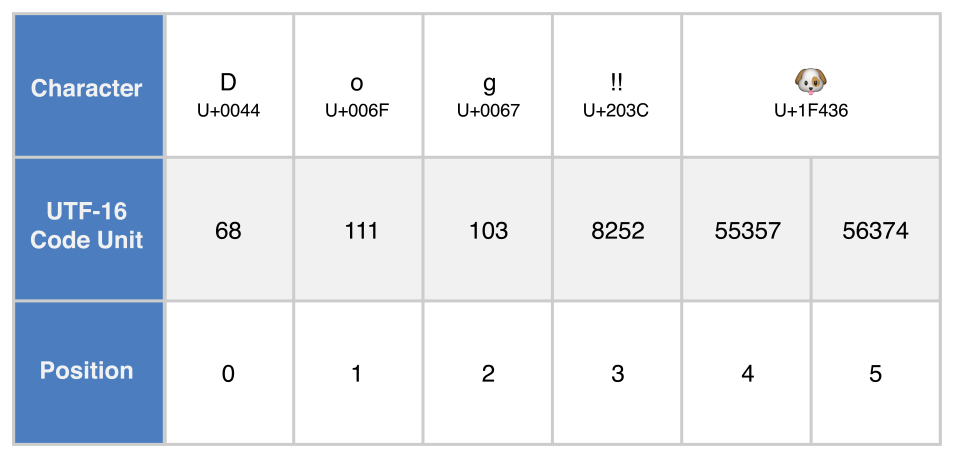
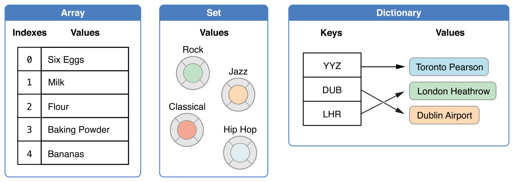
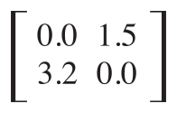
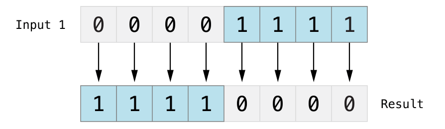
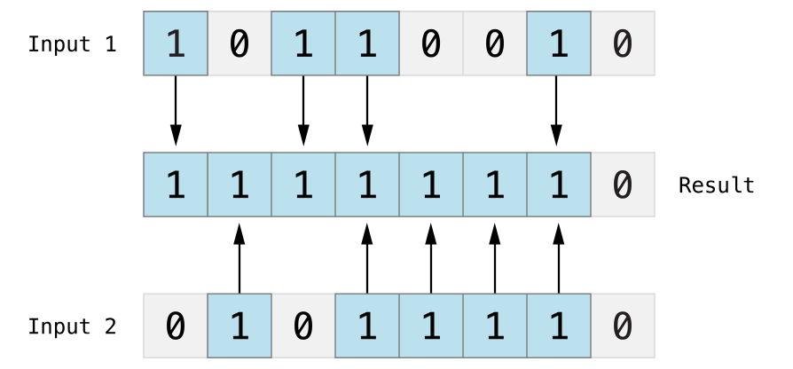

  1. Welcome to Swift 
    1. About Swift
    2. A Swift Tour
  2. Language Guide 
    1. The Basics
    2. Basic Operators
    3. Strings and Characters
    4. Collection Types
    5. Control Flow
    6. Functions
    7. Closures
    8. Enumerations
    9. Classes and Structures
    10. Properties
    11. Methods
    12. Subscripts
    13. Inheritance
    14. Initialization
    15. Deinitialization
    16. Automatic Reference Counting
    17. Optional Chaining
    18. Error Handling
    19. Type Casting
    20. Nested Types
    21. Extensions
    22. Protocols
    23. Generics
    24. Access Control
    25. Advanced Operators
  3. Language Reference 
    1. About the Language Reference
    2. Lexical Structure
    3. Types
    4. Expressions
    5. Statements
    6. Declarations
    7. Attributes
    8. Patterns
    9. Generic Parameters and Arguments
    10. Summary of the Grammar
  4. Revision History 
    1. Document Revision History

# About Swift

Important 

This is a preliminary document for an API or technology in development. Apple is supplying this information to help you plan for the adoption of the technologies and programming interfaces described herein for use on Apple-branded products. This information is subject to change, and software implemented according to this document should be tested with final operating system software and final documentation. Newer versions of this document may be provided with future betas of the API or technology. 

Swift is a new programming language for iOS, OS X, and watchOS apps that builds on the best of C and Objective-C, without the constraints of C compatibility. Swift adopts safe programming patterns and adds modern features to make programming easier, more flexible, and more fun. Swift’s clean slate, backed by the mature and much-loved Cocoa and Cocoa Touch frameworks, is an opportunity to reimagine how software development works. 

Swift has been years in the making. Apple laid the foundation for Swift by advancing our existing compiler, debugger, and framework infrastructure. We simplified memory management with Automatic Reference Counting (ARC). Our framework stack, built on the solid base of Foundation and Cocoa, has been modernized and standardized throughout. Objective-C itself has evolved to support blocks, collection literals, and modules, enabling framework adoption of modern language technologies without disruption. Thanks to this groundwork, we can now introduce a new language for the future of Apple software development. 

Swift feels familiar to Objective-C developers. It adopts the readability of Objective-C’s named parameters and the power of Objective-C’s dynamic object model. It provides seamless access to existing Cocoa frameworks and mix-and-match interoperability with Objective-C code. Building from this common ground, Swift introduces many new features and unifies the procedural and object-oriented portions of the language. 

Swift is friendly to new programmers. It is the first industrial-quality systems programming language that is as expressive and enjoyable as a scripting language. It supports playgrounds, an innovative feature that allows programmers to experiment with Swift code and see the results immediately, without the overhead of building and running an app. 

Swift combines the best in modern language thinking with wisdom from the wider Apple engineering culture. The compiler is optimized for performance, and the language is optimized for development, without compromising on either. It’s designed to scale from “hello, world” to an entire operating system. All this makes Swift a sound future investment for developers and for Apple. 

Swift is a fantastic way to write iOS, OS X, and watchOS apps, and will continue to evolve with new features and capabilities. Our goals for Swift are ambitious. We can’t wait to see what you create with it. 

# A Swift Tour

Tradition suggests that the first program in a new language should print the words “Hello, world!” on the screen. In Swift, this can be done in a single line: 

  1. `print("Hello, world!")`

If you have written code in C or Objective-C, this syntax looks familiar to you—in Swift, this line of code is a complete program. You don’t need to import a separate library for functionality like input/output or string handling. Code written at global scope is used as the entry point for the program, so you don’t need a `main()` function. You also don’t need to write semicolons at the end of every statement. 

This tour gives you enough information to start writing code in Swift by showing you how to accomplish a variety of programming tasks. Don’t worry if you don’t understand something—everything introduced in this tour is explained in detail in the rest of this book. 

Note

For the best experience, open this chapter as a playground in Xcode. Playgrounds allow you to edit the code listings and see the result immediately. 

**[Download Playground](./GuidedTour.playground.zip)**

## Simple Values

Use `let` to make a constant and `var` to make a variable. The value of a constant doesn’t need to be known at compile time, but you must assign it a value exactly once. This means you can use constants to name a value that you determine once but use in many places. 

  1. `var myVariable = 42`
  2. `myVariable = 50`
  3. `let myConstant = 42`

A constant or variable must have the same type as the value you want to assign to it. However, you don’t always have to write the type explicitly. Providing a value when you create a constant or variable lets the compiler infer its type. In the example above, the compiler infers that `myVariable` is an integer because its initial value is an integer. 

If the initial value doesn’t provide enough information (or if there is no initial value), specify the type by writing it after the variable, separated by a colon. 

  1. `let implicitInteger = 70`
  2. `let implicitDouble = 70.0`
  3. `let explicitDouble: Double = 70`

Experiment 

Create a constant with an explicit type of `Float` and a value of `4`. 

Values are never implicitly converted to another type. If you need to convert a value to a different type, explicitly make an instance of the desired type. 

  1. `let label = "The width is "`
  2. `let width = 94`
  3. `let widthLabel = label \+ String(width)`

Experiment 

Try removing the conversion to `String` from the last line. What error do you get? 

There’s an even simpler way to include values in strings: Write the value in parentheses, and write a backslash (`\`) before the parentheses. For example: 

  1. `let apples = 3`
  2. `let oranges = 5`
  3. `let appleSummary = "I have \\(apples) apples."`
  4. `let fruitSummary = "I have \\(apples \+ oranges) pieces of fruit."`

Experiment 

Use `\\()` to include a floating-point calculation in a string and to include someone’s name in a greeting. 

Create arrays and dictionaries using brackets (`[]`), and access their elements by writing the index or key in brackets. A comma is allowed after the last element. 

  1. `var shoppingList = ["catfish", "water", "tulips", "blue paint"]`
  2. `shoppingList[1] = "bottle of water"`
  3. ` `
  4. `var occupations = [`
  5. ` "Malcolm": "Captain",`
  6. ` "Kaylee": "Mechanic",`
  7. `]`
  8. `occupations["Jayne"] = "Public Relations"`

To create an empty array or dictionary, use the initializer syntax. 

  1. `let emptyArray = [String]()`
  2. `let emptyDictionary = [String: Float]()`

If type information can be inferred, you can write an empty array as `[]` and an empty dictionary as `[:]`—for example, when you set a new value for a variable or pass an argument to a function. 

  1. `shoppingList = []`
  2. `occupations = [:]`

## Control Flow

Use `if` and `switch` to make conditionals, and use `for`-`in`, `for`, `while`, and `repeat`-`while` to make loops. Parentheses around the condition or loop variable are optional. Braces around the body are required. 

  1. `let individualScores = [75, 43, 103, 87, 12]`
  2. `var teamScore = 0`
  3. `for score in individualScores {`
  4. ` if score > 50 {`
  5. ` teamScore += 3`
  6. ` } else {`
  7. ` teamScore += 1`
  8. ` }`
  9. `}`
  10. `print(teamScore)`

In an `if` statement, the conditional must be a Boolean expression—this means that code such as `if score { ... }` is an error, not an implicit comparison to zero. 

You can use `if` and `let` together to work with values that might be missing. These values are represented as optionals. An optional value either contains a value or contains `nil` to indicate that a value is missing. Write a question mark (`?`) after the type of a value to mark the value as optional. 

  1. `var optionalString: String? = "Hello"`
  2. `print(optionalString == nil)`
  3. ` `
  4. `var optionalName: String? = "John Appleseed"`
  5. `var greeting = "Hello!"`
  6. `if let name = optionalName {`
  7. ` greeting = "Hello, \\(name)"`
  8. `}`

Experiment 

Change `optionalName` to `nil`. What greeting do you get? Add an `else` clause that sets a different greeting if `optionalName` is `nil`. 

If the optional value is `nil`, the conditional is `false` and the code in braces is skipped. Otherwise, the optional value is unwrapped and assigned to the constant after `let`, which makes the unwrapped value available inside the block of code. 

Switches support any kind of data and a wide variety of comparison operations—they aren’t limited to integers and tests for equality. 

  1. `let vegetable = "red pepper"`
  2. `switch vegetable {`
  3. `case "celery":`
  4. ` let vegetableComment = "Add some raisins and make ants on a log."`
  5. `case "cucumber", "watercress":`
  6. ` let vegetableComment = "That would make a good tea sandwich."`
  7. `case let x where x.hasSuffix("pepper"):`
  8. ` let vegetableComment = "Is it a spicy \\(x)?"`
  9. `default:`
  10. ` let vegetableComment = "Everything tastes good in soup."`
  11. `}`

Experiment 

Try removing the default case. What error do you get? 

Notice how `let` can be used in a pattern to assign the value that matched that part of a pattern to a constant. 

After executing the code inside the switch case that matched, the program exits from the switch statement. Execution doesn’t continue to the next case, so there is no need to explicitly break out of the switch at the end of each case’s code. 

You use `for`-`in` to iterate over items in a dictionary by providing a pair of names to use for each key-value pair. Dictionaries are an unordered collection, so their keys and values are iterated over in an arbitrary order. 

  1. `let interestingNumbers = [`
  2. ` "Prime": [2, 3, 5, 7, 11, 13],`
  3. ` "Fibonacci": [1, 1, 2, 3, 5, 8],`
  4. ` "Square": [1, 4, 9, 16, 25],`
  5. `]`
  6. `var largest = 0`
  7. `for (kind, numbers) in interestingNumbers {`
  8. ` for number in numbers {`
  9. ` if number > largest {`
  10. ` largest = number`
  11. ` }`
  12. ` }`
  13. `}`
  14. `print(largest)`

Experiment 

Add another variable to keep track of which kind of number was the largest, as well as what that largest number was. 

Use `while` to repeat a block of code until a condition changes. The condition of a loop can be at the end instead, ensuring that the loop is run at least once. 

  1. `var n = 2`
  2. `while n < 100 {`
  3. ` n = n * 2`
  4. `}`
  5. `print(n)`
  6. ` `
  7. `var m = 2`
  8. `repeat {`
  9. ` m = m * 2`
  10. `} while m < 100`
  11. `print(m)`

You can keep an index in a loop—either by using `..<` to make a range of indexes or by writing an explicit initialization, condition, and increment. These two loops do the same thing: 

  1. `var firstForLoop = 0`
  2. `for i in 0..<4 {`
  3. ` firstForLoop += i`
  4. `}`
  5. `print(firstForLoop)`
  6. ` `
  7. `var secondForLoop = 0`
  8. `for var i = 0; i < 4; ++i {`
  9. ` secondForLoop += i`
  10. `}`
  11. `print(secondForLoop)`

Use `..<` to make a range that omits its upper value, and use `...` to make a range that includes both values. 

## Functions and Closures

Use `func` to declare a function. Call a function by following its name with a list of arguments in parentheses. Use `->` to separate the parameter names and types from the function’s return type. 

  1. `func greet(name: String, day: String) -> String {`
  2. ` return "Hello \\(name), today is \\(day)."`
  3. `}`
  4. `greet("Bob", day: "Tuesday")`

Experiment 

Remove the `day` parameter. Add a parameter to include today’s lunch special in the greeting. 

Use a tuple to make a compound value—for example, to return multiple values from a function. The elements of a tuple can be referred to either by name or by number. 

  1. `func calculateStatistics(scores: [Int]) -> (min: Int, max: Int, sum: Int) {`
  2. ` var min = scores[0]`
  3. ` var max = scores[0]`
  4. ` var sum = 0`
  5. ` `
  6. ` for score in scores {`
  7. ` if score > max {`
  8. ` max = score`
  9. ` } else if score < min {`
  10. ` min = score`
  11. ` }`
  12. ` sum += score`
  13. ` }`
  14. ` `
  15. ` return (min, max, sum)`
  16. `}`
  17. `let statistics = calculateStatistics([5, 3, 100, 3, 9])`
  18. `print(statistics.sum)`
  19. `print(statistics.2)`

Functions can also take a variable number of arguments, collecting them into an array. 

  1. `func sumOf(numbers: Int...) -> Int {`
  2. ` var sum = 0`
  3. ` for number in numbers {`
  4. ` sum += number`
  5. ` }`
  6. ` return sum`
  7. `}`
  8. `sumOf()`
  9. `sumOf(42, 597, 12)`

Experiment 

Write a function that calculates the average of its arguments. 

Functions can be nested. Nested functions have access to variables that were declared in the outer function. You can use nested functions to organize the code in a function that is long or complex. 

  1. `func returnFifteen() -> Int {`
  2. ` var y = 10`
  3. ` func add() {`
  4. ` y += 5`
  5. ` }`
  6. ` add()`
  7. ` return y`
  8. `}`
  9. `returnFifteen()`

Functions are a first-class type. This means that a function can return another function as its value. 

  1. `func makeIncrementer() -> (Int -> Int) {`
  2. ` func addOne(number: Int) -> Int {`
  3. ` return 1 \+ number`
  4. ` }`
  5. ` return addOne`
  6. `}`
  7. `var increment = makeIncrementer()`
  8. `increment(7)`

A function can take another function as one of its arguments. 

  1. `func hasAnyMatches(list: [Int], condition: Int -> Bool) -> Bool {`
  2. ` for item in list {`
  3. ` if condition(item) {`
  4. ` return true`
  5. ` }`
  6. ` }`
  7. ` return false`
  8. `}`
  9. `func lessThanTen(number: Int) -> Bool {`
  10. ` return number < 10`
  11. `}`
  12. `var numbers = [20, 19, 7, 12]`
  13. `hasAnyMatches(numbers, condition: lessThanTen)`

Functions are actually a special case of closures: blocks of code that can be called later. The code in a closure has access to things like variables and functions that were available in the scope where the closure was created, even if the closure is in a different scope when it is executed—you saw an example of this already with nested functions. You can write a closure without a name by surrounding code with braces (`{}`). Use `in` to separate the arguments and return type from the body. 

  1. `numbers.map({`
  2. ` (number: Int) -> Int in`
  3. ` let result = 3 * number`
  4. ` return result`
  5. `})`

Experiment 

Rewrite the closure to return zero for all odd numbers. 

You have several options for writing closures more concisely. When a closure’s type is already known, such as the callback for a delegate, you can omit the type of its parameters, its return type, or both. Single statement closures implicitly return the value of their only statement. 

  1. `let mappedNumbers = numbers.map({ number in 3 * number })`
  2. `print(mappedNumbers)`

You can refer to parameters by number instead of by name—this approach is especially useful in very short closures. A closure passed as the last argument to a function can appear immediately after the parentheses. When a closure is the only argument to a function, you can omit the parentheses entirely. 

  1. `let sortedNumbers = numbers.sort { $0 > $1 }`
  2. `print(sortedNumbers)`

## Objects and Classes

Use `class` followed by the class’s name to create a class. A property declaration in a class is written the same way as a constant or variable declaration, except that it is in the context of a class. Likewise, method and function declarations are written the same way. 

  1. `class Shape {`
  2. ` var numberOfSides = 0`
  3. ` func simpleDescription() -> String {`
  4. ` return "A shape with \\(numberOfSides) sides."`
  5. ` }`
  6. `}`

Experiment 

Add a constant property with `let`, and add another method that takes an argument. 

Create an instance of a class by putting parentheses after the class name. Use dot syntax to access the properties and methods of the instance. 

  1. `var shape = Shape()`
  2. `shape.numberOfSides = 7`
  3. `var shapeDescription = shape.simpleDescription()`

This version of the `Shape` class is missing something important: an initializer to set up the class when an instance is created. Use `init` to create one. 

  1. `class NamedShape {`
  2. ` var numberOfSides: Int = 0`
  3. ` var name: String`
  4. ` `
  5. ` init(name: String) {`
  6. ` self.name = name`
  7. ` }`
  8. ` `
  9. ` func simpleDescription() -> String {`
  10. ` return "A shape with \\(numberOfSides) sides."`
  11. ` }`
  12. `}`

Notice how `self` is used to distinguish the `name` property from the `name` argument to the initializer. The arguments to the initializer are passed like a function call when you create an instance of the class. Every property needs a value assigned—either in its declaration (as with `numberOfSides`) or in the initializer (as with `name`). 

Use `deinit` to create a deinitializer if you need to perform some cleanup before the object is deallocated. 

Subclasses include their superclass name after their class name, separated by a colon. There is no requirement for classes to subclass any standard root class, so you can include or omit a superclass as needed. 

Methods on a subclass that override the superclass’s implementation are marked with `override`—overriding a method by accident, without `override`, is detected by the compiler as an error. The compiler also detects methods with `override` that don’t actually override any method in the superclass. 

  1. `class Square: NamedShape {`
  2. ` var sideLength: Double`
  3. ` `
  4. ` init(sideLength: Double, name: String) {`
  5. ` self.sideLength = sideLength`
  6. ` super.init(name: name)`
  7. ` numberOfSides = 4`
  8. ` }`
  9. ` `
  10. ` func area() -> Double {`
  11. ` return sideLength * sideLength`
  12. ` }`
  13. ` `
  14. ` override func simpleDescription() -> String {`
  15. ` return "A square with sides of length \\(sideLength)."`
  16. ` }`
  17. `}`
  18. `let test = Square(sideLength: 5.2, name: "my test square")`
  19. `test.area()`
  20. `test.simpleDescription()`

Experiment 

Make another subclass of `NamedShape` called `Circle` that takes a radius and a name as arguments to its initializer. Implement an `area()` and a `simpleDescription()` method on the `Circle` class. 

In addition to simple properties that are stored, properties can have a getter and a setter. 

  1. `class EquilateralTriangle: NamedShape {`
  2. ` var sideLength: Double = 0.0`
  3. ` `
  4. ` init(sideLength: Double, name: String) {`
  5. ` self.sideLength = sideLength`
  6. ` super.init(name: name)`
  7. ` numberOfSides = 3`
  8. ` }`
  9. ` `
  10. ` var perimeter: Double {`
  11. ` get {`
  12. ` return 3.0 * sideLength`
  13. ` }`
  14. ` set {`
  15. ` sideLength = newValue / 3.0`
  16. ` }`
  17. ` }`
  18. ` `
  19. ` override func simpleDescription() -> String {`
  20. ` return "An equilateral triangle with sides of length \\(sideLength)."`
  21. ` }`
  22. `}`
  23. `var triangle = EquilateralTriangle(sideLength: 3.1, name: "a triangle")`
  24. `print(triangle.perimeter)`
  25. `triangle.perimeter = 9.9`
  26. `print(triangle.sideLength)`

In the setter for `perimeter`, the new value has the implicit name `newValue`. You can provide an explicit name in parentheses after `set`. 

Notice that the initializer for the `EquilateralTriangle` class has three different steps: 

  1. Setting the value of properties that the subclass declares. 

  2. Calling the superclass’s initializer. 

  3. Changing the value of properties defined by the superclass. Any additional setup work that uses methods, getters, or setters can also be done at this point. 

If you don’t need to compute the property but still need to provide code that is run before and after setting a new value, use `willSet` and `didSet`. For example, the class below ensures that the side length of its triangle is always the same as the side length of its square. 

  1. `class TriangleAndSquare {`
  2. ` var triangle: EquilateralTriangle {`
  3. ` willSet {`
  4. ` square.sideLength = newValue.sideLength`
  5. ` }`
  6. ` }`
  7. ` var square: Square {`
  8. ` willSet {`
  9. ` triangle.sideLength = newValue.sideLength`
  10. ` }`
  11. ` }`
  12. ` init(size: Double, name: String) {`
  13. ` square = Square(sideLength: size, name: name)`
  14. ` triangle = EquilateralTriangle(sideLength: size, name: name)`
  15. ` }`
  16. `}`
  17. `var triangleAndSquare = TriangleAndSquare(size: 10, name: "another test shape")`
  18. `print(triangleAndSquare.square.sideLength)`
  19. `print(triangleAndSquare.triangle.sideLength)`
  20. `triangleAndSquare.square = Square(sideLength: 50, name: "larger square")`
  21. `print(triangleAndSquare.triangle.sideLength)`

When working with optional values, you can write `?` before operations like methods, properties, and subscripting. If the value before the `?` is `nil`, everything after the `?` is ignored and the value of the whole expression is `nil`. Otherwise, the optional value is unwrapped, and everything after the `?` acts on the unwrapped value. In both cases, the value of the whole expression is an optional value. 

  1. `let optionalSquare: Square? = Square(sideLength: 2.5, name: "optional square")`
  2. `let sideLength = optionalSquare?.sideLength`

## Enumerations and Structures

Use `enum` to create an enumeration. Like classes and all other named types, enumerations can have methods associated with them. 

  1. `enum Rank: Int {`
  2. ` case Ace = 1`
  3. ` case Two, Three, Four, Five, Six, Seven, Eight, Nine, Ten`
  4. ` case Jack, Queen, King`
  5. ` func simpleDescription() -> String {`
  6. ` switch self {`
  7. ` case .Ace:`
  8. ` return "ace"`
  9. ` case .Jack:`
  10. ` return "jack"`
  11. ` case .Queen:`
  12. ` return "queen"`
  13. ` case .King:`
  14. ` return "king"`
  15. ` default:`
  16. ` return String(self.rawValue)`
  17. ` }`
  18. ` }`
  19. `}`
  20. `let ace = Rank.Ace`
  21. `let aceRawValue = ace.rawValue`

Experiment 

Write a function that compares two `Rank` values by comparing their raw values. 

In the example above, the raw-value type of the enumeration is `Int`, so you only have to specify the first raw value. The rest of the raw values are assigned in order. You can also use strings or floating-point numbers as the raw type of an enumeration. Use the `rawValue` property to access the raw value of an enumeration member. 

Use the `init?(rawValue:)` initializer to make an instance of an enumeration from a raw value. 

  1. `if let convertedRank = Rank(rawValue: 3) {`
  2. ` let threeDescription = convertedRank.simpleDescription()`
  3. `}`

The member values of an enumeration are actual values, not just another way of writing their raw values. In fact, in cases where there isn’t a meaningful raw value, you don’t have to provide one. 

  1. `enum Suit {`
  2. ` case Spades, Hearts, Diamonds, Clubs`
  3. ` func simpleDescription() -> String {`
  4. ` switch self {`
  5. ` case .Spades:`
  6. ` return "spades"`
  7. ` case .Hearts:`
  8. ` return "hearts"`
  9. ` case .Diamonds:`
  10. ` return "diamonds"`
  11. ` case .Clubs:`
  12. ` return "clubs"`
  13. ` }`
  14. ` }`
  15. `}`
  16. `let hearts = Suit.Hearts`
  17. `let heartsDescription = hearts.simpleDescription()`

Experiment 

Add a `color()` method to `Suit` that returns “black” for spades and clubs, and returns “red” for hearts and diamonds. 

Notice the two ways that the `Hearts` member of the enumeration is referred to above: When assigning a value to the `hearts` constant, the enumeration member `Suit.Hearts` is referred to by its full name because the constant doesn’t have an explicit type specified. Inside the switch, the enumeration member is referred to by the abbreviated form `.Hearts` because the value of `self` is already known to be a suit. You can use the abbreviated form anytime the value’s type is already known. 

Use `struct` to create a structure. Structures support many of the same behaviors as classes, including methods and initializers. One of the most important differences between structures and classes is that structures are always copied when they are passed around in your code, but classes are passed by reference. 

  1. `struct Card {`
  2. ` var rank: Rank`
  3. ` var suit: Suit`
  4. ` func simpleDescription() -> String {`
  5. ` return "The \\(rank.simpleDescription()) of \\(suit.simpleDescription())"`
  6. ` }`
  7. `}`
  8. `let threeOfSpades = Card(rank: .Three, suit: .Spades)`
  9. `let threeOfSpadesDescription = threeOfSpades.simpleDescription()`

Experiment 

Add a method to `Card` that creates a full deck of cards, with one card of each combination of rank and suit. 

An instance of an enumeration member can have values associated with the instance. Instances of the same enumeration member can have different values associated with them. You provide the associated values when you create the instance. Associated values and raw values are different: The raw value of an enumeration member is the same for all of its instances, and you provide the raw value when you define the enumeration. 

For example, consider the case of requesting the sunrise and sunset time from a server. The server either responds with the information or it responds with some error information. 

  1. `enum ServerResponse {`
  2. ` case Result(String, String)`
  3. ` case Error(String)`
  4. `}`
  5. ` `
  6. `let success = ServerResponse.Result("6:00 am", "8:09 pm")`
  7. `let failure = ServerResponse.Error("Out of cheese.")`
  8. ` `
  9. `switch success {`
  10. `case let .Result(sunrise, sunset):`
  11. ` let serverResponse = "Sunrise is at \\(sunrise) and sunset is at \\(sunset)."`
  12. `case let .Error(error):`
  13. ` let serverResponse = "Failure... \\(error)"`
  14. `}`

Experiment 

Add a third case to `ServerResponse` and to the switch. 

Notice how the sunrise and sunset times are extracted from the `ServerResponse` value as part of matching the value against the switch cases. 

## Protocols and Extensions

Use `protocol` to declare a protocol. 

  1. `protocol ExampleProtocol {`
  2. ` var simpleDescription: String { get }`
  3. ` mutating func adjust()`
  4. `}`

Classes, enumerations, and structs can all adopt protocols. 

  1. `class SimpleClass: ExampleProtocol {`
  2. ` var simpleDescription: String = "A very simple class."`
  3. ` var anotherProperty: Int = 69105`
  4. ` func adjust() {`
  5. ` simpleDescription += " Now 100% adjusted."`
  6. ` }`
  7. `}`
  8. `var a = SimpleClass()`
  9. `a.adjust()`
  10. `let aDescription = a.simpleDescription`
  11. ` `
  12. `struct SimpleStructure: ExampleProtocol {`
  13. ` var simpleDescription: String = "A simple structure"`
  14. ` mutating func adjust() {`
  15. ` simpleDescription += " (adjusted)"`
  16. ` }`
  17. `}`
  18. `var b = SimpleStructure()`
  19. `b.adjust()`
  20. `let bDescription = b.simpleDescription`

Experiment 

Write an enumeration that conforms to this protocol. 

Notice the use of the `mutating` keyword in the declaration of `SimpleStructure` to mark a method that modifies the structure. The declaration of `SimpleClass` doesn’t need any of its methods marked as mutating because methods on a class can always modify the class. 

Use `extension` to add functionality to an existing type, such as new methods and computed properties. You can use an extension to add protocol conformance to a type that is declared elsewhere, or even to a type that you imported from a library or framework. 

  1. `extension Int: ExampleProtocol {`
  2. ` var simpleDescription: String {`
  3. ` return "The number \\(self)"`
  4. ` }`
  5. ` mutating func adjust() {`
  6. ` self += 42`
  7. ` }`
  8. `}`
  9. `print(7.simpleDescription)`

Experiment 

Write an extension for the `Double` type that adds an `absoluteValue` property. 

You can use a protocol name just like any other named type—for example, to create a collection of objects that have different types but that all conform to a single protocol. When you work with values whose type is a protocol type, methods outside the protocol definition are not available. 

  1. `let protocolValue: ExampleProtocol = a`
  2. `print(protocolValue.simpleDescription)`
  3. `// print(protocolValue.anotherProperty) // Uncomment to see the error`

Even though the variable `protocolValue` has a runtime type of `SimpleClass`, the compiler treats it as the given type of `ExampleProtocol`. This means that you can’t accidentally access methods or properties that the class implements in addition to its protocol conformance. 

## Generics

Write a name inside angle brackets to make a generic function or type. 

  1. `func repeatItem<Item>(item: Item, numberOfTimes: Int) -> [Item] {`
  2. ` var result = [Item]()`
  3. ` for _ in 0..<numberOfTimes {`
  4. ` result.append(item)`
  5. ` }`
  6. ` return result`
  7. `}`
  8. `repeatItem("knock", numberOfTimes:4)`

You can make generic forms of functions and methods, as well as classes, enumerations, and structures. 

  1. `// Reimplement the Swift standard library's optional type`
  2. `enum OptionalValue<T> {`
  3. ` case None`
  4. ` case Some(T)`
  5. `}`
  6. `var possibleInteger: OptionalValue<Int> = .None`
  7. `possibleInteger = .Some(100)`

Use `where` after the type name to specify a list of requirements—for example, to require the type to implement a protocol, to require two types to be the same, or to require a class to have a particular superclass. 

  1. `func anyCommonElements <T, U where T: SequenceType, U: SequenceType, T.Generator.Element: Equatable, T.Generator.Element == U.Generator.Element> (lhs: T, _ rhs: U) -> Bool {`
  2. ` for lhsItem in lhs {`
  3. ` for rhsItem in rhs {`
  4. ` if lhsItem == rhsItem {`
  5. ` return true`
  6. ` }`
  7. ` }`
  8. ` }`
  9. ` return false`
  10. `}`
  11. `anyCommonElements([1, 2, 3], [3])`

Experiment 

Modify the `anyCommonElements(_:_:)` function to make a function that returns an array of the elements that any two sequences have in common. 

In the simple cases, you can omit `where` and simply write the protocol or class name after a colon. Writing `<T: Equatable>` is the same as writing `<T where T: Equatable>`. 

# The Basics

Swift is a new programming language for iOS, OS X, and watchOS app development. Nonetheless, many parts of Swift will be familiar from your experience of developing in C and Objective-C. 

Swift provides its own versions of all fundamental C and Objective-C types, including `Int` for integers, `Double` and `Float` for floating-point values, `Bool` for Boolean values, and `String` for textual data. Swift also provides powerful versions of the three primary collection types, `Array`, `Set`, and `Dictionary`, as described in Collection Types. 

Like C, Swift uses variables to store and refer to values by an identifying name. Swift also makes extensive use of variables whose values cannot be changed. These are known as constants, and are much more powerful than constants in C. Constants are used throughout Swift to make code safer and clearer in intent when you work with values that do not need to change. 

In addition to familiar types, Swift introduces advanced types not found in Objective-C, such as tuples. Tuples enable you to create and pass around groupings of values. You can use a tuple to return multiple values from a function as a single compound value. 

Swift also introduces optional types, which handle the absence of a value. Optionals say either “there _is_ a value, and it equals _x_” or “there _isn’t_ a value at all”. Optionals are similar to using `nil` with pointers in Objective-C, but they work for any type, not just classes. Optionals are safer and more expressive than `nil` pointers in Objective-C and are at the heart of many of Swift’s most powerful features. 

Optionals are an example of the fact that Swift is a _type safe_ language. Swift helps you to be clear about the types of values your code can work with. If part of your code expects a `String`, type safety prevents you from passing it an `Int` by mistake. This restriction enables you to catch and fix errors as early as possible in the development process. 

## Constants and Variables

Constants and variables associate a name (such as `maximumNumberOfLoginAttempts` or `welcomeMessage`) with a value of a particular type (such as the number `10` or the string `"Hello"`). The value of a _constant_ cannot be changed once it is set, whereas a _variable_ can be set to a different value in the future. 

### Declaring Constants and Variables

Constants and variables must be declared before they are used. You declare constants with the `let` keyword and variables with the `var` keyword. Here’s an example of how constants and variables can be used to track the number of login attempts a user has made: 

  1. `let maximumNumberOfLoginAttempts = 10`
  2. `var currentLoginAttempt = 0`

This code can be read as: 

“Declare a new constant called `maximumNumberOfLoginAttempts`, and give it a value of `10`. Then, declare a new variable called `currentLoginAttempt`, and give it an initial value of `0`.” 

In this example, the maximum number of allowed login attempts is declared as a constant, because the maximum value never changes. The current login attempt counter is declared as a variable, because this value must be incremented after each failed login attempt. 

You can declare multiple constants or multiple variables on a single line, separated by commas: 

  1. `var x = 0.0, y = 0.0, z = 0.0`

Note 

If a stored value in your code is not going to change, always declare it as a constant with the `let` keyword. Use variables only for storing values that need to be able to change. 

### Type Annotations

You can provide a _type annotation_ when you declare a constant or variable, to be clear about the kind of values the constant or variable can store. Write a type annotation by placing a colon after the constant or variable name, followed by a space, followed by the name of the type to use. 

This example provides a type annotation for a variable called `welcomeMessage`, to indicate that the variable can store `String` values: 

  1. `var welcomeMessage: String`

The colon in the declaration means _“…of type…,”_ so the code above can be read as: 

“Declare a variable called `welcomeMessage` that is of type `String`.” 

The phrase “of type `String`” means “can store any `String` value.” Think of it as meaning “the type of thing” (or “the kind of thing”) that can be stored. 

The `welcomeMessage` variable can now be set to any string value without error: 

  1. `welcomeMessage = "Hello"`

You can define multiple related variables of the same type on a single line, separated by commas, with a single type annotation after the final variable name: 

  1. `var red, green, blue: Double`

Note 

It is rare that you need to write type annotations in practice. If you provide an initial value for a constant or variable at the point that it is defined, Swift can almost always infer the type to be used for that constant or variable, as described in Type Safety and Type Inference. In the `welcomeMessage` example above, no initial value is provided, and so the type of the `welcomeMessage` variable is specified with a type annotation rather than being inferred from an initial value. 

### Naming Constants and Variables

Constant and variable names can contain almost any character, including Unicode characters: 

  1. `let π = 3.14159`
  2. `let 你好 = "你好世界"`
  3. `let 🐶🐮 = "dogcow"`

Constant and variable names cannot contain whitespace characters, mathematical symbols, arrows, private-use (or invalid) Unicode code points, or line- and box-drawing characters. Nor can they begin with a number, although numbers may be included elsewhere within the name. 

Once you’ve declared a constant or variable of a certain type, you can’t redeclare it again with the same name, or change it to store values of a different type. Nor can you change a constant into a variable or a variable into a constant. 

Note 

If you need to give a constant or variable the same name as a reserved Swift keyword, surround the keyword with back ticks (```) when using it as a name. However, avoid using keywords as names unless you have absolutely no choice. 

You can change the value of an existing variable to another value of a compatible type. In this example, the value of `friendlyWelcome` is changed from `"Hello!"` to `"Bonjour!"`: 

  1. `var friendlyWelcome = "Hello!"`
  2. `friendlyWelcome = "Bonjour!"`
  3. `// friendlyWelcome is now "Bonjour!"`

Unlike a variable, the value of a constant cannot be changed once it is set. Attempting to do so is reported as an error when your code is compiled: 

  1. `let languageName = "Swift"`
  2. `languageName = "Swift++"`
  3. `// this is a compile-time error - languageName cannot be changed`

### Printing Constants and Variables

You can print the current value of a constant or variable with the `print(_:)` function: 

  1. `print(friendlyWelcome)`
  2. `// prints "Bonjour!"`

`print(_:)` is a global function that prints a value, followed by a line break, to an appropriate output. In Xcode, for example, the `print(_:)` function prints its output in Xcode’s “console” pane. (A related function, `print(_:appendNewline:)`, performs the same task while optionally appending a line break to the end of the value to be printed.) 

The `print(_:)` function prints any `String` value you pass to it: 

  1. `print("This is a string")`
  2. `// prints "This is a string"`

The `print(_:)` function can print more complex logging messages. These messages can include the current values of constants and variables. 

Swift uses _string interpolation_ to include the name of a constant or variable as a placeholder in a longer string, and to prompt Swift to replace it with the current value of that constant or variable. Wrap the name in parentheses and escape it with a backslash before the opening parenthesis: 

  1. `print("The current value of friendlyWelcome is \\(friendlyWelcome)")`
  2. `// prints "The current value of friendlyWelcome is Bonjour!"`

Note 

All options you can use with string interpolation are described in String Interpolation. 

## Comments

Use comments to include non-executable text in your code, as a note or reminder to yourself. Comments are ignored by the Swift compiler when your code is compiled. 

Comments in Swift are very similar to comments in C. Single-line comments begin with two forward-slashes (`//`): 

  1. `// this is a comment`

Multiline comments start with a forward-slash followed by an asterisk (`/*`) and end with an asterisk followed by a forward-slash (`*/`): 

  1. `/* this is also a comment,`
  2. `but written over multiple lines */`

Unlike multiline comments in C, multiline comments in Swift can be nested inside other multiline comments. You write nested comments by starting a multiline comment block and then starting a second multiline comment within the first block. The second block is then closed, followed by the first block: 

  1. `/* this is the start of the first multiline comment`
  2. `/* this is the second, nested multiline comment */`
  3. `this is the end of the first multiline comment */`

Nested multiline comments enable you to comment out large blocks of code quickly and easily, even if the code already contains multiline comments. 

## Semicolons

Unlike many other languages, Swift does not require you to write a semicolon (`;`) after each statement in your code, although you can do so if you wish. Semicolons _are_ required, however, if you want to write multiple separate statements on a single line: 

  1. `let cat = "🐱"; print(cat)`
  2. `// prints "🐱"`

## Integers

_Integers_ are whole numbers with no fractional component, such as `42` and `-23`. Integers are either _signed_ (positive, zero, or negative) or _unsigned_ (positive or zero). 

Swift provides signed and unsigned integers in 8, 16, 32, and 64 bit forms. These integers follow a naming convention similar to C, in that an 8-bit unsigned integer is of type `UInt8`, and a 32-bit signed integer is of type `Int32`. Like all types in Swift, these integer types have capitalized names. 

### Integer Bounds

You can access the minimum and maximum values of each integer type with its `min` and `max` properties: 

  1. `let minValue = UInt8.min // minValue is equal to 0, and is of type UInt8`
  2. `let maxValue = UInt8.max // maxValue is equal to 255, and is of type UInt8`

The values of these properties are of the appropriate-sized number type (such as `UInt8` in the example above) and can therefore be used in expressions alongside other values of the same type. 

### Int

In most cases, you don’t need to pick a specific size of integer to use in your code. Swift provides an additional integer type, `Int`, which has the same size as the current platform’s native word size: 

  1. On a 32-bit platform, `Int` is the same size as `Int32`. 

  2. On a 64-bit platform, `Int` is the same size as `Int64`. 

Unless you need to work with a specific size of integer, always use `Int` for integer values in your code. This aids code consistency and interoperability. Even on 32-bit platforms, `Int` can store any value between `-2,147,483,648` and `2,147,483,647`, and is large enough for many integer ranges. 

### UInt

Swift also provides an unsigned integer type, `UInt`, which has the same size as the current platform’s native word size: 

  1. On a 32-bit platform, `UInt` is the same size as `UInt32`. 

  2. On a 64-bit platform, `UInt` is the same size as `UInt64`. 

Note 

Use `UInt` only when you specifically need an unsigned integer type with the same size as the platform’s native word size. If this is not the case, `Int` is preferred, even when the values to be stored are known to be non-negative. A consistent use of `Int` for integer values aids code interoperability, avoids the need to convert between different number types, and matches integer type inference, as described in Type Safety and Type Inference. 

## Floating-Point Numbers

_Floating-point numbers_ are numbers with a fractional component, such as `3.14159`, `0.1`, and `-273.15`. 

Floating-point types can represent a much wider range of values than integer types, and can store numbers that are much larger or smaller than can be stored in an `Int`. Swift provides two signed floating-point number types: 

  1. `Double` represents a 64-bit floating-point number. 

  2. `Float` represents a 32-bit floating-point number. 

Note 

`Double` has a precision of at least 15 decimal digits, whereas the precision of `Float` can be as little as 6 decimal digits. The appropriate floating-point type to use depends on the nature and range of values you need to work with in your code. In situations where either type would be appropriate, `Double` is preferred. 

## Type Safety and Type Inference

Swift is a _type safe_ language. A type safe language encourages you to be clear about the types of values your code can work with. If part of your code expects a `String`, you can’t pass it an `Int` by mistake. 

Because Swift is type safe, it performs _type checks_ when compiling your code and flags any mismatched types as errors. This enables you to catch and fix errors as early as possible in the development process. 

Type-checking helps you avoid errors when you’re working with different types of values. However, this doesn’t mean that you have to specify the type of every constant and variable that you declare. If you don’t specify the type of value you need, Swift uses _type inference_ to work out the appropriate type. Type inference enables a compiler to deduce the type of a particular expression automatically when it compiles your code, simply by examining the values you provide. 

Because of type inference, Swift requires far fewer type declarations than languages such as C or Objective-C. Constants and variables are still explicitly typed, but much of the work of specifying their type is done for you. 

Type inference is particularly useful when you declare a constant or variable with an initial value. This is often done by assigning a _literal value_ (or _literal_) to the constant or variable at the point that you declare it. (A literal value is a value that appears directly in your source code, such as `42` and `3.14159` in the examples below.) 

For example, if you assign a literal value of `42` to a new constant without saying what type it is, Swift infers that you want the constant to be an `Int`, because you have initialized it with a number that looks like an integer: 

  1. `let meaningOfLife = 42`
  2. `// meaningOfLife is inferred to be of type Int`

Likewise, if you don’t specify a type for a floating-point literal, Swift infers that you want to create a `Double`: 

  1. `let pi = 3.14159`
  2. `// pi is inferred to be of type Double`

Swift always chooses `Double` (rather than `Float`) when inferring the type of floating-point numbers. 

If you combine integer and floating-point literals in an expression, a type of `Double` will be inferred from the context: 

  1. `let anotherPi = 3 \+ 0.14159`
  2. `// anotherPi is also inferred to be of type Double`

The literal value of `3` has no explicit type in and of itself, and so an appropriate output type of `Double` is inferred from the presence of a floating-point literal as part of the addition. 

## Numeric Literals

Integer literals can be written as: 

  1. A _decimal_ number, with no prefix 

  2. A _binary_ number, with a `0b` prefix 

  3. An _octal_ number, with a `0o` prefix 

  4. A _hexadecimal_ number, with a `0x` prefix 

All of these integer literals have a decimal value of `17`: 

  1. `let decimalInteger = 17`
  2. `let binaryInteger = 0b10001 // 17 in binary notation`
  3. `let octalInteger = 0o21 // 17 in octal notation`
  4. `let hexadecimalInteger = 0x11 // 17 in hexadecimal notation`

Floating-point literals can be decimal (with no prefix), or hexadecimal (with a `0x` prefix). They must always have a number (or hexadecimal number) on both sides of the decimal point. They can also have an optional _exponent_, indicated by an uppercase or lowercase `e` for decimal floats, or an uppercase or lowercase `p` for hexadecimal floats. 

For decimal numbers with an exponent of `exp`, the base number is multiplied by 10exp: 

  1. `1.25e2` means 1.25 x 102, or `125.0`. 

  2. `1.25e-2` means 1.25 x 10-2, or `0.0125`. 

For hexadecimal numbers with an exponent of `exp`, the base number is multiplied by 2exp: 

  1. `0xFp2` means 15 x 22, or `60.0`. 

  2. `0xFp-2` means 15 x 2-2, or `3.75`. 

All of these floating-point literals have a decimal value of `12.1875`: 

  1. `let decimalDouble = 12.1875`
  2. `let exponentDouble = 1.21875e1`
  3. `let hexadecimalDouble = 0xC.3p0`

Numeric literals can contain extra formatting to make them easier to read. Both integers and floats can be padded with extra zeroes and can contain underscores to help with readability. Neither type of formatting affects the underlying value of the literal: 

  1. `let paddedDouble = 000123.456`
  2. `let oneMillion = 1_000_000`
  3. `let justOverOneMillion = 1_000_000.000_000_1`

## Numeric Type Conversion

Use the `Int` type for all general-purpose integer constants and variables in your code, even if they are known to be non-negative. Using the default integer type in everyday situations means that integer constants and variables are immediately interoperable in your code and will match the inferred type for integer literal values. 

Use other integer types only when they are specifically needed for the task at hand, because of explicitly-sized data from an external source, or for performance, memory usage, or other necessary optimization. Using explicitly-sized types in these situations helps to catch any accidental value overflows and implicitly documents the nature of the data being used. 

### Integer Conversion

The range of numbers that can be stored in an integer constant or variable is different for each numeric type. An `Int8` constant or variable can store numbers between `-128` and `127`, whereas a `UInt8` constant or variable can store numbers between `0` and `255`. A number that will not fit into a constant or variable of a sized integer type is reported as an error when your code is compiled: 

  1. `let cannotBeNegative: UInt8 = -1`
  2. `// UInt8 cannot store negative numbers, and so this will report an error`
  3. `let tooBig: Int8 = Int8.max \+ 1`
  4. `// Int8 cannot store a number larger than its maximum value,`
  5. `// and so this will also report an error`

Because each numeric type can store a different range of values, you must opt in to numeric type conversion on a case-by-case basis. This opt-in approach prevents hidden conversion errors and helps make type conversion intentions explicit in your code. 

To convert one specific number type to another, you initialize a new number of the desired type with the existing value. In the example below, the constant `twoThousand` is of type `UInt16`, whereas the constant `one` is of type `UInt8`. They cannot be added together directly, because they are not of the same type. Instead, this example calls `UInt16(one)` to create a new `UInt16` initialized with the value of `one`, and uses this value in place of the original: 

  1. `let twoThousand: UInt16 = 2_000`
  2. `let one: UInt8 = 1`
  3. `let twoThousandAndOne = twoThousand \+ UInt16(one)`

Because both sides of the addition are now of type `UInt16`, the addition is allowed. The output constant (`twoThousandAndOne`) is inferred to be of type `UInt16`, because it is the sum of two `UInt16` values. 

`SomeType(ofInitialValue)` is the default way to call the initializer of a Swift type and pass in an initial value. Behind the scenes, `UInt16` has an initializer that accepts a `UInt8` value, and so this initializer is used to make a new `UInt16` from an existing `UInt8`. You can’t pass in _any_ type here, however—it has to be a type for which `UInt16` provides an initializer. Extending existing types to provide initializers that accept new types (including your own type definitions) is covered in Extensions. 

### Integer and Floating-Point Conversion

Conversions between integer and floating-point numeric types must be made explicit: 

  1. `let three = 3`
  2. `let pointOneFourOneFiveNine = 0.14159`
  3. `let pi = Double(three) + pointOneFourOneFiveNine`
  4. `// pi equals 3.14159, and is inferred to be of type Double`

Here, the value of the constant `three` is used to create a new value of type `Double`, so that both sides of the addition are of the same type. Without this conversion in place, the addition would not be allowed. 

Floating-point to integer conversion must also be made explicit. An integer type can be initialized with a `Double` or `Float` value: 

  1. `let integerPi = Int(pi)`
  2. `// integerPi equals 3, and is inferred to be of type Int`

Floating-point values are always truncated when used to initialize a new integer value in this way. This means that `4.75` becomes `4`, and `-3.9` becomes `-3`. 

Note 

The rules for combining numeric constants and variables are different from the rules for numeric literals. The literal value `3` can be added directly to the literal value `0.14159`, because number literals do not have an explicit type in and of themselves. Their type is inferred only at the point that they are evaluated by the compiler. 

## Type Aliases

_Type aliases_ define an alternative name for an existing type. You define type aliases with the `typealias` keyword. 

Type aliases are useful when you want to refer to an existing type by a name that is contextually more appropriate, such as when working with data of a specific size from an external source: 

  1. `typealias AudioSample = UInt16`

Once you define a type alias, you can use the alias anywhere you might use the original name: 

  1. `var maxAmplitudeFound = AudioSample.min`
  2. `// maxAmplitudeFound is now 0`

Here, `AudioSample` is defined as an alias for `UInt16`. Because it is an alias, the call to `AudioSample.min` actually calls `UInt16.min`, which provides an initial value of `0` for the `maxAmplitudeFound` variable. 

## Booleans

Swift has a basic _Boolean_ type, called `Bool`. Boolean values are referred to as _logical_, because they can only ever be true or false. Swift provides two Boolean constant values, `true` and `false`: 

  1. `let orangesAreOrange = true`
  2. `let turnipsAreDelicious = false`

The types of `orangesAreOrange` and `turnipsAreDelicious` have been inferred as `Bool` from the fact that they were initialized with Boolean literal values. As with `Int` and `Double` above, you don’t need to declare constants or variables as `Bool` if you set them to `true` or `false` as soon as you create them. Type inference helps make Swift code more concise and readable when it initializes constants or variables with other values whose type is already known. 

Boolean values are particularly useful when you work with conditional statements such as the `if` statement: 

  1. `if turnipsAreDelicious {`
  2. ` print("Mmm, tasty turnips!")`
  3. `} else {`
  4. ` print("Eww, turnips are horrible.")`
  5. `}`
  6. `// prints "Eww, turnips are horrible."`

Conditional statements such as the `if` statement are covered in more detail in Control Flow. 

Swift’s type safety prevents non-Boolean values from being substituted for `Bool`. The following example reports a compile-time error: 

  1. `let i = 1`
  2. `if i {`
  3. ` // this example will not compile, and will report an error`
  4. `}`

However, the alternative example below is valid: 

  1. `let i = 1`
  2. `if i == 1 {`
  3. ` // this example will compile successfully`
  4. `}`

The result of the `i == 1` comparison is of type `Bool`, and so this second example passes the type-check. Comparisons like `i == 1` are discussed in Basic Operators. 

As with other examples of type safety in Swift, this approach avoids accidental errors and ensures that the intention of a particular section of code is always clear. 

## Tuples

_Tuples_ group multiple values into a single compound value. The values within a tuple can be of any type and do not have to be of the same type as each other. 

In this example, `(404, "Not Found")` is a tuple that describes an _HTTP status code_. An HTTP status code is a special value returned by a web server whenever you request a web page. A status code of `404 Not Found` is returned if you request a webpage that doesn’t exist. 

  1. `let http404Error = (404, "Not Found")`
  2. `// http404Error is of type (Int, String), and equals (404, "Not Found")`

The `(404, "Not Found")` tuple groups together an `Int` and a `String` to give the HTTP status code two separate values: a number and a human-readable description. It can be described as “a tuple of type `(Int, String)`”. 

You can create tuples from any permutation of types, and they can contain as many different types as you like. There’s nothing stopping you from having a tuple of type `(Int, Int, Int)`, or `(String, Bool)`, or indeed any other permutation you require. 

You can _decompose_ a tuple’s contents into separate constants or variables, which you then access as usual: 

  1. `let (statusCode, statusMessage) = http404Error`
  2. `print("The status code is \\(statusCode)")`
  3. `// prints "The status code is 404"`
  4. `print("The status message is \\(statusMessage)")`
  5. `// prints "The status message is Not Found"`

If you only need some of the tuple’s values, ignore parts of the tuple with an underscore (`_`) when you decompose the tuple: 

  1. `let (justTheStatusCode, _) = http404Error`
  2. `print("The status code is \\(justTheStatusCode)")`
  3. `// prints "The status code is 404"`

Alternatively, access the individual element values in a tuple using index numbers starting at zero: 

  1. `print("The status code is \\(http404Error.0)")`
  2. `// prints "The status code is 404"`
  3. `print("The status message is \\(http404Error.1)")`
  4. `// prints "The status message is Not Found"`

You can name the individual elements in a tuple when the tuple is defined: 

  1. `let http200Status = (statusCode: 200, description: "OK")`

If you name the elements in a tuple, you can use the element names to access the values of those elements: 

  1. `print("The status code is \\(http200Status.statusCode)")`
  2. `// prints "The status code is 200"`
  3. `print("The status message is \\(http200Status.description)")`
  4. `// prints "The status message is OK"`

Tuples are particularly useful as the return values of functions. A function that tries to retrieve a web page might return the `(Int, String)` tuple type to describe the success or failure of the page retrieval. By returning a tuple with two distinct values, each of a different type, the function provides more useful information about its outcome than if it could only return a single value of a single type. For more information, see Functions with Multiple Return Values. 

Note 

Tuples are useful for temporary groups of related values. They are not suited to the creation of complex data structures. If your data structure is likely to persist beyond a temporary scope, model it as a class or structure, rather than as a tuple. For more information, see Classes and Structures. 

## Optionals

You use _optionals_ in situations where a value may be absent. An optional says: 

  1. There _is_ a value, and it equals _x_

_or_

  1. There _isn’t_ a value at all 

Note 

The concept of optionals doesn’t exist in C or Objective-C. The nearest thing in Objective-C is the ability to return `nil` from a method that would otherwise return an object, with `nil` meaning “the absence of a valid object.” However, this only works for objects—it doesn’t work for structures, basic C types, or enumeration values. For these types, Objective-C methods typically return a special value (such as `NSNotFound`) to indicate the absence of a value. This approach assumes that the method’s caller knows there is a special value to test against and remembers to check for it. Swift’s optionals let you indicate the absence of a value for _any type at all_, without the need for special constants. 

Here’s an example of how optionals can be used to cope with the absence of a value. Swift’s `String` type has an initializer which tries to convert a `String` value into an `Int` value. However, not every string can be converted into an integer. The string `"123"` can be converted into the numeric value `123`, but the string `"hello, world"` does not have an obvious numeric value to convert to. 

The example below uses the initializer to try to convert a `String` into an `Int`: 

  1. `let possibleNumber = "123"`
  2. `let convertedNumber = Int(possibleNumber)`
  3. `// convertedNumber is inferred to be of type "Int?", or "optional Int"`

Because the initializer might fail, it returns an _optional_ `Int`, rather than an `Int`. An optional `Int` is written as `Int?`, not `Int`. The question mark indicates that the value it contains is optional, meaning that it might contain _some_ `Int` value, or it might contain _no value at all_. (It can’t contain anything else, such as a `Bool` value or a `String` value. It’s either an `Int`, or it’s nothing at all.) 

### nil

You set an optional variable to a valueless state by assigning it the special value `nil`: 

  1. `var serverResponseCode: Int? = 404`
  2. `// serverResponseCode contains an actual Int value of 404`
  3. `serverResponseCode = nil`
  4. `// serverResponseCode now contains no value`

Note 

`nil` cannot be used with nonoptional constants and variables. If a constant or variable in your code needs to work with the absence of a value under certain conditions, always declare it as an optional value of the appropriate type. 

If you define an optional variable without providing a default value, the variable is automatically set to `nil` for you: 

  1. `var surveyAnswer: String?`
  2. `// surveyAnswer is automatically set to nil`

Note 

Swift’s `nil` is not the same as `nil` in Objective-C. In Objective-C, `nil` is a pointer to a nonexistent object. In Swift, `nil` is not a pointer—it is the absence of a value of a certain type. Optionals of _any_ type can be set to `nil`, not just object types. 

### If Statements and Forced Unwrapping

You can use an `if` statement to find out whether an optional contains a value by comparing the optional against `nil`. You perform this comparison with the “equal to” operator (`==`) or the “not equal to” operator (`!=`). 

If an optional has a value, it is considered to be “not equal to” `nil`: 

  1. `if convertedNumber != nil {`
  2. ` print("convertedNumber contains some integer value.")`
  3. `}`
  4. `// prints "convertedNumber contains some integer value."`

Once you’re sure that the optional _does_ contain a value, you can access its underlying value by adding an exclamation mark (`!`) to the end of the optional’s name. The exclamation mark effectively says, “I know that this optional definitely has a value; please use it.” This is known as _forced unwrapping_ of the optional’s value: 

  1. `if convertedNumber != nil {`
  2. ` print("convertedNumber has an integer value of \\(convertedNumber!).")`
  3. `}`
  4. `// prints "convertedNumber has an integer value of 123."`

For more on the `if` statement, see Control Flow. 

Note 

Trying to use `!` to access a non-existent optional value triggers a runtime error. Always make sure that an optional contains a non-`nil` value before using `!` to force-unwrap its value. 

### Optional Binding

You use _optional binding_ to find out whether an optional contains a value, and if so, to make that value available as a temporary constant or variable. Optional binding can be used with `if` and `while` statements to check for a value inside an optional, and to extract that value into a constant or variable, as part of a single action. `if` and `while` statements are described in more detail in Control Flow. 

Write an optional binding for an `if` statement as follows: 

  1.     if let _constantName_ = _someOptional_ {

  2.         _statements_

  3.     }

You can rewrite the `possibleNumber` example from the Optionals section to use optional binding rather than forced unwrapping: 

  1. `if let actualNumber = Int(possibleNumber) {`
  2. ` print("\'\\(possibleNumber)\' has an integer value of \\(actualNumber)")`
  3. `} else {`
  4. ` print("\'\\(possibleNumber)\' could not be converted to an integer")`
  5. `}`
  6. `// prints "'123' has an integer value of 123"`

This code can be read as: 

“If the optional `Int` returned by `Int(possibleNumber)` contains a value, set a new constant called `actualNumber` to the value contained in the optional.” 

If the conversion is successful, the `actualNumber` constant becomes available for use within the first branch of the `if` statement. It has already been initialized with the value contained _within_ the optional, and so there is no need to use the `!` suffix to access its value. In this example, `actualNumber` is simply used to print the result of the conversion. 

You can use both constants and variables with optional binding. If you wanted to manipulate the value of `actualNumber` within the first branch of the `if` statement, you could write `if var actualNumber` instead, and the value contained within the optional would be made available as a variable rather than a constant. 

Multiple optional bindings can appear in a single `if` statement as a comma-separated list of assignment expressions. 

  1.     if let _constantName_ = _someOptional_, _anotherConstantName_ = _someOtherOptional_ {

  2.         _statements_

  3.     }

### Implicitly Unwrapped Optionals

As described above, optionals indicate that a constant or variable is allowed to have “no value”. Optionals can be checked with an `if` statement to see if a value exists, and can be conditionally unwrapped with optional binding to access the optional’s value if it does exist. 

Sometimes it is clear from a program’s structure that an optional will _always_ have a value, after that value is first set. In these cases, it is useful to remove the need to check and unwrap the optional’s value every time it is accessed, because it can be safely assumed to have a value all of the time. 

These kinds of optionals are defined as _implicitly unwrapped optionals_. You write an implicitly unwrapped optional by placing an exclamation mark (`String!`) rather than a question mark (`String?`) after the type that you want to make optional. 

Implicitly unwrapped optionals are useful when an optional’s value is confirmed to exist immediately after the optional is first defined and can definitely be assumed to exist at every point thereafter. The primary use of implicitly unwrapped optionals in Swift is during class initialization, as described in Unowned References and Implicitly Unwrapped Optional Properties. 

An implicitly unwrapped optional is a normal optional behind the scenes, but can also be used like a nonoptional value, without the need to unwrap the optional value each time it is accessed. The following example shows the difference in behavior between an optional string and an implicitly unwrapped optional string when accessing their wrapped value as an explicit `String`: 

  1. `let possibleString: String? = "An optional string."`
  2. `let forcedString: String = possibleString! // requires an exclamation mark`
  3. ` `
  4. `let assumedString: String! = "An implicitly unwrapped optional string."`
  5. `let implicitString: String = assumedString // no need for an exclamation mark`

You can think of an implicitly unwrapped optional as giving permission for the optional to be unwrapped automatically whenever it is used. Rather than placing an exclamation mark after the optional’s name each time you use it, you place an exclamation mark after the optional’s type when you declare it. 

Note 

If you try to access an implicitly unwrapped optional when it does not contain a value, you will trigger a runtime error. The result is exactly the same as if you place an exclamation mark after a normal optional that does not contain a value. 

You can still treat an implicitly unwrapped optional like a normal optional, to check if it contains a value: 

  1. `if assumedString != nil {`
  2. ` print(assumedString)`
  3. `}`
  4. `// prints "An implicitly unwrapped optional string."`

You can also use an implicitly unwrapped optional with optional binding, to check and unwrap its value in a single statement: 

  1. `if let definiteString = assumedString {`
  2. ` print(definiteString)`
  3. `}`
  4. `// prints "An implicitly unwrapped optional string."`

Note 

Do not use an implicitly unwrapped optional when there is a possibility of a variable becoming `nil` at a later point. Always use a normal optional type if you need to check for a `nil` value during the lifetime of a variable. 

## Error Handling

You use _error handling_ to respond to error conditions your program may encounter during execution. 

In contrast to optionals, which can use the presence or absence or a value to communicate success or failure of a function, error handling allows you to determine the underlying cause of failure, and, if necessary, propagate the error to another part of your program. 

When a function encounters an error condition, it _throws_ an error. That function’s caller can then _catch_ the error and respond appropriately. 

  1. `func canThrowAnError() throws {`
  2. ` // this function may or may not throw an error`
  3. `}`

A function indicates that it can throw an error by including the `throws` keyword in its declaration. When you call a function that can throw an error, you prepend the `try` keyword to the expression. 

Swift automatically propagates errors out of their current scope until they are handled by a `catch` clause. 

  1. `do {`
  2. ` try canThrowAnError()`
  3. ` // no error was thrown`
  4. `} catch {`
  5. ` // an error was thrown`
  6. `}`

A `do` statement creates a new containing scope, which allows errors to be propagated to one or more `catch` clauses. 

Here’s an example of how error handling can be used to respond to different error conditions: 

  1. `func makeASandwich() throws {`
  2. ` // ...`
  3. `}`
  4. ` `
  5. `do {`
  6. ` try makeASandwich()`
  7. ` eatASandwich()`
  8. `} catch Error.OutOfCleanDishes {`
  9. ` washDishes()`
  10. `} catch Error.MissingIngredients(let ingredients) {`
  11. ` buyGroceries(ingredients)`
  12. `}`

In this example, the `makeASandwich()` function will throw an error if no clean dishes are available or if any ingredients are missing. Because `makeASandwich()` throws, the function call is wrapped in a `try` expression. By wrapping the function call in a `do` statement, any errors that are thrown will be propagated to the provided `catch` clauses. 

If no error is thrown, the `eatASandwich()` function is called. If an error is thrown and it matches the `Error.OutOfCleanDishes` case, then the `washDishes()` function will be called. If an error is thrown and it matches the `Error.MissingIngredients` case, then the `buyGroceries(_:)` function is called with the associated `[String]` value captured by the `catch` pattern. 

Throwing, catching, and propagating errors is covered in greater detail in Error Handling. 

## Assertions

In some cases, it is simply not possible for your code to continue execution if a particular condition is not satisfied. In these situations, you can trigger an _assertion_ in your code to end code execution and to provide an opportunity to debug the cause of the absent or invalid value. 

### Debugging with Assertions

An assertion is a runtime check that a logical condition definitely evaluates to `true`. Literally put, an assertion “asserts” that a condition is true. You use an assertion to make sure that an essential condition is satisfied before executing any further code. If the condition evaluates to `true`, code execution continues as usual; if the condition evaluates to `false`, code execution ends, and your app is terminated. 

If your code triggers an assertion while running in a debug environment, such as when you build and run an app in Xcode, you can see exactly where the invalid state occurred and query the state of your app at the time that the assertion was triggered. An assertion also lets you provide a suitable debug message as to the nature of the assert. 

You write an assertion by calling the global `assert(_:_:)` function. You pass the `assert(_:_:)` function an expression that evaluates to `true` or `false` and a message that should be displayed if the result of the condition is `false`: 

  1. `let age = -3`
  2. `assert(age >= 0, "A person's age cannot be less than zero")`
  3. `// this causes the assertion to trigger, because age is not >= 0`

In this example, code execution will continue only if `age >= 0` evaluates to `true`, that is, if the value of `age` is non-negative. If the value of `age` _is_ negative, as in the code above, then `age >= 0` evaluates to `false`, and the assertion is triggered, terminating the application. 

The assertion message can be omitted if desired, as in the following example: 

  1. `assert(age >= 0)`

### When to Use Assertions

Use an assertion whenever a condition has the potential to be false, but must _definitely_ be true in order for your code to continue execution. Suitable scenarios for an assertion check include: 

  1. An integer subscript index is passed to a custom subscript implementation, but the subscript index value could be too low or too high. 

  2. A value is passed to a function, but an invalid value means that the function cannot fulfill its task. 

  3. An optional value is currently `nil`, but a non-`nil` value is essential for subsequent code to execute successfully. 

See also Subscripts and Functions. 

Note 

Assertions cause your app to terminate and are not a substitute for designing your code in such a way that invalid conditions are unlikely to arise. Nonetheless, in situations where invalid conditions are possible, an assertion is an effective way to ensure that such conditions are highlighted and noticed during development, before your app is published. 

# Basic Operators

An _operator_ is a special symbol or phrase that you use to check, change, or combine values. For example, the addition operator (`+`) adds two numbers together (as in `let i = 1 + 2`). More complex examples include the logical AND operator `&&` (as in `if enteredDoorCode && passedRetinaScan`) and the increment operator `++i`, which is a shortcut to increase the value of `i` by `1`. 

Swift supports most standard C operators and improves several capabilities to eliminate common coding errors. The assignment operator (`=`) does not return a value, to prevent it from being mistakenly used when the equal to operator (`==`) is intended. Arithmetic operators (`+`, `-`, `*`, `/`, `%` and so forth) detect and disallow value overflow, to avoid unexpected results when working with numbers that become larger or smaller than the allowed value range of the type that stores them. You can opt in to value overflow behavior by using Swift’s overflow operators, as described in Overflow Operators. 

Unlike C, Swift lets you perform remainder (`%`) calculations on floating-point numbers. Swift also provides two range operators (`a..<b` and `a...b`) not found in C, as a shortcut for expressing a range of values. 

This chapter describes the common operators in Swift. Advanced Operators covers Swift’s advanced operators, and describes how to define your own custom operators and implement the standard operators for your own custom types. 

## Terminology

Operators are unary, binary, or ternary: 

  1. _Unary_ operators operate on a single target (such as `-a`). Unary _prefix_ operators appear immediately before their target (such as `!b`), and unary _postfix_ operators appear immediately after their target (such as `i++`). 

  2. _Binary_ operators operate on two targets (such as `2 + 3`) and are _infix_ because they appear in between their two targets. 

  3. _Ternary_ operators operate on three targets. Like C, Swift has only one ternary operator, the ternary conditional operator (`a ? b : c`). 

The values that operators affect are _operands_. In the expression `1 + 2`, the `+` symbol is a binary operator and its two operands are the values `1` and `2`. 

## Assignment Operator

The _assignment operator_ (`a = b`) initializes or updates the value of `a` with the value of `b`: 

  1. `let b = 10`
  2. `var a = 5`
  3. `a = b`
  4. `// a is now equal to 10`

If the right side of the assignment is a tuple with multiple values, its elements can be decomposed into multiple constants or variables at once: 

  1. `let (x, y) = (1, 2)`
  2. `// x is equal to 1, and y is equal to 2`

Unlike the assignment operator in C and Objective-C, the assignment operator in Swift does not itself return a value. The following statement is not valid: 

  1. `if x = y {`
  2. ` // this is not valid, because x = y does not return a value`
  3. `}`

This feature prevents the assignment operator (`=`) from being used by accident when the equal to operator (`==`) is actually intended. By making `if x = y` invalid, Swift helps you to avoid these kinds of errors in your code. 

## Arithmetic Operators

Swift supports the four standard _arithmetic operators_ for all number types: 

  1. Addition (`+`) 

  2. Subtraction (`-`) 

  3. Multiplication (`*`) 

  4. Division (`/`) 

  1. `1 \+ 2 // equals 3`
  2. `5 \- 3 // equals 2`
  3. `2 * 3 // equals 6`
  4. `10.0 / 2.5 // equals 4.0`

Unlike the arithmetic operators in C and Objective-C, the Swift arithmetic operators do not allow values to overflow by default. You can opt in to value overflow behavior by using Swift’s overflow operators (such as `a &\+ b`). See Overflow Operators. 

The addition operator is also supported for `String` concatenation: 

  1. `"hello, " \+ "world" // equals "hello, world"`

### Remainder Operator

The _remainder operator_ (`a % b`) works out how many multiples of `b` will fit inside `a` and returns the value that is left over (known as the _remainder_). 

Note 

The remainder operator (`%`) is also known as a _modulo operator_ in other languages. However, its behavior in Swift for negative numbers means that it is, strictly speaking, a remainder rather than a modulo operation. 

Here’s how the remainder operator works. To calculate `9 % 4`, you first work out how many `4`s will fit inside `9`: 


You can fit two `4`s inside `9`, and the remainder is `1` (shown in orange). 

In Swift, this would be written as: 

  1. `9 % 4 // equals 1`

To determine the answer for `a % b`, the `%` operator calculates the following equation and returns `remainder` as its output: 

`a` = (`b` x `some multiplier`) + `remainder`

where `some multiplier` is the largest number of multiples of `b` that will fit inside `a`. 

Inserting `9` and `4` into this equation yields: 

`9` = (`4` x `2`) + `1`

The same method is applied when calculating the remainder for a negative value of `a`: 

  1. `-9 % 4 // equals -1`

Inserting `-9` and `4` into the equation yields: 

`-9` = (`4` x `-2`) + `-1`

giving a remainder value of `-1`. 

The sign of `b` is ignored for negative values of `b`. This means that `a % b` and `a % -b` always give the same answer. 

### Floating-Point Remainder Calculations

Unlike the remainder operator in C and Objective-C, Swift’s remainder operator can also operate on floating-point numbers: 

  1. `8 % 2.5 // equals 0.5`

In this example, `8` divided by `2.5` equals `3`, with a remainder of `0.5`, so the remainder operator returns a `Double` value of `0.5`. 


### Increment and Decrement Operators

Like C, Swift provides an _increment operator_ (`++`) and a _decrement operator_ (`\--`) as a shortcut to increase or decrease the value of a numeric variable by `1`. You can use these operators with variables of any integer or floating-point type. 

  1. `var i = 0`
  2. `++i // i now equals 1`

Each time you call `++i`, the value of `i` is increased by `1`. Essentially, `++i` is shorthand for saying `i = i + 1`. Likewise, `\--i` can be used as shorthand for `i = i - 1`. 

The `++` and `\--` symbols can be used as prefix operators or as postfix operators. `++i` and `i++` are both valid ways to increase the value of `i` by `1`. Similarly, `\--i` and `i--` are both valid ways to decrease the value of `i` by `1`. 

Note that these operators modify `i` and also return a value. If you only want to increment or decrement the value stored in `i`, you can ignore the returned value. However, if you _do_ use the returned value, it will be different based on whether you used the prefix or postfix version of the operator, according to the following rules: 

  1. If the operator is written _before_ the variable, it increments the variable _before_ returning its value. 

  2. If the operator is written _after_ the variable, it increments the variable _after_ returning its value. 

For example: 

  1. `var a = 0`
  2. `let b = ++a`
  3. `// a and b are now both equal to 1`
  4. `let c = a++`
  5. `// a is now equal to 2, but c has been set to the pre-increment value of 1`

In the example above, `let b = ++a` increments `a` _before_ returning its value. This is why both `a` and `b` are equal to the new value of `1`. 

However, `let c = a++` increments `a` _after_ returning its value. This means that `c` gets the old value of `1`, and `a` is then updated to equal `2`. 

Unless you need the specific behavior of `i++`, it is recommended that you use `++i` and `\--i` in all cases, because they have the typical expected behavior of modifying `i` and returning the result. 

### Unary Minus Operator

The sign of a numeric value can be toggled using a prefixed `-`, known as the _unary minus operator_: 

  1. `let three = 3`
  2. `let minusThree = -three // minusThree equals -3`
  3. `let plusThree = -minusThree // plusThree equals 3, or "minus minus three"`

The unary minus operator (`-`) is prepended directly before the value it operates on, without any white space. 

### Unary Plus Operator

The _unary plus operator_ (`+`) simply returns the value it operates on, without any change: 

  1. `let minusSix = -6`
  2. `let alsoMinusSix = +minusSix // alsoMinusSix equals -6`

Although the unary plus operator doesn’t actually do anything, you can use it to provide symmetry in your code for positive numbers when also using the unary minus operator for negative numbers. 

## Compound Assignment Operators

Like C, Swift provides _compound assignment operators_ that combine assignment (`=`) with another operation. One example is the _addition assignment operator_ (`+=`): 

  1. `var a = 1`
  2. `a += 2`
  3. `// a is now equal to 3`

The expression `a += 2` is shorthand for `a = a + 2`. Effectively, the addition and the assignment are combined into one operator that performs both tasks at the same time. 

Note 

The compound assignment operators do not return a value. You cannot write `let b = a += 2`, for example. This behavior is different from the increment and decrement operators mentioned above. 

A complete list of compound assignment operators can be found in Expressions. 

## Comparison Operators

Swift supports all standard C _comparison operators_: 

  1. Equal to (`a == b`) 

  2. Not equal to (`a != b`) 

  3. Greater than (`a > b`) 

  4. Less than (`a < b`) 

  5. Greater than or equal to (`a >= b`) 

  6. Less than or equal to (`a <= b`) 

Note 

Swift also provides two _identity operators_ (`===` and `!==`), which you use to test whether two object references both refer to the same object instance. For more information, see Classes and Structures. 

Each of the comparison operators returns a `Bool` value to indicate whether or not the statement is true: 

  1. `1 == 1 // true, because 1 is equal to 1`
  2. `2 != 1 // true, because 2 is not equal to 1`
  3. `2 > 1 // true, because 2 is greater than 1`
  4. `1 < 2 // true, because 1 is less than 2`
  5. `1 >= 1 // true, because 1 is greater than or equal to 1`
  6. `2 <= 1 // false, because 2 is not less than or equal to 1`

Comparison operators are often used in conditional statements, such as the `if` statement: 

  1. `let name = "world"`
  2. `if name == "world" {`
  3. ` print("hello, world")`
  4. `} else {`
  5. ` print("I'm sorry \\(name), but I don't recognize you")`
  6. `}`
  7. `// prints "hello, world", because name is indeed equal to "world"`

For more on the `if` statement, see Control Flow. 

## Ternary Conditional Operator

The _ternary conditional operator_ is a special operator with three parts, which takes the form `question ? answer1 : answer2`. It is a shortcut for evaluating one of two expressions based on whether `question` is true or false. If `question` is true, it evaluates `answer1` and returns its value; otherwise, it evaluates `answer2` and returns its value. 

The ternary conditional operator is shorthand for the code below: 

  1. `if question {`
  2. ` answer1`
  3. `} else {`
  4. ` answer2`
  5. `}`

Here’s an example, which calculates the height for a table row. The row height should be 50 points taller than the content height if the row has a header, and 20 points taller if the row doesn’t have a header: 

  1. `let contentHeight = 40`
  2. `let hasHeader = true`
  3. `let rowHeight = contentHeight \+ (hasHeader ? 50 : 20)`
  4. `// rowHeight is equal to 90`

The preceding example is shorthand for the code below: 

  1. `let contentHeight = 40`
  2. `let hasHeader = true`
  3. `var rowHeight = contentHeight`
  4. `if hasHeader {`
  5. ` rowHeight = rowHeight \+ 50`
  6. `} else {`
  7. ` rowHeight = rowHeight \+ 20`
  8. `}`
  9. `// rowHeight is equal to 90`

The first example’s use of the ternary conditional operator means that `rowHeight` can be set to the correct value on a single line of code. This is more concise than the second example, and removes the need for `rowHeight` to be a variable, because its value does not need to be modified within an `if` statement. 

The ternary conditional operator provides an efficient shorthand for deciding which of two expressions to consider. Use the ternary conditional operator with care, however. Its conciseness can lead to hard-to-read code if overused. Avoid combining multiple instances of the ternary conditional operator into one compound statement. 

## Nil Coalescing Operator

The _nil coalescing operator_ (`a ?? b`) unwraps an optional `a` if it contains a value, or returns a default value `b` if `a` is `nil`. The expression `a` is always of an optional type. The expression `b` must match the type that is stored inside `a`. 

The nil coalescing operator is shorthand for the code below: 

  1. `a != nil ? a! : b`

The code above uses the ternary conditional operator and forced unwrapping (`a!`) to access the value wrapped inside `a` when `a` is not `nil`, and to return `b` otherwise. The nil coalescing operator provides a more elegant way to encapsulate this conditional checking and unwrapping in a concise and readable form. 

Note 

If the value of `a` is non-`nil`, the value of `b` is not evaluated. This is known as _short-circuit evaluation_. 

The example below uses the nil coalescing operator to choose between a default color name and an optional user-defined color name: 

  1. `let defaultColorName = "red"`
  2. `var userDefinedColorName: String? // defaults to nil`
  3. ` `
  4. `var colorNameToUse = userDefinedColorName ?? defaultColorName`
  5. `// userDefinedColorName is nil, so colorNameToUse is set to the default of "red"`

The `userDefinedColorName` variable is defined as an optional `String`, with a default value of `nil`. Because `userDefinedColorName` is of an optional type, you can use the nil coalescing operator to consider its value. In the example above, the operator is used to determine an initial value for a `String` variable called `colorNameToUse`. Because `userDefinedColorName` is `nil`, the expression `userDefinedColorName ?? defaultColorName` returns the value of `defaultColorName`, or `"red"`. 

If you assign a non-`nil` value to `userDefinedColorName` and perform the nil coalescing operator check again, the value wrapped inside `userDefinedColorName` is used instead of the default: 

  1. `userDefinedColorName = "green"`
  2. `colorNameToUse = userDefinedColorName ?? defaultColorName`
  3. `// userDefinedColorName is not nil, so colorNameToUse is set to "green"`

## Range Operators

Swift includes two _range operators_, which are shortcuts for expressing a range of values. 

### Closed Range Operator

The _closed range operator_ (`a...b`) defines a range that runs from `a` to `b`, and includes the values `a` and `b`. The value of `a` must not be greater than `b`. 

The closed range operator is useful when iterating over a range in which you want all of the values to be used, such as with a `for`-`in` loop: 

  1. `for index in 1...5 {`
  2. ` print("\\(index) times 5 is \\(index * 5)")`
  3. `}`
  4. `// 1 times 5 is 5`
  5. `// 2 times 5 is 10`
  6. `// 3 times 5 is 15`
  7. `// 4 times 5 is 20`
  8. `// 5 times 5 is 25`

For more on `for`-`in` loops, see Control Flow. 

### Half-Open Range Operator

The _half-open range operator_ (`a..<b`) defines a range that runs from `a` to `b`, but does not include `b`. It is said to be _half-open_ because it contains its first value, but not its final value. As with the closed range operator, the value of `a` must not be greater than `b`. If the value of `a` is equal to `b`, then the resulting range will be empty. 

Half-open ranges are particularly useful when you work with zero-based lists such as arrays, where it is useful to count up to (but not including) the length of the list: 

  1. `let names = ["Anna", "Alex", "Brian", "Jack"]`
  2. `let count = names.count`
  3. `for i in 0..<count {`
  4. ` print("Person \\(i \+ 1) is called \\(names[i])")`
  5. `}`
  6. `// Person 1 is called Anna`
  7. `// Person 2 is called Alex`
  8. `// Person 3 is called Brian`
  9. `// Person 4 is called Jack`

Note that the array contains four items, but `0..<count` only counts as far as `3` (the index of the last item in the array), because it is a half-open range. For more on arrays, see Arrays. 

## Logical Operators

_Logical operators_ modify or combine the Boolean logic values `true` and `false`. Swift supports the three standard logical operators found in C-based languages: 

  1. Logical NOT (`!a`) 

  2. Logical AND (`a && b`) 

  3. Logical OR (`a || b`) 

### Logical NOT Operator

The _logical NOT operator_ (`!a`) inverts a Boolean value so that `true` becomes `false`, and `false` becomes `true`. 

The logical NOT operator is a prefix operator, and appears immediately before the value it operates on, without any white space. It can be read as “not `a`”, as seen in the following example: 

  1. `let allowedEntry = false`
  2. `if !allowedEntry {`
  3. ` print("ACCESS DENIED")`
  4. `}`
  5. `// prints "ACCESS DENIED"`

The phrase `if !allowedEntry` can be read as “if not allowed entry.” The subsequent line is only executed if “not allowed entry” is true; that is, if `allowedEntry` is `false`. 

As in this example, careful choice of Boolean constant and variable names can help to keep code readable and concise, while avoiding double negatives or confusing logic statements. 

### Logical AND Operator

The _logical AND operator_ (`a && b`) creates logical expressions where both values must be `true` for the overall expression to also be `true`. 

If either value is `false`, the overall expression will also be `false`. In fact, if the _first_ value is `false`, the second value won’t even be evaluated, because it can’t possibly make the overall expression equate to `true`. This is known as _short-circuit evaluation_. 

This example considers two `Bool` values and only allows access if both values are `true`: 

  1. `let enteredDoorCode = true`
  2. `let passedRetinaScan = false`
  3. `if enteredDoorCode && passedRetinaScan {`
  4. ` print("Welcome!")`
  5. `} else {`
  6. ` print("ACCESS DENIED")`
  7. `}`
  8. `// prints "ACCESS DENIED"`

### Logical OR Operator

The _logical OR operator_ (`a || b`) is an infix operator made from two adjacent pipe characters. You use it to create logical expressions in which only _one_ of the two values has to be `true` for the overall expression to be `true`. 

Like the Logical AND operator above, the Logical OR operator uses short-circuit evaluation to consider its expressions. If the left side of a Logical OR expression is `true`, the right side is not evaluated, because it cannot change the outcome of the overall expression. 

In the example below, the first `Bool` value (`hasDoorKey`) is `false`, but the second value (`knowsOverridePassword`) is `true`. Because one value is `true`, the overall expression also evaluates to `true`, and access is allowed: 

  1. `let hasDoorKey = false`
  2. `let knowsOverridePassword = true`
  3. `if hasDoorKey || knowsOverridePassword {`
  4. ` print("Welcome!")`
  5. `} else {`
  6. ` print("ACCESS DENIED")`
  7. `}`
  8. `// prints "Welcome!"`

### Combining Logical Operators

You can combine multiple logical operators to create longer compound expressions: 

  1. `if enteredDoorCode && passedRetinaScan || hasDoorKey || knowsOverridePassword {`
  2. ` print("Welcome!")`
  3. `} else {`
  4. ` print("ACCESS DENIED")`
  5. `}`
  6. `// prints "Welcome!"`

This example uses multiple `&&` and `||` operators to create a longer compound expression. However, the `&&` and `||` operators still operate on only two values, so this is actually three smaller expressions chained together. The example can be read as: 

If we’ve entered the correct door code and passed the retina scan, or if we have a valid door key, or if we know the emergency override password, then allow access. 

Based on the values of `enteredDoorCode`, `passedRetinaScan`, and `hasDoorKey`, the first two subexpressions are `false`. However, the emergency override password is known, so the overall compound expression still evaluates to `true`. 

Note 

The Swift logical operators `&&` and `||` are left-associative, meaning that compound expressions with multiple logical operators evaluate the leftmost subexpression first. 

### Explicit Parentheses

It is sometimes useful to include parentheses when they are not strictly needed, to make the intention of a complex expression easier to read. In the door access example above, it is useful to add parentheses around the first part of the compound expression to make its intent explicit: 

  1. `if (enteredDoorCode && passedRetinaScan) || hasDoorKey || knowsOverridePassword {`
  2. ` print("Welcome!")`
  3. `} else {`
  4. ` print("ACCESS DENIED")`
  5. `}`
  6. `// prints "Welcome!"`

The parentheses make it clear that the first two values are considered as part of a separate possible state in the overall logic. The output of the compound expression doesn’t change, but the overall intention is clearer to the reader. Readability is always preferred over brevity; use parentheses where they help to make your intentions clear. 

# Strings and Characters

A _string_ is an ordered collection of characters, such as `"hello, world"` or `"albatross"`. Swift strings are represented by the `String` type, which in turn represents a collection of values of `Character` type. 

Swift’s `String` and `Character` types provide a fast, Unicode-compliant way to work with text in your code. The syntax for string creation and manipulation is lightweight and readable, with a string literal syntax that is similar to C. String concatenation is as simple as adding together two strings with the `+` operator, and string mutability is managed by choosing between a constant or a variable, just like any other value in Swift. 

Despite this simplicity of syntax, Swift’s `String` type is a fast, modern string implementation. Every string is composed of encoding-independent Unicode characters, and provides support for accessing those characters in various Unicode representations. 

You can also use strings to insert constants, variables, literals, and expressions into longer strings, in a process known as string interpolation. This makes it easy to create custom string values for display, storage, and printing. 

Note 

Swift’s `String` type is bridged with Foundation’s `NSString` class. If you are working with the Foundation framework in Cocoa, the entire `NSString` API is available to call on any `String` value you create when type cast to `NSString`, as described in AnyObject. You can also use a `String` value with any API that requires an `NSString` instance. 

For more information about using `String` with Foundation and Cocoa, see _Using Swift with Cocoa and Objective-C_. 

## String Literals

You can include predefined `String` values within your code as _string literals_. A string literal is a fixed sequence of textual characters surrounded by a pair of double quotes (`""`). 

Use a string literal as an initial value for a constant or variable: 

  1. `let someString = "Some string literal value"`

Note that Swift infers a type of `String` for the `someString` constant, because it is initialized with a string literal value. 

Note 

For information about using special characters in string literals, see Special Characters in String Literals. 

## Initializing an Empty String

To create an empty `String` value as the starting point for building a longer string, either assign an empty string literal to a variable, or initialize a new `String` instance with initializer syntax: 

  1. `var emptyString = "" // empty string literal`
  2. `var anotherEmptyString = String() // initializer syntax`
  3. `// these two strings are both empty, and are equivalent to each other`

Find out whether a `String` value is empty by checking its Boolean `isEmpty` property: 

  1. `if emptyString.isEmpty {`
  2. ` print("Nothing to see here")`
  3. `}`
  4. `// prints "Nothing to see here"`

## String Mutability

You indicate whether a particular `String` can be modified (or _mutated_) by assigning it to a variable (in which case it can be modified), or to a constant (in which case it cannot be modified): 

  1. `var variableString = "Horse"`
  2. `variableString += " and carriage"`
  3. `// variableString is now "Horse and carriage"`
  4. ` `
  5. `let constantString = "Highlander"`
  6. `constantString += " and another Highlander"`
  7. `// this reports a compile-time error - a constant string cannot be modified`

Note 

This approach is different from string mutation in Objective-C and Cocoa, where you choose between two classes (`NSString` and `NSMutableString`) to indicate whether a string can be mutated. 

## Strings Are Value Types

Swift’s `String` type is a _value type_. If you create a new `String` value, that `String` value is _copied_ when it is passed to a function or method, or when it is assigned to a constant or variable. In each case, a new copy of the existing `String` value is created, and the new copy is passed or assigned, not the original version. Value types are described in Structures and Enumerations Are Value Types. 

Swift’s copy-by-default `String` behavior ensures that when a function or method passes you a `String` value, it is clear that you own that exact `String` value, regardless of where it came from. You can be confident that the string you are passed will not be modified unless you modify it yourself. 

Behind the scenes, Swift’s compiler optimizes string usage so that actual copying takes place only when absolutely necessary. This means you always get great performance when working with strings as value types. 

## Working with Characters

You can access the individual `Character` values for a `String` by iterating over its `characters` property with a `for`-`in` loop: 

  1. `for character in "Dog!🐶".characters {`
  2. ` print(character)`
  3. `}`
  4. `// D`
  5. `// o`
  6. `// g`
  7. `// !`
  8. `// 🐶`

The `for`-`in` loop is described in For Loops. 

Alternatively, you can create a stand-alone `Character` constant or variable from a single-character string literal by providing a `Character` type annotation: 

  1. `let exclamationMark: Character = "!"`

`String` values can be constructed by passing an array of `Character` values as an argument to its initializer: 

  1. `let catCharacters: [Character] = ["C", "a", "t", "!", "🐱"]`
  2. `let catString = String(catCharacters)`
  3. `print(catString)`
  4. `// prints "Cat!🐱"`

## Concatenating Strings and Characters

`String` values can be added together (or _concatenated_) with the addition operator (`+`) to create a new `String` value: 

  1. `let string1 = "hello"`
  2. `let string2 = " there"`
  3. `var welcome = string1 \+ string2`
  4. `// welcome now equals "hello there"`

You can also append a `String` value to an existing `String` variable with the addition assignment operator (`+=`): 

  1. `var instruction = "look over"`
  2. `instruction += string2`
  3. `// instruction now equals "look over there"`

You can append a `Character` value to a `String` variable with the `String` type’s `append()` method: 

  1. `let exclamationMark: Character = "!"`
  2. `welcome.append(exclamationMark)`
  3. `// welcome now equals "hello there!"`

Note 

You can’t append a `String` or `Character` to an existing `Character` variable, because a `Character` value must contain a single character only. 

## String Interpolation

_String interpolation_ is a way to construct a new `String` value from a mix of constants, variables, literals, and expressions by including their values inside a string literal. Each item that you insert into the string literal is wrapped in a pair of parentheses, prefixed by a backslash: 

  1. `let multiplier = 3`
  2. `let message = "\\(multiplier) times 2.5 is \\(Double(multiplier) * 2.5)"`
  3. `// message is "3 times 2.5 is 7.5"`

In the example above, the value of `multiplier` is inserted into a string literal as `\\(multiplier)`. This placeholder is replaced with the actual value of `multiplier` when the string interpolation is evaluated to create an actual string. 

The value of `multiplier` is also part of a larger expression later in the string. This expression calculates the value of `Double(multiplier) * 2.5` and inserts the result (`7.5`) into the string. In this case, the expression is written as `\\(Double(multiplier) * 2.5)` when it is included inside the string literal. 

Note 

The expressions you write inside parentheses within an interpolated string cannot contain an unescaped double quote (`"`) or backslash (`\`), and cannot contain a carriage return or line feed. 

## Unicode

_Unicode_ is an international standard for encoding, representing, and processing text in different writing systems. It enables you to represent almost any character from any language in a standardized form, and to read and write those characters to and from an external source such as a text file or web page. Swift’s `String` and `Character` types are fully Unicode-compliant, as described in this section. 

### Unicode Scalars

Behind the scenes, Swift’s native `String` type is built from _Unicode scalar_ values. A Unicode scalar is a unique 21-bit number for a character or modifier, such as `U+0061` for `LATIN SMALL LETTER A` (`"a"`), or `U+1F425` for `FRONT-FACING BABY CHICK` (`"🐥"`). 

Note 

A Unicode scalar is any Unicode _code point_ in the range `U+0000` to `U+D7FF` inclusive or `U+E000` to `U+10FFFF` inclusive. Unicode scalars do not include the Unicode _surrogate pair_ code points, which are the code points in the range `U+D800` to `U+DFFF` inclusive. 

Note that not all 21-bit Unicode scalars are assigned to a character—some scalars are reserved for future assignment. Scalars that have been assigned to a character typically also have a name, such as `LATIN SMALL LETTER A` and `FRONT-FACING BABY CHICK` in the examples above. 

### Special Characters in String Literals

String literals can include the following special characters: 

  1. The escaped special characters `\0` (null character), `\\\` (backslash), `\t` (horizontal tab), `\n` (line feed), `\r` (carriage return), `\"` (double quote) and `\'` (single quote) 

  2. An arbitrary Unicode scalar, written as `\u{`_n_`}`, where _n_ is a 1–8 digit hexadecimal number with a value equal to a valid Unicode code point 

The code below shows four examples of these special characters. The `wiseWords` constant contains two escaped double quote characters. The `dollarSign`, `blackHeart`, and `sparklingHeart` constants demonstrate the Unicode scalar format: 

  1. `let wiseWords = "\"Imagination is more important than knowledge\" - Einstein"`
  2. `// "Imagination is more important than knowledge" - Einstein`
  3. `let dollarSign = "\u{24}" // $, Unicode scalar U+0024`
  4. `let blackHeart = "\u{2665}" // ♥, Unicode scalar U+2665`
  5. `let sparklingHeart = "\u{1F496}" // 💖, Unicode scalar U+1F496`

### Extended Grapheme Clusters

Every instance of Swift’s `Character` type represents a single _extended grapheme cluster_. An extended grapheme cluster is a sequence of one or more Unicode scalars that (when combined) produce a single human-readable character. 

Here’s an example. The letter `é` can be represented as the single Unicode scalar `é` (`LATIN SMALL LETTER E WITH ACUTE`, or `U+00E9`). However, the same letter can also be represented as a _pair_ of scalars—a standard letter `e` (`LATIN SMALL LETTER E`, or `U+0065`), followed by the `COMBINING ACUTE ACCENT` scalar (`U+0301`). The `COMBINING ACUTE ACCENT` scalar is graphically applied to the scalar that precedes it, turning an `e` into an `é` when it is rendered by a Unicode-aware text-rendering system. 

In both cases, the letter `é` is represented as a single Swift `Character` value that represents an extended grapheme cluster. In the first case, the cluster contains a single scalar; in the second case, it is a cluster of two scalars: 

  1. `let eAcute: Character = "\u{E9}" // é`
  2. `let combinedEAcute: Character = "\u{65}\u{301}" // e followed by ́`
  3. `// eAcute is é, combinedEAcute is é`

Extended grapheme clusters are a flexible way to represent many complex script characters as a single `Character` value. For example, Hangul syllables from the Korean alphabet can be represented as either a precomposed or decomposed sequence. Both of these representations qualify as a single `Character` value in Swift: 

  1. `let precomposed: Character = "\u{D55C}" // 한`
  2. `let decomposed: Character = "\u{1112}\u{1161}\u{11AB}" // ᄒ, ᅡ, ᆫ`
  3. `// precomposed is 한, decomposed is 한`

Extended grapheme clusters enable scalars for enclosing marks (such as `COMBINING ENCLOSING CIRCLE`, or `U+20DD`) to enclose other Unicode scalars as part of a single `Character` value: 

  1. `let enclosedEAcute: Character = "\u{E9}\u{20DD}"`
  2. `// enclosedEAcute is é⃝`

Unicode scalars for regional indicator symbols can be combined in pairs to make a single `Character` value, such as this combination of `REGIONAL INDICATOR SYMBOL LETTER U` (`U+1F1FA`) and `REGIONAL INDICATOR SYMBOL LETTER S` (`U+1F1F8`): 

  1. `let regionalIndicatorForUS: Character = "\u{1F1FA}\u{1F1F8}"`
  2. `// regionalIndicatorForUS is 🇺🇸`

## Counting Characters

To retrieve a count of the `Character` values in a string, use the `count` property of the string’s `characters` property: 

  1. `let unusualMenagerie = "Koala 🐨, Snail 🐌, Penguin 🐧, Dromedary 🐪"`
  2. `print("unusualMenagerie has \\(unusualMenagerie.characters.count) characters")`
  3. `// prints "unusualMenagerie has 40 characters"`

Note that Swift’s use of extended grapheme clusters for `Character` values means that string concatenation and modification may not always affect a string’s character count. 

For example, if you initialize a new string with the four-character word `cafe`, and then append a `COMBINING ACUTE ACCENT` (`U+0301`) to the end of the string, the resulting string will still have a character count of `4`, with a fourth character of `é`, not `e`: 

  1. `var word = "cafe"`
  2. `print("the number of characters in \\(word) is \\(word.characters.count)")`
  3. `// prints "the number of characters in cafe is 4"`
  4. ` `
  5. `word += "\u{301}" // COMBINING ACUTE ACCENT, U+0301`
  6. ` `
  7. `print("the number of characters in \\(word) is \\(word.characters.count)")`
  8. `// prints "the number of characters in café is 4"`

Note 

Extended grapheme clusters can be composed of one or more Unicode scalars. This means that different characters—and different representations of the same character—can require different amounts of memory to store. Because of this, characters in Swift do not each take up the same amount of memory within a string’s representation. As a result, the number of characters in a string cannot be calculated without iterating through the string to determine its extended grapheme cluster boundaries. If you are working with particularly long string values, be aware that the `characters` property must iterate over the Unicode scalars in the entire string in order to determine the characters for that string. 

The count of the characters returned by the `characters` property is not always the same as the `length` property of an `NSString` that contains the same characters. The length of an `NSString` is based on the number of 16-bit code units within the string’s UTF-16 representation and not the number of Unicode extended grapheme clusters within the string. 

## Accessing and Modifying a String

You access and modify a string through its methods and properties, or by using subscript syntax. 

### String Indices

Each `String` value has an associated _index type_, `String.Index`, which corresponds to the positions of each `Character` it contains. 

As mentioned above, different characters can require different amounts of memory to store, so in order to determine which `Character` is at a particular position, you must iterate over each Unicode scalar from the start or end of that `String`. For this reason, Swift strings cannot be indexed by integer values. 

Use the `startIndex` property to access the position of the first `Character` of a `String`. The `endIndex` property is the position after the last character in a `String`. As a result, the `endIndex` property isn’t a valid argument to a string’s subscript. If a `String` is empty, `startIndex` and `endIndex` are equal. 

A `String.Index` value can access its immediately preceding index by calling the `predecessor()` method, and its immediately succeeding index by calling the `successor()` method. Any index in a `String` can be accessed from any other index by chaining these methods together, or by using the global `advance(start:n:)` function. Attempting to access an index outside of a string’s range will trigger a runtime error. 

You can use subscript syntax to access the `Character` at a particular `String` index. 

  1. `let greeting = "Guten Tag!"`
  2. `greeting[greeting.startIndex]`
  3. `// G`
  4. `greeting[greeting.endIndex.predecessor()]`
  5. `// !`
  6. `greeting[greeting.startIndex.successor()]`
  7. `// u`
  8. `let index = advance(greeting.startIndex, 7)`
  9. `greeting[index]`
  10. `// a`

Attempting to access a `Character` at an index outside of a string’s range will trigger a runtime error. 

  1. `greeting[greeting.endIndex] // error`
  2. `greeting.endIndex.successor() // error`

Use the `indices` property of the `characters` property to create a `Range` of all of the indexes used to access individual characters in a string. 

  1. `for index in greeting.characters.indices {`
  2. ` print("\\(greeting[index]) ", appendNewline: false)`
  3. `}`
  4. `// prints "G u t e n T a g !"`

### Inserting and Removing

To insert a character into a string at a specified index, use the `insert(_:atIndex:)` method. 

  1. `var welcome = "hello"`
  2. `welcome.insert("!", atIndex: welcome.endIndex)`
  3. `// welcome now equals "hello!"`

To insert another string at a specified index, use the `splice(_:atIndex:)` method. 

  1. `welcome.splice(" there".characters, atIndex: welcome.endIndex.predecessor())`
  2. `// welcome now equals "hello there!"`

To remove a character from a string at a specified index, use the `removeAtIndex(_:)` method. 

  1. `welcome.removeAtIndex(welcome.endIndex.predecessor())`
  2. `// welcome now equals "hello there"`

To remove a substring at a specified range, use the `removeRange(_:)` method: 

  1. `let range = advance(welcome.endIndex, -6)..<welcome.endIndex`
  2. `welcome.removeRange(range)`
  3. `// welcome now equals "hello"`

## Comparing Strings

Swift provides three ways to compare textual values: string and character equality, prefix equality, and suffix equality. 

### String and Character Equality

String and character equality is checked with the “equal to” operator (`==`) and the “not equal to” operator (`!=`), as described in Comparison Operators: 

  1. `let quotation = "We're a lot alike, you and I."`
  2. `let sameQuotation = "We're a lot alike, you and I."`
  3. `if quotation == sameQuotation {`
  4. ` print("These two strings are considered equal")`
  5. `}`
  6. `// prints "These two strings are considered equal"`

Two `String` values (or two `Character` values) are considered equal if their extended grapheme clusters are _canonically equivalent_. Extended grapheme clusters are canonically equivalent if they have the same linguistic meaning and appearance, even if they are composed from different Unicode scalars behind the scenes. 

For example, `LATIN SMALL LETTER E WITH ACUTE` (`U+00E9`) is canonically equivalent to `LATIN SMALL LETTER E` (`U+0065`) followed by `COMBINING ACUTE ACCENT` (`U+0301`). Both of these extended grapheme clusters are valid ways to represent the character `é`, and so they are considered to be canonically equivalent: 

  1. `// "Voulez-vous un café?" using LATIN SMALL LETTER E WITH ACUTE`
  2. `let eAcuteQuestion = "Voulez-vous un caf\u{E9}?"`
  3. ` `
  4. `// "Voulez-vous un café?" using LATIN SMALL LETTER E and COMBINING ACUTE ACCENT`
  5. `let combinedEAcuteQuestion = "Voulez-vous un caf\u{65}\u{301}?"`
  6. ` `
  7. `if eAcuteQuestion == combinedEAcuteQuestion {`
  8. ` print("These two strings are considered equal")`
  9. `}`
  10. `// prints "These two strings are considered equal"`

Conversely, `LATIN CAPITAL LETTER A` (`U+0041`, or `"A"`), as used in English, is _not_ equivalent to `CYRILLIC CAPITAL LETTER A` (`U+0410`, or `"А"`), as used in Russian. The characters are visually similar, but do not have the same linguistic meaning: 

  1. `let latinCapitalLetterA: Character = "\u{41}"`
  2. ` `
  3. `let cyrillicCapitalLetterA: Character = "\u{0410}"`
  4. ` `
  5. `if latinCapitalLetterA != cyrillicCapitalLetterA {`
  6. ` print("These two characters are not equivalent")`
  7. `}`
  8. `// prints "These two characters are not equivalent"`

Note 

String and character comparisons in Swift are not locale-sensitive. 

### Prefix and Suffix Equality

To check whether a string has a particular string prefix or suffix, call the string’s `hasPrefix(_:)` and `hasSuffix(_:)` methods, both of which take a single argument of type `String` and return a Boolean value. 

The examples below consider an array of strings representing the scene locations from the first two acts of Shakespeare’s _Romeo and Juliet_: 

  1. `let romeoAndJuliet = [`
  2. ` "Act 1 Scene 1: Verona, A public place",`
  3. ` "Act 1 Scene 2: Capulet's mansion",`
  4. ` "Act 1 Scene 3: A room in Capulet's mansion",`
  5. ` "Act 1 Scene 4: A street outside Capulet's mansion",`
  6. ` "Act 1 Scene 5: The Great Hall in Capulet's mansion",`
  7. ` "Act 2 Scene 1: Outside Capulet's mansion",`
  8. ` "Act 2 Scene 2: Capulet's orchard",`
  9. ` "Act 2 Scene 3: Outside Friar Lawrence's cell",`
  10. ` "Act 2 Scene 4: A street in Verona",`
  11. ` "Act 2 Scene 5: Capulet's mansion",`
  12. ` "Act 2 Scene 6: Friar Lawrence's cell"`
  13. `]`

You can use the `hasPrefix(_:)` method with the `romeoAndJuliet` array to count the number of scenes in Act 1 of the play: 

  1. `var act1SceneCount = 0`
  2. `for scene in romeoAndJuliet {`
  3. ` if scene.hasPrefix("Act 1 ") {`
  4. ` ++act1SceneCount`
  5. ` }`
  6. `}`
  7. `print("There are \\(act1SceneCount) scenes in Act 1")`
  8. `// prints "There are 5 scenes in Act 1"`

Similarly, use the `hasSuffix(_:)` method to count the number of scenes that take place in or around Capulet’s mansion and Friar Lawrence’s cell: 

  1. `var mansionCount = 0`
  2. `var cellCount = 0`
  3. `for scene in romeoAndJuliet {`
  4. ` if scene.hasSuffix("Capulet's mansion") {`
  5. ` ++mansionCount`
  6. ` } else if scene.hasSuffix("Friar Lawrence's cell") {`
  7. ` ++cellCount`
  8. ` }`
  9. `}`
  10. `print("\\(mansionCount) mansion scenes; \\(cellCount) cell scenes")`
  11. `// prints "6 mansion scenes; 2 cell scenes"`

Note 

The `hasPrefix(_:)` and `hasSuffix(_:)` methods perform a character-by-character canonical equivalence comparison between the extended grapheme clusters in each string, as described in String and Character Equality. 

## Unicode Representations of Strings

When a Unicode string is written to a text file or some other storage, the Unicode scalars in that string are encoded in one of several Unicode-defined _encoding forms_. Each form encodes the string in small chunks known as _code units_. These include the UTF-8 encoding form (which encodes a string as 8-bit code units), the UTF-16 encoding form (which encodes a string as 16-bit code units), and the UTF-32 encoding form (which encodes a string as 32-bit code units). 

Swift provides several different ways to access Unicode representations of strings. You can iterate over the string with a `for`-`in` statement, to access its individual `Character` values as Unicode extended grapheme clusters. This process is described in Working with Characters. 

Alternatively, access a `String` value in one of three other Unicode-compliant representations: 

  1. A collection of UTF-8 code units (accessed with the string’s `utf8` property) 

  2. A collection of UTF-16 code units (accessed with the string’s `utf16` property) 

  3. A collection of 21-bit Unicode scalar values, equivalent to the string’s UTF-32 encoding form (accessed with the string’s `unicodeScalars` property) 

Each example below shows a different representation of the following string, which is made up of the characters `D`, `o`, `g`, `‼` (`DOUBLE EXCLAMATION MARK`, or Unicode scalar `U+203C`), and the 🐶 character (`DOG FACE`, or Unicode scalar `U+1F436`): 

  1. `let dogString = "Dog‼🐶"`

### UTF-8 Representation

You can access a UTF-8 representation of a `String` by iterating over its `utf8` property. This property is of type `String.UTF8View`, which is a collection of unsigned 8-bit (`UInt8`) values, one for each byte in the string’s UTF-8 representation: 


  1. `for codeUnit in dogString.utf8 {`
  2. ` print("\\(codeUnit) ", appendNewline: false)`
  3. `}`
  4. `print("")`
  5. `// 68 111 103 226 128 188 240 159 144 182`

In the example above, the first three decimal `codeUnit` values (`68`, `111`, `103`) represent the characters `D`, `o`, and `g`, whose UTF-8 representation is the same as their ASCII representation. The next three decimal `codeUnit` values (`226`, `128`, `188`) are a three-byte UTF-8 representation of the `DOUBLE EXCLAMATION MARK` character. The last four `codeUnit` values (`240`, `159`, `144`, `182`) are a four-byte UTF-8 representation of the `DOG FACE` character. 

### UTF-16 Representation

You can access a UTF-16 representation of a `String` by iterating over its `utf16` property. This property is of type `String.UTF16View`, which is a collection of unsigned 16-bit (`UInt16`) values, one for each 16-bit code unit in the string’s UTF-16 representation: 



  1. `for codeUnit in dogString.utf16 {`
  2. ` print("\\(codeUnit) ", appendNewline: false)`
  3. `}`
  4. `print("")`
  5. `// 68 111 103 8252 55357 56374`

Again, the first three `codeUnit` values (`68`, `111`, `103`) represent the characters `D`, `o`, and `g`, whose UTF-16 code units have the same values as in the string’s UTF-8 representation (because these Unicode scalars represent ASCII characters). 

The fourth `codeUnit` value (`8252`) is a decimal equivalent of the hexadecimal value `203C`, which represents the Unicode scalar `U+203C` for the `DOUBLE EXCLAMATION MARK` character. This character can be represented as a single code unit in UTF-16. 

The fifth and sixth `codeUnit` values (`55357` and `56374`) are a UTF-16 surrogate pair representation of the `DOG FACE` character. These values are a high-surrogate value of `U+D83D` (decimal value `55357`) and a low-surrogate value of `U+DC36` (decimal value `56374`). 

### Unicode Scalar Representation

You can access a Unicode scalar representation of a `String` value by iterating over its `unicodeScalars` property. This property is of type `UnicodeScalarView`, which is a collection of values of type `UnicodeScalar`. 

Each `UnicodeScalar` has a `value` property that returns the scalar’s 21-bit value, represented within a `UInt32` value: 


  1. `for scalar in dogString.unicodeScalars {`
  2. ` print("\\(scalar.value) ", appendNewline: false)`
  3. `}`
  4. `print("")`
  5. `// 68 111 103 8252 128054`

The `value` properties for the first three `UnicodeScalar` values (`68`, `111`, `103`) once again represent the characters `D`, `o`, and `g`. 

The fourth `codeUnit` value (`8252`) is again a decimal equivalent of the hexadecimal value `203C`, which represents the Unicode scalar `U+203C` for the `DOUBLE EXCLAMATION MARK` character. 

The `value` property of the fifth and final `UnicodeScalar`, `128054`, is a decimal equivalent of the hexadecimal value `1F436`, which represents the Unicode scalar `U+1F436` for the `DOG FACE` character. 

As an alternative to querying their `value` properties, each `UnicodeScalar` value can also be used to construct a new `String` value, such as with string interpolation: 

  1. `for scalar in dogString.unicodeScalars {`
  2. ` print("\\(scalar) ")`
  3. `}`
  4. `// D`
  5. `// o`
  6. `// g`
  7. `// ‼`
  8. `// 🐶`

# Collection Types

Swift provides three primary _collection types_, known as arrays, sets, and dictionaries, for storing collections of values. Arrays are ordered collections of values. Sets are unordered collections of unique values. Dictionaries are unordered collections of key-value associations. 



Arrays, sets, and dictionaries in Swift are always clear about the types of values and keys that they can store. This means that you cannot insert a value of the wrong type into a collection by mistake. It also means you can be confident about the type of values you will retrieve from a collection. 

Note 

Swift’s array, set, and dictionary types are implemented as _generic collections_. For more on generic types and collections, see Generics. 

## Mutability of Collections

If you create an array, a set, or a dictionary, and assign it to a variable, the collection that is created will be _mutable_. This means that you can change (or _mutate_) the collection after it is created by adding, removing, or changing items in the collection. If you assign an array, a set, or a dictionary to a constant, that collection is _immutable_, and its size and contents cannot be changed. 

Note 

It is good practice to create immutable collections in all cases where the collection does not need to change. Doing so enables the Swift compiler to optimize the performance of the collections you create. 

## Arrays

An _array_ stores values of the same type in an ordered list. The same value can appear in an array multiple times at different positions. 

Note 

Swift’s `Array` type is bridged to Foundation’s `NSArray` class. 

For more information about using `Array` with Foundation and Cocoa, see _Using Swift with Cocoa and Objective-C_. 

### Array Type Shorthand Syntax

The type of a Swift array is written in full as `Array<Element>`, where `Element` is the type of values the array is allowed to store. You can also write the type of an array in shorthand form as `[Element]`. Although the two forms are functionally identical, the shorthand form is preferred and is used throughout this guide when referring to the type of an array. 

### Creating an Empty Array

You can create an empty array of a certain type using initializer syntax: 

  1. `var someInts = [Int]()`
  2. `print("someInts is of type [Int] with \\(someInts.count) items.")`
  3. `// prints "someInts is of type [Int] with 0 items."`

Note that the type of the `someInts` variable is inferred to be `[Int]` from the type of the initializer. 

Alternatively, if the context already provides type information, such as a function argument or an already typed variable or constant, you can create an empty array with an empty array literal, which is written as `[]` (an empty pair of square brackets): 

  1. `someInts.append(3)`
  2. `// someInts now contains 1 value of type Int`
  3. `someInts = []`
  4. `// someInts is now an empty array, but is still of type [Int]`

### Creating an Array with a Default Value

Swift’s `Array` type also provides an initializer for creating an array of a certain size with all of its values set to the same default value. You pass this initializer the number of items to be added to the new array (called `count`) and a default value of the appropriate type (called `repeatedValue`): 

  1. `var threeDoubles = [Double](count: 3, repeatedValue: 0.0)`
  2. `// threeDoubles is of type [Double], and equals [0.0, 0.0, 0.0]`

### Creating an Array by Adding Two Arrays Together

You can create a new array by adding together two existing arrays with compatible types with the addition operator (`+`). The new array’s type is inferred from the type of the two arrays you add together: 

  1. `var anotherThreeDoubles = [Double](count: 3, repeatedValue: 2.5)`
  2. `// anotherThreeDoubles is inferred as [Double], and equals [2.5, 2.5, 2.5]`
  3. ` `
  4. `var sixDoubles = threeDoubles \+ anotherThreeDoubles`
  5. `// sixDoubles is inferred as [Double], and equals [0.0, 0.0, 0.0, 2.5, 2.5, 2.5]`

### Creating an Array with an Array Literal

You can also initialize an array with an _array literal_, which is a shorthand way to write one or more values as an array collection. An array literal is written as a list of values, separated by commas, surrounded by a pair of square brackets: 

  1.     [_value 1_, _value 2_, _value 3_]

The example below creates an array called `shoppingList` to store `String` values: 

  1. `var shoppingList: [String] = ["Eggs", "Milk"]`
  2. `// shoppingList has been initialized with two initial items`

The `shoppingList` variable is declared as “an array of string values”, written as `[String]`. Because this particular array has specified a value type of `String`, it is allowed to store `String` values only. Here, the `shoppingList` array is initialized with two `String` values (`"Eggs"` and `"Milk"`), written within an array literal. 

Note 

The `shoppingList` array is declared as a variable (with the `var` introducer) and not a constant (with the `let` introducer) because more items are added to the shopping list in the examples below. 

In this case, the array literal contains two `String` values and nothing else. This matches the type of the `shoppingList` variable’s declaration (an array that can only contain `String` values), and so the assignment of the array literal is permitted as a way to initialize `shoppingList` with two initial items. 

Thanks to Swift’s type inference, you don’t have to write the type of the array if you’re initializing it with an array literal containing values of the same type. The initialization of `shoppingList` could have been written in a shorter form instead: 

  1. `var shoppingList = ["Eggs", "Milk"]`

Because all values in the array literal are of the same type, Swift can infer that `[String]` is the correct type to use for the `shoppingList` variable. 

### Accessing and Modifying an Array

You access and modify an array through its methods and properties, or by using subscript syntax. 

To find out the number of items in an array, check its read-only `count` property: 

  1. `print("The shopping list contains \\(shoppingList.count) items.")`
  2. `// prints "The shopping list contains 2 items."`

Use the Boolean `isEmpty` property as a shortcut for checking whether the `count` property is equal to `0`: 

  1. `if shoppingList.isEmpty {`
  2. ` print("The shopping list is empty.")`
  3. `} else {`
  4. ` print("The shopping list is not empty.")`
  5. `}`
  6. `// prints "The shopping list is not empty."`

You can add a new item to the end of an array by calling the array’s `append(_:)` method: 

  1. `shoppingList.append("Flour")`
  2. `// shoppingList now contains 3 items, and someone is making pancakes`

Alternatively, append an array of one or more compatible items with the addition assignment operator (`+=`): 

  1. `shoppingList += ["Baking Powder"]`
  2. `// shoppingList now contains 4 items`
  3. `shoppingList += ["Chocolate Spread", "Cheese", "Butter"]`
  4. `// shoppingList now contains 7 items`

Retrieve a value from the array by using _subscript syntax_, passing the index of the value you want to retrieve within square brackets immediately after the name of the array: 

  1. `var firstItem = shoppingList[0]`
  2. `// firstItem is equal to "Eggs"`

Note 

The first item in the array has an index of `0`, not `1`. Arrays in Swift are always zero-indexed. 

You can use subscript syntax to change an existing value at a given index: 

  1. `shoppingList[0] = "Six eggs"`
  2. `// the first item in the list is now equal to "Six eggs" rather than "Eggs"`

You can also use subscript syntax to change a range of values at once, even if the replacement set of values has a different length than the range you are replacing. The following example replaces `"Chocolate Spread"`, `"Cheese"`, and `"Butter"` with `"Bananas"` and `"Apples"`: 

  1. `shoppingList[4...6] = ["Bananas", "Apples"]`
  2. `// shoppingList now contains 6 items`

Note 

You can’t use subscript syntax to append a new item to the end of an array. 

To insert an item into the array at a specified index, call the array’s `insert(_:atIndex:)` method: 

  1. `shoppingList.insert("Maple Syrup", atIndex: 0)`
  2. `// shoppingList now contains 7 items`
  3. `// "Maple Syrup" is now the first item in the list`

This call to the `insert(_:atIndex:)` method inserts a new item with a value of `"Maple Syrup"` at the very beginning of the shopping list, indicated by an index of `0`. 

Similarly, you remove an item from the array with the `removeAtIndex(_:)` method. This method removes the item at the specified index and returns the removed item (although you can ignore the returned value if you do not need it): 

  1. `let mapleSyrup = shoppingList.removeAtIndex(0)`
  2. `// the item that was at index 0 has just been removed`
  3. `// shoppingList now contains 6 items, and no Maple Syrup`
  4. `// the mapleSyrup constant is now equal to the removed "Maple Syrup" string`

Note 

If you try to access or modify a value for an index that is outside of an array’s existing bounds, you will trigger a runtime error. You can check that an index is valid before using it by comparing it to the array’s `count` property. Except when `count` is `0` (meaning the array is empty), the largest valid index in an array will always be `count - 1`, because arrays are indexed from zero. 

Any gaps in an array are closed when an item is removed, and so the value at index `0` is once again equal to `"Six eggs"`: 

  1. `firstItem = shoppingList[0]`
  2. `// firstItem is now equal to "Six eggs"`

If you want to remove the final item from an array, use the `removeLast()` method rather than the `removeAtIndex(_:)` method to avoid the need to query the array’s `count` property. Like the `removeAtIndex(_:)` method, `removeLast()` returns the removed item: 

  1. `let apples = shoppingList.removeLast()`
  2. `// the last item in the array has just been removed`
  3. `// shoppingList now contains 5 items, and no apples`
  4. `// the apples constant is now equal to the removed "Apples" string`

### Iterating Over an Array

You can iterate over the entire set of values in an array with the `for`-`in` loop: 

  1. `for item in shoppingList {`
  2. ` print(item)`
  3. `}`
  4. `// Six eggs`
  5. `// Milk`
  6. `// Flour`
  7. `// Baking Powder`
  8. `// Bananas`

If you need the integer index of each item as well as its value, use the `enumerate()` method to iterate over the array instead. The `enumerate()` method returns a tuple for each item in the array composed of the index and the value for that item. You can decompose the tuple into temporary constants or variables as part of the iteration: 

  1. `for (index, value) in shoppingList.enumerate() {`
  2. ` print("Item \\(index \+ 1): \\(value)")`
  3. `}`
  4. `// Item 1: Six eggs`
  5. `// Item 2: Milk`
  6. `// Item 3: Flour`
  7. `// Item 4: Baking Powder`
  8. `// Item 5: Bananas`

For more about the `for`-`in` loop, see For Loops. 

## Sets

A _set_ stores distinct values of the same type in a collection with no defined ordering. You can use sets as an alternative to arrays when the order of items is not important, or when you need to ensure that an item only appears once. 

Note 

Swift’s `Set` type is bridged to Foundation’s `NSSet` class. 

For more information about using `Set` with Foundation and Cocoa, see _Using Swift with Cocoa and Objective-C_. 

### Hash Values for Set Types

A type must be _hashable_ in order to be stored in a set—that is, the type must provide a way to compute a _hash value_ for itself. A hash value is an `Int` value that is the same for all objects that compare equally, such that if `a == b`, it follows that `a.hashValue == b.hashValue`. 

All of Swift’s basic types (such as `String`, `Int`, `Double`, and `Bool`) are hashable by default, and can be used as set value types or dictionary key types. Enumeration member values without associated values (as described in Enumerations) are also hashable by default. 

Note 

You can use your own custom types as set value types or dictionary key types by making them conform to the `Hashable` protocol from Swift’s standard library. Types that conform to the `Hashable` protocol must provide a gettable `Int` property called `hashValue`. The value returned by a type’s `hashValue` property is not required to be the same across different executions of the same program, or in different programs. 

Because the `Hashable` protocol conforms to `Equatable`, conforming types must must also provide an implementation of the “is equal” operator (`==`). The `Equatable` protocol requires any conforming implementation of `==` to be an equivalence relation. That is, an implementation of `==` must satisfy the following three conditions, for all values `a`, `b`, and `c`: 

  1. `a == a` (Reflexivity) 

  2. `a == b` implies `b == a` (Symmetry) 

  3. `a == b && b == c` implies `a == c` (Transitivity) 

For more information about conforming to protocols, see Protocols. 

### Set Type Syntax

The type of a Swift set is written as `Set<Element>`, where `Element` is the type that the set is allowed to store. Unlike arrays, sets do not have an equivalent shorthand form. 

### Creating and Initializing an Empty Set

You can create an empty set of a certain type using initializer syntax: 

  1. `var letters = Set<Character>()`
  2. `print("letters is of type Set<Character> with \\(letters.count) items.")`
  3. `// prints "letters is of type Set<Character> with 0 items."`

Note 

The type of the `letters` variable is inferred to be `Set<Character>`, from the type of the initializer. 

Alternatively, if the context already provides type information, such as a function argument or an already typed variable or constant, you can create an empty set with an empty array literal: 

  1. `letters.insert("a")`
  2. `// letters now contains 1 value of type Character`
  3. `letters = []`
  4. `// letters is now an empty set, but is still of type Set<Character>`

### Creating a Set with an Array Literal

You can also initialize a set with an array literal, as a shorthand way to write one or more values as a set collection. 

The example below creates a set called `favoriteGenres` to store `String` values: 

  1. `var favoriteGenres: Set<String> = ["Rock", "Classical", "Hip hop"]`
  2. `// favoriteGenres has been initialized with three initial items`

The `favoriteGenres` variable is declared as “a set of `String` values”, written as `Set<String>`. Because this particular set has specified a value type of `String`, it is _only_ allowed to store `String` values. Here, the `favoriteGenres` set is initialized with three `String` values (`"Rock"`, `"Classical"`, and `"Hip hop"`), written within an array literal. 

Note 

The `favoriteGenres` set is declared as a variable (with the `var` introducer) and not a constant (with the `let` introducer) because items are added and removed in the examples below. 

A set type cannot be inferred from an array literal alone, so the type `Set` must be explicitly declared. However, because of Swift’s type inference, you don’t have to write the type of the set if you’re initializing it with an array literal containing values of the same type. The initialization of `favoriteGenres` could have been written in a shorter form instead: 

  1. `var favoriteGenres: Set = ["Rock", "Classical", "Hip hop"]`

Because all values in the array literal are of the same type, Swift can infer that `Set<String>` is the correct type to use for the `favoriteGenres` variable. 

### Accessing and Modifying a Set

You access and modify a set through its methods and properties. 

To find out the number of items in a set, check its read-only `count` property: 

  1. `print("I have \\(favoriteGenres.count) favorite music genres.")`
  2. `// prints "I have 3 favorite music genres."`

Use the Boolean `isEmpty` property as a shortcut for checking whether the `count` property is equal to `0`: 

  1. `if favoriteGenres.isEmpty {`
  2. ` print("As far as music goes, I'm not picky.")`
  3. `} else {`
  4. ` print("I have particular music preferences.")`
  5. `}`
  6. `// prints "I have particular music preferences."`

You can add a new item into a set by calling the set’s `insert(_:)` method: 

  1. `favoriteGenres.insert("Jazz")`
  2. `// favoriteGenres now contains 4 items`

You can remove an item from a set by calling the set’s `remove(_:)` method, which removes the item if it’s a member of the set, and returns the removed value, or returns `nil` if the set did not contain it. Alternatively, all items in a set can be removed with its `removeAll()` method. 

  1. `if let removedGenre = favoriteGenres.remove("Rock") {`
  2. ` print("\\(removedGenre)? I'm over it.")`
  3. `} else {`
  4. ` print("I never much cared for that.")`
  5. `}`
  6. `// prints "Rock? I'm over it."`

To check whether a set contains a particular item, use the `contains(_:)` method. 

  1. `if favoriteGenres.contains("Funk") {`
  2. ` print("I get up on the good foot.")`
  3. `} else {`
  4. ` print("It's too funky in here.")`
  5. `}`
  6. `// prints "It's too funky in here."`

### Iterating Over a Set

You can iterate over the values in a set with a `for`-`in` loop. 

  1. `for genre in favoriteGenres {`
  2. ` print("\\(genre)")`
  3. `}`
  4. `// Classical`
  5. `// Jazz`
  6. `// Hip hop`

For more about the `for`-`in` loop, see For Loops. 

Swift’s `Set` type does not have a defined ordering. To iterate over the values of a set in a specific order, use the `sort()` method, which returns an ordered collection of the provided sequence. 

  1. `for genre in favoriteGenres.sort() {`
  2. ` print("\\(genre)")`
  3. `}`
  4. `// Classical`
  5. `// Hip hop`
  6. `// Jazz`

## Performing Set Operations

You can efficiently perform fundamental set operations, such as combining two sets together, determining which values two sets have in common, or determining whether two sets contain all, some, or none of the same values. 

### Fundamental Set Operations

The illustration below depicts two sets–`a` and `b`– with the results of various set operations represented by the shaded regions. 


  1. Use the `intersect(_:)` method to create a new set with only the values common to both sets. 

  2. Use the `exclusiveOr(_:)` method to create a new set with values in either set, but not both. 

  3. Use the `union(_:)` method to create a new set with all of the values in both sets. 

  4. Use the `subtract(_:)` method to create a new set with values not in the specified set. 

  1. `let oddDigits: Set = [1, 3, 5, 7, 9]`
  2. `let evenDigits: Set = [0, 2, 4, 6, 8]`
  3. `let singleDigitPrimeNumbers: Set = [2, 3, 5, 7]`
  4. ` `
  5. `oddDigits.union(evenDigits).sort()`
  6. `// [0, 1, 2, 3, 4, 5, 6, 7, 8, 9]`
  7. `oddDigits.intersect(evenDigits).sort()`
  8. `// []`
  9. `oddDigits.subtract(singleDigitPrimeNumbers).sort()`
  10. `// [1, 9]`
  11. `oddDigits.exclusiveOr(singleDigitPrimeNumbers).sort()`
  12. `// [1, 2, 9]`

### Set Membership and Equality

The illustration below depicts three sets–`a`, `b` and `c`– with overlapping regions representing elements shared among sets. Set `a` is a _superset_ of set `b`, because `a` contains all elements in `b`. Conversely, set `b` is a _subset_ of set `a`, because all elements in `b` are also contained by `a`. Set `b` and set `c` are _disjoint_ with one another, because they share no elements in common. 


  1. Use the “is equal” operator (`==`) to determine whether two sets contain all of the same values. 

  2. Use the `isSubsetOf(_:)` method to determine whether all of the values of a set are contained in the specified set. 

  3. Use the `isSupersetOf(_:)` method to determine whether a set contains all of the values in a specified set. 

  4. Use the `isStrictSubsetOf(_:)` or `isStrictSupersetOf(_:)` methods to determine whether a set is a subset or superset, but not equal to, a specified set. 

  5. Use the `isDisjointWith(_:)` method to determine whether two sets have any values in common. 

  1. `let houseAnimals: Set = ["🐶", "🐱"]`
  2. `let farmAnimals: Set = ["🐮", "🐔", "🐑", "🐶", "🐱"]`
  3. `let cityAnimals: Set = ["🐦", "🐭"]`
  4. ` `
  5. `houseAnimals.isSubsetOf(farmAnimals)`
  6. `// true`
  7. `farmAnimals.isSupersetOf(houseAnimals)`
  8. `// true`
  9. `farmAnimals.isDisjointWith(cityAnimals)`
  10. `// true`

## Dictionaries

A _dictionary_ stores associations between keys of the same type and values of the same type in a collection with no defined ordering. Each value is associated with a unique _key_, which acts as an identifier for that value within the dictionary. Unlike items in an array, items in a dictionary do not have a specified order. You use a dictionary when you need to look up values based on their identifier, in much the same way that a real-world dictionary is used to look up the definition for a particular word. 

Note 

Swift’s `Dictionary` type is bridged to Foundation’s `NSDictionary` class. 

For more information about using `Dictionary` with Foundation and Cocoa, see _Using Swift with Cocoa and Objective-C_. 

### Dictionary Type Shorthand Syntax

The type of a Swift dictionary is written in full as `Dictionary<Key, Value>`, where `Key` is the type of value that can be used as a dictionary key, and `Value` is the type of value that the dictionary stores for those keys. 

Note 

A dictionary `Key` type must conform to the `Hashable` protocol, like a set’s value type. 

You can also write the type of a dictionary in shorthand form as `[Key: Value]`. Although the two forms are functionally identical, the shorthand form is preferred and is used throughout this guide when referring to the type of a dictionary. 

### Creating an Empty Dictionary

As with arrays, you can create an empty `Dictionary` of a certain type by using initializer syntax: 

  1. `var namesOfIntegers = [Int: String]()`
  2. `// namesOfIntegers is an empty [Int: String] dictionary`

This example creates an empty dictionary of type `[Int: String]` to store human-readable names of integer values. Its keys are of type `Int`, and its values are of type `String`. 

If the context already provides type information, you can create an empty dictionary with an empty dictionary literal, which is written as `[:]` (a colon inside a pair of square brackets): 

  1. `namesOfIntegers[16] = "sixteen"`
  2. `// namesOfIntegers now contains 1 key-value pair`
  3. `namesOfIntegers = [:]`
  4. `// namesOfIntegers is once again an empty dictionary of type [Int: String]`

### Creating a Dictionary with a Dictionary Literal

You can also initialize a dictionary with a _dictionary literal_, which has a similar syntax to the array literal seen earlier. A dictionary literal is a shorthand way to write one or more key-value pairs as a `Dictionary` collection. 

A _key-value pair_ is a combination of a key and a value. In a dictionary literal, the key and value in each key-value pair are separated by a colon. The key-value pairs are written as a list, separated by commas, surrounded by a pair of square brackets: 

  1.     [_key 1_: _value 1_, _key 2_: _value 2_, _key 3_: _value 3_]

The example below creates a dictionary to store the names of international airports. In this dictionary, the keys are three-letter International Air Transport Association codes, and the values are airport names: 

  1. `var airports: [String: String] = ["YYZ": "Toronto Pearson", "DUB": "Dublin"]`

The `airports` dictionary is declared as having a type of `[String: String]`, which means “a `Dictionary` whose keys are of type `String`, and whose values are also of type `String`”. 

Note 

The `airports` dictionary is declared as a variable (with the `var` introducer), and not a constant (with the `let` introducer), because more airports are added to the dictionary in the examples below. 

The `airports` dictionary is initialized with a dictionary literal containing two key-value pairs. The first pair has a key of `"YYZ"` and a value of `"Toronto Pearson"`. The second pair has a key of `"DUB"` and a value of `"Dublin"`. 

This dictionary literal contains two `String: String` pairs. This key-value type matches the type of the `airports` variable declaration (a dictionary with only `String` keys, and only `String` values), and so the assignment of the dictionary literal is permitted as a way to initialize the `airports` dictionary with two initial items. 

As with arrays, you don’t have to write the type of the dictionary if you’re initializing it with a dictionary literal whose keys and values have consistent types. The initialization of `airports` could have been written in a shorter form instead: 

  1. `var airports = ["YYZ": "Toronto Pearson", "DUB": "Dublin"]`

Because all keys in the literal are of the same type as each other, and likewise all values are of the same type as each other, Swift can infer that `[String: String]` is the correct type to use for the `airports` dictionary. 

### Accessing and Modifying a Dictionary

You access and modify a dictionary through its methods and properties, or by using subscript syntax. 

As with an array, you find out the number of items in a `Dictionary` by checking its read-only `count` property: 

  1. `print("The airports dictionary contains \\(airports.count) items.")`
  2. `// prints "The airports dictionary contains 2 items."`

Use the Boolean `isEmpty` property as a shortcut for checking whether the `count` property is equal to `0`: 

  1. `if airports.isEmpty {`
  2. ` print("The airports dictionary is empty.")`
  3. `} else {`
  4. ` print("The airports dictionary is not empty.")`
  5. `}`
  6. `// prints "The airports dictionary is not empty."`

You can add a new item to a dictionary with subscript syntax. Use a new key of the appropriate type as the subscript index, and assign a new value of the appropriate type: 

  1. `airports["LHR"] = "London"`
  2. `// the airports dictionary now contains 3 items`

You can also use subscript syntax to change the value associated with a particular key: 

  1. `airports["LHR"] = "London Heathrow"`
  2. `// the value for "LHR" has been changed to "London Heathrow"`

As an alternative to subscripting, use a dictionary’s `updateValue(_:forKey:)` method to set or update the value for a particular key. Like the subscript examples above, the `updateValue(_:forKey:)` method sets a value for a key if none exists, or updates the value if that key already exists. Unlike a subscript, however, the `updateValue(_:forKey:)` method returns the _old_ value after performing an update. This enables you to check whether or not an update took place. 

The `updateValue(_:forKey:)` method returns an optional value of the dictionary’s value type. For a dictionary that stores `String` values, for example, the method returns a value of type `String?`, or “optional `String`”. This optional value contains the old value for that key if one existed before the update, or `nil` if no value existed: 

  1. `if let oldValue = airports.updateValue("Dublin Airport", forKey: "DUB") {`
  2. ` print("The old value for DUB was \\(oldValue).")`
  3. `}`
  4. `// prints "The old value for DUB was Dublin."`

You can also use subscript syntax to retrieve a value from the dictionary for a particular key. Because it is possible to request a key for which no value exists, a dictionary’s subscript returns an optional value of the dictionary’s value type. If the dictionary contains a value for the requested key, the subscript returns an optional value containing the existing value for that key. Otherwise, the subscript returns `nil`: 

  1. `if let airportName = airports["DUB"] {`
  2. ` print("The name of the airport is \\(airportName).")`
  3. `} else {`
  4. ` print("That airport is not in the airports dictionary.")`
  5. `}`
  6. `// prints "The name of the airport is Dublin Airport."`

You can use subscript syntax to remove a key-value pair from a dictionary by assigning a value of `nil` for that key: 

  1. `airports["APL"] = "Apple International"`
  2. `// "Apple International" is not the real airport for APL, so delete it`
  3. `airports["APL"] = nil`
  4. `// APL has now been removed from the dictionary`

Alternatively, remove a key-value pair from a dictionary with the `removeValueForKey(_:)` method. This method removes the key-value pair if it exists and returns the removed value, or returns `nil` if no value existed: 

  1. `if let removedValue = airports.removeValueForKey("DUB") {`
  2. ` print("The removed airport's name is \\(removedValue).")`
  3. `} else {`
  4. ` print("The airports dictionary does not contain a value for DUB.")`
  5. `}`
  6. `// prints "The removed airport's name is Dublin Airport."`

### Iterating Over a Dictionary

You can iterate over the key-value pairs in a dictionary with a `for`-`in` loop. Each item in the dictionary is returned as a `(key, value)` tuple, and you can decompose the tuple’s members into temporary constants or variables as part of the iteration: 

  1. `for (airportCode, airportName) in airports {`
  2. ` print("\\(airportCode): \\(airportName)")`
  3. `}`
  4. `// YYZ: Toronto Pearson`
  5. `// LHR: London Heathrow`

For more about the `for`-`in` loop, see For Loops. 

You can also retrieve an iterable collection of a dictionary’s keys or values by accessing its `keys` and `values` properties: 

  1. `for airportCode in airports.keys {`
  2. ` print("Airport code: \\(airportCode)")`
  3. `}`
  4. `// Airport code: YYZ`
  5. `// Airport code: LHR`
  6. ` `
  7. `for airportName in airports.values {`
  8. ` print("Airport name: \\(airportName)")`
  9. `}`
  10. `// Airport name: Toronto Pearson`
  11. `// Airport name: London Heathrow`

If you need to use a dictionary’s keys or values with an API that takes an `Array` instance, initialize a new array with the `keys` or `values` property: 

  1. `let airportCodes = [String](airports.keys)`
  2. `// airportCodes is ["YYZ", "LHR"]`
  3. ` `
  4. `let airportNames = [String](airports.values)`
  5. `// airportNames is ["Toronto Pearson", "London Heathrow"]`

Swift’s `Dictionary` type does not have a defined ordering. To iterate over the keys or values of a dictionary in a specific order, use the `sort()` method on its `keys` or `values` property. 

# Control Flow

Swift provides all the familiar control flow statements from C-like languages. These include `for` and `while` loops to perform a task multiple times; `if`, `guard`, and `switch` statements to execute different branches of code based on certain conditions; and statements such as `break` and `continue` to transfer the flow of execution to another point in your code. 

In addition to the traditional `for` loop found in C, Swift adds a `for`-`in` loop that makes it easy to iterate over arrays, dictionaries, ranges, strings, and other sequences. 

Swift’s `switch` statement is also considerably more powerful than its counterpart in C. The cases of a `switch` statement do not “fall through” to the next case in Swift, avoiding common C errors caused by missing `break` statements. Cases can match many different patterns, including interval matches, tuples, and casts to a specific type. Matched values in a `switch` case can be bound to temporary constants or variables for use within the case’s body, and complex matching conditions can be expressed with a `where` clause for each case. 

## For Loops

Swift provides two kinds of loop that perform a set of statements a certain number of times: 

  1. The `for`-`in` loop performs a set of statements for each item in a sequence. 

  2. The `for` loop performs a set of statements until a specific condition is met, typically by incrementing a counter each time the loop ends. 

### For-In

You use the `for`-`in` loop to iterate over a sequence, such as ranges of numbers, items in an array, or characters in a string. 

This example prints the first few entries in the five-times-table: 

  1. `for index in 1...5 {`
  2. ` print("\\(index) times 5 is \\(index * 5)")`
  3. `}`
  4. `// 1 times 5 is 5`
  5. `// 2 times 5 is 10`
  6. `// 3 times 5 is 15`
  7. `// 4 times 5 is 20`
  8. `// 5 times 5 is 25`

The sequence being iterated is a range of numbers from `1` to `5`, inclusive, as indicated by the use of the closed range operator (`...`). The value of `index` is set to the first number in the range (`1`), and the statements inside the loop are executed. In this case, the loop contains only one statement, which prints an entry from the five-times-table for the current value of `index`. After the statement is executed, the value of `index` is updated to contain the second value in the range (`2`), and the `print(_:)` function is called again. This process continues until the end of the range is reached. 

In the example above, `index` is a constant whose value is automatically set at the start of each iteration of the loop. As such, it does not have to be declared before it is used. It is implicitly declared simply by its inclusion in the loop declaration, without the need for a `let` declaration keyword. 

If you don’t need each value from a sequence, you can ignore the values by using an underscore in place of a variable name: 

  1. `let base = 3`
  2. `let power = 10`
  3. `var answer = 1`
  4. `for _ in 1...power {`
  5. ` answer *= base`
  6. `}`
  7. `print("\\(base) to the power of \\(power) is \\(answer)")`
  8. `// prints "3 to the power of 10 is 59049"`

This example calculates the value of one number to the power of another (in this case, `3` to the power of `10`). It multiplies a starting value of `1` (that is, `3` to the power of `0`) by `3`, ten times, using a closed range that starts with `1` and ends with `10`. This calculation doesn’t need to know the individual counter values each time through the loop—it simply needs to execute the loop the correct number of times. The underscore character `_` (used in place of a loop variable) causes the individual values to be ignored and does not provide access to the current value during each iteration of the loop. 

Use a `for`-`in` loop with an array to iterate over its items: 

  1. `let names = ["Anna", "Alex", "Brian", "Jack"]`
  2. `for name in names {`
  3. ` print("Hello, \\(name)!")`
  4. `}`
  5. `// Hello, Anna!`
  6. `// Hello, Alex!`
  7. `// Hello, Brian!`
  8. `// Hello, Jack!`

You can also iterate over a dictionary to access its key-value pairs. Each item in the dictionary is returned as a `(key, value)` tuple when the dictionary is iterated, and you can decompose the `(key, value)` tuple’s members as explicitly named constants for use within the body of the `for`-`in` loop. Here, the dictionary’s keys are decomposed into a constant called `animalName`, and the dictionary’s values are decomposed into a constant called `legCount`: 

  1. `let numberOfLegs = ["spider": 8, "ant": 6, "cat": 4]`
  2. `for (animalName, legCount) in numberOfLegs {`
  3. ` print("\\(animalName)s have \\(legCount) legs")`
  4. `}`
  5. `// ants have 6 legs`
  6. `// cats have 4 legs`
  7. `// spiders have 8 legs`

Items in a `Dictionary` may not necessarily be iterated in the same order as they were inserted. The contents of a `Dictionary` are inherently unordered, and iterating over them does not guarantee the order in which they will be retrieved. For more on arrays and dictionaries, see Collection Types.) 

### For

In addition to `for`-`in` loops, Swift supports traditional C-style `for` loops with a condition and an incrementer: 

  1. `for var index = 0; index < 3; ++index {`
  2. ` print("index is \\(index)")`
  3. `}`
  4. `// index is 0`
  5. `// index is 1`
  6. `// index is 2`

Here’s the general form of this loop format: 

  1.     for _initialization_; _condition_; _increment_ {

  2.         _statements_

  3.     }

Semicolons separate the three parts of the loop’s definition, as in C. However, unlike C, Swift doesn’t need parentheses around the entire “initialization; condition; increment” block. 

The loop is executed as follows: 

  1. When the loop is first entered, the _initialization expression_ is evaluated once, to set up any constants or variables that are needed for the loop. 

  2. The _condition expression_ is evaluated. If it evaluates to `false`, the loop ends, and code execution continues after the `for` loop’s closing brace (`}`). If the expression evaluates to `true`, code execution continues by executing the statements inside the braces. 

  3. After all statements are executed, the _increment expression_ is evaluated. It might increase or decrease the value of a counter, or set one of the initialized variables to a new value based on the outcome of the statements. After the increment expression has been evaluated, execution returns to step 2, and the condition expression is evaluated again. 

Constants and variables declared within the initialization expression (such as `var index = 0`) are only valid within the scope of the `for` loop itself. To retrieve the final value of `index` after the loop ends, you must declare `index` before the loop’s scope begins: 

  1. `var index: Int`
  2. `for index = 0; index < 3; ++index {`
  3. ` print("index is \\(index)")`
  4. `}`
  5. `// index is 0`
  6. `// index is 1`
  7. `// index is 2`
  8. `print("The loop statements were executed \\(index) times")`
  9. `// prints "The loop statements were executed 3 times"`

Note that the final value of `index` after this loop is completed is `3`, not `2`. The last time the increment statement `++index` is called, it sets `index` to `3`, which causes `index < 3` to equate to `false`, ending the loop. 

## While Loops

A `while` loop performs a set of statements until a condition becomes `false`. These kinds of loops are best used when the number of iterations is not known before the first iteration begins. Swift provides two kinds of `while` loop: 

  1. `while` evaluates its condition at the start of each pass through the loop. 

  2. `repeat`-`while` evaluates its condition at the end of each pass through the loop. 

### While

A `while` loop starts by evaluating a single condition. If the condition is `true`, a set of statements is repeated until the condition becomes `false`. 

Here’s the general form of a `while` loop: 

  1.     while _condition_ {

  2.         _statements_

  3.     }

This example plays a simple game of _Snakes and Ladders_ (also known as _Chutes and Ladders_): 


The rules of the game are as follows: 

  1. The board has 25 squares, and the aim is to land on or beyond square 25. 

  2. Each turn, you roll a six-sided dice and move by that number of squares, following the horizontal path indicated by the dotted arrow above. 

  3. If your turn ends at the bottom of a ladder, you move up that ladder. 

  4. If your turn ends at the head of a snake, you move down that snake. 

The game board is represented by an array of `Int` values. Its size is based on a constant called `finalSquare`, which is used to initialize the array and also to check for a win condition later in the example. The board is initialized with 26 zero `Int` values, not 25 (one each at indexes `0` through `25` inclusive): 

  1. `let finalSquare = 25`
  2. `var board = [Int](count: finalSquare \+ 1, repeatedValue: 0)`

Some squares are then set to have more specific values for the snakes and ladders. Squares with a ladder base have a positive number to move you up the board, whereas squares with a snake head have a negative number to move you back down the board: 

  1. `board[03] = +08; board[06] = +11; board[09] = +09; board[10] = +02`
  2. `board[14] = -10; board[19] = -11; board[22] = -02; board[24] = -08`

Square 3 contains the bottom of a ladder that moves you up to square 11. To represent this, `board[03]` is equal to `+08`, which is equivalent to an integer value of `8` (the difference between `3` and `11`). The unary plus operator (`+i`) balances with the unary minus operator (`-i`), and numbers lower than `10` are padded with zeros so that all board definitions align. (Neither stylistic tweak is strictly necessary, but they lead to neater code.) 

The player’s starting square is “square zero”, which is just off the bottom left corner of the board. The first dice roll always moves the player on to the board: 

  1. `var square = 0`
  2. `var diceRoll = 0`
  3. `while square < finalSquare {`
  4. ` // roll the dice`
  5. ` if ++diceRoll == 7 { diceRoll = 1 }`
  6. ` // move by the rolled amount`
  7. ` square += diceRoll`
  8. ` if square < board.count {`
  9. ` // if we're still on the board, move up or down for a snake or a ladder`
  10. ` square += board[square]`
  11. ` }`
  12. `}`
  13. `print("Game over!")`

This example uses a very simple approach to dice rolling. Instead of a random number generator, it starts with a `diceRoll` value of `0`. Each time through the `while` loop, `diceRoll` is incremented with the prefix increment operator (`++i`), and is then checked to see if it has become too large. The return value of `++diceRoll` is equal to the value of `diceRoll` _after_ it is incremented. Whenever this return value equals `7`, the dice roll has become too large, and is reset to a value of `1`. This gives a sequence of `diceRoll` values that is always `1`, `2`, `3`, `4`, `5`, `6`, `1`, `2` and so on. 

After rolling the dice, the player moves forward by `diceRoll` squares. It’s possible that the dice roll may have moved the player beyond square 25, in which case the game is over. To cope with this scenario, the code checks that `square` is less than the `board` array’s `count` property before adding the value stored in `board[square]` onto the current `square` value to move the player up or down any ladders or snakes. 

Had this check not been performed, `board[square]` might try to access a value outside the bounds of the `board` array, which would trigger an error. If `square` is now equal to `26`, the code would try to check the value of `board[26]`, which is larger than the size of the array. 

The current `while` loop execution then ends, and the loop’s condition is checked to see if the loop should be executed again. If the player has moved on or beyond square number `25`, the loop’s condition evaluates to `false`, and the game ends. 

A `while` loop is appropriate in this case because the length of the game is not clear at the start of the `while` loop. Instead, the loop is executed until a particular condition is satisfied. 

### Repeat-While

The other variation of the `while` loop, known as the `repeat`-`while` loop, performs a single pass through the loop block first, _before_ considering the loop’s condition. It then continues to repeat the loop until the condition is `false`. 

Note 

The `repeat`-`while` loop in Swift is analogous to a `do`-`while` loop in other languages. 

Here’s the general form of a `repeat`-`while` loop: 

  1.     repeat {

  2.         _statements_

  3.     } while _condition_

Here’s the _Snakes and Ladders_ example again, written as a `repeat`-`while` loop rather than a `while` loop. The values of `finalSquare`, `board`, `square`, and `diceRoll` are initialized in exactly the same way as with a `while` loop: 

  1. `let finalSquare = 25`
  2. `var board = [Int](count: finalSquare \+ 1, repeatedValue: 0)`
  3. `board[03] = +08; board[06] = +11; board[09] = +09; board[10] = +02`
  4. `board[14] = -10; board[19] = -11; board[22] = -02; board[24] = -08`
  5. `var square = 0`
  6. `var diceRoll = 0`

In this version of the game, the _first_ action in the loop is to check for a ladder or a snake. No ladder on the board takes the player straight to square 25, and so it is not possible to win the game by moving up a ladder. Therefore, it is safe to check for a snake or a ladder as the first action in the loop. 

At the start of the game, the player is on “square zero”. `board[0]` always equals `0`, and has no effect: 

  1. `repeat {`
  2. ` // move up or down for a snake or ladder`
  3. ` square += board[square]`
  4. ` // roll the dice`
  5. ` if ++diceRoll == 7 { diceRoll = 1 }`
  6. ` // move by the rolled amount`
  7. ` square += diceRoll`
  8. `} while square < finalSquare`
  9. `print("Game over!")`

After the code checks for snakes and ladders, the dice is rolled, and the player is moved forward by `diceRoll` squares. The current loop execution then ends. 

The loop’s condition (`while square < finalSquare`) is the same as before, but this time it is not evaluated until the _end_ of the first run through the loop. The structure of the `repeat`-`while` loop is better suited to this game than the `while` loop in the previous example. In the `repeat`-`while` loop above, `square += board[square]` is always executed _immediately after_ the loop’s `while` condition confirms that `square` is still on the board. This behavior removes the need for the array bounds check seen in the earlier version of the game. 

## Conditional Statements

It is often useful to execute different pieces of code based on certain conditions. You might want to run an extra piece of code when an error occurs, or to display a message when a value becomes too high or too low. To do this, you make parts of your code _conditional_. 

Swift provides two ways to add conditional branches to your code, known as the `if` statement and the `switch` statement. Typically, you use the `if` statement to evaluate simple conditions with only a few possible outcomes. The `switch` statement is better suited to more complex conditions with multiple possible permutations, and is useful in situations where pattern-matching can help select an appropriate code branch to execute. 

### If

In its simplest form, the `if` statement has a single `if` condition. It executes a set of statements only if that condition is `true`: 

  1. `var temperatureInFahrenheit = 30`
  2. `if temperatureInFahrenheit <= 32 {`
  3. ` print("It's very cold. Consider wearing a scarf.")`
  4. `}`
  5. `// prints "It's very cold. Consider wearing a scarf."`

The preceding example checks whether the temperature is less than or equal to 32 degrees Fahrenheit (the freezing point of water). If it is, a message is printed. Otherwise, no message is printed, and code execution continues after the `if` statement’s closing brace. 

The `if` statement can provide an alternative set of statements, known as an _else clause_, for when the `if` condition is `false`. These statements are indicated by the `else` keyword: 

  1. `temperatureInFahrenheit = 40`
  2. `if temperatureInFahrenheit <= 32 {`
  3. ` print("It's very cold. Consider wearing a scarf.")`
  4. `} else {`
  5. ` print("It's not that cold. Wear a t-shirt.")`
  6. `}`
  7. `// prints "It's not that cold. Wear a t-shirt."`

One of these two branches is always executed. Because the temperature has increased to `40` degrees Fahrenheit, it is no longer cold enough to advise wearing a scarf, and so the `else` branch is triggered instead. 

You can chain multiple `if` statements together, to consider additional clauses: 

  1. `temperatureInFahrenheit = 90`
  2. `if temperatureInFahrenheit <= 32 {`
  3. ` print("It's very cold. Consider wearing a scarf.")`
  4. `} else if temperatureInFahrenheit >= 86 {`
  5. ` print("It's really warm. Don't forget to wear sunscreen.")`
  6. `} else {`
  7. ` print("It's not that cold. Wear a t-shirt.")`
  8. `}`
  9. `// prints "It's really warm. Don't forget to wear sunscreen."`

Here, an additional `if` statement is added to respond to particularly warm temperatures. The final `else` clause remains, and prints a response for any temperatures that are neither too warm nor too cold. 

The final `else` clause is optional, however, and can be excluded if the set of conditions does not need to be complete: 

  1. `temperatureInFahrenheit = 72`
  2. `if temperatureInFahrenheit <= 32 {`
  3. ` print("It's very cold. Consider wearing a scarf.")`
  4. `} else if temperatureInFahrenheit >= 86 {`
  5. ` print("It's really warm. Don't forget to wear sunscreen.")`
  6. `}`

In this example, the temperature is neither too cold nor too warm to trigger the `if` or `else if` conditions, and so no message is printed. 

### Switch

A `switch` statement considers a value and compares it against several possible matching patterns. It then executes an appropriate block of code, based on the first pattern that matches successfully. A `switch` statement provides an alternative to the `if` statement for responding to multiple potential states. 

In its simplest form, a `switch` statement compares a value against one or more values of the same type: 

  1.     switch _some value to consider_ {

  2.     case _value 1_:

  3.         _respond to value 1_

  4.     case _value 2_,

  5.     _value 3_:

  6.         _respond to value 2 or 3_

  7.     default:

  8.         _otherwise, do something else_

  9.     }

Every `switch` statement consists of multiple possible _cases_, each of which begins with the `case` keyword. In addition to comparing against specific values, Swift provides several ways for each case to specify more complex matching patterns. These options are described later in this section. 

The body of each `switch` case is a separate branch of code execution, in a similar manner to the branches of an `if` statement. The `switch` statement determines which branch should be selected. This is known as _switching_ on the value that is being considered. 

Every `switch` statement must be _exhaustive_. That is, every possible value of the type being considered must be matched by one of the `switch` cases. If it is not appropriate to provide a `switch` case for every possible value, you can define a default catch-all case to cover any values that are not addressed explicitly. This catch-all case is indicated by the keyword `default`, and must always appear last. 

This example uses a `switch` statement to consider a single lowercase character called `someCharacter`: 

  1. `let someCharacter: Character = "e"`
  2. `switch someCharacter {`
  3. `case "a", "e", "i", "o", "u":`
  4. ` print("\\(someCharacter) is a vowel")`
  5. `case "b", "c", "d", "f", "g", "h", "j", "k", "l", "m",`
  6. `"n", "p", "q", "r", "s", "t", "v", "w", "x", "y", "z":`
  7. ` print("\\(someCharacter) is a consonant")`
  8. `default:`
  9. ` print("\\(someCharacter) is not a vowel or a consonant")`
  10. `}`
  11. `// prints "e is a vowel"`

The `switch` statement’s first case matches all five lowercase vowels in the English language. Similarly, its second case matches all lowercase English consonants. 

It is not practical to write all other possible characters as part of a `switch` case, and so this `switch` statement provides a `default` case to match all other characters that are not vowels or consonants. This provision ensures that the `switch` statement is exhaustive. 

### No Implicit Fallthrough

In contrast with `switch` statements in C and Objective-C, `switch` statements in Swift do not fall through the bottom of each case and into the next one by default. Instead, the entire `switch` statement finishes its execution as soon as the first matching `switch` case is completed, without requiring an explicit `break` statement. This makes the `switch` statement safer and easier to use than in C, and avoids executing more than one `switch` case by mistake. 

Note 

Although `break` is not required in Swift, you can still use a `break` statement to match and ignore a particular case, or to break out of a matched case before that case has completed its execution. See Break in a Switch Statement for details. 

The body of each case _must_ contain at least one executable statement. It is not valid to write the following code, because the first case is empty: 

  1. `let anotherCharacter: Character = "a"`
  2. `switch anotherCharacter {`
  3. `case "a":`
  4. `case "A":`
  5. ` print("The letter A")`
  6. `default:`
  7. ` print("Not the letter A")`
  8. `}`
  9. `// this will report a compile-time error`

Unlike a `switch` statement in C, this `switch` statement does not match both `"a"` and `"A"`. Rather, it reports a compile-time error that `case "a":` does not contain any executable statements. This approach avoids accidental fallthrough from one case to another, and makes for safer code that is clearer in its intent. 

Multiple matches for a single `switch` case can be separated by commas, and can be written over multiple lines if the list is long: 

  1.     switch _some value to consider_ {

  2.     case _value 1_,

  3.     _value 2_:

  4.         _statements_

  5.     }

Note 

To opt in to fallthrough behavior for a particular `switch` case, use the `fallthrough` keyword, as described in Fallthrough. 

### Interval Matching

Values in `switch` cases can be checked for their inclusion in an interval. This example uses number intervals to provide a natural-language count for numbers of any size: 

  1. `let approximateCount = 62`
  2. `let countedThings = "moons orbiting Saturn"`
  3. `var naturalCount: String`
  4. `switch approximateCount {`
  5. `case 0:`
  6. ` naturalCount = "no"`
  7. `case 1..<5:`
  8. ` naturalCount = "a few"`
  9. `case 5..<12:`
  10. ` naturalCount = "several"`
  11. `case 12..<100:`
  12. ` naturalCount = "dozens of"`
  13. `case 100..<1000:`
  14. ` naturalCount = "hundreds of"`
  15. `default:`
  16. ` naturalCount = "many"`
  17. `}`
  18. `print("There are \\(naturalCount) \\(countedThings).")`
  19. `// prints "There are dozens of moons orbiting Saturn."`

In the above example, `approximateCount` is evaluated in a `switch` statement. Each `case` compares that value to a number or interval. Because the value of `approximateCount` falls between 12 and 100, `naturalCount` is assigned the value `"dozens of"`, and execution is transferred out of the `switch` statement. 

Note 

Both the closed range operator (`...`) and half-open range operator (`..<`) functions are overloaded to return either an `IntervalType` or `Range`. An interval can determine whether it contains a particular element, such as when matching a `switch` statement `case`. A range is a collection of consecutive values, which can be iterated on in a `for-in` statement. 

### Tuples

You can use tuples to test multiple values in the same `switch` statement. Each element of the tuple can be tested against a different value or interval of values. Alternatively, use the underscore (`_`) identifier to match any possible value. 

The example below takes an (x, y) point, expressed as a simple tuple of type `(Int, Int)`, and categorizes it on the graph that follows the example: 

  1. `let somePoint = (1, 1)`
  2. `switch somePoint {`
  3. `case (0, 0):`
  4. ` print("(0, 0) is at the origin")`
  5. `case (_, 0):`
  6. ` print("(\\(somePoint.0), 0) is on the x-axis")`
  7. `case (0, _):`
  8. ` print("(0, \\(somePoint.1)) is on the y-axis")`
  9. `case (-2...2, -2...2):`
  10. ` print("(\\(somePoint.0), \\(somePoint.1)) is inside the box")`
  11. `default:`
  12. ` print("(\\(somePoint.0), \\(somePoint.1)) is outside of the box")`
  13. `}`
  14. `// prints "(1, 1) is inside the box"`


The `switch` statement determines if the point is at the origin (0, 0); on the red x-axis; on the orange y-axis; inside the blue 4-by-4 box centered on the origin; or outside of the box. 

Unlike C, Swift allows multiple `switch` cases to consider the same value or values. In fact, the point (0, 0) could match all _four_ of the cases in this example. However, if multiple matches are possible, the first matching case is always used. The point (0, 0) would match `case (0, 0)` first, and so all other matching cases would be ignored. 

### Value Bindings

A `switch` case can bind the value or values it matches to temporary constants or variables, for use in the body of the case. This is known as _value binding_, because the values are “bound” to temporary constants or variables within the case’s body. 

The example below takes an (x, y) point, expressed as a tuple of type `(Int, Int)` and categorizes it on the graph that follows: 

  1. `let anotherPoint = (2, 0)`
  2. `switch anotherPoint {`
  3. `case (let x, 0):`
  4. ` print("on the x-axis with an x value of \\(x)")`
  5. `case (0, let y):`
  6. ` print("on the y-axis with a y value of \\(y)")`
  7. `case let (x, y):`
  8. ` print("somewhere else at (\\(x), \\(y))")`
  9. `}`
  10. `// prints "on the x-axis with an x value of 2"`


The `switch` statement determines if the point is on the red x-axis, on the orange y-axis, or elsewhere, on neither axis. 

The three `switch` cases declare placeholder constants `x` and `y`, which temporarily take on one or both tuple values from `anotherPoint`. The first case, `case (let x, 0)`, matches any point with a `y` value of `0` and assigns the point’s `x` value to the temporary constant `x`. Similarly, the second case, `case (0, let y)`, matches any point with an `x` value of `0` and assigns the point’s `y` value to the temporary constant `y`. 

Once the temporary constants are declared, they can be used within the case’s code block. Here, they are used as shorthand for printing the values with the `print(_:)` function. 

Note that this `switch` statement does not have a `default` case. The final case, `case let (x, y)`, declares a tuple of two placeholder constants that can match any value. As a result, it matches all possible remaining values, and a `default` case is not needed to make the `switch` statement exhaustive. 

In the example above, `x` and `y` are declared as constants with the `let` keyword, because there is no need to modify their values within the body of the case. However, they could have been declared as variables instead, with the `var` keyword. If this had been done, a temporary variable would have been created and initialized with the appropriate value. Any changes to that variable would only have an effect within the body of the case. 

### Where

A `switch` case can use a `where` clause to check for additional conditions. 

The example below categorizes an (x, y) point on the following graph: 

  1. `let yetAnotherPoint = (1, -1)`
  2. `switch yetAnotherPoint {`
  3. `case let (x, y) where x == y:`
  4. ` print("(\\(x), \\(y)) is on the line x == y")`
  5. `case let (x, y) where x == -y:`
  6. ` print("(\\(x), \\(y)) is on the line x == -y")`
  7. `case let (x, y):`
  8. ` print("(\\(x), \\(y)) is just some arbitrary point")`
  9. `}`
  10. `// prints "(1, -1) is on the line x == -y"`


The `switch` statement determines if the point is on the green diagonal line where `x == y`, on the purple diagonal line where `x == -y`, or neither. 

The three `switch` cases declare placeholder constants `x` and `y`, which temporarily take on the two tuple values from `yetAnotherPoint`. These constants are used as part of a `where` clause, to create a dynamic filter. The `switch` case matches the current value of `point` only if the `where` clause’s condition evaluates to `true` for that value. 

As in the previous example, the final case matches all possible remaining values, and so a `default` case is not needed to make the `switch` statement exhaustive. 

## Control Transfer Statements

_Control transfer statements_ change the order in which your code is executed, by transferring control from one piece of code to another. Swift has five control transfer statements: 

  1. `continue`

  2. `break`

  3. `fallthrough`

  4. `return`

  5. `throw`

The `continue`, `break`, and `fallthrough` statements are described below. The `return` statement is described in Functions, and the `throw` statement is described in Throwing Errors. 

### Continue

The `continue` statement tells a loop to stop what it is doing and start again at the beginning of the next iteration through the loop. It says “I am done with the current loop iteration” without leaving the loop altogether. 

Note 

In a `for` loop with a condition and incrementer, the loop’s incrementer is still evaluated after calling the `continue` statement. The loop itself continues to work as usual; only the code within the loop’s body is skipped. 

The following example removes all vowels and spaces from a lowercase string to create a cryptic puzzle phrase: 

  1. `let puzzleInput = "great minds think alike"`
  2. `var puzzleOutput = ""`
  3. `for character in puzzleInput.characters {`
  4. ` switch character {`
  5. ` case "a", "e", "i", "o", "u", " ":`
  6. ` continue`
  7. ` default:`
  8. ` puzzleOutput.append(character)`
  9. ` }`
  10. `}`
  11. `print(puzzleOutput)`
  12. `// prints "grtmndsthnklk"`

The code above calls the `continue` keyword whenever it matches a vowel or a space, causing the current iteration of the loop to end immediately and to jump straight to the start of the next iteration. This behavior enables the switch block to match (and ignore) only the vowel and space characters, rather than requiring the block to match every character that should get printed. 

### Break

The `break` statement ends execution of an entire control flow statement immediately. The `break` statement can be used inside a `switch` statement or loop statement when you want to terminate the execution of the `switch` or loop statement earlier than would otherwise be the case. 

### Break in a Loop Statement

When used inside a loop statement, `break` ends the loop’s execution immediately, and transfers control to the first line of code after the loop’s closing brace (`}`). No further code from the current iteration of the loop is executed, and no further iterations of the loop are started. 

### Break in a Switch Statement

When used inside a `switch` statement, `break` causes the `switch` statement to end its execution immediately, and to transfer control to the first line of code after the `switch` statement’s closing brace (`}`). 

This behavior can be used to match and ignore one or more cases in a `switch` statement. Because Swift’s `switch` statement is exhaustive and does not allow empty cases, it is sometimes necessary to deliberately match and ignore a case in order to make your intentions explicit. You do this by writing the `break` statement as the entire body of the case you want to ignore. When that case is matched by the `switch` statement, the `break` statement inside the case ends the `switch` statement’s execution immediately. 

Note 

A `switch` case that only contains a comment is reported as a compile-time error. Comments are not statements and do not cause a `switch` case to be ignored. Always use a `break` statement to ignore a `switch` case. 

The following example switches on a `Character` value and determines whether it represents a number symbol in one of four languages. Multiple values are covered in a single `switch` case for brevity: 

  1. `let numberSymbol: Character = "三" // Simplified Chinese for the number 3`
  2. `var possibleIntegerValue: Int?`
  3. `switch numberSymbol {`
  4. `case "1", "١", "一", "๑":`
  5. ` possibleIntegerValue = 1`
  6. `case "2", "٢", "二", "๒":`
  7. ` possibleIntegerValue = 2`
  8. `case "3", "٣", "三", "๓":`
  9. ` possibleIntegerValue = 3`
  10. `case "4", "٤", "四", "๔":`
  11. ` possibleIntegerValue = 4`
  12. `default:`
  13. ` break`
  14. `}`
  15. `if let integerValue = possibleIntegerValue {`
  16. ` print("The integer value of \\(numberSymbol) is \\(integerValue).")`
  17. `} else {`
  18. ` print("An integer value could not be found for \\(numberSymbol).")`
  19. `}`
  20. `// prints "The integer value of 三 is 3."`

This example checks `numberSymbol` to determine whether it is a Latin, Arabic, Chinese, or Thai symbol for the numbers `1` to `4`. If a match is found, one of the `switch` statement’s cases sets an optional `Int?` variable called `possibleIntegerValue` to an appropriate integer value. 

After the switch statement completes its execution, the example uses optional binding to determine whether a value was found. The `possibleIntegerValue` variable has an implicit initial value of `nil` by virtue of being an optional type, and so the optional binding will succeed only if `possibleIntegerValue` was set to an actual value by one of the `switch` statement’s first four cases. 

It is not practical to list every possible `Character` value in the example above, so a `default` case provides a catchall for any characters that are not matched. This `default` case does not need to perform any action, and so it is written with a single `break` statement as its body. As soon as the `default` case is matched, the `break` statement ends the `switch` statement’s execution, and code execution continues from the `if let` statement. 

### Fallthrough

Switch statements in Swift do not fall through the bottom of each case and into the next one. Instead, the entire switch statement completes its execution as soon as the first matching case is completed. By contrast, C requires you to insert an explicit `break` statement at the end of every `switch` case to prevent fallthrough. Avoiding default fallthrough means that Swift `switch` statements are much more concise and predictable than their counterparts in C, and thus they avoid executing multiple `switch` cases by mistake. 

If you really need C-style fallthrough behavior, you can opt in to this behavior on a case-by-case basis with the `fallthrough` keyword. The example below uses `fallthrough` to create a textual description of a number: 

  1. `let integerToDescribe = 5`
  2. `var description = "The number \\(integerToDescribe) is"`
  3. `switch integerToDescribe {`
  4. `case 2, 3, 5, 7, 11, 13, 17, 19:`
  5. ` description += " a prime number, and also"`
  6. ` fallthrough`
  7. `default:`
  8. ` description += " an integer."`
  9. `}`
  10. `print(description)`
  11. `// prints "The number 5 is a prime number, and also an integer."`

This example declares a new `String` variable called `description` and assigns it an initial value. The function then considers the value of `integerToDescribe` using a `switch` statement. If the value of `integerToDescribe` is one of the prime numbers in the list, the function appends text to the end of `description`, to note that the number is prime. It then uses the `fallthrough` keyword to “fall into” the `default` case as well. The `default` case adds some extra text to the end of the description, and the `switch` statement is complete. 

If the value of `integerToDescribe` is _not_ in the list of known prime numbers, it is not matched by the first `switch` case at all. There are no other specific cases, and so `integerToDescribe` is matched by the catchall `default` case. 

After the `switch` statement has finished executing, the number’s description is printed using the `print(_:)` function. In this example, the number `5` is correctly identified as a prime number. 

Note 

The `fallthrough` keyword does not check the case conditions for the `switch` case that it causes execution to fall into. The `fallthrough` keyword simply causes code execution to move directly to the statements inside the next case (or `default` case) block, as in C’s standard `switch` statement behavior. 

### Labeled Statements

You can nest loops and conditional statements inside other loops and conditional statements in Swift to create complex control flow structures. However, loops and conditional statements can both use the `break` statement to end their execution prematurely. Therefore, it is sometimes useful to be explicit about which loop or conditional statement you want a `break` statement to terminate. Similarly, if you have multiple nested loops, it can be useful to be explicit about which loop the `continue` statement should affect. 

To achieve these aims, you can mark a loop statement or conditional statement with a _statement label_. With a conditional statement, you can use a statement label with the `break` statement to end the execution of the labeled statement. With a loop statement, you can use a statement label with the `break` or `continue` statement to end or continue the execution of the labeled statement. 

A labeled statement is indicated by placing a label on the same line as the statement’s introducer keyword, followed by a colon. Here’s an example of this syntax for a `while` loop, although the principle is the same for all loops and `switch` statements: 

  1.     _label name_: while _condition_ {

  2.         _statements_

  3.     }

The following example uses the `break` and `continue` statements with a labeled `while` loop for an adapted version of the _Snakes and Ladders_ game that you saw earlier in this chapter. This time around, the game has an extra rule: 

  1. To win, you must land _exactly_ on square 25. 

If a particular dice roll would take you beyond square 25, you must roll again until you roll the exact number needed to land on square 25. 

The game board is the same as before: 


The values of `finalSquare`, `board`, `square`, and `diceRoll` are initialized in the same way as before: 

  1. `let finalSquare = 25`
  2. `var board = [Int](count: finalSquare \+ 1, repeatedValue: 0)`
  3. `board[03] = +08; board[06] = +11; board[09] = +09; board[10] = +02`
  4. `board[14] = -10; board[19] = -11; board[22] = -02; board[24] = -08`
  5. `var square = 0`
  6. `var diceRoll = 0`

This version of the game uses a `while` loop and a `switch` statement to implement the game’s logic. The `while` loop has a statement label called `gameLoop`, to indicate that it is the main game loop for the Snakes and Ladders game. 

The `while` loop’s condition is `while square != finalSquare`, to reflect that you must land exactly on square 25: 

  1. `gameLoop: while square != finalSquare {`
  2. ` if ++diceRoll == 7 { diceRoll = 1 }`
  3. ` switch square \+ diceRoll {`
  4. ` case finalSquare:`
  5. ` // diceRoll will move us to the final square, so the game is over`
  6. ` break gameLoop`
  7. ` case let newSquare where newSquare > finalSquare:`
  8. ` // diceRoll will move us beyond the final square, so roll again`
  9. ` continue gameLoop`
  10. ` default:`
  11. ` // this is a valid move, so find out its effect`
  12. ` square += diceRoll`
  13. ` square += board[square]`
  14. ` }`
  15. `}`
  16. `print("Game over!")`

The dice is rolled at the start of each loop. Rather than moving the player immediately, a `switch` statement is used to consider the result of the move, and to work out if the move is allowed: 

  1. If the dice roll will move the player onto the final square, the game is over. The `break gameLoop` statement transfers control to the first line of code outside of the `while` loop, which ends the game. 

  2. If the dice roll will move the player _beyond_ the final square, the move is invalid, and the player needs to roll again. The `continue gameLoop` statement ends the current `while` loop iteration and begins the next iteration of the loop. 

  3. In all other cases, the dice roll is a valid move. The player moves forward by `diceRoll` squares, and the game logic checks for any snakes and ladders. The loop then ends, and control returns to the `while` condition to decide whether another turn is required. 

Note 

If the `break` statement above did not use the `gameLoop` label, it would break out of the `switch` statement, not the `while` statement. Using the `gameLoop` label makes it clear which control statement should be terminated. 

Note also that it is not strictly necessary to use the `gameLoop` label when calling `continue gameLoop` to jump to the next iteration of the loop. There is only one loop in the game, and so there is no ambiguity as to which loop the `continue` statement will affect. However, there is no harm in using the `gameLoop` label with the `continue` statement. Doing so is consistent with the label’s use alongside the `break` statement, and helps make the game’s logic clearer to read and understand. 

## Early Exit

A `guard` statement, like an `if` statement, executes statements depending on the Boolean value of an expression. You use a `guard` statement to require that a condition must be true in order for the code after the `guard` statement to be executed. Unlike an `if` statement, a `guard` statement always has an `else` clause—the code inside the `else` clause is executed if the condition is not true. 

  1. `func greet(person: [String: String]) {`
  2. ` guard let name = person["name"] else {`
  3. ` return`
  4. ` }`
  5. ` `
  6. ` print("Hello \\(name)!")`
  7. ` `
  8. ` guard let location = person["location"] else {`
  9. ` print("I hope the weather is nice near you.")`
  10. ` return`
  11. ` }`
  12. ` `
  13. ` print("I hope the weather is nice in \\(location).")`
  14. `}`
  15. ` `
  16. `greet(["name": "John"])`
  17. `// prints "Hello John!"`
  18. `// prints "I hope the weather is nice near you."`
  19. `greet(["name": "Jane", "location": "Cupertino"])`
  20. `// prints "Hello Jane!"`
  21. `// prints "I hope the weather is nice in Cupertino."`

If the `guard` statement’s condition is met, code execution continues after the `guard` statement’s closing brace. Any variables or constants that were assigned values using an optional binding as part of the condition are available for the rest of the code block that the `guard` statement appears in. 

If that condition is not met, the code inside the `else` branch is executed. That branch must transfer control to exit the code block that that `guard` statement appears in. It can do this with a control transfer statement such as `return`, `break`, `continue`, or `throw`, or it can call a function or method that doesn’t return, such as `fatalError()`. 

Using a `guard` statement for requirements improves the readability of your code, compared to doing the same check with an `if` statement. It lets you write the code that’s typically executed without wrapping it in an `else` block, and it lets you keep the code that handles a violated requirement next to the requirement. 

## Checking API Availability

Swift has built-in support for checking API availability, which ensures that you don’t accidentally use APIs that are unavailable on a given deployment target. 

The compiler uses availability information in the SDK to verify that all of the APIs used in your code are available on the deployment target specified by your project. Swift reports an error at compile time if you try to use an API that isn’t available. 

You use an _availability condition_ in an `if` or `guard` statement to conditionally execute a block of code, depending on whether the APIs you want to use are available at run time. The compiler uses the information from the availability condition when it verifies that the APIs in that block of code are available. 

  1. `if #available(iOS 9, OSX 10.10, *) {`
  2. ` // Use iOS 9 APIs on iOS, and use OS X v10.10 APIs on OS X`
  3. `} else {`
  4. ` // Fall back to earlier iOS and OS X APIs`
  5. `}`

The availability condition above specifies that on iOS, the body of the `if` executes only on iOS 9 and later; on OS X, only on OS X v10.10 and later. The last argument, `*`, is required and specifies that on any other platform, the body of the `if` executes on the minimum deployment target specified by your target. 

In its general form, the availability condition takes a list of platform names and versions. You use `iOS`, `OSX`, and `watchOS` for the platform names. In addition to specifying major version numbers like iOS 8, you can specify minor versions numbers like iOS 8.3 and OS X v10.10.3. 

  1.     if #available(_platform name_ _version_, _..._, *) {

  2.         _statements to execute if the APIs are available_

  3.     } else {

  4.         _fallback statements to execute if the APIs are unavailable_

  5.     }

# Functions

_Functions_ are self-contained chunks of code that perform a specific task. You give a function a name that identifies what it does, and this name is used to “call” the function to perform its task when needed. 

Swift’s unified function syntax is flexible enough to express anything from a simple C-style function with no parameter names to a complex Objective-C-style method with local and external parameter names for each parameter. Parameters can provide default values to simplify function calls and can be passed as in-out parameters, which modify a passed variable once the function has completed its execution. 

Every function in Swift has a type, consisting of the function’s parameter types and return type. You can use this type like any other type in Swift, which makes it easy to pass functions as parameters to other functions, and to return functions from functions. Functions can also be written within other functions to encapsulate useful functionality within a nested function scope. 

## Defining and Calling Functions

When you define a function, you can optionally define one or more named, typed values that the function takes as input (known as _parameters_), and/or a type of value that the function will pass back as output when it is done (known as its _return type_). 

Every function has a _function name_, which describes the task that the function performs. To use a function, you “call” that function with its name and pass it input values (known as _arguments_) that match the types of the function’s parameters. A function’s arguments must always be provided in the same order as the function’s parameter list. 

The function in the example below is called `sayHello(_:)`, because that’s what it does—it takes a person’s name as input and returns a greeting for that person. To accomplish this, you define one input parameter—a `String` value called `personName`—and a return type of `String`, which will contain a greeting for that person: 

  1. `func sayHello(personName: String) -> String {`
  2. ` let greeting = "Hello, " \+ personName \+ "!"`
  3. ` return greeting`
  4. `}`

All of this information is rolled up into the function’s _definition_, which is prefixed with the `func` keyword. You indicate the function’s return type with the _return arrow_ `->` (a hyphen followed by a right angle bracket), which is followed by the name of the type to return. 

The definition describes what the function does, what it expects to receive, and what it returns when it is done. The definition makes it easy for the function to be called unambiguously from elsewhere in your code: 

  1. `print(sayHello("Anna"))`
  2. `// prints "Hello, Anna!"`
  3. `print(sayHello("Brian"))`
  4. `// prints "Hello, Brian!"`

You call the `sayHello(_:)` function by passing it a `String` argument value in parentheses, such as `sayHello("Anna")`. Because the function returns a `String` value, `sayHello(_:)` can be wrapped in a call to the `print(_:)` function to print that string and see its return value, as shown above. 

The body of the `sayHello(_:)` function starts by defining a new `String` constant called `greeting` and setting it to a simple greeting message for `personName`. This greeting is then passed back out of the function using the `return` keyword. As soon as `return greeting` is called, the function finishes its execution and returns the current value of `greeting`. 

You can call the `sayHello(_:)` function multiple times with different input values. The example above shows what happens if it is called with an input value of `"Anna"`, and an input value of `"Brian"`. The function returns a tailored greeting in each case. 

To simplify the body of this function, combine the message creation and the return statement into one line: 

  1. `func sayHelloAgain(personName: String) -> String {`
  2. ` return "Hello again, " \+ personName \+ "!"`
  3. `}`
  4. `print(sayHelloAgain("Anna"))`
  5. `// prints "Hello again, Anna!"`

## Function Parameters and Return Values

Function parameters and return values are extremely flexible in Swift. You can define anything from a simple utility function with a single unnamed parameter to a complex function with expressive parameter names and different parameter options. 

### Multiple Input Parameters

Functions can have multiple input parameters, which are written within the function’s parentheses, separated by commas. 

This function takes a start and an end index for a half-open range, and works out how many elements the range contains: 

  1. `func halfOpenRangeLength(start start: Int, end: Int) -> Int {`
  2. ` return end \- start`
  3. `}`
  4. `print(halfOpenRangeLength(start: 1, end: 10))`
  5. `// prints "9"`

### Functions Without Parameters

Functions are not required to define input parameters. Here’s a function with no input parameters, which always returns the same `String` message whenever it is called: 

  1. `func sayHelloWorld() -> String {`
  2. ` return "hello, world"`
  3. `}`
  4. `print(sayHelloWorld())`
  5. `// prints "hello, world"`

The function definition still needs parentheses after the function’s name, even though it does not take any parameters. The function name is also followed by an empty pair of parentheses when the function is called. 

### Functions With Multiple Parameters

Functions can have multiple input parameters, which are written within the function’s parentheses, separated by commas. 

This function takes a person’s name and whether they have already been greeted as input, and returns an appropriate greeting for that person: 

  1. `func sayHello(personName: String, alreadyGreeted: Bool) -> String {`
  2. ` if alreadyGreeted {`
  3. ` return sayHelloAgain(personName)`
  4. ` } else {`
  5. ` return sayHello(personName)`
  6. ` }`
  7. `}`
  8. `print(sayHello("Tim", alreadyGreeted: true))`
  9. `// prints "Hello again, Tim!"`

You call the `sayHello(_:alreadyGreeted:)` function by passing it both a `String` argument value and a `Bool` argument value labeled `alreadyGreeted` in parentheses, separated by commas. 

When calling a function with more than one parameter, any argument after the first is labeled according to its corresponding parameter name. Function parameter naming is described in more detail in Function Parameter Names. 

### Functions Without Return Values

Functions are not required to define a return type. Here’s a version of the `sayHello(_:)` function, called `sayGoodbye(_:)`, which prints its own `String` value rather than returning it: 

  1. `func sayGoodbye(personName: String) {`
  2. ` print("Goodbye, \\(personName)!")`
  3. `}`
  4. `sayGoodbye("Dave")`
  5. `// prints "Goodbye, Dave!"`

Because it does not need to return a value, the function’s definition does not include the return arrow (`->`) or a return type. 

Note 

Strictly speaking, the `sayGoodbye(_:)` function _does_ still return a value, even though no return value is defined. Functions without a defined return type return a special value of type `Void`. This is simply an empty tuple, in effect a tuple with zero elements, which can be written as `()`. 

The return value of a function can be ignored when it is called: 

  1. `func printAndCount(stringToPrint: String) -> Int {`
  2. ` print(stringToPrint)`
  3. ` return stringToPrint.characters.count`
  4. `}`
  5. `func printWithoutCounting(stringToPrint: String) {`
  6. ` printAndCount(stringToPrint)`
  7. `}`
  8. `printAndCount("hello, world")`
  9. `// prints "hello, world" and returns a value of 12`
  10. `printWithoutCounting("hello, world")`
  11. `// prints "hello, world" but does not return a value`

The first function, `printAndCount(_:)`, prints a string, and then returns its character count as an `Int`. The second function, `printWithoutCounting`, calls the first function, but ignores its return value. When the second function is called, the message is still printed by the first function, but the returned value is not used. 

Note 

Return values can be ignored, but a function that says it will return a value must always do so. A function with a defined return type cannot allow control to fall out of the bottom of the function without returning a value, and attempting to do so will result in a compile-time error. 

### Functions with Multiple Return Values

You can use a tuple type as the return type for a function to return multiple values as part of one compound return value. 

The example below defines a function called `minMax(_:)`, which finds the smallest and largest numbers in an array of `Int` values: 

  1. `func minMax(array: [Int]) -> (min: Int, max: Int) {`
  2. ` var currentMin = array[0]`
  3. ` var currentMax = array[0]`
  4. ` for value in array[1..<array.count] {`
  5. ` if value < currentMin {`
  6. ` currentMin = value`
  7. ` } else if value > currentMax {`
  8. ` currentMax = value`
  9. ` }`
  10. ` }`
  11. ` return (currentMin, currentMax)`
  12. `}`

The `minMax(_:)` function returns a tuple containing two `Int` values. These values are labeled `min` and `max` so that they can be accessed by name when querying the function’s return value. 

The body of the `minMax(_:)` function starts by setting two working variables called `currentMin` and `currentMax` to the value of the first integer in the array. The function then iterates over the remaining values in the array and checks each value to see if it is smaller or larger than the values of `currentMin` and `currentMax` respectively. Finally, the overall minimum and maximum values are returned as a tuple of two `Int` values. 

Because the tuple’s member values are named as part of the function’s return type, they can be accessed with dot syntax to retrieve the minimum and maximum found values: 

  1. `let bounds = minMax([8, -6, 2, 109, 3, 71])`
  2. `print("min is \\(bounds.min) and max is \\(bounds.max)")`
  3. `// prints "min is -6 and max is 109"`

Note that the tuple’s members do not need to be named at the point that the tuple is returned from the function, because their names are already specified as part of the function’s return type. 

### Optional Tuple Return Types

If the tuple type to be returned from a function has the potential to have “no value” for the entire tuple, you can use an _optional_ tuple return type to reflect the fact that the entire tuple can be `nil`. You write an optional tuple return type by placing a question mark after the tuple type’s closing parenthesis, such as `(Int, Int)?` or `(String, Int, Bool)?`. 

Note 

An optional tuple type such as `(Int, Int)?` is different from a tuple that contains optional types such as `(Int?, Int?)`. With an optional tuple type, the entire tuple is optional, not just each individual value within the tuple. 

The `minMax(_:)` function above returns a tuple containing two `Int` values. However, the function does not perform any safety checks on the array it is passed. If the `array` argument contains an empty array, the `minMax(_:)` function, as defined above, will trigger a runtime error when attempting to access `array[0]`. 

To handle this “empty array” scenario safely, write the `minMax(_:)` function with an optional tuple return type and return a value of `nil` when the array is empty: 

  1. `func minMax(array: [Int]) -> (min: Int, max: Int)? {`
  2. ` if array.isEmpty { return nil }`
  3. ` var currentMin = array[0]`
  4. ` var currentMax = array[0]`
  5. ` for value in array[1..<array.count] {`
  6. ` if value < currentMin {`
  7. ` currentMin = value`
  8. ` } else if value > currentMax {`
  9. ` currentMax = value`
  10. ` }`
  11. ` }`
  12. ` return (currentMin, currentMax)`
  13. `}`

You can use optional binding to check whether this version of the `minMax(_:)` function returns an actual tuple value or `nil`: 

  1. `if let bounds = minMax([8, -6, 2, 109, 3, 71]) {`
  2. ` print("min is \\(bounds.min) and max is \\(bounds.max)")`
  3. `}`
  4. `// prints "min is -6 and max is 109"`

## Function Parameter Names

Function parameters have both an _external parameter name_ and a _local parameter name_. An external parameter name is used to label arguments passed to a function call. A local parameter name is used in the implementation of the function. 

  1. `func someFunction(firstParameterName: Int, secondParameterName: Int) {`
  2. ` // function body goes here`
  3. ` // firstParameterName and secondParameterName refer to`
  4. ` // the argument values for the first and second parameters`
  5. `}`
  6. `someFunction(1, secondParameterName: 2)`

By default, the first parameter omits its external name, and the second and subsequent parameters use their local name as their external name. All parameters must have unique local names, but may share external parameter in common. 

### Specifying External Parameter Names

You write an external parameter name before the local parameter name it supports, separated by a space: 

  1. `func someFunction(externalParameterName localParameterName: Int) {`
  2. ` // function body goes here, and can use localParameterName`
  3. ` // to refer to the argument value for that parameter`
  4. `}`

Note 

If you provide an external parameter name for a parameter, that external name must _always_ be used when you call the function. 

Here’s a version of the `sayHello(_:)` function that takes the names of two people and returns a greeting for both of them: 

  1. `func sayHello(to person: String, and anotherPerson: String) -> String {`
  2. ` return "Hello \\(person) and \\(anotherPerson)!"`
  3. `}`
  4. `print(sayHello(to: "Bill", and: "Ted"))`
  5. `// prints "Hello Bill and Ted!"`

By specifying external parameter names for both parameters, both the first and second arguments to the `sayHello(to:and:)` function must be labeled when you call it. 

The use of external parameter names can allow a function to be called in an expressive, sentence-like manner, while still providing a function body that is readable and clear in intent. 

### Omitting External Parameter Names

If you do not want to use an external name for the second or subsequent parameters of a function, write an underscore (`_`) instead of an explicit external name for that parameter. 

  1. `func someFunction(firstParameterName: Int, _ secondParameterName: Int) {`
  2. ` // function body goes here`
  3. ` // firstParameterName and secondParameterName refer to`
  4. ` // the argument values for the first and second parameters`
  5. `}`
  6. `someFunction(1, 2)`

Note 

Because the first parameter omits its external parameter name by default, explicitly writing an underscore is extraneous. 

### Default Parameter Values

You can define a _default value_ for any parameter in a function by assigning a value to the parameter after that parameter’s type. If a default value is defined, you can omit that parameter when calling the function. 

  1. `func someFunction(parameterWithDefault: Int = 12) {`
  2. ` // function body goes here`
  3. ` // if no arguments are passed to the function call,`
  4. ` // value of parameterWithDefault is 42`
  5. `}`
  6. `someFunction(6) // parameterWithDefault is 6`
  7. `someFunction() // parameterWithDefault is 12`

Note 

Place parameters with default values at the end of a function’s parameter list. This ensures that all calls to the function use the same order for their nondefault arguments, and makes it clear that the same function is being called in each case. 

### Variadic Parameters

A _variadic parameter_ accepts zero or more values of a specified type. You use a variadic parameter to specify that the parameter can be passed a varying number of input values when the function is called. Write variadic parameters by inserting three period characters (`...`) after the parameter’s type name. 

The values passed to a variadic parameter are made available within the function’s body as an array of the appropriate type. For example, a variadic parameter with a name of `numbers` and a type of `Double...` is made available within the function’s body as a constant array called `numbers` of type `[Double]`. 

The example below calculates the _arithmetic mean_ (also known as the _average_) for a list of numbers of any length: 

  1. `func arithmeticMean(numbers: Double...) -> Double {`
  2. ` var total: Double = 0`
  3. ` for number in numbers {`
  4. ` total += number`
  5. ` }`
  6. ` return total / Double(numbers.count)`
  7. `}`
  8. `arithmeticMean(1, 2, 3, 4, 5)`
  9. `// returns 3.0, which is the arithmetic mean of these five numbers`
  10. `arithmeticMean(3, 8.25, 18.75)`
  11. `// returns 10.0, which is the arithmetic mean of these three numbers`

Note 

A function may have at most one variadic parameter, and it must always appear last in the parameter list, to avoid ambiguity when calling the function with multiple parameters. 

If your function has one or more parameters with a default value, and also has a variadic parameter, place the variadic parameter after all the defaulted parameters at the very end of the list. 

### Constant and Variable Parameters

Function parameters are constants by default. Trying to change the value of a function parameter from within the body of that function results in a compile-time error. This means that you can’t change the value of a parameter by mistake. 

However, sometimes it is useful for a function to have a _variable_ copy of a parameter’s value to work with. You can avoid defining a new variable yourself within the function by specifying one or more parameters as _variable parameters_ instead. Variable parameters are available as variables rather than as constants, and give a new modifiable copy of the parameter’s value for your function to work with. 

Define variable parameters by prefixing the parameter name with the keyword `var`: 

  1. `func alignRight(var string: String, totalLength: Int, pad: Character) -> String {`
  2. ` let amountToPad = totalLength \- string.characters.count`
  3. ` if amountToPad < 1 {`
  4. ` return string`
  5. ` }`
  6. ` let padString = String(pad)`
  7. ` for _ in 1...amountToPad {`
  8. ` string = padString \+ string`
  9. ` }`
  10. ` return string`
  11. `}`
  12. `let originalString = "hello"`
  13. `let paddedString = alignRight(originalString, totalLength: 10, pad: "-")`
  14. `// paddedString is equal to "-----hello"`
  15. `// originalString is still equal to "hello"`

This example defines a new function called `alignRight(_:totalLength:pad:)`, which aligns an input string to the right edge of a longer output string. Any space on the left is filled with a specified padding character. In this example, the string `"hello"` is converted to the string `"-----hello"`. 

The `alignRight(_:totalLength:pad:)` function defines the input parameter `string` to be a variable parameter. This means that `string` is now available as a local variable, initialized with the passed-in string value, and can be manipulated within the body of the function. 

The function starts by working out how many characters need to be added to the left of `string` in order to right-align it within the overall string. This value is stored in a local constant called `amountToPad`. If no padding is needed (that is, if `amountToPad` is less than `1`), the function simply returns the input value of `string` without any padding. 

Otherwise, the function creates a new temporary `String` constant called `padString`, initialized with the `pad` character, and adds `amountToPad` copies of `padString` to the left of the existing string. (A `String` value cannot be added on to a `Character` value, and so the `padString` constant is used to ensure that both sides of the `+` operator are `String` values.) 

Note 

The changes you make to a variable parameter do not persist beyond the end of each call to the function, and are not visible outside the function’s body. The variable parameter only exists for the lifetime of that function call. 

### In-Out Parameters

Variable parameters, as described above, can only be changed within the function itself. If you want a function to modify a parameter’s value, and you want those changes to persist after the function call has ended, define that parameter as an _in-out parameter_ instead. 

You write an in-out parameter by placing the `inout` keyword at the start of its parameter definition. An in-out parameter has a value that is passed _in_ to the function, is modified by the function, and is passed back _out_ of the function to replace the original value. 

You can only pass a variable as the argument for an in-out parameter. You cannot pass a constant or a literal value as the argument, because constants and literals cannot be modified. You place an ampersand (`&`) directly before a variable’s name when you pass it as an argument to an inout parameter, to indicate that it can be modified by the function. 

Note 

In-out parameters cannot have default values, and variadic parameters cannot be marked as `inout`. If you mark a parameter as `inout`, it cannot also be marked as `var` or `let`. 

Here’s an example of a function called `swapTwoInts(_:_:)`, which has two in-out integer parameters called `a` and `b`: 

  1. `func swapTwoInts(inout a: Int, inout _ b: Int) {`
  2. ` let temporaryA = a`
  3. ` a = b`
  4. ` b = temporaryA`
  5. `}`

The `swapTwoInts(_:_:)` function simply swaps the value of `b` into `a`, and the value of `a` into `b`. The function performs this swap by storing the value of `a` in a temporary constant called `temporaryA`, assigning the value of `b` to `a`, and then assigning `temporaryA` to `b`. 

You can call the `swapTwoInts(_:_:)` function with two variables of type `Int` to swap their values. Note that the names of `someInt` and `anotherInt` are prefixed with an ampersand when they are passed to the `swapTwoInts(_:_:)` function: 

  1. `var someInt = 3`
  2. `var anotherInt = 107`
  3. `swapTwoInts(&someInt, &anotherInt)`
  4. `print("someInt is now \\(someInt), and anotherInt is now \\(anotherInt)")`
  5. `// prints "someInt is now 107, and anotherInt is now 3"`

The example above shows that the original values of `someInt` and `anotherInt` are modified by the `swapTwoInts(_:_:)` function, even though they were originally defined outside of the function. 

Note 

In-out parameters are not the same as returning a value from a function. The `swapTwoInts` example above does not define a return type or return a value, but it still modifies the values of `someInt` and `anotherInt`. In-out parameters are an alternative way for a function to have an effect outside of the scope of its function body. 

## Function Types

Every function has a specific _function type_, made up of the parameter types and the return type of the function. 

For example: 

  1. `func addTwoInts(a: Int, _ b: Int) -> Int {`
  2. ` return a \+ b`
  3. `}`
  4. `func multiplyTwoInts(a: Int, _ b: Int) -> Int {`
  5. ` return a * b`
  6. `}`

This example defines two simple mathematical functions called `addTwoInts` and `multiplyTwoInts`. These functions each take two `Int` values, and return an `Int` value, which is the result of performing an appropriate mathematical operation. 

The type of both of these functions is `(Int, Int) -> Int`. This can be read as: 

“A function type that has two parameters, both of type `Int`, and that returns a value of type `Int`.” 

Here’s another example, for a function with no parameters or return value: 

  1. `func printHelloWorld() {`
  2. ` print("hello, world")`
  3. `}`

The type of this function is `() -> Void`, or “a function that has no parameters, and returns `Void`.” 

### Using Function Types

You use function types just like any other types in Swift. For example, you can define a constant or variable to be of a function type and assign an appropriate function to that variable: 

  1. `var mathFunction: (Int, Int) -> Int = addTwoInts`

This can be read as: 

“Define a variable called `mathFunction`, which has a type of ‘a function that takes two `Int` values, and returns an `Int` value.’ Set this new variable to refer to the function called `addTwoInts`.” 

The `addTwoInts(_:_:)` function has the same type as the `mathFunction` variable, and so this assignment is allowed by Swift’s type-checker. 

You can now call the assigned function with the name `mathFunction`: 

  1. `print("Result: \\(mathFunction(2, 3))")`
  2. `// prints "Result: 5"`

A different function with the same matching type can be assigned to the same variable, in the same way as for non-function types: 

  1. `mathFunction = multiplyTwoInts`
  2. `print("Result: \\(mathFunction(2, 3))")`
  3. `// prints "Result: 6"`

As with any other type, you can leave it to Swift to infer the function type when you assign a function to a constant or variable: 

  1. `let anotherMathFunction = addTwoInts`
  2. `// anotherMathFunction is inferred to be of type (Int, Int) -> Int`

### Function Types as Parameter Types

You can use a function type such as `(Int, Int) -> Int` as a parameter type for another function. This enables you to leave some aspects of a function’s implementation for the function’s caller to provide when the function is called. 

Here’s an example to print the results of the math functions from above: 

  1. `func printMathResult(mathFunction: (Int, Int) -> Int, _ a: Int, _ b: Int) {`
  2. ` print("Result: \\(mathFunction(a, b))")`
  3. `}`
  4. `printMathResult(addTwoInts, 3, 5)`
  5. `// prints "Result: 8"`

This example defines a function called `printMathResult(_:_:_:)`, which has three parameters. The first parameter is called `mathFunction`, and is of type `(Int, Int) -> Int`. You can pass any function of that type as the argument for this first parameter. The second and third parameters are called `a` and `b`, and are both of type `Int`. These are used as the two input values for the provided math function. 

When `printMathResult(_:_:_:)` is called, it is passed the `addTwoInts(_:_:)` function, and the integer values `3` and `5`. It calls the provided function with the values `3` and `5`, and prints the result of `8`. 

The role of `printMathResult(_:_:_:)` is to print the result of a call to a math function of an appropriate type. It doesn’t matter what that function’s implementation actually does—it matters only that the function is of the correct type. This enables `printMathResult(_:_:_:)` to hand off some of its functionality to the caller of the function in a type-safe way. 

### Function Types as Return Types

You can use a function type as the return type of another function. You do this by writing a complete function type immediately after the return arrow (`->`) of the returning function. 

The next example defines two simple functions called `stepForward(_:)` and `stepBackward(_:)`. The `stepForward(_:)` function returns a value one more than its input value, and the `stepBackward(_:)` function returns a value one less than its input value. Both functions have a type of `(Int) -> Int`: 

  1. `func stepForward(input: Int) -> Int {`
  2. ` return input \+ 1`
  3. `}`
  4. `func stepBackward(input: Int) -> Int {`
  5. ` return input \- 1`
  6. `}`

Here’s a function called `chooseStepFunction(_:)`, whose return type is “a function of type `(Int) -> Int`”. The `chooseStepFunction(_:)``function returns the ``stepForward(_:)` function or the `stepBackward(_:)` function based on a Boolean parameter called `backwards`: 

  1. `func chooseStepFunction(backwards: Bool) -> (Int) -> Int {`
  2. ` return backwards ? stepBackward : stepForward`
  3. `}`

You can now use `chooseStepFunction(_:)` to obtain a function that will step in one direction or the other: 

  1. `var currentValue = 3`
  2. `let moveNearerToZero = chooseStepFunction(currentValue > 0)`
  3. `// moveNearerToZero now refers to the stepBackward() function`

The preceding example determines whether a positive or negative step is needed to move a variable called `currentValue` progressively closer to zero. `currentValue` has an initial value of `3`, which means that `currentValue > 0` returns `true`, causing `chooseStepFunction(_:)` to return the `stepBackward(_:)` function. A reference to the returned function is stored in a constant called `moveNearerToZero`. 

Now that `moveNearerToZero` refers to the correct function, it can be used to count to zero: 

  1. `print("Counting to zero:")`
  2. `// Counting to zero:`
  3. `while currentValue != 0 {`
  4. ` print("\\(currentValue)... ")`
  5. ` currentValue = moveNearerToZero(currentValue)`
  6. `}`
  7. `print("zero!")`
  8. `// 3...`
  9. `// 2...`
  10. `// 1...`
  11. `// zero!`

## Nested Functions

All of the functions you have encountered so far in this chapter have been examples of _global functions_, which are defined at a global scope. You can also define functions inside the bodies of other functions, known as _nested functions_. 

Nested functions are hidden from the outside world by default, but can still be called and used by their enclosing function. An enclosing function can also return one of its nested functions to allow the nested function to be used in another scope. 

You can rewrite the `chooseStepFunction(_:)` example above to use and return nested functions: 

  1. `func chooseStepFunction(backwards: Bool) -> (Int) -> Int {`
  2. ` func stepForward(input: Int) -> Int { return input \+ 1 }`
  3. ` func stepBackward(input: Int) -> Int { return input \- 1 }`
  4. ` return backwards ? stepBackward : stepForward`
  5. `}`
  6. `var currentValue = -4`
  7. `let moveNearerToZero = chooseStepFunction(currentValue > 0)`
  8. `// moveNearerToZero now refers to the nested stepForward() function`
  9. `while currentValue != 0 {`
  10. ` print("\\(currentValue)... ")`
  11. ` currentValue = moveNearerToZero(currentValue)`
  12. `}`
  13. `print("zero!")`
  14. `// -4...`
  15. `// -3...`
  16. `// -2...`
  17. `// -1...`
  18. `// zero!`

# Closures

_Closures_ are self-contained blocks of functionality that can be passed around and used in your code. Closures in Swift are similar to blocks in C and Objective-C and to lambdas in other programming languages. 

Closures can capture and store references to any constants and variables from the context in which they are defined. This is known as _closing_ over those constants and variables, hence the name “closures”. Swift handles all of the memory management of capturing for you. 

Note 

Don’t worry if you are not familiar with the concept of “capturing”. It is explained in detail below in Capturing Values. 

Global and nested functions, as introduced in Functions, are actually special cases of closures. Closures take one of three forms: 

  1. Global functions are closures that have a name and do not capture any values. 

  2. Nested functions are closures that have a name and can capture values from their enclosing function. 

  3. Closure expressions are unnamed closures written in a lightweight syntax that can capture values from their surrounding context. 

Swift’s closure expressions have a clean, clear style, with optimizations that encourage brief, clutter-free syntax in common scenarios. These optimizations include: 

  1. Inferring parameter and return value types from context 

  2. Implicit returns from single-expression closures 

  3. Shorthand argument names 

  4. Trailing closure syntax 

## Closure Expressions

Nested functions, as introduced in Nested Functions, are a convenient means of naming and defining self-contained blocks of code as part of a larger function. However, it is sometimes useful to write shorter versions of function-like constructs without a full declaration and name. This is particularly true when you work with functions that take other functions as one or more of their arguments. 

_Closure expressions_ are a way to write inline closures in a brief, focused syntax. Closure expressions provide several syntax optimizations for writing closures in a shortened form without loss of clarity or intent. The closure expression examples below illustrate these optimizations by refining a single example of the `sort(_:)` method over several iterations, each of which expresses the same functionality in a more succinct way. 

### The Sort Function

Swift’s standard library provides a function called `sort`, which sorts an array of values of a known type, based on the output of a sorting closure that you provide. Once it completes the sorting process, the `sort(_:)` method returns a new array of the same type and size as the old one, with its elements in the correct sorted order. The original array is not modified by the `sort(_:)` method. 

The closure expression examples below use the `sort(_:)` method to sort an array of `String` values in reverse alphabetical order. Here’s the initial array to be sorted: 

  1. `let names = ["Chris", "Alex", "Ewa", "Barry", "Daniella"]`

The `sort(_:)` method takes two arguments: 

  1. An array of values of a known type. 

  2. A closure that takes two arguments of the same type as the array’s contents, and returns a `Bool` value to say whether the first value should appear before or after the second value once the values are sorted. The sorting closure needs to return `true` if the first value should appear _before_ the second value, and `false` otherwise. 

This example is sorting an array of `String` values, and so the sorting closure needs to be a function of type `(String, String) -> Bool`. 

One way to provide the sorting closure is to write a normal function of the correct type, and to pass it in as the `sort(_:)` method’s parameter: 

  1. `func backwards(s1: String, s2: String) -> Bool {`
  2. ` return s1 > s2`
  3. `}`
  4. `var reversed = names.sort(backwards)`
  5. `// reversed is equal to ["Ewa", "Daniella", "Chris", "Barry", "Alex"]`

If the first string (`s1`) is greater than the second string (`s2`), the `backwards(_:_:)` function will return `true`, indicating that `s1` should appear before `s2` in the sorted array. For characters in strings, “greater than” means “appears later in the alphabet than”. This means that the letter `"B"` is “greater than” the letter `"A"`, and the string `"Tom"` is greater than the string `"Tim"`. This gives a reverse alphabetical sort, with `"Barry"` being placed before `"Alex"`, and so on. 

However, this is a rather long-winded way to write what is essentially a single-expression function (`a > b`). In this example, it would be preferable to write the sorting closure inline, using closure expression syntax. 

### Closure Expression Syntax

Closure expression syntax has the following general form: 

  1.     { (_parameters_) -> _return type_ in

  2.         _statements_

  3.     }

Closure expression syntax can use constant parameters, variable parameters, and `inout` parameters. Default values cannot be provided. Variadic parameters can be used if you name the variadic parameter and place it last in the parameter list. Tuples can also be used as parameter types and return types. 

The example below shows a closure expression version of the `backwards(_:_:)` function from earlier: 

  1. `reversed = names.sort({ (s1: String, s2: String) -> Bool in`
  2. ` return s1 > s2`
  3. `})`

Note that the declaration of parameters and return type for this inline closure is identical to the declaration from the `backwards(_:_:)` function. In both cases, it is written as `(s1: String, s2: String) -> Bool`. However, for the inline closure expression, the parameters and return type are written _inside_ the curly braces, not outside of them. 

The start of the closure’s body is introduced by the `in` keyword. This keyword indicates that the definition of the closure’s parameters and return type has finished, and the body of the closure is about to begin. 

Because the body of the closure is so short, it can even be written on a single line: 

  1. `reversed = names.sort( { (s1: String, s2: String) -> Bool in return s1 > s2 } )`

This illustrates that the overall call to the `sort(_:)` method has remained the same. A pair of parentheses still wrap the entire set of arguments for the function. However, one of those arguments is now an inline closure. 

### Inferring Type From Context

Because the sorting closure is passed as an argument to a function, Swift can infer the types of its parameters and the type of the value it returns from the type of the `sort(_:)` method’s second parameter. This parameter is expecting a function of type `(String, String) -> Bool`. This means that the `(String, String)` and `Bool` types do not need to be written as part of the closure expression’s definition. Because all of the types can be inferred, the return arrow (`->`) and the parentheses around the names of the parameters can also be omitted: 

  1. `reversed = names.sort( { s1, s2 in return s1 > s2 } )`

It is always possible to infer the parameter types and return type when passing a closure to a function as an inline closure expression. As a result, you never need to write an inline closure in its fullest form when the closure is used as a function argument. 

Nonetheless, you can still make the types explicit if you wish, and doing so is encouraged if it avoids ambiguity for readers of your code. In the case of the `sort(_:)` method, the purpose of the closure is clear from the fact that sorting is taking place, and it is safe for a reader to assume that the closure is likely to be working with `String` values, because it is assisting with the sorting of an array of strings. 

### Implicit Returns from Single-Expression Closures

Single-expression closures can implicitly return the result of their single expression by omitting the `return` keyword from their declaration, as in this version of the previous example: 

  1. `reversed = names.sort( { s1, s2 in s1 > s2 } )`

Here, the function type of the `sort(_:)` method’s second argument makes it clear that a `Bool` value must be returned by the closure. Because the closure’s body contains a single expression (`s1 > s2`) that returns a `Bool` value, there is no ambiguity, and the `return` keyword can be omitted. 

### Shorthand Argument Names

Swift automatically provides shorthand argument names to inline closures, which can be used to refer to the values of the closure’s arguments by the names `$0`, `$1`, `$2`, and so on. 

If you use these shorthand argument names within your closure expression, you can omit the closure’s argument list from its definition, and the number and type of the shorthand argument names will be inferred from the expected function type. The `in` keyword can also be omitted, because the closure expression is made up entirely of its body: 

  1. `reversed = names.sort( { $0 > $1 } )`

Here, `$0` and `$1` refer to the closure’s first and second `String` arguments. 

### Operator Functions

There’s actually an even _shorter_ way to write the closure expression above. Swift’s `String` type defines its string-specific implementation of the greater-than operator (`>`) as a function that has two parameters of type `String`, and returns a value of type `Bool`. This exactly matches the function type needed for the `sort(_:)` method’s second parameter. Therefore, you can simply pass in the greater-than operator, and Swift will infer that you want to use its string-specific implementation: 

  1. `reversed = names.sort(>)`

For more about operator functions, see Operator Functions. 

## Trailing Closures

If you need to pass a closure expression to a function as the function’s final argument and the closure expression is long, it can be useful to write it as a _trailing closure_ instead. A trailing closure is a closure expression that is written outside of (and _after_) the parentheses of the function call it supports: 

  1. `func someFunctionThatTakesAClosure(closure: () -> Void) {`
  2. ` // function body goes here`
  3. `}`
  4. ` `
  5. `// here's how you call this function without using a trailing closure:`
  6. ` `
  7. `someFunctionThatTakesAClosure({`
  8. ` // closure's body goes here`
  9. `})`
  10. ` `
  11. `// here's how you call this function with a trailing closure instead:`
  12. ` `
  13. `someFunctionThatTakesAClosure() {`
  14. ` // trailing closure's body goes here`
  15. `}`

Note 

If a closure expression is provided as the function’s only argument and you provide that expression as a trailing closure, you do not need to write a pair of parentheses `()` after the function’s name when you call the function. 

The string-sorting closure from the Closure Expression Syntax section above can be written outside of the `sort(_:)` method’s parentheses as a trailing closure: 

  1. `reversed = names.sort() { $0 > $1 }`

Trailing closures are most useful when the closure is sufficiently long that it is not possible to write it inline on a single line. As an example, Swift’s `Array` type has a `map(_:)` method which takes a closure expression as its single argument. The closure is called once for each item in the array, and returns an alternative mapped value (possibly of some other type) for that item. The nature of the mapping and the type of the returned value is left up to the closure to specify. 

After applying the provided closure to each array element, the `map(_:)` method returns a new array containing all of the new mapped values, in the same order as their corresponding values in the original array. 

Here’s how you can use the `map(_:)` method with a trailing closure to convert an array of `Int` values into an array of `String` values. The array `[16, 58, 510]` is used to create the new array `["OneSix", "FiveEight", "FiveOneZero"]`: 

  1. `let digitNames = [`
  2. ` 0: "Zero", 1: "One", 2: "Two", 3: "Three", 4: "Four",`
  3. ` 5: "Five", 6: "Six", 7: "Seven", 8: "Eight", 9: "Nine"`
  4. `]`
  5. `let numbers = [16, 58, 510]`

The code above creates a dictionary of mappings between the integer digits and English-language versions of their names. It also defines an array of integers, ready to be converted into strings. 

You can now use the `numbers` array to create an array of `String` values, by passing a closure expression to the array’s `map(_:)` method as a trailing closure. Note that the call to `numbers.map` does not need to include any parentheses after `map`, because the `map(_:)` method has only one parameter, and that parameter is provided as a trailing closure: 

  1. `let strings = numbers.map {`
  2. ` (var number) -> String in`
  3. ` var output = ""`
  4. ` while number > 0 {`
  5. ` output = digitNames[number % 10]! + output`
  6. ` number /= 10`
  7. ` }`
  8. ` return output`
  9. `}`
  10. `// strings is inferred to be of type [String]`
  11. `// its value is ["OneSix", "FiveEight", "FiveOneZero"]`

The `map(_:)` method calls the closure expression once for each item in the array. You do not need to specify the type of the closure’s input parameter, `number`, because the type can be inferred from the values in the array to be mapped. 

In this example, the closure’s `number` parameter is defined as a _variable parameter_, as described in Constant and Variable Parameters, so that the parameter’s value can be modified within the closure body, rather than declaring a new local variable and assigning the passed `number` value to it. The closure expression also specifies a return type of `String`, to indicate the type that will be stored in the mapped output array. 

The closure expression builds a string called `output` each time it is called. It calculates the last digit of `number` by using the remainder operator (`number % 10`), and uses this digit to look up an appropriate string in the `digitNames` dictionary. The closure can be used to create a string representation of any integer number greater than zero. 

Note 

The call to the `digitNames` dictionary’s subscript is followed by an exclamation mark (`!`), because dictionary subscripts return an optional value to indicate that the dictionary lookup can fail if the key does not exist. In the example above, it is guaranteed that `number % 10` will always be a valid subscript key for the `digitNames` dictionary, and so an exclamation mark is used to force-unwrap the `String` value stored in the subscript’s optional return value. 

The string retrieved from the `digitNames` dictionary is added to the _front_ of `output`, effectively building a string version of the number in reverse. (The expression `number % 10` gives a value of `6` for `16`, `8` for `58`, and `0` for `510`.) 

The `number` variable is then divided by `10`. Because it is an integer, it is rounded down during the division, so `16` becomes `1`, `58` becomes `5`, and `510` becomes `51`. 

The process is repeated until `number /= 10` is equal to `0`, at which point the `output` string is returned by the closure, and is added to the output array by the `map(_:_:)` function. 

The use of trailing closure syntax in the example above neatly encapsulates the closure’s functionality immediately after the function that closure supports, without needing to wrap the entire closure within the `map(_:_:)` function’s outer parentheses. 

## Capturing Values

A closure can _capture_ constants and variables from the surrounding context in which it is defined. The closure can then refer to and modify the values of those constants and variables from within its body, even if the original scope that defined the constants and variables no longer exists. 

In Swift, the simplest form of a closure that can capture values is a nested function, written within the body of another function. A nested function can capture any of its outer function’s arguments and can also capture any constants and variables defined within the outer function. 

Here’s an example of a function called `makeIncrementer`, which contains a nested function called `incrementer`. The nested `incrementer()` function captures two values, `runningTotal` and `amount`, from its surrounding context. After capturing these values, `incrementer` is returned by `makeIncrementer` as a closure that increments `runningTotal` by `amount` each time it is called. 

  1. `func makeIncrementer(forIncrement amount: Int) -> Void -> Int {`
  2. ` var runningTotal = 0`
  3. ` func incrementer() -> Int {`
  4. ` runningTotal += amount`
  5. ` return runningTotal`
  6. ` }`
  7. ` return incrementer`
  8. `}`

The return type of `makeIncrementer` is `Void -> Int`. This means that it returns a _function_, rather than a simple value. The function it returns has no parameters, and returns an `Int` value each time it is called. To learn how functions can return other functions, see Function Types as Return Types. 

The `makeIncrementer(forIncrement:)` function defines an integer variable called `runningTotal`, to store the current running total of the incrementer that will be returned. This variable is initialized with a value of `0`. 

The `makeIncrementer(forIncrement:)` function has a single `Int` parameter with an external name of `forIncrement`, and a local name of `amount`. The argument value passed to this parameter specifies how much `runningTotal` should be incremented by each time the returned incrementer function is called. 

`makeIncrementer` defines a nested function called `incrementer`, which performs the actual incrementing. This function simply adds `amount` to `runningTotal`, and returns the result. 

When considered in isolation, the nested `incrementer()` function might seem unusual: 

  1. `func incrementer() -> Int {`
  2. ` runningTotal += amount`
  3. ` return runningTotal`
  4. `}`

The `incrementer()` function doesn’t have any parameters, and yet it refers to `runningTotal` and `amount` from within its function body. It does this by capturing a _reference_ to `runningTotal` and `amount` from the surrounding function and using them within its own function body. Capturing by reference ensures that `runningTotal` and `amount` do not disappear when the call to `makeIncrementer` ends, and also ensures that `runningTotal` is available the next time the `incrementer` function is called. 

Note 

As an optimization, Swift may instead capture and store a _copy_ of a value if that value is not mutated by or outside a closure. 

Swift also handles all memory management involved in disposing of variables when they are no longer needed. 

Here’s an example of `makeIncrementer` in action: 

  1. `let incrementByTen = makeIncrementer(forIncrement: 10)`

This example sets a constant called `incrementByTen` to refer to an incrementer function that adds `10` to its `runningTotal` variable each time it is called. Calling the function multiple times shows this behavior in action: 

  1. `incrementByTen()`
  2. `// returns a value of 10`
  3. `incrementByTen()`
  4. `// returns a value of 20`
  5. `incrementByTen()`
  6. `// returns a value of 30`

If you create a second incrementer, it will have its own stored reference to a new, separate `runningTotal` variable: 

  1. `let incrementBySeven = makeIncrementer(forIncrement: 7)`
  2. `incrementBySeven()`
  3. `// returns a value of 7`

Calling the original incrementer (`incrementByTen`) again continues to increment its own `runningTotal` variable, and does not affect the variable captured by `incrementBySeven`: 

  1. `incrementByTen()`
  2. `// returns a value of 40`

Note 

If you assign a closure to a property of a class instance, and the closure captures that instance by referring to the instance or its members, you will create a strong reference cycle between the closure and the instance. Swift uses _capture lists_ to break these strong reference cycles. For more information, see Strong Reference Cycles for Closures. 

## Closures Are Reference Types

In the example above, `incrementBySeven` and `incrementByTen` are constants, but the closures these constants refer to are still able to increment the `runningTotal` variables that they have captured. This is because functions and closures are _reference types_. 

Whenever you assign a function or a closure to a constant or a variable, you are actually setting that constant or variable to be a _reference_ to the function or closure. In the example above, it is the choice of closure that `incrementByTen` _refers to_ that is constant, and not the contents of the closure itself. 

This also means that if you assign a closure to two different constants or variables, both of those constants or variables will refer to the same closure: 

  1. `let alsoIncrementByTen = incrementByTen`
  2. `alsoIncrementByTen()`
  3. `// returns a value of 50`

# Enumerations

An _enumeration_ defines a common type for a group of related values and enables you to work with those values in a type-safe way within your code. 

If you are familiar with C, you will know that C enumerations assign related names to a set of integer values. Enumerations in Swift are much more flexible, and do not have to provide a value for each member of the enumeration. If a value (known as a “raw” value) _is_ provided for each enumeration member, the value can be a string, a character, or a value of any integer or floating-point type. 

Alternatively, enumeration members can specify associated values of _any_ type to be stored along with each different member value, much as unions or variants do in other languages. You can define a common set of related members as part of one enumeration, each of which has a different set of values of appropriate types associated with it. 

Enumerations in Swift are first-class types in their own right. They adopt many features traditionally supported only by classes, such as computed properties to provide additional information about the enumeration’s current value, and instance methods to provide functionality related to the values the enumeration represents. Enumerations can also define initializers to provide an initial member value; can be extended to expand their functionality beyond their original implementation; and can conform to protocols to provide standard functionality. 

For more on these capabilities, see Properties, Methods, Initialization, Extensions, and Protocols. 

## Enumeration Syntax

You introduce enumerations with the `enum` keyword and place their entire definition within a pair of braces: 

  1. `enum SomeEnumeration {`
  2. ` // enumeration definition goes here`
  3. `}`

Here’s an example for the four main points of a compass: 

  1. `enum CompassPoint {`
  2. ` case North`
  3. ` case South`
  4. ` case East`
  5. ` case West`
  6. `}`

The values defined in an enumeration (such as `North`, `South`, `East`, and `West`) are the _member values_ (or _members_) of that enumeration. The `case` keyword indicates that a new line of member values is about to be defined. 

Note 

Unlike C and Objective-C, Swift enumeration members are not assigned a default integer value when they are created. In the `CompassPoint` example above, `North`, `South`, `East` and `West` do not implicitly equal `0`, `1`, `2` and `3`. Instead, the different enumeration members are fully-fledged values in their own right, with an explicitly-defined type of `CompassPoint`. 

Multiple member values can appear on a single line, separated by commas: 

  1. `enum Planet {`
  2. ` case Mercury, Venus, Earth, Mars, Jupiter, Saturn, Uranus, Neptune`
  3. `}`

Each enumeration definition defines a brand new type. Like other types in Swift, their names (such as `CompassPoint` and `Planet`) should start with a capital letter. Give enumeration types singular rather than plural names, so that they read as self-evident: 

  1. `var directionToHead = CompassPoint.West`

The type of `directionToHead` is inferred when it is initialized with one of the possible values of `CompassPoint`. Once `directionToHead` is declared as a `CompassPoint`, you can set it to a different `CompassPoint` value using a shorter dot syntax: 

  1. `directionToHead = .East`

The type of `directionToHead` is already known, and so you can drop the type when setting its value. This makes for highly readable code when working with explicitly-typed enumeration values. 

## Matching Enumeration Values with a Switch Statement

You can match individual enumeration values with a `switch` statement: 

  1. `directionToHead = .South`
  2. `switch directionToHead {`
  3. `case .North:`
  4. ` print("Lots of planets have a north")`
  5. `case .South:`
  6. ` print("Watch out for penguins")`
  7. `case .East:`
  8. ` print("Where the sun rises")`
  9. `case .West:`
  10. ` print("Where the skies are blue")`
  11. `}`
  12. `// prints "Watch out for penguins"`

You can read this code as: 

“Consider the value of `directionToHead`. In the case where it equals `.North`, print `"Lots of planets have a north"`. In the case where it equals `.South`, print `"Watch out for penguins"`.” 

…and so on. 

As described in Control Flow, a `switch` statement must be exhaustive when considering an enumeration’s members. If the `case` for `.West` is omitted, this code does not compile, because it does not consider the complete list of `CompassPoint` members. Requiring exhaustiveness ensures that enumeration members are not accidentally omitted. 

When it is not appropriate to provide a `case` for every enumeration member, you can provide a `default` case to cover any members that are not addressed explicitly: 

  1. `let somePlanet = Planet.Earth`
  2. `switch somePlanet {`
  3. `case .Earth:`
  4. ` print("Mostly harmless")`
  5. `default:`
  6. ` print("Not a safe place for humans")`
  7. `}`
  8. `// prints "Mostly harmless"`

## Associated Values

The examples in the previous section show how the members of an enumeration are a defined (and typed) value in their own right. You can set a constant or variable to `Planet.Earth`, and check for this value later. However, it is sometimes useful to be able to store _associated values_ of other types alongside these member values. This enables you to store additional custom information along with the member value, and permits this information to vary each time you use that member in your code. 

You can define Swift enumerations to store associated values of any given type, and the value types can be different for each member of the enumeration if needed. Enumerations similar to these are known as _discriminated unions_, _tagged unions_, or _variants_ in other programming languages. 

For example, suppose an inventory tracking system needs to track products by two different types of barcode. Some products are labeled with 1D barcodes in UPC-A format, which uses the numbers `0` to `9`. Each barcode has a “number system” digit, followed by five “manufacturer code” digits and five “product code” digits. These are followed by a “check” digit to verify that the code has been scanned correctly: 


Other products are labeled with 2D barcodes in QR code format, which can use any ISO 8859-1 character and can encode a string up to 2,953 characters long: 


It would be convenient for an inventory tracking system to be able to store UPC-A barcodes as a tuple of four integers, and QR code barcodes as a string of any length. 

In Swift, an enumeration to define product barcodes of either type might look like this: 

  1. `enum Barcode {`
  2. ` case UPCA(Int, Int, Int, Int)`
  3. ` case QRCode(String)`
  4. `}`

This can be read as: 

“Define an enumeration type called `Barcode`, which can take either a value of `UPCA` with an associated value of type (`Int`, `Int`, `Int`, `Int`), or a value of `QRCode` with an associated value of type `String`.” 

This definition does not provide any actual `Int` or `String` values—it just defines the _type_ of associated values that `Barcode` constants and variables can store when they are equal to `Barcode.UPCA` or `Barcode.QRCode`. 

New barcodes can then be created using either type: 

  1. `var productBarcode = Barcode.UPCA(8, 85909, 51226, 3)`

This example creates a new variable called `productBarcode` and assigns it a value of `Barcode.UPCA` with an associated tuple value of `(8, 85909, 51226, 3)`. 

The same product can be assigned a different type of barcode: 

  1. `productBarcode = .QRCode("ABCDEFGHIJKLMNOP")`

At this point, the original `Barcode.UPCA` and its integer values are replaced by the new `Barcode.QRCode` and its string value. Constants and variables of type `Barcode` can store either a `.UPCA` or a `.QRCode` (together with their associated values), but they can only store one of them at any given time. 

The different barcode types can be checked using a switch statement, as before. This time, however, the associated values can be extracted as part of the switch statement. You extract each associated value as a constant (with the `let` prefix) or a variable (with the `var` prefix) for use within the `switch` case’s body: 

  1. `switch productBarcode {`
  2. `case .UPCA(let numberSystem, let manufacturer, let product, let check):`
  3. ` print("UPC-A: \\(numberSystem), \\(manufacturer), \\(product), \\(check).")`
  4. `case .QRCode(let productCode):`
  5. ` print("QR code: \\(productCode).")`
  6. `}`
  7. `// prints "QR code: ABCDEFGHIJKLMNOP."`

If all of the associated values for an enumeration member are extracted as constants, or if all are extracted as variables, you can place a single `var` or `let` annotation before the member name, for brevity: 

  1. `switch productBarcode {`
  2. `case let .UPCA(numberSystem, manufacturer, product, check):`
  3. ` print("UPC-A: \\(numberSystem), \\(manufacturer), \\(product), \\(check).")`
  4. `case let .QRCode(productCode):`
  5. ` print("QR code: \\(productCode).")`
  6. `}`
  7. `// prints "QR code: ABCDEFGHIJKLMNOP."`

## Raw Values

The barcode example in Associated Values shows how members of an enumeration can declare that they store associated values of different types. As an alternative to associated values, enumeration members can come prepopulated with default values (called _raw values_), which are all of the same type. 

Here’s an example that stores raw ASCII values alongside named enumeration members: 

  1. `enum ASCIIControlCharacter: Character {`
  2. ` case Tab = "\t"`
  3. ` case LineFeed = "\n"`
  4. ` case CarriageReturn = "\r"`
  5. `}`

Here, the raw values for an enumeration called `ASCIIControlCharacter` are defined to be of type `Character`, and are set to some of the more common ASCII control characters. `Character` values are described in Strings and Characters. 

Raw values can be strings, characters, or any of the integer or floating-point number types. Each raw value must be unique within its enumeration declaration. 

Note 

Raw values are _not_ the same as associated values. Raw values are set to prepopulated values when you first define the enumeration in your code, like the three ASCII codes above. The raw value for a particular enumeration member is always the same. Associated values are set when you create a new constant or variable based on one of the enumeration’s members, and can be different each time you do so. 

### Implicitly Assigned Raw Values

When you’re working with enumerations that store integer or string raw values, you don’t have to explicitly assign a raw value for each member. When you don’t, Swift will automatically assign the values for you. 

For instance, when integers are used for raw values, the implicit value for each member is one more than the previous member. If the first member doesn’t have a value set, it’s value is `0`. 

The enumeration below is a refinement of the earlier `Planet` enumeration, with integer raw values to represent each planet’s order from the sun: 

  1. `enum Planet: Int {`
  2. ` case Mercury = 1, Venus, Earth, Mars, Jupiter, Saturn, Uranus, Neptune`
  3. `}`

In the example above, `Planet.Mercury` has an explicit raw value of `1`, `Planet.Venus` has an implicit raw value of `2`, and so on. 

When strings are used for raw values, the implicit value for each member is the text of that member’s name. 

The enumeration below is a refinement of the earlier `CompassPoint` enumeration, with string raw values to represent each direction’s name: 

  1. `enum CompassPoint: String {`
  2. ` case North, South, East, West`
  3. `}`

In the example above, `CompassPoint.South` has an implicit raw value of `"South"`, and so on. 

You access the raw value of an enumeration member with its `rawValue` property: 

  1. `let earthsOrder = Planet.Earth.rawValue`
  2. `// earthsOrder is 3`
  3. ` `
  4. `let sunsetDirection = CompassPoint.West.rawValue`
  5. `// sunsetDirection is "West"`

### Initializing from a Raw Value

If you define an enumeration with a raw-value type, the enumeration automatically receives an initializer that takes a value of the raw value’s type (as a parameter called `rawValue`) and returns either an enumeration member or `nil`. You can use this initializer to try to create a new instance of the enumeration. 

This example identifies Uranus from its raw value of `7`: 

  1. `let possiblePlanet = Planet(rawValue: 7)`
  2. `// possiblePlanet is of type Planet? and equals Planet.Uranus`

Not all possible `Int` values will find a matching planet, however. Because of this, the raw value initializer always returns an _optional_ enumeration member. In the example above, `possiblePlanet` is of type `Planet?`, or “optional `Planet`.” 

Note 

The raw value initializer is a failable initializer, because not every raw value will return an enumeration member. For more information, see Failable Initializers. 

If you try to find a planet with a position of `9`, the optional `Planet` value returned by the raw value initializer will be `nil`: 

  1. `let positionToFind = 9`
  2. `if let somePlanet = Planet(rawValue: positionToFind) {`
  3. ` switch somePlanet {`
  4. ` case .Earth:`
  5. ` print("Mostly harmless")`
  6. ` default:`
  7. ` print("Not a safe place for humans")`
  8. ` }`
  9. `} else {`
  10. ` print("There isn't a planet at position \\(positionToFind)")`
  11. `}`
  12. `// prints "There isn't a planet at position 9"`

This example uses optional binding to try to access a planet with a raw value of `9`. The statement `if let somePlanet = Planet(rawValue: 9)` creates an optional `Planet`, and sets `somePlanet` to the value of that optional `Planet` if it can be retrieved. In this case, it is not possible to retrieve a planet with a position of `9`, and so the `else` branch is executed instead. 

## Recursive Enumerations

Enumerations work well for modeling data when there is a fixed number of possibilities that need to be considered, such as the operations used for doing simple integer arithmetic. These operations let you combine simple arithmetic expressions that are made up of integers such as `5` into more complex ones such as `5 + 4`. 

One important characteristic of arithmetic expressions is that they can be nested. For example, the expression `(5 + 4) * 2` has a number on the right hand side of the multiplication and another expression on the left hand side of the multiplication. Because the data is nested, the enumeration used to store the data also needs to support nesting—this means the enumeration needs to be recursive. 

A _recursive enumeration_ is an enumeration that has another instance of the enumeration as the associated value for one or more of the enumeration members. The compiler has to insert a layer of indirection when it works with recursive enumerations. You indicate that an enumeration member is recursive by writing `indirect` before it. 

For example, here is an enumeration that stores simple arithmetic expressions: 

  1. `enum ArithmeticExpression {`
  2. ` case Number(Int)`
  3. ` indirect case Addition(ArithmeticExpression, ArithmeticExpression)`
  4. ` indirect case Multiplication(ArithmeticExpression, ArithmeticExpression)`
  5. `}`

You can also write `indirect` before the beginning of the enumeration, to enable indirection for all of the enumeration’s members that need it: 

  1. `indirect enum ArithmeticExpression {`
  2. ` case Number(Int)`
  3. ` case Addition(ArithmeticExpression, ArithmeticExpression)`
  4. ` case Multiplication(ArithmeticExpression, ArithmeticExpression)`
  5. `}`

This enumeration can store three kinds of arithmetic expressions: a plain number, the addition of two expressions, and the multiplication of two expressions. The `Addition` and `Multiplication` members have associated values that are also arithmetic expressions—these associated values make it possible to nest expressions. 

A recursive function is a straightforward way to work with data that has a recursive structure. For example, here’s a function that evaluates an arithmetic expression: 

  1. `func evaluate(expression: ArithmeticExpression) -> Int {`
  2. ` switch expression {`
  3. ` case .Number(let value):`
  4. ` return value`
  5. ` case .Addition(let left, let right):`
  6. ` return evaluate(left) + evaluate(right)`
  7. ` case .Multiplication(let left, let right):`
  8. ` return evaluate(left) * evaluate(right)`
  9. ` }`
  10. `}`
  11. ` `
  12. `// evaluate (5 + 4) * 2`
  13. `let five = ArithmeticExpression.Number(5)`
  14. `let four = ArithmeticExpression.Number(4)`
  15. `let sum = ArithmeticExpression.Addition(five, four)`
  16. `let product = ArithmeticExpression.Multiplication(sum, ArithmeticExpression.Number(2))`
  17. `print(evaluate(product))`
  18. `// prints "18"`

This function evaluates a plain number by simply returning the associated value. It evaluates an addition or multiplication by evaluating the expression on the left hand side, evaluating the expression on the right hand side, and then adding them or multiplying them. 

# Classes and Structures

_Classes_ and _structures_ are general-purpose, flexible constructs that become the building blocks of your program’s code. You define properties and methods to add functionality to your classes and structures by using exactly the same syntax as for constants, variables, and functions. 

Unlike other programming languages, Swift does not require you to create separate interface and implementation files for custom classes and structures. In Swift, you define a class or a structure in a single file, and the external interface to that class or structure is automatically made available for other code to use. 

Note 

An instance of a _class_ is traditionally known as an _object_. However, Swift classes and structures are much closer in functionality than in other languages, and much of this chapter describes functionality that can apply to instances of _either_ a class or a structure type. Because of this, the more general term _instance_ is used. 

## Comparing Classes and Structures

Classes and structures in Swift have many things in common. Both can: 

  1. Define properties to store values 

  2. Define methods to provide functionality 

  3. Define subscripts to provide access to their values using subscript syntax 

  4. Define initializers to set up their initial state 

  5. Be extended to expand their functionality beyond a default implementation 

  6. Conform to protocols to provide standard functionality of a certain kind 

For more information, see Properties, Methods, Subscripts, Initialization, Extensions, and Protocols. 

Classes have additional capabilities that structures do not: 

  1. Inheritance enables one class to inherit the characteristics of another. 

  2. Type casting enables you to check and interpret the type of a class instance at runtime. 

  3. Deinitializers enable an instance of a class to free up any resources it has assigned. 

  4. Reference counting allows more than one reference to a class instance. 

For more information, see Inheritance, Type Casting, Deinitialization, and Automatic Reference Counting. 

Note 

Structures are always copied when they are passed around in your code, and do not use reference counting. 

### Definition Syntax

Classes and structures have a similar definition syntax. You introduce classes with the `class` keyword and structures with the `struct` keyword. Both place their entire definition within a pair of braces: 

  1. `class SomeClass {`
  2. ` // class definition goes here`
  3. `}`
  4. `struct SomeStructure {`
  5. ` // structure definition goes here`
  6. `}`

Note 

Whenever you define a new class or structure, you effectively define a brand new Swift type. Give types `UpperCamelCase` names (such as `SomeClass` and `SomeStructure` here) to match the capitalization of standard Swift types (such as `String`, `Int`, and `Bool`). Conversely, always give properties and methods `lowerCamelCase` names (such as `frameRate` and `incrementCount`) to differentiate them from type names. 

Here’s an example of a structure definition and a class definition: 

  1. `struct Resolution {`
  2. ` var width = 0`
  3. ` var height = 0`
  4. `}`
  5. `class VideoMode {`
  6. ` var resolution = Resolution()`
  7. ` var interlaced = false`
  8. ` var frameRate = 0.0`
  9. ` var name: String?`
  10. `}`

The example above defines a new structure called `Resolution`, to describe a pixel-based display resolution. This structure has two stored properties called `width` and `height`. Stored properties are constants or variables that are bundled up and stored as part of the class or structure. These two properties are inferred to be of type `Int` by setting them to an initial integer value of `0`. 

The example above also defines a new class called `VideoMode`, to describe a specific video mode for video display. This class has four variable stored properties. The first, `resolution`, is initialized with a new `Resolution` structure instance, which infers a property type of `Resolution`. For the other three properties, new `VideoMode` instances will be initialized with an `interlaced` setting of `false` (meaning “non-interlaced video”), a playback frame rate of `0.0`, and an optional `String` value called `name`. The `name` property is automatically given a default value of `nil`, or “no `name` value”, because it is of an optional type. 

### Class and Structure Instances

The `Resolution` structure definition and the `VideoMode` class definition only describe what a `Resolution` or `VideoMode` will look like. They themselves do not describe a specific resolution or video mode. To do that, you need to create an instance of the structure or class. 

The syntax for creating instances is very similar for both structures and classes: 

  1. `let someResolution = Resolution()`
  2. `let someVideoMode = VideoMode()`

Structures and classes both use initializer syntax for new instances. The simplest form of initializer syntax uses the type name of the class or structure followed by empty parentheses, such as `Resolution()` or `VideoMode()`. This creates a new instance of the class or structure, with any properties initialized to their default values. Class and structure initialization is described in more detail in Initialization. 

### Accessing Properties

You can access the properties of an instance using _dot syntax_. In dot syntax, you write the property name immediately after the instance name, separated by a period (`.`), without any spaces: 

  1. `print("The width of someResolution is \\(someResolution.width)")`
  2. `// prints "The width of someResolution is 0"`

In this example, `someResolution.width` refers to the `width` property of `someResolution`, and returns its default initial value of `0`. 

You can drill down into sub-properties, such as the `width` property in the `resolution` property of a `VideoMode`: 

  1. `print("The width of someVideoMode is \\(someVideoMode.resolution.width)")`
  2. `// prints "The width of someVideoMode is 0"`

You can also use dot syntax to assign a new value to a variable property: 

  1. `someVideoMode.resolution.width = 1280`
  2. `print("The width of someVideoMode is now \\(someVideoMode.resolution.width)")`
  3. `// prints "The width of someVideoMode is now 1280"`

Note 

Unlike Objective-C, Swift enables you to set sub-properties of a structure property directly. In the last example above, the `width` property of the `resolution` property of `someVideoMode` is set directly, without your needing to set the entire `resolution` property to a new value. 

### Memberwise Initializers for Structure Types

All structures have an automatically-generated _memberwise initializer_, which you can use to initialize the member properties of new structure instances. Initial values for the properties of the new instance can be passed to the memberwise initializer by name: 

  1. `let vga = Resolution(width: 640, height: 480)`

Unlike structures, class instances do not receive a default memberwise initializer. Initializers are described in more detail in Initialization. 

## Structures and Enumerations Are Value Types

A _value type_ is a type whose value is _copied_ when it is assigned to a variable or constant, or when it is passed to a function. 

You’ve actually been using value types extensively throughout the previous chapters. In fact, all of the basic types in Swift—integers, floating-point numbers, Booleans, strings, arrays and dictionaries—are value types, and are implemented as structures behind the scenes. 

All structures and enumerations are value types in Swift. This means that any structure and enumeration instances you create—and any value types they have as properties—are always copied when they are passed around in your code. 

Consider this example, which uses the `Resolution` structure from the previous example: 

  1. `let hd = Resolution(width: 1920, height: 1080)`
  2. `var cinema = hd`

This example declares a constant called `hd` and sets it to a `Resolution` instance initialized with the width and height of full HD video (`1920` pixels wide by `1080` pixels high). 

It then declares a variable called `cinema` and sets it to the current value of `hd`. Because `Resolution` is a structure, a _copy_ of the existing instance is made, and this new copy is assigned to `cinema`. Even though `hd` and `cinema` now have the same width and height, they are two completely different instances behind the scenes. 

Next, the `width` property of `cinema` is amended to be the width of the slightly-wider 2K standard used for digital cinema projection (`2048` pixels wide and `1080` pixels high): 

  1. `cinema.width = 2048`

Checking the `width` property of `cinema` shows that it has indeed changed to be `2048`: 

  1. `print("cinema is now \\(cinema.width) pixels wide")`
  2. `// prints "cinema is now 2048 pixels wide"`

However, the `width` property of the original `hd` instance still has the old value of `1920`: 

  1. `print("hd is still \\(hd.width) pixels wide")`
  2. `// prints "hd is still 1920 pixels wide"`

When `cinema` was given the current value of `hd`, the _values_ stored in `hd` were copied into the new `cinema` instance. The end result is two completely separate instances, which just happened to contain the same numeric values. Because they are separate instances, setting the width of `cinema` to `2048` doesn’t affect the width stored in `hd`. 

The same behavior applies to enumerations: 

  1. `enum CompassPoint {`
  2. ` case North, South, East, West`
  3. `}`
  4. `var currentDirection = CompassPoint.West`
  5. `let rememberedDirection = currentDirection`
  6. `currentDirection = .East`
  7. `if rememberedDirection == .West {`
  8. ` print("The remembered direction is still .West")`
  9. `}`
  10. `// prints "The remembered direction is still .West"`

When `rememberedDirection` is assigned the value of `currentDirection`, it is actually set to a copy of that value. Changing the value of `currentDirection` thereafter does not affect the copy of the original value that was stored in `rememberedDirection`. 

## Classes Are Reference Types

Unlike value types, _reference types_ are _not_ copied when they are assigned to a variable or constant, or when they are passed to a function. Rather than a copy, a reference to the same existing instance is used instead. 

Here’s an example, using the `VideoMode` class defined above: 

  1. `let tenEighty = VideoMode()`
  2. `tenEighty.resolution = hd`
  3. `tenEighty.interlaced = true`
  4. `tenEighty.name = "1080i"`
  5. `tenEighty.frameRate = 25.0`

This example declares a new constant called `tenEighty` and sets it to refer to a new instance of the `VideoMode` class. The video mode is assigned a copy of the HD resolution of `1920` by `1080` from before. It is set to be interlaced, and is given a name of `"1080i"`. Finally, it is set to a frame rate of `25.0` frames per second. 

Next, `tenEighty` is assigned to a new constant, called `alsoTenEighty`, and the frame rate of `alsoTenEighty` is modified: 

  1. `let alsoTenEighty = tenEighty`
  2. `alsoTenEighty.frameRate = 30.0`

Because classes are reference types, `tenEighty` and `alsoTenEighty` actually both refer to the _same_ `VideoMode` instance. Effectively, they are just two different names for the same single instance. 

Checking the `frameRate` property of `tenEighty` shows that it correctly reports the new frame rate of `30.0` from the underlying `VideoMode` instance: 

  1. `print("The frameRate property of tenEighty is now \\(tenEighty.frameRate)")`
  2. `// prints "The frameRate property of tenEighty is now 30.0"`

Note that `tenEighty` and `alsoTenEighty` are declared as _constants_, rather than variables. However, you can still change `tenEighty.frameRate` and `alsoTenEighty.frameRate` because the values of the `tenEighty` and `alsoTenEighty` constants themselves do not actually change. `tenEighty` and `alsoTenEighty` themselves do not “store” the `VideoMode` instance—instead, they both _refer_ to a `VideoMode` instance behind the scenes. It is the `frameRate` property of the underlying `VideoMode` that is changed, not the values of the constant references to that `VideoMode`. 

### Identity Operators

Because classes are reference types, it is possible for multiple constants and variables to refer to the same single instance of a class behind the scenes. (The same is not true for structures and enumerations, because they are always copied when they are assigned to a constant or variable, or passed to a function.) 

It can sometimes be useful to find out if two constants or variables refer to exactly the same instance of a class. To enable this, Swift provides two identity operators: 

  1. Identical to (`===`) 

  2. Not identical to (`!==`) 

Use these operators to check whether two constants or variables refer to the same single instance: 

  1. `if tenEighty === alsoTenEighty {`
  2. ` print("tenEighty and alsoTenEighty refer to the same VideoMode instance.")`
  3. `}`
  4. `// prints "tenEighty and alsoTenEighty refer to the same VideoMode instance."`

Note that “identical to” (represented by three equals signs, or `===`) does not mean the same thing as “equal to” (represented by two equals signs, or `==`): 

  1. “Identical to” means that two constants or variables of class type refer to exactly the same class instance. 

  2. “Equal to” means that two instances are considered “equal” or “equivalent” in value, for some appropriate meaning of “equal”, as defined by the type’s designer. 

When you define your own custom classes and structures, it is your responsibility to decide what qualifies as two instances being “equal”. The process of defining your own implementations of the “equal to” and “not equal to” operators is described in Equivalence Operators. 

### Pointers

If you have experience with C, C++, or Objective-C, you may know that these languages use _pointers_ to refer to addresses in memory. A Swift constant or variable that refers to an instance of some reference type is similar to a pointer in C, but is not a direct pointer to an address in memory, and does not require you to write an asterisk (`*`) to indicate that you are creating a reference. Instead, these references are defined like any other constant or variable in Swift. 

## Choosing Between Classes and Structures

You can use both classes and structures to define custom data types to use as the building blocks of your program’s code. 

However, structure instances are always passed by _value_, and class instances are always passed by _reference_. This means that they are suited to different kinds of tasks. As you consider the data constructs and functionality that you need for a project, decide whether each data construct should be defined as a class or as a structure. 

As a general guideline, consider creating a structure when one or more of these conditions apply: 

  1. The structure’s primary purpose is to encapsulate a few relatively simple data values. 

  2. It is reasonable to expect that the encapsulated values will be copied rather than referenced when you assign or pass around an instance of that structure. 

  3. Any properties stored by the structure are themselves value types, which would also be expected to be copied rather than referenced. 

  4. The structure does not need to inherit properties or behavior from another existing type. 

Examples of good candidates for structures include: 

  1. The size of a geometric shape, perhaps encapsulating a `width` property and a `height` property, both of type `Double`. 

  2. A way to refer to ranges within a series, perhaps encapsulating a `start` property and a `length` property, both of type `Int`. 

  3. A point in a 3D coordinate system, perhaps encapsulating `x`, `y` and `z` properties, each of type `Double`. 

In all other cases, define a class, and create instances of that class to be managed and passed by reference. In practice, this means that most custom data constructs should be classes, not structures. 

## Assignment and Copy Behavior for Strings, Arrays, and Dictionaries

Swift’s `String`, `Array`, and `Dictionary` types are implemented as structures. This means that strings, arrays, and dictionaries are copied when they are assigned to a new constant or variable, or when they are passed to a function or method. 

This behavior is different from `NSString`, `NSArray`, and `NSDictionary` in Foundation, which are implemented as classes, not structures. `NSString`, `NSArray`, and `NSDictionary` instances are always assigned and passed around as a reference to an existing instance, rather than as a copy. 

Note 

The description above refers to the “copying” of strings, arrays, and dictionaries. The behavior you see in your code will always be as if a copy took place. However, Swift only performs an _actual_ copy behind the scenes when it is absolutely necessary to do so. Swift manages all value copying to ensure optimal performance, and you should not avoid assignment to try to preempt this optimization. 

# Properties

_Properties_ associate values with a particular class, structure, or enumeration. Stored properties store constant and variable values as part of an instance, whereas computed properties calculate (rather than store) a value. Computed properties are provided by classes, structures, and enumerations. Stored properties are provided only by classes and structures. 

Stored and computed properties are usually associated with instances of a particular type. However, properties can also be associated with the type itself. Such properties are known as type properties. 

In addition, you can define property observers to monitor changes in a property’s value, which you can respond to with custom actions. Property observers can be added to stored properties you define yourself, and also to properties that a subclass inherits from its superclass. 

## Stored Properties

In its simplest form, a stored property is a constant or variable that is stored as part of an instance of a particular class or structure. Stored properties can be either _variable stored properties_ (introduced by the `var` keyword) or _constant stored properties_ (introduced by the `let` keyword). 

You can provide a default value for a stored property as part of its definition, as described in Default Property Values. You can also set and modify the initial value for a stored property during initialization. This is true even for constant stored properties, as described in Assigning Constant Properties During Initialization. 

The example below defines a structure called `FixedLengthRange`, which describes a range of integers whose range length cannot be changed once it is created: 

  1. `struct FixedLengthRange {`
  2. ` var firstValue: Int`
  3. ` let length: Int`
  4. `}`
  5. `var rangeOfThreeItems = FixedLengthRange(firstValue: 0, length: 3)`
  6. `// the range represents integer values 0, 1, and 2`
  7. `rangeOfThreeItems.firstValue = 6`
  8. `// the range now represents integer values 6, 7, and 8`

Instances of `FixedLengthRange` have a variable stored property called `firstValue` and a constant stored property called `length`. In the example above, `length` is initialized when the new range is created and cannot be changed thereafter, because it is a constant property. 

### Stored Properties of Constant Structure Instances

If you create an instance of a structure and assign that instance to a constant, you cannot modify the instance’s properties, even if they were declared as variable properties: 

  1. `let rangeOfFourItems = FixedLengthRange(firstValue: 0, length: 4)`
  2. `// this range represents integer values 0, 1, 2, and 3`
  3. `rangeOfFourItems.firstValue = 6`
  4. `// this will report an error, even though firstValue is a variable property`

Because `rangeOfFourItems` is declared as a constant (with the `let` keyword), it is not possible to change its `firstValue` property, even though `firstValue` is a variable property. 

This behavior is due to structures being _value types_. When an instance of a value type is marked as a constant, so are all of its properties. 

The same is not true for classes, which are _reference types_. If you assign an instance of a reference type to a constant, you can still change that instance’s variable properties. 

### Lazy Stored Properties

A _lazy stored property_ is a property whose initial value is not calculated until the first time it is used. You indicate a lazy stored property by writing the `lazy` modifier before its declaration. 

Note 

You must always declare a lazy property as a variable (with the `var` keyword), because its initial value might not be retrieved until after instance initialization completes. Constant properties must always have a value _before_ initialization completes, and therefore cannot be declared as lazy. 

Lazy properties are useful when the initial value for a property is dependent on outside factors whose values are not known until after an instance’s initialization is complete. Lazy properties are also useful when the initial value for a property requires complex or computationally expensive setup that should not be performed unless or until it is needed. 

The example below uses a lazy stored property to avoid unnecessary initialization of a complex class. This example defines two classes called `DataImporter` and `DataManager`, neither of which is shown in full: 

  1. `class DataImporter {`
  2. ` /*`
  3. ` DataImporter is a class to import data from an external file.`
  4. ` The class is assumed to take a non-trivial amount of time to initialize.`
  5. ` */`
  6. ` var fileName = "data.txt"`
  7. ` // the DataImporter class would provide data importing functionality here`
  8. `}`
  9. ` `
  10. `class DataManager {`
  11. ` lazy var importer = DataImporter()`
  12. ` var data = [String]()`
  13. ` // the DataManager class would provide data management functionality here`
  14. `}`
  15. ` `
  16. `let manager = DataManager()`
  17. `manager.data.append("Some data")`
  18. `manager.data.append("Some more data")`
  19. `// the DataImporter instance for the importer property has not yet been created`

The `DataManager` class has a stored property called `data`, which is initialized with a new, empty array of `String` values. Although the rest of its functionality is not shown, the purpose of this `DataManager` class is to manage and provide access to this array of `String` data. 

Part of the functionality of the `DataManager` class is the ability to import data from a file. This functionality is provided by the `DataImporter` class, which is assumed to take a non-trivial amount of time to initialize. This might be because a `DataImporter` instance needs to open a file and read its contents into memory when the `DataImporter` instance is initialized. 

It is possible for a `DataManager` instance to manage its data without ever importing data from a file, so there is no need to create a new `DataImporter` instance when the `DataManager` itself is created. Instead, it makes more sense to create the `DataImporter` instance if and when it is first used. 

Because it is marked with the `lazy` modifier, the `DataImporter` instance for the `importer` property is only created when the `importer` property is first accessed, such as when its `fileName` property is queried: 

  1. `print(manager.importer.fileName)`
  2. `// the DataImporter instance for the importer property has now been created`
  3. `// prints "data.txt"`

Note 

If a property marked with the `lazy` modifier is accessed by multiple threads simultaneously and the property has not yet been initialized, there is no guarantee that the property will be initialized only once. 

### Stored Properties and Instance Variables

If you have experience with Objective-C, you may know that it provides _two_ ways to store values and references as part of a class instance. In addition to properties, you can use instance variables as a backing store for the values stored in a property. 

Swift unifies these concepts into a single property declaration. A Swift property does not have a corresponding instance variable, and the backing store for a property is not accessed directly. This approach avoids confusion about how the value is accessed in different contexts and simplifies the property’s declaration into a single, definitive statement. All information about the property—including its name, type, and memory management characteristics—is defined in a single location as part of the type’s definition. 

## Computed Properties

In addition to stored properties, classes, structures, and enumerations can define _computed properties_, which do not actually store a value. Instead, they provide a getter and an optional setter to retrieve and set other properties and values indirectly. 

  1. `struct Point {`
  2. ` var x = 0.0, y = 0.0`
  3. `}`
  4. `struct Size {`
  5. ` var width = 0.0, height = 0.0`
  6. `}`
  7. `struct Rect {`
  8. ` var origin = Point()`
  9. ` var size = Size()`
  10. ` var center: Point {`
  11. ` get {`
  12. ` let centerX = origin.x \+ (size.width / 2)`
  13. ` let centerY = origin.y \+ (size.height / 2)`
  14. ` return Point(x: centerX, y: centerY)`
  15. ` }`
  16. ` set(newCenter) {`
  17. ` origin.x = newCenter.x \- (size.width / 2)`
  18. ` origin.y = newCenter.y \- (size.height / 2)`
  19. ` }`
  20. ` }`
  21. `}`
  22. `var square = Rect(origin: Point(x: 0.0, y: 0.0),`
  23. ` size: Size(width: 10.0, height: 10.0))`
  24. `let initialSquareCenter = square.center`
  25. `square.center = Point(x: 15.0, y: 15.0)`
  26. `print("square.origin is now at (\\(square.origin.x), \\(square.origin.y))")`
  27. `// prints "square.origin is now at (10.0, 10.0)"`

This example defines three structures for working with geometric shapes: 

  1. `Point` encapsulates an `(x, y)` coordinate. 

  2. `Size` encapsulates a `width` and a `height`. 

  3. `Rect` defines a rectangle by an origin point and a size. 

The `Rect` structure also provides a computed property called `center`. The current center position of a `Rect` can always be determined from its `origin` and `size`, and so you don’t need to store the center point as an explicit `Point` value. Instead, `Rect` defines a custom getter and setter for a computed variable called `center`, to enable you to work with the rectangle’s `center` as if it were a real stored property. 

The preceding example creates a new `Rect` variable called `square`. The `square` variable is initialized with an origin point of `(0, 0)`, and a width and height of `10`. This square is represented by the blue square in the diagram below. 

The `square` variable’s `center` property is then accessed through dot syntax (`square.center`), which causes the getter for `center` to be called, to retrieve the current property value. Rather than returning an existing value, the getter actually calculates and returns a new `Point` to represent the center of the square. As can be seen above, the getter correctly returns a center point of `(5, 5)`. 

The `center` property is then set to a new value of `(15, 15)`, which moves the square up and to the right, to the new position shown by the orange square in the diagram below. Setting the `center` property calls the setter for `center`, which modifies the `x` and `y` values of the stored `origin` property, and moves the square to its new position. 


### Shorthand Setter Declaration

If a computed property’s setter does not define a name for the new value to be set, a default name of `newValue` is used. Here’s an alternative version of the `Rect` structure, which takes advantage of this shorthand notation: 

  1. `struct AlternativeRect {`
  2. ` var origin = Point()`
  3. ` var size = Size()`
  4. ` var center: Point {`
  5. ` get {`
  6. ` let centerX = origin.x \+ (size.width / 2)`
  7. ` let centerY = origin.y \+ (size.height / 2)`
  8. ` return Point(x: centerX, y: centerY)`
  9. ` }`
  10. ` set {`
  11. ` origin.x = newValue.x \- (size.width / 2)`
  12. ` origin.y = newValue.y \- (size.height / 2)`
  13. ` }`
  14. ` }`
  15. `}`

### Read-Only Computed Properties

A computed property with a getter but no setter is known as a _read-only computed property_. A read-only computed property always returns a value, and can be accessed through dot syntax, but cannot be set to a different value. 

Note 

You must declare computed properties—including read-only computed properties—as variable properties with the `var` keyword, because their value is not fixed. The `let` keyword is only used for constant properties, to indicate that their values cannot be changed once they are set as part of instance initialization. 

You can simplify the declaration of a read-only computed property by removing the `get` keyword and its braces: 

  1. `struct Cuboid {`
  2. ` var width = 0.0, height = 0.0, depth = 0.0`
  3. ` var volume: Double {`
  4. ` return width * height * depth`
  5. ` }`
  6. `}`
  7. `let fourByFiveByTwo = Cuboid(width: 4.0, height: 5.0, depth: 2.0)`
  8. `print("the volume of fourByFiveByTwo is \\(fourByFiveByTwo.volume)")`
  9. `// prints "the volume of fourByFiveByTwo is 40.0"`

This example defines a new structure called `Cuboid`, which represents a 3D rectangular box with `width`, `height`, and `depth` properties. This structure also has a read-only computed property called `volume`, which calculates and returns the current volume of the cuboid. It doesn’t make sense for `volume` to be settable, because it would be ambiguous as to which values of `width`, `height`, and `depth` should be used for a particular `volume` value. Nonetheless, it is useful for a `Cuboid` to provide a read-only computed property to enable external users to discover its current calculated volume. 

## Property Observers

_Property observers_ observe and respond to changes in a property’s value. Property observers are called every time a property’s value is set, even if the new value is the same as the property’s current value. 

You can add property observers to any stored properties you define, apart from lazy stored properties. You can also add property observers to any inherited property (whether stored or computed) by overriding the property within a subclass. Property overriding is described in Overriding. 

Note 

You don’t need to define property observers for non-overridden computed properties, because you can observe and respond to changes to their value from directly within the computed property’s setter. 

You have the option to define either or both of these observers on a property: 

  1. `willSet` is called just before the value is stored. 

  2. `didSet` is called immediately after the new value is stored. 

If you implement a `willSet` observer, it is passed the new property value as a constant parameter. You can specify a name for this parameter as part of your `willSet` implementation. If you choose not to write the parameter name and parentheses within your implementation, the parameter will still be made available with a default parameter name of `newValue`. 

Similarly, if you implement a `didSet` observer, it will be passed a constant parameter containing the old property value. You can name the parameter if you wish, or use the default parameter name of `oldValue`. 

Note 

`willSet` and `didSet` observers of superclass properties are called when a property is set in a subclass initializer. 

For more information about initializer delegation, see Initializer Delegation for Value Types and Initializer Delegation for Class Types. 

Here’s an example of `willSet` and `didSet` in action. The example below defines a new class called `StepCounter`, which tracks the total number of steps that a person takes while walking. This class might be used with input data from a pedometer or other step counter to keep track of a person’s exercise during their daily routine. 

  1. `class StepCounter {`
  2. ` var totalSteps: Int = 0 {`
  3. ` willSet(newTotalSteps) {`
  4. ` print("About to set totalSteps to \\(newTotalSteps)")`
  5. ` }`
  6. ` didSet {`
  7. ` if totalSteps > oldValue {`
  8. ` print("Added \\(totalSteps \- oldValue) steps")`
  9. ` }`
  10. ` }`
  11. ` }`
  12. `}`
  13. `let stepCounter = StepCounter()`
  14. `stepCounter.totalSteps = 200`
  15. `// About to set totalSteps to 200`
  16. `// Added 200 steps`
  17. `stepCounter.totalSteps = 360`
  18. `// About to set totalSteps to 360`
  19. `// Added 160 steps`
  20. `stepCounter.totalSteps = 896`
  21. `// About to set totalSteps to 896`
  22. `// Added 536 steps`

The `StepCounter` class declares a `totalSteps` property of type `Int`. This is a stored property with `willSet` and `didSet` observers. 

The `willSet` and `didSet` observers for `totalSteps` are called whenever the property is assigned a new value. This is true even if the new value is the same as the current value. 

This example’s `willSet` observer uses a custom parameter name of `newTotalSteps` for the upcoming new value. In this example, it simply prints out the value that is about to be set. 

The `didSet` observer is called after the value of `totalSteps` is updated. It compares the new value of `totalSteps` against the old value. If the total number of steps has increased, a message is printed to indicate how many new steps have been taken. The `didSet` observer does not provide a custom parameter name for the old value, and the default name of `oldValue` is used instead. 

Note 

If you assign a value to a property within its own `didSet` observer, the new value that you assign will replace the one that was just set. 

## Global and Local Variables

The capabilities described above for computing and observing properties are also available to _global variables_ and _local variables_. Global variables are variables that are defined outside of any function, method, closure, or type context. Local variables are variables that are defined within a function, method, or closure context. 

The global and local variables you have encountered in previous chapters have all been _stored variables_. Stored variables, like stored properties, provide storage for a value of a certain type and allow that value to be set and retrieved. 

However, you can also define _computed variables_ and define observers for stored variables, in either a global or local scope. Computed variables calculate rather than store a value, and are written in the same way as computed properties. 

Note 

Global constants and variables are always computed lazily, in a similar manner to Lazy Stored Properties. Unlike lazy stored properties, global constants and variables do not need to be marked with the `lazy` modifier. 

Local constants and variables are never computed lazily. 

## Type Properties

Instance properties are properties that belong to an instance of a particular type. Every time you create a new instance of that type, it has its own set of property values, separate from any other instance. 

You can also define properties that belong to the type itself, not to any one instance of that type. There will only ever be one copy of these properties, no matter how many instances of that type you create. These kinds of properties are called _type properties_. 

Type properties are useful for defining values that are universal to _all_ instances of a particular type, such as a constant property that all instances can use (like a static constant in C), or a variable property that stores a value that is global to all instances of that type (like a static variable in C). 

Stored type properties can be variables or constants. Computed type properties are always declared as variable properties, in the same way as computed instance properties. 

Note 

Unlike stored instance properties, you must always give stored type properties a default value. This is because the type itself does not have an initializer that can assign a value to a stored type property at initialization time. 

### Type Property Syntax

In C and Objective-C, you define static constants and variables associated with a type as _global_ static variables. In Swift, however, type properties are written as part of the type’s definition, within the type’s outer curly braces, and each type property is explicitly scoped to the type it supports. 

You define type properties with the `static` keyword. For computed type properties for class types, you can use the `class` keyword instead to allow subclasses to override the superclass’s implementation. The example below shows the syntax for stored and computed type properties: 

  1. `struct SomeStructure {`
  2. ` static var storedTypeProperty = "Some value."`
  3. ` static var computedTypeProperty: Int {`
  4. ` return 1`
  5. ` }`
  6. `}`
  7. `enum SomeEnumeration {`
  8. ` static var storedTypeProperty = "Some value."`
  9. ` static var computedTypeProperty: Int {`
  10. ` return 6`
  11. ` }`
  12. `}`
  13. `class SomeClass {`
  14. ` static var storedTypeProperty = "Some value."`
  15. ` static var computedTypeProperty: Int {`
  16. ` return 27`
  17. ` }`
  18. ` class var overrideableComputedTypeProperty: Int {`
  19. ` return 107`
  20. ` }`
  21. `}`

Note 

The computed type property examples above are for read-only computed type properties, but you can also define read-write computed type properties with the same syntax as for computed instance properties. 

### Querying and Setting Type Properties

Type properties are queried and set with dot syntax, just like instance properties. However, type properties are queried and set on the _type_, not on an instance of that type. For example: 

  1. `print(SomeStructure.storedTypeProperty)`
  2. `// prints "Some value."`
  3. `SomeStructure.storedTypeProperty = "Another value."`
  4. `print(SomeStructure.storedTypeProperty)`
  5. `// prints "Another value."`
  6. `print(SomeEnumeration.computedTypeProperty)`
  7. `// prints "6"`
  8. `print(SomeClass.computedTypeProperty)`
  9. `// prints "27"`

The examples that follow use two stored type properties as part of a structure that models an audio level meter for a number of audio channels. Each channel has an integer audio level between `0` and `10` inclusive. 

The figure below illustrates how two of these audio channels can be combined to model a stereo audio level meter. When a channel’s audio level is `0`, none of the lights for that channel are lit. When the audio level is `10`, all of the lights for that channel are lit. In this figure, the left channel has a current level of `9`, and the right channel has a current level of `7`: 


The audio channels described above are represented by instances of the `AudioChannel` structure: 

  1. `struct AudioChannel {`
  2. ` static let thresholdLevel = 10`
  3. ` static var maxInputLevelForAllChannels = 0`
  4. ` var currentLevel: Int = 0 {`
  5. ` didSet {`
  6. ` if currentLevel > AudioChannel.thresholdLevel {`
  7. ` // cap the new audio level to the threshold level`
  8. ` currentLevel = AudioChannel.thresholdLevel`
  9. ` }`
  10. ` if currentLevel > AudioChannel.maxInputLevelForAllChannels {`
  11. ` // store this as the new overall maximum input level`
  12. ` AudioChannel.maxInputLevelForAllChannels = currentLevel`
  13. ` }`
  14. ` }`
  15. ` }`
  16. `}`

The `AudioChannel` structure defines two stored type properties to support its functionality. The first, `thresholdLevel`, defines the maximum threshold value an audio level can take. This is a constant value of `10` for all `AudioChannel` instances. If an audio signal comes in with a higher value than `10`, it will be capped to this threshold value (as described below). 

The second type property is a variable stored property called `maxInputLevelForAllChannels`. This keeps track of the maximum input value that has been received by _any_ `AudioChannel` instance. It starts with an initial value of `0`. 

The `AudioChannel` structure also defines a stored instance property called `currentLevel`, which represents the channel’s current audio level on a scale of `0` to `10`. 

The `currentLevel` property has a `didSet` property observer to check the value of `currentLevel` whenever it is set. This observer performs two checks: 

  1. If the new value of `currentLevel` is greater than the allowed `thresholdLevel`, the property observer caps `currentLevel` to `thresholdLevel`. 

  2. If the new value of `currentLevel` (after any capping) is higher than any value previously received by _any_ `AudioChannel` instance, the property observer stores the new `currentLevel` value in the `maxInputLevelForAllChannels` type property. 

Note 

In the first of these two checks, the `didSet` observer sets `currentLevel` to a different value. This does not, however, cause the observer to be called again. 

You can use the `AudioChannel` structure to create two new audio channels called `leftChannel` and `rightChannel`, to represent the audio levels of a stereo sound system: 

  1. `var leftChannel = AudioChannel()`
  2. `var rightChannel = AudioChannel()`

If you set the `currentLevel` of the _left_ channel to `7`, you can see that the `maxInputLevelForAllChannels` type property is updated to equal `7`: 

  1. `leftChannel.currentLevel = 7`
  2. `print(leftChannel.currentLevel)`
  3. `// prints "7"`
  4. `print(AudioChannel.maxInputLevelForAllChannels)`
  5. `// prints "7"`

If you try to set the `currentLevel` of the _right_ channel to `11`, you can see that the right channel’s `currentLevel` property is capped to the maximum value of `10`, and the `maxInputLevelForAllChannels` type property is updated to equal `10`: 

  1. `rightChannel.currentLevel = 11`
  2. `print(rightChannel.currentLevel)`
  3. `// prints "10"`
  4. `print(AudioChannel.maxInputLevelForAllChannels)`
  5. `// prints "10"`

# Methods

_Methods_ are functions that are associated with a particular type. Classes, structures, and enumerations can all define instance methods, which encapsulate specific tasks and functionality for working with an instance of a given type. Classes, structures, and enumerations can also define type methods, which are associated with the type itself. Type methods are similar to class methods in Objective-C. 

The fact that structures and enumerations can define methods in Swift is a major difference from C and Objective-C. In Objective-C, classes are the only types that can define methods. In Swift, you can choose whether to define a class, structure, or enumeration, and still have the flexibility to define methods on the type you create. 

## Instance Methods

_Instance methods_ are functions that belong to instances of a particular class, structure, or enumeration. They support the functionality of those instances, either by providing ways to access and modify instance properties, or by providing functionality related to the instance’s purpose. Instance methods have exactly the same syntax as functions, as described in Functions. 

You write an instance method within the opening and closing braces of the type it belongs to. An instance method has implicit access to all other instance methods and properties of that type. An instance method can be called only on a specific instance of the type it belongs to. It cannot be called in isolation without an existing instance. 

Here’s an example that defines a simple `Counter` class, which can be used to count the number of times an action occurs: 

  1. `class Counter {`
  2. ` var count = 0`
  3. ` func increment() {`
  4. ` ++count`
  5. ` }`
  6. ` func incrementBy(amount: Int) {`
  7. ` count += amount`
  8. ` }`
  9. ` func reset() {`
  10. ` count = 0`
  11. ` }`
  12. `}`

The `Counter` class defines three instance methods: 

  1. `increment` increments the counter by `1`. 

  2. `incrementBy(amount: Int)` increments the counter by a specified integer amount. 

  3. `reset` resets the counter to zero. 

The `Counter` class also declares a variable property, `count`, to keep track of the current counter value. 

You call instance methods with the same dot syntax as properties: 

  1. `let counter = Counter()`
  2. `// the initial counter value is 0`
  3. `counter.increment()`
  4. `// the counter's value is now 1`
  5. `counter.incrementBy(5)`
  6. `// the counter's value is now 6`
  7. `counter.reset()`
  8. `// the counter's value is now 0`

### Local and External Parameter Names for Methods

Function parameters can have both a local name (for use within the function’s body) and an external name (for use when calling the function), as described in Specifying External Parameter Names. The same is true for method parameters, because methods are just functions that are associated with a type. 

Methods in Swift are very similar to their counterparts in Objective-C. As in Objective-C, the name of a method in Swift typically refers to the method’s first parameter using a preposition such as `with`, `for`, or `by`, as seen in the `incrementBy(_:)` method from the preceding `Counter` class example. The use of a preposition enables the method to be read as a sentence when it is called. 

Swift gives the _first_ parameter name in a method a local parameter name by default, and gives the second and subsequent parameter names both local _and_ external parameter names by default. This convention matches the typical naming and calling convention you will be familiar with from writing Objective-C methods, and makes for expressive method calls without the need to qualify your parameter names. 

Consider this alternative version of the `Counter` class, which defines a more complex form of the `incrementBy(_:)` method: 

  1. `class Counter {`
  2. ` var count: Int = 0`
  3. ` func incrementBy(amount: Int, numberOfTimes: Int) {`
  4. ` count += amount * numberOfTimes`
  5. ` }`
  6. `}`

This `incrementBy(_:numberOfTimes:)` method has two parameters—`amount` and `numberOfTimes`. By default, Swift treats `amount` as a local name only, but treats `numberOfTimes` as both a local _and_ an external name. You call the method as follows: 

  1. `let counter = Counter()`
  2. `counter.incrementBy(5, numberOfTimes: 3)`
  3. `// counter value is now 15`

You don’t need to define an external parameter name for the first argument value, because its purpose is clear from the function name `incrementBy(_:numberOfTimes:)`. The second argument, however, is qualified by an external parameter name to make its purpose clear when the method is called. 

The behavior described above means that method definitions in Swift are written with the same grammatical style as Objective-C, and are called in a natural, expressive way. 

### Modifying External Parameter Name Behavior for Methods

Sometimes it’s useful to provide an external parameter name for a method’s first parameter, even though this is not the default behavior. To do so, you can add an explicit external name yourself. 

Conversely, if you do not want to provide an external name for the second or subsequent parameter of a method, override the default behavior by using an underscore character (`_`) as an explicit external parameter name for that parameter. 

### The self Property

Every instance of a type has an implicit property called `self`, which is exactly equivalent to the instance itself. You use the `self` property to refer to the current instance within its own instance methods. 

The `increment()` method in the example above could have been written like this: 

  1. `func increment() {`
  2. ` self.count++`
  3. `}`

In practice, you don’t need to write `self` in your code very often. If you don’t explicitly write `self`, Swift assumes that you are referring to a property or method of the current instance whenever you use a known property or method name within a method. This assumption is demonstrated by the use of `count` (rather than `self.count`) inside the three instance methods for `Counter`. 

The main exception to this rule occurs when a parameter name for an instance method has the same name as a property of that instance. In this situation, the parameter name takes precedence, and it becomes necessary to refer to the property in a more qualified way. You use the `self` property to distinguish between the parameter name and the property name. 

Here, `self` disambiguates between a method parameter called `x` and an instance property that is also called `x`: 

  1. `struct Point {`
  2. ` var x = 0.0, y = 0.0`
  3. ` func isToTheRightOfX(x: Double) -> Bool {`
  4. ` return self.x > x`
  5. ` }`
  6. `}`
  7. `let somePoint = Point(x: 4.0, y: 5.0)`
  8. `if somePoint.isToTheRightOfX(1.0) {`
  9. ` print("This point is to the right of the line where x == 1.0")`
  10. `}`
  11. `// prints "This point is to the right of the line where x == 1.0"`

Without the `self` prefix, Swift would assume that both uses of `x` referred to the method parameter called `x`. 

### Modifying Value Types from Within Instance Methods

Structures and enumerations are _value types_. By default, the properties of a value type cannot be modified from within its instance methods. 

However, if you need to modify the properties of your structure or enumeration within a particular method, you can opt in to _mutating_ behavior for that method. The method can then mutate (that is, change) its properties from within the method, and any changes that it makes are written back to the original structure when the method ends. The method can also assign a completely new instance to its implicit `self` property, and this new instance will replace the existing one when the method ends. 

You can opt in to this behavior by placing the `mutating` keyword before the `func` keyword for that method: 

  1. `struct Point {`
  2. ` var x = 0.0, y = 0.0`
  3. ` mutating func moveByX(deltaX: Double, y deltaY: Double) {`
  4. ` x += deltaX`
  5. ` y += deltaY`
  6. ` }`
  7. `}`
  8. `var somePoint = Point(x: 1.0, y: 1.0)`
  9. `somePoint.moveByX(2.0, y: 3.0)`
  10. `print("The point is now at (\\(somePoint.x), \\(somePoint.y))")`
  11. `// prints "The point is now at (3.0, 4.0)"`

The `Point` structure above defines a mutating `moveByX(_:y:)` method, which moves a `Point` instance by a certain amount. Instead of returning a new point, this method actually modifies the point on which it is called. The `mutating` keyword is added to its definition to enable it to modify its properties. 

Note that you cannot call a mutating method on a constant of structure type, because its properties cannot be changed, even if they are variable properties, as described in Stored Properties of Constant Structure Instances: 

  1. `let fixedPoint = Point(x: 3.0, y: 3.0)`
  2. `fixedPoint.moveByX(2.0, y: 3.0)`
  3. `// this will report an error`

### Assigning to self Within a Mutating Method

Mutating methods can assign an entirely new instance to the implicit `self` property. The `Point` example shown above could have been written in the following way instead: 

  1. `struct Point {`
  2. ` var x = 0.0, y = 0.0`
  3. ` mutating func moveByX(deltaX: Double, y deltaY: Double) {`
  4. ` self = Point(x: x \+ deltaX, y: y \+ deltaY)`
  5. ` }`
  6. `}`

This version of the mutating `moveByX(_:y:)` method creates a brand new structure whose `x` and `y` values are set to the target location. The end result of calling this alternative version of the method will be exactly the same as for calling the earlier version. 

Mutating methods for enumerations can set the implicit `self` parameter to be a different member from the same enumeration: 

  1. `enum TriStateSwitch {`
  2. ` case Off, Low, High`
  3. ` mutating func next() {`
  4. ` switch self {`
  5. ` case Off:`
  6. ` self = Low`
  7. ` case Low:`
  8. ` self = High`
  9. ` case High:`
  10. ` self = Off`
  11. ` }`
  12. ` }`
  13. `}`
  14. `var ovenLight = TriStateSwitch.Low`
  15. `ovenLight.next()`
  16. `// ovenLight is now equal to .High`
  17. `ovenLight.next()`
  18. `// ovenLight is now equal to .Off`

This example defines an enumeration for a three-state switch. The switch cycles between three different power states (`Off`, `Low` and `High`) every time its `next()` method is called. 

## Type Methods

Instance methods, as described above, are methods that are called on an instance of a particular type. You can also define methods that are called on the type itself. These kinds of methods are called _type methods_. You indicate type methods by writing the keyword `static` before the method’s `func` keyword. Classes may also use the `class` keyword to allow subclasses to override the superclass’s implementation of that method. 

Note 

In Objective-C, you can define type-level methods only for Objective-C classes. In Swift, you can define type-level methods for all classes, structures, and enumerations. Each type method is explicitly scoped to the type it supports. 

Type methods are called with dot syntax, like instance methods. However, you call type methods on the type, not on an instance of that type. Here’s how you call a type method on a class called `SomeClass`: 

  1. `class SomeClass {`
  2. ` class func someTypeMethod() {`
  3. ` // type method implementation goes here`
  4. ` }`
  5. `}`
  6. `SomeClass.someTypeMethod()`

Within the body of a type method, the implicit `self` property refers to the type itself, rather than an instance of that type. For structures and enumerations, this means that you can use `self` to disambiguate between type properties and type method parameters, just as you do for instance properties and instance method parameters. 

More generally, any unqualified method and property names that you use within the body of a type method will refer to other type-level methods and properties. A type method can call another type method with the other method’s name, without needing to prefix it with the type name. Similarly, type methods on structures and enumerations can access type properties by using the type property’s name without a type name prefix. 

The example below defines a structure called `LevelTracker`, which tracks a player’s progress through the different levels or stages of a game. It is a single-player game, but can store information for multiple players on a single device. 

All of the game’s levels (apart from level one) are locked when the game is first played. Every time a player finishes a level, that level is unlocked for all players on the device. The `LevelTracker` structure uses type properties and methods to keep track of which levels of the game have been unlocked. It also tracks the current level for an individual player. 

  1. `struct LevelTracker {`
  2. ` static var highestUnlockedLevel = 1`
  3. ` static func unlockLevel(level: Int) {`
  4. ` if level > highestUnlockedLevel { highestUnlockedLevel = level }`
  5. ` }`
  6. ` static func levelIsUnlocked(level: Int) -> Bool {`
  7. ` return level <= highestUnlockedLevel`
  8. ` }`
  9. ` var currentLevel = 1`
  10. ` mutating func advanceToLevel(level: Int) -> Bool {`
  11. ` if LevelTracker.levelIsUnlocked(level) {`
  12. ` currentLevel = level`
  13. ` return true`
  14. ` } else {`
  15. ` return false`
  16. ` }`
  17. ` }`
  18. `}`

The `LevelTracker` structure keeps track of the highest level that any player has unlocked. This value is stored in a type property called `highestUnlockedLevel`. 

`LevelTracker` also defines two type functions to work with the `highestUnlockedLevel` property. The first is a type function called `unlockLevel`, which updates the value of `highestUnlockedLevel` whenever a new level is unlocked. The second is a convenience type function called `levelIsUnlocked`, which returns `true` if a particular level number is already unlocked. (Note that these type methods can access the `highestUnlockedLevel` type property without your needing to write it as `LevelTracker.highestUnlockedLevel`.) 

In addition to its type property and type methods, `LevelTracker` tracks an individual player’s progress through the game. It uses an instance property called `currentLevel` to track the level that a player is currently playing. 

To help manage the `currentLevel` property, `LevelTracker` defines an instance method called `advanceToLevel`. Before updating `currentLevel`, this method checks whether the requested new level is already unlocked. The `advanceToLevel(_:)` method returns a Boolean value to indicate whether or not it was actually able to set `currentLevel`. 

The `LevelTracker` structure is used with the `Player` class, shown below, to track and update the progress of an individual player: 

  1. `class Player {`
  2. ` var tracker = LevelTracker()`
  3. ` let playerName: String`
  4. ` func completedLevel(level: Int) {`
  5. ` LevelTracker.unlockLevel(level \+ 1)`
  6. ` tracker.advanceToLevel(level \+ 1)`
  7. ` }`
  8. ` init(name: String) {`
  9. ` playerName = name`
  10. ` }`
  11. `}`

The `Player` class creates a new instance of `LevelTracker` to track that player’s progress. It also provides a method called `completedLevel`, which is called whenever a player completes a particular level. This method unlocks the next level for all players and updates the player’s progress to move them to the next level. (The Boolean return value of `advanceToLevel` is ignored, because the level is known to have been unlocked by the call to `LevelTracker.unlockLevel` on the previous line.) 

You can create an instance of the `Player` class for a new player, and see what happens when the player completes level one: 

  1. `var player = Player(name: "Argyrios")`
  2. `player.completedLevel(1)`
  3. `print("highest unlocked level is now \\(LevelTracker.highestUnlockedLevel)")`
  4. `// prints "highest unlocked level is now 2"`

If you create a second player, whom you try to move to a level that is not yet unlocked by any player in the game, the attempt to set the player’s current level fails: 

  1. `player = Player(name: "Beto")`
  2. `if player.tracker.advanceToLevel(6) {`
  3. ` print("player is now on level 6")`
  4. `} else {`
  5. ` print("level 6 has not yet been unlocked")`
  6. `}`
  7. `// prints "level 6 has not yet been unlocked"`

# Subscripts

Classes, structures, and enumerations can define _subscripts_, which are shortcuts for accessing the member elements of a collection, list, or sequence. You use subscripts to set and retrieve values by index without needing separate methods for setting and retrieval. For example, you access elements in an `Array` instance as `someArray[index]` and elements in a `Dictionary` instance as `someDictionary[key]`. 

You can define multiple subscripts for a single type, and the appropriate subscript overload to use is selected based on the type of index value you pass to the subscript. Subscripts are not limited to a single dimension, and you can define subscripts with multiple input parameters to suit your custom type’s needs. 

## Subscript Syntax

Subscripts enable you to query instances of a type by writing one or more values in square brackets after the instance name. Their syntax is similar to both instance method syntax and computed property syntax. You write subscript definitions with the `subscript` keyword, and specify one or more input parameters and a return type, in the same way as instance methods. Unlike instance methods, subscripts can be read-write or read-only. This behavior is communicated by a getter and setter in the same way as for computed properties: 

  1. `subscript(index: Int) -> Int {`
  2. ` get {`
  3. ` // return an appropriate subscript value here`
  4. ` }`
  5. ` set(newValue) {`
  6. ` // perform a suitable setting action here`
  7. ` }`
  8. `}`

The type of `newValue` is the same as the return value of the subscript. As with computed properties, you can choose not to specify the setter’s `(newValue)` parameter. A default parameter called `newValue` is provided to your setter if you do not provide one yourself. 

As with read-only computed properties, you can drop the `get` keyword for read-only subscripts: 

  1. `subscript(index: Int) -> Int {`
  2. ` // return an appropriate subscript value here`
  3. `}`

Here’s an example of a read-only subscript implementation, which defines a `TimesTable` structure to represent an _n_-times-table of integers: 

  1. `struct TimesTable {`
  2. ` let multiplier: Int`
  3. ` subscript(index: Int) -> Int {`
  4. ` return multiplier * index`
  5. ` }`
  6. `}`
  7. `let threeTimesTable = TimesTable(multiplier: 3)`
  8. `print("six times three is \\(threeTimesTable[6])")`
  9. `// prints "six times three is 18"`

In this example, a new instance of `TimesTable` is created to represent the three-times-table. This is indicated by passing a value of `3` to the structure’s `initializer` as the value to use for the instance’s `multiplier` parameter. 

You can query the `threeTimesTable` instance by calling its subscript, as shown in the call to `threeTimesTable[6]`. This requests the sixth entry in the three-times-table, which returns a value of `18`, or `3` times `6`. 

Note 

An _n_-times-table is based on a fixed mathematical rule. It is not appropriate to set `threeTimesTable[someIndex]` to a new value, and so the subscript for `TimesTable` is defined as a read-only subscript. 

## Subscript Usage

The exact meaning of “subscript” depends on the context in which it is used. Subscripts are typically used as a shortcut for accessing the member elements in a collection, list, or sequence. You are free to implement subscripts in the most appropriate way for your particular class or structure’s functionality. 

For example, Swift’s `Dictionary` type implements a subscript to set and retrieve the values stored in a `Dictionary` instance. You can set a value in a dictionary by providing a key of the dictionary’s key type within subscript braces, and assigning a value of the dictionary’s value type to the subscript: 

  1. `var numberOfLegs = ["spider": 8, "ant": 6, "cat": 4]`
  2. `numberOfLegs["bird"] = 2`

The example above defines a variable called `numberOfLegs` and initializes it with a dictionary literal containing three key-value pairs. The type of the `numberOfLegs` dictionary is inferred to be `[String: Int]`. After creating the dictionary, this example uses subscript assignment to add a `String` key of `"bird"` and an `Int` value of `2` to the dictionary. 

For more information about `Dictionary` subscripting, see Accessing and Modifying a Dictionary. 

Note 

Swift’s `Dictionary` type implements its key-value subscripting as a subscript that takes and receives an _optional_ type. For the `numberOfLegs` dictionary above, the key-value subscript takes and returns a value of type `Int?`, or “optional int”. The `Dictionary` type uses an optional subscript type to model the fact that not every key will have a value, and to give a way to delete a value for a key by assigning a `nil` value for that key. 

## Subscript Options

Subscripts can take any number of input parameters, and these input parameters can be of any type. Subscripts can also return any type. Subscripts can use variable parameters and variadic parameters, but cannot use in-out parameters or provide default parameter values. 

A class or structure can provide as many subscript implementations as it needs, and the appropriate subscript to be used will be inferred based on the types of the value or values that are contained within the subscript braces at the point that the subscript is used. This definition of multiple subscripts is known as _subscript overloading_. 

While it is most common for a subscript to take a single parameter, you can also define a subscript with multiple parameters if it is appropriate for your type. The following example defines a `Matrix` structure, which represents a two-dimensional matrix of `Double` values. The `Matrix` structure’s subscript takes two integer parameters: 

  1. `struct Matrix {`
  2. ` let rows: Int, columns: Int`
  3. ` var grid: [Double]`
  4. ` init(rows: Int, columns: Int) {`
  5. ` self.rows = rows`
  6. ` self.columns = columns`
  7. ` grid = Array(count: rows * columns, repeatedValue: 0.0)`
  8. ` }`
  9. ` func indexIsValidForRow(row: Int, column: Int) -> Bool {`
  10. ` return row >= 0 && row < rows && column >= 0 && column < columns`
  11. ` }`
  12. ` subscript(row: Int, column: Int) -> Double {`
  13. ` get {`
  14. ` assert(indexIsValidForRow(row, column: column), "Index out of range")`
  15. ` return grid[(row * columns) + column]`
  16. ` }`
  17. ` set {`
  18. ` assert(indexIsValidForRow(row, column: column), "Index out of range")`
  19. ` grid[(row * columns) + column] = newValue`
  20. ` }`
  21. ` }`
  22. `}`

`Matrix` provides an initializer that takes two parameters called `rows` and `columns`, and creates an array that is large enough to store `rows * columns` values of type `Double`. Each position in the matrix is given an initial value of `0.0`. To achieve this, the array’s size, and an initial cell value of `0.0`, are passed to an array initializer that creates and initializes a new array of the correct size. This initializer is described in more detail in Creating an Empty Array. 

You can construct a new `Matrix` instance by passing an appropriate row and column count to its initializer: 

  1. `var matrix = Matrix(rows: 2, columns: 2)`

The preceding example creates a new `Matrix` instance with two rows and two columns. The `grid` array for this `Matrix` instance is effectively a flattened version of the matrix, as read from top left to bottom right: 


Values in the matrix can be set by passing row and column values into the subscript, separated by a comma: 

  1. `matrix[0, 1] = 1.5`
  2. `matrix[1, 0] = 3.2`

These two statements call the subscript’s setter to set a value of `1.5` in the top right position of the matrix (where `row` is `0` and `column` is `1`), and `3.2` in the bottom left position (where `row` is `1` and `column` is `0`): 



The `Matrix` subscript’s getter and setter both contain an assertion to check that the subscript’s `row` and `column` values are valid. To assist with these assertions, `Matrix` includes a convenience method called `indexIsValidForRow(_:column:)`, which checks whether the requested `row` and `column` are inside the bounds of the matrix: 

  1. `func indexIsValidForRow(row: Int, column: Int) -> Bool {`
  2. ` return row >= 0 && row < rows && column >= 0 && column < columns`
  3. `}`

An assertion is triggered if you try to access a subscript that is outside of the matrix bounds: 

  1. `let someValue = matrix[2, 2]`
  2. `// this triggers an assert, because [2, 2] is outside of the matrix bounds`

# Inheritance

A class can _inherit_ methods, properties, and other characteristics from another class. When one class inherits from another, the inheriting class is known as a _subclass_, and the class it inherits from is known as its _superclass_. Inheritance is a fundamental behavior that differentiates classes from other types in Swift. 

Classes in Swift can call and access methods, properties, and subscripts belonging to their superclass and can provide their own overriding versions of those methods, properties, and subscripts to refine or modify their behavior. Swift helps to ensure your overrides are correct by checking that the override definition has a matching superclass definition. 

Classes can also add property observers to inherited properties in order to be notified when the value of a property changes. Property observers can be added to any property, regardless of whether it was originally defined as a stored or computed property. 

## Defining a Base Class

Any class that does not inherit from another class is known as a _base class_. 

Note 

Swift classes do not inherit from a universal base class. Classes you define without specifying a superclass automatically become base classes for you to build upon. 

The example below defines a base class called `Vehicle`. This base class defines a stored property called `currentSpeed`, with a default value of `0.0` (inferring a property type of `Double`). The `currentSpeed` property’s value is used by a read-only computed `String` property called `description` to create a description of the vehicle. 

The `Vehicle` base class also defines a method called `makeNoise`. This method does not actually do anything for a base `Vehicle` instance, but will be customized by subclasses of `Vehicle` later on: 

  1. `class Vehicle {`
  2. ` var currentSpeed = 0.0`
  3. ` var description: String {`
  4. ` return "traveling at \\(currentSpeed) miles per hour"`
  5. ` }`
  6. ` func makeNoise() {`
  7. ` // do nothing - an arbitrary vehicle doesn't necessarily make a noise`
  8. ` }`
  9. `}`

You create a new instance of `Vehicle` with _initializer syntax_, which is written as a `TypeName` followed by empty parentheses: 

  1. `let someVehicle = Vehicle()`

Having created a new `Vehicle` instance, you can access its `description` property to print a human-readable description of the vehicle’s current speed: 

  1. `print("Vehicle: \\(someVehicle.description)")`
  2. `// Vehicle: traveling at 0.0 miles per hour`

The `Vehicle` class defines common characteristics for an arbitrary vehicle, but is not much use in itself. To make it more useful, you need to refine it to describe more specific kinds of vehicle. 

## Subclassing

_Subclassing_ is the act of basing a new class on an existing class. The subclass inherits characteristics from the existing class, which you can then refine. You can also add new characteristics to the subclass. 

To indicate that a subclass has a superclass, write the subclass name before the superclass name, separated by a colon: 

  1. `class SomeSubclass: SomeSuperclass {`
  2. ` // subclass definition goes here`
  3. `}`

The following example defines a subclass called `Bicycle`, with a superclass of `Vehicle`: 

  1. `class Bicycle: Vehicle {`
  2. ` var hasBasket = false`
  3. `}`

The new `Bicycle` class automatically gains all of the characteristics of `Vehicle`, such as its `currentSpeed` and `description` properties and its `makeNoise()` method. 

In addition to the characteristics it inherits, the `Bicycle` class defines a new stored property, `hasBasket`, with a default value of `false` (inferring a type of `Bool` for the property). 

By default, any new `Bicycle` instance you create will not have a basket. You can set the `hasBasket` property to `true` for a particular `Bicycle` instance after that instance is created: 

  1. `let bicycle = Bicycle()`
  2. `bicycle.hasBasket = true`

You can also modify the inherited `currentSpeed` property of a `Bicycle` instance, and query the instance’s inherited `description` property: 

  1. `bicycle.currentSpeed = 15.0`
  2. `print("Bicycle: \\(bicycle.description)")`
  3. `// Bicycle: traveling at 15.0 miles per hour`

Subclasses can themselves be subclassed. The next example creates a subclass of `Bicycle` for a two-seater bicycle known as a “tandem”: 

  1. `class Tandem: Bicycle {`
  2. ` var currentNumberOfPassengers = 0`
  3. `}`

`Tandem` inherits all of the properties and methods from `Bicycle`, which in turn inherits all of the properties and methods from `Vehicle`. The `Tandem` subclass also adds a new stored property called `currentNumberOfPassengers`, with a default value of `0`. 

If you create an instance of `Tandem`, you can work with any of its new and inherited properties, and query the read-only `description` property it inherits from `Vehicle`: 

  1. `let tandem = Tandem()`
  2. `tandem.hasBasket = true`
  3. `tandem.currentNumberOfPassengers = 2`
  4. `tandem.currentSpeed = 22.0`
  5. `print("Tandem: \\(tandem.description)")`
  6. `// Tandem: traveling at 22.0 miles per hour`

## Overriding

A subclass can provide its own custom implementation of an instance method, type method, instance property, type property, or subscript that it would otherwise inherit from a superclass. This is known as _overriding_. 

To override a characteristic that would otherwise be inherited, you prefix your overriding definition with the `override` keyword. Doing so clarifies that you intend to provide an override and have not provided a matching definition by mistake. Overriding by accident can cause unexpected behavior, and any overrides without the `override` keyword are diagnosed as an error when your code is compiled. 

The `override` keyword also prompts the Swift compiler to check that your overriding class’s superclass (or one of its parents) has a declaration that matches the one you provided for the override. This check ensures that your overriding definition is correct. 

### Accessing Superclass Methods, Properties, and Subscripts

When you provide a method, property, or subscript override for a subclass, it is sometimes useful to use the existing superclass implementation as part of your override. For example, you can refine the behavior of that existing implementation, or store a modified value in an existing inherited variable. 

Where this is appropriate, you access the superclass version of a method, property, or subscript by using the `super` prefix: 

  1. An overridden method named `someMethod()` can call the superclass version of `someMethod()` by calling `super.someMethod()` within the overriding method implementation. 

  2. An overridden property called `someProperty` can access the superclass version of `someProperty` as `super.someProperty` within the overriding getter or setter implementation. 

  3. An overridden subscript for `someIndex` can access the superclass version of the same subscript as `super[someIndex]` from within the overriding subscript implementation. 

### Overriding Methods

You can override an inherited instance or type method to provide a tailored or alternative implementation of the method within your subclass. 

The following example defines a new subclass of `Vehicle` called `Train`, which overrides the `makeNoise()` method that `Train` inherits from `Vehicle`: 

  1. `class Train: Vehicle {`
  2. ` override func makeNoise() {`
  3. ` print("Choo Choo")`
  4. ` }`
  5. `}`

If you create a new instance of `Train` and call its `makeNoise()` method, you can see that the `Train` subclass version of the method is called: 

  1. `let train = Train()`
  2. `train.makeNoise()`
  3. `// prints "Choo Choo"`

### Overriding Properties

You can override an inherited instance or type property to provide your own custom getter and setter for that property, or to add property observers to enable the overriding property to observe when the underlying property value changes. 

### Overriding Property Getters and Setters

You can provide a custom getter (and setter, if appropriate) to override _any_ inherited property, regardless of whether the inherited property is implemented as a stored or computed property at source. The stored or computed nature of an inherited property is not known by a subclass—it only knows that the inherited property has a certain name and type. You must always state both the name and the type of the property you are overriding, to enable the compiler to check that your override matches a superclass property with the same name and type. 

You can present an inherited read-only property as a read-write property by providing both a getter and a setter in your subclass property override. You cannot, however, present an inherited read-write property as a read-only property. 

Note 

If you provide a setter as part of a property override, you must also provide a getter for that override. If you don’t want to modify the inherited property’s value within the overriding getter, you can simply pass through the inherited value by returning `super.someProperty` from the getter, where `someProperty` is the name of the property you are overriding. 

The following example defines a new class called `Car`, which is a subclass of `Vehicle`. The `Car` class introduces a new stored property called `gear`, with a default integer value of `1`. The `Car` class also overrides the `description` property it inherits from `Vehicle`, to provide a custom description that includes the current gear: 

  1. `class Car: Vehicle {`
  2. ` var gear = 1`
  3. ` override var description: String {`
  4. ` return super.description \+ " in gear \\(gear)"`
  5. ` }`
  6. `}`

The override of the `description` property starts by calling `super.description`, which returns the `Vehicle` class’s `description` property. The `Car` class’s version of `description` then adds some extra text onto the end of this description to provide information about the current gear. 

If you create an instance of the `Car` class and set its `gear` and `currentSpeed` properties, you can see that its `description` property returns the tailored description defined within the `Car` class: 

  1. `let car = Car()`
  2. `car.currentSpeed = 25.0`
  3. `car.gear = 3`
  4. `print("Car: \\(car.description)")`
  5. `// Car: traveling at 25.0 miles per hour in gear 3`

### Overriding Property Observers

You can use property overriding to add property observers to an inherited property. This enables you to be notified when the value of an inherited property changes, regardless of how that property was originally implemented. For more information on property observers, see Property Observers. 

Note 

You cannot add property observers to inherited constant stored properties or inherited read-only computed properties. The value of these properties cannot be set, and so it is not appropriate to provide a `willSet` or `didSet` implementation as part of an override. 

Note also that you cannot provide both an overriding setter and an overriding property observer for the same property. If you want to observe changes to a property’s value, and you are already providing a custom setter for that property, you can simply observe any value changes from within the custom setter. 

The following example defines a new class called `AutomaticCar`, which is a subclass of `Car`. The `AutomaticCar` class represents a car with an automatic gearbox, which automatically selects an appropriate gear to use based on the current speed: 

  1. `class AutomaticCar: Car {`
  2. ` override var currentSpeed: Double {`
  3. ` didSet {`
  4. ` gear = Int(currentSpeed / 10.0) + 1`
  5. ` }`
  6. ` }`
  7. `}`

Whenever you set the `currentSpeed` property of an `AutomaticCar` instance, the property’s `didSet` observer sets the instance’s `gear` property to an appropriate choice of gear for the new speed. Specifically, the property observer chooses a gear that is the new `currentSpeed` value divided by `10`, rounded down to the nearest integer, plus `1`. A speed of `35.0` produces a gear of `4`: 

  1. `let automatic = AutomaticCar()`
  2. `automatic.currentSpeed = 35.0`
  3. `print("AutomaticCar: \\(automatic.description)")`
  4. `// AutomaticCar: traveling at 35.0 miles per hour in gear 4`

## Preventing Overrides

You can prevent a method, property, or subscript from being overridden by marking it as _final_. Do this by writing the `final` modifier before the method, property, or subscript’s introducer keyword (such as `final var`, `final func`, `final class func`, and `final subscript`). 

Any attempt to override a final method, property, or subscript in a subclass is reported as a compile-time error. Methods, properties, or subscripts that you add to a class in an extension can also be marked as final within the extension’s definition. 

You can mark an entire class as final by writing the `final` modifier before the `class` keyword in its class definition (`final class`). Any attempt to subclass a final class is reported as a compile-time error. 

# Initialization

_Initialization_ is the process of preparing an instance of a class, structure, or enumeration for use. This process involves setting an initial value for each stored property on that instance and performing any other setup or initialization that is required before the new instance is ready for use. 

You implement this initialization process by defining _initializers_, which are like special methods that can be called to create a new instance of a particular type. Unlike Objective-C initializers, Swift initializers do not return a value. Their primary role is to ensure that new instances of a type are correctly initialized before they are used for the first time. 

Instances of class types can also implement a _deinitializer_, which performs any custom cleanup just before an instance of that class is deallocated. For more information about deinitializers, see Deinitialization. 

## Setting Initial Values for Stored Properties

Classes and structures _must_ set all of their stored properties to an appropriate initial value by the time an instance of that class or structure is created. Stored properties cannot be left in an indeterminate state. 

You can set an initial value for a stored property within an initializer, or by assigning a default property value as part of the property’s definition. These actions are described in the following sections. 

Note 

When you assign a default value to a stored property, or set its initial value within an initializer, the value of that property is set directly, without calling any property observers. 

### Initializers

_Initializers_ are called to create a new instance of a particular type. In its simplest form, an initializer is like an instance method with no parameters, written using the `init` keyword: 

  1. `init() {`
  2. ` // perform some initialization here`
  3. `}`

The example below defines a new structure called `Fahrenheit` to store temperatures expressed in the Fahrenheit scale. The `Fahrenheit` structure has one stored property, `temperature`, which is of type `Double`: 

  1. `struct Fahrenheit {`
  2. ` var temperature: Double`
  3. ` init() {`
  4. ` temperature = 32.0`
  5. ` }`
  6. `}`
  7. `var f = Fahrenheit()`
  8. `print("The default temperature is \\(f.temperature)° Fahrenheit")`
  9. `// prints "The default temperature is 32.0° Fahrenheit"`

The structure defines a single initializer, `init`, with no parameters, which initializes the stored temperature with a value of `32.0` (the freezing point of water when expressed in the Fahrenheit scale). 

### Default Property Values

You can set the initial value of a stored property from within an initializer, as shown above. Alternatively, specify a _default property value_ as part of the property’s declaration. You specify a default property value by assigning an initial value to the property when it is defined. 

Note 

If a property always takes the same initial value, provide a default value rather than setting a value within an initializer. The end result is the same, but the default value ties the property’s initialization more closely to its declaration. It makes for shorter, clearer initializers and enables you to infer the type of the property from its default value. The default value also makes it easier for you to take advantage of default initializers and initializer inheritance, as described later in this chapter. 

You can write the `Fahrenheit` structure from above in a simpler form by providing a default value for its `temperature` property at the point that the property is declared: 

  1. `struct Fahrenheit {`
  2. ` var temperature = 32.0`
  3. `}`

## Customizing Initialization

You can customize the initialization process with input parameters and optional property types, or by assigning constant properties during initialization, as described in the following sections. 

### Initialization Parameters

You can provide _initialization parameters_ as part of an initializer’s definition, to define the types and names of values that customize the initialization process. Initialization parameters have the same capabilities and syntax as function and method parameters. 

The following example defines a structure called `Celsius`, which stores temperatures expressed in the Celsius scale. The `Celsius` structure implements two custom initializers called `init(fromFahrenheit:)` and `init(fromKelvin:)`, which initialize a new instance of the structure with a value from a different temperature scale: 

  1. `struct Celsius {`
  2. ` var temperatureInCelsius: Double`
  3. ` init(fromFahrenheit fahrenheit: Double) {`
  4. ` temperatureInCelsius = (fahrenheit \- 32.0) / 1.8`
  5. ` }`
  6. ` init(fromKelvin kelvin: Double) {`
  7. ` temperatureInCelsius = kelvin \- 273.15`
  8. ` }`
  9. `}`
  10. `let boilingPointOfWater = Celsius(fromFahrenheit: 212.0)`
  11. `// boilingPointOfWater.temperatureInCelsius is 100.0`
  12. `let freezingPointOfWater = Celsius(fromKelvin: 273.15)`
  13. `// freezingPointOfWater.temperatureInCelsius is 0.0`

The first initializer has a single initialization parameter with an external name of `fromFahrenheit` and a local name of `fahrenheit`. The second initializer has a single initialization parameter with an external name of `fromKelvin` and a local name of `kelvin`. Both initializers convert their single argument into a value in the Celsius scale and store this value in a property called `temperatureInCelsius`. 

### Local and External Parameter Names

As with function and method parameters, initialization parameters can have both a local name for use within the initializer’s body and an external name for use when calling the initializer. 

However, initializers do not have an identifying function name before their parentheses in the way that functions and methods do. Therefore, the names and types of an initializer’s parameters play a particularly important role in identifying which initializer should be called. Because of this, Swift provides an automatic external name for _every_ parameter in an initializer if you don’t provide an external name yourself. 

The following example defines a structure called `Color`, with three constant properties called `red`, `green`, and `blue`. These properties store a value between `0.0` and `1.0` to indicate the amount of red, green, and blue in the color. 

`Color` provides an initializer with three appropriately named parameters of type `Double` for its red, green, and blue components. `Color` also provides a second initializer with a single `white` parameter, which is used to provide the same value for all three color components. 

  1. `struct Color {`
  2. ` let red, green, blue: Double`
  3. ` init(red: Double, green: Double, blue: Double) {`
  4. ` self.red = red`
  5. ` self.green = green`
  6. ` self.blue = blue`
  7. ` }`
  8. ` init(white: Double) {`
  9. ` red = white`
  10. ` green = white`
  11. ` blue = white`
  12. ` }`
  13. `}`

Both initializers can be used to create a new `Color` instance, by providing named values for each initializer parameter: 

  1. `let magenta = Color(red: 1.0, green: 0.0, blue: 1.0)`
  2. `let halfGray = Color(white: 0.5)`

Note that it is not possible to call these initializers without using external parameter names. External names must always be used in an initializer if they are defined, and omitting them is a compile-time error: 

  1. `let veryGreen = Color(0.0, 1.0, 0.0)`
  2. `// this reports a compile-time error - external names are required`

### Initializer Parameters Without External Names

If you do not want to use an external name for an initializer parameter, write an underscore (`_`) instead of an explicit external name for that parameter to override the default behavior. 

Here’s an expanded version of the `Celsius` example from earlier, with an additional initializer to create a new `Celsius` instance from a `Double` value that is already in the Celsius scale: 

  1. `struct Celsius {`
  2. ` var temperatureInCelsius: Double`
  3. ` init(fromFahrenheit fahrenheit: Double) {`
  4. ` temperatureInCelsius = (fahrenheit \- 32.0) / 1.8`
  5. ` }`
  6. ` init(fromKelvin kelvin: Double) {`
  7. ` temperatureInCelsius = kelvin \- 273.15`
  8. ` }`
  9. ` init(_ celsius: Double) {`
  10. ` temperatureInCelsius = celsius`
  11. ` }`
  12. `}`
  13. `let bodyTemperature = Celsius(37.0)`
  14. `// bodyTemperature.temperatureInCelsius is 37.0`

The initializer call `Celsius(37.0)` is clear in its intent without the need for an external parameter name. It is therefore appropriate to write this initializer as `init(_ celsius: Double)` so that it can be called by providing an unnamed `Double` value. 

### Optional Property Types

If your custom type has a stored property that is logically allowed to have “no value”—perhaps because its value cannot be set during initialization, or because it is allowed to have “no value” at some later point—declare the property with an _optional_ type. Properties of optional type are automatically initialized with a value of `nil`, indicating that the property is deliberately intended to have “no value yet” during initialization. 

The following example defines a class called `SurveyQuestion`, with an optional `String` property called `response`: 

  1. `class SurveyQuestion {`
  2. ` var text: String`
  3. ` var response: String?`
  4. ` init(text: String) {`
  5. ` self.text = text`
  6. ` }`
  7. ` func ask() {`
  8. ` print(text)`
  9. ` }`
  10. `}`
  11. `let cheeseQuestion = SurveyQuestion(text: "Do you like cheese?")`
  12. `cheeseQuestion.ask()`
  13. `// prints "Do you like cheese?"`
  14. `cheeseQuestion.response = "Yes, I do like cheese."`

The response to a survey question cannot be known until it is asked, and so the `response` property is declared with a type of `String?`, or “optional `String`”. It is automatically assigned a default value of `nil`, meaning “no string yet”, when a new instance of `SurveyQuestion` is initialized. 

### Assigning Constant Properties During Initialization

You can assign a value to a constant property at any point during initialization, as long as it is set to a definite value by the time initialization finishes. Once a constant property is assigned a value, it can’t be further modified. 

Note 

For class instances, a constant property can only be modified during initialization by the class that introduces it. It cannot be modified by a subclass. 

You can revise the `SurveyQuestion` example from above to use a constant property rather than a variable property for the `text` property of the question, to indicate that the question does not change once an instance of `SurveyQuestion` is created. Even though the `text` property is now a constant, it can still be set within the class’s initializer: 

  1. `class SurveyQuestion {`
  2. ` let text: String`
  3. ` var response: String?`
  4. ` init(text: String) {`
  5. ` self.text = text`
  6. ` }`
  7. ` func ask() {`
  8. ` print(text)`
  9. ` }`
  10. `}`
  11. `let beetsQuestion = SurveyQuestion(text: "How about beets?")`
  12. `beetsQuestion.ask()`
  13. `// prints "How about beets?"`
  14. `beetsQuestion.response = "I also like beets. (But not with cheese.)"`

## Default Initializers

Swift provides a _default initializer_ for any structure or class that provides default values for all of its properties and does not provide at least one initializer itself. The default initializer simply creates a new instance with all of its properties set to their default values. 

This example defines a class called `ShoppingListItem`, which encapsulates the name, quantity, and purchase state of an item in a shopping list: 

  1. `class ShoppingListItem {`
  2. ` var name: String?`
  3. ` var quantity = 1`
  4. ` var purchased = false`
  5. `}`
  6. `var item = ShoppingListItem()`

Because all properties of the `ShoppingListItem` class have default values, and because it is a base class with no superclass, `ShoppingListItem` automatically gains a default initializer implementation that creates a new instance with all of its properties set to their default values. (The `name` property is an optional `String` property, and so it automatically receives a default value of `nil`, even though this value is not written in the code.) The example above uses the default initializer for the `ShoppingListItem` class to create a new instance of the class with initializer syntax, written as `ShoppingListItem()`, and assigns this new instance to a variable called `item`. 

### Memberwise Initializers for Structure Types

Structure types automatically receive a _memberwise initializer_ if they do not define any of their own custom initializers. Unlike a default initializer, the structure receives a memberwise initializer even if it has stored properties that do not have default values. 

The memberwise initializer is a shorthand way to initialize the member properties of new structure instances. Initial values for the properties of the new instance can be passed to the memberwise initializer by name. 

The example below defines a structure called `Size` with two properties called `width` and `height`. Both properties are inferred to be of type `Double` by assigning a default value of `0.0`. 

The `Size` structure automatically receives an `init(width:height:)` memberwise initializer, which you can use to initialize a new `Size` instance: 

  1. `struct Size {`
  2. ` var width = 0.0, height = 0.0`
  3. `}`
  4. `let twoByTwo = Size(width: 2.0, height: 2.0)`

## Initializer Delegation for Value Types

Initializers can call other initializers to perform part of an instance’s initialization. This process, known as _initializer delegation_, avoids duplicating code across multiple initializers. 

The rules for how initializer delegation works, and for what forms of delegation are allowed, are different for value types and class types. Value types (structures and enumerations) do not support inheritance, and so their initializer delegation process is relatively simple, because they can only delegate to another initializer that they provide themselves. Classes, however, can inherit from other classes, as described in Inheritance. This means that classes have additional responsibilities for ensuring that all stored properties they inherit are assigned a suitable value during initialization. These responsibilities are described in Class Inheritance and Initialization below. 

For value types, you use `self.init` to refer to other initializers from the same value type when writing your own custom initializers. You can only call `self.init` from within an initializer. 

Note that if you define a custom initializer for a value type, you will no longer have access to the default initializer (or the memberwise initializer, if it is a structure) for that type. This constraint prevents a situation in which additional essential setup provided in a more complex initializer is circumvented by someone accidentally using one of the automatic initializers instead. 

Note 

If you want your custom value type to be initializable with the default initializer and memberwise initializer, and also with your own custom initializers, write your custom initializers in an extension rather than as part of the value type’s original implementation. For more information, see Extensions. 

The following example defines a custom `Rect` structure to represent a geometric rectangle. The example requires two supporting structures called `Size` and `Point`, both of which provide default values of `0.0` for all of their properties: 

  1. `struct Size {`
  2. ` var width = 0.0, height = 0.0`
  3. `}`
  4. `struct Point {`
  5. ` var x = 0.0, y = 0.0`
  6. `}`

You can initialize the `Rect` structure below in one of three ways—by using its default zero-initialized `origin` and `size` property values, by providing a specific origin point and size, or by providing a specific center point and size. These initialization options are represented by three custom initializers that are part of the `Rect` structure’s definition: 

  1. `struct Rect {`
  2. ` var origin = Point()`
  3. ` var size = Size()`
  4. ` init() {}`
  5. ` init(origin: Point, size: Size) {`
  6. ` self.origin = origin`
  7. ` self.size = size`
  8. ` }`
  9. ` init(center: Point, size: Size) {`
  10. ` let originX = center.x \- (size.width / 2)`
  11. ` let originY = center.y \- (size.height / 2)`
  12. ` self.init(origin: Point(x: originX, y: originY), size: size)`
  13. ` }`
  14. `}`

The first `Rect` initializer, `init()`, is functionally the same as the default initializer that the structure would have received if it did not have its own custom initializers. This initializer has an empty body, represented by an empty pair of curly braces `{}`, and does not perform any initialization. Calling this initializer returns a `Rect` instance whose `origin` and `size` properties are both initialized with the default values of `Point(x: 0.0, y: 0.0)` and `Size(width: 0.0, height: 0.0)` from their property definitions: 

  1. `let basicRect = Rect()`
  2. `// basicRect's origin is (0.0, 0.0) and its size is (0.0, 0.0)`

The second `Rect` initializer, `init(origin:size:)`, is functionally the same as the memberwise initializer that the structure would have received if it did not have its own custom initializers. This initializer simply assigns the `origin` and `size` argument values to the appropriate stored properties: 

  1. `let originRect = Rect(origin: Point(x: 2.0, y: 2.0),`
  2. ` size: Size(width: 5.0, height: 5.0))`
  3. `// originRect's origin is (2.0, 2.0) and its size is (5.0, 5.0)`

The third `Rect` initializer, `init(center:size:)`, is slightly more complex. It starts by calculating an appropriate origin point based on a `center` point and a `size` value. It then calls (or _delegates_) to the `init(origin:size:)` initializer, which stores the new origin and size values in the appropriate properties: 

  1. `let centerRect = Rect(center: Point(x: 4.0, y: 4.0),`
  2. ` size: Size(width: 3.0, height: 3.0))`
  3. `// centerRect's origin is (2.5, 2.5) and its size is (3.0, 3.0)`

The `init(center:size:)` initializer could have assigned the new values of `origin` and `size` to the appropriate properties itself. However, it is more convenient (and clearer in intent) for the `init(center:size:)` initializer to take advantage of an existing initializer that already provides exactly that functionality. 

Note 

For an alternative way to write this example without defining the `init()` and `init(origin:size:)` initializers yourself, see Extensions. 

## Class Inheritance and Initialization

All of a class’s stored properties—including any properties the class inherits from its superclass—_must_ be assigned an initial value during initialization. 

Swift defines two kinds of initializers for class types to help ensure all stored properties receive an initial value. These are known as designated initializers and convenience initializers. 

### Designated Initializers and Convenience Initializers

_Designated initializers_ are the primary initializers for a class. A designated initializer fully initializes all properties introduced by that class and calls an appropriate superclass initializer to continue the initialization process up the superclass chain. 

Classes tend to have very few designated initializers, and it is quite common for a class to have only one. Designated initializers are “funnel” points through which initialization takes place, and through which the initialization process continues up the superclass chain. 

Every class must have at least one designated initializer. In some cases, this requirement is satisfied by inheriting one or more designated initializers from a superclass, as described in Automatic Initializer Inheritance below. 

_Convenience initializers_ are secondary, supporting initializers for a class. You can define a convenience initializer to call a designated initializer from the same class as the convenience initializer with some of the designated initializer’s parameters set to default values. You can also define a convenience initializer to create an instance of that class for a specific use case or input value type. 

You do not have to provide convenience initializers if your class does not require them. Create convenience initializers whenever a shortcut to a common initialization pattern will save time or make initialization of the class clearer in intent. 

### Syntax for Designated and Convenience Initializers

Designated initializers for classes are written in the same way as simple initializers for value types: 

  1.     init(_parameters_) {

  2.         _statements_

  3.     }

Convenience initializers are written in the same style, but with the `convenience` modifier placed before the `init` keyword, separated by a space: 

  1.     convenience init(_parameters_) {

  2.         _statements_

  3.     }

### Initializer Delegation for Class Types

To simplify the relationships between designated and convenience initializers, Swift applies the following three rules for delegation calls between initializers: 

**Rule 1**
|     

A designated initializer must call a designated initializer from its immediate superclass.   
  
**Rule 2**
|     

A convenience initializer must call another initializer from the _same_ class.   
  
**Rule 3**
|     

A convenience initializer must ultimately call a designated initializer.   
  
A simple way to remember this is: 

  1. Designated initializers must always delegate _up_. 

  2. Convenience initializers must always delegate _across_. 

These rules are illustrated in the figure below: 


Here, the superclass has a single designated initializer and two convenience initializers. One convenience initializer calls another convenience initializer, which in turn calls the single designated initializer. This satisfies rules 2 and 3 from above. The superclass does not itself have a further superclass, and so rule 1 does not apply. 

The subclass in this figure has two designated initializers and one convenience initializer. The convenience initializer must call one of the two designated initializers, because it can only call another initializer from the same class. This satisfies rules 2 and 3 from above. Both designated initializers must call the single designated initializer from the superclass, to satisfy rule 1 from above. 

Note 

These rules don’t affect how users of your classes _create_ instances of each class. Any initializer in the diagram above can be used to create a fully-initialized instance of the class they belong to. The rules only affect how you write the class’s implementation. 

The figure below shows a more complex class hierarchy for four classes. It illustrates how the designated initializers in this hierarchy act as “funnel” points for class initialization, simplifying the interrelationships among classes in the chain: 


### Two-Phase Initialization

Class initialization in Swift is a two-phase process. In the first phase, each stored property is assigned an initial value by the class that introduced it. Once the initial state for every stored property has been determined, the second phase begins, and each class is given the opportunity to customize its stored properties further before the new instance is considered ready for use. 

The use of a two-phase initialization process makes initialization safe, while still giving complete flexibility to each class in a class hierarchy. Two-phase initialization prevents property values from being accessed before they are initialized, and prevents property values from being set to a different value by another initializer unexpectedly. 

Note 

Swift’s two-phase initialization process is similar to initialization in Objective-C. The main difference is that during phase 1, Objective-C assigns zero or null values (such as `0` or `nil`) to every property. Swift’s initialization flow is more flexible in that it lets you set custom initial values, and can cope with types for which `0` or `nil` is not a valid default value. 

Swift’s compiler performs four helpful safety-checks to make sure that two-phase initialization is completed without error: 

**Safety check 1**
|     

A designated initializer must ensure that all of the properties introduced by its class are initialized before it delegates up to a superclass initializer.   
  
As mentioned above, the memory for an object is only considered fully initialized once the initial state of all of its stored properties is known. In order for this rule to be satisfied, a designated initializer must make sure that all its own properties are initialized before it hands off up the chain. 

**Safety check 2**
|     

A designated initializer must delegate up to a superclass initializer before assigning a value to an inherited property. If it doesn’t, the new value the designated initializer assigns will be overwritten by the superclass as part of its own initialization.   
  
**Safety check 3**
|     

A convenience initializer must delegate to another initializer before assigning a value to _any_ property (including properties defined by the same class). If it doesn’t, the new value the convenience initializer assigns will be overwritten by its own class’s designated initializer.   
  
**Safety check 4**
|     

An initializer cannot call any instance methods, read the values of any instance properties, or refer to `self` as a value until after the first phase of initialization is complete.   
  
The class instance is not fully valid until the first phase ends. Properties can only be accessed, and methods can only be called, once the class instance is known to be valid at the end of the first phase. 

Here’s how two-phase initialization plays out, based on the four safety checks above: 

**Phase 1**

  1. A designated or convenience initializer is called on a class. 

  2. Memory for a new instance of that class is allocated. The memory is not yet initialized. 

  3. A designated initializer for that class confirms that all stored properties introduced by that class have a value. The memory for these stored properties is now initialized. 

  4. The designated initializer hands off to a superclass initializer to perform the same task for its own stored properties. 

  5. This continues up the class inheritance chain until the top of the chain is reached. 

  6. Once the top of the chain is reached, and the final class in the chain has ensured that all of its stored properties have a value, the instance’s memory is considered to be fully initialized, and phase 1 is complete. 

**Phase 2**

  1. Working back down from the top of the chain, each designated initializer in the chain has the option to customize the instance further. Initializers are now able to access `self` and can modify its properties, call its instance methods, and so on. 

  2. Finally, any convenience initializers in the chain have the option to customize the instance and to work with `self`. 

Here’s how phase 1 looks for an initialization call for a hypothetical subclass and superclass: 


In this example, initialization begins with a call to a convenience initializer on the subclass. This convenience initializer cannot yet modify any properties. It delegates across to a designated initializer from the same class. 

The designated initializer makes sure that all of the subclass’s properties have a value, as per safety check 1. It then calls a designated initializer on its superclass to continue the initialization up the chain. 

The superclass’s designated initializer makes sure that all of the superclass properties have a value. There are no further superclasses to initialize, and so no further delegation is needed. 

As soon as all properties of the superclass have an initial value, its memory is considered fully initialized, and Phase 1 is complete. 

Here’s how phase 2 looks for the same initialization call: 


The superclass’s designated initializer now has an opportunity to customize the instance further (although it does not have to). 

Once the superclass’s designated initializer is finished, the subclass’s designated initializer can perform additional customization (although again, it does not have to). 

Finally, once the subclass’s designated initializer is finished, the convenience initializer that was originally called can perform additional customization. 

### Initializer Inheritance and Overriding

Unlike subclasses in Objective-C, Swift subclasses do not inherit their superclass initializers by default. Swift’s approach prevents a situation in which a simple initializer from a superclass is inherited by a more specialized subclass and is used to create a new instance of the subclass that is not fully or correctly initialized. 

Note 

Superclass initializers _are_ inherited in certain circumstances, but only when it is safe and appropriate to do so. For more information, see Automatic Initializer Inheritance below. 

If you want a custom subclass to present one or more of the same initializers as its superclass, you can provide a custom implementation of those initializers within the subclass. 

When you write a subclass initializer that matches a superclass _designated_ initializer, you are effectively providing an override of that designated initializer. Therefore, you must write the `override` modifier before the subclass’s initializer definition. This is true even if you are overriding an automatically provided default initializer, as described in Default Initializers. 

As with an overridden property, method or subscript, the presence of the `override` modifier prompts Swift to check that the superclass has a matching designated initializer to be overridden, and validates that the parameters for your overriding initializer have been specified as intended. 

Note 

You always write the `override` modifier when overriding a superclass designated initializer, even if your subclass’s implementation of the initializer is a convenience initializer. 

Conversely, if you write a subclass initializer that matches a superclass _convenience_ initializer, that superclass convenience initializer can never be called directly by your subclass, as per the rules described above in Initializer Delegation for Class Types. Therefore, your subclass is not (strictly speaking) providing an override of the superclass initializer. As a result, you do not write the `override` modifier when providing a matching implementation of a superclass convenience initializer. 

The example below defines a base class called `Vehicle`. This base class declares a stored property called `numberOfWheels`, with a default `Int` value of `0`. The `numberOfWheels` property is used by a computed property called `description` to create a `String` description of the vehicle’s characteristics: 

  1. `class Vehicle {`
  2. ` var numberOfWheels = 0`
  3. ` var description: String {`
  4. ` return "\\(numberOfWheels) wheel(s)"`
  5. ` }`
  6. `}`

The `Vehicle` class provides a default value for its only stored property, and does not provide any custom initializers itself. As a result, it automatically receives a default initializer, as described in Default Initializers. The default initializer (when available) is always a designated initializer for a class, and can be used to create a new `Vehicle` instance with a `numberOfWheels` of `0`: 

  1. `let vehicle = Vehicle()`
  2. `print("Vehicle: \\(vehicle.description)")`
  3. `// Vehicle: 0 wheel(s)`

The next example defines a subclass of `Vehicle` called `Bicycle`: 

  1. `class Bicycle: Vehicle {`
  2. ` override init() {`
  3. ` super.init()`
  4. ` numberOfWheels = 2`
  5. ` }`
  6. `}`

The `Bicycle` subclass defines a custom designated initializer, `init()`. This designated initializer matches a designated initializer from the superclass of `Bicycle`, and so the `Bicycle` version of this initializer is marked with the `override` modifier. 

The `init()` initializer for `Bicycle` starts by calling `super.init()`, which calls the default initializer for the `Bicycle` class’s superclass, `Vehicle`. This ensures that the `numberOfWheels` inherited property is initialized by `Vehicle` before `Bicycle` has the opportunity to modify the property. After calling `super.init()`, the original value of `numberOfWheels` is replaced with a new value of `2`. 

If you create an instance of `Bicycle`, you can call its inherited `description` computed property to see how its `numberOfWheels` property has been updated: 

  1. `let bicycle = Bicycle()`
  2. `print("Bicycle: \\(bicycle.description)")`
  3. `// Bicycle: 2 wheel(s)`

Note 

Subclasses can modify inherited variable properties during initialization, but can not modify inherited constant properties. 

### Automatic Initializer Inheritance

As mentioned above, subclasses do not inherit their superclass initializers by default. However, superclass initializers _are_ automatically inherited if certain conditions are met. In practice, this means that you do not need to write initializer overrides in many common scenarios, and can inherit your superclass initializers with minimal effort whenever it is safe to do so. 

Assuming that you provide default values for any new properties you introduce in a subclass, the following two rules apply: 

**Rule 1**
|     

If your subclass doesn’t define any designated initializers, it automatically inherits all of its superclass designated initializers.   
  
**Rule 2**
|     

If your subclass provides an implementation of _all_ of its superclass designated initializers—either by inheriting them as per rule 1, or by providing a custom implementation as part of its definition—then it automatically inherits all of the superclass convenience initializers.   
  
These rules apply even if your subclass adds further convenience initializers. 

Note 

A subclass can implement a superclass designated initializer as a subclass convenience initializer as part of satisfying rule 2. 

### Designated and Convenience Initializers in Action

The following example shows designated initializers, convenience initializers, and automatic initializer inheritance in action. This example defines a hierarchy of three classes called `Food`, `RecipeIngredient`, and `ShoppingListItem`, and demonstrates how their initializers interact. 

The base class in the hierarchy is called `Food`, which is a simple class to encapsulate the name of a foodstuff. The `Food` class introduces a single `String` property called `name` and provides two initializers for creating `Food` instances: 

  1. `class Food {`
  2. ` var name: String`
  3. ` init(name: String) {`
  4. ` self.name = name`
  5. ` }`
  6. ` convenience init() {`
  7. ` self.init(name: "[Unnamed]")`
  8. ` }`
  9. `}`

The figure below shows the initializer chain for the `Food` class: 


Classes do not have a default memberwise initializer, and so the `Food` class provides a designated initializer that takes a single argument called `name`. This initializer can be used to create a new `Food` instance with a specific name: 

  1. `let namedMeat = Food(name: "Bacon")`
  2. `// namedMeat's name is "Bacon"`

The `init(name: String)` initializer from the `Food` class is provided as a _designated_ initializer, because it ensures that all stored properties of a new `Food` instance are fully initialized. The `Food` class does not have a superclass, and so the `init(name: String)` initializer does not need to call `super.init()` to complete its initialization. 

The `Food` class also provides a _convenience_ initializer, `init()`, with no arguments. The `init()` initializer provides a default placeholder name for a new food by delegating across to the `Food` class’s `init(name: String)` with a `name` value of `[Unnamed]`: 

  1. `let mysteryMeat = Food()`
  2. `// mysteryMeat's name is "[Unnamed]"`

The second class in the hierarchy is a subclass of `Food` called `RecipeIngredient`. The `RecipeIngredient` class models an ingredient in a cooking recipe. It introduces an `Int` property called `quantity` (in addition to the `name` property it inherits from `Food`) and defines two initializers for creating `RecipeIngredient` instances: 

  1. `class RecipeIngredient: Food {`
  2. ` var quantity: Int`
  3. ` init(name: String, quantity: Int) {`
  4. ` self.quantity = quantity`
  5. ` super.init(name: name)`
  6. ` }`
  7. ` override convenience init(name: String) {`
  8. ` self.init(name: name, quantity: 1)`
  9. ` }`
  10. `}`

The figure below shows the initializer chain for the `RecipeIngredient` class: 


The `RecipeIngredient` class has a single designated initializer, `init(name: String, quantity: Int)`, which can be used to populate all of the properties of a new `RecipeIngredient` instance. This initializer starts by assigning the passed `quantity` argument to the `quantity` property, which is the only new property introduced by `RecipeIngredient`. After doing so, the initializer delegates up to the `init(name: String)` initializer of the `Food` class. This process satisfies safety check 1 from Two-Phase Initialization above. 

`RecipeIngredient` also defines a convenience initializer, `init(name: String)`, which is used to create a `RecipeIngredient` instance by name alone. This convenience initializer assumes a quantity of `1` for any `RecipeIngredient` instance that is created without an explicit quantity. The definition of this convenience initializer makes `RecipeIngredient` instances quicker and more convenient to create, and avoids code duplication when creating several single-quantity `RecipeIngredient` instances. This convenience initializer simply delegates across to the class’s designated initializer, passing in a `quantity` value of `1`. 

The `init(name: String)` convenience initializer provided by `RecipeIngredient` takes the same parameters as the `init(name: String)` _designated_ initializer from `Food`. Because this convenience initializer overrides a designated initializer from its superclass, it must be marked with the `override` modifier (as described in Initializer Inheritance and Overriding). 

Even though `RecipeIngredient` provides the `init(name: String)` initializer as a convenience initializer, `RecipeIngredient` has nonetheless provided an implementation of all of its superclass’s designated initializers. Therefore, `RecipeIngredient` automatically inherits all of its superclass’s convenience initializers too. 

In this example, the superclass for `RecipeIngredient` is `Food`, which has a single convenience initializer called `init()`. This initializer is therefore inherited by `RecipeIngredient`. The inherited version of `init()` functions in exactly the same way as the `Food` version, except that it delegates to the `RecipeIngredient` version of `init(name: String)` rather than the `Food` version. 

All three of these initializers can be used to create new `RecipeIngredient` instances: 

  1. `let oneMysteryItem = RecipeIngredient()`
  2. `let oneBacon = RecipeIngredient(name: "Bacon")`
  3. `let sixEggs = RecipeIngredient(name: "Eggs", quantity: 6)`

The third and final class in the hierarchy is a subclass of `RecipeIngredient` called `ShoppingListItem`. The `ShoppingListItem` class models a recipe ingredient as it appears in a shopping list. 

Every item in the shopping list starts out as “unpurchased”. To represent this fact, `ShoppingListItem` introduces a Boolean property called `purchased`, with a default value of `false`. `ShoppingListItem` also adds a computed `description` property, which provides a textual description of a `ShoppingListItem` instance: 

  1. `class ShoppingListItem: RecipeIngredient {`
  2. ` var purchased = false`
  3. ` var description: String {`
  4. ` var output = "\\(quantity) x \\(name)"`
  5. ` output += purchased ? " ✔" : " ✘"`
  6. ` return output`
  7. ` }`
  8. `}`

Note 

`ShoppingListItem` does not define an initializer to provide an initial value for `purchased`, because items in a shopping list (as modeled here) always start out unpurchased. 

Because it provides a default value for all of the properties it introduces and does not define any initializers itself, `ShoppingListItem` automatically inherits _all_ of the designated and convenience initializers from its superclass. 

The figure below shows the overall initializer chain for all three classes: 


You can use all three of the inherited initializers to create a new `ShoppingListItem` instance: 

  1. `var breakfastList = [`
  2. ` ShoppingListItem(),`
  3. ` ShoppingListItem(name: "Bacon"),`
  4. ` ShoppingListItem(name: "Eggs", quantity: 6),`
  5. `]`
  6. `breakfastList[0].name = "Orange juice"`
  7. `breakfastList[0].purchased = true`
  8. `for item in breakfastList {`
  9. ` print(item.description)`
  10. `}`
  11. `// 1 x Orange juice ✔`
  12. `// 1 x Bacon ✘`
  13. `// 6 x Eggs ✘`

Here, a new array called `breakfastList` is created from an array literal containing three new `ShoppingListItem` instances. The type of the array is inferred to be `[ShoppingListItem]`. After the array is created, the name of the `ShoppingListItem` at the start of the array is changed from `"[Unnamed]"` to `"Orange juice"` and it is marked as having been purchased. Printing the description of each item in the array shows that their default states have been set as expected. 

## Failable Initializers

It is sometimes useful to define a class, structure, or enumeration for which initialization can fail. This failure might be triggered by invalid initialization parameter values, the absence of a required external resource, or some other condition that prevents initialization from succeeding. 

To cope with initialization conditions that can fail, define one or more _failable initializers_ as part of a class, structure, or enumeration definition. You write a failable initializer by placing a question mark after the `init` keyword (`init?`). 

Note 

You cannot define a failable and a nonfailable initializer with the same parameter types and names. 

A failable initializer creates an _optional_ value of the type it initializes. You write `return nil` within a failable initializer to indicate a point at which initialization failure can be triggered. 

Note 

Strictly speaking, initializers do not return a value. Rather, their role is to ensure that `self` is fully and correctly initialized by the time that initialization ends. Although you write `return nil` to trigger an initialization failure, you do not use the `return` keyword to indicate initialization success. 

The example below defines a structure called `Animal`, with a constant `String` property called `species`. The `Animal` structure also defines a failable initializer with a single parameter called `species`. This initializer checks if the `species` value passed to the initializer is an empty string. If an empty string is found, an initialization failure is triggered. Otherwise, the `species` property’s value is set, and initialization succeeds: 

  1. `struct Animal {`
  2. ` let species: String`
  3. ` init?(species: String) {`
  4. ` if species.isEmpty { return nil }`
  5. ` self.species = species`
  6. ` }`
  7. `}`

You can use this failable initializer to try to initialize a new `Animal` instance and to check if initialization succeeded: 

  1. `let someCreature = Animal(species: "Giraffe")`
  2. `// someCreature is of type Animal?, not Animal`
  3. ` `
  4. `if let giraffe = someCreature {`
  5. ` print("An animal was initialized with a species of \\(giraffe.species)")`
  6. `}`
  7. `// prints "An animal was initialized with a species of Giraffe"`

If you pass an empty string value to the failable initializer’s `species` parameter, the initializer triggers an initialization failure: 

  1. `let anonymousCreature = Animal(species: "")`
  2. `// anonymousCreature is of type Animal?, not Animal`
  3. ` `
  4. `if anonymousCreature == nil {`
  5. ` print("The anonymous creature could not be initialized")`
  6. `}`
  7. `// prints "The anonymous creature could not be initialized"`

Note 

Checking for an empty string value (such as `""` rather than `"Giraffe"`) is not the same as checking for `nil` to indicate the absence of an _optional_ `String` value. In the example above, an empty string (`""`) is a valid, non-optional `String`. However, it is not appropriate for an animal to have an empty string as the value of its `species` property. To model this restriction, the failable initializer triggers an initialization failure if an empty string is found. 

### Failable Initializers for Enumerations

You can use a failable initializer to select an appropriate enumeration member based on one or more parameters. The initializer can then fail if the provided parameters do not match an appropriate enumeration member. 

The example below defines an enumeration called `TemperatureUnit`, with three possible states (`Kelvin`, `Celsius`, and `Fahrenheit`). A failable initializer is used to find an appropriate enumeration member for a `Character` value representing a temperature symbol: 

  1. `enum TemperatureUnit {`
  2. ` case Kelvin, Celsius, Fahrenheit`
  3. ` init?(symbol: Character) {`
  4. ` switch symbol {`
  5. ` case "K":`
  6. ` self = .Kelvin`
  7. ` case "C":`
  8. ` self = .Celsius`
  9. ` case "F":`
  10. ` self = .Fahrenheit`
  11. ` default:`
  12. ` return nil`
  13. ` }`
  14. ` }`
  15. `}`

You can use this failable initializer to choose an appropriate enumeration member for the three possible states and to cause initialization to fail if the parameter does not match one of these states: 

  1. `let fahrenheitUnit = TemperatureUnit(symbol: "F")`
  2. `if fahrenheitUnit != nil {`
  3. ` print("This is a defined temperature unit, so initialization succeeded.")`
  4. `}`
  5. `// prints "This is a defined temperature unit, so initialization succeeded."`
  6. ` `
  7. `let unknownUnit = TemperatureUnit(symbol: "X")`
  8. `if unknownUnit == nil {`
  9. ` print("This is not a defined temperature unit, so initialization failed.")`
  10. `}`
  11. `// prints "This is not a defined temperature unit, so initialization failed."`

### Failable Initializers for Enumerations with Raw Values

Enumerations with raw values automatically receive a failable initializer, `init?(rawValue:)`, that takes a parameter called `rawValue` of the appropriate raw-value type and selects a matching enumeration member if one is found, or triggers an initialization failure if no matching value exists. 

You can rewrite the `TemperatureUnit` example from above to use raw values of type `Character` and to take advantage of the `init?(rawValue:)` initializer: 

  1. `enum TemperatureUnit: Character {`
  2. ` case Kelvin = "K", Celsius = "C", Fahrenheit = "F"`
  3. `}`
  4. ` `
  5. `let fahrenheitUnit = TemperatureUnit(rawValue: "F")`
  6. `if fahrenheitUnit != nil {`
  7. ` print("This is a defined temperature unit, so initialization succeeded.")`
  8. `}`
  9. `// prints "This is a defined temperature unit, so initialization succeeded."`
  10. ` `
  11. `let unknownUnit = TemperatureUnit(rawValue: "X")`
  12. `if unknownUnit == nil {`
  13. ` print("This is not a defined temperature unit, so initialization failed.")`
  14. `}`
  15. `// prints "This is not a defined temperature unit, so initialization failed."`

### Failable Initializers for Classes

A failable initializer for a value type (that is, a structure or enumeration) can trigger an initialization failure at any point within its initializer implementation. In the `Animal` structure example above, the initializer triggers an initialization failure at the very start of its implementation, before the `species` property has been set. 

For classes, however, a failable initializer can trigger an initialization failure only _after_ all stored properties introduced by that class have been set to an initial value and any initializer delegation has taken place. 

The example below shows how you can use an implicitly unwrapped optional property to satisfy this requirement within a failable class initializer: 

  1. `class Product {`
  2. ` let name: String!`
  3. ` init?(name: String) {`
  4. ` self.name = name`
  5. ` if name.isEmpty { return nil }`
  6. ` }`
  7. `}`

The `Product` class defined above is very similar to the `Animal` structure seen earlier. The `Product` class has a constant `name` property that must not be allowed to take an empty string value. To enforce this requirement, the `Product` class uses a failable initializer to ensure that the property’s value is non-empty before allowing initialization to succeed. 

However, `Product` is a class, not a structure. This means that unlike `Animal`, any failable initializer for the `Product` class must provide an initial value for the `name` property _before_ triggering an initialization failure. 

In the example above, the `name` property of the `Product` class is defined as having an implicitly unwrapped optional string type (`String!`). Because it is of an optional type, this means that the `name` property has a default value of `nil` before it is assigned a specific value during initialization. This default value of `nil` in turn means that all of the properties introduced by the `Product` class have a valid initial value. As a result, the failable initializer for `Product` can trigger an initialization failure at the start of the initializer if it is passed an empty string, _before_ assigning a specific value to the `name` property within the initializer. 

Because the `name` property is a constant, you can be confident that it will always contain a non-`nil` value if initialization succeeds. Even though it is defined with an implicitly unwrapped optional type, you can always access its implicitly unwrapped value with confidence, without needing to check for a value of `nil`: 

  1. `if let bowTie = Product(name: "bow tie") {`
  2. ` // no need to check if bowTie.name == nil`
  3. ` print("The product's name is \\(bowTie.name)")`
  4. `}`
  5. `// prints "The product's name is bow tie"`

### Propagation of Initialization Failure

A failable initializer of a class, structure, or enumeration can delegate across to another failable initializer from the same class, structure, or enumeration. Similarly, a subclass failable initializer can delegate up to a superclass failable initializer. 

In either case, if you delegate to another initializer that causes initialization to fail, the entire initialization process fails immediately, and no further initialization code is executed. 

Note 

A failable initializer can also delegate to a nonfailable initializer. Use this approach if you need to add a potential failure state to an existing initialization process that does not otherwise fail. 

The example below defines a subclass of `Product` called `CartItem`. The `CartItem` class models an item in an online shopping cart. `CartItem` introduces a stored constant property called `quantity` and ensures that this property always has a value of at least `1`: 

  1. `class CartItem: Product {`
  2. ` let quantity: Int!`
  3. ` init?(name: String, quantity: Int) {`
  4. ` self.quantity = quantity`
  5. ` super.init(name: name)`
  6. ` if quantity < 1 { return nil }`
  7. ` }`
  8. `}`

The `quantity` property has an implicitly unwrapped integer type (`Int!`). As with the `name` property of the `Product` class, this means that the `quantity` property has a default value of `nil` before it is assigned a specific value during initialization. 

The failable initializer for `CartItem` starts by delegating up to the `init(name:)` initializer from its superclass, `Product`. This satisfies the requirement that a failable initializer must always perform initializer delegation before triggering an initialization failure. 

If the superclass initialization fails because of an empty `name` value, the entire initialization process fails immediately and no further initialization code is executed. If the superclass initialization succeeds, the `CartItem` initializer validates that it has received a `quantity` value of `1` or more. 

If you create a `CartItem` instance with a non-empty name and a quantity of `1` or more, initialization succeeds: 

  1. `if let twoSocks = CartItem(name: "sock", quantity: 2) {`
  2. ` print("Item: \\(twoSocks.name), quantity: \\(twoSocks.quantity)")`
  3. `}`
  4. `// prints "Item: sock, quantity: 2"`

If you try to create a `CartItem` instance with a `quantity` value of `0`, the `CartItem` initializer causes initialization to fail: 

  1. `if let zeroShirts = CartItem(name: "shirt", quantity: 0) {`
  2. ` print("Item: \\(zeroShirts.name), quantity: \\(zeroShirts.quantity)")`
  3. `} else {`
  4. ` print("Unable to initialize zero shirts")`
  5. `}`
  6. `// prints "Unable to initialize zero shirts"`

Similarly, if you try to create a `CartItem` instance with an empty `name` value, the superclass `Product` initializer causes initialization to fail: 

  1. `if let oneUnnamed = CartItem(name: "", quantity: 1) {`
  2. ` print("Item: \\(oneUnnamed.name), quantity: \\(oneUnnamed.quantity)")`
  3. `} else {`
  4. ` print("Unable to initialize one unnamed product")`
  5. `}`
  6. `// prints "Unable to initialize one unnamed product"`

### Overriding a Failable Initializer

You can override a superclass failable initializer in a subclass, just like any other initializer. Alternatively, you can override a superclass failable initializer with a subclass _non_-failable initializer. This enables you to define a subclass for which initialization cannot fail, even though initialization of the superclass is allowed to fail. 

Note that if you override a failable superclass initializer with a nonfailable subclass initializer, the subclass initializer cannot delegate up to the superclass initializer. A nonfailable initializer can never delegate to a failable initializer. 

Note 

You can override a failable initializer with a nonfailable initializer but not the other way around. 

The example below defines a class called `Document`. This class models a document that can be initialized with a `name` property that is either a non-empty string value or `nil`, but cannot be an empty string: 

  1. `class Document {`
  2. ` var name: String?`
  3. ` // this initializer creates a document with a nil name value`
  4. ` init() {}`
  5. ` // this initializer creates a document with a non-empty name value`
  6. ` init?(name: String) {`
  7. ` self.name = name`
  8. ` if name.isEmpty { return nil }`
  9. ` }`
  10. `}`

The next example defines a subclass of `Document` called `AutomaticallyNamedDocument`. The `AutomaticallyNamedDocument` subclass overrides both of the designated initializers introduced by `Document`. These overrides ensure that an `AutomaticallyNamedDocument` instance has an initial `name` value of `"[Untitled]"` if the instance is initialized without a name, or if an empty string is passed to the `init(name:)` initializer: 

  1. `class AutomaticallyNamedDocument: Document {`
  2. ` override init() {`
  3. ` super.init()`
  4. ` self.name = "[Untitled]"`
  5. ` }`
  6. ` override init(name: String) {`
  7. ` super.init()`
  8. ` if name.isEmpty {`
  9. ` self.name = "[Untitled]"`
  10. ` } else {`
  11. ` self.name = name`
  12. ` }`
  13. ` }`
  14. `}`

The `AutomaticallyNamedDocument` overrides its superclass’s failable `init?(name:)` initializer with a nonfailable `init(name:)` initializer. Because `AutomaticallyNamedDocument` copes with the empty string case in a different way than its superclass, its initializer does not need to fail, and so it provides a nonfailable version of the initializer instead. 

### The init! Failable Initializer

You typically define a failable initializer that creates an optional instance of the appropriate type by placing a question mark after the `init` keyword (`init?`). Alternatively, you can define a failable initializer that creates an implicitly unwrapped optional instance of the appropriate type. Do this by placing an exclamation mark after the `init` keyword (`init!`) instead of a question mark. 

You can delegate from `init?` to `init!` and vice versa, and you can override `init?` with `init!` and vice versa. You can also delegate from `init` to `init!`, although doing so will trigger an assertion if the `init!` initializer causes initialization to fail. 

## Required Initializers

Write the `required` modifier before the definition of a class initializer to indicate that every subclass of the class must implement that initializer: 

  1. `class SomeClass {`
  2. ` required init() {`
  3. ` // initializer implementation goes here`
  4. ` }`
  5. `}`

You must also write the `required` modifier before every subclass implementation of a required initializer, to indicate that the initializer requirement applies to further subclasses in the chain. You do not write the `override` modifier when overriding a required designated initializer: 

  1. `class SomeSubclass: SomeClass {`
  2. ` required init() {`
  3. ` // subclass implementation of the required initializer goes here`
  4. ` }`
  5. `}`

Note 

You do not have to provide an explicit implementation of a required initializer if you can satisfy the requirement with an inherited initializer. 

## Setting a Default Property Value with a Closure or Function

If a stored property’s default value requires some customization or setup, you can use a closure or global function to provide a customized default value for that property. Whenever a new instance of the type that the property belongs to is initialized, the closure or function is called, and its return value is assigned as the property’s default value. 

These kinds of closures or functions typically create a temporary value of the same type as the property, tailor that value to represent the desired initial state, and then return that temporary value to be used as the property’s default value. 

Here’s a skeleton outline of how a closure can be used to provide a default property value: 

  1. `class SomeClass {`
  2. ` let someProperty: SomeType = {`
  3. ` // create a default value for someProperty inside this closure`
  4. ` // someValue must be of the same type as SomeType`
  5. ` return someValue`
  6. ` }()`
  7. `}`

Note that the closure’s end curly brace is followed by an empty pair of parentheses. This tells Swift to execute the closure immediately. If you omit these parentheses, you are trying to assign the closure itself to the property, and not the return value of the closure. 

Note 

If you use a closure to initialize a property, remember that the rest of the instance has not yet been initialized at the point that the closure is executed. This means that you cannot access any other property values from within your closure, even if those properties have default values. You also cannot use the implicit `self` property, or call any of the instance’s methods. 

The example below defines a structure called `Checkerboard`, which models a board for the game of _Checkers_ (also known as _Draughts_): 


The game of _Checkers_ is played on a ten-by-ten board, with alternating black and white squares. To represent this game board, the `Checkerboard` structure has a single property called `boardColors`, which is an array of 100 `Bool` values. A value of `true` in the array represents a black square and a value of `false` represents a white square. The first item in the array represents the top left square on the board and the last item in the array represents the bottom right square on the board. 

The `boardColors` array is initialized with a closure to set up its color values: 

  1. `struct Checkerboard {`
  2. ` let boardColors: [Bool] = {`
  3. ` var temporaryBoard = [Bool]()`
  4. ` var isBlack = false`
  5. ` for i in 1...10 {`
  6. ` for j in 1...10 {`
  7. ` temporaryBoard.append(isBlack)`
  8. ` isBlack = !isBlack`
  9. ` }`
  10. ` isBlack = !isBlack`
  11. ` }`
  12. ` return temporaryBoard`
  13. ` }()`
  14. ` func squareIsBlackAtRow(row: Int, column: Int) -> Bool {`
  15. ` return boardColors[(row * 10) + column]`
  16. ` }`
  17. `}`

Whenever a new `Checkerboard` instance is created, the closure is executed, and the default value of `boardColors` is calculated and returned. The closure in the example above calculates and sets the appropriate color for each square on the board in a temporary array called `temporaryBoard`, and returns this temporary array as the closure’s return value once its setup is complete. The returned array value is stored in `boardColors` and can be queried with the `squareIsBlackAtRow` utility function: 

  1. `let board = Checkerboard()`
  2. `print(board.squareIsBlackAtRow(0, column: 1))`
  3. `// prints "true"`
  4. `print(board.squareIsBlackAtRow(9, column: 9))`
  5. `// prints "false"`

# Deinitialization

A _deinitializer_ is called immediately before a class instance is deallocated. You write deinitializers with the `deinit` keyword, similar to how initializers are written with the `init` keyword. Deinitializers are only available on class types. 

## How Deinitialization Works

Swift automatically deallocates your instances when they are no longer needed, to free up resources. Swift handles the memory management of instances through _automatic reference counting_ (_ARC_), as described in Automatic Reference Counting. Typically you don’t need to perform manual clean-up when your instances are deallocated. However, when you are working with your own resources, you might need to perform some additional clean-up yourself. For example, if you create a custom class to open a file and write some data to it, you might need to close the file before the class instance is deallocated. 

Class definitions can have at most one deinitializer per class. The deinitializer does not take any parameters and is written without parentheses: 

  1. `deinit {`
  2. ` // perform the deinitialization`
  3. `}`

Deinitializers are called automatically, just before instance deallocation takes place. You are not allowed to call a deinitializer yourself. Superclass deinitializers are inherited by their subclasses, and the superclass deinitializer is called automatically at the end of a subclass deinitializer implementation. Superclass deinitializers are always called, even if a subclass does not provide its own deinitializer. 

Because an instance is not deallocated until after its deinitializer is called, a deinitializer can access all properties of the instance it is called on and can modify its behavior based on those properties (such as looking up the name of a file that needs to be closed). 

## Deinitializers in Action

Here’s an example of a deinitializer in action. This example defines two new types, `Bank` and `Player`, for a simple game. The `Bank` class manages a made-up currency, which can never have more than 10,000 coins in circulation. There can only ever be one `Bank` in the game, and so the `Bank` is implemented as a class with type properties and methods to store and manage its current state: 

  1. `class Bank {`
  2. ` static var coinsInBank = 10_000`
  3. ` static func vendCoins(var numberOfCoinsToVend: Int) -> Int {`
  4. ` numberOfCoinsToVend = min(numberOfCoinsToVend, coinsInBank)`
  5. ` coinsInBank -= numberOfCoinsToVend`
  6. ` return numberOfCoinsToVend`
  7. ` }`
  8. ` static func receiveCoins(coins: Int) {`
  9. ` coinsInBank += coins`
  10. ` }`
  11. `}`

`Bank` keeps track of the current number of coins it holds with its `coinsInBank` property. It also offers two methods—`vendCoins(_:)` and `receiveCoins(_:)`—to handle the distribution and collection of coins. 

`vendCoins(_:)` checks that there are enough coins in the bank before distributing them. If there are not enough coins, `Bank` returns a smaller number than the number that was requested (and returns zero if no coins are left in the bank). `vendCoins(_:)` declares `numberOfCoinsToVend` as a variable parameter, so that the number can be modified within the method’s body without the need to declare a new variable. It returns an integer value to indicate the actual number of coins that were provided. 

The `receiveCoins(_:)` method simply adds the received number of coins back into the bank’s coin store. 

The `Player` class describes a player in the game. Each player has a certain number of coins stored in their purse at any time. This is represented by the player’s `coinsInPurse` property: 

  1. `class Player {`
  2. ` var coinsInPurse: Int`
  3. ` init(coins: Int) {`
  4. ` coinsInPurse = Bank.vendCoins(coins)`
  5. ` }`
  6. ` func winCoins(coins: Int) {`
  7. ` coinsInPurse += Bank.vendCoins(coins)`
  8. ` }`
  9. ` deinit {`
  10. ` Bank.receiveCoins(coinsInPurse)`
  11. ` }`
  12. `}`

Each `Player` instance is initialized with a starting allowance of a specified number of coins from the bank during initialization, although a `Player` instance may receive fewer than that number if not enough coins are available. 

The `Player` class defines a `winCoins(_:)` method, which retrieves a certain number of coins from the bank and adds them to the player’s purse. The `Player` class also implements a deinitializer, which is called just before a `Player` instance is deallocated. Here, the deinitializer simply returns all of the player’s coins to the bank: 

  1. `var playerOne: Player? = Player(coins: 100)`
  2. `print("A new player has joined the game with \\(playerOne!.coinsInPurse) coins")`
  3. `// prints "A new player has joined the game with 100 coins"`
  4. `print("There are now \\(Bank.coinsInBank) coins left in the bank")`
  5. `// prints "There are now 9900 coins left in the bank"`

A new `Player` instance is created, with a request for 100 coins if they are available. This `Player` instance is stored in an optional `Player` variable called `playerOne`. An optional variable is used here, because players can leave the game at any point. The optional lets you track whether there is currently a player in the game. 

Because `playerOne` is an optional, it is qualified with an exclamation mark (`!`) when its `coinsInPurse` property is accessed to print its default number of coins, and whenever its `winCoins(_:)` method is called: 

  1. `playerOne!.winCoins(2_000)`
  2. `print("PlayerOne won 2000 coins & now has \\(playerOne!.coinsInPurse) coins")`
  3. `// prints "PlayerOne won 2000 coins & now has 2100 coins"`
  4. `print("The bank now only has \\(Bank.coinsInBank) coins left")`
  5. `// prints "The bank now only has 7900 coins left"`

Here, the player has won 2,000 coins. The player’s purse now contains 2,100 coins, and the bank has only 7,900 coins left. 

  1. `playerOne = nil`
  2. `print("PlayerOne has left the game")`
  3. `// prints "PlayerOne has left the game"`
  4. `print("The bank now has \\(Bank.coinsInBank) coins")`
  5. `// prints "The bank now has 10000 coins"`

The player has now left the game. This is indicated by setting the optional `playerOne` variable to `nil`, meaning “no `Player` instance.” At the point that this happens, the `playerOne` variable’s reference to the `Player` instance is broken. No other properties or variables are still referring to the `Player` instance, and so it is deallocated in order to free up its memory. Just before this happens, its deinitializer is called automatically, and its coins are returned to the bank. 

# Automatic Reference Counting

Swift uses _Automatic Reference Counting_ (ARC) to track and manage your app’s memory usage. In most cases, this means that memory management “just works” in Swift, and you do not need to think about memory management yourself. ARC automatically frees up the memory used by class instances when those instances are no longer needed. 

However, in a few cases ARC requires more information about the relationships between parts of your code in order to manage memory for you. This chapter describes those situations and shows how you enable ARC to manage all of your app’s memory. 

Note 

Reference counting only applies to instances of classes. Structures and enumerations are value types, not reference types, and are not stored and passed by reference. 

## How ARC Works

Every time you create a new instance of a class, ARC allocates a chunk of memory to store information about that instance. This memory holds information about the type of the instance, together with the values of any stored properties associated with that instance. 

Additionally, when an instance is no longer needed, ARC frees up the memory used by that instance so that the memory can be used for other purposes instead. This ensures that class instances do not take up space in memory when they are no longer needed. 

However, if ARC were to deallocate an instance that was still in use, it would no longer be possible to access that instance’s properties, or call that instance’s methods. Indeed, if you tried to access the instance, your app would most likely crash. 

To make sure that instances don’t disappear while they are still needed, ARC tracks how many properties, constants, and variables are currently referring to each class instance. ARC will not deallocate an instance as long as at least one active reference to that instance still exists. 

To make this possible, whenever you assign a class instance to a property, constant, or variable, that property, constant, or variable makes a _strong reference_ to the instance. The reference is called a “strong“ reference because it keeps a firm hold on that instance, and does not allow it to be deallocated for as long as that strong reference remains. 

## ARC in Action

Here’s an example of how Automatic Reference Counting works. This example starts with a simple class called `Person`, which defines a stored constant property called `name`: 

  1. `class Person {`
  2. ` let name: String`
  3. ` init(name: String) {`
  4. ` self.name = name`
  5. ` print("\\(name) is being initialized")`
  6. ` }`
  7. ` deinit {`
  8. ` print("\\(name) is being deinitialized")`
  9. ` }`
  10. `}`

The `Person` class has an initializer that sets the instance’s `name` property and prints a message to indicate that initialization is underway. The `Person` class also has a deinitializer that prints a message when an instance of the class is deallocated. 

The next code snippet defines three variables of type `Person?`, which are used to set up multiple references to a new `Person` instance in subsequent code snippets. Because these variables are of an optional type (`Person?`, not `Person`), they are automatically initialized with a value of `nil`, and do not currently reference a `Person` instance. 

  1. `var reference1: Person?`
  2. `var reference2: Person?`
  3. `var reference3: Person?`

You can now create a new `Person` instance and assign it to one of these three variables: 

  1. `reference1 = Person(name: "John Appleseed")`
  2. `// prints "John Appleseed is being initialized"`

Note that the message `"John Appleseed is being initialized"` is printed at the point that you call the `Person` class’s initializer. This confirms that initialization has taken place. 

Because the new `Person` instance has been assigned to the `reference1` variable, there is now a strong reference from `reference1` to the new `Person` instance. Because there is at least one strong reference, ARC makes sure that this `Person` is kept in memory and is not deallocated. 

If you assign the same `Person` instance to two more variables, two more strong references to that instance are established: 

  1. `reference2 = reference1`
  2. `reference3 = reference1`

There are now _three_ strong references to this single `Person` instance. 

If you break two of these strong references (including the original reference) by assigning `nil` to two of the variables, a single strong reference remains, and the `Person` instance is not deallocated: 

  1. `reference1 = nil`
  2. `reference2 = nil`

ARC does not deallocate the `Person` instance until the third and final strong reference is broken, at which point it is clear that you are no longer using the `Person` instance: 

  1. `reference3 = nil`
  2. `// prints "John Appleseed is being deinitialized"`

## Strong Reference Cycles Between Class Instances

In the examples above, ARC is able to track the number of references to the new `Person` instance you create and to deallocate that `Person` instance when it is no longer needed. 

However, it is possible to write code in which an instance of a class _never_ gets to a point where it has zero strong references. This can happen if two class instances hold a strong reference to each other, such that each instance keeps the other alive. This is known as a _strong reference cycle_. 

You resolve strong reference cycles by defining some of the relationships between classes as weak or unowned references instead of as strong references. This process is described in Resolving Strong Reference Cycles Between Class Instances. However, before you learn how to resolve a strong reference cycle, it is useful to understand how such a cycle is caused. 

Here’s an example of how a strong reference cycle can be created by accident. This example defines two classes called `Person` and `Apartment`, which model a block of apartments and its residents: 

  1. `class Person {`
  2. ` let name: String`
  3. ` init(name: String) { self.name = name }`
  4. ` var apartment: Apartment?`
  5. ` deinit { print("\\(name) is being deinitialized") }`
  6. `}`
  7. ` `
  8. `class Apartment {`
  9. ` let unit: String`
  10. ` init(unit: String) { self.unit = unit }`
  11. ` var tenant: Person?`
  12. ` deinit { print("Apartment \\(unit) is being deinitialized") }`
  13. `}`

Every `Person` instance has a `name` property of type `String` and an optional `apartment` property that is initially `nil`. The `apartment` property is optional, because a person may not always have an apartment. 

Similarly, every `Apartment` instance has a `unit` property of type `String` and has an optional `tenant` property that is initially `nil`. The tenant property is optional because an apartment may not always have a tenant. 

Both of these classes also define a deinitializer, which prints the fact that an instance of that class is being deinitialized. This enables you to see whether instances of `Person` and `Apartment` are being deallocated as expected. 

This next code snippet defines two variables of optional type called `john` and `unit4A`, which will be set to a specific `Apartment` and `Person` instance below. Both of these variables have an initial value of `nil`, by virtue of being optional: 

  1. `var john: Person?`
  2. `var unit4A: Apartment?`

You can now create a specific `Person` instance and `Apartment` instance and assign these new instances to the `john` and `unit4A` variables: 

  1. `john = Person(name: "John Appleseed")`
  2. `unit4A = Apartment(unit: "4A")`

Here’s how the strong references look after creating and assigning these two instances. The `john` variable now has a strong reference to the new `Person` instance, and the `unit4A` variable has a strong reference to the new `Apartment` instance: 


You can now link the two instances together so that the person has an apartment, and the apartment has a tenant. Note that an exclamation mark (`!`) is used to unwrap and access the instances stored inside the `john` and `unit4A` optional variables, so that the properties of those instances can be set: 

  1. `john!.apartment = unit4A`
  2. `unit4A!.tenant = john`

Here’s how the strong references look after you link the two instances together: 


Unfortunately, linking these two instances creates a strong reference cycle between them. The `Person` instance now has a strong reference to the `Apartment` instance, and the `Apartment` instance has a strong reference to the `Person` instance. Therefore, when you break the strong references held by the `john` and `unit4A` variables, the reference counts do not drop to zero, and the instances are not deallocated by ARC: 

  1. `john = nil`
  2. `unit4A = nil`

Note that neither deinitializer was called when you set these two variables to `nil`. The strong reference cycle prevents the `Person` and `Apartment` instances from ever being deallocated, causing a memory leak in your app. 

Here’s how the strong references look after you set the `john` and `unit4A` variables to `nil`: 


The strong references between the `Person` instance and the `Apartment` instance remain and cannot be broken. 

## Resolving Strong Reference Cycles Between Class Instances

Swift provides two ways to resolve strong reference cycles when you work with properties of class type: weak references and unowned references. 

Weak and unowned references enable one instance in a reference cycle to refer to the other instance _without_ keeping a strong hold on it. The instances can then refer to each other without creating a strong reference cycle. 

Use a weak reference whenever it is valid for that reference to become `nil` at some point during its lifetime. Conversely, use an unowned reference when you know that the reference will never be `nil` once it has been set during initialization. 

### Weak References

A _weak reference_ is a reference that does not keep a strong hold on the instance it refers to, and so does not stop ARC from disposing of the referenced instance. This behavior prevents the reference from becoming part of a strong reference cycle. You indicate a weak reference by placing the `weak` keyword before a property or variable declaration. 

Use a weak reference to avoid reference cycles whenever it is possible for that reference to have “no value” at some point in its life. If the reference will _always_ have a value, use an unowned reference instead, as described in Unowned References. In the `Apartment` example above, it is appropriate for an apartment to be able to have “no tenant” at some point in its lifetime, and so a weak reference is an appropriate way to break the reference cycle in this case. 

Note 

Weak references must be declared as variables, to indicate that their value can change at runtime. A weak reference cannot be declared as a constant. 

Because weak references are allowed to have “no value”, you must declare every weak reference as having an optional type. Optional types are the preferred way to represent the possibility for “no value” in Swift. 

Because a weak reference does not keep a strong hold on the instance it refers to, it is possible for that instance to be deallocated while the weak reference is still referring to it. Therefore, ARC automatically sets a weak reference to `nil` when the instance that it refers to is deallocated. You can check for the existence of a value in the weak reference, just like any other optional value, and you will never end up with a reference to an invalid instance that no longer exists. 

The example below is identical to the `Person` and `Apartment` example from above, with one important difference. This time around, the `Apartment` type’s `tenant` property is declared as a weak reference: 

  1. `class Person {`
  2. ` let name: String`
  3. ` init(name: String) { self.name = name }`
  4. ` var apartment: Apartment?`
  5. ` deinit { print("\\(name) is being deinitialized") }`
  6. `}`
  7. ` `
  8. `class Apartment {`
  9. ` let unit: String`
  10. ` init(unit: String) { self.unit = unit }`
  11. ` weak var tenant: Person?`
  12. ` deinit { print("Apartment \\(unit) is being deinitialized") }`
  13. `}`

The strong references from the two variables (`john` and `unit4A`) and the links between the two instances are created as before: 

  1. `var john: Person?`
  2. `var unit4A: Apartment?`
  3. ` `
  4. `john = Person(name: "John Appleseed")`
  5. `unit4A = Apartment(unit: "4A")`
  6. ` `
  7. `john!.apartment = unit4A`
  8. `unit4A!.tenant = john`

Here’s how the references look now that you’ve linked the two instances together: 


The `Person` instance still has a strong reference to the `Apartment` instance, but the `Apartment` instance now has a _weak_ reference to the `Person` instance. This means that when you break the strong reference held by the `john` variables, there are no more strong references to the `Person` instance: 


Because there are no more strong references to the `Person` instance, it is deallocated: 

  1. `john = nil`
  2. `// prints "John Appleseed is being deinitialized"`

The only remaining strong reference to the `Apartment` instance is from the `unit4A` variable. If you break _that_ strong reference, there are no more strong references to the `Apartment` instance: 


Because there are no more strong references to the `Apartment` instance, it too is deallocated: 

  1. `unit4A = nil`
  2. `// prints "Apartment 4A is being deinitialized"`

The final two code snippets above show that the deinitializers for the `Person` instance and `Apartment` instance print their “deinitialized” messages after the `john` and `unit4A` variables are set to `nil`. This proves that the reference cycle has been broken. 

### Unowned References

Like weak references, an _unowned reference_ does not keep a strong hold on the instance it refers to. Unlike a weak reference, however, an unowned reference is assumed to _always_ have a value. Because of this, an unowned reference is always defined as a non-optional type. You indicate an unowned reference by placing the `unowned` keyword before a property or variable declaration. 

Because an unowned reference is non-optional, you don’t need to unwrap the unowned reference each time it is used. An unowned reference can always be accessed directly. However, ARC cannot set the reference to `nil` when the instance it refers to is deallocated, because variables of a non-optional type cannot be set to `nil`. 

Note 

If you try to access an unowned reference after the instance that it references is deallocated, you will trigger a runtime error. Use unowned references only when you are sure that the reference will _always_ refer to an instance. 

Note also that Swift guarantees your app will crash if you try to access an unowned reference after the instance it references is deallocated. You will never encounter unexpected behavior in this situation. Your app will always crash reliably, although you should, of course, prevent it from doing so. 

The following example defines two classes, `Customer` and `CreditCard`, which model a bank customer and a possible credit card for that customer. These two classes each store an instance of the other class as a property. This relationship has the potential to create a strong reference cycle. 

The relationship between `Customer` and `CreditCard` is slightly different from the relationship between `Apartment` and `Person` seen in the weak reference example above. In this data model, a customer may or may not have a credit card, but a credit card will _always_ be associated with a customer. To represent this, the `Customer` class has an optional `card` property, but the `CreditCard` class has a non-optional `customer` property. 

Furthermore, a new `CreditCard` instance can _only_ be created by passing a `number` value and a `customer` instance to a custom `CreditCard` initializer. This ensures that a `CreditCard` instance always has a `customer` instance associated with it when the `CreditCard` instance is created. 

Because a credit card will always have a customer, you define its `customer` property as an unowned reference, to avoid a strong reference cycle: 

  1. `class Customer {`
  2. ` let name: String`
  3. ` var card: CreditCard?`
  4. ` init(name: String) {`
  5. ` self.name = name`
  6. ` }`
  7. ` deinit { print("\\(name) is being deinitialized") }`
  8. `}`
  9. ` `
  10. `class CreditCard {`
  11. ` let number: UInt64`
  12. ` unowned let customer: Customer`
  13. ` init(number: UInt64, customer: Customer) {`
  14. ` self.number = number`
  15. ` self.customer = customer`
  16. ` }`
  17. ` deinit { print("Card #\\(number) is being deinitialized") }`
  18. `}`

Note 

The `number` property of the `CreditCard` class is defined with a type of `UInt64` rather than `Int`, to ensure that the `number` property’s capacity is large enough to store a 16-digit card number on both 32-bit and 64-bit systems. 

This next code snippet defines an optional `Customer` variable called `john`, which will be used to store a reference to a specific customer. This variable has an initial value of nil, by virtue of being optional: 

  1. `var john: Customer?`

You can now create a `Customer` instance, and use it to initialize and assign a new `CreditCard` instance as that customer’s `card` property: 

  1. `john = Customer(name: "John Appleseed")`
  2. `john!.card = CreditCard(number: 1234_5678_9012_3456, customer: john!)`

Here’s how the references look, now that you’ve linked the two instances: 


The `Customer` instance now has a strong reference to the `CreditCard` instance, and the `CreditCard` instance has an unowned reference to the `Customer` instance. 

Because of the unowned `customer` reference, when you break the strong reference held by the `john` variable, there are no more strong references to the `Customer` instance: 


Because there are no more strong references to the `Customer` instance, it is deallocated. After this happens, there are no more strong references to the `CreditCard` instance, and it too is deallocated: 

  1. `john = nil`
  2. `// prints "John Appleseed is being deinitialized"`
  3. `// prints "Card #1234567890123456 is being deinitialized"`

The final code snippet above shows that the deinitializers for the `Customer` instance and `CreditCard` instance both print their “deinitialized” messages after the `john` variable is set to `nil`. 

### Unowned References and Implicitly Unwrapped Optional Properties

The examples for weak and unowned references above cover two of the more common scenarios in which it is necessary to break a strong reference cycle. 

The `Person` and `Apartment` example shows a situation where two properties, both of which are allowed to be `nil`, have the potential to cause a strong reference cycle. This scenario is best resolved with a weak reference. 

The `Customer` and `CreditCard` example shows a situation where one property that is allowed to be `nil` and another property that cannot be `nil` have the potential to cause a strong reference cycle. This scenario is best resolved with an unowned reference. 

However, there is a third scenario, in which _both_ properties should always have a value, and neither property should ever be `nil` once initialization is complete. In this scenario, it is useful to combine an unowned property on one class with an implicitly unwrapped optional property on the other class. 

This enables both properties to be accessed directly (without optional unwrapping) once initialization is complete, while still avoiding a reference cycle. This section shows you how to set up such a relationship. 

The example below defines two classes, `Country` and `City`, each of which stores an instance of the other class as a property. In this data model, every country must always have a capital city, and every city must always belong to a country. To represent this, the `Country` class has a `capitalCity` property, and the `City` class has a `country` property: 

  1. `class Country {`
  2. ` let name: String`
  3. ` var capitalCity: City!`
  4. ` init(name: String, capitalName: String) {`
  5. ` self.name = name`
  6. ` self.capitalCity = City(name: capitalName, country: self)`
  7. ` }`
  8. `}`
  9. ` `
  10. `class City {`
  11. ` let name: String`
  12. ` unowned let country: Country`
  13. ` init(name: String, country: Country) {`
  14. ` self.name = name`
  15. ` self.country = country`
  16. ` }`
  17. `}`

To set up the interdependency between the two classes, the initializer for `City` takes a `Country` instance, and stores this instance in its `country` property. 

The initializer for `City` is called from within the initializer for `Country`. However, the initializer for `Country` cannot pass `self` to the `City` initializer until a new `Country` instance is fully initialized, as described in Two-Phase Initialization. 

To cope with this requirement, you declare the `capitalCity` property of `Country` as an implicitly unwrapped optional property, indicated by the exclamation mark at the end of its type annotation (`City!`). This means that the `capitalCity` property has a default value of `nil`, like any other optional, but can be accessed without the need to unwrap its value as described in Implicitly Unwrapped Optionals. 

Because `capitalCity` has a default `nil` value, a new `Country` instance is considered fully initialized as soon as the `Country` instance sets its `name` property within its initializer. This means that the `Country` initializer can start to reference and pass around the implicit `self` property as soon as the `name` property is set. The `Country` initializer can therefore pass `self` as one of the parameters for the `City` initializer when the `Country` initializer is setting its own `capitalCity` property. 

All of this means that you can create the `Country` and `City` instances in a single statement, without creating a strong reference cycle, and the `capitalCity` property can be accessed directly, without needing to use an exclamation mark to unwrap its optional value: 

  1. `var country = Country(name: "Canada", capitalName: "Ottawa")`
  2. `print("\\(country.name)'s capital city is called \\(country.capitalCity.name)")`
  3. `// prints "Canada's capital city is called Ottawa"`

In the example above, the use of an implicitly unwrapped optional means that all of the two-phase class initializer requirements are satisfied. The `capitalCity` property can be used and accessed like a non-optional value once initialization is complete, while still avoiding a strong reference cycle. 

## Strong Reference Cycles for Closures

You saw above how a strong reference cycle can be created when two class instance properties hold a strong reference to each other. You also saw how to use weak and unowned references to break these strong reference cycles. 

A strong reference cycle can also occur if you assign a closure to a property of a class instance, and the body of that closure captures the instance. This capture might occur because the closure’s body accesses a property of the instance, such as `self.someProperty`, or because the closure calls a method on the instance, such as `self.someMethod()`. In either case, these accesses cause the closure to “capture” `self`, creating a strong reference cycle. 

This strong reference cycle occurs because closures, like classes, are _reference types_. When you assign a closure to a property, you are assigning a _reference_ to that closure. In essence, it’s the same problem as above—two strong references are keeping each other alive. However, rather than two class instances, this time it’s a class instance and a closure that are keeping each other alive. 

Swift provides an elegant solution to this problem, known as a _closure capture list_. However, before you learn how to break a strong reference cycle with a closure capture list, it is useful to understand how such a cycle can be caused. 

The example below shows how you can create a strong reference cycle when using a closure that references `self`. This example defines a class called `HTMLElement`, which provides a simple model for an individual element within an HTML document: 

  1. `class HTMLElement {`
  2. ` `
  3. ` let name: String`
  4. ` let text: String?`
  5. ` `
  6. ` lazy var asHTML: Void -> String = {`
  7. ` if let text = self.text {`
  8. ` return "<\\(self.name)>\\(text)</\\(self.name)>"`
  9. ` } else {`
  10. ` return "<\\(self.name) />"`
  11. ` }`
  12. ` }`
  13. ` `
  14. ` init(name: String, text: String? = nil) {`
  15. ` self.name = name`
  16. ` self.text = text`
  17. ` }`
  18. ` `
  19. ` deinit {`
  20. ` print("\\(name) is being deinitialized")`
  21. ` }`
  22. ` `
  23. `}`

The `HTMLElement` class defines a `name` property, which indicates the name of the element, such as `"p"` for a paragraph element, or `"br"` for a line break element. `HTMLElement` also defines an optional `text` property, which you can set to a string that represents the text to be rendered within that HTML element. 

In addition to these two simple properties, the `HTMLElement` class defines a lazy property called `asHTML`. This property references a closure that combines `name` and `text` into an HTML string fragment. The `asHTML` property is of type `() -> String`, or “a function that takes no parameters, and returns a `String` value”. 

By default, the `asHTML` property is assigned a closure that returns a string representation of an HTML tag. This tag contains the optional `text` value if it exists, or no text content if `text` does not exist. For a paragraph element, the closure would return `"<p>some text</p>"` or `"<p />"`, depending on whether the `text` property equals `"some text"` or `nil`. 

The `asHTML` property is named and used somewhat like an instance method. However, because `asHTML` is a closure property rather than an instance method, you can replace the default value of the `asHTML` property with a custom closure, if you want to change the HTML rendering for a particular HTML element. 

Note 

The `asHTML` property is declared as a lazy property, because it is only needed if and when the element actually needs to be rendered as a string value for some HTML output target. The fact that `asHTML` is a lazy property means that you can refer to `self` within the default closure, because the lazy property will not be accessed until after initialization has been completed and `self` is known to exist. 

The `HTMLElement` class provides a single initializer, which takes a `name` argument and (if desired) a `text` argument to initialize a new element. The class also defines a deinitializer, which prints a message to show when an `HTMLElement` instance is deallocated. 

Here’s how you use the `HTMLElement` class to create and print a new instance: 

  1. `var paragraph: HTMLElement? = HTMLElement(name: "p", text: "hello, world")`
  2. `print(paragraph!.asHTML())`
  3. `// prints "<p>hello, world</p>"`

Note 

The `paragraph` variable above is defined as an _optional_ `HTMLElement`, so that it can be set to `nil` below to demonstrate the presence of a strong reference cycle. 

Unfortunately, the `HTMLElement` class, as written above, creates a strong reference cycle between an `HTMLElement` instance and the closure used for its default `asHTML` value. Here’s how the cycle looks: 


The instance’s `asHTML` property holds a strong reference to its closure. However, because the closure refers to `self` within its body (as a way to reference `self.name` and `self.text`), the closure _captures_ self, which means that it holds a strong reference back to the `HTMLElement` instance. A strong reference cycle is created between the two. (For more information about capturing values in a closure, see Capturing Values.) 

Note 

Even though the closure refers to `self` multiple times, it only captures one strong reference to the `HTMLElement` instance. 

If you set the `paragraph` variable to `nil` and break its strong reference to the `HTMLElement` instance, neither the `HTMLElement` instance nor its closure are deallocated, because of the strong reference cycle: 

  1. `paragraph = nil`

Note that the message in the `HTMLElement` deinitializer is not printed, which shows that the `HTMLElement` instance is not deallocated. 

## Resolving Strong Reference Cycles for Closures

You resolve a strong reference cycle between a closure and a class instance by defining a _capture list_ as part of the closure’s definition. A capture list defines the rules to use when capturing one or more reference types within the closure’s body. As with strong reference cycles between two class instances, you declare each captured reference to be a weak or unowned reference rather than a strong reference. The appropriate choice of weak or unowned depends on the relationships between the different parts of your code. 

Note 

Swift requires you to write `self.someProperty` or `self.someMethod()` (rather than just `someProperty` or `someMethod()`) whenever you refer to a member of `self` within a closure. This helps you remember that it’s possible to capture `self` by accident. 

### Defining a Capture List

Each item in a capture list is a pairing of the `weak` or `unowned` keyword with a reference to a class instance (such as `self`) or a variable initialized with some value (such as `delegate = self.delegate!`). These pairings are written within a pair of square braces, separated by commas. 

Place the capture list before a closure’s parameter list and return type if they are provided: 

  1. `lazy var someClosure: (Int, String) -> String = {`
  2. ` [unowned self, weak delegate = self.delegate!] (index: Int, stringToProcess: String) -> String in`
  3. ` // closure body goes here`
  4. `}`

If a closure does not specify a parameter list or return type because they can be inferred from context, place the capture list at the very start of the closure, followed by the `in` keyword: 

  1. `lazy var someClosure: Void -> String = {`
  2. ` [unowned self, weak delegate = self.delegate!] in`
  3. ` // closure body goes here`
  4. `}`

### Weak and Unowned References

Define a capture in a closure as an unowned reference when the closure and the instance it captures will always refer to each other, and will always be deallocated at the same time. 

Conversely, define a capture as a weak reference when the captured reference may become `nil` at some point in the future. Weak references are always of an optional type, and automatically become `nil` when the instance they reference is deallocated. This enables you to check for their existence within the closure’s body. 

Note 

If the captured reference will never become `nil`, it should always be captured as an unowned reference, rather than a weak reference. 

An unowned reference is the appropriate capture method to use to resolve the strong reference cycle in the `HTMLElement` example from earlier. Here’s how you write the `HTMLElement` class to avoid the cycle: 

  1. `class HTMLElement {`
  2. ` `
  3. ` let name: String`
  4. ` let text: String?`
  5. ` `
  6. ` lazy var asHTML: Void -> String = {`
  7. ` [unowned self] in`
  8. ` if let text = self.text {`
  9. ` return "<\\(self.name)>\\(text)</\\(self.name)>"`
  10. ` } else {`
  11. ` return "<\\(self.name) />"`
  12. ` }`
  13. ` }`
  14. ` `
  15. ` init(name: String, text: String? = nil) {`
  16. ` self.name = name`
  17. ` self.text = text`
  18. ` }`
  19. ` `
  20. ` deinit {`
  21. ` print("\\(name) is being deinitialized")`
  22. ` }`
  23. ` `
  24. `}`

This implementation of `HTMLElement` is identical to the previous implementation, apart from the addition of a capture list within the `asHTML` closure. In this case, the capture list is `[unowned self]`, which means “capture self as an unowned reference rather than a strong reference”. 

You can create and print an `HTMLElement` instance as before: 

  1. `var paragraph: HTMLElement? = HTMLElement(name: "p", text: "hello, world")`
  2. `print(paragraph!.asHTML())`
  3. `// prints "<p>hello, world</p>"`

Here’s how the references look with the capture list in place: 


This time, the capture of `self` by the closure is an unowned reference, and does not keep a strong hold on the `HTMLElement` instance it has captured. If you set the strong reference from the `paragraph` variable to `nil`, the `HTMLElement` instance is deallocated, as can be seen from the printing of its deinitializer message in the example below: 

  1. `paragraph = nil`
  2. `// prints "p is being deinitialized"`

# Optional Chaining

_Optional chaining_ is a process for querying and calling properties, methods, and subscripts on an optional that might currently be `nil`. If the optional contains a value, the property, method, or subscript call succeeds; if the optional is `nil`, the property, method, or subscript call returns `nil`. Multiple queries can be chained together, and the entire chain fails gracefully if any link in the chain is `nil`. 

Note 

Optional chaining in Swift is similar to messaging `nil` in Objective-C, but in a way that works for any type, and that can be checked for success or failure. 

## Optional Chaining as an Alternative to Forced Unwrapping

You specify optional chaining by placing a question mark (`?`) after the optional value on which you wish to call a property, method or subscript if the optional is non-`nil`. This is very similar to placing an exclamation mark (`!`) after an optional value to force the unwrapping of its value. The main difference is that optional chaining fails gracefully when the optional is `nil`, whereas forced unwrapping triggers a runtime error when the optional is `nil`. 

To reflect the fact that optional chaining can be called on a `nil` value, the result of an optional chaining call is always an optional value, even if the property, method, or subscript you are querying returns a non-optional value. You can use this optional return value to check whether the optional chaining call was successful (the returned optional contains a value), or did not succeed due to a `nil` value in the chain (the returned optional value is `nil`). 

Specifically, the result of an optional chaining call is of the same type as the expected return value, but wrapped in an optional. A property that normally returns an `Int` will return an `Int?` when accessed through optional chaining. 

The next several code snippets demonstrate how optional chaining differs from forced unwrapping and enables you to check for success. 

First, two classes called `Person` and `Residence` are defined: 

  1. `class Person {`
  2. ` var residence: Residence?`
  3. `}`
  4. ` `
  5. `class Residence {`
  6. ` var numberOfRooms = 1`
  7. `}`

`Residence` instances have a single `Int` property called `numberOfRooms`, with a default value of `1`. `Person` instances have an optional `residence` property of type `Residence?`. 

If you create a new `Person` instance, its `residence` property is default initialized to `nil`, by virtue of being optional. In the code below, `john` has a `residence` property value of `nil`: 

  1. `let john = Person()`

If you try to access the `numberOfRooms` property of this person’s `residence`, by placing an exclamation mark after `residence` to force the unwrapping of its value, you trigger a runtime error, because there is no `residence` value to unwrap: 

  1. `let roomCount = john.residence!.numberOfRooms`
  2. `// this triggers a runtime error`

The code above succeeds when `john.residence` has a non-`nil` value and will set `roomCount` to an `Int` value containing the appropriate number of rooms. However, this code always triggers a runtime error when `residence` is `nil`, as illustrated above. 

Optional chaining provides an alternative way to access the value of `numberOfRooms`. To use optional chaining, use a question mark in place of the exclamation mark: 

  1. `if let roomCount = john.residence?.numberOfRooms {`
  2. ` print("John's residence has \\(roomCount) room(s).")`
  3. `} else {`
  4. ` print("Unable to retrieve the number of rooms.")`
  5. `}`
  6. `// prints "Unable to retrieve the number of rooms."`

This tells Swift to “chain” on the optional `residence` property and to retrieve the value of `numberOfRooms` if `residence` exists. 

Because the attempt to access `numberOfRooms` has the potential to fail, the optional chaining attempt returns a value of type `Int?`, or “optional `Int`”. When `residence` is `nil`, as in the example above, this optional `Int` will also be `nil`, to reflect the fact that it was not possible to access `numberOfRooms`. 

Note that this is true even though `numberOfRooms` is a non-optional `Int`. The fact that it is queried through an optional chain means that the call to `numberOfRooms` will always return an `Int?` instead of an `Int`. 

You can assign a `Residence` instance to `john.residence`, so that it no longer has a `nil` value: 

  1. `john.residence = Residence()`

`john.residence` now contains an actual `Residence` instance, rather than `nil`. If you try to access `numberOfRooms` with the same optional chaining as before, it will now return an `Int?` that contains the default `numberOfRooms` value of `1`: 

  1. `if let roomCount = john.residence?.numberOfRooms {`
  2. ` print("John's residence has \\(roomCount) room(s).")`
  3. `} else {`
  4. ` print("Unable to retrieve the number of rooms.")`
  5. `}`
  6. `// prints "John's residence has 1 room(s)."`

## Defining Model Classes for Optional Chaining

You can use optional chaining with calls to properties, methods, and subscripts that are more than one level deep. This enables you to drill down into subproperties within complex models of interrelated types, and to check whether it is possible to access properties, methods, and subscripts on those subproperties. 

The code snippets below define four model classes for use in several subsequent examples, including examples of multilevel optional chaining. These classes expand upon the `Person` and `Residence` model from above by adding a `Room` and `Address` class, with associated properties, methods, and subscripts. 

The `Person` class is defined in the same way as before: 

  1. `class Person {`
  2. ` var residence: Residence?`
  3. `}`

The `Residence` class is more complex than before. This time, the `Residence` class defines a variable property called `rooms`, which is initialized with an empty array of type `[Room]`: 

  1. `class Residence {`
  2. ` var rooms = [Room]()`
  3. ` var numberOfRooms: Int {`
  4. ` return rooms.count`
  5. ` }`
  6. ` subscript(i: Int) -> Room {`
  7. ` get {`
  8. ` return rooms[i]`
  9. ` }`
  10. ` set {`
  11. ` rooms[i] = newValue`
  12. ` }`
  13. ` }`
  14. ` func printNumberOfRooms() {`
  15. ` print("The number of rooms is \\(numberOfRooms)")`
  16. ` }`
  17. ` var address: Address?`
  18. `}`

Because this version of `Residence` stores an array of `Room` instances, its `numberOfRooms` property is implemented as a computed property, not a stored property. The computed `numberOfRooms` property simply returns the value of the `count` property from the `rooms` array. 

As a shortcut to accessing its `rooms` array, this version of `Residence` provides a read-write subscript that provides access to the room at the requested index in the `rooms` array. 

This version of `Residence` also provides a method called `printNumberOfRooms`, which simply prints the number of rooms in the residence. 

Finally, `Residence` defines an optional property called `address`, with a type of `Address?`. The `Address` class type for this property is defined below. 

The `Room` class used for the `rooms` array is a simple class with one property called `name`, and an initializer to set that property to a suitable room name: 

  1. `class Room {`
  2. ` let name: String`
  3. ` init(name: String) { self.name = name }`
  4. `}`

The final class in this model is called `Address`. This class has three optional properties of type `String?`. The first two properties, `buildingName` and `buildingNumber`, are alternative ways to identify a particular building as part of an address. The third property, `street`, is used to name the street for that address: 

  1. `class Address {`
  2. ` var buildingName: String?`
  3. ` var buildingNumber: String?`
  4. ` var street: String?`
  5. ` func buildingIdentifier() -> String? {`
  6. ` if buildingName != nil {`
  7. ` return buildingName`
  8. ` } else if buildingNumber != nil && street != nil {`
  9. ` return "\\(buildingNumber) \\(street)"`
  10. ` } else {`
  11. ` return nil`
  12. ` }`
  13. ` }`
  14. `}`

The `Address` class also provides a method called `buildingIdentifier()`, which has a return type of `String?`. This method checks the properties of the address and returns `buildingName` if it has a value, or `buildingNumber` concatenated with `street` if both have values, or `nil` otherwise. 

## Accessing Properties Through Optional Chaining

As demonstrated in Optional Chaining as an Alternative to Forced Unwrapping, you can use optional chaining to access a property on an optional value, and to check if that property access is successful. 

Use the classes defined above to create a new `Person` instance, and try to access its `numberOfRooms` property as before: 

  1. `let john = Person()`
  2. `if let roomCount = john.residence?.numberOfRooms {`
  3. ` print("John's residence has \\(roomCount) room(s).")`
  4. `} else {`
  5. ` print("Unable to retrieve the number of rooms.")`
  6. `}`
  7. `// prints "Unable to retrieve the number of rooms."`

Because `john.residence` is `nil`, this optional chaining call fails in the same way as before. 

You can also attempt to set a property’s value through optional chaining: 

  1. `let someAddress = Address()`
  2. `someAddress.buildingNumber = "29"`
  3. `someAddress.street = "Acacia Road"`
  4. `john.residence?.address = someAddress`

In this example, the attempt to set the `address` property of `john.residence` will fail, because `john.residence` is currently `nil`. 

## Calling Methods Through Optional Chaining

You can use optional chaining to call a method on an optional value, and to check whether that method call is successful. You can do this even if that method does not define a return value. 

The `printNumberOfRooms()` method on the `Residence` class prints the current value of `numberOfRooms`. Here’s how the method looks: 

  1. `func printNumberOfRooms() {`
  2. ` print("The number of rooms is \\(numberOfRooms)")`
  3. `}`

This method does not specify a return type. However, functions and methods with no return type have an implicit return type of `Void`, as described in Functions Without Return Values. This means that they return a value of `()`, or an empty tuple. 

If you call this method on an optional value with optional chaining, the method’s return type will be `Void?`, not `Void`, because return values are always of an optional type when called through optional chaining. This enables you to use an `if` statement to check whether it was possible to call the `printNumberOfRooms()` method, even though the method does not itself define a return value. Compare the return value from the `printNumberOfRooms` call against `nil` to see if the method call was successful: 

  1. `if john.residence?.printNumberOfRooms() != nil {`
  2. ` print("It was possible to print the number of rooms.")`
  3. `} else {`
  4. ` print("It was not possible to print the number of rooms.")`
  5. `}`
  6. `// prints "It was not possible to print the number of rooms."`

The same is true if you attempt to set a property through optional chaining. The example above in Accessing Properties Through Optional Chaining attempts to set an `address` value for `john.residence`, even though the `residence` property is `nil`. Any attempt to set a property through optional chaining returns a value of type `Void?`, which enables you to compare against `nil` to see if the property was set successfully: 

  1. `if (john.residence?.address = someAddress) != nil {`
  2. ` print("It was possible to set the address.")`
  3. `} else {`
  4. ` print("It was not possible to set the address.")`
  5. `}`
  6. `// prints "It was not possible to set the address."`

## Accessing Subscripts Through Optional Chaining

You can use optional chaining to try to retrieve and set a value from a subscript on an optional value, and to check whether that subscript call is successful. 

Note 

When you access a subscript on an optional value through optional chaining, you place the question mark _before_ the subscript’s brackets, not after. The optional chaining question mark always follows immediately after the part of the expression that is optional. 

The example below tries to retrieve the name of the first room in the `rooms` array of the `john.residence` property using the subscript defined on the `Residence` class. Because `john.residence` is currently `nil`, the subscript call fails: 

  1. `if let firstRoomName = john.residence?[0].name {`
  2. ` print("The first room name is \\(firstRoomName).")`
  3. `} else {`
  4. ` print("Unable to retrieve the first room name.")`
  5. `}`
  6. `// prints "Unable to retrieve the first room name."`

The optional chaining question mark in this subscript call is placed immediately after `john.residence`, before the subscript brackets, because `john.residence` is the optional value on which optional chaining is being attempted. 

Similarly, you can try to set a new value through a subscript with optional chaining: 

  1. `john.residence?[0] = Room(name: "Bathroom")`

This subscript setting attempt also fails, because `residence` is currently `nil`. 

If you create and assign an actual `Residence` instance to `john.residence`, with one or more `Room` instances in its `rooms` array, you can use the `Residence` subscript to access the actual items in the `rooms` array through optional chaining: 

  1. `let johnsHouse = Residence()`
  2. `johnsHouse.rooms.append(Room(name: "Living Room"))`
  3. `johnsHouse.rooms.append(Room(name: "Kitchen"))`
  4. `john.residence = johnsHouse`
  5. ` `
  6. `if let firstRoomName = john.residence?[0].name {`
  7. ` print("The first room name is \\(firstRoomName).")`
  8. `} else {`
  9. ` print("Unable to retrieve the first room name.")`
  10. `}`
  11. `// prints "The first room name is Living Room."`

### Accessing Subscripts of Optional Type

If a subscript returns a value of optional type—such as the key subscript of Swift’s `Dictionary` type—place a question mark _after_ the subscript’s closing bracket to chain on its optional return value: 

  1. `var testScores = ["Dave": [86, 82, 84], "Bev": [79, 94, 81]]`
  2. `testScores["Dave"]?[0] = 91`
  3. `testScores["Bev"]?[0]++`
  4. `testScores["Brian"]?[0] = 72`
  5. `// the "Dave" array is now [91, 82, 84] and the "Bev" array is now [80, 94, 81]`

The example above defines a dictionary called `testScores`, which contains two key-value pairs that map a `String` key to an array of `Int` values. The example uses optional chaining to set the first item in the `"Dave"` array to `91`; to increment the first item in the `"Bev"` array by `1`; and to try to set the first item in an array for a key of `"Brian"`. The first two calls succeed, because the `testScores` dictionary contains keys for `"Dave"` and `"Bev"`. The third call fails, because the `testScores` dictionary does not contain a key for `"Brian"`. 

## Linking Multiple Levels of Chaining

You can link together multiple levels of optional chaining to drill down to properties, methods, and subscripts deeper within a model. However, multiple levels of optional chaining do not add more levels of optionality to the returned value. 

To put it another way: 

  1. If the type you are trying to retrieve is not optional, it will become optional because of the optional chaining. 

  2. If the type you are trying to retrieve is _already_ optional, it will not become _more_ optional because of the chaining. 

Therefore: 

  1. If you try to retrieve an `Int` value through optional chaining, an `Int?` is always returned, no matter how many levels of chaining are used. 

  2. Similarly, if you try to retrieve an `Int?` value through optional chaining, an `Int?` is always returned, no matter how many levels of chaining are used. 

The example below tries to access the `street` property of the `address` property of the `residence` property of `john`. There are _two_ levels of optional chaining in use here, to chain through the `residence` and `address` properties, both of which are of optional type: 

  1. `if let johnsStreet = john.residence?.address?.street {`
  2. ` print("John's street name is \\(johnsStreet).")`
  3. `} else {`
  4. ` print("Unable to retrieve the address.")`
  5. `}`
  6. `// prints "Unable to retrieve the address."`

The value of `john.residence` currently contains a valid `Residence` instance. However, the value of `john.residence.address` is currently `nil`. Because of this, the call to `john.residence?.address?.street` fails. 

Note that in the example above, you are trying to retrieve the value of the `street` property. The type of this property is `String?`. The return value of `john.residence?.address?.street` is therefore also `String?`, even though two levels of optional chaining are applied in addition to the underlying optional type of the property. 

If you set an actual `Address` instance as the value for `john.residence.address`, and set an actual value for the address’s `street` property, you can access the value of the `street` property through multilevel optional chaining: 

  1. `let johnsAddress = Address()`
  2. `johnsAddress.buildingName = "The Larches"`
  3. `johnsAddress.street = "Laurel Street"`
  4. `john.residence?.address = johnsAddress`
  5. ` `
  6. `if let johnsStreet = john.residence?.address?.street {`
  7. ` print("John's street name is \\(johnsStreet).")`
  8. `} else {`
  9. ` print("Unable to retrieve the address.")`
  10. `}`
  11. `// prints "John's street name is Laurel Street."`

In this example, the attempt to set the `address` property of `john.residence` will succeed, because the value of `john.residence` currently contains a valid `Residence` instance. 

## Chaining on Methods with Optional Return Values

The previous example shows how to retrieve the value of a property of optional type through optional chaining. You can also use optional chaining to call a method that returns a value of optional type, and to chain on that method’s return value if needed. 

The example below calls the `Address` class’s `buildingIdentifier()` method through optional chaining. This method returns a value of type `String?`. As described above, the ultimate return type of this method call after optional chaining is also `String?`: 

  1. `if let buildingIdentifier = john.residence?.address?.buildingIdentifier() {`
  2. ` print("John's building identifier is \\(buildingIdentifier).")`
  3. `}`
  4. `// prints "John's building identifier is The Larches."`

If you want to perform further optional chaining on this method’s return value, place the optional chaining question mark _after_ the method’s parentheses: 

  1. `if let beginsWithThe =`
  2. ` john.residence?.address?.buildingIdentifier()?.hasPrefix("The") {`
  3. ` if beginsWithThe {`
  4. ` print("John's building identifier begins with \"The\".")`
  5. ` } else {`
  6. ` print("John's building identifier does not begin with \"The\".")`
  7. ` }`
  8. `}`
  9. `// prints "John's building identifier begins with "The"."`

Note 

In the example above, you place the optional chaining question mark _after_ the parentheses, because the optional value you are chaining on is the `buildingIdentifier()` method’s return value, and not the `buildingIdentifier()` method itself. 

# Error Handling

_Error handling_ is the process of responding to and recovering from error conditions in your program. Swift provides first-class support for throwing, catching, propagating, and manipulating recoverable errors at runtime. 

Some functions and methods can’t be guaranteed to always complete execution or produce a useful output. Optionals are used to represent the absence of a value, but when a function fails, it’s often useful to understand what caused the failure, so that your code can respond accordingly. In Swift, these are called _throwing functions_ and _throwing methods_. 

As an example, consider the task of reading and processing data from a file on disk. There are a number of ways this task can fail, including the file not existing at the specified path, the file not having read permissions, or the file not being encoded in a compatible format. Distinguishing among these different situations allows a program to resolve and recover from the error, and—if necessary—communicate it to the user. 

Note 

Error handling in Swift interoperates with error handling patterns that use NSError in Cocoa and Objective-C. For more information, see Error Handling in _Using Swift with Cocoa and Objective-C_. 

## Representing Errors

In Swift, errors are represented by values of types conforming to the `ErrorType` protocol. 

Swift enumerations are particularly well-suited to modeling a group of related error conditions, with associated values allowing for additional information about the nature of an error to be communicated. Because of this, Swift enumerations that adopt `ErrorType` automatically have the implementation of their conformance synthesized by the compiler. 

For example, here’s how you might represent the error conditions of operating a vending machine: 

  1. `enum VendingMachineError: ErrorType {`
  2. ` case InvalidSelection`
  3. ` case InsufficientFunds(required: Double)`
  4. ` case OutOfStock`
  5. `}`

In this example, a vending machine can fail for the following reasons: 

  1. The requested item is not a valid selection, indicated by `InvalidSelection`. 

  2. The requested item’s cost is greater than the provided funds, indicated by `InsufficientFunds`. The associated `Double` value represents the balance required to complete the transaction. 

  3. The request item is out of stock, indicated by `OutOfStock`. 

## Throwing Errors

To indicate that a function or method can throw an error, you write the `throws` keyword in its declaration, after its parameters. If it specifies a return type, you write the `throws` keyword before the return arrow (`->`). A function, method, or closure cannot throw an error unless explicitly indicated. 

  1. `func canThrowErrors() throws -> String`
  2. ` `
  3. `func cannotThrowErrors() -> String`

At any point in the body of a throwing function, you can throw an error with a `throw` statement. In the example below, the `vend(itemNamed:)` function throws an error if the requested item is not available, is out of stock, or has a cost that exceeds the current deposited amount: 

  1. `struct Item {`
  2. ` var price: Double`
  3. ` var count: Int`
  4. `}`
  5. ` `
  6. `var inventory = [`
  7. ` "Candy Bar": Item(price: 1.25, count: 7),`
  8. ` "Chips": Item(price: 1.00, count: 4),`
  9. ` "Pretzels": Item(price: 0.75, count: 11)`
  10. `]`
  11. `var amountDeposited = 1.00`
  12. ` `
  13. `func vend(itemNamed name: String) throws {`
  14. ` guard var item = inventory[name] else {`
  15. ` throw VendingMachineError.InvalidSelection`
  16. ` }`
  17. ` `
  18. ` guard item.count > 0 else {`
  19. ` throw VendingMachineError.OutOfStock`
  20. ` }`
  21. ` `
  22. ` if amountDeposited >= item.price {`
  23. ` // Dispense the snack`
  24. ` amountDeposited -= item.price`
  25. ` \--item.count`
  26. ` inventory[name] = item`
  27. ` } else {`
  28. ` let amountRequired = item.price \- amountDeposited`
  29. ` throw VendingMachineError.InsufficientFunds(required: amountRequired)`
  30. ` }`
  31. `}`

First, a `guard` statement is used to bind the `item` constant and `count` variable to the corresponding values in the current inventory. If the item is not in the inventory, the `InvalidSelection` error is thrown. Next, the availability of the requested item is determined by checking its count. If `count` is less than or equal to zero, an `OutOfStock` error is thrown. Finally, the price of the requested item is compared to the current deposited amount. If the deposited amount can cover the cost of the item, the price is deducted from the deposited amount, the count of the stock of the item is decremented in the inventory, and the function returns the requested item. Otherwise, the outstanding balance is calculated and used as an associated value for the thrown `InsufficientFunds` error. Because a `throw` statement immediately transfers program control, an item will be vended only if all of the requirements for purchase—that is, a valid, in-stock selection with sufficient funds—are met. 

When you call a throwing function, you write `try` in front of the call. This keyword calls out the fact that the function can throw an error and that the lines of code after the `try` might not be run. 

  1. `let favoriteSnacks = [`
  2. ` "Alice": "Chips",`
  3. ` "Bob": "Licorice",`
  4. ` "Eve": "Pretzels",`
  5. `]`
  6. `func buyFavoriteSnack(person: String) throws {`
  7. ` let snackName = favoriteSnacks[person] ?? "Candy Bar"`
  8. ` try vend(itemNamed: snackName)`
  9. `}`

The `buyFavoriteSnack(_:)` function looks up the given person’s favorite snack and tries to buy it for them. If they don’t have a favorite snack listed, it tries to buy a candy bar. It calls the `vend` function, which is a throwing function, so the function call is marked with `try` in front of it. The `buyFavoriteSnack(_:)` function is also a throwing function, so any errors that the `vend` function throws propagate up to the point where the `buyFavoriteSnack(_:)` function was called. 

## Catching and Handling Errors

You use a `do`-`catch` statement to catch errors and handle them. 

  1.     do {

  2.         try _function that throws_

  3.         _statements_

  4.     } catch _pattern_ {

  5.         _statements_

  6.     }

If an error is thrown, that error is propagated to its outer scope until it is handled by a `catch` clause. A `catch` clause consists of the `catch` keyword, followed by a pattern to match the error against and a set of statements to execute. 

Like a `switch` statement, the compiler attempts to infer whether `catch` clauses are exhaustive. If such a determination can be made, the error is considered handled. Otherwise, the containing scope must handle the error, or the containing function must be declared with `throws`. To ensure that an error is handled, use a `catch` clause with a pattern that matches all errors. If a `catch` clause does not specify a pattern, the clause will match and bind any error to a local constant named `error`. For more information about pattern matching, see Patterns. 

  1. `do {`
  2. ` try vend(itemNamed: "Candy Bar")`
  3. ` // Enjoy delicious snack`
  4. `} catch VendingMachineError.InvalidSelection {`
  5. ` print("Invalid Selection.")`
  6. `} catch VendingMachineError.OutOfStock {`
  7. ` print("Out of Stock.")`
  8. `} catch VendingMachineError.InsufficientFunds(let amountRequired) {`
  9. ` print("Insufficient funds. Please insert an additional $\\(amountRequired).")`
  10. `}`

In the above example, the `vend(itemNamed:)` function is called in a `try` expression, because it can throw an error. If an error is thrown, execution immediately transfers to the `catch` clauses, which decide whether to allow propagation to continue. If no error is thrown, the remaining statements in the `do` statement are executed. 

Note 

Error handling in Swift resembles exception handling in other languages, with the use of the `try`, `catch` and `throw` keywords. Unlike exception handling in many languages—including Objective-C—error handling in Swift does not involve unwinding the call stack, which can be computationally expensive. As such, the performance characteristics of a `throw` statement are comparable to those of a `return` statement. 

### Disabling Error Propagation

There are some cases in which you know a throwing function or method won’t, in fact, throw an error at run time. In these cases, you can call the throwing function or method in a _forced-try_ expression, written, `try!`, instead of a regular `try` expression. 

Calling a throwing function or method with `try!` disables error propagation and wraps the call in a run-time assertion that no error will be thrown. If an error actually is thrown, you’ll get a runtime error. 

  1. `func willOnlyThrowIfTrue(value: Bool) throws {`
  2. ` if value { throw someError }`
  3. `}`
  4. ` `
  5. `do {`
  6. ` try willOnlyThrowIfTrue(false)`
  7. `} catch {`
  8. ` // Handle Error`
  9. `}`
  10. ` `
  11. `try! willOnlyThrowIfTrue(false)`

### Specifying Clean-Up Actions

You use a `defer` statement to execute a set of statements just before code execution leaves the current block of code. This lets you do any necessary cleanup that should be performed regardless of whether an error occurred. Examples include closing any open file descriptors and freeing any manually allocated memory. 

A `defer` statement defers execution until the current scope is exited. It consists of the `defer` keyword and the statements to be executed later. The deferred statements may not contain any code that would transfer control out of the statements, such as a `break` or a `return` statement, or by throwing an error. Deferred actions are executed in reverse order of how they are specified—that is, the code in the first `defer` statement executes after code in the second, and so on. 

  1. `func processFile(filename: String) throws {`
  2. ` if exists(filename) {`
  3. ` let file = open(filename)`
  4. ` defer {`
  5. ` close(file)`
  6. ` }`
  7. ` while let line = try file.readline() {`
  8. ` // Work with the file.`
  9. ` }`
  10. ` // close(file) is called here, at the end of the scope.`
  11. ` }`
  12. `}`

The above example uses a `defer` statement to ensure that the `open(_:)` function has a corresponding call to `close(_:)`. This call is executed regardless of whether an error is thrown. 

# Type Casting

_Type casting_ is a way to check the type of an instance, and/or to treat that instance as if it is a different superclass or subclass from somewhere else in its own class hierarchy. 

Type casting in Swift is implemented with the `is` and `as` operators. These two operators provide a simple and expressive way to check the type of a value or cast a value to a different type. 

You can also use type casting to check whether a type conforms to a protocol, as described in Checking for Protocol Conformance. 

## Defining a Class Hierarchy for Type Casting

You can use type casting with a hierarchy of classes and subclasses to check the type of a particular class instance and to cast that instance to another class within the same hierarchy. The three code snippets below define a hierarchy of classes and an array containing instances of those classes, for use in an example of type casting. 

The first snippet defines a new base class called `MediaItem`. This class provides basic functionality for any kind of item that appears in a digital media library. Specifically, it declares a `name` property of type `String`, and an `init name` initializer. (It is assumed that all media items, including all movies and songs, will have a name.) 

  1. `class MediaItem {`
  2. ` var name: String`
  3. ` init(name: String) {`
  4. ` self.name = name`
  5. ` }`
  6. `}`

The next snippet defines two subclasses of `MediaItem`. The first subclass, `Movie`, encapsulates additional information about a movie or film. It adds a `director` property on top of the base `MediaItem` class, with a corresponding initializer. The second subclass, `Song`, adds an `artist` property and initializer on top of the base class: 

  1. `class Movie: MediaItem {`
  2. ` var director: String`
  3. ` init(name: String, director: String) {`
  4. ` self.director = director`
  5. ` super.init(name: name)`
  6. ` }`
  7. `}`
  8. ` `
  9. `class Song: MediaItem {`
  10. ` var artist: String`
  11. ` init(name: String, artist: String) {`
  12. ` self.artist = artist`
  13. ` super.init(name: name)`
  14. ` }`
  15. `}`

The final snippet creates a constant array called `library`, which contains two `Movie` instances and three `Song` instances. The type of the `library` array is inferred by initializing it with the contents of an array literal. Swift’s type checker is able to deduce that `Movie` and `Song` have a common superclass of `MediaItem`, and so it infers a type of `[MediaItem]` for the `library` array: 

  1. `let library = [`
  2. ` Movie(name: "Casablanca", director: "Michael Curtiz"),`
  3. ` Song(name: "Blue Suede Shoes", artist: "Elvis Presley"),`
  4. ` Movie(name: "Citizen Kane", director: "Orson Welles"),`
  5. ` Song(name: "The One And Only", artist: "Chesney Hawkes"),`
  6. ` Song(name: "Never Gonna Give You Up", artist: "Rick Astley")`
  7. `]`
  8. `// the type of "library" is inferred to be [MediaItem]`

The items stored in `library` are still `Movie` and `Song` instances behind the scenes. However, if you iterate over the contents of this array, the items you receive back are typed as `MediaItem`, and not as `Movie` or `Song`. In order to work with them as their native type, you need to _check_ their type, or _downcast_ them to a different type, as described below. 

## Checking Type

Use the _type check operator_ (`is`) to check whether an instance is of a certain subclass type. The type check operator returns `true` if the instance is of that subclass type and `false` if it is not. 

The example below defines two variables, `movieCount` and `songCount`, which count the number of `Movie` and `Song` instances in the `library` array: 

  1. `var movieCount = 0`
  2. `var songCount = 0`
  3. ` `
  4. `for item in library {`
  5. ` if item is Movie {`
  6. ` ++movieCount`
  7. ` } else if item is Song {`
  8. ` ++songCount`
  9. ` }`
  10. `}`
  11. ` `
  12. `print("Media library contains \\(movieCount) movies and \\(songCount) songs")`
  13. `// prints "Media library contains 2 movies and 3 songs"`

This example iterates through all items in the `library` array. On each pass, the `for`-`in` loop sets the `item` constant to the next `MediaItem` in the array. 

`item is Movie` returns `true` if the current `MediaItem` is a `Movie` instance and `false` if it is not. Similarly, `item is Song` checks whether the item is a `Song` instance. At the end of the `for`-`in` loop, the values of `movieCount` and `songCount` contain a count of how many `MediaItem` instances were found of each type. 

## Downcasting

A constant or variable of a certain class type may actually refer to an instance of a subclass behind the scenes. Where you believe this is the case, you can try to _downcast_ to the subclass type with a _type cast operator_ (`as?` or `as!`). 

Because downcasting can fail, the type cast operator comes in two different forms. The conditional form, `as?`, returns an optional value of the type you are trying to downcast to. The forced form, `as!`, attempts the downcast and force-unwraps the result as a single compound action. 

Use the conditional form of the type cast operator (`as?`) when you are not sure if the downcast will succeed. This form of the operator will always return an optional value, and the value will be `nil` if the downcast was not possible. This enables you to check for a successful downcast. 

Use the forced form of the type cast operator (`as!`) only when you are sure that the downcast will always succeed. This form of the operator will trigger a runtime error if you try to downcast to an incorrect class type. 

The example below iterates over each `MediaItem` in `library`, and prints an appropriate description for each item. To do this, it needs to access each item as a true `Movie` or `Song`, and not just as a `MediaItem`. This is necessary in order for it to be able to access the `director` or `artist` property of a `Movie` or `Song` for use in the description. 

In this example, each item in the array might be a `Movie`, or it might be a `Song`. You don’t know in advance which actual class to use for each item, and so it is appropriate to use the conditional form of the type cast operator (`as?`) to check the downcast each time through the loop: 

  1. `for item in library {`
  2. ` if let movie = item as? Movie {`
  3. ` print("Movie: '\\(movie.name)', dir. \\(movie.director)")`
  4. ` } else if let song = item as? Song {`
  5. ` print("Song: '\\(song.name)', by \\(song.artist)")`
  6. ` }`
  7. `}`
  8. ` `
  9. `// Movie: 'Casablanca', dir. Michael Curtiz`
  10. `// Song: 'Blue Suede Shoes', by Elvis Presley`
  11. `// Movie: 'Citizen Kane', dir. Orson Welles`
  12. `// Song: 'The One And Only', by Chesney Hawkes`
  13. `// Song: 'Never Gonna Give You Up', by Rick Astley`

The example starts by trying to downcast the current `item` as a `Movie`. Because `item` is a `MediaItem` instance, it’s possible that it _might_ be a `Movie`; equally, it’s also possible that it might be a `Song`, or even just a base `MediaItem`. Because of this uncertainty, the `as?` form of the type cast operator returns an _optional_ value when attempting to downcast to a subclass type. The result of `item as? Movie` is of type `Movie?`, or “optional `Movie`”. 

Downcasting to `Movie` fails when applied to the `Song` instances in the library array. To cope with this, the example above uses optional binding to check whether the optional `Movie` actually contains a value (that is, to find out whether the downcast succeeded.) This optional binding is written “`if let movie = item as? Movie`”, which can be read as: 

“Try to access `item` as a `Movie`. If this is successful, set a new temporary constant called `movie` to the value stored in the returned optional `Movie`.” 

If the downcasting succeeds, the properties of `movie` are then used to print a description for that `Movie` instance, including the name of its `director`. A similar principle is used to check for `Song` instances, and to print an appropriate description (including `artist` name) whenever a `Song` is found in the library. 

Note 

Casting does not actually modify the instance or change its values. The underlying instance remains the same; it is simply treated and accessed as an instance of the type to which it has been cast. 

## Type Casting for Any and AnyObject

Swift provides two special type aliases for working with non-specific types: 

  1. `AnyObject` can represent an instance of any class type. 

  2. `Any` can represent an instance of any type at all, including function types. 

Note 

Use `Any` and `AnyObject` only when you explicitly need the behavior and capabilities they provide. It is always better to be specific about the types you expect to work with in your code. 

### AnyObject

When working with Cocoa APIs, it is common to receive an array with a type of `[AnyObject]`, or “an array of values of any object type”. This is because Objective-C does not have explicitly typed arrays. However, you can often be confident about the type of objects contained in such an array just from the information you know about the API that provided the array. 

In these situations, you can use the forced version of the type cast operator (`as`) to downcast each item in the array to a more specific class type than `AnyObject`, without the need for optional unwrapping. 

The example below defines an array of type `[AnyObject]` and populates this array with three instances of the `Movie` class: 

  1. `let someObjects: [AnyObject] = [`
  2. ` Movie(name: "2001: A Space Odyssey", director: "Stanley Kubrick"),`
  3. ` Movie(name: "Moon", director: "Duncan Jones"),`
  4. ` Movie(name: "Alien", director: "Ridley Scott")`
  5. `]`

Because this array is known to contain only `Movie` instances, you can downcast and unwrap directly to a non-optional `Movie` with the forced version of the type cast operator (`as!`): 

  1. `for object in someObjects {`
  2. ` let movie = object as! Movie`
  3. ` print("Movie: '\\(movie.name)', dir. \\(movie.director)")`
  4. `}`
  5. `// Movie: '2001: A Space Odyssey', dir. Stanley Kubrick`
  6. `// Movie: 'Moon', dir. Duncan Jones`
  7. `// Movie: 'Alien', dir. Ridley Scott`

For an even shorter form of this loop, downcast the `someObjects` array to a type of `[Movie]` instead of downcasting each item: 

  1. `for movie in someObjects as! [Movie] {`
  2. ` print("Movie: '\\(movie.name)', dir. \\(movie.director)")`
  3. `}`
  4. `// Movie: '2001: A Space Odyssey', dir. Stanley Kubrick`
  5. `// Movie: 'Moon', dir. Duncan Jones`
  6. `// Movie: 'Alien', dir. Ridley Scott`

### Any

Here’s an example of using `Any` to work with a mix of different types, including function types and non-class types. The example creates an array called `things`, which can store values of type `Any`: 

  1. `var things = [Any]()`
  2. ` `
  3. `things.append(0)`
  4. `things.append(0.0)`
  5. `things.append(42)`
  6. `things.append(3.14159)`
  7. `things.append("hello")`
  8. `things.append((3.0, 5.0))`
  9. `things.append(Movie(name: "Ghostbusters", director: "Ivan Reitman"))`
  10. `things.append({ (name: String) -> String in "Hello, \\(name)" })`

The `things` array contains two `Int` values, two `Double` values, a `String` value, a tuple of type `(Double, Double)`, the movie “Ghostbusters”, and a closure expression that takes a `String` value and returns another `String` value. 

You can use the `is` and `as` operators in a `switch` statement’s cases to discover the specific type of a constant or variable that is known only to be of type `Any` or `AnyObject`. The example below iterates over the items in the `things` array and queries the type of each item with a `switch` statement. Several of the `switch` statement’s cases bind their matched value to a constant of the specified type to enable its value to be printed: 

  1. `for thing in things {`
  2. ` switch thing {`
  3. ` case 0 as Int:`
  4. ` print("zero as an Int")`
  5. ` case 0 as Double:`
  6. ` print("zero as a Double")`
  7. ` case let someInt as Int:`
  8. ` print("an integer value of \\(someInt)")`
  9. ` case let someDouble as Double where someDouble > 0:`
  10. ` print("a positive double value of \\(someDouble)")`
  11. ` case is Double:`
  12. ` print("some other double value that I don't want to print")`
  13. ` case let someString as String:`
  14. ` print("a string value of \"\\(someString)\"")`
  15. ` case let (x, y) as (Double, Double):`
  16. ` print("an (x, y) point at \\(x), \\(y)")`
  17. ` case let movie as Movie:`
  18. ` print("a movie called '\\(movie.name)', dir. \\(movie.director)")`
  19. ` case let stringConverter as String -> String:`
  20. ` print(stringConverter("Michael"))`
  21. ` default:`
  22. ` print("something else")`
  23. ` }`
  24. `}`
  25. ` `
  26. `// zero as an Int`
  27. `// zero as a Double`
  28. `// an integer value of 42`
  29. `// a positive double value of 3.14159`
  30. `// a string value of "hello"`
  31. `// an (x, y) point at 3.0, 5.0`
  32. `// a movie called 'Ghostbusters', dir. Ivan Reitman`
  33. `// Hello, Michael`

Note 

The cases of a `switch` statement use the forced version of the type cast operator (`as`, not `as?`) to check and cast to a specific type. This check is always safe within the context of a `switch` case statement. 

# Nested Types

Enumerations are often created to support a specific class or structure’s functionality. Similarly, it can be convenient to define utility classes and structures purely for use within the context of a more complex type. To accomplish this, Swift enables you to define _nested types_, whereby you nest supporting enumerations, classes, and structures within the definition of the type they support. 

To nest a type within another type, write its definition within the outer braces of the type it supports. Types can be nested to as many levels as are required. 

## Nested Types in Action

The example below defines a structure called `BlackjackCard`, which models a playing card as used in the game of Blackjack. The `BlackJack` structure contains two nested enumeration types called `Suit` and `Rank`. 

In Blackjack, the Ace cards have a value of either one or eleven. This feature is represented by a structure called `Values`, which is nested within the `Rank` enumeration: 

  1. `struct BlackjackCard {`
  2. ` `
  3. ` // nested Suit enumeration`
  4. ` enum Suit: Character {`
  5. ` case Spades = "♠", Hearts = "♡", Diamonds = "♢", Clubs = "♣"`
  6. ` }`
  7. ` `
  8. ` // nested Rank enumeration`
  9. ` enum Rank: Int {`
  10. ` case Two = 2, Three, Four, Five, Six, Seven, Eight, Nine, Ten`
  11. ` case Jack, Queen, King, Ace`
  12. ` struct Values {`
  13. ` let first: Int, second: Int?`
  14. ` }`
  15. ` var values: Values {`
  16. ` switch self {`
  17. ` case .Ace:`
  18. ` return Values(first: 1, second: 11)`
  19. ` case .Jack, .Queen, .King:`
  20. ` return Values(first: 10, second: nil)`
  21. ` default:`
  22. ` return Values(first: self.rawValue, second: nil)`
  23. ` }`
  24. ` }`
  25. ` }`
  26. ` `
  27. ` // BlackjackCard properties and methods`
  28. ` let rank: Rank, suit: Suit`
  29. ` var description: String {`
  30. ` var output = "suit is \\(suit.rawValue),"`
  31. ` output += " value is \\(rank.values.first)"`
  32. ` if let second = rank.values.second {`
  33. ` output += " or \\(second)"`
  34. ` }`
  35. ` return output`
  36. ` }`
  37. `}`

The `Suit` enumeration describes the four common playing card suits, together with a raw `Character` value to represent their symbol. 

The `Rank` enumeration describes the thirteen possible playing card ranks, together with a raw `Int` value to represent their face value. (This raw `Int` value is not used for the Jack, Queen, King, and Ace cards.) 

As mentioned above, the `Rank` enumeration defines a further nested structure of its own, called `Values`. This structure encapsulates the fact that most cards have one value, but the Ace card has two values. The `Values` structure defines two properties to represent this: 

  1. `first`, of type `Int`

  2. `second`, of type `Int?`, or “optional `Int`” 

`Rank` also defines a computed property, `values`, which returns an instance of the `Values` structure. This computed property considers the rank of the card and initializes a new `Values` instance with appropriate values based on its rank. It uses special values for `Jack`, `Queen`, `King`, and `Ace`. For the numeric cards, it uses the rank’s raw `Int` value. 

The `BlackjackCard` structure itself has two properties—`rank` and `suit`. It also defines a computed property called `description`, which uses the values stored in `rank` and `suit` to build a description of the name and value of the card. The `description` property uses optional binding to check whether there is a second value to display, and if so, inserts additional description detail for that second value. 

Because `BlackjackCard` is a structure with no custom initializers, it has an implicit memberwise initializer, as described in Memberwise Initializers for Structure Types. You can use this initializer to initialize a new constant called `theAceOfSpades`: 

  1. `let theAceOfSpades = BlackjackCard(rank: .Ace, suit: .Spades)`
  2. `print("theAceOfSpades: \\(theAceOfSpades.description)")`
  3. `// prints "theAceOfSpades: suit is ♠, value is 1 or 11"`

Even though `Rank` and `Suit` are nested within `BlackjackCard`, their type can be inferred from context, and so the initialization of this instance is able to refer to the enumeration members by their member names (`.Ace` and `.Spades`) alone. In the example above, the `description` property correctly reports that the Ace of Spades has a value of `1` or `11`. 

## Referring to Nested Types

To use a nested type outside of its definition context, prefix its name with the name of the type it is nested within: 

  1. `let heartsSymbol = BlackjackCard.Suit.Hearts.rawValue`
  2. `// heartsSymbol is "♡"`

For the example above, this enables the names of `Suit`, `Rank`, and `Values` to be kept deliberately short, because their names are naturally qualified by the context in which they are defined. 

# Extensions

_Extensions_ add new functionality to an existing class, structure, enumeration, or protocol type. This includes the ability to extend types for which you do not have access to the original source code (known as _retroactive modeling_). Extensions are similar to categories in Objective-C. (Unlike Objective-C categories, Swift extensions do not have names.) 

Extensions in Swift can: 

  1. Add computed properties and computed type properties 

  2. Define instance methods and type methods 

  3. Provide new initializers 

  4. Define subscripts 

  5. Define and use new nested types 

  6. Make an existing type conform to a protocol 

In Swift, you can even extend a protocol to provide implementations of its requirements or add additional functionality that conforming types can take advantage of. For more details, see Protocol Extensions. 

Note 

Extensions can add new functionality to a type, but they cannot override existing functionality. 

## Extension Syntax

Declare extensions with the `extension` keyword: 

  1. `extension SomeType {`
  2. ` // new functionality to add to SomeType goes here`
  3. `}`

An extension can extend an existing type to make it adopt one or more protocols. Where this is the case, the protocol names are written in exactly the same way as for a class or structure: 

  1. `extension SomeType: SomeProtocol, AnotherProtocol {`
  2. ` // implementation of protocol requirements goes here`
  3. `}`

Adding protocol conformance in this way is described in Adding Protocol Conformance with an Extension. 

Note 

If you define an extension to add new functionality to an existing type, the new functionality will be available on all existing instances of that type, even if they were created before the extension was defined. 

## Computed Properties

Extensions can add computed instance properties and computed type properties to existing types. This example adds five computed instance properties to Swift’s built-in `Double` type, to provide basic support for working with distance units: 

  1. `extension Double {`
  2. ` var km: Double { return self * 1_000.0 }`
  3. ` var m: Double { return self }`
  4. ` var cm: Double { return self / 100.0 }`
  5. ` var mm: Double { return self / 1_000.0 }`
  6. ` var ft: Double { return self / 3.28084 }`
  7. `}`
  8. `let oneInch = 25.4.mm`
  9. `print("One inch is \\(oneInch) meters")`
  10. `// prints "One inch is 0.0254 meters"`
  11. `let threeFeet = 3.ft`
  12. `print("Three feet is \\(threeFeet) meters")`
  13. `// prints "Three feet is 0.914399970739201 meters"`

These computed properties express that a `Double` value should be considered as a certain unit of length. Although they are implemented as computed properties, the names of these properties can be appended to a floating-point literal value with dot syntax, as a way to use that literal value to perform distance conversions. 

In this example, a `Double` value of `1.0` is considered to represent “one meter”. This is why the `m` computed property returns `self`—the expression `1.m` is considered to calculate a `Double` value of `1.0`. 

Other units require some conversion to be expressed as a value measured in meters. One kilometer is the same as 1,000 meters, so the `km` computed property multiplies the value by `1_000.00` to convert into a number expressed in meters. Similarly, there are 3.28024 feet in a meter, and so the `ft` computed property divides the underlying `Double` value by `3.28024`, to convert it from feet to meters. 

These properties are read-only computed properties, and so they are expressed without the `get` keyword, for brevity. Their return value is of type `Double`, and can be used within mathematical calculations wherever a `Double` is accepted: 

  1. `let aMarathon = 42.km \+ 195.m`
  2. `print("A marathon is \\(aMarathon) meters long")`
  3. `// prints "A marathon is 42195.0 meters long"`

Note 

Extensions can add new computed properties, but they cannot add stored properties, or add property observers to existing properties. 

## Initializers

Extensions can add new initializers to existing types. This enables you to extend other types to accept your own custom types as initializer parameters, or to provide additional initialization options that were not included as part of the type’s original implementation. 

Extensions can add new convenience initializers to a class, but they cannot add new designated initializers or deinitializers to a class. Designated initializers and deinitializers must always be provided by the original class implementation. 

Note 

If you use an extension to add an initializer to a value type that provides default values for all of its stored properties and does not define any custom initializers, you can call the default initializer and memberwise initializer for that value type from within your extension’s initializer. 

This would not be the case if you had written the initializer as part of the value type’s original implementation, as described in Initializer Delegation for Value Types. 

The example below defines a custom `Rect` structure to represent a geometric rectangle. The example also defines two supporting structures called `Size` and `Point`, both of which provide default values of `0.0` for all of their properties: 

  1. `struct Size {`
  2. ` var width = 0.0, height = 0.0`
  3. `}`
  4. `struct Point {`
  5. ` var x = 0.0, y = 0.0`
  6. `}`
  7. `struct Rect {`
  8. ` var origin = Point()`
  9. ` var size = Size()`
  10. `}`

Because the `Rect` structure provides default values for all of its properties, it receives a default initializer and a memberwise initializer automatically, as described in Default Initializers. These initializers can be used to create new `Rect` instances: 

  1. `let defaultRect = Rect()`
  2. `let memberwiseRect = Rect(origin: Point(x: 2.0, y: 2.0),`
  3. ` size: Size(width: 5.0, height: 5.0))`

You can extend the `Rect` structure to provide an additional initializer that takes a specific center point and size: 

  1. `extension Rect {`
  2. ` init(center: Point, size: Size) {`
  3. ` let originX = center.x \- (size.width / 2)`
  4. ` let originY = center.y \- (size.height / 2)`
  5. ` self.init(origin: Point(x: originX, y: originY), size: size)`
  6. ` }`
  7. `}`

This new initializer starts by calculating an appropriate origin point based on the provided `center` point and `size` value. The initializer then calls the structure’s automatic memberwise initializer `init(origin:size:)`, which stores the new origin and size values in the appropriate properties: 

  1. `let centerRect = Rect(center: Point(x: 4.0, y: 4.0),`
  2. ` size: Size(width: 3.0, height: 3.0))`
  3. `// centerRect's origin is (2.5, 2.5) and its size is (3.0, 3.0)`

Note 

If you provide a new initializer with an extension, you are still responsible for making sure that each instance is fully initialized once the initializer completes. 

## Methods

Extensions can add new instance methods and type methods to existing types. The following example adds a new instance method called `repetitions` to the `Int` type: 

  1. `extension Int {`
  2. ` func repetitions(task: () -> Void) {`
  3. ` for _ in 0..<self {`
  4. ` task()`
  5. ` }`
  6. ` }`
  7. `}`

The `repetitions(_:)` method takes a single argument of type `() -> Void`, which indicates a function that has no parameters and does not return a value. 

After defining this extension, you can call the `repetitions(_:)` method on any integer number to perform a task that many number of times: 

  1. `3.repetitions({`
  2. ` print("Hello!")`
  3. `})`
  4. `// Hello!`
  5. `// Hello!`
  6. `// Hello!`

Use trailing closure syntax to make the call more succinct: 

  1. `3.repetitions {`
  2. ` print("Goodbye!")`
  3. `}`
  4. `// Goodbye!`
  5. `// Goodbye!`
  6. `// Goodbye!`

### Mutating Instance Methods

Instance methods added with an extension can also modify (or _mutate_) the instance itself. Structure and enumeration methods that modify `self` or its properties must mark the instance method as `mutating`, just like mutating methods from an original implementation. 

The example below adds a new mutating method called `square` to Swift’s `Int` type, which squares the original value: 

  1. `extension Int {`
  2. ` mutating func square() {`
  3. ` self = self * self`
  4. ` }`
  5. `}`
  6. `var someInt = 3`
  7. `someInt.square()`
  8. `// someInt is now 9`

## Subscripts

Extensions can add new subscripts to an existing type. This example adds an integer subscript to Swift’s built-in `Int` type. This subscript `[n]` returns the decimal digit `n` places in from the right of the number: 

  1. `123456789[0]` returns `9`

  2. `123456789[1]` returns `8`

…and so on: 

  1. `extension Int {`
  2. ` subscript(var digitIndex: Int) -> Int {`
  3. ` var decimalBase = 1`
  4. ` while digitIndex > 0 {`
  5. ` decimalBase *= 10`
  6. ` \--digitIndex`
  7. ` }`
  8. ` return (self / decimalBase) % 10`
  9. ` }`
  10. `}`
  11. `746381295[0]`
  12. `// returns 5`
  13. `746381295[1]`
  14. `// returns 9`
  15. `746381295[2]`
  16. `// returns 2`
  17. `746381295[8]`
  18. `// returns 7`

If the `Int` value does not have enough digits for the requested index, the subscript implementation returns `0`, as if the number had been padded with zeroes to the left: 

  1. `746381295[9]`
  2. `// returns 0, as if you had requested:`
  3. `0746381295[9]`

## Nested Types

Extensions can add new nested types to existing classes, structures and enumerations: 

  1. `extension Int {`
  2. ` enum Kind {`
  3. ` case Negative, Zero, Positive`
  4. ` }`
  5. ` var kind: Kind {`
  6. ` switch self {`
  7. ` case 0:`
  8. ` return .Zero`
  9. ` case let x where x > 0:`
  10. ` return .Positive`
  11. ` default:`
  12. ` return .Negative`
  13. ` }`
  14. ` }`
  15. `}`

This example adds a new nested enumeration to `Int`. This enumeration, called `Kind`, expresses the kind of number that a particular integer represents. Specifically, it expresses whether the number is negative, zero, or positive. 

This example also adds a new computed instance property to `Int`, called `kind`, which returns the appropriate `Kind` enumeration member for that integer. 

The nested enumeration can now be used with any `Int` value: 

  1. `func printIntegerKinds(numbers: [Int]) {`
  2. ` for number in numbers {`
  3. ` switch number.kind {`
  4. ` case .Negative:`
  5. ` print("- ", appendNewline: false)`
  6. ` case .Zero:`
  7. ` print("0 ", appendNewline: false)`
  8. ` case .Positive:`
  9. ` print("+ ", appendNewline: false)`
  10. ` }`
  11. ` }`
  12. ` print("")`
  13. `}`
  14. `printIntegerKinds([3, 19, -27, 0, -6, 0, 7])`
  15. `// prints "+ + - 0 - 0 +"`

This function, `printIntegerKinds`, takes an input array of `Int` values and iterates over those values in turn. For each integer in the array, the function considers the `kind` computed property for that integer, and prints an appropriate description. 

Note 

`number.kind` is already known to be of type `Int.Kind`. Because of this, all of the `Int.Kind` member values can be written in shorthand form inside the `switch` statement, such as `.Negative` rather than `Int.Kind.Negative`. 

# Protocols

A _protocol_ defines a blueprint of methods, properties, and other requirements that suit a particular task or piece of functionality. The protocol can then be _adopted_ by a class, structure, or enumeration to provide an actual implementation of those requirements. Any type that satisfies the requirements of a protocol is said to _conform_ to that protocol. 

In addition to specifying requirements that conforming types must implement, you can extend a protocol to implement some of these requirements or to implement additional functionality that conforming types can take advantage of. 

## Protocol Syntax

You define protocols in a very similar way to classes, structures, and enumerations: 

  1. `protocol SomeProtocol {`
  2. ` // protocol definition goes here`
  3. `}`

Custom types state that they adopt a particular protocol by placing the protocol’s name after the type’s name, separated by a colon, as part of their definition. Multiple protocols can be listed, and are separated by commas: 

  1. `struct SomeStructure: FirstProtocol, AnotherProtocol {`
  2. ` // structure definition goes here`
  3. `}`

If a class has a superclass, list the superclass name before any protocols it adopts, followed by a comma: 

  1. `class SomeClass: SomeSuperclass, FirstProtocol, AnotherProtocol {`
  2. ` // class definition goes here`
  3. `}`

## Property Requirements

A protocol can require any conforming type to provide an instance property or type property with a particular name and type. The protocol doesn’t specify whether the property should be a stored property or a computed property—it only specifies the required property name and type. The protocol also specifies whether each property must be gettable or gettable _and_ settable. 

If a protocol requires a property to be gettable and settable, that property requirement cannot be fulfilled by a constant stored property or a read-only computed property. If the protocol only requires a property to be gettable, the requirement can be satisfied by any kind of property, and it is valid for the property to be also settable if this is useful for your own code. 

Property requirements are always declared as variable properties, prefixed with the `var` keyword. Gettable and settable properties are indicated by writing `{ get set }` after their type declaration, and gettable properties are indicated by writing `{ get }`. 

  1. `protocol SomeProtocol {`
  2. ` var mustBeSettable: Int { get set }`
  3. ` var doesNotNeedToBeSettable: Int { get }`
  4. `}`

Always prefix type property requirements with the `static` keyword when you define them in a protocol. This rule pertains even though type property requirements can be prefixed with the `class` or `static` keyword when implemented by a class: 

  1. `protocol AnotherProtocol {`
  2. ` static var someTypeProperty: Int { get set }`
  3. `}`

Here’s an example of a protocol with a single instance property requirement: 

  1. `protocol FullyNamed {`
  2. ` var fullName: String { get }`
  3. `}`

The `FullyNamed` protocol requires a conforming type to provide a fully-qualified name. The protocol doesn’t specify anything else about the nature of the conforming type—it only specifies that the type must be able to provide a full name for itself. The protocol states that any `FullyNamed` type must have a gettable instance property called `fullName`, which is of type `String`. 

Here’s an example of a simple structure that adopts and conforms to the `FullyNamed` protocol: 

  1. `struct Person: FullyNamed {`
  2. ` var fullName: String`
  3. `}`
  4. `let john = Person(fullName: "John Appleseed")`
  5. `// john.fullName is "John Appleseed"`

This example defines a structure called `Person`, which represents a specific named person. It states that it adopts the `FullyNamed` protocol as part of the first line of its definition. 

Each instance of `Person` has a single stored property called `fullName`, which is of type `String`. This matches the single requirement of the `FullyNamed` protocol, and means that `Person` has correctly conformed to the protocol. (Swift reports an error at compile-time if a protocol requirement is not fulfilled.) 

Here’s a more complex class, which also adopts and conforms to the `FullyNamed` protocol: 

  1. `class Starship: FullyNamed {`
  2. ` var prefix: String?`
  3. ` var name: String`
  4. ` init(name: String, prefix: String? = nil) {`
  5. ` self.name = name`
  6. ` self.prefix = prefix`
  7. ` }`
  8. ` var fullName: String {`
  9. ` return (prefix != nil ? prefix! + " " : "") + name`
  10. ` }`
  11. `}`
  12. `var ncc1701 = Starship(name: "Enterprise", prefix: "USS")`
  13. `// ncc1701.fullName is "USS Enterprise"`

This class implements the `fullName` property requirement as a computed read-only property for a starship. Each `Starship` class instance stores a mandatory `name` and an optional `prefix`. The `fullName` property uses the `prefix` value if it exists, and prepends it to the beginning of `name` to create a full name for the starship. 

## Method Requirements

Protocols can require specific instance methods and type methods to be implemented by conforming types. These methods are written as part of the protocol’s definition in exactly the same way as for normal instance and type methods, but without curly braces or a method body. Variadic parameters are allowed, subject to the same rules as for normal methods. Default values, however, cannot be specified for method parameters within a protocol’s definition. 

As with type property requirements, you always prefix type method requirements with the `static` keyword when they are defined in a protocol. This is true even though type method requirements are prefixed with the `class` or `static` keyword when implemented by a class: 

  1. `protocol SomeProtocol {`
  2. ` static func someTypeMethod()`
  3. `}`

The following example defines a protocol with a single instance method requirement: 

  1. `protocol RandomNumberGenerator {`
  2. ` func random() -> Double`
  3. `}`

This protocol, `RandomNumberGenerator`, requires any conforming type to have an instance method called `random`, which returns a `Double` value whenever it is called. Although it is not specified as part of the protocol, it is assumed that this value will be a number from `0.0` up to (but not including) `1.0`. 

The `RandomNumberGenerator` protocol does not make any assumptions about how each random number will be generated—it simply requires the generator to provide a standard way to generate a new random number. 

Here’s an implementation of a class that adopts and conforms to the `RandomNumberGenerator` protocol. This class implements a pseudorandom number generator algorithm known as a _linear congruential generator_: 

  1. `class LinearCongruentialGenerator: RandomNumberGenerator {`
  2. ` var lastRandom = 42.0`
  3. ` let m = 139968.0`
  4. ` let a = 3877.0`
  5. ` let c = 29573.0`
  6. ` func random() -> Double {`
  7. ` lastRandom = ((lastRandom * a \+ c) % m)`
  8. ` return lastRandom / m`
  9. ` }`
  10. `}`
  11. `let generator = LinearCongruentialGenerator()`
  12. `print("Here's a random number: \\(generator.random())")`
  13. `// prints "Here's a random number: 0.37464991998171"`
  14. `print("And another one: \\(generator.random())")`
  15. `// prints "And another one: 0.729023776863283"`

## Mutating Method Requirements

It is sometimes necessary for a method to modify (or _mutate_) the instance it belongs to. For instance methods on value types (that is, structures and enumerations) you place the `mutating` keyword before a method’s `func` keyword to indicate that the method is allowed to modify the instance it belongs to and/or any properties of that instance. This process is described in Modifying Value Types from Within Instance Methods. 

If you define a protocol instance method requirement that is intended to mutate instances of any type that adopts the protocol, mark the method with the `mutating` keyword as part of the protocol’s definition. This enables structures and enumerations to adopt the protocol and satisfy that method requirement. 

Note 

If you mark a protocol instance method requirement as `mutating`, you do not need to write the `mutating` keyword when writing an implementation of that method for a class. The `mutating` keyword is only used by structures and enumerations. 

The example below defines a protocol called `Togglable`, which defines a single instance method requirement called `toggle`. As its name suggests, the `toggle()` method is intended to toggle or invert the state of any conforming type, typically by modifying a property of that type. 

The `toggle()` method is marked with the `mutating` keyword as part of the `Togglable` protocol definition, to indicate that the method is expected to mutate the state of a conforming instance when it is called: 

  1. `protocol Togglable {`
  2. ` mutating func toggle()`
  3. `}`

If you implement the `Togglable` protocol for a structure or enumeration, that structure or enumeration can conform to the protocol by providing an implementation of the `toggle()` method that is also marked as `mutating`. 

The example below defines an enumeration called `OnOffSwitch`. This enumeration toggles between two states, indicated by the enumeration cases `On` and `Off`. The enumeration’s `toggle` implementation is marked as `mutating`, to match the `Togglable` protocol’s requirements: 

  1. `enum OnOffSwitch: Togglable {`
  2. ` case Off, On`
  3. ` mutating func toggle() {`
  4. ` switch self {`
  5. ` case Off:`
  6. ` self = On`
  7. ` case On:`
  8. ` self = Off`
  9. ` }`
  10. ` }`
  11. `}`
  12. `var lightSwitch = OnOffSwitch.Off`
  13. `lightSwitch.toggle()`
  14. `// lightSwitch is now equal to .On`

## Initializer Requirements

Protocols can require specific initializers to be implemented by conforming types. You write these initializers as part of the protocol’s definition in exactly the same way as for normal initializers, but without curly braces or an initializer body: 

  1. `protocol SomeProtocol {`
  2. ` init(someParameter: Int)`
  3. `}`

### Class Implementations of Protocol Initializer Requirements

You can implement a protocol initializer requirement on a conforming class as either a designated initializer or a convenience initializer. In both cases, you must mark the initializer implementation with the `required` modifier: 

  1. `class SomeClass: SomeProtocol {`
  2. ` required init(someParameter: Int) {`
  3. ` // initializer implementation goes here`
  4. ` }`
  5. `}`

The use of the `required` modifier ensures that you provide an explicit or inherited implementation of the initializer requirement on all subclasses of the conforming class, such that they also conform to the protocol. 

For more information on required initializers, see Required Initializers. 

Note 

You do not need to mark protocol initializer implementations with the `required` modifier on classes that are marked with the `final` modifier, because final classes cannot be subclassed. For more on the `final` modifier, see Preventing Overrides. 

If a subclass overrides a designated initializer from a superclass, and also implements a matching initializer requirement from a protocol, mark the initializer implementation with both the `required` and `override` modifiers: 

  1. `protocol SomeProtocol {`
  2. ` init()`
  3. `}`
  4. ` `
  5. `class SomeSuperClass {`
  6. ` init() {`
  7. ` // initializer implementation goes here`
  8. ` }`
  9. `}`
  10. ` `
  11. `class SomeSubClass: SomeSuperClass, SomeProtocol {`
  12. ` // "required" from SomeProtocol conformance; "override" from SomeSuperClass`
  13. ` required override init() {`
  14. ` // initializer implementation goes here`
  15. ` }`
  16. `}`

### Failable Initializer Requirements

Protocols can define failable initializer requirements for conforming types, as defined in Failable Initializers. 

A failable initializer requirement can be satisfied by a failable or nonfailable initializer on a conforming type. A nonfailable initializer requirement can be satisfied by a nonfailable initializer or an implicitly unwrapped failable initializer. 

## Protocols as Types

Protocols do not actually implement any functionality themselves. Nonetheless, any protocol you create will become a fully-fledged type for use in your code. 

Because it is a type, you can use a protocol in many places where other types are allowed, including: 

  1. As a parameter type or return type in a function, method, or initializer 

  2. As the type of a constant, variable, or property 

  3. As the type of items in an array, dictionary, or other container 

Note 

Because protocols are types, begin their names with a capital letter (such as `FullyNamed` and `RandomNumberGenerator`) to match the names of other types in Swift (such as `Int`, `String`, and `Double`). 

Here’s an example of a protocol used as a type: 

  1. `class Dice {`
  2. ` let sides: Int`
  3. ` let generator: RandomNumberGenerator`
  4. ` init(sides: Int, generator: RandomNumberGenerator) {`
  5. ` self.sides = sides`
  6. ` self.generator = generator`
  7. ` }`
  8. ` func roll() -> Int {`
  9. ` return Int(generator.random() * Double(sides)) + 1`
  10. ` }`
  11. `}`

This example defines a new class called `Dice`, which represents an _n_-sided dice for use in a board game. `Dice` instances have an integer property called `sides`, which represents how many sides they have, and a property called `generator`, which provides a random number generator from which to create dice roll values. 

The `generator` property is of type `RandomNumberGenerator`. Therefore, you can set it to an instance of _any_ type that adopts the `RandomNumberGenerator` protocol. Nothing else is required of the instance you assign to this property, except that the instance must adopt the `RandomNumberGenerator` protocol. 

`Dice` also has an initializer, to set up its initial state. This initializer has a parameter called `generator`, which is also of type `RandomNumberGenerator`. You can pass a value of any conforming type in to this parameter when initializing a new `Dice` instance. 

`Dice` provides one instance method, `roll`, which returns an integer value between 1 and the number of sides on the dice. This method calls the generator’s `random()` method to create a new random number between `0.0` and `1.0`, and uses this random number to create a dice roll value within the correct range. Because `generator` is known to adopt `RandomNumberGenerator`, it is guaranteed to have a `random()` method to call. 

Here’s how the `Dice` class can be used to create a six-sided dice with a `LinearCongruentialGenerator` instance as its random number generator: 

  1. `var d6 = Dice(sides: 6, generator: LinearCongruentialGenerator())`
  2. `for _ in 1...5 {`
  3. ` print("Random dice roll is \\(d6.roll())")`
  4. `}`
  5. `// Random dice roll is 3`
  6. `// Random dice roll is 5`
  7. `// Random dice roll is 4`
  8. `// Random dice roll is 5`
  9. `// Random dice roll is 4`

## Delegation

_Delegation_ is a design pattern that enables a class or structure to hand off (or _delegate_) some of its responsibilities to an instance of another type. This design pattern is implemented by defining a protocol that encapsulates the delegated responsibilities, such that a conforming type (known as a delegate) is guaranteed to provide the functionality that has been delegated. Delegation can be used to respond to a particular action, or to retrieve data from an external source without needing to know the underlying type of that source. 

The example below defines two protocols for use with dice-based board games: 

  1. `protocol DiceGame {`
  2. ` var dice: Dice { get }`
  3. ` func play()`
  4. `}`
  5. `protocol DiceGameDelegate {`
  6. ` func gameDidStart(game: DiceGame)`
  7. ` func game(game: DiceGame, didStartNewTurnWithDiceRoll diceRoll: Int)`
  8. ` func gameDidEnd(game: DiceGame)`
  9. `}`

The `DiceGame` protocol is a protocol that can be adopted by any game that involves dice. The `DiceGameDelegate` protocol can be adopted by any type to track the progress of a `DiceGame`. 

Here’s a version of the _Snakes and Ladders_ game originally introduced in Control Flow. This version is adapted to use a `Dice` instance for its dice-rolls; to adopt the `DiceGame` protocol; and to notify a `DiceGameDelegate` about its progress: 

  1. `class SnakesAndLadders: DiceGame {`
  2. ` let finalSquare = 25`
  3. ` let dice = Dice(sides: 6, generator: LinearCongruentialGenerator())`
  4. ` var square = 0`
  5. ` var board: [Int]`
  6. ` init() {`
  7. ` board = [Int](count: finalSquare \+ 1, repeatedValue: 0)`
  8. ` board[03] = +08; board[06] = +11; board[09] = +09; board[10] = +02`
  9. ` board[14] = -10; board[19] = -11; board[22] = -02; board[24] = -08`
  10. ` }`
  11. ` var delegate: DiceGameDelegate?`
  12. ` func play() {`
  13. ` square = 0`
  14. ` delegate?.gameDidStart(self)`
  15. ` gameLoop: while square != finalSquare {`
  16. ` let diceRoll = dice.roll()`
  17. ` delegate?.game(self, didStartNewTurnWithDiceRoll: diceRoll)`
  18. ` switch square \+ diceRoll {`
  19. ` case finalSquare:`
  20. ` break gameLoop`
  21. ` case let newSquare where newSquare > finalSquare:`
  22. ` continue gameLoop`
  23. ` default:`
  24. ` square += diceRoll`
  25. ` square += board[square]`
  26. ` }`
  27. ` }`
  28. ` delegate?.gameDidEnd(self)`
  29. ` }`
  30. `}`

For a description of the _Snakes and Ladders_ gameplay, see the Break section of the Control Flow chapter. 

This version of the game is wrapped up as a class called `SnakesAndLadders`, which adopts the `DiceGame` protocol. It provides a gettable `dice` property and a `play()` method in order to conform to the protocol. (The `dice` property is declared as a constant property because it does not need to change after initialization, and the protocol only requires that it is gettable.) 

The _Snakes and Ladders_ game board setup takes place within the class’s `init()` initializer. All game logic is moved into the protocol’s `play` method, which uses the protocol’s required `dice` property to provide its dice roll values. 

Note that the `delegate` property is defined as an _optional_ `DiceGameDelegate`, because a delegate isn’t required in order to play the game. Because it is of an optional type, the `delegate` property is automatically set to an initial value of `nil`. Thereafter, the game instantiator has the option to set the property to a suitable delegate. 

`DiceGameDelegate` provides three methods for tracking the progress of a game. These three methods have been incorporated into the game logic within the `play()` method above, and are called when a new game starts, a new turn begins, or the game ends. 

Because the `delegate` property is an _optional_ `DiceGameDelegate`, the `play()` method uses optional chaining each time it calls a method on the delegate. If the `delegate` property is nil, these delegate calls fail gracefully and without error. If the `delegate` property is non-nil, the delegate methods are called, and are passed the `SnakesAndLadders` instance as a parameter. 

This next example shows a class called `DiceGameTracker`, which adopts the `DiceGameDelegate` protocol: 

  1. `class DiceGameTracker: DiceGameDelegate {`
  2. ` var numberOfTurns = 0`
  3. ` func gameDidStart(game: DiceGame) {`
  4. ` numberOfTurns = 0`
  5. ` if game is SnakesAndLadders {`
  6. ` print("Started a new game of Snakes and Ladders")`
  7. ` }`
  8. ` print("The game is using a \\(game.dice.sides)-sided dice")`
  9. ` }`
  10. ` func game(game: DiceGame, didStartNewTurnWithDiceRoll diceRoll: Int) {`
  11. ` ++numberOfTurns`
  12. ` print("Rolled a \\(diceRoll)")`
  13. ` }`
  14. ` func gameDidEnd(game: DiceGame) {`
  15. ` print("The game lasted for \\(numberOfTurns) turns")`
  16. ` }`
  17. `}`

`DiceGameTracker` implements all three methods required by `DiceGameDelegate`. It uses these methods to keep track of the number of turns a game has taken. It resets a `numberOfTurns` property to zero when the game starts, increments it each time a new turn begins, and prints out the total number of turns once the game has ended. 

The implementation of `gameDidStart` shown above uses the `game` parameter to print some introductory information about the game that is about to be played. The `game` parameter has a type of `DiceGame`, not `SnakesAndLadders`, and so `gameDidStart` can access and use only methods and properties that are implemented as part of the `DiceGame` protocol. However, the method is still able to use type casting to query the type of the underlying instance. In this example, it checks whether `game` is actually an instance of `SnakesAndLadders` behind the scenes, and prints an appropriate message if so. 

`gameDidStart` also accesses the `dice` property of the passed `game` parameter. Because `game` is known to conform to the `DiceGame` protocol, it is guaranteed to have a `dice` property, and so the `gameDidStart(_:)` method is able to access and print the dice’s `sides` property, regardless of what kind of game is being played. 

Here’s how `DiceGameTracker` looks in action: 

  1. `let tracker = DiceGameTracker()`
  2. `let game = SnakesAndLadders()`
  3. `game.delegate = tracker`
  4. `game.play()`
  5. `// Started a new game of Snakes and Ladders`
  6. `// The game is using a 6-sided dice`
  7. `// Rolled a 3`
  8. `// Rolled a 5`
  9. `// Rolled a 4`
  10. `// Rolled a 5`
  11. `// The game lasted for 4 turns`

## Adding Protocol Conformance with an Extension

You can extend an existing type to adopt and conform to a new protocol, even if you do not have access to the source code for the existing type. Extensions can add new properties, methods, and subscripts to an existing type, and are therefore able to add any requirements that a protocol may demand. For more about extensions, see Extensions. 

Note 

Existing instances of a type automatically adopt and conform to a protocol when that conformance is added to the instance’s type in an extension. 

For example, this protocol, called `TextRepresentable`, can be implemented by any type that has a way to be represented as text. This might be a description of itself, or a text version of its current state: 

  1. `protocol TextRepresentable {`
  2. ` func asText() -> String`
  3. `}`

The `Dice` class from earlier can be extended to adopt and conform to `TextRepresentable`: 

  1. `extension Dice: TextRepresentable {`
  2. ` func asText() -> String {`
  3. ` return "A \\(sides)-sided dice"`
  4. ` }`
  5. `}`

This extension adopts the new protocol in exactly the same way as if `Dice` had provided it in its original implementation. The protocol name is provided after the type name, separated by a colon, and an implementation of all requirements of the protocol is provided within the extension’s curly braces. 

Any `Dice` instance can now be treated as `TextRepresentable`: 

  1. `let d12 = Dice(sides: 12, generator: LinearCongruentialGenerator())`
  2. `print(d12.asText())`
  3. `// prints "A 12-sided dice"`

Similarly, the `SnakesAndLadders` game class can be extended to adopt and conform to the `TextRepresentable` protocol: 

  1. `extension SnakesAndLadders: TextRepresentable {`
  2. ` func asText() -> String {`
  3. ` return "A game of Snakes and Ladders with \\(finalSquare) squares"`
  4. ` }`
  5. `}`
  6. `print(game.asText())`
  7. `// prints "A game of Snakes and Ladders with 25 squares"`

### Declaring Protocol Adoption with an Extension

If a type already conforms to all of the requirements of a protocol, but has not yet stated that it adopts that protocol, you can make it adopt the protocol with an empty extension: 

  1. `struct Hamster {`
  2. ` var name: String`
  3. ` func asText() -> String {`
  4. ` return "A hamster named \\(name)"`
  5. ` }`
  6. `}`
  7. `extension Hamster: TextRepresentable {}`

Instances of `Hamster` can now be used wherever `TextRepresentable` is the required type: 

  1. `let simonTheHamster = Hamster(name: "Simon")`
  2. `let somethingTextRepresentable: TextRepresentable = simonTheHamster`
  3. `print(somethingTextRepresentable.asText())`
  4. `// prints "A hamster named Simon"`

Note 

Types do not automatically adopt a protocol just by satisfying its requirements. They must always explicitly declare their adoption of the protocol. 

## Collections of Protocol Types

A protocol can be used as the type to be stored in a collection such as an array or a dictionary, as mentioned in Protocols as Types. This example creates an array of `TextRepresentable` things: 

  1. `let things: [TextRepresentable] = [game, d12, simonTheHamster]`

It is now possible to iterate over the items in the array, and print each item’s textual representation: 

  1. `for thing in things {`
  2. ` print(thing.asText())`
  3. `}`
  4. `// A game of Snakes and Ladders with 25 squares`
  5. `// A 12-sided dice`
  6. `// A hamster named Simon`

Note that the `thing` constant is of type `TextRepresentable`. It is not of type `Dice`, or `DiceGame`, or `Hamster`, even if the actual instance behind the scenes is of one of those types. Nonetheless, because it is of type `TextRepresentable`, and anything that is `TextRepresentable` is known to have an `asText()` method, it is safe to call `thing.asText` each time through the loop. 

## Protocol Inheritance

A protocol can _inherit_ one or more other protocols and can add further requirements on top of the requirements it inherits. The syntax for protocol inheritance is similar to the syntax for class inheritance, but with the option to list multiple inherited protocols, separated by commas: 

  1. `protocol InheritingProtocol: SomeProtocol, AnotherProtocol {`
  2. ` // protocol definition goes here`
  3. `}`

Here’s an example of a protocol that inherits the `TextRepresentable` protocol from above: 

  1. `protocol PrettyTextRepresentable: TextRepresentable {`
  2. ` func asPrettyText() -> String`
  3. `}`

This example defines a new protocol, `PrettyTextRepresentable`, which inherits from `TextRepresentable`. Anything that adopts `PrettyTextRepresentable` must satisfy all of the requirements enforced by `TextRepresentable`, _plus_ the additional requirements enforced by `PrettyTextRepresentable`. In this example, `PrettyTextRepresentable` adds a single requirement to provide an instance method called `asPrettyText` that returns a `String`. 

The `SnakesAndLadders` class can be extended to adopt and conform to `PrettyTextRepresentable`: 

  1. `extension SnakesAndLadders: PrettyTextRepresentable {`
  2. ` func asPrettyText() -> String {`
  3. ` var output = asText() + ":\n"`
  4. ` for index in 1...finalSquare {`
  5. ` switch board[index] {`
  6. ` case let ladder where ladder > 0:`
  7. ` output += "▲ "`
  8. ` case let snake where snake < 0:`
  9. ` output += "▼ "`
  10. ` default:`
  11. ` output += "○ "`
  12. ` }`
  13. ` }`
  14. ` return output`
  15. ` }`
  16. `}`

This extension states that it adopts the `PrettyTextRepresentable` protocol and provides an implementation of the `asPrettyText()` method for the `SnakesAndLadders` type. Anything that is `PrettyTextRepresentable` must also be `TextRepresentable`, and so the `asPrettyText` implementation starts by calling the `asText()` method from the `TextRepresentable` protocol to begin an output string. It appends a colon and a line break, and uses this as the start of its pretty text representation. It then iterates through the array of board squares, and appends a geometric shape to represent the contents of each square: 

  1. If the square’s value is greater than `0`, it is the base of a ladder, and is represented by `▲`. 

  2. If the square’s value is less than `0`, it is the head of a snake, and is represented by `▼`. 

  3. Otherwise, the square’s value is `0`, and it is a “free” square, represented by `○`. 

The method implementation can now be used to print a pretty text description of any `SnakesAndLadders` instance: 

  1. `print(game.asPrettyText())`
  2. `// A game of Snakes and Ladders with 25 squares:`
  3. `// ○ ○ ▲ ○ ○ ▲ ○ ○ ▲ ▲ ○ ○ ○ ▼ ○ ○ ○ ○ ▼ ○ ○ ▼ ○ ▼ ○`

## Class-Only Protocols

You can limit protocol adoption to class types (and not structures or enumerations) by adding the `class` keyword to a protocol’s inheritance list. The `class` keyword must always appear first in a protocol’s inheritance list, before any inherited protocols: 

  1. `protocol SomeClassOnlyProtocol: class, SomeInheritedProtocol {`
  2. ` // class-only protocol definition goes here`
  3. `}`

In the example above, `SomeClassOnlyProtocol` can only be adopted by class types. It is a compile-time error to write a structure or enumeration definition that tries to adopt `SomeClassOnlyProtocol`. 

Note 

Use a class-only protocol when the behavior defined by that protocol’s requirements assumes or requires that a conforming type has reference semantics rather than value semantics. For more on reference and value semantics, see Structures and Enumerations Are Value Types and Classes Are Reference Types. 

## Protocol Composition

It can be useful to require a type to conform to multiple protocols at once. You can combine multiple protocols into a single requirement with a _protocol composition_. Protocol compositions have the form `protocol<SomeProtocol, AnotherProtocol>`. You can list as many protocols within the pair of angle brackets (`<>`) as you need, separated by commas. 

Here’s an example that combines two protocols called `Named` and `Aged` into a single protocol composition requirement on a function parameter: 

  1. `protocol Named {`
  2. ` var name: String { get }`
  3. `}`
  4. `protocol Aged {`
  5. ` var age: Int { get }`
  6. `}`
  7. `struct Person: Named, Aged {`
  8. ` var name: String`
  9. ` var age: Int`
  10. `}`
  11. `func wishHappyBirthday(celebrator: protocol<Named, Aged>) {`
  12. ` print("Happy birthday \\(celebrator.name) \- you're \\(celebrator.age)!")`
  13. `}`
  14. `let birthdayPerson = Person(name: "Malcolm", age: 21)`
  15. `wishHappyBirthday(birthdayPerson)`
  16. `// prints "Happy birthday Malcolm - you're 21!"`

This example defines a protocol called `Named`, with a single requirement for a gettable `String` property called `name`. It also defines a protocol called `Aged`, with a single requirement for a gettable `Int` property called `age`. Both of these protocols are adopted by a structure called `Person`. 

The example also defines a function called `wishHappyBirthday`, which takes a single parameter called `celebrator`. The type of this parameter is `protocol<Named, Aged>`, which means “any type that conforms to both the `Named` and `Aged` protocols.” It doesn’t matter what specific type is passed to the function, as long as it conforms to both of the required protocols. 

The example then creates a new `Person` instance called `birthdayPerson` and passes this new instance to the `wishHappyBirthday(_:)` function. Because `Person` conforms to both protocols, this is a valid call, and the `wishHappyBirthday(_:)` function is able to print its birthday greeting. 

Note 

Protocol compositions do not define a new, permanent protocol type. Rather, they define a temporary local protocol that has the combined requirements of all protocols in the composition. 

## Checking for Protocol Conformance

You can use the `is` and `as` operators described in Type Casting to check for protocol conformance, and to cast to a specific protocol. Checking for and casting to a protocol follows exactly the same syntax as checking for and casting to a type: 

  1. The `is` operator returns `true` if an instance conforms to a protocol and returns `false` if it does not. 

  2. The `as?` version of the downcast operator returns an optional value of the protocol’s type, and this value is `nil` if the instance does not conform to that protocol. 

  3. The `as!` version of the downcast operator forces the downcast to the protocol type and triggers a runtime error if the downcast does not succeed. 

This example defines a protocol called `HasArea`, with a single property requirement of a gettable `Double` property called `area`: 

  1. `protocol HasArea {`
  2. ` var area: Double { get }`
  3. `}`

Here are two classes, `Circle` and `Country`, both of which conform to the `HasArea` protocol: 

  1. `class Circle: HasArea {`
  2. ` let pi = 3.1415927`
  3. ` var radius: Double`
  4. ` var area: Double { return pi * radius * radius }`
  5. ` init(radius: Double) { self.radius = radius }`
  6. `}`
  7. `class Country: HasArea {`
  8. ` var area: Double`
  9. ` init(area: Double) { self.area = area }`
  10. `}`

The `Circle` class implements the `area` property requirement as a computed property, based on a stored `radius` property. The `Country` class implements the `area` requirement directly as a stored property. Both classes correctly conform to the `HasArea` protocol. 

Here’s a class called `Animal`, which does not conform to the `HasArea` protocol: 

  1. `class Animal {`
  2. ` var legs: Int`
  3. ` init(legs: Int) { self.legs = legs }`
  4. `}`

The `Circle`, `Country` and `Animal` classes do not have a shared base class. Nonetheless, they are all classes, and so instances of all three types can be used to initialize an array that stores values of type `AnyObject`: 

  1. `let objects: [AnyObject] = [`
  2. ` Circle(radius: 2.0),`
  3. ` Country(area: 243_610),`
  4. ` Animal(legs: 4)`
  5. `]`

The `objects` array is initialized with an array literal containing a `Circle` instance with a radius of 2 units; a `Country` instance initialized with the surface area of the United Kingdom in square kilometers; and an `Animal` instance with four legs. 

The `objects` array can now be iterated, and each object in the array can be checked to see if it conforms to the `HasArea` protocol: 

  1. `for object in objects {`
  2. ` if let objectWithArea = object as? HasArea {`
  3. ` print("Area is \\(objectWithArea.area)")`
  4. ` } else {`
  5. ` print("Something that doesn't have an area")`
  6. ` }`
  7. `}`
  8. `// Area is 12.5663708`
  9. `// Area is 243610.0`
  10. `// Something that doesn't have an area`

Whenever an object in the array conforms to the `HasArea` protocol, the optional value returned by the `as?` operator is unwrapped with optional binding into a constant called `objectWithArea`. The `objectWithArea` constant is known to be of type `HasArea`, and so its `area` property can be accessed and printed in a type-safe way. 

Note that the underlying objects are not changed by the casting process. They continue to be a `Circle`, a `Country` and an `Animal`. However, at the point that they are stored in the `objectWithArea` constant, they are only known to be of type `HasArea`, and so only their `area` property can be accessed. 

## Optional Protocol Requirements

You can define _optional requirements_ for protocols, These requirements do not have to be implemented by types that conform to the protocol. Optional requirements are prefixed by the `optional` modifier as part of the protocol’s definition. 

An optional protocol requirement can be called with optional chaining, to account for the possibility that the requirement was not implemented by a type that conforms to the protocol. For information on optional chaining, see Optional Chaining. 

You check for an implementation of an optional requirement by writing a question mark after the name of the requirement when it is called, such as `someOptionalMethod?(someArgument)`. Optional property requirements, and optional method requirements that return a value, will always return an optional value of the appropriate type when they are accessed or called, to reflect the fact that the optional requirement may not have been implemented. 

Note 

Optional protocol requirements can only be specified if your protocol is marked with the `@objc` attribute. 

This attribute indicates that the protocol should be exposed to Objective-C code and is described in _Using Swift with Cocoa and Objective-C_. Even if you are not interoperating with Objective-C, you need to mark your protocols with the `@objc` attribute if you want to specify optional requirements. 

Note also that `@objc` protocols can be adopted only by classes that inherit from Objective-C classes or other `@objc` classes. They can’t be adopted by structures or enumerations. 

The following example defines an integer-counting class called `Counter`, which uses an external data source to provide its increment amount. This data source is defined by the `CounterDataSource` protocol, which has two optional requirements: 

  1. `@objc protocol CounterDataSource {`
  2. ` optional func incrementForCount(count: Int) -> Int`
  3. ` optional var fixedIncrement: Int { get }`
  4. `}`

The `CounterDataSource` protocol defines an optional method requirement called `incrementForCount` and an optional property requirement called `fixedIncrement`. These requirements define two different ways for data sources to provide an appropriate increment amount for a `Counter` instance. 

Note 

Strictly speaking, you can write a custom class that conforms to `CounterDataSource` without implementing _either_ protocol requirement. They are both optional, after all. Although technically allowed, this wouldn’t make for a very good data source. 

The `Counter` class, defined below, has an optional `dataSource` property of type `CounterDataSource?`: 

  1. `class Counter {`
  2. ` var count = 0`
  3. ` var dataSource: CounterDataSource?`
  4. ` func increment() {`
  5. ` if let amount = dataSource?.incrementForCount?(count) {`
  6. ` count += amount`
  7. ` } else if let amount = dataSource?.fixedIncrement {`
  8. ` count += amount`
  9. ` }`
  10. ` }`
  11. `}`

The `Counter` class stores its current value in a variable property called `count`. The `Counter` class also defines a method called `increment`, which increments the `count` property every time the method is called. 

The `increment()` method first tries to retrieve an increment amount by looking for an implementation of the `incrementForCount(_:)` method on its data source. The `increment()` method uses optional chaining to try to call `incrementForCount(_:)`, and passes the current `count` value as the method’s single argument. 

Note _two_ levels of optional chaining at play here. Firstly, it is possible that `dataSource` may be `nil`, and so `dataSource` has a question mark after its name to indicate that `incrementForCount` should only be called if `dataSource` is non-nil. Secondly, even if `dataSource` _does_ exist, there is no guarantee that it implements `incrementForCount`, because it is an optional requirement. This is why `incrementForCount` is also written with a question mark after its name. 

Because the call to `incrementForCount` can fail for either of these two reasons, the call returns an _optional_ `Int` value. This is true even though `incrementForCount` is defined as returning a non-optional `Int` value in the definition of `CounterDataSource`. 

After calling `incrementForCount`, the optional `Int` that it returns is unwrapped into a constant called `amount`, using optional binding. If the optional `Int` does contain a value—that is, if the delegate and method both exist, and the method returned a value—the unwrapped `amount` is added onto the stored `count` property, and incrementation is complete. 

If it is _not_ possible to retrieve a value from the `incrementForCount(_:)` method—either because `dataSource` is nil, or because the data source does not implement `incrementForCount`—then the `increment()` method tries to retrieve a value from the data source’s `fixedIncrement` property instead. The `fixedIncrement` property is also an optional requirement, and so its name is also written using optional chaining with a question mark on the end, to indicate that the attempt to access the property’s value can fail. As before, the returned value is an optional `Int` value, even though `fixedIncrement` is defined as a non-optional `Int` property as part of the `CounterDataSource` protocol definition. 

Here’s a simple `CounterDataSource` implementation where the data source returns a constant value of `3` every time it is queried. It does this by implementing the optional `fixedIncrement` property requirement: 

  1. `class ThreeSource: NSObject, CounterDataSource {`
  2. ` let fixedIncrement = 3`
  3. `}`

You can use an instance of `ThreeSource` as the data source for a new `Counter` instance: 

  1. `var counter = Counter()`
  2. `counter.dataSource = ThreeSource()`
  3. `for _ in 1...4 {`
  4. ` counter.increment()`
  5. ` print(counter.count)`
  6. `}`
  7. `// 3`
  8. `// 6`
  9. `// 9`
  10. `// 12`

The code above creates a new `Counter` instance; sets its data source to be a new `ThreeSource` instance; and calls the counter’s `increment()` method four times. As expected, the counter’s `count` property increases by three each time `increment()` is called. 

Here’s a more complex data source called `TowardsZeroSource`, which makes a `Counter` instance count up or down towards zero from its current `count` value: 

  1. `@objc class TowardsZeroSource: NSObject, CounterDataSource {`
  2. ` func incrementForCount(count: Int) -> Int {`
  3. ` if count == 0 {`
  4. ` return 0`
  5. ` } else if count < 0 {`
  6. ` return 1`
  7. ` } else {`
  8. ` return -1`
  9. ` }`
  10. ` }`
  11. `}`

The `TowardsZeroSource` class implements the optional `incrementForCount(_:)` method from the `CounterDataSource` protocol and uses the `count` argument value to work out which direction to count in. If `count` is already zero, the method returns `0` to indicate that no further counting should take place. 

You can use an instance of `TowardsZeroSource` with the existing `Counter` instance to count from `-4` to zero. Once the counter reaches zero, no more counting takes place: 

  1. `counter.count = -4`
  2. `counter.dataSource = TowardsZeroSource()`
  3. `for _ in 1...5 {`
  4. ` counter.increment()`
  5. ` print(counter.count)`
  6. `}`
  7. `// -3`
  8. `// -2`
  9. `// -1`
  10. `// 0`
  11. `// 0`

## Protocol Extensions

Protocols can be extended to provide method and property implementations to conforming types. This allows you to define behavior on protocols themselves, rather than in each type’s individual conformance or in a global function. 

For example, the `RandomNumberGenerator` protocol can be extended to provide a `randomBool()` method, which uses the result of the required `random()` method to return a random `Bool` value: 

  1. `extension RandomNumberGenerator {`
  2. ` func randomBool() -> Bool {`
  3. ` return random() > 0.5`
  4. ` }`
  5. `}`

By creating an extension on the protocol, all conforming types automatically gain this method implementation without any additional modification. 

  1. `let generator = LinearCongruentialGenerator()`
  2. `print("Here's a random number: \\(generator.random())")`
  3. `// prints "Here's a random number: 0.37464991998171"`
  4. `print("And here's a random Boolean: \\(generator.randomBool())")`
  5. `// prints "And here's a random Boolean: true"`

### Providing Default Implementations

You can use protocol extensions to provide a default implementation to any method or property requirement of that protocol. If a conforming type provides its own implementation of a required method or property, that implementation will be used instead of the one provided by the extension. 

Note 

Protocol requirements with default implementations provided by extensions are distinct from optional protocol requirements. Although conforming types don’t have to provide their own implementation of either, requirements with default implementations can be called without optional chaining. 

For example, the `PrettyTextRepresentable` protocol, which inherits the `TextRepresentable` protocol can provide a default implementation of its required `asPrettyText()` method to simply return the result of the `asText()` method: 

  1. `extension PrettyTextRepresentable {`
  2. ` func asPrettyText() -> String {`
  3. ` return asText()`
  4. ` }`
  5. `}`

### Adding Constraints to Protocol Extensions

When you define a protocol extension, you can specify constraints that conforming types must satisfy before the methods and properties of the extension are available. You write these constraints after the name of the protocol you’re extending using a `where` clause, as described in Where Clauses. 

For instance, you can define an extension to the `CollectionType` protocol that applies to any collection whose elements conform to the `TextRepresentable` protocol from the example above. 

  1. `extension CollectionType where Generator.Element : TextRepresentable {`
  2. ` func asList() -> String {`
  3. ` let itemsAsText = self.map {$0.asText()}`
  4. ` return "(" \+ ", ".join(itemsAsText) + ")"`
  5. ` }`
  6. `}`

The `asList()` method takes the textual representation of each element in the collection and concatenates them into a comma-separated list. 

Consider the `Hamster` structure from before, which conforms to the `TextRepresentable` protocol, and an array of `Hamster` values: 

  1. `let murrayTheHamster = Hamster(name: "Murray")`
  2. `let morganTheHamster = Hamster(name: "Morgan")`
  3. `let mauriceTheHamster = Hamster(name: "Maurice")`
  4. `let hamsters = [murrayTheHamster, morganTheHamster, mauriceTheHamster]`

Because `Array` conforms to `CollectionType`, and the array’s elements conform to the `TextRepresentable` protocol, the array can use the `asList()` method to get a textual representation of its contents: 

  1. `print(hamsters.asList())`
  2. `// prints "(A hamster named Murray, A hamster named Morgan, A hamster named Maurice)"`

Note 

If a conforming type satisfies the requirements for multiple constrained extensions that provide implementations for the same method or property, Swift will use the implementation corresponding to the most specialized constraints. 

# Generics

_Generic code_ enables you to write flexible, reusable functions and types that can work with any type, subject to requirements that you define. You can write code that avoids duplication and expresses its intent in a clear, abstracted manner. 

Generics are one of the most powerful features of Swift, and much of the Swift standard library is built with generic code. In fact, you’ve been using generics throughout the _Language Guide_, even if you didn’t realize it. For example, Swift’s `Array` and `Dictionary` types are both generic collections. You can create an array that holds `Int` values, or an array that holds `String` values, or indeed an array for any other type that can be created in Swift. Similarly, you can create a dictionary to store values of any specified type, and there are no limitations on what that type can be. 

## The Problem That Generics Solve

Here’s a standard, non-generic function called `swapTwoInts(_:_:)`, which swaps two `Int` values: 

  1. `func swapTwoInts(inout a: Int, inout _ b: Int) {`
  2. ` let temporaryA = a`
  3. ` a = b`
  4. ` b = temporaryA`
  5. `}`

This function makes use of in-out parameters to swap the values of `a` and `b`, as described in In-Out Parameters. 

The `swapTwoInts(_:_:)` function swaps the original value of `b` into `a`, and the original value of `a` into `b`. You can call this function to swap the values in two `Int` variables: 

  1. `var someInt = 3`
  2. `var anotherInt = 107`
  3. `swapTwoInts(&someInt, &anotherInt)`
  4. `print("someInt is now \\(someInt), and anotherInt is now \\(anotherInt)")`
  5. `// prints "someInt is now 107, and anotherInt is now 3"`

The `swapTwoInts(_:_:)` function is useful, but it can only be used with `Int` values. If you want to swap two `String` values, or two `Double` values, you have to write more functions, such as the `swapTwoStrings(_:_:)` and `swapTwoDoubles(_:_:)` functions shown below: 

  1. `func swapTwoStrings(inout a: String, inout _ b: String) {`
  2. ` let temporaryA = a`
  3. ` a = b`
  4. ` b = temporaryA`
  5. `}`
  6. ` `
  7. `func swapTwoDoubles(inout a: Double, inout _ b: Double) {`
  8. ` let temporaryA = a`
  9. ` a = b`
  10. ` b = temporaryA`
  11. `}`

You may have noticed that the bodies of the `swapTwoInts(_:_:)`, `swapTwoStrings(_:_:)`, and `swapTwoDoubles(_:_:)` functions are identical. The only difference is the type of the values that they accept (`Int`, `String`, and `Double`). 

It would be much more useful, and considerably more flexible, to write a single function that could swap two values of _any_ type. Generic code enables you to write such a function. (A generic version of these functions is defined below.) 

Note 

In all three functions, it is important that the types of `a` and `b` are defined to be the same as each other. If `a` and `b` were not of the same type, it would not be possible to swap their values. Swift is a type-safe language, and does not allow (for example) a variable of type `String` and a variable of type `Double` to swap values with each other. Attempting to do so would be reported as a compile-time error. 

## Generic Functions

_Generic functions_ can work with any type. Here’s a generic version of the `swapTwoInts(_:_:)` function from above, called `swapTwoValues(_:_:)`: 

  1. `func swapTwoValues<T>(inout a: T, inout _ b: T) {`
  2. ` let temporaryA = a`
  3. ` a = b`
  4. ` b = temporaryA`
  5. `}`

The body of the `swapTwoValues(_:_:)` function is identical to the body of the `swapTwoInts(_:_:)` function. However, the first line of `swapTwoValues(_:_:)` is slightly different from `swapTwoInts(_:_:)`. Here’s how the first lines compare: 

  1. `func swapTwoInts(inout a: Int, inout _ b: Int)`
  2. `func swapTwoValues<T>(inout a: T, inout _ b: T)`

The generic version of the function uses a _placeholder_ type name (called `T`, in this case) instead of an _actual_ type name (such as `Int`, `String`, or `Double`). The placeholder type name doesn’t say anything about what `T` must be, but it _does_ say that both `a` and `b` must be of the same type `T`, whatever `T` represents. The actual type to use in place of `T` will be determined each time the `swapTwoValues(_:_:)` function is called. 

The other difference is that the generic function’s name (`swapTwoValues(_:_:)`) is followed by the placeholder type name (`T`) inside angle brackets (`<T>`). The brackets tell Swift that `T` is a placeholder type name within the `swapTwoValues(_:_:)` function definition. Because `T` is a placeholder, Swift does not look for an actual type called `T`. 

The `swapTwoValues(_:_:)` function can now be called in the same way as `swapTwoInts`, except that it can be passed two values of _any_ type, as long as both of those values are of the same type as each other. Each time `swapTwoValues(_:_:)` is called, the type to use for `T` is inferred from the types of values passed to the function. 

In the two examples below, `T` is inferred to be `Int` and `String` respectively: 

  1. `var someInt = 3`
  2. `var anotherInt = 107`
  3. `swapTwoValues(&someInt, &anotherInt)`
  4. `// someInt is now 107, and anotherInt is now 3`
  5. ` `
  6. `var someString = "hello"`
  7. `var anotherString = "world"`
  8. `swapTwoValues(&someString, &anotherString)`
  9. `// someString is now "world", and anotherString is now "hello"`

Note 

The `swapTwoValues(_:_:)` function defined above is inspired by a generic function called `swap`, which is part of the Swift standard library, and is automatically made available for you to use in your apps. If you need the behavior of the `swapTwoValues(_:_:)` function in your own code, you can use Swift’s existing `swap(_:_:)` function rather than providing your own implementation. 

## Type Parameters

In the `swapTwoValues(_:_:)` example above, the placeholder type `T` is an example of a _type parameter_. Type parameters specify and name a placeholder type, and are written immediately after the function’s name, between a pair of matching angle brackets (such as `<T>`). 

Once you specify a type parameter, you can use it to define the type of a function’s parameters (such as the `a` and `b` parameters of the `swapTwoValues(_:_:)` function), or as the function’s return type, or as a type annotation within the body of the function. In each case, the type parameter is replaced with an _actual_ type whenever the function is called. (In the `swapTwoValues(_:_:)` example above, `T` was replaced with `Int` the first time the function was called, and was replaced with `String` the second time it was called.) 

You can provide more than one type parameter by writing multiple type parameter names within the angle brackets, separated by commas. 

## Naming Type Parameters

In most cases, type parameters have descriptive names, such as `Key` and `Value` in `Dictionary<Key, Value>` and `Element` in `Array<Element>`, which tells the reader about the relationship between the type parameter and the generic type or function it’s used in. However, when there isn’t a meaningful relationship between them, it’s traditional to name them using single letters such as `T`, `U`, and `V`, such as `T` in the `swapTwoValues(_:_:)` function above. 

Note 

Always give type parameters upper camel case names (such as `T` and `MyTypeParameter`) to indicate that they are a placeholder for a _type_, not a value. 

## Generic Types

In addition to generic functions, Swift enables you to define your own _generic types_. These are custom classes, structures, and enumerations that can work with _any_ type, in a similar way to `Array` and `Dictionary`. 

This section shows you how to write a generic collection type called `Stack`. A stack is an ordered set of values, similar to an array, but with a more restricted set of operations than Swift’s `Array` type. An array allows new items to be inserted and removed at any location in the array. A stack, however, allows new items to be appended only to the end of the collection (known as _pushing_ a new value on to the stack). Similarly, a stack allows items to be removed only from the end of the collection (known as _popping_ a value off the stack). 

Note 

The concept of a stack is used by the `UINavigationController` class to model the view controllers in its navigation hierarchy. You call the `UINavigationController` class `pushViewController(_:animated:)` method to add (or push) a view controller on to the navigation stack, and its `popViewControllerAnimated(_:)` method to remove (or pop) a view controller from the navigation stack. A stack is a useful collection model whenever you need a strict “last in, first out” approach to managing a collection. 

The illustration below shows the push / pop behavior for a stack: 


  1. There are currently three values on the stack. 

  2. A fourth value is “pushed” on to the top of the stack. 

  3. The stack now holds four values, with the most recent one at the top. 

  4. The top item in the stack is removed, or “popped”. 

  5. After popping a value, the stack once again holds three values. 

Here’s how to write a non-generic version of a stack, in this case for a stack of `Int` values: 

  1. `struct IntStack {`
  2. ` var items = [Int]()`
  3. ` mutating func push(item: Int) {`
  4. ` items.append(item)`
  5. ` }`
  6. ` mutating func pop() -> Int {`
  7. ` return items.removeLast()`
  8. ` }`
  9. `}`

This structure uses an `Array` property called `items` to store the values in the stack. `Stack` provides two methods, `push` and `pop`, to push and pop values on and off the stack. These methods are marked as `mutating`, because they need to modify (or _mutate_) the structure’s `items` array. 

The `IntStack` type shown above can only be used with `Int` values, however. It would be much more useful to define a _generic_ `Stack` class, that can manage a stack of _any_ type of value. 

Here’s a generic version of the same code: 

  1. `struct Stack<Element> {`
  2. ` var items = [Element]()`
  3. ` mutating func push(item: Element) {`
  4. ` items.append(item)`
  5. ` }`
  6. ` mutating func pop() -> Element {`
  7. ` return items.removeLast()`
  8. ` }`
  9. `}`

Note how the generic version of `Stack` is essentially the same as the non-generic version, but with a type parameter called `Element` instead of an actual type of `Int`. This type parameter is written within a pair of angle brackets (`<Element>`) immediately after the structure’s name. 

`Element` defines a placeholder name for “some type `Element`” to be provided later on. This future type can be referred to as “`Element`” anywhere within the structure’s definition. In this case, `Element` is used as a placeholder in three places: 

  1. To create a property called `items`, which is initialized with an empty array of values of type `Element`

  2. To specify that the `push(_:)` method has a single parameter called `item`, which must be of type `Element`

  3. To specify that the value returned by the `pop()` method will be a value of type `Element`

Because it is a generic type, `Stack` can be used to create a stack of _any_ valid type in Swift, in a similar manner to `Array` and `Dictionary`. 

You create a new `Stack` instance by writing the type to be stored in the stack within angle brackets. For example, to create a new stack of strings, you write `Stack<String>()`: 

  1. `var stackOfStrings = Stack<String>()`
  2. `stackOfStrings.push("uno")`
  3. `stackOfStrings.push("dos")`
  4. `stackOfStrings.push("tres")`
  5. `stackOfStrings.push("cuatro")`
  6. `// the stack now contains 4 strings`

Here’s how `stackOfStrings` looks after pushing these four values on to the stack: 


Popping a value from the stack returns and removes the top value, `"cuatro"`: 

  1. `let fromTheTop = stackOfStrings.pop()`
  2. `// fromTheTop is equal to "cuatro", and the stack now contains 3 strings`

Here’s how the stack looks after popping its top value: 


## Extending a Generic Type

When you extend a generic type, you do not provide a type parameter list as part of the extension’s definition. Instead, the type parameter list from the _original_ type definition is available within the body of the extension, and the original type parameter names are used to refer to the type parameters from the original definition. 

The following example extends the generic `Stack` type to add a read-only computed property called `topItem`, which returns the top item on the stack without popping it from the stack: 

  1. `extension Stack {`
  2. ` var topItem: Element? {`
  3. ` return items.isEmpty ? nil : items[items.count \- 1]`
  4. ` }`
  5. `}`

The `topItem` property returns an optional value of type `Element`. If the stack is empty, `topItem` returns `nil`; if the stack is not empty, `topItem` returns the final item in the `items` array. 

Note that this extension does not define a type parameter list. Instead, the `Stack` type’s existing type parameter name, `Element`, is used within the extension to indicate the optional type of the `topItem` computed property. 

The `topItem` computed property can now be used with any `Stack` instance to access and query its top item without removing it: 

  1. `if let topItem = stackOfStrings.topItem {`
  2. ` print("The top item on the stack is \\(topItem).")`
  3. `}`
  4. `// prints "The top item on the stack is tres."`

## Type Constraints

The `swapTwoValues(_:_:)` function and the `Stack` type can work with any type. However, it is sometimes useful to enforce certain _type constraints_ on the types that can be used with generic functions and generic types. Type constraints specify that a type parameter must inherit from a specific class, or conform to a particular protocol or protocol composition. 

For example, Swift’s `Dictionary` type places a limitation on the types that can be used as keys for a dictionary. As described in Dictionaries, the type of a dictionary’s keys must be _hashable_. That is, it must provide a way to make itself uniquely representable. `Dictionary` needs its keys to be hashable so that it can check whether it already contains a value for a particular key. Without this requirement, `Dictionary` could not tell whether it should insert or replace a value for a particular key, nor would it be able to find a value for a given key that is already in the dictionary. 

This requirement is enforced by a type constraint on the key type for `Dictionary`, which specifies that the key type must conform to the `Hashable` protocol, a special protocol defined in the Swift standard library. All of Swift’s basic types (such as `String`, `Int`, `Double`, and `Bool`) are hashable by default. 

You can define your own type constraints when creating custom generic types, and these constraints provide much of the power of generic programming. Abstract concepts like `Hashable` characterize types in terms of their conceptual characteristics, rather than their explicit type. 

### Type Constraint Syntax

You write type constraints by placing a single class or protocol constraint after a type parameter’s name, separated by a colon, as part of the type parameter list. The basic syntax for type constraints on a generic function is shown below (although the syntax is the same for generic types): 

  1. `func someFunction<T: SomeClass, U: SomeProtocol>(someT: T, someU: U) {`
  2. ` // function body goes here`
  3. `}`

The hypothetical function above has two type parameters. The first type parameter, `T`, has a type constraint that requires `T` to be a subclass of `SomeClass`. The second type parameter, `U`, has a type constraint that requires `U` to conform to the protocol `SomeProtocol`. 

### Type Constraints in Action

Here’s a non-generic function called `findStringIndex`, which is given a `String` value to find and an array of `String` values within which to find it. The `findStringIndex(_:_:)` function returns an optional `Int` value, which will be the index of the first matching string in the array if it is found, or `nil` if the string cannot be found: 

  1. `func findStringIndex(array: [String], _ valueToFind: String) -> Int? {`
  2. ` for (index, value) in array.enumerate() {`
  3. ` if value == valueToFind {`
  4. ` return index`
  5. ` }`
  6. ` }`
  7. ` return nil`
  8. `}`

The `findStringIndex(_:_:)` function can be used to find a string value in an array of strings: 

  1. `let strings = ["cat", "dog", "llama", "parakeet", "terrapin"]`
  2. `if let foundIndex = findStringIndex(strings, "llama") {`
  3. ` print("The index of llama is \\(foundIndex)")`
  4. `}`
  5. `// prints "The index of llama is 2"`

The principle of finding the index of a value in an array isn’t useful only for strings, however. You can write the same functionality as a generic function called `findIndex`, by replacing any mention of strings with values of some type `T` instead. 

Here’s how you might expect a generic version of `findStringIndex`, called `findIndex`, to be written. Note that the return type of this function is still `Int?`, because the function returns an optional index number, not an optional value from the array. Be warned, though—this function does not compile, for reasons explained after the example: 

  1. `func findIndex<T>(array: [T], _ valueToFind: T) -> Int? {`
  2. ` for (index, value) in array.enumerate() {`
  3. ` if value == valueToFind {`
  4. ` return index`
  5. ` }`
  6. ` }`
  7. ` return nil`
  8. `}`

This function does not compile as written above. The problem lies with the equality check, “`if value == valueToFind`”. Not every type in Swift can be compared with the equal to operator (`==`). If you create your own class or structure to represent a complex data model, for example, then the meaning of “equal to” for that class or structure is not something that Swift can guess for you. Because of this, it is not possible to guarantee that this code will work for _every_ possible type `T`, and an appropriate error is reported when you try to compile the code. 

All is not lost, however. The Swift standard library defines a protocol called `Equatable`, which requires any conforming type to implement the equal to operator (`==`) and the not equal to operator (`!=`) to compare any two values of that type. All of Swift’s standard types automatically support the `Equatable` protocol. 

Any type that is `Equatable` can be used safely with the `findIndex(_:_:)` function, because it is guaranteed to support the equal to operator. To express this fact, you write a type constraint of `Equatable` as part of the type parameter’s definition when you define the function: 

  1. `func findIndex<T: Equatable>(array: [T], _ valueToFind: T) -> Int? {`
  2. ` for (index, value) in array.enumerate() {`
  3. ` if value == valueToFind {`
  4. ` return index`
  5. ` }`
  6. ` }`
  7. ` return nil`
  8. `}`

The single type parameter for `findIndex` is written as `T: Equatable`, which means “any type `T` that conforms to the `Equatable` protocol.” 

The `findIndex(_:_:)` function now compiles successfully and can be used with any type that is `Equatable`, such as `Double` or `String`: 

  1. `let doubleIndex = findIndex([3.14159, 0.1, 0.25], 9.3)`
  2. `// doubleIndex is an optional Int with no value, because 9.3 is not in the array`
  3. `let stringIndex = findIndex(["Mike", "Malcolm", "Andrea"], "Andrea")`
  4. `// stringIndex is an optional Int containing a value of 2`

## Associated Types

When defining a protocol, it is sometimes useful to declare one or more _associated types_ as part of the protocol’s definition. An associated type gives a placeholder name (or _alias_) to a type that is used as part of the protocol. The actual type to use for that associated type is not specified until the protocol is adopted. Associated types are specified with the `typealias` keyword. 

### Associated Types in Action

Here’s an example of a protocol called `Container`, which declares an associated type called `ItemType`: 

  1. `protocol Container {`
  2. ` typealias ItemType`
  3. ` mutating func append(item: ItemType)`
  4. ` var count: Int { get }`
  5. ` subscript(i: Int) -> ItemType { get }`
  6. `}`

The `Container` protocol defines three required capabilities that any container must provide: 

  1. It must be possible to add a new item to the container with an `append(_:)` method. 

  2. It must be possible to access a count of the items in the container through a `count` property that returns an `Int` value. 

  3. It must be possible to retrieve each item in the container with a subscript that takes an `Int` index value. 

This protocol doesn’t specify how the items in the container should be stored or what type they are allowed to be. The protocol only specifies the three bits of functionality that any type must provide in order to be considered a `Container`. A conforming type can provide additional functionality, as long as it satisfies these three requirements. 

Any type that conforms to the `Container` protocol must be able to specify the type of values it stores. Specifically, it must ensure that only items of the right type are added to the container, and it must be clear about the type of the items returned by its subscript. 

To define these requirements, the `Container` protocol needs a way to refer to the type of the elements that a container will hold, without knowing what that type is for a specific container. The `Container` protocol needs to specify that any value passed to the `append(_:)` method must have the same type as the container’s element type, and that the value returned by the container’s subscript will be of the same type as the container’s element type. 

To achieve this, the `Container` protocol declares an associated type called `ItemType`, written as `typealias ItemType`. The protocol does not define what `ItemType` is an alias _for_—that information is left for any conforming type to provide. Nonetheless, the `ItemType` alias provides a way to refer to the type of the items in a `Container`, and to define a type for use with the `append(_:)` method and subscript, to ensure that the expected behavior of any `Container` is enforced. 

Here’s a version of the non-generic `IntStack` type from earlier, adapted to conform to the `Container` protocol: 

  1. `struct IntStack: Container {`
  2. ` // original IntStack implementation`
  3. ` var items = [Int]()`
  4. ` mutating func push(item: Int) {`
  5. ` items.append(item)`
  6. ` }`
  7. ` mutating func pop() -> Int {`
  8. ` return items.removeLast()`
  9. ` }`
  10. ` // conformance to the Container protocol`
  11. ` typealias ItemType = Int`
  12. ` mutating func append(item: Int) {`
  13. ` self.push(item)`
  14. ` }`
  15. ` var count: Int {`
  16. ` return items.count`
  17. ` }`
  18. ` subscript(i: Int) -> Int {`
  19. ` return items[i]`
  20. ` }`
  21. `}`

The `IntStack` type implements all three of the `Container` protocol’s requirements, and in each case wraps part of the `IntStack` type’s existing functionality to satisfy these requirements. 

Moreover, `IntStack` specifies that for this implementation of `Container`, the appropriate `ItemType` to use is a type of `Int`. The definition of `typealias ItemType = Int` turns the abstract type of `ItemType` into a concrete type of `Int` for this implementation of the `Container` protocol. 

Thanks to Swift’s type inference, you don’t actually need to declare a concrete `ItemType` of `Int` as part of the definition of `IntStack`. Because `IntStack` conforms to all of the requirements of the `Container` protocol, Swift can infer the appropriate `ItemType` to use, simply by looking at the type of the `append(_:)` method’s `item` parameter and the return type of the subscript. Indeed, if you delete the `typealias ItemType = Int` line from the code above, everything still works, because it is clear what type should be used for `ItemType`. 

You can also make the generic `Stack` type conform to the `Container` protocol: 

  1. `struct Stack<Element>: Container {`
  2. ` // original Stack<Element> implementation`
  3. ` var items = [Element]()`
  4. ` mutating func push(item: Element) {`
  5. ` items.append(item)`
  6. ` }`
  7. ` mutating func pop() -> Element {`
  8. ` return items.removeLast()`
  9. ` }`
  10. ` // conformance to the Container protocol`
  11. ` mutating func append(item: Element) {`
  12. ` self.push(item)`
  13. ` }`
  14. ` var count: Int {`
  15. ` return items.count`
  16. ` }`
  17. ` subscript(i: Int) -> Element {`
  18. ` return items[i]`
  19. ` }`
  20. `}`

This time, the type parameter `Element` is used as the type of the `append(_:)` method’s `item` parameter and the return type of the subscript. Swift can therefore infer that `Element` is the appropriate type to use as the `ItemType` for this particular container. 

### Extending an Existing Type to Specify an Associated Type

You can extend an existing type to add conformance to a protocol, as described in Adding Protocol Conformance with an Extension. This includes a protocol with an associated type. 

Swift’s `Array` type already provides an `append(_:)` method, a `count` property, and a subscript with an `Int` index to retrieve its elements. These three capabilities match the requirements of the `Container` protocol. This means that you can extend `Array` to conform to the `Container` protocol simply by declaring that `Array` adopts the protocol. You do this with an empty extension, as described in Declaring Protocol Adoption with an Extension: 

  1. `extension Array: Container {}`

Array’s existing `append(_:)` method and subscript enable Swift to infer the appropriate type to use for `ItemType`, just as for the generic `Stack` type above. After defining this extension, you can use any `Array` as a `Container`. 

## Where Clauses

Type constraints, as described in Type Constraints, enable you to define requirements on the type parameters associated with a generic function or type. 

It can also be useful to define requirements for associated types. You do this by defining _where clauses_ as part of a type parameter list. A where clause enables you to require that an associated type conforms to a certain protocol, and/or that certain type parameters and associated types be the same. You write a where clause by placing the `where` keyword immediately after the list of type parameters, followed by one or more constraints for associated types, and/or one or more equality relationships between types and associated types. 

The example below defines a generic function called `allItemsMatch`, which checks to see if two `Container` instances contain the same items in the same order. The function returns a Boolean value of `true` if all items match and a value of `false` if they do not. 

The two containers to be checked do not have to be the same type of container (although they can be), but they do have to hold the same type of items. This requirement is expressed through a combination of type constraints and where clauses: 

  1. `func allItemsMatch<`
  2. ` C1: Container, C2: Container`
  3. ` where C1.ItemType == C2.ItemType, C1.ItemType: Equatable>`
  4. ` (someContainer: C1, _ anotherContainer: C2) -> Bool {`
  5. ` `
  6. ` // check that both containers contain the same number of items`
  7. ` if someContainer.count != anotherContainer.count {`
  8. ` return false`
  9. ` }`
  10. ` `
  11. ` // check each pair of items to see if they are equivalent`
  12. ` for i in 0..<someContainer.count {`
  13. ` if someContainer[i] != anotherContainer[i] {`
  14. ` return false`
  15. ` }`
  16. ` }`
  17. ` `
  18. ` // all items match, so return true`
  19. ` return true`
  20. ` `
  21. `}`

This function takes two arguments called `someContainer` and `anotherContainer`. The `someContainer` argument is of type `C1`, and the `anotherContainer` argument is of type `C2`. Both `C1` and `C2` are type parameters for two container types to be determined when the function is called. 

The function’s type parameter list places the following requirements on the two type parameters: 

  1. `C1` must conform to the `Container` protocol (written as `C1: Container`). 

  2. `C2` must also conform to the `Container` protocol (written as `C2: Container`). 

  3. The `ItemType` for `C1` must be the same as the `ItemType` for `C2` (written as `C1.ItemType == C2.ItemType`). 

  4. The `ItemType` for `C1` must conform to the `Equatable` protocol (written as `C1.ItemType: Equatable`). 

The third and fourth requirements are defined as part of a where clause, and are written after the `where` keyword as part of the function’s type parameter list. 

These requirements mean: 

  1. `someContainer` is a container of type `C1`. 

  2. `anotherContainer` is a container of type `C2`. 

  3. `someContainer` and `anotherContainer` contain the same type of items. 

  4. The items in `someContainer` can be checked with the not equal operator (`!=`) to see if they are different from each other. 

The third and fourth requirements combine to mean that the items in `anotherContainer` can _also_ be checked with the `!=` operator, because they are exactly the same type as the items in `someContainer`. 

These requirements enable the `allItemsMatch(_:_:)` function to compare the two containers, even if they are of a different container type. 

The `allItemsMatch(_:_:)` function starts by checking that both containers contain the same number of items. If they contain a different number of items, there is no way that they can match, and the function returns `false`. 

After making this check, the function iterates over all of the items in `someContainer` with a `for`-`in` loop and the half-open range operator (`..<`). For each item, the function checks whether the item from `someContainer` is not equal to the corresponding item in `anotherContainer`. If the two items are not equal, then the two containers do not match, and the function returns `false`. 

If the loop finishes without finding a mismatch, the two containers match, and the function returns `true`. 

Here’s how the `allItemsMatch(_:_:)` function looks in action: 

  1. `var stackOfStrings = Stack<String>()`
  2. `stackOfStrings.push("uno")`
  3. `stackOfStrings.push("dos")`
  4. `stackOfStrings.push("tres")`
  5. ` `
  6. `var arrayOfStrings = ["uno", "dos", "tres"]`
  7. ` `
  8. `if allItemsMatch(stackOfStrings, arrayOfStrings) {`
  9. ` print("All items match.")`
  10. `} else {`
  11. ` print("Not all items match.")`
  12. `}`
  13. `// prints "All items match."`

The example above creates a `Stack` instance to store `String` values, and pushes three strings onto the stack. The example also creates an `Array` instance initialized with an array literal containing the same three strings as the stack. Even though the stack and the array are of a different type, they both conform to the `Container` protocol, and both contain the same type of values. You can therefore call the `allItemsMatch(_:_:)` function with these two containers as its arguments. In the example above, the `allItemsMatch(_:_:)` function correctly reports that all of the items in the two containers match. 

# Access Control

_Access control_ restricts access to parts of your code from code in other source files and modules. This feature enables you to hide the implementation details of your code, and to specify a preferred interface through which that code can be accessed and used. 

You can assign specific access levels to individual types (classes, structures, and enumerations), as well as to properties, methods, initializers, and subscripts belonging to those types. Protocols can be restricted to a certain context, as can global constants, variables, and functions. 

In addition to offering various levels of access control, Swift reduces the need to specify explicit access control levels by providing default access levels for typical scenarios. Indeed, if you are writing a single-target app, you may not need to specify explicit access control levels at all. 

Note 

The various aspects of your code that can have access control applied to them (properties, types, functions, and so on) are referred to as “entities” in the sections below, for brevity. 

## Modules and Source Files

Swift’s access control model is based on the concept of modules and source files. 

A _module_ is a single unit of code distribution—a framework or application that is built and shipped as a single unit and that can be imported by another module with Swift’s `import` keyword. 

Each build target (such as an app bundle or framework) in Xcode is treated as a separate module in Swift. If you group together aspects of your app’s code as a stand-alone framework—perhaps to encapsulate and reuse that code across multiple applications—then everything you define within that framework will be part of a separate module when it is imported and used within an app, or when it is used within another framework. 

A _source file_ is a single Swift source code file within a module (in effect, a single file within an app or framework). Although it is common to define individual types in separate source files, a single source file can contain definitions for multiple types, functions, and so on. 

## Access Levels

Swift provides three different _access levels_ for entities within your code. These access levels are relative to the source file in which an entity is defined, and also relative to the module that source file belongs to. 

  1. _Public access_ enables entities to be used within any source file from their defining module, and also in a source file from another module that imports the defining module. You typically use public access when specifying the public interface to a framework. 

  2. _Internal access_ enables entities to be used within any source file from their defining module, but not in any source file outside of that module. You typically use internal access when defining an app’s or a framework’s internal structure. 

  3. _Private access_ restricts the use of an entity to its own defining source file. Use private access to hide the implementation details of a specific piece of functionality. 

Public access is the highest (least restrictive) access level and private access is the lowest (or most restrictive) access level. 

Note 

Private access in Swift differs from private access in most other languages, as it’s scoped to the enclosing source file rather than to the enclosing declaration. This means that a type can access any private entities that are defined in the same source file as itself, but an extension cannot access that type’s private members if it’s defined in a separate source file. 

### Guiding Principle of Access Levels

Access levels in Swift follow an overall guiding principle: _No entity can be defined in terms of another entity that has a lower (more restrictive) access level._

For example: 

  1. A public variable cannot be defined as having an internal or private type, because the type might not be available everywhere that the public variable is used. 

  2. A function cannot have a higher access level than its parameter types and return type, because the function could be used in situations where its constituent types are not available to the surrounding code. 

The specific implications of this guiding principle for different aspects of the language are covered in detail below. 

### Default Access Levels

All entities in your code (with a few specific exceptions, as described later in this chapter) have a default access level of internal if you do not specify an explicit access level yourself. As a result, in many cases you do not need to specify an explicit access level in your code. 

### Access Levels for Single-Target Apps

When you write a simple single-target app, the code in your app is typically self-contained within the app and does not need to be made available outside of the app’s module. The default access level of internal already matches this requirement. Therefore, you do not need to specify a custom access level. You may, however, want to mark some parts of your code as private in order to hide their implementation details from other code within the app’s module. 

### Access Levels for Frameworks

When you develop a framework, mark the public-facing interface to that framework as public so that it can be viewed and accessed by other modules, such as an app that imports the framework. This public-facing interface is the application programming interface (or API) for the framework. 

Note 

Any internal implementation details of your framework can still use the default access level of internal, or can be marked as private if you want to hide them from other parts of the framework’s internal code. You need to mark an entity as public only if you want it to become part of your framework’s API. 

### Access Levels for Unit Test Targets

When you write an app with a unit test target, the code in your app needs to be made available to that module in order to be tested. By default, only entities marked as public are accessible to other modules. However, a unit test target can access any internal entity, if you mark the import declaration for a product module with the `@testable` attribute and compile that product module with testing enabled. 

## Access Control Syntax

Define the access level for an entity by placing one of the `public`, `internal`, or `private` modifiers before the entity’s introducer: 

  1. `public class SomePublicClass {}`
  2. `internal class SomeInternalClass {}`
  3. `private class SomePrivateClass {}`
  4. ` `
  5. `public var somePublicVariable = 0`
  6. `internal let someInternalConstant = 0`
  7. `private func somePrivateFunction() {}`

Unless otherwise specified, the default access level is internal, as described in Default Access Levels. This means that `SomeInternalClass` and `someInternalConstant` can be written without an explicit access level modifier, and will still have an access level of internal: 

  1. `class SomeInternalClass {} // implicitly internal`
  2. `var someInternalConstant = 0 // implicitly internal`

## Custom Types

If you want to specify an explicit access level for a custom type, do so at the point that you define the type. The new type can then be used wherever its access level permits. For example, if you define a private class, that class can only be used as the type of a property, or as a function parameter or return type, in the source file in which the private class is defined. 

The access control level of a type also affects the default access level of that type’s _members_ (its properties, methods, initializers, and subscripts). If you define a type’s access level as private, the default access level of its members will also be private. If you define a type’s access level as internal or public (or use the default access level of internal without specifying an access level explicitly), the default access level of the type’s members will be internal. 

Note 

As mentioned above, a public type defaults to having internal members, not public members. If you want a type member to be public, you must explicitly mark it as such. This requirement ensures that the public-facing API for a type is something you opt in to publishing, and avoids presenting the internal workings of a type as public API by mistake. 

  1. `public class SomePublicClass { // explicitly public class`
  2. ` public var somePublicProperty = 0 // explicitly public class member`
  3. ` var someInternalProperty = 0 // implicitly internal class member`
  4. ` private func somePrivateMethod() {} // explicitly private class member`
  5. `}`
  6. ` `
  7. `class SomeInternalClass { // implicitly internal class`
  8. ` var someInternalProperty = 0 // implicitly internal class member`
  9. ` private func somePrivateMethod() {} // explicitly private class member`
  10. `}`
  11. ` `
  12. `private class SomePrivateClass { // explicitly private class`
  13. ` var somePrivateProperty = 0 // implicitly private class member`
  14. ` func somePrivateMethod() {} // implicitly private class member`
  15. `}`

### Tuple Types

The access level for a tuple type is the most restrictive access level of all types used in that tuple. For example, if you compose a tuple from two different types, one with internal access and one with private access, the access level for that compound tuple type will be private. 

Note 

Tuple types do not have a standalone definition in the way that classes, structures, enumerations, and functions do. A tuple type’s access level is deduced automatically when the tuple type is used, and cannot be specified explicitly. 

### Function Types

The access level for a function type is calculated as the most restrictive access level of the function’s parameter types and return type. You must specify the access level explicitly as part of the function’s definition if the function’s calculated access level does not match the contextual default. 

The example below defines a global function called `someFunction`, without providing a specific access level modifier for the function itself. You might expect this function to have the default access level of “internal”, but this is not the case. In fact, `someFunction` will not compile as written below: 

  1. `func someFunction() -> (SomeInternalClass, SomePrivateClass) {`
  2. ` // function implementation goes here`
  3. `}`

The function’s return type is a tuple type composed from two of the custom classes defined above in Custom Types. One of these classes was defined as “internal”, and the other was defined as “private”. Therefore, the overall access level of the compound tuple type is “private” (the minimum access level of the tuple’s constituent types). 

Because the function’s return type is private, you must mark the function’s overall access level with the `private` modifier for the function declaration to be valid: 

  1. `private func someFunction() -> (SomeInternalClass, SomePrivateClass) {`
  2. ` // function implementation goes here`
  3. `}`

It is not valid to mark the definition of `someFunction` with the `public` or `internal` modifiers, or to use the default setting of internal, because public or internal users of the function might not have appropriate access to the private class used in the function’s return type. 

### Enumeration Types

The individual cases of an enumeration automatically receive the same access level as the enumeration they belong to. You cannot specify a different access level for individual enumeration cases. 

In the example below, the `CompassPoint` enumeration has an explicit access level of “public”. The enumeration cases `North`, `South`, `East`, and `West` therefore also have an access level of “public”: 

  1. `public enum CompassPoint {`
  2. ` case North`
  3. ` case South`
  4. ` case East`
  5. ` case West`
  6. `}`

### Raw Values and Associated Values

The types used for any raw values or associated values in an enumeration definition must have an access level at least as high as the enumeration’s access level. You cannot use a `private` type as the raw-value type of an enumeration with an `internal` access level, for example. 

### Nested Types

Nested types defined within a private type have an automatic access level of private. Nested types defined within a public type or an internal type have an automatic access level of internal. If you want a nested type within a public type to be publicly available, you must explicitly declare the nested type as public. 

## Subclassing

You can subclass any class that can be accessed in the current access context. A subclass cannot have a higher access level than its superclass—for example, you cannot write a public subclass of an internal superclass. 

In addition, you can override any class member (method, property, initializer, or subscript) that is visible in a certain access context. 

An override can make an inherited class member more accessible than its superclass version. In the example below, class `A` is a public class with a private method called `someMethod()`. Class `B` is a subclass of `A`, with a reduced access level of “internal”. Nonetheless, class `B` provides an override of `someMethod()` with an access level of “internal”, which is _higher_ than the original implementation of `someMethod()`: 

  1. `public class A {`
  2. ` private func someMethod() {}`
  3. `}`
  4. ` `
  5. `internal class B: A {`
  6. ` override internal func someMethod() {}`
  7. `}`

It is even valid for a subclass member to call a superclass member that has lower access permissions than the subclass member, as long as the call to the superclass’s member takes place within an allowed access level context (that is, within the same source file as the superclass for a private member call, or within the same module as the superclass for an internal member call): 

  1. `public class A {`
  2. ` private func someMethod() {}`
  3. `}`
  4. ` `
  5. `internal class B: A {`
  6. ` override internal func someMethod() {`
  7. ` super.someMethod()`
  8. ` }`
  9. `}`

Because superclass `A` and subclass `B` are defined in the same source file, it is valid for the `B` implementation of `someMethod()` to call `super.someMethod()`. 

## Constants, Variables, Properties, and Subscripts

A constant, variable, or property cannot be more public than its type. It is not valid to write a public property with a private type, for example. Similarly, a subscript cannot be more public than either its index type or return type. 

If a constant, variable, property, or subscript makes use of a private type, the constant, variable, property, or subscript must also be marked as `private`: 

  1. `private var privateInstance = SomePrivateClass()`

### Getters and Setters

Getters and setters for constants, variables, properties, and subscripts automatically receive the same access level as the constant, variable, property, or subscript they belong to. 

You can give a setter a _lower_ access level than its corresponding getter, to restrict the read-write scope of that variable, property, or subscript. You assign a lower access level by writing `private(set)` or `internal(set)` before the `var` or `subscript` introducer. 

Note 

This rule applies to stored properties as well as computed properties. Even though you do not write an explicit getter and setter for a stored property, Swift still synthesizes an implicit getter and setter for you to provide access to the stored property’s backing storage. Use `private(set)` and `internal(set)` to change the access level of this synthesized setter in exactly the same way as for an explicit setter in a computed property. 

The example below defines a structure called `TrackedString`, which keeps track of the number of times a string property is modified: 

  1. `struct TrackedString {`
  2. ` private(set) var numberOfEdits = 0`
  3. ` var value: String = "" {`
  4. ` didSet {`
  5. ` numberOfEdits++`
  6. ` }`
  7. ` }`
  8. `}`

The `TrackedString` structure defines a stored string property called `value`, with an initial value of `""` (an empty string). The structure also defines a stored integer property called `numberOfEdits`, which is used to track the number of times that `value` is modified. This modification tracking is implemented with a `didSet` property observer on the `value` property, which increments `numberOfEdits` every time the `value` property is set to a new value. 

The `TrackedString` structure and the `value` property do not provide an explicit access level modifier, and so they both receive the default access level of internal. However, the access level for the `numberOfEdits` property is marked with a `private(set)` modifier to indicate that the property should be settable only from within the same source file as the `TrackedString` structure’s definition. The property’s getter still has the default access level of internal, but its setter is now private to the source file in which `TrackedString` is defined. This enables `TrackedString` to modify the `numberOfEdits` property internally, but to present the property as a read-only property when it is used by other source files within the same module. 

If you create a `TrackedString` instance and modify its string value a few times, you can see the `numberOfEdits` property value update to match the number of modifications: 

  1. `var stringToEdit = TrackedString()`
  2. `stringToEdit.value = "This string will be tracked."`
  3. `stringToEdit.value += " This edit will increment numberOfEdits."`
  4. `stringToEdit.value += " So will this one."`
  5. `print("The number of edits is \\(stringToEdit.numberOfEdits)")`
  6. `// prints "The number of edits is 3"`

Although you can query the current value of the `numberOfEdits` property from within another source file, you cannot _modify_ the property from another source file. This restriction protects the implementation details of the `TrackedString` edit-tracking functionality, while still providing convenient access to an aspect of that functionality. 

Note that you can assign an explicit access level for both a getter and a setter if required. The example below shows a version of the `TrackedString` structure in which the structure is defined with an explicit access level of public. The structure’s members (including the `numberOfEdits` property) therefore have an internal access level by default. You can make the structure’s `numberOfEdits` property getter public, and its property setter private, by combining the `public` and `private(set)` access level modifiers: 

  1. `public struct TrackedString {`
  2. ` public private(set) var numberOfEdits = 0`
  3. ` public var value: String = "" {`
  4. ` didSet {`
  5. ` numberOfEdits++`
  6. ` }`
  7. ` }`
  8. ` public init() {}`
  9. `}`

## Initializers

Custom initializers can be assigned an access level less than or equal to the type that they initialize. The only exception is for required initializers (as defined in Required Initializers). A required initializer must have the same access level as the class it belongs to. 

As with function and method parameters, the types of an initializer’s parameters cannot be more private than the initializer’s own access level. 

### Default Initializers

As described in Default Initializers, Swift automatically provides a _default initializer_ without any arguments for any structure or base class that provides default values for all of its properties and does not provide at least one initializer itself. 

A default initializer has the same access level as the type it initializes, unless that type is defined as `public`. For a type that is defined as `public`, the default initializer is considered internal. If you want a public type to be initializable with a no-argument initializer when used in another module, you must explicitly provide a public no-argument initializer yourself as part of the type’s definition. 

### Default Memberwise Initializers for Structure Types

The default memberwise initializer for a structure type is considered private if any of the structure’s stored properties are private. Otherwise, the initializer has an access level of internal. 

As with the default initializer above, if you want a public structure type to be initializable with a memberwise initializer when used in another module, you must provide a public memberwise initializer yourself as part of the type’s definition. 

## Protocols

If you want to assign an explicit access level to a protocol type, do so at the point that you define the protocol. This enables you to create protocols that can only be adopted within a certain access context. 

The access level of each requirement within a protocol definition is automatically set to the same access level as the protocol. You cannot set a protocol requirement to a different access level than the protocol it supports. This ensures that all of the protocol’s requirements will be visible on any type that adopts the protocol. 

Note 

If you define a public protocol, the protocol’s requirements require a public access level for those requirements when they are implemented. This behavior is different from other types, where a public type definition implies an access level of internal for the type’s members. 

### Protocol Inheritance

If you define a new protocol that inherits from an existing protocol, the new protocol can have at most the same access level as the protocol it inherits from. You cannot write a public protocol that inherits from an internal protocol, for example. 

### Protocol Conformance

A type can conform to a protocol with a lower access level than the type itself. For example, you can define a public type that can be used in other modules, but whose conformance to an internal protocol can only be used within the internal protocol’s defining module. 

The context in which a type conforms to a particular protocol is the minimum of the type’s access level and the protocol’s access level. If a type is public, but a protocol it conforms to is internal, the type’s conformance to that protocol is also internal. 

When you write or extend a type to conform to a protocol, you must ensure that the type’s implementation of each protocol requirement has at least the same access level as the type’s conformance to that protocol. For example, if a public type conforms to an internal protocol, the type’s implementation of each protocol requirement must be at least “internal”. 

Note 

In Swift, as in Objective-C, protocol conformance is global—it is not possible for a type to conform to a protocol in two different ways within the same program. 

## Extensions

You can extend a class, structure, or enumeration in any access context in which the class, structure, or enumeration is available. Any type members added in an extension have the same default access level as type members declared in the original type being extended. If you extend a public or internal type, any new type members you add will have a default access level of internal. If you extend a private type, any new type members you add will have a default access level of private. 

Alternatively, you can mark an extension with an explicit access level modifier (for example, `private extension`) to set a new default access level for all members defined within the extension. This new default can still be overridden within the extension for individual type members. 

### Adding Protocol Conformance with an Extension

You cannot provide an explicit access level modifier for an extension if you are using that extension to add protocol conformance. Instead, the protocol’s own access level is used to provide the default access level for each protocol requirement implementation within the extension. 

## Generics

The access level for a generic type or generic function is the minimum of the access level of the generic type or function itself and the access level of any type constraints on its type parameters. 

## Type Aliases

Any type aliases you define are treated as distinct types for the purposes of access control. A type alias can have an access level less than or equal to the access level of the type it aliases. For example, a private type alias can alias a private, internal, or public type, but a public type alias cannot alias an internal or private type. 

Note 

This rule also applies to type aliases for associated types used to satisfy protocol conformances. 

# Advanced Operators

In addition to the operators described in Basic Operators, Swift provides several advanced operators that perform more complex value manipulation. These include all of the bitwise and bit shifting operators you will be familiar with from C and Objective-C. 

Unlike arithmetic operators in C, arithmetic operators in Swift do not overflow by default. Overflow behavior is trapped and reported as an error. To opt in to overflow behavior, use Swift’s second set of arithmetic operators that overflow by default, such as the overflow addition operator (`&+`). All of these overflow operators begin with an ampersand (`&`). 

When you define your own structures, classes, and enumerations, it can be useful to provide your own implementations of the standard Swift operators for these custom types. Swift makes it easy to provide tailored implementations of these operators and to determine exactly what their behavior should be for each type you create. 

You’re not limited to the predefined operators. Swift gives you the freedom to define your own custom infix, prefix, postfix, and assignment operators, with custom precedence and associativity values. These operators can be used and adopted in your code like any of the predefined operators, and you can even extend existing types to support the custom operators you define. 

## Bitwise Operators

_Bitwise operators_ enable you to manipulate the individual raw data bits within a data structure. They are often used in low-level programming, such as graphics programming and device driver creation. Bitwise operators can also be useful when you work with raw data from external sources, such as encoding and decoding data for communication over a custom protocol. 

Swift supports all of the bitwise operators found in C, as described below. 

### Bitwise NOT Operator

The _bitwise NOT operator_ (`~`) inverts all bits in a number: 



The bitwise NOT operator is a prefix operator, and appears immediately before the value it operates on, without any white space: 

  1. `let initialBits: UInt8 = 0b00001111`
  2. `let invertedBits = ~initialBits // equals 11110000`

`UInt8` integers have eight bits and can store any value between `0` and `255`. This example initializes a `UInt8` integer with the binary value `00001111`, which has its first four bits set to `0`, and its second four bits set to `1`. This is equivalent to a decimal value of `15`. 

The bitwise NOT operator is then used to create a new constant called `invertedBits`, which is equal to `initialBits`, but with all of the bits inverted. Zeroes become ones, and ones become zeroes. The value of `invertedBits` is `11110000`, which is equal to an unsigned decimal value of `240`. 

### Bitwise AND Operator

The _bitwise AND operator_ (`&`) combines the bits of two numbers. It returns a new number whose bits are set to `1` only if the bits were equal to `1` in _both_ input numbers: 


In the example below, the values of `firstSixBits` and `lastSixBits` both have four middle bits equal to `1`. The bitwise AND operator combines them to make the number `00111100`, which is equal to an unsigned decimal value of `60`: 

  1. `let firstSixBits: UInt8 = 0b11111100`
  2. `let lastSixBits: UInt8 = 0b00111111`
  3. `let middleFourBits = firstSixBits & lastSixBits // equals 00111100`

### Bitwise OR Operator

The _bitwise OR operator_ (`|`) compares the bits of two numbers. The operator returns a new number whose bits are set to `1` if the bits are equal to `1` in _either_ input number: 



In the example below, the values of `someBits` and `moreBits` have different bits set to `1`. The bitwise OR operator combines them to make the number `11111110`, which equals an unsigned decimal of `254`: 

  1. `let someBits: UInt8 = 0b10110010`
  2. `let moreBits: UInt8 = 0b01011110`
  3. `let combinedbits = someBits | moreBits // equals 11111110`

### Bitwise XOR Operator

The _bitwise XOR operator_, or “exclusive OR operator” (`^`), compares the bits of two numbers. The operator returns a new number whose bits are set to `1` where the input bits are different and are set to `0` where the input bits are the same: 


In the example below, the values of `firstBits` and `otherBits` each have a bit set to `1` in a location that the other does not. The bitwise XOR operator sets both of these bits to `1` in its output value. All of the other bits in `firstBits` and `otherBits` match and are set to `0` in the output value: 

  1. `let firstBits: UInt8 = 0b00010100`
  2. `let otherBits: UInt8 = 0b00000101`
  3. `let outputBits = firstBits ^ otherBits // equals 00010001`

### Bitwise Left and Right Shift Operators

The _bitwise left shift operator_ (`<<`) and _bitwise right shift operator_ (`>>`) move all bits in a number to the left or the right by a certain number of places, according to the rules defined below. 

Bitwise left and right shifts have the effect of multiplying or dividing an integer number by a factor of two. Shifting an integer’s bits to the left by one position doubles its value, whereas shifting it to the right by one position halves its value. 

### Shifting Behavior for Unsigned Integers

The bit-shifting behavior for unsigned integers is as follows: 

  1. Existing bits are moved to the left or right by the requested number of places. 

  2. Any bits that are moved beyond the bounds of the integer’s storage are discarded. 

  3. Zeroes are inserted in the spaces left behind after the original bits are moved to the left or right. 

This approach is known as a _logical shift_. 

The illustration below shows the results of `11111111 << 1` (which is `11111111` shifted to the left by `1` place), and `11111111 >> 1` (which is `11111111` shifted to the right by `1` place). Blue numbers are shifted, gray numbers are discarded, and orange zeroes are inserted: 


Here’s how bit shifting looks in Swift code: 

  1. `let shiftBits: UInt8 = 4 // 00000100 in binary`
  2. `shiftBits << 1 // 00001000`
  3. `shiftBits << 2 // 00010000`
  4. `shiftBits << 5 // 10000000`
  5. `shiftBits << 6 // 00000000`
  6. `shiftBits >> 2 // 00000001`

You can use bit shifting to encode and decode values within other data types: 

  1. `let pink: UInt32 = 0xCC6699`
  2. `let redComponent = (pink & 0xFF0000) >> 16 // redComponent is 0xCC, or 204`
  3. `let greenComponent = (pink & 0x00FF00) >> 8 // greenComponent is 0x66, or 102`
  4. `let blueComponent = pink & 0x0000FF // blueComponent is 0x99, or 153`

This example uses a `UInt32` constant called `pink` to store a Cascading Style Sheets color value for the color pink. The CSS color value `#CC6699` is written as `0xCC6699` in Swift’s hexadecimal number representation. This color is then decomposed into its red (`CC`), green (`66`), and blue (`99`) components by the bitwise AND operator (`&`) and the bitwise right shift operator (`>>`). 

The red component is obtained by performing a bitwise AND between the numbers `0xCC6699` and `0xFF0000`. The zeroes in `0xFF0000` effectively “mask” the second and third bytes of `0xCC6699`, causing the `6699` to be ignored and leaving `0xCC0000` as the result. 

This number is then shifted 16 places to the right (`>> 16`). Each pair of characters in a hexadecimal number uses 8 bits, so a move 16 places to the right will convert `0xCC0000` into `0x0000CC`. This is the same as `0xCC`, which has a decimal value of `204`. 

Similarly, the green component is obtained by performing a bitwise AND between the numbers `0xCC6699` and `0x00FF00`, which gives an output value of `0x006600`. This output value is then shifted eight places to the right, giving a value of `0x66`, which has a decimal value of `102`. 

Finally, the blue component is obtained by performing a bitwise AND between the numbers `0xCC6699` and `0x0000FF`, which gives an output value of `0x000099`. There’s no need to shift this to the right, as `0x000099` already equals `0x99`, which has a decimal value of `153`. 

### Shifting Behavior for Signed Integers

The shifting behavior is more complex for signed integers than for unsigned integers, because of the way signed integers are represented in binary. (The examples below are based on 8-bit signed integers for simplicity, but the same principles apply for signed integers of any size.) 

Signed integers use their first bit (known as the _sign bit_) to indicate whether the integer is positive or negative. A sign bit of `0` means positive, and a sign bit of `1` means negative. 

The remaining bits (known as the _value bits_) store the actual value. Positive numbers are stored in exactly the same way as for unsigned integers, counting upwards from `0`. Here’s how the bits inside an `Int8` look for the number `4`: 


The sign bit is `0` (meaning “positive”), and the seven value bits are just the number `4`, written in binary notation. 

Negative numbers, however, are stored differently. They are stored by subtracting their absolute value from `2` to the power of `n`, where `n` is the number of value bits. An eight-bit number has seven value bits, so this means `2` to the power of `7`, or `128`. 

Here’s how the bits inside an `Int8` look for the number `-4`: 


This time, the sign bit is `1` (meaning “negative”), and the seven value bits have a binary value of `124` (which is `128 - 4`): 


The encoding for negative numbers is known as a _two’s complement_ representation. It may seem an unusual way to represent negative numbers, but it has several advantages. 

First, you can add `-1` to `-4`, simply by performing a standard binary addition of all eight bits (including the sign bit), and discarding anything that doesn’t fit in the eight bits once you’re done: 


Second, the two’s complement representation also lets you shift the bits of negative numbers to the left and right like positive numbers, and still end up doubling them for every shift you make to the left, or halving them for every shift you make to the right. To achieve this, an extra rule is used when signed integers are shifted to the right: 

  1. When you shift signed integers to the right, apply the same rules as for unsigned integers, but fill any empty bits on the left with the _sign bit_, rather than with a zero. 


This action ensures that signed integers have the same sign after they are shifted to the right, and is known as an _arithmetic shift_. 

Because of the special way that positive and negative numbers are stored, shifting either of them to the right moves them closer to zero. Keeping the sign bit the same during this shift means that negative integers remain negative as their value moves closer to zero. 

## Overflow Operators

If you try to insert a number into an integer constant or variable that cannot hold that value, by default Swift reports an error rather than allowing an invalid value to be created. This behavior gives extra safety when you work with numbers that are too large or too small. 

For example, the `Int16` integer type can hold any signed integer number between `-32768` and `32767`. Trying to set an `Int16` constant or variable to a number outside of this range causes an error: 

  1. `var potentialOverflow = Int16.max`
  2. `// potentialOverflow equals 32767, which is the maximum value an Int16 can hold`
  3. `potentialOverflow += 1`
  4. `// this causes an error`

Providing error handling when values get too large or too small gives you much more flexibility when coding for boundary value conditions. 

However, when you specifically want an overflow condition to truncate the number of available bits, you can opt in to this behavior rather than triggering an error. Swift provides three arithmetic _overflow operators_ that opt in to the overflow behavior for integer calculations. These operators all begin with an ampersand (`&`): 

  1. Overflow addition (`&+`) 

  2. Overflow subtraction (`&-`) 

  3. Overflow multiplication (`&*`) 

### Value Overflow

Numbers can overflow in both the positive and negative direction. 

Here’s an example of what happens when an unsigned integer is allowed to overflow in the positive direction, using the overflow addition operator (`&+`): 

  1. `var unsignedOverflow = UInt8.max`
  2. `// unsignedOverflow equals 255, which is the maximum value a UInt8 can hold`
  3. `unsignedOverflow = unsignedOverflow &\+ 1`
  4. `// unsignedOverflow is now equal to 0`

The variable `unsignedOverflow` is initialized with the maximum value a `UInt8` can hold (`255`, or `11111111` in binary). It is then incremented by `1` using the overflow addition operator (`&+`). This pushes its binary representation just over the size that a `UInt8` can hold, causing it to overflow beyond its bounds, as shown in the diagram below. The value that remains within the bounds of the `UInt8` after the overflow addition is `00000000`, or zero. 


Something similar happens when an unsigned integer is allowed to overflow in the negative direction. Here’s an example using the overflow subtraction operator (`&-`): 

  1. `var unsignedOverflow = UInt8.min`
  2. `// unsignedOverflow equals 0, which is the minimum value a UInt8 can hold`
  3. `unsignedOverflow = unsignedOverflow &\- 1`
  4. `// unsignedOverflow is now equal to 255`

The minimum value that a `UInt8` can hold is zero, or `00000000` in binary. If you subtract `1` from `00000000` using the overflow subtraction operator (`&-`), the number will overflow and wrap around to `11111111`, or `255` in decimal. 


Overflow also occurs for signed integers. All addition and subtraction for signed integers is performed in bitwise fashion, with the sign bit included as part of the numbers being added or subtracted, as described in Bitwise Left and Right Shift Operators. 

  1. `var signedOverflow = Int8.min`
  2. `// signedOverflow equals -128, which is the minimum value an Int8 can hold`
  3. `signedOverflow = signedOverflow &\- 1`
  4. `// signedOverflow is now equal to 127`

The minimum value that an `Int8` can hold is `-128`, or `10000000` in binary. Subtracting `1` from this binary number with the overflow operator gives a binary value of `01111111`, which toggles the sign bit and gives positive `127`, the maximum positive value that an `Int8` can hold. 


For both signed and unsigned integers, overflow in the positive direction wraps around from the maximum valid integer value back to the minimum, and overflow in the negative direction wraps around from the minimum value to the maximum. 

## Precedence and Associativity

Operator _precedence_ gives some operators higher priority than others; these operators are applied first. 

Operator _associativity_ defines how operators of the same precedence are grouped together (or _associated_)—either grouped from the left, or grouped from the right. Think of it as meaning “they associate with the expression to their left,” or “they associate with the expression to their right.” 

It is important to consider each operator’s precedence and associativity when working out the order in which a compound expression will be calculated. Here’s an example. Why does the following expression equal `4`? 

  1. `2 \+ 3 * 4 % 5`
  2. `// this equals 4`

Taken strictly from left to right, you might expect this to read as follows: 

  1. 2 plus 3 equals 5; 

  2. 5 times 4 equals 20; 

  3. 20 remainder 5 equals 0 

However, the actual answer is `4`, not `0`. Higher-precedence operators are evaluated before lower-precedence ones. In Swift, as in C, the multiplication operator (`*`) and the remainder operator (`%`) have a higher precedence than the addition operator (`+`). As a result, they are both evaluated before the addition is considered. 

However, multiplication and remainder have the _same_ precedence as each other. To work out the exact evaluation order to use, you also need to consider their associativity. Multiplication and remainder both associate with the expression to their left. Think of this as adding implicit parentheses around these parts of the expression, starting from their left: 

  1. `2 \+ ((3 * 4) % 5)`

`(3 * 4)` is `12`, so this is equivalent to: 

  1. `2 \+ (12 % 5)`

`(12 % 5)` is `2`, so this is equivalent to: 

  1. `2 \+ 2`

This calculation yields the final answer of `4`. 

For a complete list of Swift operator precedences and associativity rules, see Expressions. 

Note 

Swift’s operator precedences and associativity rules are simpler and more predictable than those found in C and Objective-C. However, this means that they are not the same as in C-based languages. Be careful to ensure that operator interactions still behave in the way you intend when porting existing code to Swift. 

## Operator Functions

Classes and structures can provide their own implementations of existing operators. This is known as _overloading_ the existing operators. 

The example below shows how to implement the arithmetic addition operator (`+`) for a custom structure. The arithmetic addition operator is a _binary operator_ because it operates on two targets and is said to be _infix_ because it appears in between those two targets. 

The example defines a `Vector2D` structure for a two-dimensional position vector `(x, y)`, followed by a definition of an _operator function_ to add together instances of the `Vector2D` structure: 

  1. `struct Vector2D {`
  2. ` var x = 0.0, y = 0.0`
  3. `}`
  4. `func \+ (left: Vector2D, right: Vector2D) -> Vector2D {`
  5. ` return Vector2D(x: left.x \+ right.x, y: left.y \+ right.y)`
  6. `}`

The operator function is defined as a global function with a function name that matches the operator to be overloaded (`+`). Because the arithmetic addition operator is a binary operator, this operator function takes two input parameters of type `Vector2D` and returns a single output value, also of type `Vector2D`. 

In this implementation, the input parameters are named `left` and `right` to represent the `Vector2D` instances that will be on the left side and right side of the `+` operator. The function returns a new `Vector2D` instance, whose `x` and `y` properties are initialized with the sum of the `x` and `y` properties from the two `Vector2D` instances that are added together. 

The function is defined globally, rather than as a method on the `Vector2D` structure, so that it can be used as an infix operator between existing `Vector2D` instances: 

  1. `let vector = Vector2D(x: 3.0, y: 1.0)`
  2. `let anotherVector = Vector2D(x: 2.0, y: 4.0)`
  3. `let combinedVector = vector \+ anotherVector`
  4. `// combinedVector is a Vector2D instance with values of (5.0, 5.0)`

This example adds together the vectors `(3.0, 1.0)` and `(2.0, 4.0)` to make the vector `(5.0, 5.0)`, as illustrated below. 


### Prefix and Postfix Operators

The example shown above demonstrates a custom implementation of a binary infix operator. Classes and structures can also provide implementations of the standard _unary operators_. Unary operators operate on a single target. They are _prefix_ if they precede their target (such as `-a`) and _postfix_ operators if they follow their target (such as `i++`). 

You implement a prefix or postfix unary operator by writing the `prefix` or `postfix` modifier before the `func` keyword when declaring the operator function: 

  1. `prefix func \- (vector: Vector2D) -> Vector2D {`
  2. ` return Vector2D(x: -vector.x, y: -vector.y)`
  3. `}`

The example above implements the unary minus operator (`-a`) for `Vector2D` instances. The unary minus operator is a prefix operator, and so this function has to be qualified with the `prefix` modifier. 

For simple numeric values, the unary minus operator converts positive numbers into their negative equivalent and vice versa. The corresponding implementation for `Vector2D` instances performs this operation on both the `x` and `y` properties: 

  1. `let positive = Vector2D(x: 3.0, y: 4.0)`
  2. `let negative = -positive`
  3. `// negative is a Vector2D instance with values of (-3.0, -4.0)`
  4. `let alsoPositive = -negative`
  5. `// alsoPositive is a Vector2D instance with values of (3.0, 4.0)`

### Compound Assignment Operators

_Compound assignment operators_ combine assignment (`=`) with another operation. For example, the addition assignment operator (`+=`) combines addition and assignment into a single operation. You mark a compound assignment operator’s left input parameter as `inout`, because the parameter’s value will be modified directly from within the operator function. 

The example below implements an addition assignment operator function for `Vector2D` instances: 

  1. `func += (inout left: Vector2D, right: Vector2D) {`
  2. ` left = left \+ right`
  3. `}`

Because an addition operator was defined earlier, you don’t need to reimplement the addition process here. Instead, the addition assignment operator function takes advantage of the existing addition operator function, and uses it to set the left value to be the left value plus the right value: 

  1. `var original = Vector2D(x: 1.0, y: 2.0)`
  2. `let vectorToAdd = Vector2D(x: 3.0, y: 4.0)`
  3. `original += vectorToAdd`
  4. `// original now has values of (4.0, 6.0)`

You can combine assignment with either the `prefix` or `postfix` modifier, as in this implementation of the prefix increment operator (`++a`) for `Vector2D` instances: 

  1. `prefix func ++ (inout vector: Vector2D) -> Vector2D {`
  2. ` vector += Vector2D(x: 1.0, y: 1.0)`
  3. ` return vector`
  4. `}`

The prefix increment operator function above takes advantage of the addition assignment operator defined earlier. It adds a `Vector2D` with `x` and `y` values of `1.0` to the `Vector2D` on which it is called, and returns the result: 

  1. `var toIncrement = Vector2D(x: 3.0, y: 4.0)`
  2. `let afterIncrement = ++toIncrement`
  3. `// toIncrement now has values of (4.0, 5.0)`
  4. `// afterIncrement also has values of (4.0, 5.0)`

Note 

It is not possible to overload the default assignment operator (`=`). Only the compound assignment operators can be overloaded. Similarly, the ternary conditional operator (`a ? b : c`) cannot be overloaded. 

### Equivalence Operators

Custom classes and structures do not receive a default implementation of the _equivalence operators_, known as the “equal to” operator (`==`) and “not equal to” operator (`!=`). It is not possible for Swift to guess what would qualify as “equal” for your own custom types, because the meaning of “equal” depends on the roles that those types play in your code. 

To use the equivalence operators to check for equivalence of your own custom type, provide an implementation of the operators in the same way as for other infix operators: 

  1. `func == (left: Vector2D, right: Vector2D) -> Bool {`
  2. ` return (left.x == right.x) && (left.y == right.y)`
  3. `}`
  4. `func != (left: Vector2D, right: Vector2D) -> Bool {`
  5. ` return !(left == right)`
  6. `}`

The above example implements an “equal to” operator (`==`) to check if two `Vector2D` instances have equivalent values. In the context of `Vector2D`, it makes sense to consider “equal” as meaning “both instances have the same `x` values and `y` values”, and so this is the logic used by the operator implementation. The example also implements the “not equal to” operator (`!=`), which simply returns the inverse of the result of the “equal to” operator. 

You can now use these operators to check whether two `Vector2D` instances are equivalent: 

  1. `let twoThree = Vector2D(x: 2.0, y: 3.0)`
  2. `let anotherTwoThree = Vector2D(x: 2.0, y: 3.0)`
  3. `if twoThree == anotherTwoThree {`
  4. ` print("These two vectors are equivalent.")`
  5. `}`
  6. `// prints "These two vectors are equivalent."`

## Custom Operators

You can declare and implement your own _custom operators_ in addition to the standard operators provided by Swift. For a list of characters that can be used to define custom operators, see Operators. 

New operators are declared at a global level using the `operator` keyword, and are marked with the `prefix`, `infix` or `postfix` modifiers: 

  1. `prefix operator +++ {}`

The example above defines a new prefix operator called `+++`. This operator does not have an existing meaning in Swift, and so it is given its own custom meaning below in the specific context of working with `Vector2D` instances. For the purposes of this example, `+++` is treated as a new “prefix doubling incrementer” operator. It doubles the `x` and `y` values of a `Vector2D` instance, by adding the vector to itself with the addition assignment operator defined earlier: 

  1. `prefix func +++ (inout vector: Vector2D) -> Vector2D {`
  2. ` vector += vector`
  3. ` return vector`
  4. `}`

This implementation of `+++` is very similar to the implementation of `++` for `Vector2D`, except that this operator function adds the vector to itself, rather than adding `Vector2D(1.0, 1.0)`: 

  1. `var toBeDoubled = Vector2D(x: 1.0, y: 4.0)`
  2. `let afterDoubling = +++toBeDoubled`
  3. `// toBeDoubled now has values of (2.0, 8.0)`
  4. `// afterDoubling also has values of (2.0, 8.0)`

### Precedence and Associativity for Custom Infix Operators

Custom `infix` operators can also specify a _precedence_ and an _associativity_. See Precedence and Associativity for an explanation of how these two characteristics affect an infix operator’s interaction with other infix operators. 

The possible values for `associativity` are `left`, `right`, and `none`. Left-associative operators associate to the left if written next to other left-associative operators of the same precedence. Similarly, right-associative operators associate to the right if written next to other right-associative operators of the same precedence. Non-associative operators cannot be written next to other operators with the same precedence. 

The `associativity` value defaults to `none` if it is not specified. The `precedence` value defaults to `100` if it is not specified. 

The following example defines a new custom `infix` operator called `+-`, with `left` associativity and a precedence of `140`: 

  1. `infix operator +- { associativity left precedence 140 }`
  2. `func +- (left: Vector2D, right: Vector2D) -> Vector2D {`
  3. ` return Vector2D(x: left.x \+ right.x, y: left.y \- right.y)`
  4. `}`
  5. `let firstVector = Vector2D(x: 1.0, y: 2.0)`
  6. `let secondVector = Vector2D(x: 3.0, y: 4.0)`
  7. `let plusMinusVector = firstVector +- secondVector`
  8. `// plusMinusVector is a Vector2D instance with values of (4.0, -2.0)`

This operator adds together the `x` values of two vectors, and subtracts the `y` value of the second vector from the first. Because it is in essence an “additive” operator, it has been given the same associativity and precedence values (`left` and `140`) as default additive infix operators such as `+` and `-`. For a complete list of the default Swift operator precedence and associativity settings, see Expressions. 

Note 

You do not specify a precedence when defining a prefix or postfix operator. However, if you apply both a prefix and a postfix operator to the same operand, the postfix operator is applied first. 

# About the Language Reference

This part of the book describes the formal grammar of the Swift programming language. The grammar described here is intended to help you understand the language in more detail, rather than to allow you to directly implement a parser or compiler. 

The Swift language is relatively small, because many common types, functions, and operators that appear virtually everywhere in Swift code are actually defined in the Swift standard library. Although these types, functions, and operators are not part of the Swift language itself, they are used extensively in the discussions and code examples in this part of the book. 

### How to Read the Grammar

The notation used to describe the formal grammar of the Swift programming language follows a few conventions: 

  1. An arrow (→) is used to mark grammar productions and can be read as “can consist of.” 

  2. Syntactic categories are indicated by _italic_ text and appear on both sides of a grammar production rule. 

  3. Literal words and punctuation are indicated by boldface `constant width` text and appear only on the right-hand side of a grammar production rule. 

  4. Alternative grammar productions are separated by vertical bars (|). When alternative productions are too long to read easily, they are broken into multiple grammar production rules on new lines. 

  5. In a few cases, regular font text is used to describe the right-hand side of a grammar production rule. 

  6. Optional syntactic categories and literals are marked by a trailing subscript, _opt_. 

As an example, the grammar of a getter-setter block is defined as follows: 

Grammar of a getter-setter block 

getter-setter-block  →  `{­`getter-clause­setter-clause­opt­`}­` `{­`setter-clause­getter-clause­`}­`

This definition indicates that a getter-setter block can consist of a getter clause followed by an optional setter clause, enclosed in braces, _or_ a setter clause followed by a getter clause, enclosed in braces. The grammar production above is equivalent to the following two productions, where the alternatives are spelled out explicitly: 

Grammar of a getter-setter block 

getter-setter-block  → `{­`getter-clause­setter-clause­opt­`}­`

getter-setter-block  → `{­`setter-clause­getter-clause­`}­`

# Lexical Structure

The _lexical structure_ of Swift describes what sequence of characters form valid tokens of the language. These valid tokens form the lowest-level building blocks of the language and are used to describe the rest of the language in subsequent chapters. A token consists of an identifier, keyword, punctuation, literal, or operator. 

In most cases, tokens are generated from the characters of a Swift source file by considering the longest possible substring from the input text, within the constraints of the grammar that are specified below. This behavior is referred to as _longest match_ or _maximal munch_. 

## Whitespace and Comments

Whitespace has two uses: to separate tokens in the source file and to help determine whether an operator is a prefix or postfix (see Operators), but is otherwise ignored. The following characters are considered whitespace: space (U+0020), line feed (U+000A), carriage return (U+000D), horizontal tab (U+0009), vertical tab (U+000B), form feed (U+000C) and null (U+0000). 

Comments are treated as whitespace by the compiler. Single line comments begin with `//` and continue until a line feed (U+000A) or carriage return (U+000D). Multiline comments begin with `/*` and end with `*/`. Nesting multiline comments is allowed, but the comment markers must be balanced. 

## Identifiers

_Identifiers_ begin with an uppercase or lowercase letter A through Z, an underscore (`_`), a noncombining alphanumeric Unicode character in the Basic Multilingual Plane, or a character outside the Basic Multilingual Plane that isn’t in a Private Use Area. After the first character, digits and combining Unicode characters are also allowed. 

To use a reserved word as an identifier, put a backtick (```) before and after it. For example, `class` is not a valid identifier, but ``class`` is valid. The backticks are not considered part of the identifier; ``x`` and `x` have the same meaning. 

Inside a closure with no explicit parameter names, the parameters are implicitly named `$0`, `$1`, `$2`, and so on. These names are valid identifiers within the scope of the closure. 

Grammar of an identifier 

identifier  → identifier-characters­opt­

identifier  → ``­`identifier-characters­opt­``­`

identifier  → implicit-parameter-name­

identifier-list  →  identifier­ identifier-list­

identifier-head  → Upper- or lowercase letter A through Z

identifier-head  → `_­`

identifier-head  → U+00A8, U+00AA, U+00AD, U+00AF, U+00B2–U+00B5, or U+00B7–U+00BA

identifier-head  → U+00BC–U+00BE, U+00C0–U+00D6, U+00D8–U+00F6, or U+00F8–U+00FF

identifier-head  → U+0100–U+02FF, U+0370–U+167F, U+1681–U+180D, or U+180F–U+1DBF

identifier-head  → U+1E00–U+1FFF

identifier-head  → U+200B–U+200D, U+202A–U+202E, U+203F–U+2040, U+2054, or U+2060–U+206F

identifier-head  → U+2070–U+20CF, U+2100–U+218F, U+2460–U+24FF, or U+2776–U+2793

identifier-head  → U+2C00–U+2DFF or U+2E80–U+2FFF

identifier-head  → U+3004–U+3007, U+3021–U+302F, U+3031–U+303F, or U+3040–U+D7FF

identifier-head  → U+F900–U+FD3D, U+FD40–U+FDCF, U+FDF0–U+FE1F, or U+FE30–U+FE44

identifier-head  → U+FE47–U+FFFD

identifier-head  → U+10000–U+1FFFD, U+20000–U+2FFFD, U+30000–U+3FFFD, or U+40000–U+4FFFD

identifier-head  → U+50000–U+5FFFD, U+60000–U+6FFFD, U+70000–U+7FFFD, or U+80000–U+8FFFD

identifier-head  → U+90000–U+9FFFD, U+A0000–U+AFFFD, U+B0000–U+BFFFD, or U+C0000–U+CFFFD

identifier-head  → U+D0000–U+DFFFD or U+E0000–U+EFFFD

identifier-character  → Digit 0 through 9

identifier-character  → U+0300–U+036F, U+1DC0–U+1DFF, U+20D0–U+20FF, or U+FE20–U+FE2F

identifier-character  → identifier-head­

identifier-characters  → identifier-characters­opt­

implicit-parameter-name  → `$­`decimal-digits­

## Keywords and Punctuation

The following keywords are reserved and can’t be used as identifiers, unless they’re escaped with backticks, as described above in Identifiers. 

  1. Keywords used in declarations: `class`, `deinit`, `enum`, `extension`, `func`, `import`, `init`, `inout`, `internal`, `let`, `operator`, `private`, `protocol`, `public`, `static`, `struct`, `subscript`, `typealias`, and `var`. 

  2. Keywords used in statements: `break`, `case`, `continue`, `default`, `defer`, `do`, `else`, `fallthrough`, `for`, `guard`, `if`, `in`, `repeat`, `return`, `switch`, `where`, and `while`. 

  3. Keywords used in expressions and types: `as`, `catch`, `dynamicType`, `false`, `is`, `nil`, `rethrows`, `super`, `self`, `Self`, `throw`, `throws`, `true`, `try`, `__COLUMN__`, `__FILE__`, `__FUNCTION__`, and `__LINE__`. 

  4. Keywords used in patterns: `_`. 

  1. Keywords reserved in particular contexts: `associativity`, `convenience`, `dynamic`, `didSet`, `final`, `get`, `infix`, `indirect`, `lazy`, `left`, `mutating`, `none`, `nonmutating`, `optional`, `override`, `postfix`, `precedence`, `prefix`, `Protocol`, `required`, `right`, `set`, `Type`, `unowned`, `weak`, and `willSet`. Outside the context in which they appear in the grammar, they can be used as identifiers. 

The following tokens are reserved as punctuation and can’t be used as custom operators: `(`, `)`, `{`, `}`, `[`, `]`, `.`, `,`, `:`, `;`, `=`, `@`, `#`, `&` (as a prefix operator), `->`, ```, `?`, and `!` (as a postfix operator). 

## Literals

A _literal_ is the source code representation of a value of a type, such as a number or string. 

The following are examples of literals: 

  1. `42 // Integer literal`
  2. `3.14159 // Floating-point literal`
  3. `"Hello, world!" // String literal`
  4. `true // Boolean literal`

A literal doesn’t have a type on its own. Instead, a literal is parsed as having infinite precision and Swift’s type inference attempts to infer a type for the literal. For example, in the declaration `let x: Int8 = 42`, Swift uses the explicit type annotation (`: Int8`) to infer that the type of the integer literal `42` is `Int8`. If there isn’t suitable type information available, Swift infers that the literal’s type is one of the default literal types defined in the Swift standard library. The default types are `Int` for integer literals, `Double` for floating-point literals, `String` for string literals, and `Bool` for Boolean literals. For example, in the declaration `let str = "Hello, world"`, the default inferred type of the string literal `"Hello, world"` is `String`. 

When specifying the type annotation for a literal value, the annotation’s type must be a type that can be instantiated from that literal value. That is, the type must conform to one of the following Swift standard library protocols: `IntegerLiteralConvertible` for integer literals, `FloatingPointLiteralConvertible` for floating-point literals, `StringLiteralConvertible` for string literals, and `BooleanLiteralConvertible` for Boolean literals. For example, `Int8` conforms to the `IntegerLiteralConvertible` protocol, and therefore it can be used in the type annotation for the integer literal `42` in the declaration `let x: Int8 = 42`. 

Grammar of a literal 

literal  →  numeric-literal­ string-literal­ boolean-literal­ nil-literal­

numeric-literal  →  `-­`opt­integer-literal­ `-­`opt­floating-point-literal­

boolean-literal  →  `true­` `false­`

nil-literal  → `nil­`

### Integer Literals

_Integer literals_ represent integer values of unspecified precision. By default, integer literals are expressed in decimal; you can specify an alternate base using a prefix. Binary literals begin with `0b`, octal literals begin with `0o`, and hexadecimal literals begin with `0x`. 

Decimal literals contain the digits `0` through `9`. Binary literals contain `0` and `1`, octal literals contain `0` through `7`, and hexadecimal literals contain `0` through `9` as well as `A` through `F` in upper- or lowercase. 

Negative integers literals are expressed by prepending a minus sign (`-`) to an integer literal, as in `-42`. 

Underscores (`_`) are allowed between digits for readability, but they are ignored and therefore don’t affect the value of the literal. Integer literals can begin with leading zeros (`0`), but they are likewise ignored and don’t affect the base or value of the literal. 

Unless otherwise specified, the default inferred type of an integer literal is the Swift standard library type `Int`. The Swift standard library also defines types for various sizes of signed and unsigned integers, as described in Integers. 

Grammar of an integer literal 

integer-literal  → binary-literal­

integer-literal  → octal-literal­

integer-literal  → decimal-literal­

integer-literal  → hexadecimal-literal­

binary-literal  → `0b­`binary-literal-characters­opt­

binary-digit  → Digit 0 or 1

binary-literal-character  →  binary-digit­ `_­`

binary-literal-characters  → binary-literal-characters­opt­

octal-literal  → `0o­`octal-literal-characters­opt­

octal-digit  → Digit 0 through 7

octal-literal-character  →  octal-digit­ `_­`

octal-literal-characters  → octal-literal-characters­opt­

decimal-literal  → decimal-literal-characters­opt­

decimal-digit  → Digit 0 through 9

decimal-digits  → decimal-digits­opt­

decimal-literal-character  →  decimal-digit­ `_­`

decimal-literal-characters  → decimal-literal-characters­opt­

hexadecimal-literal  → `0x­`hexadecimal-literal-characters­opt­

hexadecimal-digit  → Digit 0 through 9, a through f, or A through F

hexadecimal-literal-character  →  hexadecimal-digit­ `_­`

hexadecimal-literal-characters  → hexadecimal-literal-characters­opt­

### Floating-Point Literals

_Floating-point literals_ represent floating-point values of unspecified precision. 

By default, floating-point literals are expressed in decimal (with no prefix), but they can also be expressed in hexadecimal (with a `0x` prefix). 

Decimal floating-point literals consist of a sequence of decimal digits followed by either a decimal fraction, a decimal exponent, or both. The decimal fraction consists of a decimal point (`.`) followed by a sequence of decimal digits. The exponent consists of an upper- or lowercase `e` prefix followed by a sequence of decimal digits that indicates what power of 10 the value preceding the `e` is multiplied by. For example, `1.25e2` represents 1.25 x 102, which evaluates to `125.0`. Similarly, `1.25e-2` represents 1.25 x 10-2, which evaluates to `0.0125`. 

Hexadecimal floating-point literals consist of a `0x` prefix, followed by an optional hexadecimal fraction, followed by a hexadecimal exponent. The hexadecimal fraction consists of a decimal point followed by a sequence of hexadecimal digits. The exponent consists of an upper- or lowercase `p` prefix followed by a sequence of decimal digits that indicates what power of 2 the value preceding the `p` is multiplied by. For example, `0xFp2` represents 15 x 22, which evaluates to `60`. Similarly, `0xFp-2` represents 15 x 2-2, which evaluates to `3.75`. 

Negative floating-point literals are expressed by prepending a minus sign (`-`) to a floating-point literal, as in `-42.5`. 

Underscores (`_`) are allowed between digits for readability, but are ignored and therefore don’t affect the value of the literal. Floating-point literals can begin with leading zeros (`0`), but are likewise ignored and don’t affect the base or value of the literal. 

Unless otherwise specified, the default inferred type of a floating-point literal is the Swift standard library type `Double`, which represents a 64-bit floating-point number. The Swift standard library also defines a `Float` type, which represents a 32-bit floating-point number. 

Grammar of a floating-point literal 

floating-point-literal  → decimal-fraction­opt­decimal-exponent­opt­

floating-point-literal  → hexadecimal-fraction­opt­hexadecimal-exponent­

decimal-fraction  → `.­`decimal-literal­

decimal-exponent  → sign­opt­decimal-literal­

hexadecimal-fraction  → `.­`hexadecimal-literal-characters­opt­

hexadecimal-exponent  → sign­opt­decimal-literal­

floating-point-e  →  `e­` `E­`

floating-point-p  →  `p­` `P­`

sign  →  `+­` `-­`

### String Literals

A string literal is a sequence of characters surrounded by double quotes, with the following form: 

  1.     "_characters_"

String literals cannot contain an unescaped double quote (`"`), an unescaped backslash (`\`), a carriage return, or a line feed. 

Special characters can be included in string literals using the following escape sequences: 

  1. Null Character (`\0`) 

  2. Backslash (`\\\`) 

  3. Horizontal Tab (`\t`) 

  4. Line Feed (`\n`) 

  5. Carriage Return (`\r`) 

  6. Double Quote (`\"`) 

  7. Single Quote (`\'`) 

  8. Unicode scalar (`\u{`_n_`}`), where _n_ is between one and eight hexadecimal digits 

The value of an expression can be inserted into a string literal by placing the expression in parentheses after a backslash (`\`). The interpolated expression must not contain an unescaped double quote (`"`), an unescaped backslash (`\`), a carriage return, or a line feed. The expression must evaluate to a value of a type that the `String` class has an initializer for. 

For example, all the following string literals have the same value: 

  1. `"1 2 3"`
  2. `"1 2 \\(3)"`
  3. `"1 2 \\(1 \+ 2)"`
  4. `let x = 3; "1 2 \\(x)"`

The default inferred type of a string literal is `String`. The default inferred type of the characters that make up a string is `Character`. For more information about the `String` and `Character` types, see Strings and Characters. 

Grammar of a string literal 

string-literal  → `"­`quoted-text­opt­`"­`

quoted-text  → quoted-text­opt­

quoted-text-item  → escaped-character­

quoted-text-item  → `\\(­`expression­`)­`

quoted-text-item  → Any Unicode scalar value except `"­`, `\­`, U+000A, or U+000D

escaped-character  →  `\0­` `\\\­` `\t­` `\n­` `\r­` `\"­` `\'­`

escaped-character  → `\u­``{­`unicode-scalar-digits­`}­`

unicode-scalar-digits  → Between one and eight hexadecimal digits

## Operators

The Swift standard library defines a number of operators for your use, many of which are discussed in Basic Operators and Advanced Operators. The present section describes which characters can be used to define custom operators. 

Custom operators can begin with one of the ASCII characters `/`, `=`, `-`, `+`, `!`, `*`, `%`, `<`, `>`, `&`, `|`, `^`, `?`, or `~`, or one of the Unicode characters defined in the grammar below (which include characters from the _Mathematical Operators_, _Miscellaneous Symbols_, and _Dingbats_ Unicode blocks, among others). After the first character, combining Unicode characters are also allowed. You can also define custom operators as a sequence of two or more dots (for example, `....`). Although you can define custom operators that contain a question mark character (`?`), they can’t consist of a single question mark character only. 

Note 

The tokens `=`, `->`, `//`, `/*`, `*/`, `.`, the prefix operators `<`, `&`, and `?`, the infix operator `?`, and the postfix operators `>`, `!`, and `?` are reserved. These tokens can’t be overloaded, nor can they be used as custom operators. 

The whitespace around an operator is used to determine whether an operator is used as a prefix operator, a postfix operator, or a binary operator. This behavior is summarized in the following rules: 

  1. If an operator has whitespace around both sides or around neither side, it is treated as a binary operator. As an example, the `+` operator in `a+b` and `a + b` is treated as a binary operator. 

  2. If an operator has whitespace on the left side only, it is treated as a prefix unary operator. As an example, the `++` operator in `a ++b` is treated as a prefix unary operator. 

  3. If an operator has whitespace on the right side only, it is treated as a postfix unary operator. As an example, the `++` operator in `a++ b` is treated as a postfix unary operator. 

  4. If an operator has no whitespace on the left but is followed immediately by a dot (`.`), it is treated as a postfix unary operator. As an example, the `++` operator in `a++.b` is treated as a postfix unary operator (`a++ .b` rather than `a ++ .b`). 

For the purposes of these rules, the characters `(`, `[`, and `{` before an operator, the characters `)`, `]`, and `}` after an operator, and the characters `,`, `;`, and `:` are also considered whitespace. 

There is one caveat to the rules above. If the `!` or `?` predefined operator has no whitespace on the left, it is treated as a postfix operator, regardless of whether it has whitespace on the right. To use the `?` as the optional-chaining operator, it must not have whitespace on the left. To use it in the ternary conditional (`?` `:`) operator, it must have whitespace around both sides. 

In certain constructs, operators with a leading `<` or `>` may be split into two or more tokens. The remainder is treated the same way and may be split again. As a result, there is no need to use whitespace to disambiguate between the closing `>` characters in constructs like `Dictionary<String, Array<Int>>`. In this example, the closing `>` characters are not treated as a single token that may then be misinterpreted as a bit shift `>>` operator. 

To learn how to define new, custom operators, see Custom Operators and Operator Declaration. To learn how to overload existing operators, see Operator Functions. 

Grammar of operators 

operator  → operator-characters­opt­

operator  → dot-operator-characters­opt­

operator-head  →  `/­` `=­` `-­` `+­` `!­` `*­` `%­` `<­` `>­` `&­` `|­` `^­` `~­` `?­`

operator-head  → U+00A1–U+00A7

operator-head  → U+00A9 or U+00AB

operator-head  → U+00AC or U+00AE

operator-head  → U+00B0–U+00B1, U+00B6, U+00BB, U+00BF, U+00D7, or U+00F7

operator-head  → U+2016–U+2017 or U+2020–U+2027

operator-head  → U+2030–U+203E

operator-head  → U+2041–U+2053

operator-head  → U+2055–U+205E

operator-head  → U+2190–U+23FF

operator-head  → U+2500–U+2775

operator-head  → U+2794–U+2BFF

operator-head  → U+2E00–U+2E7F

operator-head  → U+3001–U+3003

operator-head  → U+3008–U+3030

operator-character  → operator-head­

operator-character  → U+0300–U+036F

operator-character  → U+1DC0–U+1DFF

operator-character  → U+20D0–U+20FF

operator-character  → U+FE00–U+FE0F

operator-character  → U+FE20–U+FE2F

operator-character  → U+E0100–U+E01EF

operator-characters  → operator-characters­opt­

dot-operator-head  → `..­`

dot-operator-character  →  `.­` operator-character­

dot-operator-characters  → dot-operator-characters­opt­

binary-operator  → operator­

prefix-operator  → operator­

postfix-operator  → operator­

# Types

In Swift, there are two kinds of types: named types and compound types. A _named type_ is a type that can be given a particular name when it is defined. Named types include classes, structures, enumerations, and protocols. For example, instances of a user-defined class named `MyClass` have the type `MyClass`. In addition to user-defined named types, the Swift standard library defines many commonly used named types, including those that represent arrays, dictionaries, and optional values. 

Data types that are normally considered basic or primitive in other languages—such as types that represent numbers, characters, and strings—are actually named types, defined and implemented in the Swift standard library using structures. Because they are named types, you can extend their behavior to suit the needs of your program, using an extension declaration, discussed in Extensions and Extension Declaration. 

A _compound type_ is a type without a name, defined in the Swift language itself. There are two compound types: function types and tuple types. A compound type may contain named types and other compound types. For instance, the tuple type `(Int, (Int, Int))` contains two elements: The first is the named type `Int`, and the second is another compound type `(Int, Int)`. 

This chapter discusses the types defined in the Swift language itself and describes the type inference behavior of Swift. 

Grammar of a type 

type  →  array-type­ dictionary-type­ function-type­ type-identifier­ tuple-type­ optional-type­ implicitly-unwrapped-optional-type­ protocol-composition-type­ metatype-type­

## Type Annotation

A _type annotation_ explicitly specifies the type of a variable or expression. Type annotations begin with a colon (`:`) and end with a type, as the following examples show: 

  1. `let someTuple: (Double, Double) = (3.14159, 2.71828)`
  2. `func someFunction(a: Int) { /* ... */ }`

In the first example, the expression `someTuple` is specified to have the tuple type `(Double, Double)`. In the second example, the parameter `a` to the function `someFunction` is specified to have the type `Int`. 

Type annotations can contain an optional list of type attributes before the type. 

Grammar of a type annotation 

type-annotation  → `:­`attributes­opt­type­

## Type Identifier

A type identifier refers to either a named type or a type alias of a named or compound type. 

Most of the time, a type identifier directly refers to a named type with the same name as the identifier. For example, `Int` is a type identifier that directly refers to the named type `Int`, and the type identifier `Dictionary<String, Int>` directly refers to the named type `Dictionary<String, Int>`. 

There are two cases in which a type identifier does not refer to a type with the same name. In the first case, a type identifier refers to a type alias of a named or compound type. For instance, in the example below, the use of `Point` in the type annotation refers to the tuple type `(Int, Int)`. 

  1. `typealias Point = (Int, Int)`
  2. `let origin: Point = (0, 0)`

In the second case, a type identifier uses dot (`.`) syntax to refer to named types declared in other modules or nested within other types. For example, the type identifier in the following code references the named type `MyType` that is declared in the `ExampleModule` module. 

  1. `var someValue: ExampleModule.MyType`

Grammar of a type identifier 

type-identifier  →  generic-argument-clause­opt­ generic-argument-clause­opt­`.­`type-identifier­

type-name  → identifier­

## Tuple Type

A tuple type is a comma-separated list of zero or more types, enclosed in parentheses. 

You can use a tuple type as the return type of a function to enable the function to return a single tuple containing multiple values. You can also name the elements of a tuple type and use those names to refer to the values of the individual elements. An element name consists of an identifier followed immediately by a colon (:). For an example that demonstrates both of these features, see Functions with Multiple Return Values. 

`Void` is a typealias for the empty tuple type, `()`. If there is only one element inside the parentheses, the type is simply the type of that element. For example, the type of `(Int)` is `Int`, not `(Int)`. As a result, you can name a tuple element only when the tuple type has two or more elements. 

Grammar of a tuple type 

tuple-type  → `(­`tuple-type-body­opt­`)­`

tuple-type-body  → tuple-type-element-list­`...­`opt­

tuple-type-element-list  →  tuple-type-element­ tuple-type-element-list­

tuple-type-element  →  attributes­opt­`inout­`opt­type­ `inout­`opt­type-annotation­

element-name  → identifier­

## Function Type

A function type represents the type of a function, method, or closure and consists of a parameter and return type separated by an arrow (`->`): 

  1.     _parameter type_ -> _return type_

Because the _parameter type_ and the _return type_ can be a tuple type, function types support functions and methods that take multiple parameters and return multiple values. 

You can apply the `autoclosure` attribute to a parameter declaration for a function type that has a parameter type of `()` and that returns the type of an expression (see Declaration Attributes). An autoclosure function captures an implicit closure over the specified expression, instead of the expression itself. The following example uses the `autoclosure` attribute in defining a very simple assert function: 

  1. `func simpleAssert(@autoclosure condition: Void -> Bool, _ message: String) {`
  2. ` if !condition() {`
  3. ` print(message)`
  4. ` }`
  5. `}`
  6. `let testNumber = 5`
  7. `simpleAssert(testNumber % 2 == 0, "testNumber isn't an even number.")`
  8. `// prints "testNumber isn't an even number."`

A function type can have a variadic parameter as the last parameter in its _parameter type_. Syntactically, a variadic parameter consists of a base type name followed immediately by three dots (`...`), as in `Int...`. A variadic parameter is treated as an array that contains elements of the base type name. For instance, the variadic parameter `Int...` is treated as `[Int]`. For an example that uses a variadic parameter, see Variadic Parameters. 

To specify an in-out parameter, prefix the parameter type with the `inout` keyword. You can’t mark a variadic parameter or a return type with the `inout` keyword. In-out parameters are discussed in In-Out Parameters. 

The function types of a curried function are grouped from right to left. For instance, the function type `Int -> Int -> Int` is understood as `Int -> (Int -> Int)`—that is, a function that takes an `Int` and returns another function that takes and returns an `Int`. Curried function are described in Curried Functions. 

Function types that can throw an error must be marked with the `throws` keyword, and function types that can rethrow an error must be marked with the `rethrows` keyword. The `throws` keyword is part of a function’s type, and nonthrowing functions are subtypes of throwing functions. As a result, you can use a nonthrowing function in the same places as a throwing one. For curried functions, the `throws` keyword applies only to the innermost function. Throwing and rethrowing functions are described in Throwing Functions and Methods and Rethrowing Functions and Methods. 

Grammar of a function type 

function-type  → type­

function-type  → type­

## Array Type

The Swift language provides the following syntactic sugar for the Swift standard library `Array<Element>` type: 

  1.     [_type_]

In other words, the following two declarations are equivalent: 

  1. `let someArray: Array<String> = ["Alex", "Brian", "Dave"]`
  2. `let someArray: [String] = ["Alex", "Brian", "Dave"]`

In both cases, the constant `someArray` is declared as an array of strings. The elements of an array can be accessed through subscripting by specifying a valid index value in square brackets: `someArray[0]` refers to the element at index 0, `"Alex"`. 

You can create multidimensional arrays by nesting pairs of square brackets, where the name of the base type of the elements is contained in the innermost pair of square brackets. For example, you can create a three-dimensional array of integers using three sets of square brackets: 

  1. `var array3D: [[[Int]]] = [[[1, 2], [3, 4]], [[5, 6], [7, 8]]]`

When accessing the elements in a multidimensional array, the left-most subscript index refers to the element at that index in the outermost array. The next subscript index to the right refers to the element at that index in the array that’s nested one level in. And so on. This means that in the example above, `array3D[0]` refers to `[[1, 2], [3, 4]]`, `array3D[0][1]` refers to `[3, 4]`, and `array3D[0][1][1]` refers to the value 4. 

For a detailed discussion of the Swift standard library `Array` type, see Arrays. 

Grammar of an array type 

array-type  → `[­`type­`]­`

## Dictionary Type

The Swift language provides the following syntactic sugar for the Swift standard library `Dictionary<Key, Value>` type: 

  1.     [_key type_: _value type_]

In other words, the following two declarations are equivalent: 

  1. `let someDictionary: [String: Int] = ["Alex": 31, "Paul": 39]`
  2. `let someDictionary: Dictionary<String, Int> = ["Alex": 31, "Paul": 39]`

In both cases, the constant `someDictionary` is declared as a dictionary with strings as keys and integers as values. 

The values of a dictionary can be accessed through subscripting by specifying the corresponding key in square brackets: `someDictionary["Alex"]` refers to the value associated with the key `"Alex"`. The subscript returns an optional value of the dictionary’s value type. If the specified key isn’t contained in the dictionary, the subscript returns `nil`. 

The key type of a dictionary must conform to the Swift standard library `Hashable` protocol. 

For a detailed discussion of the Swift standard library `Dictionary` type, see Dictionaries. 

Grammar of a dictionary type 

dictionary-type  → `[­`type­`]­`

## Optional Type

The Swift language defines the postfix `?` as syntactic sugar for the named type `Optional<T>`, which is defined in the Swift standard library. In other words, the following two declarations are equivalent: 

  1. `var optionalInteger: Int?`
  2. `var optionalInteger: Optional<Int>`

In both cases, the variable `optionalInteger` is declared to have the type of an optional integer. Note that no whitespace may appear between the type and the `?`. 

The type `Optional<T>` is an enumeration with two cases, `None` and `Some(T)`, which are used to represent values that may or may not be present. Any type can be explicitly declared to be (or implicitly converted to) an optional type. If you don’t provide an initial value when you declare an optional variable or property, its value automatically defaults to `nil`. 

If an instance of an optional type contains a value, you can access that value using the postfix operator `!`, as shown below: 

  1. `optionalInteger = 42`
  2. `optionalInteger! // 42`

Using the `!` operator to unwrap an optional that has a value of `nil` results in a runtime error. 

You can also use optional chaining and optional binding to conditionally perform an operation on an optional expression. If the value is `nil`, no operation is performed and therefore no runtime error is produced. 

For more information and to see examples that show how to use optional types, see Optionals. 

Grammar of an optional type 

optional-type  → type­`?­`

## Implicitly Unwrapped Optional Type

The Swift language defines the postfix `!` as syntactic sugar for the named type `ImplicitlyUnwrappedOptional<T>`, which is defined in the Swift standard library. In other words, the following two declarations are equivalent: 

  1. `var implicitlyUnwrappedString: String!`
  2. `var implicitlyUnwrappedString: ImplicitlyUnwrappedOptional<String>`

In both cases, the variable `implicitlyUnwrappedString` is declared to have the type of an implicitly unwrapped optional string. Note that no whitespace may appear between the type and the `!`. 

You can use implicitly unwrapped optionals in all the same places in your code that you can use optionals. For instance, you can assign values of implicitly unwrapped optionals to variables, constants, and properties of optionals, and vice versa. 

As with optionals, if you don’t provide an initial value when you declare an implicitly unwrapped optional variable or property, its value automatically defaults to `nil`. 

Because the value of an implicitly unwrapped optional is automatically unwrapped when you use it, there’s no need to use the `!` operator to unwrap it. That said, if you try to use an implicitly unwrapped optional that has a value of `nil`, you’ll get a runtime error. 

Use optional chaining to conditionally perform an operation on an implicitly unwrapped optional expression. If the value is `nil`, no operation is performed and therefore no runtime error is produced. 

For more information about implicitly unwrapped optional types, see Implicitly Unwrapped Optionals. 

Grammar of an implicitly unwrapped optional type 

implicitly-unwrapped-optional-type  → type­`!­`

## Protocol Composition Type

A protocol composition type describes a type that conforms to each protocol in a list of specified protocols. Protocol composition types may be used in type annotations and in generic parameters. 

Protocol composition types have the following form: 

  1.     protocol<_Protocol 1_, _Protocol 2_>

A protocol composition type allows you to specify a value whose type conforms to the requirements of multiple protocols without having to explicitly define a new, named protocol that inherits from each protocol you want the type to conform to. For example, specifying a protocol composition type `protocol<ProtocolA, ProtocolB, ProtocolC>` is effectively the same as defining a new protocol `ProtocolD` that inherits from `ProtocolA`, `ProtocolB`, and `ProtocolC`, but without having to introduce a new name. 

Each item in a protocol composition list must be either the name of protocol or a type alias of a protocol composition type. If the list is empty, it specifies the empty protocol composition type, which every type conforms to. 

Grammar of a protocol composition type 

protocol-composition-type  → `protocol­``<­`protocol-identifier-list­opt­`>­`

protocol-identifier-list  →  protocol-identifier­ protocol-identifier-list­

protocol-identifier  → type-identifier­

## Metatype Type

A metatype type refers to the type of any type, including class types, structure types, enumeration types, and protocol types. 

The metatype of a class, structure, or enumeration type is the name of that type followed by `.Type`. The metatype of a protocol type—not the concrete type that conforms to the protocol at runtime—is the name of that protocol followed by `.Protocol`. For example, the metatype of the class type `SomeClass` is `SomeClass.Type` and the metatype of the protocol `SomeProtocol` is `SomeProtocol.Protocol`. 

You can use the postfix `self` expression to access a type as a value. For example, `SomeClass.self` returns `SomeClass` itself, not an instance of `SomeClass`. And `SomeProtocol.self` returns `SomeProtocol` itself, not an instance of a type that conforms to `SomeProtocol` at runtime. You can use a `dynamicType` expression with an instance of a type to access that instance’s runtime type as a value, as the following example shows: 

  1. `class SomeBaseClass {`
  2. ` class func printClassName() {`
  3. ` print("SomeBaseClass")`
  4. ` }`
  5. `}`
  6. `class SomeSubClass: SomeBaseClass {`
  7. ` override class func printClassName() {`
  8. ` print("SomeSubClass")`
  9. ` }`
  10. `}`
  11. `let someInstance: SomeBaseClass = SomeSubClass()`
  12. `// someInstance is of type SomeBaseClass at compile time, but`
  13. `// someInstance is of type SomeSubClass at runtime`
  14. `someInstance.dynamicType.printClassName()`
  15. `// prints "SomeSubClass"`

Note 

You can construct a class instance from a class metatype value only if the initializer is declared to be `required` or the class is declared to be `final`. 

Grammar of a metatype type 

metatype-type  →  type­`.­``Type­` type­`.­``Protocol­`

## Type Inheritance Clause

A type inheritance clause is used to specify which class a named type inherits from and which protocols a named type conforms to. A type inheritance clause is also used to specify a `class` requirement on a protocol. A type inheritance clause begins with a colon (`:`), followed by either a `class` requirement, a list of type identifiers, or both. 

Class types can inherit from a single superclass and conform to any number of protocols. When defining a class, the name of the superclass must appear first in the list of type identifiers, followed by any number of protocols the class must conform to. If the class does not inherit from another class, the list can begin with a protocol instead. For an extended discussion and several examples of class inheritance, see Inheritance. 

Other named types can only inherit from or conform to a list of protocols. Protocol types can inherit from any number of other protocols. When a protocol type inherits from other protocols, the set of requirements from those other protocols are aggregated together, and any type that inherits from the current protocol must conform to all of those requirements. As discussed in Protocol Declaration, you can include the `class` keyword as the first item in the type inheritance clause to mark a protocol declaration with a `class` requirement. 

A type inheritance clause in an enumeration definition can be either a list of protocols, or in the case of an enumeration that assigns raw values to its cases, a single, named type that specifies the type of those raw values. For an example of an enumeration definition that uses a type inheritance clause to specify the type of its raw values, see Raw Values. 

Grammar of a type inheritance clause 

type-inheritance-clause  → `:­`type-inheritance-list­

type-inheritance-clause  → `:­`class-requirement­

type-inheritance-clause  → `:­`type-inheritance-list­

type-inheritance-list  →  type-identifier­ type-inheritance-list­

class-requirement  → `class­`

## Type Inference

Swift uses type inference extensively, allowing you to omit the type or part of the type of many variables and expressions in your code. For example, instead of writing `var x: Int = 0`, you can write `var x = 0`, omitting the type completely—the compiler correctly infers that `x` names a value of type `Int`. Similarly, you can omit part of a type when the full type can be inferred from context. For instance, if you write `let dict: Dictionary = ["A": 1]`, the compiler infers that `dict` has the type `Dictionary<String, Int>`. 

In both of the examples above, the type information is passed up from the leaves of the expression tree to its root. That is, the type of `x` in `var x: Int = 0` is inferred by first checking the type of `0` and then passing this type information up to the root (the variable `x`). 

In Swift, type information can also flow in the opposite direction—from the root down to the leaves. In the following example, for instance, the explicit type annotation (`: Float`) on the constant `eFloat` causes the numeric literal `2.71828` to have an inferred type of `Float` instead of `Double`. 

  1. `let e = 2.71828 // The type of e is inferred to be Double.`
  2. `let eFloat: Float = 2.71828 // The type of eFloat is Float.`

Type inference in Swift operates at the level of a single expression or statement. This means that all of the information needed to infer an omitted type or part of a type in an expression must be accessible from type-checking the expression or one of its subexpressions. 

# Expressions

In Swift, there are four kinds of expressions: prefix expressions, binary expressions, primary expressions, and postfix expressions. Evaluating an expression returns a value, causes a side effect, or both. 

Prefix and binary expressions let you apply operators to smaller expressions. Primary expressions are conceptually the simplest kind of expression, and they provide a way to access values. Postfix expressions, like prefix and binary expressions, let you build up more complex expressions using postfixes such as function calls and member access. Each kind of expression is described in detail in the sections below. 

Grammar of an expression 

expression  → prefix-expression­binary-expressions­opt­

expression-list  →  expression­ expression-list­

## Prefix Expressions

_Prefix expressions_ combine an optional prefix operator with an expression. Prefix operators take one argument, the expression that follows them. 

For information about the behavior of these operators, see Basic Operators and Advanced Operators. 

For information about the operators provided by the Swift standard library, see _Swift Standard Library Operators Reference_. 

In addition to the standard library operators, you use `&` immediately before the name of a variable that’s being passed as an in-out argument to a function call expression. For more information and to see an example, see In-Out Parameters. 

Grammar of a prefix expression 

prefix-expression  → prefix-operator­opt­postfix-expression­

prefix-expression  → in-out-expression­

in-out-expression  → `&­`identifier­

### Try Operator

A _try expression_ consists of the `try` operator followed by an expression that can throw an error. It has the following form: 

  1.     try _expression_

A _forced-try expression_ consists of the `try!` operator followed by an expression that can throw an error. If the expression marked by a forced-try operator throws an error, a runtime error is produced. It has the following form: 

  1.     try! _expression_

For more information and to see examples of how to use `try`, see Throwing Errors and Catching and Handling Errors. 

Grammar of a try expression 

try-operator  →  `try­` `try­``!­`

## Binary Expressions

_Binary expressions_ combine an infix binary operator with the expression that it takes as its left-hand and right-hand arguments. It has the following form: 

  1.     _left-hand argument_ _operator_ _right-hand argument_

For information about the behavior of these operators, see Basic Operators and Advanced Operators. 

For information about the operators provided by the Swift standard library, see _Swift Standard Library Operators Reference_. 

Note 

At parse time, an expression made up of binary operators is represented as a flat list. This list is transformed into a tree by applying operator precedence. For example, the expression `2 + 3 * 5` is initially understood as a flat list of five items, `2`, `+`, `3`, `*`, and `5`. This process transforms it into the tree (2 + (3 * 5)). 

Grammar of a binary expression 

binary-expression  → binary-operator­prefix-expression­

binary-expression  → try-operator­opt­prefix-expression­

binary-expression  → try-operator­opt­prefix-expression­

binary-expression  → type-casting-operator­

binary-expressions  → binary-expressions­opt­

### Assignment Operator

The _assignment operator_ sets a new value for a given expression. It has the following form: 

  1.     _expression_ = _value_

The value of the _expression_ is set to the value obtained by evaluating the _value_. If the _expression_ is a tuple, the _value_ must be a tuple with the same number of elements. (Nested tuples are allowed.) Assignment is performed from each part of the _value_ to the corresponding part of the _expression_. For example: 

  1. `(a, _, (b, c)) = ("test", 9.45, (12, 3))`
  2. `// a is "test", b is 12, c is 3, and 9.45 is ignored`

The assignment operator does not return any value. 

Grammar of an assignment operator 

assignment-operator  → `=­`

### Ternary Conditional Operator

The _ternary conditional operator_ evaluates to one of two given values based on the value of a condition. It has the following form: 

  1.     _condition_ ? _expression used if true_ : _expression used if false_

If the _condition_ evaluates to `true`, the conditional operator evaluates the first expression and returns its value. Otherwise, it evaluates the second expression and returns its value. The unused expression is not evaluated. 

For an example that uses the ternary conditional operator, see Ternary Conditional Operator. 

Grammar of a conditional operator 

conditional-operator  → `?­`expression­`:­`

### Type-Casting Operators

There are four type-casting operators: the `is` operator, the `as` operator, the `as?` operator, and the `as!` operator. 

They have the following form: 

  1.     _expression_ is _type_

  2.     _expression_ as _type_

  3.     _expression_ as? _type_

  4.     _expression_ as! _type_

The `is` operator checks at runtime whether the _expression_ can be downcast to the specified _type_. It returns `true` if the _expression_ can be downcast to the specified _type_; otherwise, it returns `false`. 

The `as` operator performs a cast when it is known at compile time that the cast always succeeds, such as upcasting or bridging. Upcasting lets you use an expression as an instance of its type’s supertype, without using an intermediate variable. The following approaches are equivalent: 

  1. `func f(any: Any) { print("Function for Any") }`
  2. `func f(int: Int) { print("Function for Int") }`
  3. `let x = 10`
  4. `f(x)`
  5. `// prints "Function for Int"`
  6. ` `
  7. `let y: Any = x`
  8. `f(y)`
  9. `// prints "Function for Any"`
  10. ` `
  11. `f(x as Any)`
  12. `// prints "Function for Any"`

Bridging lets you use an expression of a Swift standard library type such as `String` as its corresponding Foundation type such as `NSString` without needing to create a new instance. For more information on bridging, see Working with Cocoa Data Types in _Using Swift with Cocoa and Objective-C_. 

The `as?` operator performs a conditional cast of the _expression_ to the specified _type_. The `as?` operator returns an optional of the specified _type_. At runtime, if the cast succeeds, the value of _expression_ is wrapped in an optional and returned; otherwise, the value returned is `nil`. If casting to the specified _type_ is guaranteed to fail or is guaranteed to succeed, a compile-time error is raised. 

The `as!` operator performs a forced cast of the _expression_ to the specified _type_. The `as!` operator returns a value of the specified _type_, not an optional type. If the cast fails, a runtime error is raised. The behavior of `x as! T` is the same as the behavior of `(x as? T)!`. 

For more information about type casting and to see examples that use the type-casting operators, see Type Casting. 

Grammar of a type-casting operator 

type-casting-operator  → `is­`type­

type-casting-operator  → `as­`type­

type-casting-operator  → `as­``?­`type­

type-casting-operator  → `as­``!­`type­

## Primary Expressions

_Primary expressions_ are the most basic kind of expression. They can be used as expressions on their own, and they can be combined with other tokens to make prefix expressions, binary expressions, and postfix expressions. 

Grammar of a primary expression 

primary-expression  → identifier­generic-argument-clause­opt­

primary-expression  → literal-expression­

primary-expression  → self-expression­

primary-expression  → superclass-expression­

primary-expression  → closure-expression­

primary-expression  → parenthesized-expression­

primary-expression  → implicit-member-expression­

primary-expression  → wildcard-expression­

### Literal Expression

A _literal expression_ consists of either an ordinary literal (such as a string or a number), an array or dictionary literal, or one of the following special literals: 

Literal 

| 

Type 

| 

Value   
  
---|---|---  
  
`__FILE__`

| 

`String`

| 

The name of the file in which it appears.   
  
`__LINE__`

| 

`Int`

| 

The line number on which it appears.   
  
`__COLUMN__`

| 

`Int`

| 

The column number in which it begins.   
  
`__FUNCTION__`

| 

`String`

| 

The name of the declaration in which it appears.   
  
Inside a function, the value of `__FUNCTION__` is the name of that function, inside a method it is the name of that method, inside a property getter or setter it is the name of that property, inside special members like `init` or `subscript` it is the name of that keyword, and at the top level of a file it is the name of the current module. 

When used as the default value of a function or method, the special literal’s value is determined when the default value expression is evaluated at the call site. 

  1. `func logFunctionName(string: String = __FUNCTION__) {`
  2. ` print(string)`
  3. `}`
  4. `func myFunction() {`
  5. ` logFunctionName() // Prints "myFunction()".`
  6. `}`
  7. ` `
  8. `myFunction()`
  9. `namedArgs(1, withJay: 2)`

An _array literal_ is an ordered collection of values. It has the following form: 

  1.     [_value 1_, _value 2_, _..._]

The last expression in the array can be followed by an optional comma. The value of an array literal has type `[T]`, where `T` is the type of the expressions inside it. If there are expressions of multiple types, `T` is their closest common supertype. Empty array literals are written using an empty pair of square brackets and can be used to create an empty array of a specified type. 

  1. `var emptyArray: [Double] = []`

A _dictionary literal_ is an unordered collection of key-value pairs. It has the following form: 

  1.     [_key 1_: _value 1_, _key 2_: _value 2_, _..._]

The last expression in the dictionary can be followed by an optional comma. The value of a dictionary literal has type `[Key: Value]`, where `Key` is the type of its key expressions and `Value` is the type of its value expressions. If there are expressions of multiple types, `Key` and `Value` are the closest common supertype for their respective values. An empty dictionary literal is written as a colon inside a pair of brackets (`[:]`) to distinguish it from an empty array literal. You can use an empty dictionary literal to create an empty dictionary literal of specified key and value types. 

  1. `var emptyDictionary: [String: Double] = [:]`

Grammar of a literal expression 

literal-expression  → literal­

literal-expression  →  array-literal­ dictionary-literal­

literal-expression  →  `__FILE__­` `__LINE__­` `__COLUMN__­` `__FUNCTION__­`

array-literal  → `[­`array-literal-items­opt­`]­`

array-literal-items  →  array-literal-item­`,­`opt­ array-literal-items­

array-literal-item  → expression­

dictionary-literal  →  `[­`dictionary-literal-items­`]­` `[­``:­``]­`

dictionary-literal-items  →  dictionary-literal-item­`,­`opt­ dictionary-literal-items­

dictionary-literal-item  → expression­

### Self Expression

The `self` expression is an explicit reference to the current type or instance of the type in which it occurs. It has the following forms: 

  1.     self

  2.     self._member name_

  3.     self[_subscript index_]

  4.     self(_initializer arguments_)

  5.     self.init(_initializer arguments_)

In an initializer, subscript, or instance method, `self` refers to the current instance of the type in which it occurs. In a type method, `self` refers to the current type in which it occurs. 

The `self` expression is used to specify scope when accessing members, providing disambiguation when there is another variable of the same name in scope, such as a function parameter. For example: 

  1. `class SomeClass {`
  2. ` var greeting: String`
  3. ` init(greeting: String) {`
  4. ` self.greeting = greeting`
  5. ` }`
  6. `}`

In a mutating method of a value type, you can assign a new instance of that value type to `self`. For example: 

  1. `struct Point {`
  2. ` var x = 0.0, y = 0.0`
  3. ` mutating func moveByX(deltaX: Double, y deltaY: Double) {`
  4. ` self = Point(x: x \+ deltaX, y: y \+ deltaY)`
  5. ` }`
  6. `}`

Grammar of a self expression 

self-expression  → `self­`

self-expression  → `self­``.­`identifier­

self-expression  → `self­``[­`expression­`]­`

self-expression  → `self­``.­``init­`

### Superclass Expression

A _superclass expression_ lets a class interact with its superclass. It has one of the following forms: 

  1.     super._member name_

  2.     super[_subscript index_]

  3.     super.init(_initializer arguments_)

The first form is used to access a member of the superclass. The second form is used to access the superclass’s subscript implementation. The third form is used to access an initializer of the superclass. 

Subclasses can use a superclass expression in their implementation of members, subscripting, and initializers to make use of the implementation in their superclass. 

Grammar of a superclass expression 

superclass-expression  →  superclass-method-expression­ superclass-subscript-expression­ superclass-initializer-expression­

superclass-method-expression  → `super­``.­`identifier­

superclass-subscript-expression  → `super­``[­`expression­`]­`

superclass-initializer-expression  → `super­``.­``init­`

### Closure Expression

A _closure expression_ creates a closure, also known as a _lambda_ or an _anonymous function_ in other programming languages. Like function declarations, closures contain statements which they execute, and they capture values from their enclosing scope. It has the following form: 

  1.     { (_parameters_) -> _return type_ in

  2.         _statements_

  3.     }

The _parameters_ have the same form as the parameters in a function declaration, as described in Function Declaration. 

There are several special forms that allow closures to be written more concisely: 

  1. A closure can omit the types of its parameters, its return type, or both. If you omit the parameter names and both types, omit the `in` keyword before the statements. If the omitted types can’t be inferred, a compile-time error is raised. 

  2. A closure may omit names for its parameters. Its parameters are then implicitly named `$` followed by their position: `$0`, `$1`, `$2`, and so on. 

  3. A closure that consists of only a single expression is understood to return the value of that expression. The contents of this expression are also considered when performing type inference on the surrounding expression. 

The following closure expressions are equivalent: 

  1. `myFunction {`
  2. ` (x: Int, y: Int) -> Int in`
  3. ` return x \+ y`
  4. `}`
  5. ` `
  6. `myFunction {`
  7. ` (x, y) in`
  8. ` return x \+ y`
  9. `}`
  10. ` `
  11. `myFunction { return $0 \+ $1 }`
  12. ` `
  13. `myFunction { $0 \+ $1 }`

For information about passing a closure as an argument to a function, see Function Call Expression. 

A closure expression can explicitly specify the values that it captures from the surrounding scope using a _capture list_. A capture list is written as a comma separated list surrounded by square brackets, before the list of parameters. If you use a capture list, you must also use the `in` keyword, even if you omit the parameter names, parameter types, and return type. 

Each entry in the capture list can be marked as `weak` or `unowned` to capture a weak or unowned reference to the value. 

  1. `myFunction { print(self.title) } // strong capture`
  2. `myFunction { [weak self] in print(self!.title) } // weak capture`
  3. `myFunction { [unowned self] in print(self.title) } // unowned capture`

You can also bind an arbitrary expression to a named value in the capture list. The expression is evaluated when the closure is formed, and captured with the specified strength. For example: 

  1. `// Weak capture of "self.parent" as "parent"`
  2. `myFunction { [weak parent = self.parent] in print(parent!.title) }`

For more information and examples of closure expressions, see Closure Expressions. 

Grammar of a closure expression 

closure-expression  → `{­`statements­`}­`

closure-signature  → parameter-clause­function-result­opt­`in­`

closure-signature  → identifier-list­function-result­opt­`in­`

closure-signature  → parameter-clause­function-result­opt­`in­`

closure-signature  → identifier-list­function-result­opt­`in­`

closure-signature  → capture-list­`in­`

capture-list  → `[­`expression­`]­`

capture-specifier  →  `weak­` `unowned­` `unowned(safe)­` `unowned(unsafe)­`

### Implicit Member Expression

An _implicit member expression_ is an abbreviated way to access a member of a type, such as an enumeration case or a type method, in a context where type inference can determine the implied type. It has the following form: 

  1.     ._member name_

For example: 

  1. `var x = MyEnumeration.SomeValue`
  2. `x = .AnotherValue`

Grammar of a implicit member expression 

implicit-member-expression  → `.­`identifier­

### Parenthesized Expression

A _parenthesized expression_ consists of a comma-separated list of expressions surrounded by parentheses. Each expression can have an optional identifier before it, separated by a colon (`:`). It has the following form: 

  1.     (_identifier 1_: _expression 1_, _identifier 2_: _expression 2_, _..._)

Use parenthesized expressions to create tuples and to pass arguments to a function call. If there is only one value inside the parenthesized expression, the type of the parenthesized expression is the type of that value. For example, the type of the parenthesized expression `(1)` is `Int`, not `(Int)`. 

Grammar of a parenthesized expression 

parenthesized-expression  → `(­`expression-element-list­opt­`)­`

expression-element-list  →  expression-element­ expression-element-list­

expression-element  →  expression­ identifier­`:­`expression­

### Wildcard Expression

A _wildcard expression_ is used to explicitly ignore a value during an assignment. For example, in the following assignment 10 is assigned to `x` and 20 is ignored: 

  1. `(x, _) = (10, 20)`
  2. `// x is 10, and 20 is ignored`

Grammar of a wildcard expression 

wildcard-expression  → `_­`

## Postfix Expressions

_Postfix expressions_ are formed by applying a postfix operator or other postfix syntax to an expression. Syntactically, every primary expression is also a postfix expression. 

For information about the behavior of these operators, see Basic Operators and Advanced Operators. 

For information about the operators provided by the Swift standard library, see _Swift Standard Library Operators Reference_. 

Grammar of a postfix expression 

postfix-expression  → primary-expression­

postfix-expression  → postfix-operator­

postfix-expression  → function-call-expression­

postfix-expression  → initializer-expression­

postfix-expression  → explicit-member-expression­

postfix-expression  → postfix-self-expression­

postfix-expression  → dynamic-type-expression­

postfix-expression  → subscript-expression­

postfix-expression  → forced-value-expression­

postfix-expression  → optional-chaining-expression­

### Function Call Expression

A _function call expression_ consists of a function name followed by a comma-separated list of the function’s arguments in parentheses. Function call expressions have the following form: 

  1.     _function name_(_argument value 1_, _argument value 2_)

The _function name_ can be any expression whose value is of a function type. 

If the function definition includes names for its parameters, the function call must include names before its argument values separated by a colon (`:`). This kind of function call expression has the following form: 

  1.     _function name_(_argument name 1_: _argument value 1_, _argument name 2_: _argument value 2_)

A function call expression can include a trailing closure in the form of a closure expression immediately after the closing parenthesis. The trailing closure is understood as an argument to the function, added after the last parenthesized argument. The following function calls are equivalent: 

  1. `// someFunction takes an integer and a closure as its arguments`
  2. `someFunction(x, f: {$0 == 13})`
  3. `someFunction(x) {$0 == 13}`

If the trailing closure is the function’s only argument, the parentheses can be omitted. 

  1. `// someFunction takes a closure as its only argument`
  2. `myData.someMethod() {$0 == 13}`
  3. `myData.someMethod {$0 == 13}`

Grammar of a function call expression 

function-call-expression  → parenthesized-expression­

function-call-expression  → parenthesized-expression­opt­trailing-closure­

trailing-closure  → closure-expression­

### Initializer Expression

An _initializer expression_ provides access to a type’s initializer. It has the following form: 

  1.     _expression_.init(_initializer arguments_)

You use the initializer expression in a function call expression to initialize a new instance of a type. Like a function, an initializer can be used as a value. For example: 

  1. `var initializer = SomeClass.init`
  2. `initializer()`
  3. `// Creates an instance of SomeClass`

You also use an initializer expression to delegate to the initializer of a superclass. 

  1. `class SomeSubClass: SomeSuperClass {`
  2. ` override init() {`
  3. ` // subclass initialization goes here`
  4. ` super.init()`
  5. ` }`
  6. `}`

Grammar of an initializer expression 

initializer-expression  → postfix-expression­`.­``init­`

### Explicit Member Expression

A _explicit member expression_ allows access to the members of a named type, a tuple, or a module. It consists of a period (`.`) between the item and the identifier of its member. 

  1.     _expression_._member name_

The members of a named type are named as part of the type’s declaration or extension. For example: 

  1. `class SomeClass {`
  2. ` var someProperty = 42`
  3. `}`
  4. `let c = SomeClass()`
  5. `let y = c.someProperty // Member access`

The members of a tuple are implicitly named using integers in the order they appear, starting from zero. For example: 

  1. `var t = (10, 20, 30)`
  2. `t.0 = t.1`
  3. `// Now t is (20, 20, 30)`

The members of a module access the top-level declarations of that module. 

Grammar of an explicit member expression 

explicit-member-expression  → decimal-digits­

explicit-member-expression  → identifier­generic-argument-clause­opt­

### Postfix Self Expression

A postfix `self` expression consists of an expression or the name of a type, immediately followed by `.self`. It has the following forms: 

  1.     _expression_.self

  2.     _type_.self

The first form evaluates to the value of the _expression_. For example, `x.self` evaluates to `x`. 

The second form evaluates to the value of the _type_. Use this form to access a type as a value. For example, because `SomeClass.self` evaluates to the `SomeClass` type itself, you can pass it to a function or method that accepts a type-level argument. 

Grammar of a self expression 

postfix-self-expression  → postfix-expression­`.­``self­`

### Dynamic Type Expression

A `dynamicType` expression consists of an expression, immediately followed by `.dynamicType`. It has the following form: 

  1.     _expression_.dynamicType

The _expression_ can’t be the name of a type. The entire `dynamicType` expression evaluates to the value of the runtime type of the _expression_, as the following example shows: 

  1. `class SomeBaseClass {`
  2. ` class func printClassName() {`
  3. ` print("SomeBaseClass")`
  4. ` }`
  5. `}`
  6. `class SomeSubClass: SomeBaseClass {`
  7. ` override class func printClassName() {`
  8. ` print("SomeSubClass")`
  9. ` }`
  10. `}`
  11. `let someInstance: SomeBaseClass = SomeSubClass()`
  12. `// someInstance has a static type of SomeBaseClass at compile time, and`
  13. `// it has a dynamc type of SomeSubClass at runtime`
  14. `someInstance.dynamicType.printClassName()`
  15. `// prints "SomeSubClass"`

Grammar of a dynamic type expression 

dynamic-type-expression  → postfix-expression­`.­``dynamicType­`

### Subscript Expression

A _subscript expression_ provides subscript access using the getter and setter of the corresponding subscript declaration. It has the following form: 

  1.     _expression_[_index expressions_]

To evaluate the value of a subscript expression, the subscript getter for the _expression_’s type is called with the _index expressions_ passed as the subscript parameters. To set its value, the subscript setter is called in the same way. 

For information about subscript declarations, see Protocol Subscript Declaration. 

Grammar of a subscript expression 

subscript-expression  → expression-list­`]­`

### Forced-Value Expression

A _forced-value expression_ unwraps an optional value that you are certain is not `nil`. It has the following form: 

  1.     _expression_!

If the value of the _expression_ is not `nil`, the optional value is unwrapped and returned with the corresponding nonoptional type. Otherwise, a runtime error is raised. 

The unwrapped value of a forced-value expression can be modified, either by mutating the value itself, or by assigning to one of the value’s members. For example: 

  1. `var x: Int? = 0`
  2. `x!++`
  3. `// x is now 1`
  4. ` `
  5. `var someDictionary = ["a": [1, 2, 3], "b": [10, 20]]`
  6. `someDictionary["a"]![0] = 100`
  7. `// someDictionary is now [b: [10, 20], a: [100, 2, 3]]`

Grammar of a forced-value expression 

forced-value-expression  → postfix-expression­`!­`

### Optional-Chaining Expression

An _optional-chaining expression_ provides a simplified syntax for using optional values in postfix expressions. It has the following form: 

  1.     _expression_?

Optional-chaining expressions must appear within a postfix expression, and they cause the postfix expression to be evaluated in a special way. If the optional-chaining expression is `nil`, all of the other operations in the postfix expression are ignored and the entire postfix expression evaluates to `nil`. If the optional-chaining expression is not `nil`, the value of the optional-chaining expression is unwrapped and used to evaluate the rest of the postfix expression. In either case, the value of the postfix expression is still of an optional type. 

If a postfix expression that contains an optional-chaining expression is nested inside other postfix expressions, only the outermost expression returns an optional type. In the example below, when `c` is not `nil`, its value is unwrapped and used to evaluate `.property`, the value of which is used to evaluate `.performAction()`. The entire expression `c?.property.performAction()` has a value of an optional type. 

  1. `var c: SomeClass?`
  2. `var result: Bool? = c?.property.performAction()`

The following example shows the behavior of the example above without using optional chaining. 

  1. `var result: Bool? = nil`
  2. `if let unwrappedC = c {`
  3. ` result = unwrappedC.property.performAction()`
  4. `}`

The unwrapped value of an optional-chaining expression can be modified, either by mutating the value itself, or by assigning to one of the value’s members. If the value of the optional-chaining expression is `nil`, the expression on the right hand side of the assignment operator is not evaluated. For example: 

  1. `func someFunctionWithSideEffects() -> Int {`
  2. ` return 42 // No actual side effects.`
  3. `}`
  4. `var someDictionary = ["a": [1, 2, 3], "b": [10, 20]]`
  5. ` `
  6. `someDictionary["not here"]?[0] = someFunctionWithSideEffects()`
  7. `// someFunctionWithSideEffects is not evaluated`
  8. `// someDictionary is still [b: [10, 20], a: [1, 2, 3]]`
  9. ` `
  10. `someDictionary["a"]?[0] = someFunctionWithSideEffects()`
  11. `// someFunctionWithSideEffects is evaluated and returns 42`
  12. `// someDictionary is now [b: [10, 20], a: [42, 2, 3]]`

Grammar of an optional-chaining expression 

optional-chaining-expression  → postfix-expression­`?­`

# Statements

In Swift, there are two kinds of statements: simple statements and control flow statements. Simple statements are the most common and consist of either an expression or a declaration. Control flow statements are used to control the flow of execution in a program. There are several types of control flow statements in Swift, including loop statements, branch statements, and control transfer statements. In addition, Swift provides a `do` statement to introduce scope, and catch and handle errors, and a `defer` statement for running clean-up actions just before the current scope exits. 

Loop statements allow a block of code to be executed repeatedly, branch statements allow a certain block of code to be executed only when certain conditions are met, and control transfer statements provide a way to alter the order in which code is executed. Each type of control flow statement is described in detail below. 

A semicolon (`;`) can optionally appear after any statement and is used to separate multiple statements if they appear on the same line. 

Grammar of a statement 

statement  → expression­`;­`opt­

statement  → declaration­`;­`opt­

statement  → loop-statement­`;­`opt­

statement  → branch-statement­`;­`opt­

statement  → labeled-statement­`;­`opt­

statement  → control-transfer-statement­`;­`opt­

statement  → defer-statement­`;­`opt­

statement  → do-statement­`:­`opt­

statements  → statements­opt­

## Loop Statements

Loop statements allow a block of code to be executed repeatedly, depending on the conditions specified in the loop. Swift has four loop statements: a `for` statement, a `for`-`in` statement, a `while` statement, and a `repeat`-`while` statement. 

Control flow in a loop statement can be changed by a `break` statement and a `continue` statement and is discussed in Continue Statement below. 

Grammar of a loop statement 

loop-statement  → for-statement­

loop-statement  → for-in-statement­

loop-statement  → while-statement­

loop-statement  → repeat-while-statement­

### For Statement

A `for` statement allows a block of code to be executed repeatedly while incrementing a counter, as long as a condition remains true. 

A `for` statement has the following form: 

  1.     for _initialization_; _condition_; _increment_ {

  2.         _statements_

  3.     }

The semicolons between the _initialization_, _condition_, and _increment_ are required. The braces around the _statements_ in the body of the loop are also required. 

A `for` statement is executed as follows: 

  1. The _initialization_ is evaluated only once. It is typically used to declare and initialize any variables that are needed for the remainder of the loop. 

  2. The _condition_ expression is evaluated. 

If `true`, the program executes the _statements_, and execution continues to step 3. If `false`, the program does not execute the _statements_ or the _increment_ expression, and the program is finished executing the `for` statement. 

  3. The _increment_ expression is evaluated, and execution returns to step 2. 

Variables defined within the _initialization_ are valid only within the scope of the `for` statement itself. 

The value of the _condition_ expression must have a type that conforms to the `BooleanType` protocol. 

Grammar of a for statement 

for-statement  → `for­`expression­opt­`;­`expression­opt­code-block­

for-statement  → `for­``(­`expression­opt­`;­`expression­opt­`)­`code-block­

for-init  →  variable-declaration­ expression-list­

### For-In Statement

A `for`-`in` statement allows a block of code to be executed once for each item in a collection (or any type) that conforms to the `SequenceType` protocol. 

A `for`-`in` statement has the following form: 

  1.     for _item_ in _collection_ {

  2.         _statements_

  3.     }

The `generate()` method is called on the _collection_ expression to obtain a value of a generator type—that is, a type that conforms to the `GeneratorType` protocol. The program begins executing a loop by calling the `next()` method on the stream. If the value returned is not `None`, it is assigned to the _item_ pattern, the program executes the _statements_, and then continues execution at the beginning of the loop. Otherwise, the program does not perform assignment or execute the _statements_, and it is finished executing the `for`-`in` statement. 

Grammar of a for-in statement 

for-in-statement  → `for­``case­`opt­pattern­`in­`expression­code-block­where-clause­opt­

### While Statement

A `while` statement allows a block of code to be executed repeatedly, as long as a condition remains true. 

A `while` statement has the following form: 

  1.     while _condition_ {

  2.         _statements_

  3.     }

A `while` statement is executed as follows: 

  1. The _condition_ is evaluated. 

If `true`, execution continues to step 2. If `false`, the program is finished executing the `while` statement. 

  2. The program executes the _statements_, and execution returns to step 1. 

Because the value of the _condition_ is evaluated before the _statements_ are executed, the _statements_ in a `while` statement can be executed zero or more times. 

The value of the _condition_ must have a type that conforms to the `BooleanType` protocol. The condition can also be an optional binding declaration, as discussed in Optional Binding. 

Grammar of a while statement 

while-statement  → `while­`code-block­

condition-clause  → expression­

condition-clause  → expression­`,­`condition-list­

condition-clause  → condition-list­

condition-clause  → expression­

condition-list  →  condition­ condition-list­

condition  →  availability-condition­ case-condition­ optional-binding-condition­

case-condition  → `case­`pattern­initializer­where-clause­opt­

optional-binding-condition  → optional-binding-continuation-list­opt­where-clause­opt­

optional-binding-head  →  `let­`pattern­initializer­ `var­`pattern­initializer­

optional-binding-continuation-list  →  optional-binding-continuation­ optional-binding-continuation-list­

optional-binding-continuation  →  pattern­initializer­ optional-binding-head­

### Repeat-While Statement

A `repeat`-`while` statement allows a block of code to be executed one or more times, as long as a condition remains true. 

A `repeat`-`while` statement has the following form: 

  1.     repeat {

  2.         _statements_

  3.     } while _condition_

A `repeat`-`while` statement is executed as follows: 

  1. The program executes the _statements_, and execution continues to step 2. 

  2. The _condition_ is evaluated. 

If `true`, execution returns to step 1. If `false`, the program is finished executing the `repeat`-`while` statement. 

Because the value of the _condition_ is evaluated after the _statements_ are executed, the _statements_ in a `repeat`-`while` statement are executed at least once. 

The value of the _condition_ must have a type that conforms to the `BooleanType` protocol. The condition can also be an optional binding declaration, as discussed in Optional Binding. 

Grammar of a repeat-while statement 

repeat-while-statement  → `repeat­`code-block­`while­`expression­

## Branch Statements

Branch statements allow the program to execute certain parts of code depending on the value of one or more conditions. The values of the conditions specified in a branch statement control how the program branches and, therefore, what block of code is executed. Swift has three branch statements: an `if` statement, a `guard` statement, and a `switch` statement. 

Control flow in an `if` statement or a `switch` statement can be changed by a `break` statement and is discussed in Break Statement below. 

Grammar of a branch statement 

branch-statement  → if-statement­

branch-statement  → guard-statement­

branch-statement  → switch-statement­

### If Statement

An `if` statement is used for executing code based on the evaluation of one or more conditions. 

There are two basic forms of an `if` statement. In each form, the opening and closing braces are required. 

The first form allows code to be executed only when a condition is true and has the following form: 

  1.     if _condition_ {

  2.         _statements_

  3.     }

The second form of an `if` statement provides an additional _else clause_ (introduced by the `else` keyword) and is used for executing one part of code when the condition is true and another part of code when the same condition is false. When a single else clause is present, an `if` statement has the following form: 

  1.     if _condition_ {

  2.         _statements to execute if condition is true_

  3.     } else {

  4.         _statements to execute if condition is false_

  5.     }

The else clause of an `if` statement can contain another `if` statement to test more than one condition. An `if` statement chained together in this way has the following form: 

  1.     if _condition 1_ {

  2.         _statements to execute if condition 1 is true_

  3.     } else if _condition 2_ {

  4.         _statements to execute if condition 2 is true_

  5.     } else {

  6.         _statements to execute if both conditions are false_

  7.     }

The value of any condition in an `if` statement must have a type that conforms to the `BooleanType` protocol. The condition can also be an optional binding declaration, as discussed in Optional Binding. 

Grammar of an if statement 

if-statement  → `if­`code-block­else-clause­opt­

else-clause  →  `else­`code-block­ `else­`if-statement­

### Guard Statement

A `guard` statement is used to transfer program control out of a scope if one or more conditions aren’t met. 

A `guard` statement has the following form: 

  1.     guard _condition_ else {

  2.         _statements_

  3.     }

The value of any condition in a `guard` statement must have a type that conforms to the `BooleanType` protocol. The condition can also be an optional binding declaration, as discussed in Optional Binding. 

Any constants or variables assigned a value from an optional binding declaration in a `guard` statement condition can be used for the rest of the guard statement’s enclosing scope. 

The `else` clause of a `guard` statement is required, and must either call a function marked with the `noreturn` attribute or transfer program control outside the guard statement’s enclosing scope using one of the following statements: 

  1. `return`

  2. `break`

  3. `continue`

  4. `throw`

Control transfer statements are discussed in Control Transfer Statements below. 

Grammar of a guard statement 

guard-statement  → `guard­`code-block­

### Switch Statement

A `switch` statement allows certain blocks of code to be executed depending on the value of a control expression. 

A `switch` statement has the following form: 

  1.     switch _control expression_ {

  2.     case _pattern 1_:

  3.         _statements_

  4.     case _pattern 2_ where _condition_:

  5.         _statements_

  6.     case _pattern 3_ where _condition_,

  7.     _pattern 4_ where _condition_:

  8.         _statements_

  9.     default:

  10.         _statements_

  11.     }

The _control expression_ of the `switch` statement is evaluated and then compared with the patterns specified in each case. If a match is found, the program executes the _statements_ listed within the scope of that case. The scope of each case can’t be empty. As a result, you must include at least one statement following the colon (`:`) of each case label. Use a single `break` statement if you don’t intend to execute any code in the body of a matched case. 

The values of expressions your code can branch on are very flexible. For instance, in addition to the values of scalar types, such as integers and characters, your code can branch on the values of any type, including floating-point numbers, strings, tuples, instances of custom classes, and optionals. The value of the _control expression_ can even be matched to the value of a case in an enumeration and checked for inclusion in a specified range of values. For examples of how to use these various types of values in `switch` statements, see Switch in the Control Flow chapter. 

A `switch` case can optionally contain a where clause after each pattern. A _where clause_ is introduced by the keyword `where` followed by an expression, and is used to provide an additional condition before a pattern in a case is considered matched to the _control expression_. If a where clause is present, the _statements_ within the relevant case are executed only if the value of the _control expression_ matches one of the patterns of the case and the expression of the where clause evaluates to `true`. For instance, a _control expression_ matches the case in the example below only if it is a tuple that contains two elements of the same value, such as `(1, 1)`. 

  1. `case let (x, y) where x == y:`

As the above example shows, patterns in a case can also bind constants using the keyword `let` (they can also bind variables using the keyword `var`). These constants (or variables) can then be referenced in a corresponding where clause and throughout the rest of the code within the scope of the case. That said, if the case contains multiple patterns that match the control expression, none of those patterns can contain constant or variable bindings. 

A `switch` statement can also include a default case, introduced by the keyword `default`. The code within a default case is executed only if no other cases match the control expression. A `switch` statement can include only one default case, which must appear at the end of the `switch` statement. 

Although the actual execution order of pattern-matching operations, and in particular the evaluation order of patterns in cases, is unspecified, pattern matching in a `switch` statement behaves as if the evaluation is performed in source order—that is, the order in which they appear in source code. As a result, if multiple cases contain patterns that evaluate to the same value, and thus can match the value of the control expression, the program executes only the code within the first matching case in source order. 

### Switch Statements Must Be Exhaustive

In Swift, every possible value of the control expression’s type must match the value of at least one pattern of a case. When this simply isn’t feasible (for instance, when the control expression’s type is `Int`), you can include a default case to satisfy the requirement. 

### Execution Does Not Fall Through Cases Implicitly

After the code within a matched case has finished executing, the program exits from the `switch` statement. Program execution does not continue or “fall through” to the next case or default case. That said, if you want execution to continue from one case to the next, explicitly include a `fallthrough` statement, which simply consists of the keyword `fallthrough`, in the case from which you want execution to continue. For more information about the `fallthrough` statement, see Fallthrough Statement below. 

Grammar of a switch statement 

switch-statement  → `switch­`expression­`{­`switch-cases­opt­`}­`

switch-cases  → switch-cases­opt­

switch-case  →  statements­ statements­

case-label  → `case­`case-item-list­`:­`

case-item-list  →  pattern­where-clause­opt­ pattern­case-item-list­

default-label  → `default­``:­`

where-clause  → `where­`where-expression­

where-expression  → expression­

## Labeled Statement

You can prefix a loop statement, an `if` statement, or a `switch` statement with a _statement label_, which consists of the name of the label followed immediately by a colon (:). Use statement labels with `break` and `continue` statements to be explicit about how you want to change control flow in a loop statement or a `switch` statement, as discussed in Continue Statement below. 

The scope of a labeled statement is the entire statement following the statement label. You can nest labeled statements, but the name of each statement label must be unique. 

For more information and to see examples of how to use statement labels, see Labeled Statements in the Control Flow chapter. 

Grammar of a labeled statement 

labeled-statement  →  loop-statement­ if-statement­ switch-statement­

statement-label  → label-name­`:­`

label-name  → identifier­

## Control Transfer Statements

Control transfer statements can change the order in which code in your program is executed by unconditionally transferring program control from one piece of code to another. Swift has five control transfer statements: a `break` statement, a `continue` statement, a `fallthrough` statement, a `return` statement, and a `throw` statement. 

Grammar of a control transfer statement 

control-transfer-statement  → break-statement­

control-transfer-statement  → continue-statement­

control-transfer-statement  → fallthrough-statement­

control-transfer-statement  → return-statement­

control-transfer-statement  → throw-statement­

### Break Statement

A `break` statement ends program execution of a loop, an `if` statement, or a `switch` statement. A `break` statement can consist of only the keyword `break`, or it can consist of the keyword `break` followed by the name of a statement label, as shown below. 

  1.     break

  2.     break _label name_

When a `break` statement is followed by the name of a statement label, it ends program execution of the loop, `if` statement, or `switch` statement named by that label. 

When a `break` statement is not followed by the name of a statement label, it ends program execution of the `switch` statement or the innermost enclosing loop statement in which it occurs. You can’t use an unlabeled `break` statement to break out of an `if` statement. 

In both cases, program control is then transferred to the first line of code following the enclosing loop or `switch` statement, if any. 

For examples of how to use a `break` statement, see Break and Labeled Statements in the Control Flow chapter. 

Grammar of a break statement 

break-statement  → `break­`label-name­opt­

### Continue Statement

A `continue` statement ends program execution of the current iteration of a loop statement but does not stop execution of the loop statement. A `continue` statement can consist of only the keyword `continue`, or it can consist of the keyword `continue` followed by the name of a statement label, as shown below. 

  1.     continue

  2.     continue _label name_

When a `continue` statement is followed by the name of a statement label, it ends program execution of the current iteration of the loop statement named by that label. 

When a `continue` statement is not followed by the name of a statement label, it ends program execution of the current iteration of the innermost enclosing loop statement in which it occurs. 

In both cases, program control is then transferred to the condition of the enclosing loop statement. 

In a `for` statement, the increment expression is still evaluated after the `continue` statement is executed, because the increment expression is evaluated after the execution of the loop’s body. 

For examples of how to use a `continue` statement, see Continue and Labeled Statements in the Control Flow chapter. 

Grammar of a continue statement 

continue-statement  → `continue­`label-name­opt­

### Fallthrough Statement

A `fallthrough` statement consists of the `fallthrough` keyword and occurs only in a case block of a `switch` statement. A `fallthrough` statement causes program execution to continue from one case in a `switch` statement to the next case. Program execution continues to the next case even if the patterns of the case label do not match the value of the `switch` statement’s control expression. 

A `fallthrough` statement can appear anywhere inside a `switch` statement, not just as the last statement of a case block, but it can’t be used in the final case block. It also cannot transfer control into a case block whose pattern contains value binding patterns. 

For an example of how to use a `fallthrough` statement in a `switch` statement, see Control Transfer Statements in the Control Flow chapter. 

Grammar of a fallthrough statement 

fallthrough-statement  → `fallthrough­`

### Return Statement

A `return` statement occurs in the body of a function or method definition and causes program execution to return to the calling function or method. Program execution continues at the point immediately following the function or method call. 

A `return` statement can consist of only the keyword `return`, or it can consist of the keyword `return` followed by an expression, as shown below. 

  1.     return

  2.     return _expression_

When a `return` statement is followed by an expression, the value of the expression is returned to the calling function or method. If the value of the expression does not match the value of the return type declared in the function or method declaration, the expression’s value is converted to the return type before it is returned to the calling function or method. 

Note 

As described in Failable Initializers, a special form of the `return` statement (`return nil`) can be used in a failable initializer to indicate initialization failure. 

When a `return` statement is not followed by an expression, it can be used only to return from a function or method that does not return a value (that is, when the return type of the function or method is `Void` or `()`). 

Grammar of a return statement 

return-statement  → `return­`expression­opt­

### Availability Condition

An _availability condition_ is used as a condition of an `if`, `while`, and `guard` statement to query the availability of APIs at run time, based on specified platforms arguments. 

An availability condition has the following form: 

  1.     if #available(_platform name_ _version_, _..._, *) {

  2.         _statements to execute if the APIs are available_

  3.     } else {

  4.         _fallback statements to execute if the APIs are unavailable_

  5.     }

You use an availability condition to execute a block of code, depending on whether the APIs you want to use are available at run time. The compiler uses the information from the availability condition when it verifies that the APIs in that block of code are available. 

The availability condition takes a comma-separated list of platform names and versions. Use `iOS`, `OSX`, and `watchOS` for the platform names, and include the corresponding version numbers. The `*` argument is required and specifies that on any other platform, the body of the code block guarded by the availability condition executes on the minimum deployment target specified by your target. 

Unlike Boolean conditions, you can’t combine availability conditions using logical operators such as `&&` and `||`. 

Grammar of an availability condition 

availability-condition  → `#available­``(­`availability-arguments­`)­`

availability-arguments  →  availability-argument­ availability-arguments­

availability-argument  → platform-version­

availability-argument  → `*­`

platform-name  →  `iOS­` `iOSApplicationExtension­`

platform-name  →  `OSX­` `OSXApplicationExtension­`

platform-name  → `watchOS­`

platform-version  → decimal-digits­

platform-version  → decimal-digits­`.­`decimal-digits­

platform-version  → decimal-digits­`.­`decimal-digits­`.­`decimal-digits­

### Throw Statement

A `throw` statement occurs in the body of a throwing function or method, or in the body of a closure expression whose type is marked with the `throws` keyword. 

A `throw` statement causes a program to end execution of the current scope and begin error propagation to its enclosing scope. The error that’s thrown continues to propagate until it’s handled by a `catch` clause of a `do` statement. 

A `throw` statement consists of the keyword `throw` followed by an expression, as shown below. 

  1.     throw _expression_

The value of the _expression_ must have a type that conforms to the `ErrorType` protocol. 

For an example of how to use a `throw` statement, see Throwing Errors in the Error Handling chapter. 

Grammar of a throw statement 

throw-statement  → `throw­`expression­

## Defer Statement

A `defer` statement is used for executing code just before transferring program control outside of the scope that the `defer` statement appears in. 

A `defer` statement has the following form: 

  1.     defer {

  2.         _statements_

  3.     }

The statements within the `defer` statement are executed no matter how program control is transferred. This means that a `defer` statement can be used, for example, to perform manual resource management such as closing file descriptors, and to perform actions that need to happen even if an error is thrown. 

If multiple `defer` statements appear in the same scope, the order they appear is the reverse of the order they are executed. Executing the last `defer` statement in a given scope first means that statements inside that last `defer` statement can refer to resources that will be cleaned up by other `defer` statements. 

  1. `func f() {`
  2. ` defer { print("First") }`
  3. ` defer { print("Second") }`
  4. ` defer { print("Third") }`
  5. `}`
  6. `f()`
  7. `// prints "Third"`
  8. `// prints "Second"`
  9. `// prints "First"`

The statements in the `defer` statement can’t transfer program control outside of the `defer` statement. 

Grammar of a defer statement 

defer-statement  → `defer­`code-block­

## Do Statement

The `do` statement is used to introduce a new scope and can optionally contain one or more `catch` clauses, which contain patterns that match against defined error conditions. Variables and constants declared in the scope of a `do` statement can be accessed only within that scope. 

A `do` statement in Swift is similar to curly braces (`{}`) in C used to delimit a code block, and does not incur a performance cost at runtime. 

A `do` statement has the following form: 

  1.     do {

  2.         try _expression_

  3.         _statements_

  4.     } catch _pattern 1_ {

  5.         _statements_

  6.     } catch _pattern 2_ where _condition_ {

  7.         _statements_

  8.     }

Like a `switch` statement, the compiler attempts to infer whether `catch` clauses are exhaustive. If such a determination can be made, the error is considered handled. Otherwise, the error automatically propagates out of the containing scope, either to an enclosing `catch` clause or out of the throwing function must handle the error, or the containing function must be declared with `throws`. 

To ensure that an error is handled, use a `catch` clause with a pattern that matches all errors, such as a wildcard pattern (`_`). If a `catch` clause does not specify a pattern, the `catch` clause matches and binds any error to a local constant named `error`. For more information about the pattens you can use in a `catch` clause, see Patterns. 

To see an example of how to use a `do` statment with several `catch` clauses, see Catching and Handling Errors. 

Grammar of a do statement 

do-statement  → `do­`code-block­catch-clauses­opt­

catch-clauses  → catch-clauses­opt­

catch-clause  → `catch­`pattern­opt­code-block­

# Declarations

A _declaration_ introduces a new name or construct into your program. For example, you use declarations to introduce functions and methods, variables and constants, and to define new, named enumeration, structure, class, and protocol types. You can also use a declaration to extend the behavior of an existing named type and to import symbols into your program that are declared elsewhere. 

In Swift, most declarations are also definitions in the sense that they are implemented or initialized at the same time they are declared. That said, because protocols don’t implement their members, most protocol members are declarations only. For convenience and because the distinction isn’t that important in Swift, the term _declaration_ covers both declarations and definitions. 

Grammar of a declaration 

declaration  → import-declaration­

declaration  → constant-declaration­

declaration  → variable-declaration­

declaration  → typealias-declaration­

declaration  → function-declaration­

declaration  → enum-declaration­

declaration  → struct-declaration­

declaration  → class-declaration­

declaration  → protocol-declaration­

declaration  → initializer-declaration­

declaration  → deinitializer-declaration­

declaration  → extension-declaration­

declaration  → subscript-declaration­

declaration  → operator-declaration­

declarations  → declarations­opt­

## Top-Level Code

The top-level code in a Swift source file consists of zero or more statements, declarations, and expressions. By default, variables, constants, and other named declarations that are declared at the top-level of a source file are accessible to code in every source file that is part of the same module. You can override this default behavior by marking the declaration with an access level modifier, as described in Access Control Levels. 

Grammar of a top-level declaration 

top-level-declaration  → statements­opt­

## Code Blocks

A _code block_ is used by a variety of declarations and control structures to group statements together. It has the following form: 

  1.     {

  2.         _statements_

  3.     }

The _statements_ inside a code block include declarations, expressions, and other kinds of statements and are executed in order of their appearance in source code. 

Grammar of a code block 

code-block  → `{­`statements­opt­`}­`

## Import Declaration

An _import declaration_ lets you access symbols that are declared outside the current file. The basic form imports the entire module; it consists of the `import` keyword followed by a module name: 

  1.     import _module_

Providing more detail limits which symbols are imported—you can specify a specific submodule or a specific declaration within a module or submodule. When this detailed form is used, only the imported symbol (and not the module that declares it) is made available in the current scope. 

  1.     import _import kind_ _module_._symbol name_

  2.     import _module_._submodule_

Grammar of an import declaration 

import-declaration  → attributes­opt­`import­`import-path­

import-kind  →  `typealias­` `struct­` `class­` `enum­` `protocol­` `var­` `func­`

import-path  →  import-path-identifier­ import-path­

import-path-identifier  →  identifier­ operator­

## Constant Declaration

A _constant declaration_ introduces a constant named value into your program. Constant declarations are declared using the keyword `let` and have the following form: 

  1.     let _constant name_: _type_ = _expression_

A constant declaration defines an immutable binding between the _constant name_ and the value of the initializer _expression_; after the value of a constant is set, it cannot be changed. That said, if a constant is initialized with a class object, the object itself can change, but the binding between the constant name and the object it refers to can’t. 

When a constant is declared at global scope, it must be initialized with a value. When a constant declaration occurs in the context of a class or structure declaration, it is considered a _constant property_. Constant declarations are not computed properties and therefore do not have getters or setters. 

If the _constant name_ of a constant declaration is a tuple pattern, the name of each item in the tuple is bound to the corresponding value in the initializer _expression_. 

  1. `let (firstNumber, secondNumber) = (10, 42)`

In this example, `firstNumber` is a named constant for the value `10`, and `secondNumber` is a named constant for the value `42`. Both constants can now be used independently: 

  1. `print("The first number is \\(firstNumber).")`
  2. `// prints "The first number is 10."`
  3. `print("The second number is \\(secondNumber).")`
  4. `// prints "The second number is 42."`

The type annotation (`:` _type_) is optional in a constant declaration when the type of the _constant name_ can be inferred, as described in Type Inference. 

To declare a constant type property, mark the declaration with the `static` declaration modifier. Type properties are discussed in Type Properties. 

For more information about constants and for guidance about when to use them, see Constants and Variables and Stored Properties. 

Grammar of a constant declaration 

constant-declaration  → attributes­opt­pattern-initializer-list­

pattern-initializer-list  →  pattern-initializer­ pattern-initializer-list­

pattern-initializer  → pattern­initializer­opt­

initializer  → `=­`expression­

## Variable Declaration

A _variable declaration_ introduces a variable named value into your program and is declared using the keyword `var`. 

Variable declarations have several forms that declare different kinds of named, mutable values, including stored and computed variables and properties, stored variable and property observers, and static variable properties. The appropriate form to use depends on the scope at which the variable is declared and the kind of variable you intend to declare. 

Note 

You can also declare properties in the context of a protocol declaration, as described in Protocol Property Declaration. 

You can override a property in a subclass by marking the subclass’s property declaration with the `override` declaration modifier, as described in Overriding. 

### Stored Variables and Stored Variable Properties

The following form declares a stored variable or stored variable property: 

  1.     var _variable name_: _type_ = _expression_

You define this form of a variable declaration at global scope, the local scope of a function, or in the context of a class or structure declaration. When a variable declaration of this form is declared at global scope or the local scope of a function, it is referred to as a _stored variable_. When it is declared in the context of a class or structure declaration, it is referred to as a _stored variable property_. 

The initializer _expression_ can’t be present in a protocol declaration, but in all other contexts, the initializer _expression_ is optional. That said, if no initializer _expression_ is present, the variable declaration must include an explicit type annotation (`:` _type_). 

As with constant declarations, if the _variable name_ is a tuple pattern, the name of each item in the tuple is bound to the corresponding value in the initializer _expression_. 

As their names suggest, the value of a stored variable or a stored variable property is stored in memory. 

### Computed Variables and Computed Properties

The following form declares a computed variable or computed property: 

  1.     var _variable name_: _type_ {

  2.     get {

  3.         _statements_

  4.     }

  5.     set(_setter name_) {

  6.         _statements_

  7.     }

  8.     }

You define this form of a variable declaration at global scope, the local scope of a function, or in the context of a class, structure, enumeration, or extension declaration. When a variable declaration of this form is declared at global scope or the local scope of a function, it is referred to as a _computed variable_. When it is declared in the context of a class, structure, or extension declaration, it is referred to as a _computed property_. 

The getter is used to read the value, and the setter is used to write the value. The setter clause is optional, and when only a getter is needed, you can omit both clauses and simply return the requested value directly, as described in Read-Only Computed Properties. But if you provide a setter clause, you must also provide a getter clause. 

The _setter name_ and enclosing parentheses is optional. If you provide a setter name, it is used as the name of the parameter to the setter. If you do not provide a setter name, the default parameter name to the setter is `newValue`, as described in Shorthand Setter Declaration. 

Unlike stored named values and stored variable properties, the value of a computed named value or a computed property is not stored in memory. 

For more information and to see examples of computed properties, see Computed Properties. 

### Stored Variable Observers and Property Observers

You can also declare a stored variable or property with `willSet` and `didSet` observers. A stored variable or property declared with observers has the following form: 

  1.     var _variable name_: _type_ = _expression_ {

  2.     willSet(_setter name_) {

  3.         _statements_

  4.     }

  5.     didSet(_setter name_) {

  6.         _statements_

  7.     }

  8.     }

You define this form of a variable declaration at global scope, the local scope of a function, or in the context of a class or structure declaration. When a variable declaration of this form is declared at global scope or the local scope of a function, the observers are referred to as _stored variable observers_. When it is declared in the context of a class or structure declaration, the observers are referred to as _property observers_. 

You can add property observers to any stored property. You can also add property observers to any inherited property (whether stored or computed) by overriding the property within a subclass, as described in Overriding Property Observers. 

The initializer _expression_ is optional in the context of a class or structure declaration, but required elsewhere. The _type_ annotation is optional when the type can be inferred from the initializer _expression_. 

The `willSet` and `didSet` observers provide a way to observe (and to respond appropriately) when the value of a variable or property is being set. The observers are not called when the variable or property is first initialized. Instead, they are called only when the value is set outside of an initialization context. 

A `willSet` observer is called just before the value of the variable or property is set. The new value is passed to the `willSet` observer as a constant, and therefore it can’t be changed in the implementation of the `willSet` clause. The `didSet` observer is called immediately after the new value is set. In contrast to the `willSet` observer, the old value of the variable or property is passed to the `didSet` observer in case you still need access to it. That said, if you assign a value to a variable or property within its own `didSet` observer clause, that new value that you assign will replace the one that was just set and passed to the `willSet` observer. 

The _setter name_ and enclosing parentheses in the `willSet` and `didSet` clauses are optional. If you provide setter names, they are used as the parameter names to the `willSet` and `didSet` observers. If you do not provide setter names, the default parameter name to the `willSet` observer is `newValue` and the default parameter name to the `didSet` observer is `oldValue`. 

The `didSet` clause is optional when you provide a `willSet` clause. Likewise, the `willSet` clause is optional when you provide a `didSet` clause. 

For more information and to see an example of how to use property observers, see Property Observers. 

### Type Variable Properties

To declare a type variable property, mark the declaration with the `static` declaration modifier. Classes may mark type computed properties with the `class` declaration modifier instead to allow subclasses to override the superclass’s implementation. Type properties are discussed in Type Properties. 

Note 

In a class declaration, the keyword `static` has the same effect as marking the declaration with both the `class` and `final` declaration modifiers. 

Grammar of a variable declaration 

variable-declaration  → pattern-initializer-list­

variable-declaration  → variable-name­type-annotation­code-block­

variable-declaration  → variable-name­type-annotation­getter-setter-block­

variable-declaration  → variable-name­type-annotation­getter-setter-keyword-block­

variable-declaration  → variable-name­willSet-didSet-block­

variable-declaration  → variable-name­type-annotation­willSet-didSet-block­

variable-declaration-head  → attributes­opt­declaration-modifiers­opt­`var­`

variable-name  → identifier­

getter-setter-block  → `{­`setter-clause­opt­`}­`

getter-setter-block  → `{­`getter-clause­`}­`

getter-clause  → attributes­opt­`get­`code-block­

setter-clause  → attributes­opt­`set­`code-block­

setter-name  → `(­`identifier­`)­`

getter-setter-keyword-block  → `{­`setter-keyword-clause­opt­`}­`

getter-setter-keyword-block  → `{­`getter-keyword-clause­`}­`

getter-keyword-clause  → attributes­opt­`get­`

setter-keyword-clause  → attributes­opt­`set­`

willSet-didSet-block  → `{­`didSet-clause­opt­`}­`

willSet-didSet-block  → `{­`willSet-clause­opt­`}­`

willSet-clause  → attributes­opt­`willSet­`code-block­

didSet-clause  → attributes­opt­`didSet­`code-block­

## Type Alias Declaration

A _type alias declaration_ introduces a named alias of an existing type into your program. Type alias declarations are declared using the keyword `typealias` and have the following form: 

  1.     typealias _name_ = _existing type_

After a type alias is declared, the aliased _name_ can be used instead of the _existing type_ everywhere in your program. The _existing type_ can be a named type or a compound type. Type aliases do not create new types; they simply allow a name to refer to an existing type. 

See also Protocol Associated Type Declaration. 

Grammar of a type alias declaration 

typealias-declaration  → typealias-assignment­

typealias-head  → attributes­opt­typealias-name­

typealias-name  → identifier­

typealias-assignment  → `=­`type­

## Function Declaration

A _function declaration_ introduces a function or method into your program. A function declared in the context of class, structure, enumeration, or protocol is referred to as a _method_. Function declarations are declared using the keyword `func` and have the following form: 

  1.     func _function name_(_parameters_) -> _return type_ {

  2.         _statements_

  3.     }

If the function has a return type of `Void`, the return type can be omitted as follows: 

  1.     func _function name_(_parameters_) {

  2.         _statements_

  3.     }

The type of each parameter must be included—it can’t be inferred. Although the parameters to a function are constants by default, you can write `let` in front of a parameter’s name to emphasize this behavior. Write `var` in front of a parameter’s name to make it a variable, scoping any changes made to the variable just to the function body, or write `inout` to make those changes also apply to the argument that was passed in the caller’s scope. For a discussion of in-out parameters, see In-Out Parameters. 

Functions can return multiple values using a tuple type as the return type of the function. 

A function definition can appear inside another function declaration. This kind of function is known as a _nested function_. For a discussion of nested functions, see Nested Functions. 

### Parameter Names

Function parameters are a comma separated list where each parameter has one of several forms. The order of arguments in a function call must match the order of parameters in the function’s declaration. The simplest entry in a parameter list has the following form: 

  1.     _parameter name_: _parameter type_

A parameter has a local name, which is used within the function body, as well as an external name, which is used as a label for the argument when calling the method. By default, the external name of the first parameter is omitted, and the second and subsequent parameters use their local names as external names. For example: 

  1. `func f(x: Int, y: Int) -> Int { return x \+ y }`
  2. `f(1, y: 2) // y is labeled, x is not`

You can override the default behavior for how parameter names are used with one of the following forms: 

  1.     _external parameter name_ _local parameter name_: _parameter type_

  2.     _ _local parameter name_: _parameter type_

A name before the local parameter name gives the parameter an external name, which can be different from the local parameter name. The external parameter name must be used when the function is called. The corresponding argument must have the external name in function or method calls. 

An underscore (`_`) before a local parameter name gives that parameter no name to be used in function calls. The corresponding argument must have no name in function or method calls. 

  1. `func f(x x: Int, withY y: Int, _ z: Int) -> Int { return x \+ y \+ z }`
  2. `f(x: 1, withY: 2, 3) // x and y are labeled, z is not`

### Special Kinds of Parameters

Parameters can be ignored, take a variable number of values, and provide default values using the following forms: 

  1.     _ : _parameter type_

  2.     _parameter name_: _parameter type_...

  3.     _parameter name_: _parameter type_ = _default argument value_

An underscore (`_`) parameter is explicitly ignored and can’t be accessed within the body of the function. 

A parameter with a base type name followed immediately by three dots (`...`) is understood as a variadic parameter. A function can have at most one variadic parameter, which must be its last parameter. A variadic parameter is treated as an array that contains elements of the base type name. For instance, the variadic parameter `Int...` is treated as `[Int]`. For an example that uses a variadic parameter, see Variadic Parameters. 

A parameter with an equals sign (`=`) and an expression after its type is understood to have a default value of the given expression. The given expression is evaluated when the function is called. If the parameter is omitted when calling the function, the default value is used instead. 

  1. `func f(x: Int = 42) -> Int { return x }`
  2. `f() // Valid, uses default value`
  3. `f(7) // Valid, value provided without its name`
  4. `f(x: 7) // Invalid, name and value provided`

### Special Kinds of Methods

Methods on an enumeration or a structure that modify `self` must be marked with the `mutating` declaration modifier. 

Methods that override a superclass method must be marked with the `override` declaration modifier. It’s a compile-time error to override a method without the `override` modifier or to use the `override` modifier on a method that doesn’t override a superclass method. 

Methods associated with a type rather than an instance of a type must be marked with the `static` declaration modifier for enumerations and structures or the `class` declaration modifier for classes. 

### Curried Functions

You can rewrite a function that takes multiple parameters as an equivalent function that takes a single parameter and returns a function. The returned function takes the next parameter and returns another function. This continues until there are no remaining parameters, at which point the last function returns the return value of the original multiparameter function. The rewritten function is known as a _curried function_. For example, you can rewrite the `addTwoInts(a:b:)` function as the equivalent `addTwoIntsCurried(a:)(b:)` function: 

  1. `func addTwoInts(a a: Int, b: Int) -> Int {`
  2. ` return a \+ b`
  3. `}`
  4. `func addTwoIntsCurried(a a: Int) -> (Int -> Int) {`
  5. ` func addTheOtherInt(b: Int) -> Int {`
  6. ` return a \+ b`
  7. ` }`
  8. ` return addTheOtherInt`
  9. `}`

The `addTwoInts(a:b:)` function takes two integers and returns the result of adding them together. The `addTwoIntsCurried(a:)(b:)` function takes a single integer, and returns another function that takes the second integer and adds it to the first. (The nested function captures the value of the first integer argument from the enclosing function.) 

In Swift, you can write a curried function more concisely using the following syntax: 

  1.     func _function name_(_parameter_)(_parameter_) -> _return type_ {

  2.         _statements_

  3.     }

For example, the following two declarations are equivalent: 

  1. `func addTwoIntsCurried(a a: Int)(b: Int) -> Int {`
  2. ` return a \+ b`
  3. `}`
  4. `func addTwoIntsCurried(a a: Int) -> (Int -> Int) {`
  5. ` func addTheOtherInt(b: Int) -> Int {`
  6. ` return a \+ b`
  7. ` }`
  8. ` return addTheOtherInt`
  9. `}`

In order to use the `addTwoIntsCurried(a:)(b:)` function in the same way as the noncurried `addTwoInts(a:b:)` function, you must call the `addTwoIntsCurried(a:)(b:)` function with the first integer argument and then call its returned function with the second integer argument: 

  1. `addTwoInts(a: 4, b: 5)`
  2. `// returns a value of 9`
  3. `addTwoIntsCurried(a: 4)(b: 5)`
  4. `// returns a value of 9`

Although you must provide the arguments to a noncurried function all at once in a single call, you can use the curried form of a function to provide arguments in several function calls, one at a time (even in different places in your code). This is known as _partial function application_. For example, you can apply the `addTwoIntsCurried(a:)(b:)` function to an integer argument `1` and assign the result to the constant `plusOne`: 

  1. `let plusOne = addTwoIntsCurried(a: 1)`
  2. `// plusOne is a function of type Int -> Int`

Because `plusOne` refers to the `addTwoIntsCurried(a:)(b:)` function with its argument bound as the value `1`, calling `plusOne` with an integer argument simply adds `1` to the argument. 

  1. `plusOne(10)`
  2. `// returns a value of 11`

### Throwing Functions and Methods

Functions and methods that can throw an error must be marked with the `throws` keyword. These functions and methods are known as _throwing functions_ and _throwing methods_. They have the following form: 

  1.     func _function name_(_parameters_) throws -> _return type_ {

  2.         _statements_

  3.     }

Calls to a throwing function or method must be wrapped in a `try` or `try!` expression (that is, in the scope a `try` or `try!` operator). 

The `throws` keyword is part of a function’s type, and nonthrowing functions are subtypes of throwing functions. As a result, you can use a nonthrowing function in the same places as a throwing one. For curried functions, the `throws` keyword applies only to the innermost function. 

You can’t overload a function based only on whether the function can throw an error. That said, you can overload a function based on whether a function _parameter_ can throw an error. 

A throwing method can’t override a nonthrowing method, and a throwing method can’t satisfy a protocol requirement for a nonthrowing method. That said, a nonthrowing method can override a throwing method, and a nonthrowing method can satisfy a protocol requirement for a throwing. 

### Rethrowing Functions and Methods

A function or method can be declared with the `rethrows` keyword to indicate that it throws an error only if one of it’s function parameters throws an error. These functions and methods are known as _rethrowing functions_ and _rethrowing methods_. Rethrowing functions and methods must have at least one throwing function parameter. 

  1. `func functionWithCallback(callback: () throws -> Int) rethrows {`
  2. ` try callback()`
  3. `}`

A throwing method can’t override a rethrowing method, and a throwing method can’t satisfy a protocol requirement for a rethrowing method. That said, a rethrowing method can override a throwing method, and a rethrowing method can satisfy a protocol requirement for a throwing method. 

Grammar of a function declaration 

function-declaration  → function-name­generic-parameter-clause­opt­function-body­

function-head  → attributes­opt­declaration-modifiers­opt­`func­`

function-name  →  identifier­ operator­

function-signature  → function-result­opt­

function-signature  → function-result­opt­

function-result  → `->­`attributes­opt­type­

function-body  → code-block­

parameter-clauses  → parameter-clauses­opt­

parameter-clause  →  `(­``)­` `(­`parameter-list­`...­`opt­`)­`

parameter-list  →  parameter­ parameter-list­

parameter  → `inout­`opt­`let­`opt­local-parameter-name­type-annotation­default-argument-clause­opt­

parameter  → `inout­`opt­`var­`local-parameter-name­type-annotation­default-argument-clause­opt­

parameter  → attributes­opt­type­

external-parameter-name  →  identifier­ `_­`

local-parameter-name  →  identifier­ `_­`

default-argument-clause  → `=­`expression­

## Enumeration Declaration

An _enumeration declaration_ introduces a named enumeration type into your program. 

Enumeration declarations have two basic forms and are declared using the keyword `enum`. The body of an enumeration declared using either form contains zero or more values—called _enumeration cases_—and any number of declarations, including computed properties, instance methods, type methods, initializers, type aliases, and even other enumeration, structure, and class declarations. Enumeration declarations can’t contain deinitializer or protocol declarations. 

Enumeration types can adopt any number of protocols, but can’t inherit from classes, structures, or other enumerations. 

Unlike classes and structures, enumeration types do not have an implicitly provided default initializer; all initializers must be declared explicitly. Initializers can delegate to other initializers in the enumeration, but the initialization process is complete only after an initializer assigns one of the enumeration cases to `self`. 

Like structures but unlike classes, enumerations are value types; instances of an enumeration are copied when assigned to variables or constants, or when passed as arguments to a function call. For information about value types, see Structures and Enumerations Are Value Types. 

You can extend the behavior of an enumeration type with an extension declaration, as discussed in Extension Declaration. 

### Enumerations with Cases of Any Type

The following form declares an enumeration type that contains enumeration cases of any type: 

  1.     enum _enumeration name_: _adopted protocols_ {

  2.         case _enumeration case 1_

  3.         case _enumeration case 2_(_associated value types_)

  4.     }

Enumerations declared in this form are sometimes called _discriminated unions_ in other programming languages. 

In this form, each case block consists of the keyword `case` followed by one or more enumeration cases, separated by commas. The name of each case must be unique. Each case can also specify that it stores values of a given type. These types are specified in the _associated value types_ tuple, immediately following the name of the case. For more information and to see examples of cases with associated value types, see Associated Values. 

Enumerations can have a recursive structure, that is, they can have cases with associated values that are instances of the enumeration type itself. However, instances of enumeration types have value semantics, which means they have a fixed layout in memory. To support recursion, the compiler must insert a layer of indirection. 

To enable indirection for a particular enumeration case, mark it with the `indirect` declaration modifier. 

  1. `enum Tree<T> {`
  2. ` case Empty`
  3. ` indirect case Node(value: T, left: Tree, right: Tree)`
  4. `}`

To enable indirection for all the cases of an enumeration, mark the entire enumeration with the `indirect` modifier—this is convenient when the enumeration contains many cases that would each need to be marked with the `indirect` modifier. 

An enumeration case that’s marked with the `indirect` modifier must have an associated value. An enumeration that is marked with the `indirect` modifier can contain a mixture of cases that have associated values and cases those that don’t. That said, it can’t contain any cases that are also marked with the `indirect` modifier. 

### Enumerations with Cases of a Raw-Value Type

The following form declares an enumeration type that contains enumeration cases of the same basic type: 

  1.     enum _enumeration name_: _raw-value type_, _adopted protocols_ {

  2.         case _enumeration case 1_ = _raw value 1_

  3.         case _enumeration case 2_ = _raw value 2_

  4.     }

In this form, each case block consists of the keyword `case`, followed by one or more enumeration cases, separated by commas. Unlike the cases in the first form, each case has an underlying value, called a _raw value_, of the same basic type. The type of these values is specified in the _raw-value type_ and must represent an integer, floating-point number, string, or single character. In particular, the _raw-value type_ must conform to the `Equatable` protocol and one of the following literal-convertible protocols: `IntegerLiteralConvertible` for integer literals, `FloatingPointLiteralConvertible` for floating-point literals, `StringLiteralConvertible` for string literals that contain any number of characters, and `ExtendedGraphemeClusterLiteralConvertible` for string literals that contain only a single character. Each case must have a unique name and be assigned a unique raw value. 

If the raw-value type is specified as `Int` and you don’t assign a value to the cases explicitly, they are implicitly assigned the values `0`, `1`, `2`, and so on. Each unassigned case of type `Int` is implicitly assigned a raw value that is automatically incremented from the raw value of the previous case. 

  1. `enum ExampleEnum: Int {`
  2. ` case A, B, C = 5, D`
  3. `}`

In the above example, the raw value of `ExampleEnum.A` is `0` and the value of `ExampleEnum.B` is `1`. And because the value of `ExampleEnum.C` is explicitly set to `5`, the value of `ExampleEnum.D` is automatically incremented from `5` and is therefore `6`. 

If the raw-value type is specified as `String` and you don’t assign values to the cases explicitly, each unassigned case is implicitly assigned a string with the same text as the name of that case. 

  1. `enum WeekendDay: String {`
  2. ` case Saturday, Sunday`
  3. `}`

In the above example, the raw value of `WeekendDay.Saturday` is `"Saturday"`, and the raw value of `WeekendDay.Sunday` is `"Sunday"`. 

Enumerations that have cases of a raw-value type implicitly conform to the `RawRepresentable` protocol, defined in the Swift standard library. As a result, they have a `rawValue` property and a failable initializer with the signature `init?(rawValue: RawValue)`. You can use the `rawValue` property to access the raw value of an enumeration case, as in `ExampleEnum.B.rawValue`. You can also use a raw value to find a corresponding case, if there is one, by calling the enumeration’s failable initializer, as in `ExampleEnum(rawValue: 5)`, which returns an optional case. For more information and to see examples of cases with raw-value types, see Raw Values. 

### Accessing Enumeration Cases

To reference the case of an enumeration type, use dot (`.`) syntax, as in `EnumerationType.EnumerationCase`. When the enumeration type can be inferred from context, you can omit it (the dot is still required), as described in Enumeration Syntax and Implicit Member Expression. 

To check the values of enumeration cases, use a `switch` statement, as shown in Matching Enumeration Values with a Switch Statement. The enumeration type is pattern-matched against the enumeration case patterns in the case blocks of the `switch` statement, as described in Enumeration Case Pattern. 

Grammar of an enumeration declaration 

enum-declaration  → attributes­opt­union-style-enum­

enum-declaration  → attributes­opt­raw-value-style-enum­

union-style-enum  → `indirect­`opt­`enum­`generic-parameter-clause­opt­type-inheritance-clause­opt­`{­`union-style-enum-members­opt­`}­`

union-style-enum-members  → union-style-enum-members­opt­

union-style-enum-member  →  declaration­ union-style-enum-case-clause­

union-style-enum-case-clause  → attributes­opt­`indirect­`opt­`case­`union-style-enum-case-list­

union-style-enum-case-list  →  union-style-enum-case­ union-style-enum-case-list­

union-style-enum-case  → tuple-type­opt­

enum-name  → identifier­

enum-case-name  → identifier­

raw-value-style-enum  → `enum­`generic-parameter-clause­opt­type-inheritance-clause­`{­`raw-value-style-enum-members­`}­`

raw-value-style-enum-members  → raw-value-style-enum-members­opt­

raw-value-style-enum-member  →  declaration­ raw-value-style-enum-case-clause­

raw-value-style-enum-case-clause  → attributes­opt­`case­`raw-value-style-enum-case-list­

raw-value-style-enum-case-list  →  raw-value-style-enum-case­ raw-value-style-enum-case-list­

raw-value-style-enum-case  → raw-value-assignment­opt­

raw-value-assignment  → `=­`raw-value-literal­

raw-value-literal  →  numeric-literal­ string-literal­ boolean-literal­

## Structure Declaration

A _structure declaration_ introduces a named structure type into your program. Structure declarations are declared using the keyword `struct` and have the following form: 

  1.     struct _structure name_: _adopted protocols_ {

  2.         _declarations_

  3.     }

The body of a structure contains zero or more _declarations_. These _declarations_ can include both stored and computed properties, type properties, instance methods, type methods, initializers, subscripts, type aliases, and even other structure, class, and enumeration declarations. Structure declarations can’t contain deinitializer or protocol declarations. For a discussion and several examples of structures that include various kinds of declarations, see Classes and Structures. 

Structure types can adopt any number of protocols, but can’t inherit from classes, enumerations, or other structures. 

There are three ways create an instance of a previously declared structure: 

  1. Call one of the initializers declared within the structure, as described in Initializers. 

  2. If no initializers are declared, call the structure’s memberwise initializer, as described in Memberwise Initializers for Structure Types. 

  3. If no initializers are declared, and all properties of the structure declaration were given initial values, call the structure’s default initializer, as described in Default Initializers. 

The process of initializing a structure’s declared properties is described in Initialization. 

Properties of a structure instance can be accessed using dot (`.`) syntax, as described in Accessing Properties. 

Structures are value types; instances of a structure are copied when assigned to variables or constants, or when passed as arguments to a function call. For information about value types, see Structures and Enumerations Are Value Types. 

You can extend the behavior of a structure type with an extension declaration, as discussed in Extension Declaration. 

Grammar of a structure declaration 

struct-declaration  → attributes­opt­struct-name­generic-parameter-clause­opt­type-inheritance-clause­opt­struct-body­

struct-name  → identifier­

struct-body  → `{­`declarations­opt­`}­`

## Class Declaration

A _class declaration_ introduces a named class type into your program. Class declarations are declared using the keyword `class` and have the following form: 

  1.     class _class name_: _superclass_, _adopted protocols_ {

  2.         _declarations_

  3.     }

The body of a class contains zero or more _declarations_. These _declarations_ can include both stored and computed properties, instance methods, type methods, initializers, a single deinitializer, subscripts, type aliases, and even other class, structure, and enumeration declarations. Class declarations can’t contain protocol declarations. For a discussion and several examples of classes that include various kinds of declarations, see Classes and Structures. 

A class type can inherit from only one parent class, its _superclass_, but can adopt any number of protocols. The _superclass_ appears first after the _class name_ and colon, followed by any _adopted protocols_. Generic classes can inherit from other generic and nongeneric classes, but a nongeneric class can inherit only from other nongeneric classes. When you write the name of a generic superclass class after the colon, you must include the full name of that generic class, including its generic parameter clause. 

As discussed in Initializer Declaration, classes can have designated and convenience initializers. The designated initializer of a class must initialize all of the class’s declared properties and it must do so before calling any of its superclass’s designated initializers. 

A class can override properties, methods, subscripts, and initializers of its superclass. Overridden properties, methods, subscripts, and designated initializers must be marked with the `override` declaration modifier. 

To require that subclasses implement a superclass’s initializer, mark the superclass’s initializer with the `required` declaration modifier. The subclass’s implementation of that initializer must also be marked with the `required` declaration modifier. 

Although properties and methods declared in the _superclass_ are inherited by the current class, designated initializers declared in the _superclass_ are not. That said, if the current class overrides all of the superclass’s designated initializers, it inherits the superclass’s convenience initializers. Swift classes do not inherit from a universal base class. 

There are two ways create an instance of a previously declared class: 

  1. Call one of the initializers declared within the class, as described in Initializers. 

  2. If no initializers are declared, and all properties of the class declaration were given initial values, call the class’s default initializer, as described in Default Initializers. 

Access properties of a class instance with dot (`.`) syntax, as described in Accessing Properties. 

Classes are reference types; instances of a class are referred to, rather than copied, when assigned to variables or constants, or when passed as arguments to a function call. For information about reference types, see Structures and Enumerations Are Value Types. 

You can extend the behavior of a class type with an extension declaration, as discussed in Extension Declaration. 

Grammar of a class declaration 

class-declaration  → attributes­opt­class-name­generic-parameter-clause­opt­type-inheritance-clause­opt­class-body­

class-name  → identifier­

class-body  → `{­`declarations­opt­`}­`

## Protocol Declaration

A _protocol declaration_ introduces a named protocol type into your program. Protocol declarations are declared at global scope using the keyword `protocol` and have the following form: 

  1.     protocol _protocol name_: _inherited protocols_ {

  2.         _protocol member declarations_

  3.     }

The body of a protocol contains zero or more _protocol member declarations_, which describe the conformance requirements that any type adopting the protocol must fulfill. In particular, a protocol can declare that conforming types must implement certain properties, methods, initializers, and subscripts. Protocols can also declare special kinds of type aliases, called _associated types_, that can specify relationships among the various declarations of the protocol. Protocol declarations can’t contain class, structure, enumeration, or other protocol declarations. The _protocol member declarations_ are discussed in detail below. 

Protocol types can inherit from any number of other protocols. When a protocol type inherits from other protocols, the set of requirements from those other protocols are aggregated, and any type that inherits from the current protocol must conform to all those requirements. For an example of how to use protocol inheritance, see Protocol Inheritance. 

Note 

You can also aggregate the conformance requirements of multiple protocols using protocol composition types, as described in Protocol Composition Type and Protocol Composition. 

You can add protocol conformance to a previously declared type by adopting the protocol in an extension declaration of that type. In the extension, you must implement all of the adopted protocol’s requirements. If the type already implements all of the requirements, you can leave the body of the extension declaration empty. 

By default, types that conform to a protocol must implement all properties, methods, and subscripts declared in the protocol. That said, you can mark these protocol member declarations with the `optional` declaration modifier to specify that their implementation by a conforming type is optional. The `optional` modifier can be applied only to protocols that are marked with the `objc` attribute. As a result, only class types can adopt and conform to a protocol that contains optional member requirements. For more information about how to use the `optional` declaration modifier and for guidance about how to access optional protocol members—for example, when you’re not sure whether a conforming type implements them—see Optional Protocol Requirements. 

To restrict the adoption of a protocol to class types only, mark the protocol with the `class` requirement by writing the `class` keyword as the first item in the _inherited protocols_ list after the colon. For example, the following protocol can be adopted only by class types: 

  1. `protocol SomeProtocol: class {`
  2. ` /* Protocol members go here */`
  3. `}`

Any protocol that inherits from a protocol that’s marked with the `class` requirement can likewise be adopted only by class types. 

Note 

If a protocol is marked with the `objc` attribute, the `class` requirement is implicitly applied to that protocol; there’s no need to mark the protocol with the `class` requirement explicitly. 

Protocols are named types, and thus they can appear in all the same places in your code as other named types, as discussed in Protocols as Types. However, you can’t construct an instance of a protocol, because protocols do not actually provide the implementations for the requirements they specify. 

You can use protocols to declare which methods a delegate of a class or structure should implement, as described in Delegation. 

Grammar of a protocol declaration 

protocol-declaration  → attributes­opt­protocol-name­type-inheritance-clause­opt­protocol-body­

protocol-name  → identifier­

protocol-body  → `{­`protocol-member-declarations­opt­`}­`

protocol-member-declaration  → protocol-property-declaration­

protocol-member-declaration  → protocol-method-declaration­

protocol-member-declaration  → protocol-initializer-declaration­

protocol-member-declaration  → protocol-subscript-declaration­

protocol-member-declaration  → protocol-associated-type-declaration­

protocol-member-declarations  → protocol-member-declarations­opt­

### Protocol Property Declaration

Protocols declare that conforming types must implement a property by including a _protocol property declaration_ in the body of the protocol declaration. Protocol property declarations have a special form of a variable declaration: 

  1.     var _property name_: _type_ { get set }

As with other protocol member declarations, these property declarations declare only the getter and setter requirements for types that conform to the protocol. As a result, you don’t implement the getter or setter directly in the protocol in which it is declared. 

The getter and setter requirements can be satisfied by a conforming type in a variety of ways. If a property declaration includes both the `get` and `set` keywords, a conforming type can implement it with a stored variable property or a computed property that is both readable and writeable (that is, one that implements both a getter and a setter). However, that property declaration can’t be implemented as a constant property or a read-only computed property. If a property declaration includes only the `get` keyword, it can be implemented as any kind of property. For examples of conforming types that implement the property requirements of a protocol, see Property Requirements. 

See also Variable Declaration. 

Grammar of a protocol property declaration 

protocol-property-declaration  → variable-name­type-annotation­getter-setter-keyword-block­

### Protocol Method Declaration

Protocols declare that conforming types must implement a method by including a protocol method declaration in the body of the protocol declaration. Protocol method declarations have the same form as function declarations, with two exceptions: They don’t include a function body, and you can’t provide any default parameter values as part of the function declaration. For examples of conforming types that implement the method requirements of a protocol, see Method Requirements. 

To declare a class or static method requirement in a protocol declaration, mark the method declaration with the `static` declaration modifier. Classes that implement this method declare the method with the `class` modifier. Structures that implement it must declare the method with the `static` declaration modifier instead. If you’re implementing the method in an extension, use the `class` modifier if you’re extending a class and the `static` modifier if you’re extending a structure. 

See also Function Declaration. 

Grammar of a protocol method declaration 

protocol-method-declaration  → function-name­generic-parameter-clause­opt­function-signature­

### Protocol Initializer Declaration

Protocols declare that conforming types must implement an initializer by including a protocol initializer declaration in the body of the protocol declaration. Protocol initializer declarations have the same form as initializer declarations, except they don’t include the initializer’s body. 

A conforming type can satisfy a nonfailable protocol initializer requirement by implementing a nonfailable initializer or an `init!` failable initializer. A conforming type can satisfy a failable protocol initializer requirement by implementing any kind of initializer. 

When a class implements an initializer to satisfy a protocol’s initializer requirement, the initializer must be marked with the `required` declaration modifier if the class is not already marked with the `final` declaration modifier. 

See also Initializer Declaration. 

Grammar of a protocol initializer declaration 

protocol-initializer-declaration  → generic-parameter-clause­opt­parameter-clause­

### Protocol Subscript Declaration

Protocols declare that conforming types must implement a subscript by including a protocol subscript declaration in the body of the protocol declaration. Protocol subscript declarations have a special form of a subscript declaration: 

  1.     subscript (_parameters_) -> _return type_ { get set }

Subscript declarations only declare the minimum getter and setter implementation requirements for types that conform to the protocol. If the subscript declaration includes both the `get` and `set` keywords, a conforming type must implement both a getter and a setter clause. If the subscript declaration includes only the `get` keyword, a conforming type must implement _at least_ a getter clause and optionally can implement a setter clause. 

See also Subscript Declaration. 

Grammar of a protocol subscript declaration 

protocol-subscript-declaration  → subscript-result­getter-setter-keyword-block­

### Protocol Associated Type Declaration

Protocols declare associated types using the keyword `typealias`. An associated type provides an alias for a type that is used as part of a protocol’s declaration. Associated types are similar to type parameters in generic parameter clauses, but they’re associated with `Self` in the protocol in which they’re declared. In that context, `Self` refers to the eventual type that conforms to the protocol. For more information and examples, see Associated Types. 

See also Type Alias Declaration. 

Grammar of a protocol associated type declaration 

protocol-associated-type-declaration  → type-inheritance-clause­opt­typealias-assignment­opt­

## Initializer Declaration

An _initializer declaration_ introduces an initializer for a class, structure, or enumeration into your program. Initializer declarations are declared using the keyword `init` and have two basic forms. 

Structure, enumeration, and class types can have any number of initializers, but the rules and associated behavior for class initializers are different. Unlike structures and enumerations, classes have two kinds of initializers: designated initializers and convenience initializers, as described in Initialization. 

The following form declares initializers for structures, enumerations, and designated initializers of classes: 

  1.     init(_parameters_) {

  2.         _statements_

  3.     }

A designated initializer of a class initializes all of the class’s properties directly. It can’t call any other initializers of the same class, and if the class has a superclass, it must call one of the superclass’s designated initializers. If the class inherits any properties from its superclass, one of the superclass’s designated initializers must be called before any of these properties can be set or modified in the current class. 

Designated initializers can be declared in the context of a class declaration only and therefore can’t be added to a class using an extension declaration. 

Initializers in structures and enumerations can call other declared initializers to delegate part or all of the initialization process. 

To declare convenience initializers for a class, mark the initializer declaration with the `convenience` declaration modifier. 

  1.     convenience init(_parameters_) {

  2.         _statements_

  3.     }

Convenience initializers can delegate the initialization process to another convenience initializer or to one of the class’s designated initializers. That said, the initialization processes must end with a call to a designated initializer that ultimately initializes the class’s properties. Convenience initializers can’t call a superclass’s initializers. 

You can mark designated and convenience initializers with the `required` declaration modifier to require that every subclass implement the initializer. A subclass’s implementation of that initializer must also be marked with the `required` declaration modifier. 

By default, initializers declared in a superclass are not inherited by subclasses. That said, if a subclass initializes all of its stored properties with default values and doesn’t define any initializers of its own, it inherits all of the superclass’s initializers. If the subclass overrides all of the superclass’s designated initializers, it inherits the superclass’s convenience initializers. 

As with methods, properties, and subscripts, you need to mark overridden designated initializers with the `override` declaration modifier. 

Note 

If you mark an initializer with the `required` declaration modifier, you don’t also mark the initializer with the `override` modifier when you override the required initializer in a subclass. 

To see examples of initializers in various type declarations, see Initialization. 

### Failable Initializers

A _failable initializer_ is a type of initializer that produces an optional instance or an implicitly unwrapped optional instance of the type the initializer is declared on. As a result, a failable initializer can return `nil` to indicate that initialization failed. 

To declare a failable initializer that produces an optional instance, append a question mark to the `init` keyword in the initializer declaration (`init?`). To declare a failable initializer that produces an implicitly unwrapped optional instance, append an exclamation mark instead (`init!`). The example below shows an `init?` failable initializer that produces an optional instance of a structure. 

  1. `struct SomeStruct {`
  2. ` let string: String`
  3. ` // produces an optional instance of 'SomeStruct'`
  4. ` init?(input: String) {`
  5. ` if input.isEmpty {`
  6. ` // discard 'self' and return 'nil'`
  7. ` return nil`
  8. ` }`
  9. ` string = input`
  10. ` }`
  11. `}`

You call an `init?` failable initializer in the same way that you call a nonfailable initializer, except that you must deal with the optionality of the result. 

  1. `if let actualInstance = SomeStruct(input: "Hello") {`
  2. ` // do something with the instance of 'SomeStruct'`
  3. `} else {`
  4. ` // initialization of 'SomeStruct' failed and the initializer returned 'nil'`
  5. `}`

A failable initializer of a structure or an enumeration can return `nil` at any point in the implementation of the initializer’s body. A failable initializer of a class, however, can return `nil` only after all stored properties of that class are initialized and `self.init` or `super.init` is called (that is, any initializer delegation is performed). 

A failable initializer can delegate to any kind of initializer. A nonfailable initializer can delegate to another nonfailable initializer or to an `init!` failable initializer. 

Initialization failure propagates through initializer delegation. Specifically, if a failable initializer delegates to an initializer that fails and returns `nil`, then the initializer that delegated also fails and implicitly returns `nil`. If a nonfailable initializer delegates to an `init!` failable initializer that fails and returns `nil`, then a runtime error is raised (as if you used the `!` operator to unwrap an optional that has a `nil` value). 

A failable designated initializer can be overridden in a subclass by any kind of designated initializer. A nonfailable designated initializer can be overridden in a subclass by a nonfailable designated initializer only. 

For more information and to see examples of failable initializers, see Failable Initializers. 

Grammar of an initializer declaration 

initializer-declaration  → generic-parameter-clause­opt­initializer-body­

initializer-head  → attributes­opt­declaration-modifiers­opt­`init­`

initializer-head  → attributes­opt­declaration-modifiers­opt­`init­``?­`

initializer-head  → attributes­opt­declaration-modifiers­opt­`init­``!­`

initializer-body  → code-block­

## Deinitializer Declaration

A _deinitializer declaration_ declares a deinitializer for a class type. Deinitializers take no parameters and have the following form: 

  1.     deinit {

  2.         _statements_

  3.     }

A deinitializer is called automatically when there are no longer any references to a class object, just before the class object is deallocated. A deinitializer can be declared only in the body of a class declaration—but not in an extension of a class—and each class can have at most one. 

A subclass inherits its superclass’s deinitializer, which is implicitly called just before the subclass object is deallocated. The subclass object is not deallocated until all deinitializers in its inheritance chain have finished executing. 

Deinitializers are not called directly. 

For an example of how to use a deinitializer in a class declaration, see Deinitialization. 

Grammar of a deinitializer declaration 

deinitializer-declaration  → attributes­opt­`deinit­`code-block­

## Extension Declaration

An _extension declaration_ allows you to extend the behavior of existing class, structure, and enumeration types. Extension declarations are declared using the keyword `extension` and have the following form: 

  1.     extension _type name_: _adopted protocols_ {

  2.         _declarations_

  3.     }

The body of an extension declaration contains zero or more _declarations_. These _declarations_ can include computed properties, computed type properties, instance methods, type methods, initializers, subscript declarations, and even class, structure, and enumeration declarations. Extension declarations can’t contain deinitializer or protocol declarations, stored properties, property observers, or other extension declarations. For a discussion and several examples of extensions that include various kinds of declarations, see Extensions. 

Extension declarations can add protocol conformance to an existing class, structure, and enumeration type in the _adopted protocols_. Extension declarations can’t add class inheritance to an existing class, and therefore you can specify only a list of protocols after the _type name_ and colon. 

Properties, methods, and initializers of an existing type can’t be overridden in an extension of that type. 

Extension declarations can contain initializer declarations. That said, if the type you’re extending is defined in another module, an initializer declaration must delegate to an initializer already defined in that module to ensure members of that type are properly initialized. 

Grammar of an extension declaration 

extension-declaration  → type-identifier­type-inheritance-clause­opt­extension-body­

extension-body  → `{­`declarations­opt­`}­`

## Subscript Declaration

A _subscript_ declaration allows you to add subscripting support for objects of a particular type and are typically used to provide a convenient syntax for accessing the elements in a collection, list, or sequence. Subscript declarations are declared using the keyword `subscript` and have the following form: 

# Attributes

_Attributes_ provide more information about a declaration or type. There are two kinds of attributes in Swift, those that apply to declarations and those that apply to types. 

You specify an attribute by writing the `@` symbol followed by the attribute’s name and any arguments that the attribute accepts: 

  1.     @_attribute name_

  2.     @_attribute name_(_attribute arguments_)

Some declaration attributes accept arguments that specify more information about the attribute and how it applies to a particular declaration. These _attribute arguments_ are enclosed in parentheses, and their format is defined by the attribute they belong to. 

## Declaration Attributes

You can apply a declaration attribute to declarations only. However, you can also apply the `noreturn` attribute to a function or method _type_. 

`autoclosure`
|     

This attribute is used to delay the evaluation of an expression by automatically wrapping that expression in a closure with no arguments. Apply this attribute to a parameter declaration for a function or method type that takes no arguments and that returns the type of the expression. Declarations with the `autoclosure` attribute imply `noescape` as well, except when passed the optional attribute argument `escaping`. For an example of how to use the `autoclosure` attribute, see Function Type.   
  
`available`
|     

Apply this attribute to any declaration to indicate the declaration’s lifecycle relative to certain platforms and operating system versions. 

The `available` attribute always appears with a list of two or more comma-separated attribute arguments. These arguments begin with one of the following platform names: 

  1. `iOS`

  2. `iOSApplicationExtension`

  3. `OSX`

  4. `OSXApplicationExtension`

  5. `watchOS`

You can also use an asterisk (`*`) to indicate the availability of the declaration on all of the platform names listed above. 

The remaining arguments can appear in any order and specify additional information about the declaration’s lifecycle, including important milestones. 

  1. The `unavailable` argument indicates that the declaration isn’t available on the specified platform. 

  2. The `introduced` argument indicates the first version of the specified platform in which the declaration was introduced. It has the following form: 

    1.         introduced=_version number_

The _version number_ consists of a positive integer or floating-point decimal number. 

  3. The `deprecated` argument indicates the first version of the specified platform in which the declaration was deprecated. It has the following form: 

    1.         deprecated=_version number_

The _version number_ consists of a positive integer or floating-point decimal number. 

  4. The `obsoleted` argument indicates the first version of the specified platform in which the declaration was obsoleted. When a declaration is obsoleted, it’s removed from the specified platform and can no longer be used. It has the following form: 

    1.         obsoleted=_version number_

The _version number_ consists of a positive integer or floating-point decimal number. 

  5. The `message` argument is used to provide a textual message that’s displayed by the compiler when emitting a warning or error about the use of a deprecated or obsoleted declaration. It has the following form: 

    1.         message=_message_

The _message_ consists of a string literal. 

  6. The `renamed` argument is used to provide a textual message that indicates the new name for a declaration that’s been renamed. The new name is displayed by the compiler when emitting an error about the use of a renamed declaration. It has the following form: 

    1.         renamed=_new name_

The _new name_ consists of a string literal. 

You can use the `renamed` argument in conjunction with the `unavailable` argument and a type alias declaration to indicate to clients of your code that a declaration has been renamed. For example, this is useful when the name of a declaration is changed between releases of a framework or library. 

    1. `// First release`
    2. `protocol MyProtocol {`
    3. ` // protocol definition`
    4. `}`

    1. `// Subsequent release renames MyProtocol`
    2. `protocol MyRenamedProtocol {`
    3. ` // protocol definition`
    4. `}`
    5. ` `
    6. `@available(*, unavailable, renamed="MyRenamedProtocol")`
    7. `typealias MyProtocol = MyRenamedProtocol`

You can apply multiple `available` attributes on a single declaration to specify the declaration’s availability on different platforms. The compiler uses an `available` attribute only when the attribute specifies a platform that matches the current target platform. 

If an `available` attribute only specifies an `introduced` argument in addition to a platform name argument, the following shorthand syntax can be used instead: 

  1.     @available(_platform name_ _version number_, *)

The shorthand syntax for `available` attributes allows for availability for multiple platforms to be expressed concisely. Although the two forms are functionally equivalent, the shorthand form is preferred whenever possible. 

  1. `@available(iOS 8.0, OSX 10.10, *)`
  2. `class MyClass {`
  3. ` // class definition`
  4. `}`  
  
`objc`
|     

Apply this attribute to any declaration that can be represented in Objective-C—for example, non-nested classes, protocols, nongeneric enumerations (constrained to integer raw-value types), properties and methods (including getters and setters) of classes and protocols, initializers, deinitializers, and subscripts. The `objc` attribute tells the compiler that a declaration is available to use in Objective-C code. 

Classes marked with the `objc` attribute must inherit from a class defined in Objective-C. If you apply the `objc` attribute to a class or protocol, it’s implicitly applied to the Objective-C compatible members of that class or protocol. The compiler also implicitly adds the `objc` attribute to a class that inherits from another class marked with the `objc` attribute or a class defined in Objective-C. Protocols marked with the `objc` attribute can’t inherit from protocols that aren’t. 

If you apply the `objc` attribute to an enumeration, each enumeration case is exposed to Objective-C code as the concatenation of the enumeration name and the case name. For example, a case named `Venus` in a Swift `Planet` enumeration is exposed to Objective-C code as a case named `PlanetVenus`. 

The `objc` attribute optionally accepts a single attribute argument, which consists of an identifier. Use this attribute when you want to expose a different name to Objective-C for the entity the `objc` attribute applies to. You can use this argument to name classes, protocols, methods, getters, setters, and initializers. The example below exposes the getter for the `enabled` property of the `ExampleClass` to Objective-C code as `isEnabled` rather than just as the name of the property itself. 

  1. `@objc`
  2. `class ExampleClass: NSObject {`
  3. ` var enabled: Bool {`
  4. ` @objc(isEnabled) get {`
  5. ` // Return the appropriate value`
  6. ` }`
  7. ` }`
  8. `}`  
  
`noescape`
|     

Apply this attribute to a function or method declaration to indicate that a parameter will not be stored for later execution, such that it is guaranteed not to outlive the lifetime of the call. Function type parameters with the `noescape` declaration attribute do not require explicit use of `self.` for properties or methods.   
  
`nonobjc`
|     

Apply this attribute to a method, property, subscript, or initializer declaration that can be represented in Objective-C. The `nonobjc` attribute tells the compiler that a declaration is not available to use in Objective-C code. 

You use the `nonobjc` attribute to resolve circularity for bridging methods in a class marked with the `objc` attribute, and to allow overloading of methods and initializers in an a class marked with the `objc` attribute. 

A method marked with the `nonobjc` attribute cannot override a method marked with the `objc` attribute. However, a method marked with the `objc` attribute can override a method marked with the `nonobjc` attribute. Similarly, a method marked with the `nonobjc` attribute cannot satisfy a protocol requirement for a method marked with the `@objc` attribute.   
  
`noreturn`
|     

Apply this attribute to a function or method declaration to indicate that the corresponding type of that function or method, `T`, is `@noreturn T`. You can mark a function or method type with this attribute to indicate that the function or method doesn’t return to its caller. 

You can override a function or method that is not marked with the `noreturn` attribute with a function or method that is. That said, you can’t override a function or method that is marked with the `noreturn` attribute with a function or method that is not. Similar rules apply when you implement a protocol method in a conforming type.   
  
`NSApplicationMain`
|     

Apply this attribute to a class to indicate that it is the application delegate. Using this attribute is equivalent to calling the `NSApplicationMain(_:_:)` function and passing this class’s name as the name of the delegate class. 

If you do not use this attribute, supply a `main.swift` file with a `main()` function that calls the `NSApplicationMain(_:_:)` function. For example, if your app uses a custom subclass of `NSApplication` as its principal class, call the `NSApplicationMain` function instead of using this attribute.   
  
`NSCopying`
|     

Apply this attribute to a stored variable property of a class. This attribute causes the property’s setter to be synthesized with a _copy_ of the property’s value—returned by the `copyWithZone(_:)` method—instead of the value of the property itself. The type of the property must conform to the `NSCopying` protocol. 

The `NSCopying` attribute behaves in a way similar to the Objective-C `copy` property attribute.   
  
`NSManaged`
|     

Apply this attribute to a stored variable property of a class that inherits from `NSManagedObject` to indicate that the storage and implementation of the property are provided dynamically by Core Data at runtime based on the associated entity description.   
  
`testable`
|     

Apply this attribute to `import` declarations for modules compiled with testing enabled to access any entities marked with the `internal` access level modifier as if they were declared with the `public` access level modifier.   
  
`UIApplicationMain`
|     

Apply this attribute to a class to indicate that it is the application delegate. Using this attribute is equivalent to calling the `UIApplicationMain` function and passing this class’s name as the name of the delegate class. 

If you do not use this attribute, supply a `main.swift` file with a `main` function that calls the `UIApplicationMain(_:_:_:)` function. For example, if your app uses a custom subclass of `UIApplication` as its principal class, call the `UIApplicationMain(_:_:_:)` function instead of using this attribute.   
  
`warn_unused_result`
|     

Apply this attribute to a method or function declaration to have the compiler emit a warning when the method or function is called without using its result. 

You can use this attribute to provide a warning message about incorrect usage of a nonmutating method that has a mutating counterpart. 

The `warn_unused_result` attribute optionally accepts one of the two attribute arguments below. 

  1. The `message` argument is used to provide a textual warning message that’s displayed when the function or method is called, but its result isn’t used. It has the following form: 

    1.         message=_message_

The _message_ consists of a string literal. 

  2. The `mutable_variant` argument is used to provide the name of the mutating version of the method that should be used if the nonmutating method is called on a mutable value and the result isn’t used. It has the following form, where the _method name_ consists of a string literal: 

    1.         mutable_variant=_method name_

For example, the Swift standard library provides both the mutating method `sortInPlace()` and the nonmutating method `sort()` to collections whose generator element conforms to the `Comparable` protocol. If you call the `sort()` method without using its result, it’s likely that you actually intended to use the mutating variant, `sortInPlace()` instead.   
  
### Declaration Attributes Used by Interface Builder

Interface Builder attributes are declaration attributes used by Interface Builder to synchronize with Xcode. Swift provides the following Interface Builder attributes: `IBAction`, `IBDesignable`, `IBInspectable`, and `IBOutlet`. These attributes are conceptually the same as their Objective-C counterparts. 

You apply the `IBOutlet` and `IBInspectable` attributes to property declarations of a class. You apply the `IBAction` attribute to method declarations of a class and the `IBDesignable` attribute to class declarations. 

## Type Attributes

You can apply type attributes to types only. However, you can also apply the `noreturn` attribute to a function or method _declaration_. 

`convention`
|     

Apply this attribute to the type of a function to indicate its calling conventions. 

The `convention` attribute always appears with one of the attribute arguments below. 

  1. The `swift` argument is used to indicate a Swift function reference. This is the standard calling convention for function values in Swift. 

  2. The `block` argument is used to indicate an Objective-C compatible block reference. The function value is represented as a reference to the block object, which is an `id`-compatible Objective-C object that embeds its invocation function within the object. The invocation function uses the C calling convention. 

  3. The `c` argument is used to indicate a C function reference. The function value carries no context and uses the C calling convention. 

A function with C function calling conventions can be used as a function with Objective-C block calling conventions, and a function with Objective-C block calling conventions can be used as a function with Swift function calling conventions. However, only nongeneric global functions, and local functions or closures that don’t capture any local variables, can be used as a function with C function calling conventions.   
  
`noreturn`
|     

Apply this attribute to the type of a function or method to indicate that the function or method doesn’t return to its caller. You can also mark a function or method declaration with this attribute to indicate that the corresponding type of that function or method, `T`, is `@noreturn T`.   
  
Grammar of an attribute 

attribute  → `@­`attribute-argument-clause­opt­

attribute-name  → identifier­

attribute-argument-clause  → `(­`balanced-tokens­opt­`)­`

attributes  → attributes­opt­

balanced-tokens  → balanced-tokens­opt­

balanced-token  → `(­`balanced-tokens­opt­`)­`

balanced-token  → `[­`balanced-tokens­opt­`]­`

balanced-token  → `{­`balanced-tokens­opt­`}­`

balanced-token  → Any identifier, keyword, literal, or operator

balanced-token  → Any punctuation except `(­`, `)­`, `[­`, `]­`, `{­`, or `}­`

# Patterns

A _pattern_ represents the structure of a single value or a composite value. For example, the structure of a tuple `(1, 2)` is a comma-separated list of two elements. Because patterns represent the structure of a value rather than any one particular value, you can match them with a variety of values. For instance, the pattern `(x, y)` matches the tuple `(1, 2)` and any other two-element tuple. In addition to matching a pattern with a value, you can extract part or all of a composite value and bind each part to a constant or variable name. 

In Swift, there are two basic kinds of patterns: those that successfully match any kind of value, and those that may fail to match a specified value at run time. 

The first kind of pattern is used for destructuring values in simple variable, constant, and optional bindings. These include wildcard patterns, identifier patterns, and any value binding or tuple patterns containing them. You can specify a type annotation for these patterns to constrain them to match only values of a certain type. 

The second kind of pattern is used for full pattern matching, where the values you’re trying to match against may not be there at run time. These include enumeration case patterns, optional patterns, expression patterns, and type-casting patterns. You use these patterns in a case label of a `switch` statement, a `catch` clause of a `do` statement, or in the case condition of an `if`, `while`, `guard`, or `for`-`in` statement. 

Grammar of a pattern 

pattern  → type-annotation­opt­

pattern  → type-annotation­opt­

pattern  → value-binding-pattern­

pattern  → type-annotation­opt­

pattern  → enum-case-pattern­

pattern  → optional-pattern­

pattern  → type-casting-pattern­

pattern  → expression-pattern­

## Wildcard Pattern

A _wildcard pattern_ matches and ignores any value and consists of an underscore (`_`). Use a wildcard pattern when you don’t care about the values being matched against. For example, the following code iterates through the closed range `1...3`, ignoring the current value of the range on each iteration of the loop: 

  1. `for _ in 1...3 {`
  2. ` // Do something three times.`
  3. `}`

Grammar of a wildcard pattern 

wildcard-pattern  → `_­`

## Identifier Pattern

An _identifier pattern_ matches any value and binds the matched value to a variable or constant name. For example, in the following constant declaration, `someValue` is an identifier pattern that matches the value `42` of type `Int`: 

  1. `let someValue = 42`

When the match succeeds, the value `42` is bound (assigned) to the constant name `someValue`. 

When the pattern on the left-hand side of a variable or constant declaration is an identifier pattern, the identifier pattern is implicitly a subpattern of a value-binding pattern. 

Grammar of an identifier pattern 

identifier-pattern  → identifier­

## Value-Binding Pattern

A _value-binding pattern_ binds matched values to variable or constant names. Value-binding patterns that bind a matched value to the name of a constant begin with the keyword `let`; those that bind to the name of variable begin with the keyword `var`. 

Identifiers patterns within a value-binding pattern bind new named variables or constants to their matching values. For example, you can decompose the elements of a tuple and bind the value of each element to a corresponding identifier pattern. 

  1. `let point = (3, 2)`
  2. `switch point {`
  3. ` // Bind x and y to the elements of point.`
  4. `case let (x, y):`
  5. ` print("The point is at (\\(x), \\(y)).")`
  6. `}`
  7. `// prints "The point is at (3, 2)."`

In the example above, `let` distributes to each identifier pattern in the tuple pattern `(x, y)`. Because of this behavior, the `switch` cases `case let (x, y):` and `case (let x, let y):` match the same values. 

Grammar of a value-binding pattern 

value-binding-pattern  →  `var­`pattern­ `let­`pattern­

## Tuple Pattern

A _tuple pattern_ is a comma-separated list of zero or more patterns, enclosed in parentheses. Tuple patterns match values of corresponding tuple types. 

You can constrain a tuple pattern to match certain kinds of tuple types by using type annotations. For example, the tuple pattern `(x, y): (Int, Int)` in the constant declaration `let (x, y): (Int, Int) = (1, 2)` matches only tuple types in which both elements are of type `Int`. To constrain only some elements of a tuple pattern, provide type annotations directly to those individual elements. For example, the tuple pattern in `let (x: String, y)` matches any two-element tuple type, as long as the first element is of type `String`. 

When a tuple pattern is used as the pattern in a `for`-`in` statement or in a variable or constant declaration, it can contain only wildcard patterns, identifier patterns, optional patterns, or other tuple patterns that contain those. For example, the following code isn’t valid because the element `0` in the tuple pattern `(x, 0)` is an expression pattern: 

  1. `let points = [(0, 0), (1, 0), (1, 1), (2, 0), (2, 1)]`
  2. `// This code isn't valid.`
  3. `for (x, 0) in points {`
  4. ` /* ... */`
  5. `}`

The parentheses around a tuple pattern that contains a single element have no effect. The pattern matches values of that single element’s type. For example, the following are equivalent: 

  1. `let a = 2 // a: Int = 2`
  2. `let (a) = 2 // a: Int = 2`
  3. `let (a): Int = 2 // a: Int = 2`

Grammar of a tuple pattern 

tuple-pattern  → `(­`tuple-pattern-element-list­opt­`)­`

tuple-pattern-element-list  →  tuple-pattern-element­ tuple-pattern-element-list­

tuple-pattern-element  → pattern­

## Enumeration Case Pattern

An _enumeration case pattern_ matches a case of an existing enumeration type. Enumeration case patterns appear in `switch` statement case labels and in the case conditions of `if`, `while`, `guard`, and `for`-`in` statements. 

If the enumeration case you’re trying to match has any associated values, the corresponding enumeration case pattern must specify a tuple pattern that contains one element for each associated value. For an example that uses a `switch` statement to match enumeration cases containing associated values, see Associated Values. 

Grammar of an enumeration case pattern 

enum-case-pattern  → type-identifier­opt­`.­`enum-case-name­tuple-pattern­opt­

## Optional Pattern

An _optional pattern_ matches values wrapped in a `Some(T)` case of an `Optional<T>` or `ImplicitlyUnwrappedOptional<T>` enumeration. Optional patterns consist of an identifier pattern followed immediately by a question mark and appear in the same places as enumeration case patterns. 

Because optional patterns are syntactic sugar for `Optional` and `ImplicitlyUnwrappedOptional` enumeration case patterns, the following are equivalent: 

  1. `let someOptional: Int? = 42`
  2. `// Match using an enumeration case pattern`
  3. `if case .Some(let x) = someOptional {`
  4. ` print(x)`
  5. `}`
  6. ` `
  7. `// Match using an optional pattern`
  8. `if case let x? = someOptional {`
  9. ` print(x)`
  10. `}`

The optional pattern provides a convenient way to iterate over an array of optional values in a `for`-`in` statement, executing the body of the loop only for non-`nil` elements. 

  1. `let arrayOfOptionalInts: [Int?] = [nil, 2, 3, nil, 5]`
  2. `// Match only non-nil values`
  3. `for case let number? in arrayOfOptionalInts {`
  4. ` print("Found a \\(number)")`
  5. `}`
  6. `// Found a 2`
  7. `// Found a 3`
  8. `// Found a 5`

Grammar of an optional pattern 

optional-pattern  → identifier-pattern­`?­`

## Type-Casting Patterns

There are two type-casting patterns, the `is` pattern and the `as` pattern. Both type-casting patterns appear only in `switch` statement case labels. The `is` and `as` patterns have the following form: 

  1.     is _type_

  2.     _pattern_ as _type_

The `is` pattern matches a value if the type of that value at runtime is the same as the type specified in the right-hand side of the `is` pattern—or a subclass of that type. The `is` pattern behaves like the `is` operator in that they both perform a type cast but discard the returned type. 

The `as` pattern matches a value if the type of that value at runtime is the same as the type specified in the right-hand side of the `as` pattern—or a subclass of that type. If the match succeeds, the type of the matched value is cast to the _pattern_ specified in the left-hand side of the `as` pattern. 

For an example that uses a `switch` statement to match values with `is` and `as` patterns, see Type Casting for Any and AnyObject. 

Grammar of a type casting pattern 

type-casting-pattern  →  is-pattern­ as-pattern­

is-pattern  → `is­`type­

as-pattern  → type­

## Expression Pattern

An _expression pattern_ represents the value of an expression. Expression patterns appear only in `switch` statement case labels. 

The expression represented by the expression pattern is compared with the value of an input expression using the Swift standard library `~=` operator. The matches succeeds if the `~=` operator returns `true`. By default, the `~=` operator compares two values of the same type using the `==` operator. It can also match an integer value with a range of integers in an `Range` object, as the following example shows: 

  1. `let point = (1, 2)`
  2. `switch point {`
  3. `case (0, 0):`
  4. ` print("(0, 0) is at the origin.")`
  5. `case (-2...2, -2...2):`
  6. ` print("(\\(point.0), \\(point.1)) is near the origin.")`
  7. `default:`
  8. ` print("The point is at (\\(point.0), \\(point.1)).")`
  9. `}`
  10. `// prints "(1, 2) is near the origin."`

You can overload the `~=` operator to provide custom expression matching behavior. For example, you can rewrite the above example to compare the `point` expression with a string representations of points. 

  1. `// Overload the ~= operator to match a string with an integer`
  2. `func ~=(pattern: String, value: Int) -> Bool {`
  3. ` return pattern == "\\(value)"`
  4. `}`
  5. `switch point {`
  6. `case ("0", "0"):`
  7. ` print("(0, 0) is at the origin.")`
  8. `default:`
  9. ` print("The point is at (\\(point.0), \\(point.1)).")`
  10. `}`
  11. `// prints "The point is at (1, 2)."`

Grammar of an expression pattern 

expression-pattern  → expression­

# Generic Parameters and Arguments

This chapter describes parameters and arguments for generic types, functions, and initializers. When you declare a generic type, function, or initializer, you specify the type parameters that the generic type, function, or initializer can work with. These type parameters act as placeholders that are replaced by actual concrete type arguments when an instance of a generic type is created or a generic function or initializer is called. 

For an overview of generics in Swift, see Generics. 

## Generic Parameter Clause

A _generic parameter clause_ specifies the type parameters of a generic type or function, along with any associated constraints and requirements on those parameters. A generic parameter clause is enclosed in angle brackets (<>) and has one of the following forms: 

  1.     <_generic parameter list_>

  2.     <_generic parameter list_ where _requirements_>

The _generic parameter list_ is a comma-separated list of generic parameters, each of which has the following form: 

  1.     _type parameter_: _constraint_

A generic parameter consists of a _type parameter_ followed by an optional _constraint_. A _type parameter_ is simply the name of a placeholder type (for instance, `T`, `U`, `V`, `Key`, `Value`, and so on). You have access to the type parameters (and any of their associated types) in the rest of the type, function, or initializer declaration, including in the signature of the function or initializer. 

The _constraint_ specifies that a type parameter inherits from a specific class or conforms to a protocol or protocol composition. For instance, in the generic function below, the generic parameter `T: Comparable` indicates that any type argument substituted for the type parameter `T` must conform to the `Comparable` protocol. 

  1. `func simpleMax<T: Comparable>(x: T, _ y: T) -> T {`
  2. ` if x < y {`
  3. ` return y`
  4. ` }`
  5. ` return x`
  6. `}`

Because `Int` and `Double`, for example, both conform to the `Comparable` protocol, this function accepts arguments of either type. In contrast with generic types, you don’t specify a generic argument clause when you use a generic function or initializer. The type arguments are instead inferred from the type of the arguments passed to the function or initializer. 

  1. `simpleMax(17, 42) // T is inferred to be Int`
  2. `simpleMax(3.14159, 2.71828) // T is inferred to be Double`

### Where Clauses

You can specify additional requirements on type parameters and their associated types by including a `where` clause after the _generic parameter list_. A `where` clause consists of the keyword `where`, followed by a comma-separated list of one or more _requirements_. 

The _requirements_ in a `where` clause specify that a type parameter inherits from a class or conforms to a protocol or protocol composition. Although the `where` clause provides syntactic sugar for expressing simple constraints on type parameters (for instance, `T: Comparable` is equivalent to `T where T: Comparable` and so on), you can use it to provide more complex constraints on type parameters and their associated types. For instance, you can express the constraints that a generic type `T` inherits from a class `C` and conforms to a protocol `P` as `<T where T: C, T: P>`. 

As mentioned above, you can constrain the associated types of type parameters to conform to protocols. For example, the generic parameter clause `<T: Generator where T.Element: Equatable>` specifies that `T` conforms to the `Generator` protocol and the associated type of `T`, `T.Element`, conforms to the `Equatable` protocol (`T` has the associated type `Element` because `Generator` declares `Element` and `T` conforms to `Generator`). 

You can also specify the requirement that two types be identical, using the `==` operator. For example, the generic parameter clause `<T: Generator, U: Generator where T.Element == U.Element>` expresses the constraints that `T` and `U` conform to the `Generator` protocol and that their associated types must be identical. 

Any type argument substituted for a type parameter must meet all the constraints and requirements placed on the type parameter. 

You can overload a generic function or initializer by providing different constraints, requirements, or both on the type parameters in the generic parameter clause. When you call an overloaded generic function or initializer, the compiler uses these constraints to resolve which overloaded function or initializer to invoke. 

Grammar of a generic parameter clause 

generic-parameter-clause  → `<­`requirement-clause­opt­`>­`

generic-parameter-list  →  generic-parameter­ generic-parameter-list­

generic-parameter  → type-name­

generic-parameter  → type-name­`:­`type-identifier­

generic-parameter  → type-name­`:­`protocol-composition-type­

requirement-clause  → `where­`requirement-list­

requirement-list  →  requirement­ requirement-list­

requirement  →  conformance-requirement­ same-type-requirement­

conformance-requirement  → type-identifier­`:­`type-identifier­

conformance-requirement  → type-identifier­`:­`protocol-composition-type­

same-type-requirement  → type-identifier­`==­`type­

## Generic Argument Clause

A _generic argument clause_ specifies the type arguments of a generic type. A generic argument clause is enclosed in angle brackets (<>) and has the following form: 

  1.     <_generic argument list_>

The _generic argument list_ is a comma-separated list of type arguments. A _type argument_ is the name of an actual concrete type that replaces a corresponding type parameter in the generic parameter clause of a generic type. The result is a specialized version of that generic type. As an example, the Swift standard library defines a generic dictionary type as: 

  1. `struct Dictionary<Key: Hashable, Value>: CollectionType, DictionaryLiteralConvertible {`
  2. ` /* ... */`
  3. `}`

The specialized version of the generic `Dictionary` type, `Dictionary<String, Int>` is formed by replacing the generic parameters `Key: Hashable` and `Value` with the concrete type arguments `String` and `Int`. Each type argument must satisfy all the constraints of the generic parameter it replaces, including any additional requirements specified in a `where` clause. In the example above, the `Key` type parameter is constrained to conform to the `Hashable` protocol and therefore `String` must also conform to the `Hashable` protocol. 

You can also replace a type parameter with a type argument that is itself a specialized version of a generic type (provided it satisfies the appropriate constraints and requirements). For example, you can replace the type parameter `Element` in `Array<Element>` with a specialized version of an array, `Array<Int>`, to form an array whose elements are themselves arrays of integers. 

  1. `let arrayOfArrays: Array<Array<Int>> = [[1, 2, 3], [4, 5, 6], [7, 8, 9]]`

As mentioned in Generic Parameter Clause, you don’t use a generic argument clause to specify the type arguments of a generic function or initializer. 

Grammar of a generic argument clause 

generic-argument-clause  → `<­`generic-argument-list­`>­`

generic-argument-list  →  generic-argument­ generic-argument-list­

generic-argument  → type­

# Summary of the Grammar

## Statements

Grammar of a statement 

statement  → expression­`;­`opt­

statement  → declaration­`;­`opt­

statement  → loop-statement­`;­`opt­

statement  → branch-statement­`;­`opt­

statement  → labeled-statement­`;­`opt­

statement  → control-transfer-statement­`;­`opt­

statement  → defer-statement­`;­`opt­

statement  → do-statement­`:­`opt­

statements  → statement­statements­opt­

Grammar of a loop statement 

loop-statement  → for-statement­

loop-statement  → for-in-statement­

loop-statement  → while-statement­

loop-statement  → repeat-while-statement­

Grammar of a for statement 

for-statement  → `for­`for-init­opt­`;­`expression­opt­`;­`expression­opt­code-block­

for-statement  → `for­``(­`for-init­opt­`;­`expression­opt­`;­`expression­opt­`)­`code-block­

for-init  →  variable-declaration­ expression-list­

Grammar of a for-in statement 

for-in-statement  → `for­``case­`opt­pattern­`in­`expression­code-block­where-clause­opt­

Grammar of a while statement 

while-statement  → `while­`condition-clause­code-block­

condition-clause  → expression­

condition-clause  → expression­`,­`condition-list­

condition-clause  → condition-list­

condition-clause  → availability-condition­`,­`expression­

condition-list  →  condition­ condition­`,­`condition-list­

condition  →  availability-condition­ case-condition­ optional-binding-condition­

case-condition  → `case­`pattern­initializer­where-clause­opt­

optional-binding-condition  → optional-binding-head­optional-binding-continuation-list­opt­where-clause­opt­

optional-binding-head  →  `let­`pattern­initializer­ `var­`pattern­initializer­

optional-binding-continuation-list  →  optional-binding-continuation­ optional-binding-continuation­`,­`optional-binding-continuation-list­

optional-binding-continuation  →  pattern­initializer­ optional-binding-head­

Grammar of a repeat-while statement 

repeat-while-statement  → `repeat­`code-block­`while­`expression­

Grammar of a branch statement 

branch-statement  → if-statement­

branch-statement  → guard-statement­

branch-statement  → switch-statement­

Grammar of an if statement 

if-statement  → `if­`condition-clause­code-block­else-clause­opt­

else-clause  →  `else­`code-block­ `else­`if-statement­

Grammar of a guard statement 

guard-statement  → `guard­`condition-clause­`else­`code-block­

Grammar of a switch statement 

switch-statement  → `switch­`expression­`{­`switch-cases­opt­`}­`

switch-cases  → switch-case­switch-cases­opt­

switch-case  →  case-label­statements­ default-label­statements­

case-label  → `case­`case-item-list­`:­`

case-item-list  →  pattern­where-clause­opt­ pattern­where-clause­opt­`,­`case-item-list­

default-label  → `default­``:­`

where-clause  → `where­`where-expression­

where-expression  → expression­

Grammar of a labeled statement 

labeled-statement  →  statement-label­loop-statement­ statement-label­if-statement­ statement-label­switch-statement­

statement-label  → label-name­`:­`

label-name  → identifier­

Grammar of a control transfer statement 

control-transfer-statement  → break-statement­

control-transfer-statement  → continue-statement­

control-transfer-statement  → fallthrough-statement­

control-transfer-statement  → return-statement­

control-transfer-statement  → throw-statement­

Grammar of a break statement 

break-statement  → `break­`label-name­opt­

Grammar of a continue statement 

continue-statement  → `continue­`label-name­opt­

Grammar of a fallthrough statement 

fallthrough-statement  → `fallthrough­`

Grammar of a return statement 

return-statement  → `return­`expression­opt­

Grammar of an availability condition 

availability-condition  → `#available­``(­`availability-arguments­`)­`

availability-arguments  →  availability-argument­ availability-argument­`,­`availability-arguments­

availability-argument  → platform-name­platform-version­

availability-argument  → `*­`

platform-name  →  `iOS­` `iOSApplicationExtension­`

platform-name  →  `OSX­` `OSXApplicationExtension­`

platform-name  → `watchOS­`

platform-version  → decimal-digits­

platform-version  → decimal-digits­`.­`decimal-digits­

platform-version  → decimal-digits­`.­`decimal-digits­`.­`decimal-digits­

Grammar of a throw statement 

throw-statement  → `throw­`expression­

Grammar of a defer statement 

defer-statement  → `defer­`code-block­

Grammar of a do statement 

do-statement  → `do­`code-block­catch-clauses­opt­

catch-clauses  → catch-clause­catch-clauses­opt­

catch-clause  → `catch­`pattern­opt­where-clause­opt­code-block­

## Generic Parameters and Arguments

Grammar of a generic parameter clause 

generic-parameter-clause  → `<­`generic-parameter-list­requirement-clause­opt­`>­`

generic-parameter-list  →  generic-parameter­ generic-parameter­`,­`generic-parameter-list­

generic-parameter  → type-name­

generic-parameter  → type-name­`:­`type-identifier­

generic-parameter  → type-name­`:­`protocol-composition-type­

requirement-clause  → `where­`requirement-list­

requirement-list  →  requirement­ requirement­`,­`requirement-list­

requirement  →  conformance-requirement­ same-type-requirement­

conformance-requirement  → type-identifier­`:­`type-identifier­

conformance-requirement  → type-identifier­`:­`protocol-composition-type­

same-type-requirement  → type-identifier­`==­`type­

Grammar of a generic argument clause 

generic-argument-clause  → `<­`generic-argument-list­`>­`

generic-argument-list  →  generic-argument­ generic-argument­`,­`generic-argument-list­

generic-argument  → type­

## Declarations

Grammar of a declaration 

declaration  → import-declaration­

declaration  → constant-declaration­

declaration  → variable-declaration­

declaration  → typealias-declaration­

declaration  → function-declaration­

declaration  → enum-declaration­

declaration  → struct-declaration­

declaration  → class-declaration­

declaration  → protocol-declaration­

declaration  → initializer-declaration­

declaration  → deinitializer-declaration­

declaration  → extension-declaration­

declaration  → subscript-declaration­

declaration  → operator-declaration­

declarations  → declaration­declarations­opt­

Grammar of a top-level declaration 

top-level-declaration  → statements­opt­

Grammar of a code block 

code-block  → `{­`statements­opt­`}­`

Grammar of an import declaration 

import-declaration  → attributes­opt­`import­`import-kind­opt­import-path­

import-kind  →  `typealias­` `struct­` `class­` `enum­` `protocol­` `var­` `func­`

import-path  →  import-path-identifier­ import-path-identifier­`.­`import-path­

import-path-identifier  →  identifier­ operator­

Grammar of a constant declaration 

constant-declaration  → attributes­opt­declaration-modifiers­opt­`let­`pattern-initializer-list­

pattern-initializer-list  →  pattern-initializer­ pattern-initializer­`,­`pattern-initializer-list­

pattern-initializer  → pattern­initializer­opt­

initializer  → `=­`expression­

Grammar of a variable declaration 

variable-declaration  → variable-declaration-head­pattern-initializer-list­

variable-declaration  → variable-declaration-head­variable-name­type-annotation­code-block­

variable-declaration  → variable-declaration-head­variable-name­type-annotation­getter-setter-block­

variable-declaration  → variable-declaration-head­variable-name­type-annotation­getter-setter-keyword-block­

variable-declaration  → variable-declaration-head­variable-name­initializer­willSet-didSet-block­

variable-declaration  → variable-declaration-head­variable-name­type-annotation­initializer­opt­willSet-didSet-block­

variable-declaration-head  → attributes­opt­declaration-modifiers­opt­`var­`

variable-name  → identifier­

getter-setter-block  → `{­`getter-clause­setter-clause­opt­`}­`

getter-setter-block  → `{­`setter-clause­getter-clause­`}­`

getter-clause  → attributes­opt­`get­`code-block­

setter-clause  → attributes­opt­`set­`setter-name­opt­code-block­

setter-name  → `(­`identifier­`)­`

getter-setter-keyword-block  → `{­`getter-keyword-clause­setter-keyword-clause­opt­`}­`

getter-setter-keyword-block  → `{­`setter-keyword-clause­getter-keyword-clause­`}­`

getter-keyword-clause  → attributes­opt­`get­`

setter-keyword-clause  → attributes­opt­`set­`

willSet-didSet-block  → `{­`willSet-clause­didSet-clause­opt­`}­`

willSet-didSet-block  → `{­`didSet-clause­willSet-clause­opt­`}­`

willSet-clause  → attributes­opt­`willSet­`setter-name­opt­code-block­

didSet-clause  → attributes­opt­`didSet­`setter-name­opt­code-block­

Grammar of a type alias declaration 

typealias-declaration  → typealias-head­typealias-assignment­

typealias-head  → attributes­opt­access-level-modifier­opt­`typealias­`typealias-name­

typealias-name  → identifier­

typealias-assignment  → `=­`type­

Grammar of a function declaration 

function-declaration  → function-head­function-name­generic-parameter-clause­opt­function-signature­function-body­

function-head  → attributes­opt­declaration-modifiers­opt­`func­`

function-name  →  identifier­ operator­

function-signature  → parameter-clauses­`throws­`opt­function-result­opt­

function-signature  → parameter-clauses­`rethrows­`function-result­opt­

function-result  → `->­`attributes­opt­type­

function-body  → code-block­

parameter-clauses  → parameter-clause­parameter-clauses­opt­

parameter-clause  →  `(­``)­` `(­`parameter-list­`...­`opt­`)­`

parameter-list  →  parameter­ parameter­`,­`parameter-list­

parameter  → `inout­`opt­`let­`opt­external-parameter-name­opt­local-parameter-name­type-annotation­default-argument-clause­opt­

parameter  → `inout­`opt­`var­`external-parameter-name­opt­local-parameter-name­type-annotation­default-argument-clause­opt­

parameter  → attributes­opt­type­

external-parameter-name  →  identifier­ `_­`

local-parameter-name  →  identifier­ `_­`

default-argument-clause  → `=­`expression­

Grammar of an enumeration declaration 

enum-declaration  → attributes­opt­access-level-modifier­opt­union-style-enum­

enum-declaration  → attributes­opt­access-level-modifier­opt­raw-value-style-enum­

union-style-enum  → `indirect­`opt­`enum­`enum-name­generic-parameter-clause­opt­type-inheritance-clause­opt­`{­`union-style-enum-members­opt­`}­`

union-style-enum-members  → union-style-enum-member­union-style-enum-members­opt­

union-style-enum-member  →  declaration­ union-style-enum-case-clause­

union-style-enum-case-clause  → attributes­opt­`indirect­`opt­`case­`union-style-enum-case-list­

union-style-enum-case-list  →  union-style-enum-case­ union-style-enum-case­`,­`union-style-enum-case-list­

union-style-enum-case  → enum-case-name­tuple-type­opt­

enum-name  → identifier­

enum-case-name  → identifier­

raw-value-style-enum  → `enum­`enum-name­generic-parameter-clause­opt­type-inheritance-clause­`{­`raw-value-style-enum-members­`}­`

raw-value-style-enum-members  → raw-value-style-enum-member­raw-value-style-enum-members­opt­

raw-value-style-enum-member  →  declaration­ raw-value-style-enum-case-clause­

raw-value-style-enum-case-clause  → attributes­opt­`case­`raw-value-style-enum-case-list­

raw-value-style-enum-case-list  →  raw-value-style-enum-case­ raw-value-style-enum-case­`,­`raw-value-style-enum-case-list­

raw-value-style-enum-case  → enum-case-name­raw-value-assignment­opt­

raw-value-assignment  → `=­`raw-value-literal­

raw-value-literal  →  numeric-literal­ string-literal­ boolean-literal­

Grammar of a structure declaration 

struct-declaration  → attributes­opt­access-level-modifier­opt­`struct­`struct-name­generic-parameter-clause­opt­type-inheritance-clause­opt­struct-body­

struct-name  → identifier­

struct-body  → `{­`declarations­opt­`}­`

Grammar of a class declaration 

class-declaration  → attributes­opt­access-level-modifier­opt­`class­`class-name­generic-parameter-clause­opt­type-inheritance-clause­opt­class-body­

class-name  → identifier­

class-body  → `{­`declarations­opt­`}­`

Grammar of a protocol declaration 

protocol-declaration  → attributes­opt­access-level-modifier­opt­`protocol­`protocol-name­type-inheritance-clause­opt­protocol-body­

protocol-name  → identifier­

protocol-body  → `{­`protocol-member-declarations­opt­`}­`

protocol-member-declaration  → protocol-property-declaration­

protocol-member-declaration  → protocol-method-declaration­

protocol-member-declaration  → protocol-initializer-declaration­

protocol-member-declaration  → protocol-subscript-declaration­

protocol-member-declaration  → protocol-associated-type-declaration­

protocol-member-declarations  → protocol-member-declaration­protocol-member-declarations­opt­

Grammar of a protocol property declaration 

protocol-property-declaration  → variable-declaration-head­variable-name­type-annotation­getter-setter-keyword-block­

Grammar of a protocol method declaration 

protocol-method-declaration  → function-head­function-name­generic-parameter-clause­opt­function-signature­

Grammar of a protocol initializer declaration 

protocol-initializer-declaration  → initializer-head­generic-parameter-clause­opt­parameter-clause­

Grammar of a protocol subscript declaration 

protocol-subscript-declaration  → subscript-head­subscript-result­getter-setter-keyword-block­

Grammar of a protocol associated type declaration 

protocol-associated-type-declaration  → typealias-head­type-inheritance-clause­opt­typealias-assignment­opt­

Grammar of an initializer declaration 

initializer-declaration  → initializer-head­generic-parameter-clause­opt­parameter-clause­initializer-body­

initializer-head  → attributes­opt­declaration-modifiers­opt­`init­`

initializer-head  → attributes­opt­declaration-modifiers­opt­`init­``?­`

initializer-head  → attributes­opt­declaration-modifiers­opt­`init­``!­`

initializer-body  → code-block­

Grammar of a deinitializer declaration 

deinitializer-declaration  → attributes­opt­`deinit­`code-block­

Grammar of an extension declaration 

extension-declaration  → access-level-modifier­opt­`extension­`type-identifier­type-inheritance-clause­opt­extension-body­

extension-body  → `{­`declarations­opt­`}­`

Grammar of a subscript declaration 

subscript-declaration  → subscript-head­subscript-result­code-block­

subscript-declaration  → subscript-head­subscript-result­getter-setter-block­

subscript-declaration  → subscript-head­subscript-result­getter-setter-keyword-block­

subscript-head  → attributes­opt­declaration-modifiers­opt­`subscript­`parameter-clause­

subscript-result  → `->­`attributes­opt­type­

Grammar of an operator declaration 

operator-declaration  →  prefix-operator-declaration­ postfix-operator-declaration­ infix-operator-declaration­

prefix-operator-declaration  → `prefix­``operator­`operator­`{­``}­`

postfix-operator-declaration  → `postfix­``operator­`operator­`{­``}­`

infix-operator-declaration  → `infix­``operator­`operator­`{­`infix-operator-attributes­opt­`}­`

infix-operator-attributes  → precedence-clause­opt­associativity-clause­opt­

precedence-clause  → `precedence­`precedence-level­

precedence-level  → A decimal integer between 0 and 255, inclusive

associativity-clause  → `associativity­`associativity­

associativity  →  `left­` `right­` `none­`

Grammar of a declaration modifier 

declaration-modifier  →  `class­` `convenience­` `dynamic­` `final­` `infix­` `lazy­` `mutating­` `nonmutating­` `optional­` `override­` `postfix­` `prefix­` `required­` `static­` `unowned­` `unowned­``(­``safe­``)­` `unowned­``(­``unsafe­``)­` `weak­`

declaration-modifier  → access-level-modifier­

declaration-modifiers  → declaration-modifier­declaration-modifiers­opt­

access-level-modifier  →  `internal­` `internal­``(­``set­``)­`

access-level-modifier  →  `private­` `private­``(­``set­``)­`

access-level-modifier  →  `public­` `public­``(­``set­``)­`

access-level-modifiers  → access-level-modifier­access-level-modifiers­opt­

## Patterns

Grammar of a pattern 

pattern  → wildcard-pattern­type-annotation­opt­

pattern  → identifier-pattern­type-annotation­opt­

pattern  → value-binding-pattern­

pattern  → tuple-pattern­type-annotation­opt­

pattern  → enum-case-pattern­

pattern  → optional-pattern­

pattern  → type-casting-pattern­

pattern  → expression-pattern­

Grammar of a wildcard pattern 

wildcard-pattern  → `_­`

Grammar of an identifier pattern 

identifier-pattern  → identifier­

Grammar of a value-binding pattern 

value-binding-pattern  →  `var­`pattern­ `let­`pattern­

Grammar of a tuple pattern 

tuple-pattern  → `(­`tuple-pattern-element-list­opt­`)­`

tuple-pattern-element-list  →  tuple-pattern-element­ tuple-pattern-element­`,­`tuple-pattern-element-list­

tuple-pattern-element  → pattern­

Grammar of an enumeration case pattern 

enum-case-pattern  → type-identifier­opt­`.­`enum-case-name­tuple-pattern­opt­

Grammar of an optional pattern 

optional-pattern  → identifier-pattern­`?­`

Grammar of a type casting pattern 

type-casting-pattern  →  is-pattern­ as-pattern­

is-pattern  → `is­`type­

as-pattern  → pattern­`as­`type­

Grammar of an expression pattern 

expression-pattern  → expression­

## Attributes

Grammar of an attribute 

attribute  → `@­`attribute-name­attribute-argument-clause­opt­

attribute-name  → identifier­

attribute-argument-clause  → `(­`balanced-tokens­opt­`)­`

attributes  → attribute­attributes­opt­

balanced-tokens  → balanced-token­balanced-tokens­opt­

balanced-token  → `(­`balanced-tokens­opt­`)­`

balanced-token  → `[­`balanced-tokens­opt­`]­`

balanced-token  → `{­`balanced-tokens­opt­`}­`

balanced-token  → Any identifier, keyword, literal, or operator

balanced-token  → Any punctuation except `(­`, `)­`, `[­`, `]­`, `{­`, or `}­`

## Expressions

Grammar of an expression 

expression  → try-operator­opt­prefix-expression­binary-expressions­opt­

expression-list  →  expression­ expression­`,­`expression-list­

Grammar of a prefix expression 

prefix-expression  → prefix-operator­opt­postfix-expression­

prefix-expression  → in-out-expression­

in-out-expression  → `&­`identifier­

Grammar of a try expression 

try-operator  →  `try­` `try­``!­`

Grammar of a binary expression 

binary-expression  → binary-operator­prefix-expression­

binary-expression  → assignment-operator­try-operator­opt­prefix-expression­

binary-expression  → conditional-operator­try-operator­opt­prefix-expression­

binary-expression  → 

# Document Revision History

This table describes the changes to _The Swift Programming Language_. 

Date 

| 

Notes   
  
---|---  
  
2015-07-21 

| 

  1. Added information about recursive enumerations to the Recursive Enumerations section of the Enumerations chapter and the Enumerations with Cases of Any Type section of the Declarations chapter. 

  2. Added information about the behavior of enumeration cases with `String` raw values to the Implicitly Assigned Raw Values section of the Enumerations chapter and the Enumerations with Cases of a Raw-Value Type section of the Declarations chapter. 

  3. Updated the Capturing Values section to clarify how variables and constants are captured in closures. 

  4. Updated the Declaration Attributes section to describe when you can apply the `@objc` attribute to classes. 

  5. Added a note to the Catching and Handling Errors section about the performance of executing a `throw` statement. Added similar information about the `do` statement in the Do Statement section.   
  
2015-06-08 

| 

  1. Updated for Swift 2.0. 

  2. Added information about error handling to the Error Handling chapter, the Do Statement section, the Throw Statement section, the Defer Statement section, and the Try Operator section. 

  3. Added information about API availability checking to the Checking API Availability section of the Control Flow chapter and the Availability Condition section of the Statements chapter. 

  4. Added information about the new `guard` statement to the Early Exit section of the Control Flow chapter and the Guard Statement section of the Statements chapter. 

  5. Added information about protocol extensions to the Protocol Extensions section of the Protocols chapter. 

  6. Added information about access control for unit testing to the Access Levels for Unit Test Targets section of the Access Control chapter. 

  7. Added information about the new optional pattern to the Optional Pattern section of the Patterns chapter. 

  8. Updated the Repeat-While section with information about the the `repeat`-`while` loop. 

  9. Updated the Type Properties section with information about stored and computed type properties for classes, structures, and enumerations. 

  10. Updated the Break Statement section with information about labeled break statements. 

  11. Updated the Declaration Attributes section with information about the `@available` and `@warn_unused_result` attributes. 

  12. Updated the Type Attributes section with information about the `@convention` attribute. 

  13. Updated a note in the Property Observers section to clarify the behavior of `willSet` and `didSet` observers. 

  14. Added a note to the Access Levels section with information about the scope of `private` access. 

  15. Added a note to the Weak References section about the differences in weak references between garbage collected systems and ARC. 

  16. Updated the Special Characters in String Literals section with a more precise definition of Unicode scalars. 

  17. Updated the Strings and Characters chapter now that `String` no longer conforms to the `CollectionType` protocol from the Swift standard library.   
  
2015-04-08 

| 

  1. Swift now has a native `Set` collection type. For more information, see Sets. 

  2. `@autoclosure` is now an attribute of the parameter declaration, not its type. There is also a new `@noescape` parameter declaration attribute. For more information, see Declaration Attributes. 

  3. Type methods and properties now use the `static` keyword as a declaration modifier. For more information see Type Variable Properties. 

  4. Swift now includes the `as?` and `as!` failable downcast operators. For more information, see Checking for Protocol Conformance. 

  5. Added a new guide section about String Indices. 

  6. Removed the overflow division (`&/`) and overflow remainder (`&%`) operators from Overflow Operators. 

  7. Updated the rules for constant and constant property declaration and initialization. For more information, see Constant Declaration. 

  8. Updated the definition of Unicode scalars in string literals. See Special Characters in String Literals. 

  9. Updated Range Operators to note that a half-open range with the same start and end index will be empty. 

  10. Updated Closures Are Reference Types to clarify the capturing rules for variables. 

  11. Updated Value Overflow to clarify the overflow behavior of signed and unsigned integers 

  12. Updated Protocol Declaration to clarify protocol declaration scope and members. 

  13. Updated Defining a Capture List to clarify the syntax for weak and unowned references in closure capture lists. 

  14. Updated Operators to explicitly mention examples of supported characters for custom operators, such as those in the Mathematical Operators, Miscellaneous Symbols, and Dingbats Unicode blocks.   
  
2015-02-09 

| 

  1. Constants can now be declared without being initialized in local function scope. They must have a set value before first use. For more information, see Constant Declaration. 

  2. In an initializer, constant properties can now only assign a value once. For more information, see Assigning Constant Properties During Initialization. 

  3. Multiple optional bindings can now appear in a single `if` statement as a comma-separated list of assignment expressions. For more information, see Optional Binding. 

  4. An Optional-Chaining Expression must appear within a postfix expression. 

  5. Protocol casts are no longer limited to `@objc` protocols. 

  6. Type casts that can fail at runtime now use the `as?` or `as!` operator, and type casts that are guaranteed not to fail use the `as` operator. For more information, see Type-Casting Operators.   
  
2014-10-16 

| 

  1. Added a full guide to Failable Initializers. 

  2. Added a description of Failable Initializer Requirements for protocols. 

  3. Constants and variables of type `Any` can now contain function instances. Updated the example for Any to show how to check for and cast to a function type within a `switch` statement.   
  
2014-09-15 

| 

  1. Enumerations with raw values now have a `rawValue` property rather than a `toRaw()` method and a failable initializer with a `rawValue` parameter rather than a `fromRaw()` method. For more information, see Raw Values and Enumerations with Cases of a Raw-Value Type.   
  
2014-09-09 

| 

  1. Added a new reference section about Failable Initializers, which can trigger initialization failure. 

  2. Custom operators can now contain the `?` character. Updated the Operators reference to describe the revised rules. Removed a duplicate description of the valid set of operator characters from Custom Operators.   
  
2014-08-18 

| 

  1. Added a new section about Initializer Requirements in protocols. 

  2. Added a new section about Class-Only Protocols. 

  3. Assertions can now use string interpolation. Removed a note to the contrary. 

  4. Updated the Concatenating Strings and Characters section to reflect the fact that `String` and `Character` values can no longer be combined with the addition operator (`+`) or addition assignment operator (`+=`). These operators are now used only with `String` values. Use the `String` type’s `append(_:)` method to append a single `Character` value onto the end of a string. 

  5. Added information about the `availability` attribute to the Declaration Attributes section.   
  
2014-08-04 

| 

  1. Optionals no longer implicitly evaluate to `true` when they have a value and `false` when they do not, to avoid confusion when working with optional `Bool` values. Instead, make an explicit check against `nil` with the `==` or `!=` operators to find out if an optional contains a value. 

  2. Swift now has a Nil Coalescing Operator (`a ?? b`), which unwraps an optional’s value if it exists, or returns a default value if the optional is `nil`. 

  3. Updated and expanded the Comparing Strings section to reflect and demonstrate that string and character comparison and prefix / suffix comparison are now based on Unicode canonical equivalence of extended grapheme clusters. 

  4. You can now try to set a property’s value, assign to a subscript, or call a mutating method or operator through Optional Chaining. The information about Accessing Properties Through Optional Chaining has been updated accordingly, and the examples of checking for method call success in Calling Methods Through Optional Chaining have been expanded to show how to check for property setting success. 

  5. Added a new section about Accessing Subscripts of Optional Type through optional chaining. 

  6. Updated the Accessing and Modifying an Array section to note that you can no longer append a single item to an array with the `+=` operator. Instead, use the `append(_:)` method, or append a single-item array with the `+=` operator. 

  7. Added a note that the start value `a` for the Range Operators `a...b` and `a..<b` must not be greater than the end value `b`. 

  8. Rewrote the Inheritance chapter to remove its introductory coverage of initializer overrides. This chapter now focuses more on the addition of new functionality in a subclass, and the modification of existing functionality with overrides. The chapter’s example of Overriding Property Getters and Setters has been rewritten to show how to override a `description` property. (The examples of modifying an inherited property’s default value in a subclass initializer have been moved to the Initialization chapter.) 

  9. Updated the Initializer Inheritance and Overriding section to note that overrides of a designated initializer must now be marked with the `override` modifier. 

  10. Updated the Required Initializers section to note that the `required` modifier is now written before every subclass implementation of a required initializer, and that the requirements for required initializers can now be satisfied by automatically inherited initializers. 

  11. Infix Operator Functions no longer require the `@infix` attribute. 

  12. The `@prefix` and `@postfix` attributes for Prefix and Postfix Operators have been replaced by `prefix` and `postfix` declaration modifiers. 

  13. Added a note about the order in which Prefix and Postfix Operators are applied when both a prefix and a postfix operator are applied to the same operand. 

  14. Operator functions for Compound Assignment Operators no longer use the `@assignment` attribute when defining the function. 

  15. The order in which modifiers are specified when defining Custom Operators has changed. You now write `prefix operator` rather than `operator prefix`, for example. 

  16. Added information about the `dynamic` declaration modifier in Declaration Modifiers. 

  17. Added information about how type inference works with Literals. 

  18. Added more information about Curried Functions.   
  
2014-07-21 

| 

  1. Added a new chapter about Access Control. 

  2. Updated the Strings and Characters chapter to reflect the fact that Swift’s `Character` type now represents a single Unicode extended grapheme cluster. Includes a new section on Extended Grapheme Clusters and more information about Unicode Scalars and Comparing Strings. 

  3. Updated the String Literals section to note that Unicode scalars inside string literals are now written as `\u{n}`, where `n` is a hexadecimal number between 0 and 10FFFF, the range of Unicode’s codespace. 

  4. The `NSString` `length` property is now mapped onto Swift’s native `String` type as `utf16Count`, not `utf16count`. 

  5. Swift’s native `String` type no longer has an `uppercaseString` or `lowercaseString` property. The corresponding section in Strings and Characters has been removed, and various code examples have been updated. 

  6. Added a new section about Initializer Parameters Without External Names. 

  7. Added a new section about Required Initializers. 

  8. Added a new section about Optional Tuple Return Types. 

  9. Updated the Type Annotations section to note that multiple related variables can be defined on a single line with one type annotation. 

  10. The `@optional`, `@lazy`, `@final`, and `@required` attributes are now the `optional`, `lazy`, `final`, and `required` Declaration Modifiers. 

  11. Updated the entire book to refer to `..<` as the Half-Open Range Operator (rather than the “half-closed range operator”). 

  12. Updated the Accessing and Modifying a Dictionary section to note that `Dictionary` now has a Boolean `isEmpty` property. 

  13. Clarified the full list of characters that can be used when defining Custom Operators. 

  14. `nil` and the Booleans `true` and `false` are now Literals.   
  
2014-07-07 

| 

  1. Swift’s `Array` type now has full value semantics. Updated the information about Mutability of Collections and Arrays to reflect the new approach. Also clarified the Assignment and Copy Behavior for Strings, Arrays, and Dictionaries. 

  2. Array Type Shorthand Syntax is now written as `[SomeType]` rather than `SomeType[]`. 

  3. Added a new section about Dictionary Type Shorthand Syntax, which is written as `[KeyType: ValueType]`. 

  4. Added a new section about Hash Values for Set Types. 

  5. Examples of Closure Expressions now use the global `sorted(_:_:)` function rather than the global `sort(_:_:)` function, to reflect the new array value semantics. 

  6. Updated the information about Memberwise Initializers for Structure Types to clarify that the memberwise structure initializer is made available even if a structure’s stored properties do not have default values. 

  7. Updated to `..<` rather than `..` for the Half-Open Range Operator. 

  8. Added an example of Extending a Generic Type.   
  
2014-06-02 

| 

  1. New document that describes Swift, Apple’s new programming language for building iOS and OS X apps. 
